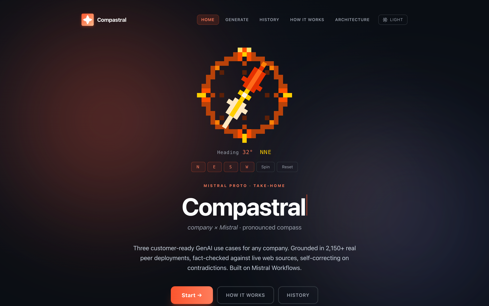
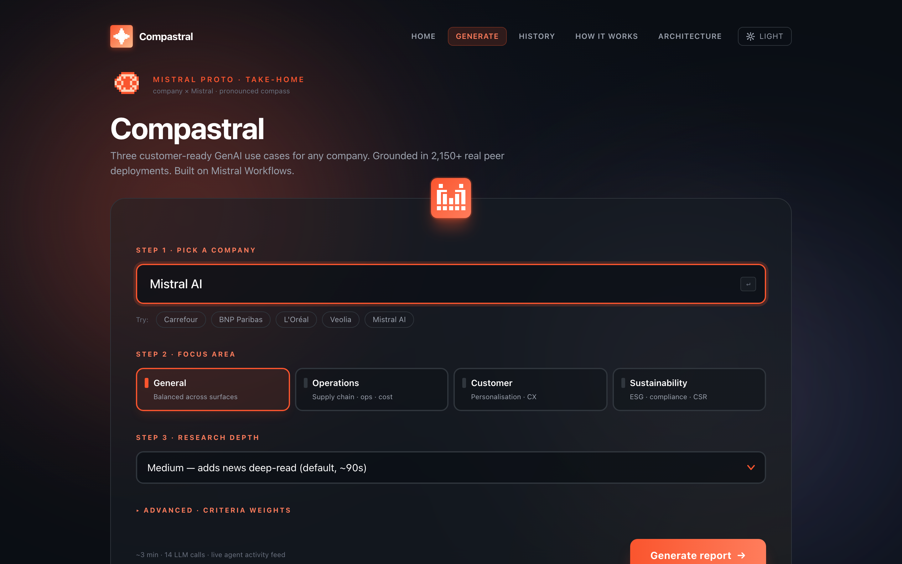
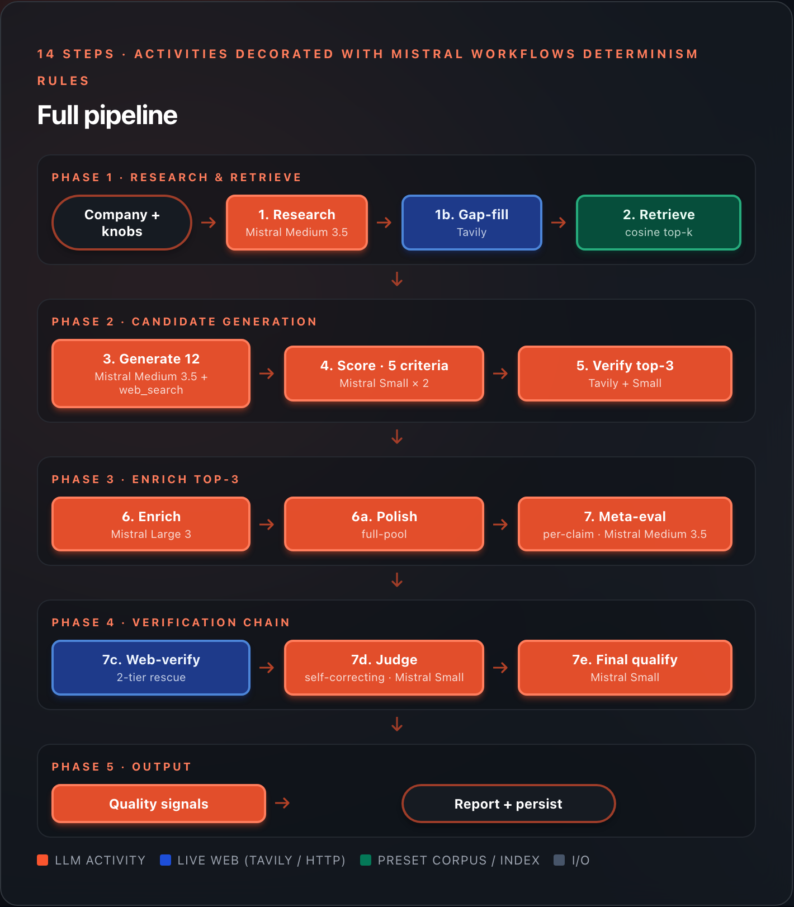

# Compastral

> **company × Mistral · pronounced compass**
>
> Three customer-ready GenAI use cases for any company, grounded in 2,150+ real peer deployments,
> fact-checked against the live web, **self-correcting on contradictions**. Built on Mistral Workflows.

[]()
[]()
[]()
[]()



---

## What this is

Take-home for the **Mistral Proto Team Applied AI Engineer** role. Goal: take a company name, return three relevant, iconic, high-impact GenAI use cases. The system runs on Mistral Workflows, publishes to Le Chat as an assistant, and ships a polished standalone web app with live agent activity, structured cards, run history, and a grounding-data explorer.

The Mistral team's evaluation criteria — methodology, architecture, code quality, documentation, output quality — are listed in [`CLAUDE.md`](CLAUDE.md). Every commit was made with those in mind.

## Try it

**1. Standalone web app (Vercel + Render):**
- Live URL: [`https://compastral.vercel.app`](https://compastral.vercel.app)
- Type a company name (try `Carrefour` for the cleanest sample, `Mistral AI` to see the cat-ear logo Easter egg). Watch the live agent feed, get a structured report with grounding chips.

**2. Le Chat assistant:**
- **Direct link**: [`https://chat.mistral.ai/chat?workflow-version-id=019e0a06-e2f9-75a7-b0ca-c33aa6c4f3ba`](https://chat.mistral.ai/chat?workflow-version-id=019e0a06-e2f9-75a7-b0ca-c33aa6c4f3ba) — click to open Le Chat with the **GenAI Use Case Generator** workflow pre-loaded. Type a company name (`Apple`, `Carrefour`, `Hermes`…) — entity resolution canonicalises the input upfront, the full pipeline runs (~2-4 min on standard tier) with live progress, and the final report renders inline with structured cards + mermaid blueprints.
- Alternative: `chat.mistral.ai` → Assistants → search **"GenAI Use Case Generator"** → Install → chat.
- See [`docs/publish_le_chat.md`](docs/publish_le_chat.md) for publish steps.

**3. Locally (CLI):**
```bash
git clone https://github.com/alidor4702/genai-usecase-generator.git
cd genai-usecase-generator
uv sync
cp .env.example .env       # paste MISTRAL_API_KEY + TAVILY_API_KEY
uv run python -m scripts.run_example "Carrefour" --out docs/examples/local/carrefour.md
```

## What good output looks like

For Carrefour (v9.8, latest batches in [`docs/benchmarks/v9_4/`](docs/benchmarks/v9_4) through [`docs/benchmarks/v9_9/`](docs/benchmarks/v9_9)):

- **Source-anchored claim ratio:** 83-92% across recent runs (24-26 substantive claims with explicit source support)
- **Meta-evaluator confidence:** 0.65-0.92 depending on run (SE-ready bar: ≥ 0.80 since v9.8)
- **Per-claim transparency block** with chips: `[verified ↗ Reuters]` / `[corrected ↗ → 56 countries]` / `[judge: rejected]` / `[rewritten qualitatively]`
- Three customer-ready use cases:
  1. *AI-powered own-brand nutritional insight engine for the 14k-store network*
  2. *Dynamic promotion optimizer for perishable inventory across European hypermarkets*
  3. *Supplier-ESG risk-scoring agent on Carrefour's 50k-supplier base*
- Each with: refined description, why-this-company, example user query + system output, blueprint mermaid (color-coded by pattern), TTV estimate (precedent-anchored or honestly tagged "ballpark"), top implementation risk, Mistral product picks, citations linked to a per-run grounding database.



## The system at a glance



```
Company name + knobs
   │
   0. Resolve entity (Mistral Small) — canonicalise short names → "Apple" → "Apple Inc."
                                      → refuse gibberish / empty in 1-2s
   1. Research (Wikipedia + news + jobs + existing AI initiatives)
   1b. Gap-fill targeted Tavily searches
   2. Retrieve top-k peer precedents (cosine over 2,150 corpus)
   3. Generate 8 candidates (Mistral Medium + web_search tool, ≥3 novel)
   4. Score against 5 criteria (Mistral Small × 2 self-consistency)
   5. Verify top-3 via Tavily + duplicate-detection + supporting-snippet extraction
   6. Select + enrich top-3 (Mistral Large 3, customer-ready prose)
   6a. Polish (strict citation discipline: cite only on exact entity AND figure match)
   6b. (max tier only) Critique + revise (Mistral Large 3 second pass)
   7. Meta-evaluate (per-claim source verification, atomic claim splitting)
   7c. Web-verify rescue (Tavily; 2-tier credibility)
   7d. Source-judge (3-verdict: supported / corrected / unsupported)
   7e. Final qualify (surgical rewrite of unsupported numerics)
        │
        ↓
   Persisted Report → SQLite runs table → /history page
        │
        ↓
   Renders: standalone web app · Le Chat assistant · CLI markdown
```

The system has **four user surfaces**:

| Surface | Where | What it does |
|---|---|---|
| **Standalone web app** | Vercel + Render (FastAPI + Next.js) | Live agent activity feed (SSE), structured use case cards, theme toggle, run history, grounding explorer |
| **Le Chat assistant** | `chat.mistral.ai` (after publish) | Chat-native UX with `ConfirmationInput` + live `TodoList` progress + chunked-markdown final output |
| **CLI** | `scripts/run_example.py` | Static markdown report + execution trace + grounding addendum, written to disk |
| **API** | FastAPI on Render | `/generate`, `/status`, `/events` (SSE), `/report`, `/grounding`, `/runs`, `/runs/{id}` |

## Methodology

Five scoring criteria with configurable weights:

| Criterion | What it asks |
|---|---|
| **Relevance** | Touches a core business workflow at scale, with the data and stated priorities to make it work |
| **Iconic potential** | Visibly distinctive for THIS company AND not already done by them (hard gate) |
| **Estimated impact** | Measurable financial or strategic value, anchored to peer deployments |
| **Feasibility** | Shippable with current GenAI tech in a customer engagement timeline |
| **Mistral suitability** | Leans into Mistral's distinctive strengths (sovereignty, open-weight, multilingual, cost) |

**Three principles drive the design:**

1. **Proven-elsewhere vs already-done-here** — the system distinguishes "peer companies have proven this is feasible" (positive signal) from "this company has already deployed it" (hard disqualifier). Filtered across four layers: existing-initiatives during research, hard score cap on iconic-potential, per-candidate Tavily verification, meta-eval cross-cutting concern.
2. **Grounding, not derivation** — precedents are evidence of feasibility, not templates. The generator must produce ≥3/12 candidates as `novel_direction` (combinations, original framings).
3. **Refusal as a feature** — when research signal is too sparse to confidently generate, the system refuses gracefully and asks for more context, never fabricates.

Full methodology rationale in [`docs/methodology.md`](docs/methodology.md).

## The verification chain (how the v9.8 system anchors claims)

The most distinctive part of this build is what happens AFTER the LLM
produces the prose. Every substantive claim runs the same gauntlet:

```
Substantive claim from prose
    │
    └── Anchored in evidence pool? ── yes ──→ supported (source_kind=evidence:ev-id)
                                  └── no  ──→ Web-verify Tavily search
                                                 │
                                                 └── Domain allowlisted? ──→ supported (rescue_tier=verified)
                                                 └── Entity/number anchor? → supported (rescue_tier=corroborated)
                                                 └── Nothing? ────────────→ unsupported
    │
    Source-judge: for every supported claim with a resolvable URL OR
    supporting_signal text, ask Mistral Small "does this source actually support?":
        ├── supported     → render with citation
        ├── corrected     → patch prose with source's actual value, add [corrected ↗] chip
        └── unsupported   → flip back, judge_rejected chip
    │
    Final qualify: any still-unsupported numeric/named claim → surgical
                   qualitative rewrite
    │
    Pass-rate metric: excludes qualified_out (the prose no longer asserts them)
    Confidence: re-anchor on new pass-rate, qual_delta clamped [-0.15, +0.10]
    │
    Persist Report to SQLite runs table → /history page can replay later
```

Three things this design enforces:

- **Every numerical or named-entity claim has an explicit source URL** (or it's qualified out of the prose). The user sees `[verified ↗ Reuters]`, `[corrected ↗ → 56 countries]`, `[judge: rejected]`, or `[rewritten qualitatively]` chips in the per-claim transparency block.
- **The judge catches false-positive citations** — a YouTube video titled "LVMH × AI" doesn't anchor a "LVMH reported 25% efficiency gain" claim, even though it contains the entity. Source-judge is the v7 gate that catches this class.
- **The system self-corrects when sources contradict** — if the prose says "12 European languages" and the source says "9 European languages", the judge returns the corrected value as a drop-in phrase; the system patches the prose inline and marks the claim with a `[corrected ↗ → 9 European languages]` chip.

**Sales-engineer-ready threshold: confidence ≥ 0.80**. Below 0.80 the
banner suggests revision; the system never ships prose that asserts an
unverified specific (those are rewritten qualitatively first).

Full chain visualised on the [`/architecture`](https://compastral.vercel.app/architecture) page with clickable step detail.

> The verification chain went through ten versions of iteration before
> landing on this shape. The version-by-version history is in
> [`docs/changelog.md`](docs/changelog.md) for anyone curious about *why*
> each piece is the way it is.

## Tech stack

### Backend
- **Python 3.12, async throughout**
- **Mistral Workflows SDK** with `mistralai` plugin (`uv add 'mistralai-workflows[mistralai]'`)
- **FastAPI** for the standalone-app surface
- **Pydantic v2** for all validation
- **`mistralai`** (official async LLM client)
- **`httpx`** for async HTTP
- **`rapidfuzz`** for verified-companies fuzzy matching
- **`selectolax`** for HTML parsing
- **`Playwright` + Lightpanda CDP backend** as fallback for JS-heavy career pages
- **`uv`** for dependency management
- **`ruff`** (lint + format), **`pyright`** (strict mode), **`pytest`**

### Mistral models (locked)

| Step | Model | Temperature |
|---|---|---|
| **Entity resolution (Step 0)** | `mistral-small-2603` | 0.1 |
| Research synthesis | `mistral-medium-2604` (Mistral Medium 3.5) | 0.2 |
| Industry label polish | `mistral-small-2603` | 0.1 |
| Generation | `mistral-medium-2604` | 0.7 |
| Scoring (self-consistency × 2) | `mistral-small-2603` | 0.2 then 0.4 |
| Per-candidate verification | `mistral-small-2603` | 0.1 |
| Selection + enrichment | `mistral-large-2512` (Mistral Large 3) | 0.4 |
| Polish (std/fast: skip on fast) | `mistral-small-2603` | 0.1 |
| **Polish (max tier)** | `mistral-large-2512` (Mistral Large 3) | 0.1 |
| **Critique + revise (max tier)** | `mistral-large-2512` (Mistral Large 3) | 0.3 |
| Meta-evaluation | `mistral-medium-2604` | 0.1 |
| Source-judge | `mistral-small-2603` | 0.1 |
| Final qualify | `mistral-small-2603` | 0.1 |
| Embeddings | `mistral-embed` | — |

### Research and data
- Wikipedia / Wikidata REST APIs (no auth)
- Tavily Search API (news + per-candidate verification + web_search tool + rescue layer)
- SQLite for the data layer (companies index, precedent corpus, cache, **runs history**)
- numpy in-memory matrix for embedding similarity at prototype scale
- Production migration path: Postgres + pgvector + Redis (mentioned only)

### Frontend (standalone web app)
- **Next.js 14** App Router · **TypeScript strict mode**
- **Tailwind CSS** with Mistral palette + light/dark mode (cookie-persisted, smooth fade transition)
- **`react-markdown`** + **`remark-gfm`**
- **`mermaid.js`** with custom per-node-type + per-blueprint-pattern color decoration
- **EventSource** for SSE live agent feed

### Deployment
- **Render** for FastAPI backend (`render.yaml` blueprint) + worker for Le Chat assistant
- **Vercel** for Next.js frontend (`standalone/vercel.json`)
- Auto-deploy on every push to `main`

## Engineering rigor

- **Workflow class is deterministic** — no `datetime.now()`, no `random()`, no I/O in `src/workflow.py`. Mistral Workflows replays workflow history; non-determinism breaks replay.
- **Every side effect lives in an activity** — every LLM call, web fetch, DB read, embedding has explicit `start_to_close_timeout`.
- **Typed boundaries** — every activity has Pydantic input + Pydantic output. Every LLM call uses `response_format` with a JSON schema. No prose-parsing downstream.
- **`pyright --strict` clean** on the source tree.
- **44 tests** (`pytest tests/`) covering the typed models, criteria scoring, quality signals, evidence ledger, phantom-claim filter, and rendering.
- **Prompt versioning** — all 16 system prompts live in `src/prompts.py` and `src/activities/*.py` constants; `docs/prompts.md` is the regenerated single source of truth.

## Persistence + history

Every completed run is persisted to a `runs` table in SQLite. The FE has a [`/history`](https://compastral.vercel.app/history) page listing all past runs, brief-rendered with company name, status chip (completed / refused / failed), confidence, fact-check pass rate, duration, "X ago" timestamp. Click any one to re-open the full structured report (cards, blueprints, fact-check transparency) without re-running the pipeline.

```
SQLite schema (runs table):
  run_id TEXT PRIMARY KEY
  company_name TEXT
  status TEXT                    -- completed / refused / failed
  started_at INTEGER             -- unix epoch
  completed_at INTEGER
  fact_check_pass_rate REAL
  meta_eval_confidence REAL
  sales_engineer_ready INTEGER
  report_json TEXT               -- full Report.model_dump_json()
  report_markdown TEXT
  refusal_reason TEXT
  error TEXT
```

Auto-saves in the FastAPI background-task `finally:` block (best-effort — a persistence failure doesn't mask the actual run outcome).

> **Render free-tier caveat:** the live deployment uses a free Render web service. The free tier wipes its filesystem on every cold start (the service spins down after ~15 min idle), so the SQLite `runs` table resets to empty between sessions. **Runs older than the most recent warm-up window will not appear on `/history`.** Production migration paths: Render Starter ($7/mo, service stays warm), Render's Persistent Disk add-on (~$1/mo for 1GB), or Postgres on Render's free tier (per `docs/architecture.md` "Production migration path"). For local CLI use the SQLite at `data/genai_usecases.db` is durable.

## Grounding explorer

For every run, [`/grounding/{run_id}`](https://compastral.vercel.app/grounding/) shows every source the pipeline read — Wikipedia, news, Tavily, per-candidate verification, web-verify rescue, claim-verification — with full metadata + content excerpt. Filter by source kind, by use case, full-text search. Plus a **Used / Not-used** summary at the top showing which retrieval paths fired vs which were available but didn't trigger this run (e.g. depth=low → no jobs / no news).

CLI runs also write a `<company>_grounding.md` companion file alongside the report, with the same data as a static appendix.

## Running locally

### Prerequisites
- Python 3.12+
- `uv` (`brew install uv` or `pipx install uv`)
- `MISTRAL_API_KEY` and `TAVILY_API_KEY` in `.env`

### CLI
```bash
uv sync
cp .env.example .env       # paste keys
uv run python -m scripts.run_example "Carrefour" \
    --focus general --depth medium \
    --out docs/examples/local/carrefour.md
```

### Standalone web app (FastAPI + Next.js)
```bash
# Backend
uv run uvicorn src.api:app --reload --port 8000

# Frontend (in another terminal)
cd standalone
npm install
NEXT_PUBLIC_API_URL=http://127.0.0.1:8000 npm run dev
# → open http://localhost:3000
```

### Le Chat worker (publish to Le Chat)
```bash
uv run python -m scripts.run_worker
# leave running; assistant becomes invokable in Le Chat
```

See [`docs/publish_le_chat.md`](docs/publish_le_chat.md) for the publish flow.

### Tests + lint
```bash
uv run pytest tests/ -q
uv run ruff check src/ --select F
uv run pyright src/
```

## Data sources

Two narrow places + a lot of live web. Full breakdown in [`docs/data_sources.md`](docs/data_sources.md).

| Type | Source | Where |
|---|---|---|
| **PRESET (closed corpus)** | Precedent corpus | `data/genai_usecases.db` (~2,150 entries — Google Cloud customer stories + Evidently AI blueprints + Google Cloud blueprints) |
| **PRESET** | Verified-companies index | `data/companies_raw.jsonl` (hand-curated; rapidfuzz match → confidence boost) |
| **PRESET** | Web-verify allowlist | `src/web_verify.py:_ALLOWLIST_DOMAINS` (Reuters, FT, Bloomberg, Le Monde, gov.fr, europa.eu, …) |
| **LIVE WEB** | Wikipedia / Wikidata | `en.wikipedia.org` REST API + Wikidata SPARQL |
| **LIVE WEB** | Tavily | News search, per-candidate verification, web_search tool, web-verify rescue |
| **LIVE WEB** | Direct HTTP | News article deep-reads, career pages (with Playwright fallback) |

The fact-check rescue chain (web-verify + source-judge) is **fully live web**, gated by the curated allowlist for tier-1 trust.

## Repository layout

```
.
├── README.md                       # this file
├── pyproject.toml                  # deps, ruff, pyright config
├── render.yaml                     # Render blueprint (api + worker)
├── standalone/                     # Next.js 14 standalone web app
│   ├── vercel.json
│   └── app/
│       ├── page.tsx                # / Landing (8-bit compass + typewriter)
│       ├── generate/page.tsx       # /generate (form + live agent feed)
│       ├── history/                # /history + /history/[runId]
│       ├── grounding/[runId]/      # /grounding/[runId]
│       ├── how-it-works/page.tsx   # non-technical explainer
│       ├── architecture/page.tsx   # technical reference
│       └── components/             # PhaseIcon, UseCaseCard, MermaidDiagram, …
├── src/
│   ├── workflow.py                 # InteractiveWorkflow class (deterministic)
│   ├── api.py                      # FastAPI surface
│   ├── activities/                 # one file per pipeline step
│   │   ├── research.py             # research synthesis + gap-fill + Layer-2
│   │   ├── retrieve.py
│   │   ├── generate.py
│   │   ├── score.py
│   │   ├── verify_per_candidate.py
│   │   ├── select_enrich.py        # selection + enrich + polish + attribution
│   │   ├── meta_evaluate.py
│   │   ├── web_verify.py           # 2-tier rescue
│   │   ├── source_judge.py         # 3-verdict judge incl. corrected
│   │   ├── final_qualify.py
│   │   └── compute_signals.py
│   ├── research/                   # Wikipedia, news, jobs, existing initiatives
│   ├── ui/render.py                # markdown + components renderers
│   ├── models.py                   # all Pydantic models
│   ├── criteria.py                 # five criteria + default weights
│   ├── prompts.py                  # GENERATION/SCORING/VERIFICATION/ENRICHMENT/META prompts
│   ├── precedents.py               # corpus loading + retrieval (cosine + MMR)
│   ├── db.py                       # SQLite layer (cache + precedents + companies + runs)
│   ├── cache.py
│   └── web_verify.py               # credibility classifier (allowlist + anchor)
├── docs/
│   ├── methodology.md
│   ├── architecture.md
│   ├── prompts.md                  # all 16 live prompts (regenerated from code)
│   ├── data_sources.md             # PRESET vs LIVE WEB classification
│   ├── explainer.md                # plain-English pipeline walkthrough
│   ├── publish_le_chat.md
│   ├── deploy.md
│   └── examples/                   # v1 → v9.1 example outputs (5 companies each)
├── data/
│   ├── genai_usecases.db           # 50 MB, prebuilt corpus
│   ├── companies_raw.jsonl
│   └── raw/                        # raw inputs for build scripts
├── tests/
│   ├── test_models.py
│   ├── test_criteria.py
│   ├── test_quality_signals.py
│   └── …
└── scripts/
    ├── run_example.py              # CLI entry point
    ├── run_worker.py               # registers workflow with Mistral runtime
    ├── build_data.py               # corpus build (gcloud + evidently + wikidata + embed)
    └── …
```

## Cost characteristics

Per run, at `tier=standard`:
- **~14 LLM calls** (research synthesis, industry-label polish, gap-fill × 4, generation, scoring × 2, per-candidate verification × 3, enrichment, polish, meta-eval, judge × ~25 pairs, final-qualify × 3) — ~$0.10-0.20 in Mistral API credits
- **~10-15 Tavily searches** (news, gap-fill, per-candidate verify, web-verify rescue) — ~$0.05-0.10
- **~5-10 HTTP fetches** (Wikipedia, news deep-reads) — free
- **~250s wall-clock** end-to-end (down from 5+ min in v8 after the v9 perf passes)

Total ~$0.20-0.30 per run.

## Quality and evaluation

Five-company canonical benchmark (Carrefour, Veolia, BNP Paribas, L'Oréal, Mistral AI), tracked across versions in [`docs/examples/`](docs/examples). Each version's outputs are committed alongside their execution traces (`*_trace.md`) and grounding addenda (`*_grounding.md`).

Latest batches (v9.8 + v9.9, 22 runs across 16 fresh companies + 2 refusal cases):
- **Hermès** (standard, 0.79 / 94% source-anchored) — best-case all-time on a luxury / artisan-heritage brand
- **L'Oréal** (standard run 3, **0.88 / 88%** ✓ SE-ready since the bar is now 0.80)
- **Carrefour** (standard, 0.68 / 83% — solid; the chain caught a `50+ proprietary brands` → `just under 30` correction inline)
- **BNP Paribas** (standard, 0.85 / 100%) — every substantive claim source-anchored
- **Entity resolution refusals** — `asdfqwerty` rejected in 0.6s, `ZYX Corporation` in 2.0s, before any pipeline LLM work
- **Apple** scores low (0.35) — diagnosed as research-density limit (Apple is famously secretive); the system is honest about what it can/can't source rather than fabricating

Quality signals computed per run: LLM-graded diversity, LLM-graded specificity per use case, Mistral product diversity, fact-check pass rate, TTV/cost-tier spread, source coverage. All visible in the report's quality footer.

## Known limitations

- **AI-vendor-as-target produces tautological proposals.** When the target IS Mistral / OpenAI / Anthropic, the framing breaks down. Documented; would need a prompt branch to address.
- **Precedent corpus is closed (~2,150 deployments).** Every `inspired_by` reference must live in `data/genai_usecases.db`. Free-text peer references are allowed (with the v6 quantitative-attribution rule).
- **Tier-2 corroborated rescues use regex anchor matching.** v9 source-judge is the corrective layer; if the LLM judge call fails (transient API error), the system fails open and keeps the corroboration.
- **v9.2 inference-from-context is a heuristic.** The judge accepts "Paris HQ" → "EU regulatory alignment" via geographic logic. Most of the time this is right; occasionally over-permissive.

## What I'd add with more time

- **Score self-consistency ablation.** Step 4 runs two passes (T=0.2 + T=0.4) for ~18s/run cost; never measured against a single pass at T=0.3 to confirm the marginal value.
- **Parallelize enrichment per use case.** Save ~30s but risks regression in Mistral product diversity / cross-cutting concern handling — needs a 5-company A/B before deciding.
- **Real-time event-driven cache invalidation.** Hook into news APIs to force-refresh when a company has a major announcement.
- **Earnings call and 10-K ingestion.** For public companies, parse recent transcripts and SEC filings.
- **Multi-language reports.** Generate in the company's primary geography's language (French for Veolia, etc.).
- **Production migration.** Postgres + pgvector for embeddings, Redis for cache. Same code paths, different connection strings.
- **Active corpus expansion.** When a generated use case is judged high-quality, write it back to the precedent corpus.

## Prior work

The methodology builds on a few canonical references:
- The "proven-elsewhere vs already-done-here" distinction is core to applied-AI use-case discovery.
- The five-criteria rubric is the union of standard "GenAI use case prioritization" frameworks (Gartner / McKinsey / Forrester).
- Self-consistency in scoring is from [Wang et al. 2022](https://arxiv.org/abs/2203.11171).
- The corrected-verdict pattern (replace contradicted values with source values inline) is novel here, IIRC — it was designed in the v8→v9 conversation as a response to the v8 over-rejection problem.

## Submission notes

This take-home was built over [~7 days of iterative work](https://github.com/alidor4702/genai-usecase-generator/commits/main). The full timeline is visible in the git log; major milestones tagged in commit messages (v6 / v6 audit / v7 / v7.1 / v8 / v9 / v9.1 / v9.2). All 9 versions of the 5-company canonical batch are committed under `docs/examples/v*/` so reviewers can read the actual generated reports + execution traces + grounding addenda without running anything.

For questions: alidor4702@gmail.com.

---

<sub>Built for the Mistral Proto Team Applied AI Engineer take-home · 2026 · Compastral 🧭</sub>
