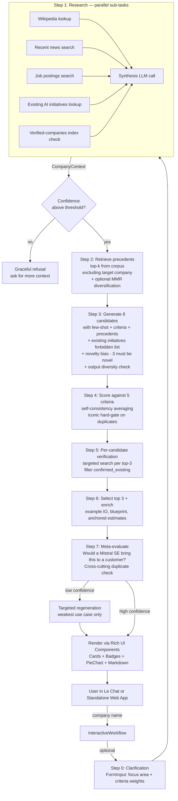

# Architecture

## High-level diagram



## Workflow class structure

The workflow extends `InteractiveWorkflow` from the Mistral Workflows SDK and is published with the Mistral plugin (`uv add 'mistralai-workflows[mistralai]'`). Its entrypoint returns `ChatAssistantWorkflowOutput` so the workflow can be installed as a Le Chat assistant.

The class skeleton:

```python
import mistralai.workflows as workflows
import mistralai.workflows.plugins.mistralai as workflows_mistralai
from datetime import timedelta

@workflows.workflow.define(
    name="genai-usecase-generator",
    workflow_display_name="GenAI Use Case Generator",
    workflow_description="Generates 3 relevant, iconic, high-impact GenAI use cases for a specific company",
    execution_timeout=timedelta(minutes=15),
)
class GenAIUseCaseWorkflow(workflows.InteractiveWorkflow):
    def __init__(self) -> None:
        super().__init__()
        # All state is set inside activities; the workflow only orchestrates
        self.current_step: str = "initialized"
        self.company_name: str | None = None

    @workflows.workflow.entrypoint
    async def run(self, params: WorkflowInput) -> workflows_mistralai.ChatAssistantWorkflowOutput:
        ...

    @workflows.workflow.query(name="get_status", description="Get current workflow progress")
    def get_status(self) -> WorkflowStatus:
        return WorkflowStatus(
            company=self.company_name,
            current_step=self.current_step,
        )
```

### Determinism — non-negotiable constraint

Workflow code (the orchestrator class) MUST be deterministic. The Mistral Workflows runtime replays workflow code from history when workers restart, and any non-determinism breaks the replay. This means:

- **No `datetime.now()`, `time.time()`, `random.random()` in the workflow class.** If a timestamp or random value is needed, retrieve it inside an activity and return it.
- **No direct I/O — no HTTP, no DB, no file reads — in the workflow class.** All side effects live in activities.
- **No system-state dependencies.** The workflow's behavior must be reproducible given the same input and the same activity outputs.

The workflow class is pure orchestration: branching, sequencing, calling activities, waiting for inputs. Every LLM call, web fetch, DB read, and embedding computation is an activity.

### Activity timeouts

Each activity is invoked with an explicit `start_to_close_timeout` to bound how long it can run. Without this, an unresponsive activity blocks the workflow indefinitely. Per activity:

- LLM calls (generate, score, enrich, meta-eval): 120 seconds
- Research sub-tasks (Wikipedia, news, jobs, existing initiatives): 60 seconds
- Embedding calls: 30 seconds
- Verified-companies index lookup (local): 5 seconds
- Per-candidate verification: 60 seconds

The total `execution_timeout` on the workflow is 15 minutes, well above the worst-case sum of activities. This is bounded total wall-clock time, not per-activity.

## Workflow interaction primitives

The Mistral Workflows SDK provides four primitives for interacting with running workflows. We use Queries actively; the others are documented because they shape the platform we're building on, and a few are useful for the standalone web app or production debugging.

### Queries (used)

`@workflow.query` exposes read-only state to external clients. The standalone web app polls workflow progress: which step is currently running (e.g. `research`, `generate`, `meta_evaluate`), what the current progress percentage is. The query handler is synchronous and side-effect-free, returning a snapshot of internal state.

> **Note:** earlier drafts described a `TodoListItem` in this query. We tested both the SDK's `TodoList` primitive (renders as a sidebar checklist) and per-phase `ChatAssistantWorkingTask` blocks (render as inline thinking indicators in the chat), and shipped the latter — TodoList rendered in a different surface than where the user expects pipeline progress. The query exposes `current_step` directly; the FE maps it to a per-phase progress bar.

```python
@workflows.workflow.query(name="get_status", description="Get current workflow progress")
def get_status(self) -> WorkflowStatus:
    return WorkflowStatus(
        current_step=self.current_step,
        progress_percent=self.progress,
    )
```

The standalone app's UI hits this query every second or two during a run to update its progress indicator without waiting for the final output.

### Signals (available, not used in MVP)

`@workflow.signal` lets external callers send fire-and-forget messages to a running workflow — used for things like "cancel this run" or "user provided more context, here it is." The workflow handles signals asynchronously and updates state. We could plug a "cancel run" signal into the standalone app's UI; it's not in MVP but the primitive is worth knowing.

### Updates (available, not used in MVP)

`@workflow.update` is like a signal but the caller awaits a response. Useful for mid-run configuration changes — for example, "I want to re-weight the criteria, here's the new weights, give me back the resulting recomputed scores." Not in MVP scope but the primitive supports a richer interactive experience if we extend.

### Reset (development-only)

`client.workflows.executions.reset_workflow(...)` lets us replay a workflow from a specific event in history with updated code. Useful when debugging a stuck or buggy run during development — fix the bug, reset to before the bad event, let the workflow continue. We don't expose this in production but it's part of our dev workflow.

## Pipeline stages — what each does and why

### Step 0: Clarification (optional, conversational)

Implemented as a `FormInput` exposed via `wait_for_input`. The form has two fields:

- A `SingleChoice` field for focus area: Operations / Customer / Sustainability / General. Defaults to General.
- An "advanced settings" section with five `NumberField`s (each `minimum=0, maximum=1`) for the criteria weights. Defaults to 0.2 each.

Skipping the form is fine — the workflow proceeds with defaults. Adjusting it is for power users.

This step exists because Proto Team customer engagements always have a scope conversation early. Including it in the workflow mirrors the real engagement.

### Step 1: Research (parallel)

Multiple sub-tasks run concurrently via `asyncio.gather`:

- **Wikipedia structured fetch** — stable company facts (industry, geography, business model, founding context). Uses the official Wikipedia/Wikidata REST API, no scraping.
- **Recent news search** — strategic announcements, product launches, M&A in the last 12 months. Uses Tavily Search API for AI-friendly snippet extraction. **Deep-read pattern:** the activity does not rely on Tavily's snippets alone. For the top 2-3 most relevant results, it fetches the full article via `httpx`, extracts the main content with `selectolax`, and feeds the actual paragraphs (not just headlines and one-sentence snippets) into the synthesis call. This avoids the failure mode where a misleading title produces a spurious signal.
- **Job postings search** — what AI/ML/data roles is the company hiring for, indicating direction and ambition. Uses `httpx` for direct fetches against career pages, with a Playwright + Lightpanda fallback for JS-heavy sites where direct fetch returns no usable content. Lightpanda is used for its 11x speed and 9x memory advantages over headless Chrome at any concurrency above trivial.
- **Existing AI initiatives lookup** — searches for "[company] AI", "[company] generative AI", "[company] machine learning" across web search and the company's engineering blog if present. Same deep-read pattern as news search: top 2-3 hits get fully fetched and parsed, not just snippet-skimmed. Also queries the precedent corpus for any target-company entries and includes those as confirmed initiatives. Returns a structured list of `existing_initiatives` with description, source, and confidence per initiative.
- **Verified-companies index check** — fuzzy match against a Wikidata-derived local index of ~100k-500k company entries using rapidfuzz, deterministically setting `is_verified=True` and boosting confidence when matched. Pure local lookup, no network call.

A synthesis LLM call (Mistral Medium 3.5, T=0.2) aggregates all five signals into a typed `CompanyContext`. The synthesis call also outputs a `research_confidence` field (0.0-1.0) reflecting how much grounded signal was found. This pattern follows Anthropic's orchestrator-worker model with parallel subagents.

A configurable depth toggle (low/medium/high) scales the number of parallel sub-tasks: low runs Wikipedia + verified + existing-initiatives only, medium adds news, high adds jobs. Default is medium. This follows Anthropic's principle of scaling effort to query complexity.

### Confidence gate

If `research_confidence < 0.5` AND `is_verified == False` AND no sub-task produced usable signal, the workflow refuses gracefully and asks the user for more context. The user's clarification gets folded back into a re-run of the synthesis call. This avoids fabrication on unknown companies but does not block the path for any company that has *any* discoverable signal.

### Step 2: Retrieve precedents

The company context is converted to an embedding query (`mistral-embed`) and used to retrieve the top-k (default 5-8) most similar entries from the precedent corpus. The corpus is preprocessed from three complementary sources during build: the Evidently AI 805-entry CSV (with deep-read of text-media links), the Google Cloud 1,001 use cases page, and the Google Cloud 101 technical blueprints page. Vendor-specific product names (Vertex AI, BigQuery, Bedrock, etc.) are stripped during preprocessing to avoid recommendation contamination. Each entry is normalized to a `{company, industry, title, description, outcome, deep_content, embedding}` shape — `deep_content` holds the fetched article body where available, null where the source was non-text.

The retrieval is filtered by industry — we only return precedents from the company's primary or sub-industries — to avoid noise. Within that industry filter, we rank by embedding similarity using cosine. An optional MMR (Maximal Marginal Relevance) pass diversifies the top-k to avoid returning near-duplicate precedents; this is enabled when the top-k similarity scores are too clustered (top entries within ε of each other).

**Important: the target company's own entries are excluded from retrieval.** They appear in the existing-initiatives context instead. This prevents the generator from being inspired by what the company itself has already done.

### Step 3: Generate candidates

A single LLM call (Mistral Medium 3.5, T=0.7) takes:

- The company context (typed, including existing initiatives)
- The user's focus area
- The criteria definitions (with positive and negative examples for each)
- 1-2 hand-curated few-shot examples of high-quality outputs for other companies (the single highest-impact technique for output quality)
- The retrieved peer precedents (formatted as labeled examples)

It generates 8 candidate use cases with structured Pydantic output (was 12 pre-v9.3; see `candidates_to_generate` in `src/config.py` for the configurable knob and `docs/benchmarks/findings.md` for the analysis that justified the cut). The schema includes title, description, why-this-company, estimated impact, suggested Mistral products, plus the provenance fields (`inspired_by`, `grounded_in`).

The prompt enforces two key constraints:

1. **No proposals that substantially duplicate existing initiatives** in the company context. Building on or extending an existing initiative is allowed if labeled clearly; substantially duplicating it is not.
2. **Novelty bias.** At least 3 of the candidates must be novel directions — extensions, combinations, or original framings that aren't direct adaptations of any single precedent. Precedents are evidence of what's feasible, not templates to copy.

8 candidates beats 3 directly because the scoring step needs options to filter. Generating only 3 means the scorer has nothing to choose from; the generator's first three guesses are not always its best three. We piloted at 12 and benchmarked 5 / 8 / 12 in Phase 3a — confidence at N=5 dropped meaningfully, N=8 and N=12 were a wash, so 8 became the v9.3 default. See `docs/benchmarks/findings.md`.

The prompt structure follows known LLM attention patterns: system framing first, criteria and context in the middle, generation task at the end.

**Output diversity check.** After generation, a cheap cosine similarity check runs across the candidate description embeddings. If average pairwise similarity is too high (the generator produced 12 variations of the same idea), the generator is re-run with an explicit "diversify your candidates more — the previous attempt was repetitive" instruction. This catches the boring-output failure mode automatically.

#### Streaming generation (optional)

The Mistral Workflows SDK provides `RemoteSession(stream=True)` plus `Runner.run`, which auto-streams agent token output to the UI as it's generated. We can optionally use this for the candidate generation step so the user sees candidates appearing in real time rather than waiting 30+ seconds for the full batch:

```python
session = workflows_mistralai.RemoteSession(stream=True)
generator_agent = workflows_mistralai.Agent(
    model="mistral-medium-2604",
    name="usecase-generator",
    instructions=GENERATION_PROMPT,
)

await workflows_mistralai.Runner.run(
    agent=generator_agent,
    inputs=generation_input_serialized,
    session=session,
)
```

Trade-off: streaming gives nicer UX for longer steps but the structured output validation becomes harder to enforce (we can't reject malformed JSON until the stream completes). For the demo, we keep the generation step non-streaming because we need the structured Pydantic output, and use streaming only if we add a separate "explanation" agent step that produces free-form prose.

### Step 4: Score against criteria

A judge LLM call (Mistral Small 4, T=0.2) evaluates each candidate against all five criteria, producing per-dimension scores (1-10) and per-dimension rationales. This follows Anthropic's validated single-call rubric pattern.

The scorer is shown the company's existing initiatives. Iconic scoring includes a hard gate: if a candidate substantially overlaps with an existing initiative, iconic score is capped at 1-2 regardless of other merits.

The call is run twice at slightly different temperatures (0.2 and 0.4) and the scores averaged — self-consistency — to reduce single-call noise. Self-consistency is only applied here because the scorer is the cheapest LLM call in the pipeline and the most quality-sensitive to noise.

Aggregate scores are computed using the user's criteria weights (or defaults: 20% each). Top three by aggregate score are selected. Two near-misses are kept for the rejected appendix.

### Step 5: Per-candidate verification

For each of the top 3 candidates, a targeted verification activity runs:

- A focused web search via Tavily with the candidate's title and key entities + the company name (e.g. "Veolia AI-assisted leak detection smart meter network")
- **Deep-read pattern:** the top 1-2 most relevant results are fully fetched (not just snippet-skimmed) — the full article body is extracted via `httpx` + `selectolax` so the verifier sees the actual claims rather than potentially misleading titles
- A check against the company's engineering blog if one was identified during research
- An LLM call (Mistral Small 4, T=0.1) to interpret the deep-read content and decide: `pass`, `partial_overlap`, or `confirmed_existing`

If a candidate is `confirmed_existing`, it's filtered out and replaced with the highest-scoring near-miss from the rejected pool. If `partial_overlap`, the candidate proceeds but is annotated in the output with a note that this builds on existing work. `pass` candidates proceed unchanged.

This step is the precise complement to the broad existing-initiatives lookup in step 1. Together they form a four-layer defense (broad lookup, scorer hard-gate, per-candidate targeted verification, meta-evaluator final pass) against recommending what the company is already doing.

The cost of this step is ~3 web searches plus ~3-6 page fetches plus a small LLM interpretation call per workflow run, adding roughly $0.01-0.02 to total run cost.

### Step 6: Select and enrich

A single LLM call (Mistral Large 3, T=0.4) takes the top three candidates plus the company context and produces the final customer-ready output for each:

- Refined description
- "Why this company" explanation written for a customer audience
- Concrete example input and example output
- Implementation blueprint: which Mistral products + a mermaid architecture sketch (selected from a small library of blueprint patterns: RAG, agent-with-tools, document-AI pipeline, fine-tuned domain model, hybrid retrieval)
- Time-to-value estimate, anchored to precedents or "unknown"
- Operating cost tier (low/medium/high), anchored to precedents or "unknown"
- Top implementation risk

The activity also produces the rejected appendix: one-line explanations for the near-miss candidates and why they didn't make the cut.

The "anchored to precedents or unknown" rule prevents fabrication of confident estimates without basis. It is enforced in the prompt as a hard rule.

We use Mistral Large 3 here (rather than Medium) because the enrichment step has the highest output-quality requirements — this is the customer-facing prose.

### Step 7: Meta-evaluate

A reviewer LLM call (Mistral Medium 3.5, T=0.1) examines the complete final report and asks:

- Would a Mistral sales engineer confidently bring this to a customer meeting?
- What's the weakest individual use case, and why?
- What's the biggest cross-cutting concern (e.g. all three rely on the same data asset, or all three avoid the company's stated priority)?
- Does any proposal substantially duplicate something in the existing-initiatives list (last-line defense for the duplicate check)?
- For each substantive claim about the company, is it supported by the research context? (fact-check pass rate)

If the reviewer's confidence is below threshold (default 0.6), the workflow regenerates the single weakest use case with a targeted prompt that includes the reviewer's critique. At most one regeneration round per workflow run, to bound cost and latency. This follows MaRGen's Reviewer-Writer feedback pattern.

After regeneration (or if confidence was already high), the workflow renders the final output.

## Output rendering — Rich UI Components

The output uses the Mistral Workflows Rich UI Components plugin rather than a single markdown blob. The composition:

```python
from mistralai.workflows.plugins.mistralai.conversational_ui_components import (
    Badge, Card, Chart, Column, Markdown, PieChart, Row,
)

report = Column(
    children=[
        # Cover summary
        Markdown(content=f"## GenAI Use Cases for {company.name}\n\n{intro_text}"),

        # Three use case cards
        Row(
            children=[
                Card(
                    title=uc.title,
                    description=uc.summary,
                    children=[
                        Row(children=[
                            Badge(variant=impact_variant(uc), children=f"Impact: {uc.impact_tier}"),
                            Badge(variant=mistral_variant(uc), children=f"Mistral fit: {uc.mistral_score}/10"),
                            Badge(variant="default", children=uc.complexity_tier),
                        ]),
                        Markdown(content=uc.why_this_company),
                        # Architecture blueprint as a sub-canvas
                        ResourceOutput(resource=CanvasResource(
                            canvas=CanvasPayload(type="mermaid", title="Blueprint", content=uc.blueprint_mermaid)
                        )),
                    ],
                )
                for uc in report.top_use_cases
            ],
        ),

        # Cost analysis pie chart
        Card(
            title="Estimated cost distribution",
            children=[PieChart(data=cost_data)],
        ),

        # Rejected appendix
        Card(
            title="Considered but not selected",
            children=[Markdown(content=rejected_appendix_md)],
        ),

        # Quality signals footer
        Markdown(content=quality_footer_md),
    ],
)

return ChatAssistantWorkflowOutput(
    content=[ResourceOutput(resource=UIComponentResource(component=report))]
)
```

The advantages over a single markdown blob:

- Use case cards render as visually distinct units, not paragraphs
- Badges immediately communicate score tiers at a glance
- The cost pie chart is interpretable without reading text
- Mermaid blueprints render inline per use case
- The user can scan and pick the use case most relevant to them

For the standalone web app, the same logical structure renders via `react-markdown` + custom React components matching the visual hierarchy (Cards, Badges as styled divs, charts via Recharts, mermaid via mermaid.js).

### Canvas Editing for human-in-the-loop refinement

The Mistral Workflows SDK ships a `CanvasInput` primitive that lets the user edit a canvas inline in Le Chat — `send_assistant_message(..., canvas=canvas_resource)` followed by `wait_for_input(CanvasInput(canvas_uri=canvas_resource.uri, prompt="Any feedback?"))`. The edited content comes back to the workflow as `edited.canvas.content`.

This is a low-effort, high-impact addition for the post-MVP version: after producing the report, the workflow could pause and let the user push back on any of the three use cases — "use case 2 doesn't fit our regulatory environment, regenerate it" — and trigger a targeted regeneration of just that one use case. This is exactly the human-in-the-loop refinement pattern, as a built-in primitive rather than a custom UI build.

For the take-home MVP this is documented as a planned enhancement (see "What I'd add with more time" in the README) rather than scoped in. The primitive exists; we'd plug it in if we had a few extra days.

### Tool UI States — deliberately not used

The Mistral Workflows SDK provides `FileToolUIState`, `GenericToolUIState`, and `CommandToolUIState` for visualizing tool call execution (file ops, command ops, generic tool calls) within the chat UI. These are designed for code-execution agents that need to show "creating file X," "running command Y," etc. Our system doesn't perform file operations, command execution, or arbitrary tool calls visible to the user — our research sub-tasks are HTTP requests and our LLM calls are reasoning. So Tool UI States are not used. They are noted here only for completeness on Mistral platform coverage.

## Computed quality signals on the output

Before rendering, a small post-processing step computes and surfaces:

- **Diversity** — average pairwise cosine distance between the three selected use cases' description embeddings.
- **Specificity** — fraction of named-entity references in each use case that match named entities in the company context.
- **Mistral product diversity** — count of distinct Mistral products across the three use cases.
- **Time-to-value spread** — range of estimated time-to-value across the three use cases.
- **Cost-tier spread** — distribution of low/medium/high operating-cost tiers across the three.
- **Source coverage** — per use case, which research sources contributed evidence (via the `grounded_in` provenance field).
- **Risks** — top implementation risk per use case, surfaced by the meta-evaluator.
- **Fact-check pass rate** — a small verification LLM call checks each substantive claim about the company against the research context, including a final non-duplication check, returning pass/fail per claim.

These signals render as small badges + a single-line summary in a `Markdown` block at the bottom of the report.

## Data layer

The system uses **SQLite** as the local data layer for the prototype, with a clear migration path to Postgres + pgvector for production deployment.

SQLite hosts three tables:

| Table | Contents |
|---|---|
| `companies` | Verified-companies index (~100k-500k Wikidata-derived entries with name, aliases, industry, country, wikidata_id) |
| `precedents` | Curated precedent corpus (~150-300 entries with normalized `{company, industry, title, description, outcome, embedding}`) |
| `cache` | Persisted research cache: `(company_name, data_type, payload, fetched_at, ttl)` |

Why SQLite for the prototype:

- Zero infrastructure (single file, no server)
- Fast at this scale (sub-millisecond lookups)
- Persistence across process restarts (unlike pure in-memory dicts)
- Trivially portable (the entire data layer can be committed to the repo)
- Easy migration to Postgres later (same SQL, different connection)

Embeddings live as JSON arrays in the precedents table for the prototype. At ~300 entries, similarity search is a numpy dot-product over a small in-memory matrix loaded once at startup.

For the production migration mentioned in "what I'd add with more time": swap SQLite for Postgres, embeddings move to pgvector, the cache layer becomes Redis. Same code paths, different connection strings.

## Caching

Caching reduces cost and latency on repeated queries. The implementation follows tiered TTLs by data type, on the principle that not all company information ages at the same rate.

| Data type | TTL |
|---|---|
| Stable facts (Wikipedia) | 30 days |
| Recent news / press | 24 hours |
| Job postings | 48 hours |
| Existing AI initiatives | 7 days (changes slowly but does change) |
| Per-candidate verification searches | 7 days |
| Verified-list match | infinite (data is local) |
| Final generated report | not cached (parameter-dependent) |

Cache is keyed by `(company_name, data_type)`. The cache interface is abstracted: `Cache.get(key) / Cache.set(key, value, ttl)` with two backing implementations:

- **SQLite** for local development and standalone deployment (persistent across restarts, single-file, no infra)
- **Redis** for the production-scaled standalone deployment (multiple worker processes need shared cache state)

The workflow itself is cache-backend-agnostic.

Cache invalidation is purely TTL-based in the prototype. Event-driven invalidation (e.g. force-refresh news cache when a major news event hits) is mentioned in "What I'd add with more time."

## Stateless workflow runs

Each workflow execution is independent. The workflow does not maintain cross-run user state, prior queries, or session memory. This is by design: each report is a clean, reproducible analysis. Stateful interactions — refinement, follow-up questions about a generated report — happen in the Le Chat conversation layer outside the workflow.

This also means that running the workflow on Veolia and then on BNP Paribas does not contaminate the second run with Veolia context. Clean, predictable behavior.

## Two surfaces, one workflow

The same conversational workflow is exposed two ways:

1. **Le Chat assistant (public).** Published publicly to Le Chat's assistants directory as "GenAI Use Case Generator". Anyone with a Le Chat account can find it by name, install it with one click, type a company name, and receive the rich UI Component output inline. The conversational checkpoint (focus area, weights) renders as Le Chat's interactive `FormInput` UI. Public publishing was a deliberate choice — it removes friction for the reviewing team and demonstrates confidence in the output quality without staging.

2. **Standalone web app.** A Next.js + FastAPI thin shell that triggers the same Mistral Workflow via the Workflows API and renders the structured output. Hosted at a public URL so reviewers can use it without setup. The conversational checkpoint becomes a UI panel before generation. The app polls the FastAPI `/status/{run_id}` endpoint (which mirrors the workflow's `current_step` and `progress_percent` from internal state) for live progress.

The workflow logic is shared. The two surfaces differ only in how input is collected and output is rendered.

## Tech stack — summary

### Backend
- Python 3.12, async throughout
- Mistral Workflows SDK with `mistralai` plugin (`uv add 'mistralai-workflows[mistralai]'`)
- FastAPI (standalone-app surface only)
- Pydantic v2 (validation)
- mistralai (LLM client, async)
- httpx (async HTTP, replaces requests)
- rapidfuzz (fast fuzzy string matching for verified-companies lookup)
- uv (dependency management)
- ruff (lint + format)
- pyright (type checking, strict mode)
- pytest (testing)

### Mistral models used

| Step | Model | Reason |
|---|---|---|
| Research synthesis | Mistral Medium 3.5 (`mistral-medium-2604`) | Frontier-class for multi-source aggregation, cost-balanced |
| Generation (8 candidates, configurable) | Mistral Medium 3.5 (`mistral-medium-2604`) | Best balance of creativity and grounding for structured output |
| Scoring (with self-consistency) | Mistral Small 4 (`mistral-small-2603`) | Cheap, structured, fits the rubric task; self-consistency compensates for capacity |
| Per-candidate verification | Mistral Small 4 (`mistral-small-2603`) | Simple binary classification of search results |
| Selection and enrichment | Mistral Large 3 (`mistral-large-2512`) | Best-in-class for customer-facing polished prose |
| Meta-evaluation | Mistral Medium 3.5 (`mistral-medium-2604`) | Strong reasoning at moderate cost |
| Embeddings | Mistral Embed (`mistral-embed`) | Standard semantic embeddings, 1024-dim |

If the latency-quality tradeoff calls for it, the model selection is configurable at config-file level, not hardcoded in activities.

### Research sources
- Wikipedia/Wikidata REST APIs (free, no auth)
- Tavily Search API (news search and per-candidate verification searches)
- httpx for direct fetches (career pages, official press)
- Playwright + Lightpanda CDP fallback (only for JS-heavy career pages where httpx returns nothing)
- selectolax (fast HTML parsing for the rare scraping cases)

### Embeddings and retrieval
- mistral-embed (1024-dimensional embeddings)
- numpy in-memory matrix for cosine similarity (~300 precedents at prototype scale)
- Optional MMR pass for top-k diversification when results are too clustered
- pgvector mentioned as production migration path

### Storage
- SQLite (companies index, precedents, cache) for prototype
- Postgres + pgvector + Redis as production migration path (mentioned only)

### Frontend
- Next.js 14 with App Router
- TypeScript strict mode
- Tailwind CSS
- react-markdown + remark-gfm (markdown rendering)
- Recharts (chart rendering, mirroring the workflow's PieChart/Chart components)
- mermaid.js (architecture sketches)

### Deployment
- Backend + workflow worker on Render or Railway (free tier)
- Frontend on Vercel (free tier)
- Domain: free Vercel subdomain for demo

## Cost characteristics

Per-run cost depends on cache hit rate and research depth. For a fresh run on a medium-depth research setting (~5 LLM calls in research with deep-read overhead + 1 generation + 1 scoring with self-consistency + 3 per-candidate verifications with deep-read + 1 selection + 1 meta-eval + 1 fact-check), end-to-end cost is roughly $0.08-0.20 in API spend at current Mistral pricing. Repeat runs on the same company (cache hits on stable facts and news and prior verification searches) drop to roughly $0.03-0.06.

The deep-read pattern (fetching full article bodies for top search results rather than relying on snippets) adds ~$0.02 per run vs snippet-only — a deliberate quality investment. We pay for proper grounding rather than skimming headlines.

Anthropic's published research finds that multi-agent systems use roughly 15× the tokens of a single chat interaction; our single-run pipeline is closer to 7-9× because of fixed fan-out at the research step, deep-reading, and a fixed pipeline depth. We trade some breadth of search for predictable cost.

## Robustness and failure modes

| Failure | Detection | Response |
|---|---|---|
| Unknown company | research confidence < threshold AND not verified AND no sub-task signal | Graceful refusal asking for more context |
| LLM API rate limit | exception in activity | Workflow retry with backoff (built into Workflows runtime) |
| JS-heavy career page returns nothing via httpx | empty result from job postings sub-task | Fallback to Playwright + Lightpanda for that fetch |
| Single sub-research returns no signal | empty result | Synthesis call proceeds with reduced sources, lowering confidence |
| Generator produces too-similar candidates | diversity check below threshold | Regenerate with explicit "diversify your candidates" instruction |
| Generator proposes existing initiative | scorer iconic hard-gate triggers | Iconic score 1-2; candidate falls out of top 3 |
| Per-candidate verification finds confirmed existing implementation | verifier returns `confirmed_existing` | Filter the candidate; promote highest-scoring near-miss |
| Meta-evaluator catches duplicate that earlier layers missed | meta-eval flags duplicate | Targeted regeneration of that use case |
| Meta-evaluator low confidence | confidence < 0.6 | Targeted regeneration of weakest use case (one round) |
| Fact-check pass rate low | rate < 70% | Output proceeds but the metadata footer surfaces the score honestly |
| Activity timeout | individual activity exceeds start_to_close_timeout | Workflow runtime retries with backoff; if still failing, propagates as workflow error |
| Workflow execution timeout | total execution exceeds 15 minutes | Workflow canceled with WORKFLOW_EXECUTION_TIMED_OUT error; user sees graceful failure |

## Prior work

The architecture borrows directly from two published systems:

**Anthropic's multi-agent research system** contributes the orchestrator-worker pattern with parallel subagents (used in our research step), the principle of scaling effort to query complexity (the depth toggle), the LLM-as-judge with rubric pattern (used in scoring), and the small-sample evaluation principle (used in our gold-example eval set).

**MaRGen (Koshkin et al., 2025)** contributes the multi-candidate generation followed by Judge selection pattern (used in scoring and selection), the Reviewer-Writer feedback loop with iterative refinement (used in meta-evaluation with targeted regeneration), and the in-context learning from real professional examples pattern (applied in our generation step using peer-company precedents).

The combination is deliberate: Anthropic's pattern is strongest for breadth-first research, MaRGen's is strongest for evaluation-and-refinement of structured deliverables. Each is applied where it best fits.
