# Pipeline blueprint (architecture)

Static view of the pipeline regardless of run timing — shows agents,
models, and gates. The chronological execution log follows below.

```mermaid
flowchart TD
    Start([User: company name]) --> R
    R["<b>1. Research</b><br/>parallel: Wikipedia · Tavily news ·<br/>existing initiatives · live verification<br/><i>mistral-medium</i> synthesis"]
    R --> G["<b>1b. Gap-fill</b><br/>identify missing fields →<br/><i>mistral-small</i> generates queries →<br/>Tavily search per field →<br/><i>mistral-small</i> per-field extraction"]
    G --> Conf{Confidence ≥ 0.5<br/>OR verified<br/>OR ≥ 1 existing initiative?}
    Conf -->|no| Refuse([Refusal])
    Conf -->|yes| Ret
    Ret["<b>2. Retrieve</b><br/><i>mistral-embed</i> on company query →<br/>cosine top-K + industry/depth filter +<br/>MMR diversification"]
    Ret --> Gen["<b>3. Generate 12 candidates</b><br/><i>mistral-medium</i> with web_search tool<br/>(Tavily + deep-read) — fact citations<br/>flow into the EvidenceLedger"]
    Gen --> Score["<b>4. Score</b><br/>self-consistency: 2 parallel passes<br/><i>mistral-small</i> @ T=0.2 and T=0.4 →<br/>aggregate weighted scores"]
    Score --> Verify["<b>5. Per-candidate verify</b><br/>top-3: Tavily search + deep-read +<br/><i>mistral-small</i> verdict (pass /<br/>partial / confirmed_existing)"]
    Verify --> Enrich["<b>6. Enrich</b><br/><i>mistral-large</i> drafts customer-facing<br/>prose for 3 use cases (or<br/><i>mistral-medium</i> on fast tier)"]
    Enrich --> NumScrub["<b>6a. Numeric scrub</b><br/>flag any number not in cited content"]
    NumScrub --> Polish["<b>6b. Polish</b><br/><i>mistral-small</i> per use case (parallel):<br/>convert markers→qualitative,<br/>(ev-XXX)→[title](url)"]
    Polish --> Attr["<b>6c. Attribution check</b><br/><i>mistral-small</i> per use case (parallel):<br/>fix corpus-ID ↔ company mismatches"]
    Attr --> Meta["<b>7. Meta-evaluation</b><br/><i>mistral-medium</i> reviews report against<br/>cited precedents + ledger entries:<br/>strict claim verification"]
    Meta --> WV["<b>7c. Web-verify rescue</b><br/>2-tier credibility classifier<br/>(verified allowlist · corroborated)"]
    WV --> J["<b>7d. Source judge</b><br/><i>mistral-small</i> adjudicates each<br/>(claim, source) pair · self-correcting"]
    J --> FQ["<b>7e. Final qualify</b><br/><i>mistral-small</i> rewrites unsupported<br/>numerics into qualitative phrasing"]
    FQ --> QS
    QS["<b>Quality signals</b><br/>LLM-graded diversity + specificity,<br/>fact-check pass rate, TTV/cost spread"]
    QS --> Render([Markdown report + trace])

    classDef agent fill:#fef3c7,stroke:#f59e0b
    classDef gate fill:#dbeafe,stroke:#3b82f6
    classDef io fill:#dcfce7,stroke:#16a34a
    class R,G,Ret,Gen,Score,Verify,Enrich,NumScrub,Polish,Attr,Meta,WV,J,FQ,QS agent
    class Conf gate
    class Start,Refuse,Render io
```

## Execution trace — Carrefour

Started: `2026-05-10T14:23:39.622775+00:00`. Total wall time: `178.4s` across `52` recorded actions.

### Per-step time totals

| Step | Calls | Total time | Avg time |
|---|---:|---:|---:|
| `research` | 1 | 9.93s | 9935ms |
| `gap_fill` | 4 | 3.59s | 898ms |
| `retrieve` | 2 | 0.77s | 386ms |
| `generate` | 2 | 40.20s | 20101ms |
| `generate.web_search` | 2 | 6.00s | 3002ms |
| `score` | 2 | 35.24s | 17620ms |
| `verify` | 6 | 17.52s | 2920ms |
| `enrich` | 1 | 56.54s | 56543ms |
| `polish` | 1 | 2.47s | 2473ms |
| `meta_eval` | 1 | 14.69s | 14695ms |
| `web_verify` | 1 | 4.10s | 4104ms |
| `source_judge` | 26 | 19.43s | 747ms |
| `final_qualify` | 1 | 2.24s | 2245ms |
| `quality_signals` | 2 | 3.96s | 1978ms |

### Chronological event log

- `14:23:40.458` **[research]** `mistral-medium-2604.chat.complete` — 9935ms
   - inputs: synthesize CompanyContext for Carrefour | depth=medium
   - outputs: industry='French multinational retail and wholesaling corporation' verified=True conf=0.75
- `14:23:50.395` **[gap_fill]** `mistral-small-2603.chat.complete` — 1024ms
   - inputs: generate gap queries | fields=['business_model', 'products', 'data_assets', 'priorities']
   - outputs: queries=4
- `14:23:55.230` **[gap_fill]** `mistral-small-2603.chat.complete` — 1187ms
   - inputs: layer-2 extract field=priorities
   - outputs: items=9
- `14:23:55.234` **[gap_fill]** `mistral-small-2603.chat.complete` — 686ms
   - inputs: layer-2 extract field=data_assets
   - outputs: items=6
- `14:23:55.236` **[gap_fill]** `mistral-small-2603.chat.complete` — 696ms
   - inputs: layer-2 extract field=products
   - outputs: items=12
- `14:23:56.418` **[retrieve]** `mistral-embed.embeddings.create` — 461ms
   - inputs: company_query | industries='French multinational retail and wholesaling corporation'
   - outputs: embedded 1024-dim query vector
- `14:23:56.879` **[retrieve]** `precedent_corpus.cosine_topk` — 310ms
   - inputs: k=8 min_depth=0.4 target='Carrefour'
   - outputs: retrieved 8 | mmr=True | top_sim=0.800
- `14:23:57.497` **[generate]** `mistral-medium-2604.chat.complete` — 2146ms
   - inputs: iteration=0 tool_calls_used=0/2 tools=on
   - outputs: tool_calls=4 | content_chars=0
- `14:23:59.658` **[generate.web_search]** `tavily.search` — 2725ms
   - inputs: query='Carrefour fresh food 2030 strategy Blachère concessions'
   - outputs: 2 raw results
- `14:24:03.668` **[generate.web_search]** `tavily.search` — 3280ms
   - inputs: query='Carrefour ready-to-eat 20% revenue 2030 Atacadão Fresh counters'
   - outputs: 2 raw results
- `14:24:07.404` **[generate]** `mistral-medium-2604.chat.complete` — 38057ms
   - inputs: iteration=1 tool_calls_used=2/2 tools=off
   - outputs: tool_calls=0 | content_chars=22291
- `14:24:46.022` **[score]** `mistral-small-2603.chat.complete` — 17778ms
   - inputs: self-consistency pass T=0.2
   - outputs: scored 12 candidates
- `14:24:46.024` **[score]** `mistral-small-2603.chat.complete` — 17463ms
   - inputs: self-consistency pass T=0.4
   - outputs: scored 12 candidates
- `14:25:03.830` **[verify]** `tavily.search` — 2470ms
   - inputs: candidate=fresh-food-shelf-life-optimization | query='Carrefour AI-driven fresh food shelf-life prediction and dyn'
   - outputs: 4 results
- `14:25:03.830` **[verify]** `tavily.search` — 2579ms
   - inputs: candidate=fresh-food-concession-forecasting | query='Carrefour AI demand forecasting for Blachère fresh produce c'
   - outputs: 4 results
- `14:25:03.830` **[verify]** `tavily.search` — 2282ms
   - inputs: candidate=dynamic-pricing-for-fresh-food | query='Carrefour AI-driven dynamic pricing for fresh food categorie'
   - outputs: 4 results
- `14:25:06.476` **[verify]** `mistral-small-2603.chat.complete` — 4157ms
   - inputs: verdict for dynamic-pricing-for-fresh-food
   - outputs: verdict='confirmed_existing'
- `14:25:06.708` **[verify]** `mistral-small-2603.chat.complete` — 1832ms
   - inputs: verdict for fresh-food-concession-forecasting
   - outputs: verdict='pass'
- `14:25:06.985` **[verify]** `mistral-small-2603.chat.complete` — 4199ms
   - inputs: verdict for fresh-food-shelf-life-optimization
   - outputs: verdict='confirmed_existing'
- `14:25:11.186` **[enrich]** `mistral-large-2512.chat.complete` — 56543ms
   - inputs: tier=standard parallel=False ids=['fresh-food-concession-forecasting', 'atacadao-fresh-counter-optimization', 'supply-chain-ai-agent-for-perishables']
   - outputs: enriched 3 use cases
- `14:26:07.749` **[polish]** `mistral-small-2603.chat.complete` — 2473ms
   - inputs: use_case=fresh-food-concession-forecasting unanchored=True opaque_ev=False
   - outputs: polished 5 fields
- `14:26:10.227` **[meta_eval]** `mistral-medium-2604.chat.complete` — 14695ms
   - inputs: reviewing 3 use cases
   - outputs: review + claims
- `14:26:24.937` **[web_verify]** `tavily.search.rescue_unsupported_claims` — 4104ms
   - inputs: company='Carrefour' unsupported=8 budget=12
   - outputs: rescued: verified=8 corroborated=0 of 8 attempted
- `14:26:29.043` **[source_judge]** `mistral-small-2603.judge_claim_sources` — 2503ms
   - inputs: pairs=25
   - outputs: judged 25 pairs
- `14:26:29.043` **[source_judge]** `mistral-small-2603.chat.complete` — 826ms
   - inputs: claim='Carrefour is deploying 200 Blachère fresh produce concession'
   - outputs: verdict=supported
- `14:26:29.046` **[source_judge]** `mistral-small-2603.chat.complete` — 1108ms
   - inputs: claim='Blachère partnership exists'
   - outputs: verdict=supported
- `14:26:29.050` **[source_judge]** `mistral-small-2603.chat.complete` — 717ms
   - inputs: claim='Blachère concessions operate as distinct profit centers with'
   - outputs: verdict=unsupported
- `14:26:29.054` **[source_judge]** `mistral-small-2603.chat.complete` — 721ms
   - inputs: claim='Carrefour’s loyalty program has 14 million members'
   - outputs: verdict=unsupported
- `14:26:29.058` **[source_judge]** `mistral-small-2603.chat.complete` — 817ms
   - inputs: claim='70% of Carrefour’s sales are via loyalty members'
   - outputs: verdict=unsupported
- `14:26:29.060` **[source_judge]** `mistral-small-2603.chat.complete` — 760ms
   - inputs: claim='Carrefour has smart shelf infrastructure'
   - outputs: verdict=supported
- `14:26:29.062` **[source_judge]** `mistral-small-2603.chat.complete` — 720ms
   - inputs: claim="Carrefour’s 2030 priority is to 'win the battle for fresh fo"
   - outputs: verdict=supported
- `14:26:29.064` **[source_judge]** `mistral-small-2603.chat.complete` — 880ms
   - inputs: claim='Carrefour’s AI demand forecasting system reduces overstock b'
   - outputs: verdict=unsupported
- `14:26:29.768` **[source_judge]** `mistral-small-2603.chat.complete` — 575ms
   - inputs: claim='Carrefour’s AI demand forecasting system reduces stockouts b'
   - outputs: verdict=unsupported
- `14:26:29.775` **[source_judge]** `mistral-small-2603.chat.complete` — 556ms
   - inputs: claim='Carrefour plans to deploy Fresh counters in 80% of Atacadão '
   - outputs: verdict=supported
- `14:26:29.783` **[source_judge]** `mistral-small-2603.chat.complete` — 499ms
   - inputs: claim='Atacadão is Brazil’s largest cash-and-carry banner'
   - outputs: verdict=supported
- `14:26:29.820` **[source_judge]** `mistral-small-2603.chat.complete` — 732ms
   - inputs: claim='Atacadão has 500+ stores'
   - outputs: verdict=supported
- `14:26:29.870` **[source_judge]** `mistral-small-2603.chat.complete` — 546ms
   - inputs: claim='Carrefour has 10B+ annual transactions'
   - outputs: verdict=supported
- `14:26:29.874` **[source_judge]** `mistral-small-2603.chat.complete` — 547ms
   - inputs: claim='Carrefour has smart shelf labels'
   - outputs: verdict=supported
- `14:26:29.944` **[source_judge]** `mistral-small-2603.chat.complete` — 522ms
   - inputs: claim='Carrefour’s 2030 priority includes deployment of Fresh count'
   - outputs: verdict=supported
- `14:26:30.154` **[source_judge]** `mistral-small-2603.chat.complete` — 848ms
   - inputs: claim='Carrefour’s perishable supply chain spans 14,000 stores acro'
   - outputs: verdict=supported
- `14:26:30.282` **[source_judge]** `mistral-small-2603.chat.complete` — 581ms
   - inputs: claim='Fruits, vegetables, and ready-to-eat items account for 30% o'
   - outputs: verdict=unsupported
- `14:26:30.331` **[source_judge]** `mistral-small-2603.chat.complete` — 717ms
   - inputs: claim='Carrefour has 10B+ annual transactions'
   - outputs: verdict=supported
- `14:26:30.343` **[source_judge]** `mistral-small-2603.chat.complete` — 552ms
   - inputs: claim='Carrefour has spoilage rate data'
   - outputs: verdict=supported
- `14:26:30.416` **[source_judge]** `mistral-small-2603.chat.complete` — 586ms
   - inputs: claim='Carrefour has a partnership with Blachère for concessions'
   - outputs: verdict=supported
- `14:26:30.421` **[source_judge]** `mistral-small-2603.chat.complete` — 496ms
   - inputs: claim="Carrefour’s 2030 priority is 'strategic transformation & ope"
   - outputs: verdict=supported
- `14:26:30.466` **[source_judge]** `mistral-small-2603.chat.complete` — 665ms
   - inputs: claim='No European peer has deployed a comparable agent for perisha'
   - outputs: verdict=unsupported
- `14:26:30.552` **[source_judge]** `mistral-small-2603.chat.complete` — 624ms
   - inputs: claim='Carrefour’s AI transformation plan mirrors Walmart’s AI-driv'
   - outputs: verdict=supported
- `14:26:30.862` **[source_judge]** `mistral-small-2603.chat.complete` — 684ms
   - inputs: claim='Carrefour’s AI transformation plan mirrors Walmart’s AI-driv'
   - outputs: verdict=supported
- `14:26:30.895` **[source_judge]** `mistral-small-2603.chat.complete` — 648ms
   - inputs: claim='Carrefour’s AI transformation plan mirrors Walmart’s AI-driv'
   - outputs: verdict=supported
- `14:26:31.548` **[final_qualify]** `mistral-small-2603.chat.complete` — 2245ms
   - inputs: use_case=fresh-food-concession-forecasting unsupported=1
   - outputs: qualified 4 fields
- `14:26:34.048` **[quality_signals]** `mistral-small-2603.chat.complete` — 2767ms
   - inputs: specificity grade (3 use cases)
   - outputs: scored 3 use cases
- `14:26:36.816` **[quality_signals]** `mistral-small-2603.chat.complete` — 1188ms
   - inputs: diversity grade
   - outputs: diversity=0.4

## Mermaid sequence diagram (execution)

```mermaid
sequenceDiagram
    autonumber
    participant pipeline as pipeline
    participant mistral_medium_2604 as mistral-medium-2604
    participant mistral_small_2603 as mistral-small-2603
    participant mistral_embed as mistral-embed
    participant precedent_corpus as precedent_corpus
    participant tavily as tavily
    participant mistral_large_2512 as mistral-large-2512
    participant tavily_search as tavily.search
    pipeline->>mistral_medium_2604: research: chat.complete (9935ms)
    mistral_medium_2604-->>pipeline: industry='French multinational retail and wholesaling corpor
    pipeline->>mistral_small_2603: gap_fill: chat.complete (1024ms)
    mistral_small_2603-->>pipeline: queries=4
    pipeline->>mistral_small_2603: gap_fill: chat.complete (1187ms)
    mistral_small_2603-->>pipeline: items=9
    pipeline->>mistral_small_2603: gap_fill: chat.complete (686ms)
    mistral_small_2603-->>pipeline: items=6
    pipeline->>mistral_small_2603: gap_fill: chat.complete (696ms)
    mistral_small_2603-->>pipeline: items=12
    pipeline->>mistral_embed: retrieve: embeddings.create (461ms)
    mistral_embed-->>pipeline: embedded 1024-dim query vector
    pipeline->>precedent_corpus: retrieve: cosine_topk (310ms)
    precedent_corpus-->>pipeline: retrieved 8 | mmr=True | top_sim=0.800
    pipeline->>mistral_medium_2604: generate: chat.complete (2146ms)
    mistral_medium_2604-->>pipeline: tool_calls=4 | content_chars=0
    pipeline->>tavily: generate.web_search: search (2725ms)
    tavily-->>pipeline: 2 raw results
    pipeline->>tavily: generate.web_search: search (3280ms)
    tavily-->>pipeline: 2 raw results
    pipeline->>mistral_medium_2604: generate: chat.complete (38057ms)
    mistral_medium_2604-->>pipeline: tool_calls=0 | content_chars=22291
    pipeline->>mistral_small_2603: score: chat.complete (17778ms)
    mistral_small_2603-->>pipeline: scored 12 candidates
    pipeline->>mistral_small_2603: score: chat.complete (17463ms)
    mistral_small_2603-->>pipeline: scored 12 candidates
    pipeline->>tavily: verify: search (2470ms)
    tavily-->>pipeline: 4 results
    pipeline->>tavily: verify: search (2579ms)
    tavily-->>pipeline: 4 results
    pipeline->>tavily: verify: search (2282ms)
    tavily-->>pipeline: 4 results
    pipeline->>mistral_small_2603: verify: chat.complete (4157ms)
    mistral_small_2603-->>pipeline: verdict='confirmed_existing'
    pipeline->>mistral_small_2603: verify: chat.complete (1832ms)
    mistral_small_2603-->>pipeline: verdict='pass'
    pipeline->>mistral_small_2603: verify: chat.complete (4199ms)
    mistral_small_2603-->>pipeline: verdict='confirmed_existing'
    pipeline->>mistral_large_2512: enrich: chat.complete (56543ms)
    mistral_large_2512-->>pipeline: enriched 3 use cases
    pipeline->>mistral_small_2603: polish: chat.complete (2473ms)
    mistral_small_2603-->>pipeline: polished 5 fields
    pipeline->>mistral_medium_2604: meta_eval: chat.complete (14695ms)
    mistral_medium_2604-->>pipeline: review + claims
    pipeline->>tavily_search: web_verify: rescue_unsupported_claims (4104ms)
    tavily_search-->>pipeline: rescued: verified=8 corroborated=0 of 8 attempted
    pipeline->>mistral_small_2603: source_judge: judge_claim_sources (2503ms)
    mistral_small_2603-->>pipeline: judged 25 pairs
    pipeline->>mistral_small_2603: source_judge: chat.complete (826ms)
    mistral_small_2603-->>pipeline: verdict=supported
    pipeline->>mistral_small_2603: source_judge: chat.complete (1108ms)
    mistral_small_2603-->>pipeline: verdict=supported
    pipeline->>mistral_small_2603: source_judge: chat.complete (717ms)
    mistral_small_2603-->>pipeline: verdict=unsupported
    pipeline->>mistral_small_2603: source_judge: chat.complete (721ms)
    mistral_small_2603-->>pipeline: verdict=unsupported
    pipeline->>mistral_small_2603: source_judge: chat.complete (817ms)
    mistral_small_2603-->>pipeline: verdict=unsupported
    pipeline->>mistral_small_2603: source_judge: chat.complete (760ms)
    mistral_small_2603-->>pipeline: verdict=supported
    pipeline->>mistral_small_2603: source_judge: chat.complete (720ms)
    mistral_small_2603-->>pipeline: verdict=supported
    pipeline->>mistral_small_2603: source_judge: chat.complete (880ms)
    mistral_small_2603-->>pipeline: verdict=unsupported
    pipeline->>mistral_small_2603: source_judge: chat.complete (575ms)
    mistral_small_2603-->>pipeline: verdict=unsupported
    pipeline->>mistral_small_2603: source_judge: chat.complete (556ms)
    mistral_small_2603-->>pipeline: verdict=supported
    pipeline->>mistral_small_2603: source_judge: chat.complete (499ms)
    mistral_small_2603-->>pipeline: verdict=supported
    pipeline->>mistral_small_2603: source_judge: chat.complete (732ms)
    mistral_small_2603-->>pipeline: verdict=supported
    pipeline->>mistral_small_2603: source_judge: chat.complete (546ms)
    mistral_small_2603-->>pipeline: verdict=supported
    pipeline->>mistral_small_2603: source_judge: chat.complete (547ms)
    mistral_small_2603-->>pipeline: verdict=supported
    pipeline->>mistral_small_2603: source_judge: chat.complete (522ms)
    mistral_small_2603-->>pipeline: verdict=supported
    pipeline->>mistral_small_2603: source_judge: chat.complete (848ms)
    mistral_small_2603-->>pipeline: verdict=supported
    pipeline->>mistral_small_2603: source_judge: chat.complete (581ms)
    mistral_small_2603-->>pipeline: verdict=unsupported
    pipeline->>mistral_small_2603: source_judge: chat.complete (717ms)
    mistral_small_2603-->>pipeline: verdict=supported
    pipeline->>mistral_small_2603: source_judge: chat.complete (552ms)
    mistral_small_2603-->>pipeline: verdict=supported
    pipeline->>mistral_small_2603: source_judge: chat.complete (586ms)
    mistral_small_2603-->>pipeline: verdict=supported
    pipeline->>mistral_small_2603: source_judge: chat.complete (496ms)
    mistral_small_2603-->>pipeline: verdict=supported
    pipeline->>mistral_small_2603: source_judge: chat.complete (665ms)
    mistral_small_2603-->>pipeline: verdict=unsupported
    pipeline->>mistral_small_2603: source_judge: chat.complete (624ms)
    mistral_small_2603-->>pipeline: verdict=supported
    pipeline->>mistral_small_2603: source_judge: chat.complete (684ms)
    mistral_small_2603-->>pipeline: verdict=supported
    pipeline->>mistral_small_2603: source_judge: chat.complete (648ms)
    mistral_small_2603-->>pipeline: verdict=supported
    pipeline->>mistral_small_2603: final_qualify: chat.complete (2245ms)
    mistral_small_2603-->>pipeline: qualified 4 fields
    pipeline->>mistral_small_2603: quality_signals: chat.complete (2767ms)
    mistral_small_2603-->>pipeline: scored 3 use cases
    pipeline->>mistral_small_2603: quality_signals: chat.complete (1188ms)
    mistral_small_2603-->>pipeline: diversity=0.4
```

