# Pipeline blueprint (architecture)

Static view of the pipeline regardless of run timing — shows agents,
models, and gates. The chronological execution log follows below.

```mermaid
flowchart TD
    Start([User: company name]) --> R
    R["<b>1. Research</b><br/>parallel: Wikipedia · Tavily news ·<br/>existing initiatives · live verification<br/><i>mistral-medium</i> synthesis"]
    R --> G["<b>1b. Gap-fill</b><br/>identify missing fields →<br/><i>mistral-small</i> generates queries →<br/>Tavily search per field →<br/><i>mistral-small</i> per-field extraction"]
    G --> Conf{Confidence ≥ 0.5<br/>OR verified<br/>OR ≥ 1 existing initiative?}
    Conf -->|no| Refuse([Refusal])
    Conf -->|yes| Ret
    Ret["<b>2. Retrieve</b><br/><i>mistral-embed</i> on company query →<br/>cosine top-K + industry/depth filter +<br/>MMR diversification"]
    Ret --> Gen["<b>3. Generate 12 candidates</b><br/><i>mistral-medium</i> with web_search tool<br/>(Tavily + deep-read) — fact citations<br/>flow into the EvidenceLedger"]
    Gen --> Score["<b>4. Score</b><br/>self-consistency: 2 parallel passes<br/><i>mistral-small</i> @ T=0.2 and T=0.4 →<br/>aggregate weighted scores"]
    Score --> Verify["<b>5. Per-candidate verify</b><br/>top-3: Tavily search + deep-read +<br/><i>mistral-small</i> verdict (pass /<br/>partial / confirmed_existing)"]
    Verify --> Enrich["<b>6. Enrich</b><br/><i>mistral-large</i> drafts customer-facing<br/>prose for 3 use cases (or<br/><i>mistral-medium</i> on fast tier)"]
    Enrich --> NumScrub["<b>6a. Numeric scrub</b><br/>flag any number not in cited content"]
    NumScrub --> Polish["<b>6b. Polish</b><br/><i>mistral-small</i> per use case (parallel):<br/>convert markers→qualitative,<br/>(ev-XXX)→[title](url)"]
    Polish --> Attr["<b>6c. Attribution check</b><br/><i>mistral-small</i> per use case (parallel):<br/>fix corpus-ID ↔ company mismatches"]
    Attr --> Meta["<b>7. Meta-evaluation</b><br/><i>mistral-medium</i> reviews report against<br/>cited precedents + ledger entries:<br/>strict claim verification"]
    Meta --> WV["<b>7c. Web-verify rescue</b><br/>2-tier credibility classifier<br/>(verified allowlist · corroborated)"]
    WV --> J["<b>7d. Source judge</b><br/><i>mistral-small</i> adjudicates each<br/>(claim, source) pair · self-correcting"]
    J --> FQ["<b>7e. Final qualify</b><br/><i>mistral-small</i> rewrites unsupported<br/>numerics into qualitative phrasing"]
    FQ --> QS
    QS["<b>Quality signals</b><br/>LLM-graded diversity + specificity,<br/>fact-check pass rate, TTV/cost spread"]
    QS --> Render([Markdown report + trace])

    classDef agent fill:#fef3c7,stroke:#f59e0b
    classDef gate fill:#dbeafe,stroke:#3b82f6
    classDef io fill:#dcfce7,stroke:#16a34a
    class R,G,Ret,Gen,Score,Verify,Enrich,NumScrub,Polish,Attr,Meta,WV,J,FQ,QS agent
    class Conf gate
    class Start,Refuse,Render io
```

## Execution trace — Carrefour

Started: `2026-05-10T14:19:56.041504+00:00`. Total wall time: `197.0s` across `44` recorded actions.

### Per-step time totals

| Step | Calls | Total time | Avg time |
|---|---:|---:|---:|
| `research` | 1 | 11.02s | 11017ms |
| `gap_fill` | 4 | 3.18s | 795ms |
| `retrieve` | 2 | 0.51s | 255ms |
| `generate` | 2 | 34.68s | 17339ms |
| `generate.web_search` | 2 | 6.46s | 3231ms |
| `score` | 2 | 35.59s | 17797ms |
| `verify` | 6 | 20.70s | 3450ms |
| `enrich` | 1 | 73.39s | 73394ms |
| `meta_eval` | 1 | 11.34s | 11344ms |
| `web_verify` | 1 | 2.75s | 2749ms |
| `source_judge` | 17 | 12.00s | 706ms |
| `final_qualify` | 3 | 6.14s | 2046ms |
| `quality_signals` | 2 | 5.82s | 2912ms |

### Chronological event log

- `14:19:57.236` **[research]** `mistral-medium-2604.chat.complete` — 11017ms
   - inputs: synthesize CompanyContext for Carrefour | depth=medium
   - outputs: industry='French multinational retail and wholesaling corporation' verified=True conf=0.75
- `14:20:08.255` **[gap_fill]** `mistral-small-2603.chat.complete` — 912ms
   - inputs: generate gap queries | fields=['business_model', 'products', 'data_assets', 'priorities']
   - outputs: queries=4
- `14:20:12.918` **[gap_fill]** `mistral-small-2603.chat.complete` — 846ms
   - inputs: layer-2 extract field=priorities
   - outputs: items=6
- `14:20:12.922` **[gap_fill]** `mistral-small-2603.chat.complete` — 665ms
   - inputs: layer-2 extract field=data_assets
   - outputs: items=6
- `14:20:12.926` **[gap_fill]** `mistral-small-2603.chat.complete` — 758ms
   - inputs: layer-2 extract field=products
   - outputs: items=12
- `14:20:13.766` **[retrieve]** `mistral-embed.embeddings.create` — 198ms
   - inputs: company_query | industries='French multinational retail and wholesaling corporation'
   - outputs: embedded 1024-dim query vector
- `14:20:13.964` **[retrieve]** `precedent_corpus.cosine_topk` — 311ms
   - inputs: k=8 min_depth=0.4 target='Carrefour'
   - outputs: retrieved 8 | mmr=True | top_sim=0.796
- `14:20:19.981` **[generate]** `mistral-medium-2604.chat.complete` — 1854ms
   - inputs: iteration=0 tool_calls_used=0/2 tools=on
   - outputs: tool_calls=4 | content_chars=0
- `14:20:21.856` **[generate.web_search]** `tavily.search` — 2537ms
   - inputs: query='Carrefour fresh food strategy 2030 Blachère concessions'
   - outputs: 2 raw results
- `14:20:25.397` **[generate.web_search]** `tavily.search` — 3925ms
   - inputs: query='Carrefour Atacadão Fresh counters deployment 2030'
   - outputs: 2 raw results
- `14:20:32.193` **[generate]** `mistral-medium-2604.chat.complete` — 32824ms
   - inputs: iteration=1 tool_calls_used=2/2 tools=off
   - outputs: tool_calls=0 | content_chars=21919
- `14:21:05.505` **[score]** `mistral-small-2603.chat.complete` — 17320ms
   - inputs: self-consistency pass T=0.2
   - outputs: scored 12 candidates
- `14:21:05.508` **[score]** `mistral-small-2603.chat.complete` — 18273ms
   - inputs: self-consistency pass T=0.4
   - outputs: scored 12 candidates
- `14:21:23.820` **[verify]** `tavily.search` — 2193ms
   - inputs: candidate=fresh-food-demand-forecasting | query='Carrefour AI-driven fresh food demand forecasting with Blach'
   - outputs: 4 results
- `14:21:23.820` **[verify]** `tavily.search` — 2445ms
   - inputs: candidate=loyalty-personalized-healthy-eating | query='Carrefour Personalized healthy eating assistant for Le Club '
   - outputs: 4 results
- `14:21:23.820` **[verify]** `tavily.search` — 4541ms
   - inputs: candidate=fresh-food-waste-tracking | query='Carrefour Computer vision for fresh food waste tracking and '
   - outputs: 4 results
- `14:21:27.141` **[verify]** `mistral-small-2603.chat.complete` — 4266ms
   - inputs: verdict for fresh-food-demand-forecasting
   - outputs: verdict='partial_overlap'
- `14:21:27.254` **[verify]** `mistral-small-2603.chat.complete` — 4197ms
   - inputs: verdict for loyalty-personalized-healthy-eating
   - outputs: verdict='partial_overlap'
- `14:21:32.616` **[verify]** `mistral-small-2603.chat.complete` — 3055ms
   - inputs: verdict for fresh-food-waste-tracking
   - outputs: verdict='confirmed_existing'
- `14:21:35.673` **[enrich]** `mistral-large-2512.chat.complete` — 73394ms
   - inputs: tier=standard parallel=False ids=['fresh-food-demand-forecasting', 'loyalty-personalized-healthy-eating', 'store-associate-fresh-food-training']
   - outputs: enriched 3 use cases
- `14:22:49.088` **[meta_eval]** `mistral-medium-2604.chat.complete` — 11344ms
   - inputs: reviewing 3 use cases
   - outputs: review + claims
- `14:23:00.450` **[web_verify]** `tavily.search.rescue_unsupported_claims` — 2749ms
   - inputs: company='Carrefour' unsupported=3 budget=12
   - outputs: rescued: verified=1 corroborated=2 of 3 attempted
- `14:23:03.203` **[source_judge]** `mistral-small-2603.judge_claim_sources` — 1482ms
   - inputs: pairs=16
   - outputs: judged 16 pairs
- `14:23:03.203` **[source_judge]** `mistral-small-2603.chat.complete` — 543ms
   - inputs: claim="Carrefour has a strategic priority to 'win the battle for fr"
   - outputs: verdict=supported
- `14:23:03.211` **[source_judge]** `mistral-small-2603.chat.complete` — 761ms
   - inputs: claim='Carrefour plans to roll out 200 concessions with Blachère fo'
   - outputs: verdict=supported
- `14:23:03.213` **[source_judge]** `mistral-small-2603.chat.complete` — 655ms
   - inputs: claim='Carrefour has a loyalty program called Le Club Carrefour'
   - outputs: verdict=supported
- `14:23:03.217` **[source_judge]** `mistral-small-2603.chat.complete` — 705ms
   - inputs: claim='Le Club Carrefour provides granular purchase data'
   - outputs: verdict=unsupported
- `14:23:03.219` **[source_judge]** `mistral-small-2603.chat.complete` — 698ms
   - inputs: claim='Carrefour has 14,000 stores in 40 countries'
   - outputs: verdict=supported
- `14:23:03.224` **[source_judge]** `mistral-small-2603.chat.complete` — 718ms
   - inputs: claim='Pilot deployments at peer retailers have demonstrated 12-18%'
   - outputs: verdict=unsupported
- `14:23:03.227` **[source_judge]** `mistral-small-2603.chat.complete` — 793ms
   - inputs: claim='Pilot deployments at peer retailers have demonstrated 8-10 h'
   - outputs: verdict=unsupported
- `14:23:03.229` **[source_judge]** `mistral-small-2603.chat.complete` — 710ms
   - inputs: claim='Carrefour’s goal is to accelerate AI adoption across logisti'
   - outputs: verdict=supported
- `14:23:03.747` **[source_judge]** `mistral-small-2603.chat.complete` — 677ms
   - inputs: claim='Carrefour has a goal of 50% of food sales from healthy produ'
   - outputs: verdict=supported
- `14:23:03.869` **[source_judge]** `mistral-small-2603.chat.complete` — 574ms
   - inputs: claim='Carrefour has 60 million Le Club members'
   - outputs: verdict=supported
- `14:23:03.918` **[source_judge]** `mistral-small-2603.chat.complete` — 511ms
   - inputs: claim='Carrefour has piloted a personalized nutritional score syste'
   - outputs: verdict=supported
- `14:23:03.922` **[source_judge]** `mistral-small-2603.chat.complete` — 724ms
   - inputs: claim='Le Club Carrefour’s transactional data provides a rich found'
   - outputs: verdict=unsupported
- `14:23:03.939` **[source_judge]** `mistral-small-2603.chat.complete` — 552ms
   - inputs: claim='Carrefour has a diverse workforce across 40 countries'
   - outputs: verdict=supported
- `14:23:03.942` **[source_judge]** `mistral-small-2603.chat.complete` — 636ms
   - inputs: claim='Carrefour has a strategic focus on fresh food expertise, inc'
   - outputs: verdict=supported
- `14:23:03.972` **[source_judge]** `mistral-small-2603.chat.complete` — 592ms
   - inputs: claim='Carrefour’s multilingual operations include France, Spain, a'
   - outputs: verdict=supported
- `14:23:04.020` **[source_judge]** `mistral-small-2603.chat.complete` — 664ms
   - inputs: claim='Peer deployments in workforce training, such as Google Cloud'
   - outputs: verdict=unsupported
- `14:23:04.686` **[final_qualify]** `mistral-small-2603.chat.complete` — 2148ms
   - inputs: use_case=fresh-food-demand-forecasting unsupported=1
   - outputs: qualified 4 fields
- `14:23:04.690` **[final_qualify]** `mistral-small-2603.chat.complete` — 2349ms
   - inputs: use_case=loyalty-personalized-healthy-eating unsupported=1
   - outputs: qualified 4 fields
- `14:23:04.692` **[final_qualify]** `mistral-small-2603.chat.complete` — 1641ms
   - inputs: use_case=store-associate-fresh-food-training unsupported=1
   - outputs: qualified 4 fields
- `14:23:07.255` **[quality_signals]** `mistral-small-2603.chat.complete` — 4398ms
   - inputs: specificity grade (3 use cases)
   - outputs: scored 3 use cases
- `14:23:11.654` **[quality_signals]** `mistral-small-2603.chat.complete` — 1425ms
   - inputs: diversity grade
   - outputs: diversity=0.7

## Mermaid sequence diagram (execution)

```mermaid
sequenceDiagram
    autonumber
    participant pipeline as pipeline
    participant mistral_medium_2604 as mistral-medium-2604
    participant mistral_small_2603 as mistral-small-2603
    participant mistral_embed as mistral-embed
    participant precedent_corpus as precedent_corpus
    participant tavily as tavily
    participant mistral_large_2512 as mistral-large-2512
    participant tavily_search as tavily.search
    pipeline->>mistral_medium_2604: research: chat.complete (11017ms)
    mistral_medium_2604-->>pipeline: industry='French multinational retail and wholesaling corpor
    pipeline->>mistral_small_2603: gap_fill: chat.complete (912ms)
    mistral_small_2603-->>pipeline: queries=4
    pipeline->>mistral_small_2603: gap_fill: chat.complete (846ms)
    mistral_small_2603-->>pipeline: items=6
    pipeline->>mistral_small_2603: gap_fill: chat.complete (665ms)
    mistral_small_2603-->>pipeline: items=6
    pipeline->>mistral_small_2603: gap_fill: chat.complete (758ms)
    mistral_small_2603-->>pipeline: items=12
    pipeline->>mistral_embed: retrieve: embeddings.create (198ms)
    mistral_embed-->>pipeline: embedded 1024-dim query vector
    pipeline->>precedent_corpus: retrieve: cosine_topk (311ms)
    precedent_corpus-->>pipeline: retrieved 8 | mmr=True | top_sim=0.796
    pipeline->>mistral_medium_2604: generate: chat.complete (1854ms)
    mistral_medium_2604-->>pipeline: tool_calls=4 | content_chars=0
    pipeline->>tavily: generate.web_search: search (2537ms)
    tavily-->>pipeline: 2 raw results
    pipeline->>tavily: generate.web_search: search (3925ms)
    tavily-->>pipeline: 2 raw results
    pipeline->>mistral_medium_2604: generate: chat.complete (32824ms)
    mistral_medium_2604-->>pipeline: tool_calls=0 | content_chars=21919
    pipeline->>mistral_small_2603: score: chat.complete (17320ms)
    mistral_small_2603-->>pipeline: scored 12 candidates
    pipeline->>mistral_small_2603: score: chat.complete (18273ms)
    mistral_small_2603-->>pipeline: scored 12 candidates
    pipeline->>tavily: verify: search (2193ms)
    tavily-->>pipeline: 4 results
    pipeline->>tavily: verify: search (2445ms)
    tavily-->>pipeline: 4 results
    pipeline->>tavily: verify: search (4541ms)
    tavily-->>pipeline: 4 results
    pipeline->>mistral_small_2603: verify: chat.complete (4266ms)
    mistral_small_2603-->>pipeline: verdict='partial_overlap'
    pipeline->>mistral_small_2603: verify: chat.complete (4197ms)
    mistral_small_2603-->>pipeline: verdict='partial_overlap'
    pipeline->>mistral_small_2603: verify: chat.complete (3055ms)
    mistral_small_2603-->>pipeline: verdict='confirmed_existing'
    pipeline->>mistral_large_2512: enrich: chat.complete (73394ms)
    mistral_large_2512-->>pipeline: enriched 3 use cases
    pipeline->>mistral_medium_2604: meta_eval: chat.complete (11344ms)
    mistral_medium_2604-->>pipeline: review + claims
    pipeline->>tavily_search: web_verify: rescue_unsupported_claims (2749ms)
    tavily_search-->>pipeline: rescued: verified=1 corroborated=2 of 3 attempted
    pipeline->>mistral_small_2603: source_judge: judge_claim_sources (1482ms)
    mistral_small_2603-->>pipeline: judged 16 pairs
    pipeline->>mistral_small_2603: source_judge: chat.complete (543ms)
    mistral_small_2603-->>pipeline: verdict=supported
    pipeline->>mistral_small_2603: source_judge: chat.complete (761ms)
    mistral_small_2603-->>pipeline: verdict=supported
    pipeline->>mistral_small_2603: source_judge: chat.complete (655ms)
    mistral_small_2603-->>pipeline: verdict=supported
    pipeline->>mistral_small_2603: source_judge: chat.complete (705ms)
    mistral_small_2603-->>pipeline: verdict=unsupported
    pipeline->>mistral_small_2603: source_judge: chat.complete (698ms)
    mistral_small_2603-->>pipeline: verdict=supported
    pipeline->>mistral_small_2603: source_judge: chat.complete (718ms)
    mistral_small_2603-->>pipeline: verdict=unsupported
    pipeline->>mistral_small_2603: source_judge: chat.complete (793ms)
    mistral_small_2603-->>pipeline: verdict=unsupported
    pipeline->>mistral_small_2603: source_judge: chat.complete (710ms)
    mistral_small_2603-->>pipeline: verdict=supported
    pipeline->>mistral_small_2603: source_judge: chat.complete (677ms)
    mistral_small_2603-->>pipeline: verdict=supported
    pipeline->>mistral_small_2603: source_judge: chat.complete (574ms)
    mistral_small_2603-->>pipeline: verdict=supported
    pipeline->>mistral_small_2603: source_judge: chat.complete (511ms)
    mistral_small_2603-->>pipeline: verdict=supported
    pipeline->>mistral_small_2603: source_judge: chat.complete (724ms)
    mistral_small_2603-->>pipeline: verdict=unsupported
    pipeline->>mistral_small_2603: source_judge: chat.complete (552ms)
    mistral_small_2603-->>pipeline: verdict=supported
    pipeline->>mistral_small_2603: source_judge: chat.complete (636ms)
    mistral_small_2603-->>pipeline: verdict=supported
    pipeline->>mistral_small_2603: source_judge: chat.complete (592ms)
    mistral_small_2603-->>pipeline: verdict=supported
    pipeline->>mistral_small_2603: source_judge: chat.complete (664ms)
    mistral_small_2603-->>pipeline: verdict=unsupported
    pipeline->>mistral_small_2603: final_qualify: chat.complete (2148ms)
    mistral_small_2603-->>pipeline: qualified 4 fields
    pipeline->>mistral_small_2603: final_qualify: chat.complete (2349ms)
    mistral_small_2603-->>pipeline: qualified 4 fields
    pipeline->>mistral_small_2603: final_qualify: chat.complete (1641ms)
    mistral_small_2603-->>pipeline: qualified 4 fields
    pipeline->>mistral_small_2603: quality_signals: chat.complete (4398ms)
    mistral_small_2603-->>pipeline: scored 3 use cases
    pipeline->>mistral_small_2603: quality_signals: chat.complete (1425ms)
    mistral_small_2603-->>pipeline: diversity=0.7
```

