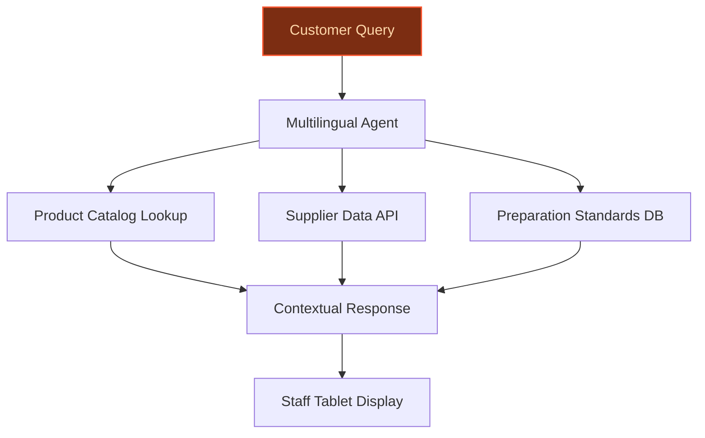
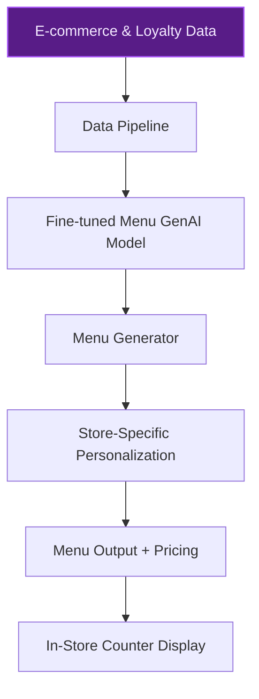
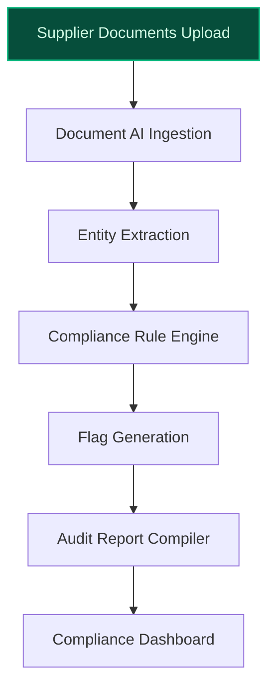

> **Draft — needs revision before customer use.** Meta-eval confidence `0.75` (sales-engineer-ready threshold ≥ 0.70). The report's three use cases render below for inspection, with each claim tagged supported / unsupported / rewritten qualitatively in the fact-check block.
>
> **Cross-cutting concern:** Over-reliance on generic strategic context (e.g., 'AI transformation plan') without tying specific use cases to concrete, verifiable company data assets or operational capabilities. Multiple claims about Carrefour's data assets and AI readiness are either unsupported or weakly supported.
>
> **Weakest use case:** Lacks explicit evidence in the pool for Carrefour's supplier data platforms or digitized operations being a foundation for AI-driven automation. The claim about 'existing supplier data platforms' is unsupported, and the precedent cited (Spoon Guru) does not directly validate compliance automation for Carrefour.

## GenAI Use Cases for Carrefour

Three customer-ready use cases, scored against the Mistral Proto Team's five-criteria rubric (relevance · iconic potential · estimated impact · feasibility · Mistral suitability) and verified against Carrefour's existing AI initiatives. Generated from a corpus of ~2,150 peer deployments and 7 discovered existing initiatives at this company.

_Industry: French multinational retail and wholesaling corporation. Research confidence: 0.85. Verified: True._

### Multilingual AI agent for fresh food counter staff across EU markets
Deploy a conversational AI agent on in-store tablets at fresh food counters (butcher, fishmonger, deli) to provide real-time multilingual support for staff. The agent draws from Carrefour’s product catalog, supplier data, and fresh food preparation standards to answer customer queries, explain product origins, and suggest preparation methods in the local language of each EU market. This reduces language barriers for staff and customers, accelerates onboarding for seasonal workers, and elevates service quality at a critical differentiator for Carrefour: its fresh food counters.

**Why this company:** Carrefour operates in 40 countries with a strategic push to win the battle for fresh food, including the rollout of Fresh counters in 80% of Atacadão stores by 2030. Its existing digitized store infrastructure and multilingual, multiregional presence make this a natural fit. Mistral’s EU-sovereign models and multilingual strength align with Carrefour’s regional operations and data localization needs, while its conversational commerce initiatives (e.g., ChatGPT integration) demonstrate readiness for AI-assisted in-store interactions. [Carrefour’s AI and ChatGPT integration](https://ppc.land/carrefour-bets-on-ai-chatgpt-and-smart-shelves-to-win-european-retail/) underscores the company’s commitment to AI-driven retail innovation.

**Example input:** `A customer at a Paris deli counter asks in German: 'Can you recommend a cheese that pairs well with this Sancerre wine and is suitable for vegetarians?'`

**Example output:**
```json
{
  "_note": "Illustrative output with synthetic sample data",
  "recommendation": "Comté AOP 18 months (TX-SAMPLE-12345)",
  "pairing_rationale": "Nutty, fruity notes complement Sancerre’s citrus and mineral profile. Aged for 18 months, no animal rennet used.",
  "preparation_tip": "Serve at room temperature, sliced thinly. Pair with walnuts and green apples for a balanced plate.",
  "allergens": [
    "milk"
  ],
  "vegetarian": true,
  "origin": "Jura, France (Supplier-ID: SUP-SAMPLE-001)",
  "stock_status": "Available in-store",
  "language_detected": "German (de)"
}
```

**Blueprint:** `agent_with_tools` (impact: medium · cost: medium · complexity: low · TTV: 12-16 weeks (precedent-anchored))

**Top risk:** hallucination in product-specific advice (e.g., incorrect allergen or preparation details) leading to customer safety or trust issues

**Mistral products:** Mistral Large 3, Mistral Embed, On-device inference, Mistral Multilingual

**Inspired by precedents:** google_cloud_blueprints-688b0693f6
**Grounded in:** strategic_context.stated_priorities[5], strategic_context.stated_priorities[8], classification.geography, classification.industry
_Specificity score: 0.95_

**Architecture blueprint:**


### AI-generated ready-to-eat menu optimization and personalization
Build a GenAI system that analyzes Carrefour’s e-commerce transactions, loyalty program data, and regional trends to generate optimized ready-to-eat (RTE) menus for in-store counters and online offerings. The system personalizes recommendations based on customer purchase history, dietary preferences, and local demand patterns, while dynamically adjusting menus to hit Carrefour’s target of 20% of Fresh Food revenue from RTE by 2030. Outputs include menu designs, pricing suggestions, and cross-sell prompts tailored to each store’s catchment area.

**Why this company:** Carrefour has explicitly prioritized ready-to-eat foods as a growth driver, aiming for 20% of Fresh Food revenue by 2030. Its rich data assets—loyalty program transactions, e-commerce data, and omni-channel customer profiles—enable hyper-personalized menu optimization. The company’s existing AI initiatives, such as its ChatGPT shopping integration and dynamic campaign tools (e.g., Carrefour Marketing Studio), demonstrate the operational maturity to deploy this at scale. [Carrefour’s AI transformation plan](https://dig.watch/updates/carrefour-accelerates-ai-enabled-transformation-to-2030-following-walmarts-strategic-playbook) highlights its focus on data-driven pricing and customer engagement.

**Example input:** `Generate a ready-to-eat menu for my Lyon hypermarket store for next week, prioritizing high-margin items and vegetarian options based on recent sales trends.`

**Example output:**
```json
{
  "_disclaimer": "Synthetic example for demonstration; not a factual claim about Carrefour.",
  "store_id": "LYON-HYPER-SAMPLE-001",
  "menu_period": "2025-10-14 to 2025-10-20",
  "top_recommendations": [
    {
      "item": "Quinoa & Roasted Vegetable Bowl (Vegan)",
      "margin_pct": "42% (illustrative)",
      "demand_forecast": "180 units (illustrative)",
      "personalization_trigger": "Loyalty customers with 'vegetarian' preference tag",
      "cross_sell": [
        "Sparkling Water (CASE-SAMPLE-001)",
        "Dark Chocolate Bar (TX-SAMPLE-67890)"
      ]
    },
    {
      "item": "Grilled Salmon with Lemon-Dill Sauce",
      "margin_pct": "38% (illustrative)",
      "demand_forecast": "120 units (illustrative)",
      "personalization_trigger": "Customers with prior seafood purchases",
      "cross_sell": [
        "White Wine (TX-SAMPLE-11111)",
        "Baguette (TX-SAMPLE-22222)"
      ]
    }
  ],
  "revenue_impact_estimate": "15% uplift (illustrative)",
  "alignment_with_goal": "Contributes to 20% RTE revenue target by 2030"
}
```

**Blueprint:** `fine_tuned_domain` (impact: high · cost: medium · complexity: low · TTV: 16-20 weeks (precedent-anchored))

**Top risk:** bias in menu recommendations favoring high-margin but low-demand items, leading to food waste and customer dissatisfaction

**Mistral products:** Mistral Large 3, Mistral Embed, Mistral Fine-tuning

**Inspired by precedents:** google_cloud_1302-17dad9fced
**Grounded in:** strategic_context.stated_priorities[7], strategic_context.stated_priorities[8], data_and_tech.likely_data_assets[2]
_Specificity score: 0.90_

**Architecture blueprint:**


### AI-powered supplier compliance and audit automation
Automate the review of supplier documentation—certifications, safety reports, sustainability metrics, and product specifications—for compliance with Carrefour’s standards and EU/regional regulations. The system extracts key data points from unstructured documents (PDFs, scans), flags inconsistencies or missing information, and generates audit-ready reports. This accelerates supplier onboarding, reduces manual review time, and mitigates compliance risks for Carrefour’s private-label and fresh food supply chains.

**Why this company:** Carrefour’s scale—14,000 stores across 40 countries—and its focus on private-label products (e.g., Carrefour Bio, Reflets de France) demand rigorous supplier compliance. Its existing supplier data platforms and digitized operations provide the foundation for AI-driven automation. The company’s strategic transformation emphasizes operational efficiency and resilience, making compliance automation a high-impact lever. [Carrefour’s AI-driven overhaul](https://dig.watch/updates/carrefour-accelerates-ai-enabled-transformation-to-2030-following-walmarts-strategic-playbook) highlights its push for data-driven logistics and operations.

**Example input:** `Review the new supplier onboarding documents for SUP-SAMPLE-002 and flag any non-compliance with Carrefour Bio organic certification standards.`

**Example output:**
```json
{
  "_note": "Illustrative output with synthetic sample data",
  "supplier_id": "SUP-SAMPLE-002",
  "supplier_name": "GreenFields Organic (illustrative)",
  "compliance_status": "Non-Compliant",
  "flags": [
    {
      "issue": "Missing EU Organic Logo on packaging artwork",
      "severity": "High",
      "regulation": "EU Organic Regulation (illustrative reference)",
      "document": "Packaging_Artwork_v2.pdf"
    },
    {
      "issue": "Pesticide residue test report expired (2024-05-15)",
      "severity": "Critical",
      "regulation": "Carrefour Internal SOP (illustrative reference)",
      "document": "Safety_Report_Q2_2024.pdf"
    }
  ],
  "recommended_action": "Request updated pesticide residue test report (valid within 30 days) and revised packaging artwork.",
  "audit_report_id": "AUDIT-SAMPLE-001",
  "review_time_saved": "2.5 hours (illustrative)"
}
```

**Blueprint:** `document_ai_pipeline` (impact: medium · cost: medium · complexity: low · TTV: 12-16 weeks (precedent-anchored))

**Top risk:** false negatives in compliance checks (e.g., missing a critical safety violation) leading to regulatory penalties or reputational damage

**Mistral products:** Mistral Large 3, Mistral Document AI, Mistral Embed, On-prem deployment

**Inspired by precedents:** google_cloud_1302-1a848d2c32
**Grounded in:** business.key_products_or_services[0], business.key_products_or_services[1], strategic_context.stated_priorities[0]
_Specificity score: 0.75_

**Architecture blueprint:**


## Considered but not selected
- **price-elasticity-optimizer** — High dependency on real-time competitor pricing data; Carrefour’s current data assets do not explicitly cover this.
- **carrefour-bio-sustainability-scoring** — Sustainability metrics standardization across suppliers is not confirmed in Carrefour’s public data assets.
- **store-associate-knowledge-base** — Redundant with the multilingual fresh counter agent; lacks differentiation in scope or impact.

---
## Report quality signals

- **Topical diversity** (LLM-graded over titles + blueprint patterns): `0.95`
- **Specificity** per use case: `0.95`, `0.90`, `0.75`
- **Mistral product diversity**: `7` distinct products across the three use cases
- **Time-to-value spread**: 12–20 weeks (across 3 use cases)
- **Cost-tier spread**: medium, medium, medium
- **Fact-check pass rate**: `90%` (18/20 claims supported by research)

<details><summary>Fact-check detail (per claim)</summary>

**Unsupported (2):**
- [ready-to-eat-menu-optimizer] Carrefour has omni-channel customer profiles data `[judge: rejected]` — _The snippet does not provide any evidence or description of Carrefour's customer data capabilities or omni-channel profiles. (was: Carrefour omni-channel programmes customer data)_
- [supplier-compliance-automation] Carrefour has existing supplier data platforms `[judge: rejected]` — _The snippet only mentions the launch of a new data platform (Carrefour Links) without any reference to existing supplier data platforms. (was: Rescued via web search (verified source): The Carrefour Group just unveiled its new data and reta_

**Supported (18):**
- [multilingual-fresh-counter-agent] Carrefour operates in 40 countries — By 2024, the group had 14,000 stores in 40 countries.
- [multilingual-fresh-counter-agent] Carrefour has a strategic push to win the battle for fresh food — Win the battle for fresh food
- [multilingual-fresh-counter-agent] Carrefour plans to roll out Fresh counters in 80% of Atacadão stores by 2030 — Deployment of Fresh counters in 80% of Atacadão stores: +150 stores by 2030
- [multilingual-fresh-counter-agent] Carrefour has existing digitized store infrastructure — Carrefour has also partnered with tech firms to digitise physical stores, using smart shelf labels, sensors, and data systems to create more…
- [multilingual-fresh-counter-agent] Carrefour has a multilingual, multiregional presence — By 2024, the group had 14,000 stores in 40 countries.
- [multilingual-fresh-counter-agent] Carrefour has conversational commerce initiatives (e.g., ChatGPT integration) — Carrefour becomes the first major European retailer to integrate part of the shopping experience into ChatGPT.
- [multilingual-fresh-counter-agent] Carrefour has a commitment to AI-driven retail innovation — Carrefour accelerates AI-enabled transformation to 2030, following Walmart’s strategic playbook
- [ready-to-eat-menu-optimizer] Carrefour aims for 20% of Fresh Food revenue from ready-to-eat by 2030 — Acceleration on ready-to-eat, to account for 20% of Fresh Food revenue by 2030
- [ready-to-eat-menu-optimizer] Carrefour has loyalty program transactions data — Carrefour loyalty programme members
- [ready-to-eat-menu-optimizer] Carrefour has e-commerce transactions data — Carrefour e-commerce transactions
- [ready-to-eat-menu-optimizer] Carrefour has a ChatGPT shopping integration — Carrefour becomes the first major European retailer to integrate part of the shopping experience into ChatGPT.
- [ready-to-eat-menu-optimizer] Carrefour has dynamic campaign tools (e.g., Carrefour Marketing Studio) — used [PROVIDER] to deploy Carrefour Marketing Studio in just five weeks — an innovative solution to streamline the creation of dynamic campa…
- [ready-to-eat-menu-optimizer] Carrefour has a company-wide AI transformation plan — Carrefour accelerates AI-enabled transformation to 2030, following Walmart’s strategic playbook
- [supplier-compliance-automation] Carrefour has 14,000 stores across 40 countries — By 2024, the group had 14,000 stores in 40 countries.
- [supplier-compliance-automation] Carrefour focuses on private-label products (e.g., Carrefour Bio, Reflets de France) — Act for Food Part II builds on the success of Carrefour’s own brands, which represent the best value and taste for money. This is embodied i…
- [supplier-compliance-automation] Carrefour has digitized operations — Carrefour has also partnered with tech firms to digitise physical stores, using smart shelf labels, sensors, and data systems to create more…
- [supplier-compliance-automation] Carrefour’s strategic transformation emphasizes operational efficiency and resilience — Carrefour accelerates AI-enabled transformation to 2030, following Walmart’s strategic playbook
- [supplier-compliance-automation] Carrefour’s AI-driven overhaul highlights its push for data-driven logistics and operations — Carrefour’s initiative is intended to reshape its logistics, pricing, forecasting and store operations to become more data-driven, efficient…

</details>

**Meta-evaluator confidence**: `0.75` (NOT ready — needs revision)
**Cross-cutting concern**: Over-reliance on generic strategic context (e.g., 'AI transformation plan') without tying specific use cases to concrete, verifiable company data assets or operational capabilities. Multiple claims about Carrefour's data assets and AI readiness are either unsupported or weakly supported.