# Pipeline blueprint (architecture)

Static view of the pipeline regardless of run timing — shows agents,
models, and gates. The chronological execution log follows below.

```mermaid
flowchart TD
    Start([User: company name]) --> R
    R["<b>1. Research</b><br/>parallel: Wikipedia · Tavily news ·<br/>existing initiatives · live verification<br/><i>mistral-medium</i> synthesis"]
    R --> G["<b>1b. Gap-fill</b><br/>identify missing fields →<br/><i>mistral-small</i> generates queries →<br/>Tavily search per field →<br/><i>mistral-small</i> per-field extraction"]
    G --> Conf{Confidence ≥ 0.5<br/>OR verified<br/>OR ≥ 1 existing initiative?}
    Conf -->|no| Refuse([Refusal])
    Conf -->|yes| Ret
    Ret["<b>2. Retrieve</b><br/><i>mistral-embed</i> on company query →<br/>cosine top-K + industry/depth filter +<br/>MMR diversification"]
    Ret --> Gen["<b>3. Generate 12 candidates</b><br/><i>mistral-medium</i> with web_search tool<br/>(Tavily + deep-read) — fact citations<br/>flow into the EvidenceLedger"]
    Gen --> Score["<b>4. Score</b><br/>self-consistency: 2 parallel passes<br/><i>mistral-small</i> @ T=0.2 and T=0.4 →<br/>aggregate weighted scores"]
    Score --> Verify["<b>5. Per-candidate verify</b><br/>top-3: Tavily search + deep-read +<br/><i>mistral-small</i> verdict (pass /<br/>partial / confirmed_existing)"]
    Verify --> Enrich["<b>6. Enrich</b><br/><i>mistral-large</i> drafts customer-facing<br/>prose for 3 use cases (or<br/><i>mistral-medium</i> on fast tier)"]
    Enrich --> NumScrub["<b>6a. Numeric scrub</b><br/>flag any number not in cited content"]
    NumScrub --> Polish["<b>6b. Polish</b><br/><i>mistral-small</i> per use case (parallel):<br/>convert markers→qualitative,<br/>(ev-XXX)→[title](url)"]
    Polish --> Attr["<b>6c. Attribution check</b><br/><i>mistral-small</i> per use case (parallel):<br/>fix corpus-ID ↔ company mismatches"]
    Attr --> Meta["<b>7. Meta-evaluation</b><br/><i>mistral-medium</i> reviews report against<br/>cited precedents + ledger entries:<br/>strict claim verification"]
    Meta --> WV["<b>7c. Web-verify rescue</b><br/>2-tier credibility classifier<br/>(verified allowlist · corroborated)"]
    WV --> J["<b>7d. Source judge</b><br/><i>mistral-small</i> adjudicates each<br/>(claim, source) pair · self-correcting"]
    J --> FQ["<b>7e. Final qualify</b><br/><i>mistral-small</i> rewrites unsupported<br/>numerics into qualitative phrasing"]
    FQ --> QS
    QS["<b>Quality signals</b><br/>LLM-graded diversity + specificity,<br/>fact-check pass rate, TTV/cost spread"]
    QS --> Render([Markdown report + trace])

    classDef agent fill:#fef3c7,stroke:#f59e0b
    classDef gate fill:#dbeafe,stroke:#3b82f6
    classDef io fill:#dcfce7,stroke:#16a34a
    class R,G,Ret,Gen,Score,Verify,Enrich,NumScrub,Polish,Attr,Meta,WV,J,FQ,QS agent
    class Conf gate
    class Start,Refuse,Render io
```

## Execution trace — Carrefour

Started: `2026-05-10T14:27:00.651886+00:00`. Total wall time: `124.9s` across `42` recorded actions.

### Per-step time totals

| Step | Calls | Total time | Avg time |
|---|---:|---:|---:|
| `research` | 1 | 8.29s | 8289ms |
| `gap_fill` | 4 | 9.00s | 2251ms |
| `retrieve` | 2 | 0.49s | 243ms |
| `generate` | 1 | 36.23s | 36227ms |
| `score` | 2 | 35.24s | 17621ms |
| `verify` | 6 | 21.05s | 3509ms |
| `enrich` | 1 | 20.69s | 20686ms |
| `meta_eval` | 1 | 12.29s | 12286ms |
| `web_verify` | 1 | 1.10s | 1102ms |
| `source_judge` | 21 | 14.89s | 709ms |
| `quality_signals` | 2 | 4.31s | 2153ms |

### Chronological event log

- `14:27:01.348` **[research]** `mistral-medium-2604.chat.complete` — 8289ms
   - inputs: synthesize CompanyContext for Carrefour | depth=medium
   - outputs: industry='French multinational retail and wholesaling corporation' verified=True conf=0.75
- `14:27:09.638` **[gap_fill]** `mistral-small-2603.chat.complete` — 1117ms
   - inputs: generate gap queries | fields=['business_model', 'products', 'data_assets', 'priorities']
   - outputs: queries=4
- `14:27:13.045` **[gap_fill]** `mistral-small-2603.chat.complete` — 6561ms
   - inputs: layer-2 extract field=priorities
   - outputs: items=10
- `14:27:13.048` **[gap_fill]** `mistral-small-2603.chat.complete` — 748ms
   - inputs: layer-2 extract field=data_assets
   - outputs: items=6
- `14:27:13.051` **[gap_fill]** `mistral-small-2603.chat.complete` — 577ms
   - inputs: layer-2 extract field=products
   - outputs: items=6
- `14:27:19.609` **[retrieve]** `mistral-embed.embeddings.create` — 175ms
   - inputs: company_query | industries='French multinational retail and wholesaling corporation'
   - outputs: embedded 1024-dim query vector
- `14:27:19.784` **[retrieve]** `precedent_corpus.cosine_topk` — 311ms
   - inputs: k=8 min_depth=0.4 target='Carrefour'
   - outputs: retrieved 8 | mmr=True | top_sim=0.793
- `14:27:20.429` **[generate]** `mistral-medium-2604.chat.complete` — 36227ms
   - inputs: iteration=0 tool_calls_used=0/0 tools=off
   - outputs: tool_calls=0 | content_chars=20345
- `14:27:56.938` **[score]** `mistral-small-2603.chat.complete` — 19298ms
   - inputs: self-consistency pass T=0.2
   - outputs: scored 12 candidates
- `14:27:56.942` **[score]** `mistral-small-2603.chat.complete` — 15944ms
   - inputs: self-consistency pass T=0.4
   - outputs: scored 12 candidates
- `14:28:16.261` **[verify]** `tavily.search` — 3323ms
   - inputs: candidate=fresh-food-shelf-life-optimizer | query='Carrefour AI-driven fresh food shelf-life prediction and dyn'
   - outputs: 4 results
- `14:28:16.261` **[verify]** `tavily.search` — 3760ms
   - inputs: candidate=multilingual-fresh-counter-agent | query='Carrefour Multilingual AI agent for fresh food counter staff'
   - outputs: 4 results
- `14:28:16.262` **[verify]** `tavily.search` — 3026ms
   - inputs: candidate=price-elasticity-optimizer | query='Carrefour AI-driven dynamic pricing and promotion optimizati'
   - outputs: 4 results
- `14:28:20.404` **[verify]** `mistral-small-2603.chat.complete` — 3926ms
   - inputs: verdict for multilingual-fresh-counter-agent
   - outputs: verdict='pass'
- `14:28:20.639` **[verify]** `mistral-small-2603.chat.complete` — 4262ms
   - inputs: verdict for fresh-food-shelf-life-optimizer
   - outputs: verdict='confirmed_existing'
- `14:28:20.726` **[verify]** `mistral-small-2603.chat.complete` — 2757ms
   - inputs: verdict for price-elasticity-optimizer
   - outputs: verdict='confirmed_existing'
- `14:28:24.904` **[enrich]** `mistral-medium-2604.chat.complete` — 20686ms
   - inputs: tier=fast parallel=False ids=['multilingual-fresh-counter-agent', 'ready-to-eat-menu-optimizer', 'supplier-compliance-automation']
   - outputs: enriched 3 use cases
- `14:28:45.608` **[meta_eval]** `mistral-medium-2604.chat.complete` — 12286ms
   - inputs: reviewing 3 use cases
   - outputs: review + claims
- `14:28:57.913` **[web_verify]** `tavily.search.rescue_unsupported_claims` — 1102ms
   - inputs: company='Carrefour' unsupported=1 budget=12
   - outputs: rescued: verified=1 corroborated=0 of 1 attempted
- `14:28:59.017` **[source_judge]** `mistral-small-2603.judge_claim_sources` — 1963ms
   - inputs: pairs=20
   - outputs: judged 20 pairs
- `14:28:59.017` **[source_judge]** `mistral-small-2603.chat.complete` — 557ms
   - inputs: claim='Carrefour operates in 40 countries'
   - outputs: verdict=supported
- `14:28:59.019` **[source_judge]** `mistral-small-2603.chat.complete` — 538ms
   - inputs: claim='Carrefour has a strategic push to win the battle for fresh f'
   - outputs: verdict=supported
- `14:28:59.021` **[source_judge]** `mistral-small-2603.chat.complete` — 571ms
   - inputs: claim='Carrefour plans to roll out Fresh counters in 80% of Atacadã'
   - outputs: verdict=supported
- `14:28:59.023` **[source_judge]** `mistral-small-2603.chat.complete` — 851ms
   - inputs: claim='Carrefour has existing digitized store infrastructure'
   - outputs: verdict=supported
- `14:28:59.026` **[source_judge]** `mistral-small-2603.chat.complete` — 717ms
   - inputs: claim='Carrefour has a multilingual, multiregional presence'
   - outputs: verdict=supported
- `14:28:59.028` **[source_judge]** `mistral-small-2603.chat.complete` — 689ms
   - inputs: claim='Carrefour has conversational commerce initiatives (e.g., Cha'
   - outputs: verdict=supported
- `14:28:59.030` **[source_judge]** `mistral-small-2603.chat.complete` — 680ms
   - inputs: claim='Carrefour has a commitment to AI-driven retail innovation'
   - outputs: verdict=supported
- `14:28:59.031` **[source_judge]** `mistral-small-2603.chat.complete` — 673ms
   - inputs: claim='Carrefour aims for 20% of Fresh Food revenue from ready-to-e'
   - outputs: verdict=supported
- `14:28:59.556` **[source_judge]** `mistral-small-2603.chat.complete` — 504ms
   - inputs: claim='Carrefour has loyalty program transactions data'
   - outputs: verdict=supported
- `14:28:59.574` **[source_judge]** `mistral-small-2603.chat.complete` — 425ms
   - inputs: claim='Carrefour has e-commerce transactions data'
   - outputs: verdict=supported
- `14:28:59.592` **[source_judge]** `mistral-small-2603.chat.complete` — 499ms
   - inputs: claim='Carrefour has omni-channel customer profiles data'
   - outputs: verdict=unsupported
- `14:28:59.704` **[source_judge]** `mistral-small-2603.chat.complete` — 892ms
   - inputs: claim='Carrefour has a ChatGPT shopping integration'
   - outputs: verdict=supported
- `14:28:59.710` **[source_judge]** `mistral-small-2603.chat.complete` — 798ms
   - inputs: claim='Carrefour has dynamic campaign tools (e.g., Carrefour Market'
   - outputs: verdict=supported
- `14:28:59.717` **[source_judge]** `mistral-small-2603.chat.complete` — 529ms
   - inputs: claim='Carrefour has a company-wide AI transformation plan'
   - outputs: verdict=supported
- `14:28:59.744` **[source_judge]** `mistral-small-2603.chat.complete` — 547ms
   - inputs: claim='Carrefour has 14,000 stores across 40 countries'
   - outputs: verdict=supported
- `14:28:59.874` **[source_judge]** `mistral-small-2603.chat.complete` — 583ms
   - inputs: claim='Carrefour focuses on private-label products (e.g., Carrefour'
   - outputs: verdict=supported
- `14:28:59.999` **[source_judge]** `mistral-small-2603.chat.complete` — 507ms
   - inputs: claim='Carrefour has existing supplier data platforms'
   - outputs: verdict=unsupported
- `14:29:00.060` **[source_judge]** `mistral-small-2603.chat.complete` — 919ms
   - inputs: claim='Carrefour has digitized operations'
   - outputs: verdict=supported
- `14:29:00.090` **[source_judge]** `mistral-small-2603.chat.complete` — 868ms
   - inputs: claim='Carrefour’s strategic transformation emphasizes operational '
   - outputs: verdict=supported
- `14:29:00.246` **[source_judge]** `mistral-small-2603.chat.complete` — 577ms
   - inputs: claim='Carrefour’s AI-driven overhaul highlights its push for data-'
   - outputs: verdict=supported
- `14:29:01.259` **[quality_signals]** `mistral-small-2603.chat.complete` — 2921ms
   - inputs: specificity grade (3 use cases)
   - outputs: scored 3 use cases
- `14:29:04.180` **[quality_signals]** `mistral-small-2603.chat.complete` — 1385ms
   - inputs: diversity grade
   - outputs: diversity=0.95

## Mermaid sequence diagram (execution)

```mermaid
sequenceDiagram
    autonumber
    participant pipeline as pipeline
    participant mistral_medium_2604 as mistral-medium-2604
    participant mistral_small_2603 as mistral-small-2603
    participant mistral_embed as mistral-embed
    participant precedent_corpus as precedent_corpus
    participant tavily as tavily
    participant tavily_search as tavily.search
    pipeline->>mistral_medium_2604: research: chat.complete (8289ms)
    mistral_medium_2604-->>pipeline: industry='French multinational retail and wholesaling corpor
    pipeline->>mistral_small_2603: gap_fill: chat.complete (1117ms)
    mistral_small_2603-->>pipeline: queries=4
    pipeline->>mistral_small_2603: gap_fill: chat.complete (6561ms)
    mistral_small_2603-->>pipeline: items=10
    pipeline->>mistral_small_2603: gap_fill: chat.complete (748ms)
    mistral_small_2603-->>pipeline: items=6
    pipeline->>mistral_small_2603: gap_fill: chat.complete (577ms)
    mistral_small_2603-->>pipeline: items=6
    pipeline->>mistral_embed: retrieve: embeddings.create (175ms)
    mistral_embed-->>pipeline: embedded 1024-dim query vector
    pipeline->>precedent_corpus: retrieve: cosine_topk (311ms)
    precedent_corpus-->>pipeline: retrieved 8 | mmr=True | top_sim=0.793
    pipeline->>mistral_medium_2604: generate: chat.complete (36227ms)
    mistral_medium_2604-->>pipeline: tool_calls=0 | content_chars=20345
    pipeline->>mistral_small_2603: score: chat.complete (19298ms)
    mistral_small_2603-->>pipeline: scored 12 candidates
    pipeline->>mistral_small_2603: score: chat.complete (15944ms)
    mistral_small_2603-->>pipeline: scored 12 candidates
    pipeline->>tavily: verify: search (3323ms)
    tavily-->>pipeline: 4 results
    pipeline->>tavily: verify: search (3760ms)
    tavily-->>pipeline: 4 results
    pipeline->>tavily: verify: search (3026ms)
    tavily-->>pipeline: 4 results
    pipeline->>mistral_small_2603: verify: chat.complete (3926ms)
    mistral_small_2603-->>pipeline: verdict='pass'
    pipeline->>mistral_small_2603: verify: chat.complete (4262ms)
    mistral_small_2603-->>pipeline: verdict='confirmed_existing'
    pipeline->>mistral_small_2603: verify: chat.complete (2757ms)
    mistral_small_2603-->>pipeline: verdict='confirmed_existing'
    pipeline->>mistral_medium_2604: enrich: chat.complete (20686ms)
    mistral_medium_2604-->>pipeline: enriched 3 use cases
    pipeline->>mistral_medium_2604: meta_eval: chat.complete (12286ms)
    mistral_medium_2604-->>pipeline: review + claims
    pipeline->>tavily_search: web_verify: rescue_unsupported_claims (1102ms)
    tavily_search-->>pipeline: rescued: verified=1 corroborated=0 of 1 attempted
    pipeline->>mistral_small_2603: source_judge: judge_claim_sources (1963ms)
    mistral_small_2603-->>pipeline: judged 20 pairs
    pipeline->>mistral_small_2603: source_judge: chat.complete (557ms)
    mistral_small_2603-->>pipeline: verdict=supported
    pipeline->>mistral_small_2603: source_judge: chat.complete (538ms)
    mistral_small_2603-->>pipeline: verdict=supported
    pipeline->>mistral_small_2603: source_judge: chat.complete (571ms)
    mistral_small_2603-->>pipeline: verdict=supported
    pipeline->>mistral_small_2603: source_judge: chat.complete (851ms)
    mistral_small_2603-->>pipeline: verdict=supported
    pipeline->>mistral_small_2603: source_judge: chat.complete (717ms)
    mistral_small_2603-->>pipeline: verdict=supported
    pipeline->>mistral_small_2603: source_judge: chat.complete (689ms)
    mistral_small_2603-->>pipeline: verdict=supported
    pipeline->>mistral_small_2603: source_judge: chat.complete (680ms)
    mistral_small_2603-->>pipeline: verdict=supported
    pipeline->>mistral_small_2603: source_judge: chat.complete (673ms)
    mistral_small_2603-->>pipeline: verdict=supported
    pipeline->>mistral_small_2603: source_judge: chat.complete (504ms)
    mistral_small_2603-->>pipeline: verdict=supported
    pipeline->>mistral_small_2603: source_judge: chat.complete (425ms)
    mistral_small_2603-->>pipeline: verdict=supported
    pipeline->>mistral_small_2603: source_judge: chat.complete (499ms)
    mistral_small_2603-->>pipeline: verdict=unsupported
    pipeline->>mistral_small_2603: source_judge: chat.complete (892ms)
    mistral_small_2603-->>pipeline: verdict=supported
    pipeline->>mistral_small_2603: source_judge: chat.complete (798ms)
    mistral_small_2603-->>pipeline: verdict=supported
    pipeline->>mistral_small_2603: source_judge: chat.complete (529ms)
    mistral_small_2603-->>pipeline: verdict=supported
    pipeline->>mistral_small_2603: source_judge: chat.complete (547ms)
    mistral_small_2603-->>pipeline: verdict=supported
    pipeline->>mistral_small_2603: source_judge: chat.complete (583ms)
    mistral_small_2603-->>pipeline: verdict=supported
    pipeline->>mistral_small_2603: source_judge: chat.complete (507ms)
    mistral_small_2603-->>pipeline: verdict=unsupported
    pipeline->>mistral_small_2603: source_judge: chat.complete (919ms)
    mistral_small_2603-->>pipeline: verdict=supported
    pipeline->>mistral_small_2603: source_judge: chat.complete (868ms)
    mistral_small_2603-->>pipeline: verdict=supported
    pipeline->>mistral_small_2603: source_judge: chat.complete (577ms)
    mistral_small_2603-->>pipeline: verdict=supported
    pipeline->>mistral_small_2603: quality_signals: chat.complete (2921ms)
    mistral_small_2603-->>pipeline: scored 3 use cases
    pipeline->>mistral_small_2603: quality_signals: chat.complete (1385ms)
    mistral_small_2603-->>pipeline: diversity=0.95
```

