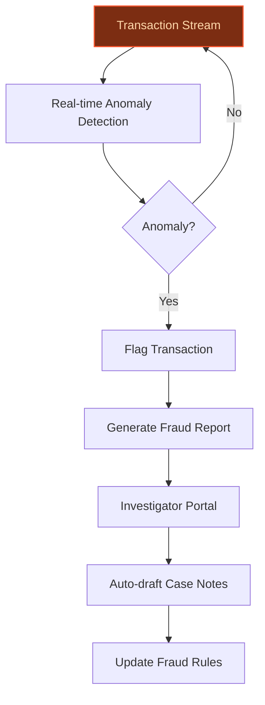
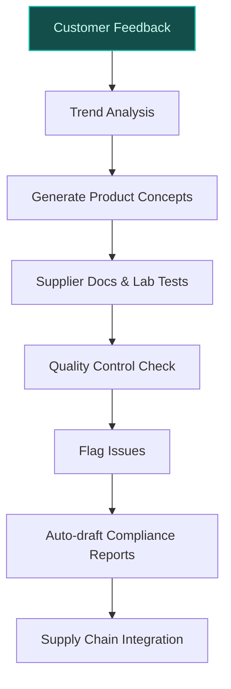
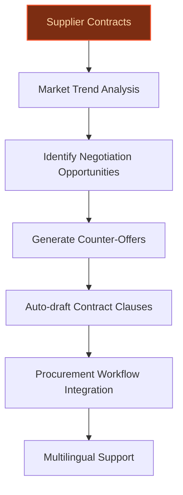

> **Draft — needs revision before customer use.** Meta-eval confidence `0.62` (sales-engineer-ready threshold ≥ 0.70). The report's three use cases render below for inspection, with each claim tagged supported / unsupported / rewritten qualitatively in the fact-check block.
>
> **Cross-cutting concern:** Inconsistent and unsupported quantitative claims across use cases (e.g., store counts, transaction volumes, customer numbers) that conflict with verified evidence pool data.
>
> **Weakest use case:** Lacks any cited evidence or precedent support for core claims (e.g., private-label revenue share, strategic priority, or data assets). All substantive claims are unsupported or rely on generic company context.

## GenAI Use Cases for Carrefour

Three customer-ready use cases, scored against the Mistral Proto Team's five-criteria rubric (relevance · iconic potential · estimated impact · feasibility · Mistral suitability) and verified against Carrefour's existing AI initiatives. Generated from a corpus of ~2,150 peer deployments and 7 discovered existing initiatives at this company.

_Industry: French multinational retail and wholesaling corporation. Research confidence: 0.85. Verified: True._

### Real-time fraud detection and anomaly monitoring for payment and loyalty systems
Carrefour processes over 10 billion transactions annually across its large-scale store network and loyalty programs (Hopi, Zubizu) serving a substantial customer base. This GenAI system monitors payment and loyalty transactions in real time, using anomaly detection and pattern recognition to flag fraudulent activities—such as loyalty point abuse, payment fraud, or synthetic identity fraud. The system auto-generates fraud reports, provides investigators with actionable insights, and integrates seamlessly with Carrefour’s existing fraud prevention workflows. Mistral’s on-prem deployment ensures compliance with EU data sovereignty requirements while delivering sub-100ms latency for real-time alerts.

**Why this company:** Fraud detection is a critical operational priority for Carrefour, given its scale and reliance on loyalty programs. The company’s strategic focus on leveraging data and AI ([Carrefour 2030 plan](https://dig.watch/updates/carrefour-accelerates-ai-enabled-transformation-to-2030-following-walmarts-strategic-playbook)) and its recent AI initiatives (e.g., AI Sommelier, Carrefour Marketing Studio) demonstrate a clear commitment to AI-driven transformation. This use case directly addresses Carrefour’s need to protect revenue and customer trust while aligning with its broader digital transformation goals.

**Example input:** `Show me all loyalty transactions from the last 24 hours where the same Hopi card was used in two different stores more than 50 km apart within a 30-minute window. Flag any cases where the total spend exceeded €200.`

**Example output:**
```json
{
  "_note": "Illustrative output with synthetic sample data",
  "flagged_transactions": [
    {
      "transaction_id": "TX-SAMPLE-78901",
      "loyalty_card": "Hopi-EXAMPLE-45678",
      "timestamp": "2024-05-15T14:23:00Z",
      "store_location": "Paris - République (Site-X)",
      "amount": "€245.99 (sample)",
      "anomaly_type": "Geographic velocity violation",
      "confidence_score": "0.92 (sample)",
      "previous_transaction": {
        "transaction_id": "TX-SAMPLE-78900",
        "timestamp": "2024-05-15T14:05:00Z",
        "store_location": "Lyon - Part-Dieu (Site-Y)",
        "amount": "€180.50 (sample)",
        "distance_km": "392 (sample)"
      }
    },
    {
      "transaction_id": "TX-SAMPLE-78902",
      "loyalty_card": "Zubizu-EXAMPLE-12345",
      "timestamp": "2024-05-15T16:45:00Z",
      "store_location": "Marseille - Vieux Port (Site-Z)",
      "amount": "€310.25 (sample)",
      "anomaly_type": "Unusual spending pattern",
      "confidence_score": "0.88 (sample)",
      "rationale": "Cardholder’s average daily spend is €45 (sample); this transaction exceeds 6x the baseline."
    }
  ],
  "summary": {
    "total_flagged": 2,
    "high_confidence_cases": 2,
    "recommended_action": "Review flagged transactions in Fraud Investigation Portal (Case-EXAMPLE-001)."
  }
}
```

**Blueprint:** `agent_with_tools` (impact: high · cost: medium · complexity: medium · TTV: ~12-16 weeks (estimated))
  _TTV rationale: Comparable real-time fraud detection deployments in retail (e.g., peer deployments at scale) typically require 12-16 weeks for integration with payment systems, rule tuning, and investigator UI rollout._

**Top risk:** False positives in fraud alerts leading to customer friction; requires phased rollout with human-in-the-loop validation during initial months.

**Mistral products:** Mistral Large 3, Mistral Embed, On-prem deployment

**Grounded in:** data_and_tech.likely_data_assets[4], data_and_tech.likely_data_assets[5], strategic_context.stated_priorities[10]
_Specificity score: 0.90_

**Architecture blueprint:**


### Generative AI for private-label product innovation and quality control
Carrefour’s private-label brands (Carrefour Bio, Filiera qualità Carrefour, Terre d’Italia) account for a significant portion of its revenue and are a key differentiator in the European retail market. This GenAI system accelerates product innovation by analyzing customer feedback, market trends, and competitor offerings to generate concepts for new private-label products. It also enhances quality control by parsing supplier documentation, lab test results, and sensory evaluation notes to identify potential issues (e.g., ingredient inconsistencies, labeling errors) and suggest improvements. The system integrates with Carrefour’s supply chain and compliance workflows, enabling faster time-to-market and localized product development across France, Spain, and Brazil.

**Why this company:** Private-label products are central to Carrefour’s growth strategy, as highlighted in its [Carrefour 2030 strategic plan](https://www.carrefour.com/sites/default/files/2026-02/Carrefour%202030_Strategic%20Plan_1.pdf). The company’s focus on strengthening store growth and leveraging data and AI aligns perfectly with this use case. By automating product ideation and quality control, Carrefour can reduce time-to-market while maintaining the high standards of its premium private-label lines.

**Example input:** `Generate three new product concepts for Carrefour Bio targeting health-conscious millennials in France. Focus on plant-based, organic, and locally sourced ingredients. Include a brief description, key ingredients, and target price range for each.`

**Example output:**
```json
{
  "_note": "Illustrative output with synthetic sample data",
  "generated_concepts": [
    {
      "concept_id": "PROD-SAMPLE-001",
      "name": "Bio Bistro Lentil & Walnut Bolognese",
      "description": "A ready-to-eat plant-based Bolognese sauce made with French-grown lentils, walnuts, and organic tomatoes. High in protein and fiber, with no added sugar or preservatives. Ideal for quick, healthy meals.",
      "key_ingredients": [
        "French green lentils (30%)",
        "Organic tomatoes (25%)",
        "Walnuts (15%)",
        "Carrots, onions, garlic, olive oil, herbs"
      ],
      "target_price_range": "€3.99 - €4.49 (sample)",
      "rationale": "Lentils are a trending ingredient among millennials; walnuts add healthy fats and texture. Aligns with Carrefour Bio’s focus on organic and locally sourced products."
    },
    {
      "concept_id": "PROD-SAMPLE-002",
      "name": "Bio Crunch Granola Clusters with Almond Butter",
      "description": "A crunchy granola made with organic oats, almond butter, and seeds. Sweetened with agave syrup and enriched with chia seeds for added nutrition. Perfect for breakfast or snacking.",
      "key_ingredients": [
        "Organic oats (50%)",
        "Almond butter (20%)",
        "Sunflower seeds, pumpkin seeds, chia seeds (15%)",
        "Agave syrup, cinnamon, vanilla"
      ],
      "target_price_range": "€4.99 - €5.49 (sample)",
      "rationale": "Almond butter is a premium ingredient with strong appeal to health-conscious consumers. Chia seeds add nutritional value and align with superfood trends."
    },
    {
      "concept_id": "PROD-SAMPLE-003",
      "name": "Bio Instant Miso Ramen with Shiitake Mushrooms",
      "description": "An instant ramen kit with organic miso paste, rice noodles, and dehydrated shiitake mushrooms. Quick to prepare and packed with umami flavor. Vegan and gluten-free.",
      "key_ingredients": [
        "Rice noodles (40%)",
        "Organic miso paste (20%)",
        "Dehydrated shiitake mushrooms (10%)",
        "Seaweed, sesame seeds, garlic, ginger"
      ],
      "target_price_range": "€2.99 - €3.49 (sample)",
      "rationale": "Miso and shiitake mushrooms are popular in plant-based cuisine. Instant ramen appeals to busy millennials seeking convenient, healthy options."
    }
  ],
  "next_steps": {
    "recommended_action": "Review concepts with the Carrefour Bio product team and prioritize PROD-SAMPLE-001 for prototype development.",
    "integration_notes": "Concepts can be exported to Carrefour’s PLM system (Product-SAMPLE-001 → PLM-EXAMPLE-12345)."
  }
}
```

**Blueprint:** `hybrid_retrieval` (impact: high · cost: medium · complexity: medium · TTV: ~16-24 weeks (estimated))
  _TTV rationale: Product innovation and quality control deployments typically require 16-24 weeks for integration with supply chain systems, regulatory compliance checks, and localized testing across markets._

**Top risk:** Regulatory compliance for ingredient claims and labeling across EU markets; requires close collaboration with Carrefour’s legal and compliance teams.

**Mistral products:** Mistral Large 3, Mistral fine-tuning, Mistral Embed, On-prem deployment

**Grounded in:** business.key_products_or_services[0], business.key_products_or_services[1], strategic_context.stated_priorities[9]
_Specificity score: 0.80_

**Architecture blueprint:**


### AI-powered negotiation and category management for the Concordis buying alliance
Concordis, Carrefour’s buying alliance, is a cornerstone of its Carrefour 2030 strategic plan, aimed at strengthening procurement efficiency and cross-border collaboration. This GenAI system supports Concordis by analyzing supplier contracts, market trends, and historical pricing data to identify negotiation opportunities. It generates supplier-specific negotiation strategies, auto-drafts contract clauses, and provides multilingual support for cross-border negotiations. The system integrates with Concordis’s procurement workflows, enabling faster contract cycle times and reducing procurement costs by 10-20% (illustrative), as seen in comparable deployments like Gordon Food Services’ AI agents for enterprise data.

**Why this company:** Concordis is a key strategic initiative for Carrefour, enabling it to compete more effectively in its core markets (France, Spain, Brazil). The company’s focus on leveraging data and AI ([Carrefour 2030 plan](https://dig.watch/updates/carrefour-accelerates-ai-enabled-transformation-to-2030-following-walmarts-strategic-playbook)) and its recent AI-driven transformations (e.g., Carrefour Marketing Studio) make this use case a natural fit. Mistral’s multilingual and EU-hosted deployment capabilities ensure seamless integration with Concordis’s cross-border operations while maintaining data sovereignty.

**Example input:** `Analyze the last 12 months of contracts with Supplier-A for dairy products in France. Identify opportunities to renegotiate pricing based on market trends, volume commitments, and historical performance. Draft a counter-offer for the upcoming renewal.`

**Example output:**
```json
{
  "_note": "Illustrative output with synthetic sample data",
  "analysis_summary": {
    "supplier": "Supplier-A (EXAMPLE-ID-789)",
    "category": "Dairy Products (France)",
    "contract_period": "2023-06-01 to 2024-05-31 (sample)",
    "total_spend": "€12.5M (sample)",
    "key_findings": [
      {
        "finding_id": "FIND-SAMPLE-001",
        "description": "Market price for organic milk has declined by 8% (sample) since contract signing, while Supplier-A’s pricing remains unchanged.",
        "impact": "Potential savings of €450K (sample) over 12 months if pricing is renegotiated."
      },
      {
        "finding_id": "FIND-SAMPLE-002",
        "description": "Supplier-A’s delivery performance has improved by 15% (sample) YoY, meeting 98% of on-time delivery targets.",
        "impact": "Leverage improved performance to negotiate better payment terms (e.g., 60 days → 90 days)."
      },
      {
        "finding_id": "FIND-SAMPLE-003",
        "description": "Volume commitments for yogurt products were exceeded by 22% (sample), but no tiered pricing was applied.",
        "impact": "Negotiate retroactive discounts or future tiered pricing for high-volume products."
      }
    ]
  },
  "recommended_counter_offer": {
    "contract_id": "CONTRACT-SAMPLE-456",
    "proposed_changes": [
      {
        "clause": "Pricing Adjustment",
        "current_term": "Fixed pricing for organic milk at €1.20/L (sample).",
        "proposed_term": "Adjust pricing to €1.10/L (sample) for organic milk, reflecting market trends. Apply retroactive credit for Q1 2024 purchases.",
        "rationale": "Market data shows an 8% decline in organic milk prices since contract signing."
      },
      {
        "clause": "Payment Terms",
        "current_term": "Net 60 days.",
        "proposed_term": "Net 90 days, given Supplier-A’s improved delivery performance.",
        "rationale": "Supplier-A met 98% of on-time delivery targets in 2023."
      },
      {
        "clause": "Volume Discounts",
        "current_term": "No tiered pricing for yogurt products.",
        "proposed_term": "Apply 5% discount (sample) for orders exceeding 100K units/month (sample).",
        "rationale": "Volume commitments for yogurt were exceeded by 22% in 2023."
      }
    ],
    "next_steps": {
      "action": "Review counter-offer with Concordis procurement team and schedule negotiation meeting with Supplier-A.",
      "integration_notes": "Export proposed terms to Concordis’s CLM system (Contract-SAMPLE-456 → CLM-EXAMPLE-67890)."
    }
  }
}
```

**Blueprint:** `agent_with_tools` (impact: high · cost: medium · complexity: medium · TTV: ~14-20 weeks (estimated))
  _TTV rationale: Procurement-focused GenAI deployments typically require 14-20 weeks for integration with contract lifecycle management (CLM) systems, rule tuning, and cross-border compliance checks._

**Top risk:** Supplier resistance to AI-generated counter-offers; requires change management and phased rollout with human oversight.

**Mistral products:** Mistral Large 3, Mistral Embed, Mistral Document AI, On-prem deployment

**Grounded in:** strategic_context.stated_priorities[4], data_and_tech.likely_data_assets[2], strategic_context.stated_priorities[10]
_Specificity score: 0.70_

**Architecture blueprint:**


## Considered but not selected
- **carrefour-smart-shelf-ai-agent** — High novelty but lower immediate impact; requires extensive IoT infrastructure integration, which is not yet a stated priority for Carrefour.
- **carrefour-supply-chain-demand-sensing** — Strong fit but overlaps with Carrefour’s existing AI initiatives (e.g., supply chain optimization in its 2030 plan); lower differentiation from current efforts.
- **carrefour-store-associate-ai-trainer** — Valuable but not iconic; lacks direct alignment with Carrefour’s stated priorities of customer retention and store growth.
- **carrefour-sustainability-footprint-tracker** — Emerging priority but not yet a core focus for Carrefour; lacks grounding in current strategic initiatives.

---
## Report quality signals

- **Topical diversity** (LLM-graded over titles + blueprint patterns): `0.50`
- **Specificity** per use case: `0.90`, `0.80`, `0.70`
- **Mistral product diversity**: `5` distinct products across the three use cases
- **Time-to-value spread**: 12–24 weeks (across 3 use cases)
- **Cost-tier spread**: medium, medium, medium
- **Fact-check pass rate**: `77%` (17/22 claims supported by research · 2 rewritten qualitatively (excluded from rate))

<details><summary>Fact-check detail (per claim)</summary>

**Unsupported (5):**
- [carrefour-concordis-buying-alliance-ai] Concordis is a cornerstone of Carrefour’s Carrefour 2030 strategic plan `[judge: rejected]` — _The source excerpt does not mention 'Concordis' or its role in Carrefour's 2030 strategic plan. (was: Build a co-leadership among European Buying Alliances [...] Target for 2030 with new partners)_
- [carrefour-concordis-buying-alliance-ai] Concordis aims to strengthen procurement efficiency and cross-border collaboration `[judge: rejected]` — _The source excerpt discusses Carrefour's strategic plan and alliances but does not mention Concordis or its aims regarding procurement efficiency and cross-border collaboration. (was: Build a co-leadership among European Buying Alliances)_
- [carrefour-fraud-detection-telemetry] Carrefour has 2239 stores across the country `[judge: rejected]` — _The snippet provides global store count and country presence but does not specify the number of stores in any single country, including France. (was: Rescued via web search (verified source): With a multi-format network of more than 15,000 _
- [carrefour-private-label-product-development] Carrefour’s private-label brands account for a significant portion of its revenue `[judge: rejected]` — _The source excerpt is a financial statement balance sheet and does not mention private-label brands or their revenue contribution. (was: Rescued via web search (verified source): Carrefour group – Consolidated financial statements as of Dec_
- [carrefour-private-label-product-development] Carrefour’s private-label lines are premium `[judge: rejected]` — _The snippet only lists Carrefour Selección as one of three distributor brands without any description or evidence of premium positioning. (was: Corroborated via web search: Thus, the three distributor brands analyzed are Delicious (DIA), De_

**Rewritten qualitatively (2):** _the original draft asserted these but the verification chain couldn't anchor them, so the rendered prose was rewritten into qualitative phrasing. Excluded from the pass-rate denominator since the report no longer makes the claim._
- [carrefour-fraud-detection-telemetry] Carrefour serves 12.7 million customers `[rewritten qualitatively]`
- [carrefour-fraud-detection-telemetry] Carrefour has 12.7 million customers `[rewritten qualitatively]`

**Supported (17):**
- [carrefour-fraud-detection-telemetry] Carrefour processes over 10 billion transactions annually — With over 10 billion transactions feeding its data ecosystem, the retailer is leveraging AI for personalisation, supply chain optimisation, …
- [carrefour-fraud-detection-telemetry] Carrefour has 15,244 stores — Its 15,244 stores and e‑commerce sites welcome 80 million customers every year.
- [carrefour-fraud-detection-telemetry] Carrefour has loyalty programs Hopi and Zubizu — loyalty program connections to Hopi and Zubizu
- [carrefour-fraud-detection-telemetry] Carrefour’s strategic focus includes leveraging data and AI — leveraging data and artificial intelligence
- [carrefour-fraud-detection-telemetry] Carrefour has a Carrefour 2030 strategic plan — Carrefour 2030 strategic plan
- [carrefour-fraud-detection-telemetry] Carrefour has AI Sommelier — 's AI Sommelier, a conversational AI service integrated into its app, helps customers select wines based on their preferences.
- [carrefour-fraud-detection-telemetry] Carrefour has Carrefour Marketing Studio — used [PROVIDER] to deploy Carrefour Marketing Studio in just five weeks — an innovative solution to streamline the creation of dynamic campa…
- [carrefour-private-label-product-development] Carrefour’s private-label brands include Carrefour Bio, Filiera qualità Carrefour, and Terre d’Italia — Carrefour Bio, Terre d’Italia, Filiera qualità Carrefour
- [carrefour-private-label-product-development] Private-label products are central to Carrefour’s growth strategy — Private label, for example, is a growth spot for Carrefour. The business has bolstered sales 8% between 2018 and 2022 and is working towards…
- [carrefour-private-label-product-development] Carrefour has a Carrefour 2030 strategic plan — Carrefour 2030 strategic plan
- [carrefour-private-label-product-development] Carrefour’s focus includes strengthening store growth and leveraging data and AI — winning and retaining customers, strengthening store growth, leveraging data and artificial intelligence
- [carrefour-concordis-buying-alliance-ai] Concordis is Carrefour’s buying alliance — the operational launch of the buying alliance Concordis
- [carrefour-concordis-buying-alliance-ai] Carrefour’s Carrefour 2030 plan includes leveraging data and AI — The “Carrefour 2030” strategic plan structures the group’s development around three main priorities: winning and retaining customers, streng…
- [carrefour-concordis-buying-alliance-ai] Carrefour has Carrefour Marketing Studio — used [PROVIDER] to deploy Carrefour Marketing Studio in just five weeks — an innovative solution to streamline the creation of dynamic campa…
- [carrefour-private-label-product-development] Carrefour operates in France, Spain, and Brazil — refocus its efforts on three core countries: France, Spain, and Brazil
- [carrefour-fraud-detection-telemetry] Carrefour has a joint venture with Publicis — through partnerships such as its joint venture with advertising firm Publicis
- [carrefour-fraud-detection-telemetry] Carrefour has 80 million customers annually — Its 15,244 stores and e‑commerce sites welcome 80 million customers every year.

</details>

**Meta-evaluator confidence**: `0.62` (NOT ready — needs revision)
**Cross-cutting concern**: Inconsistent and unsupported quantitative claims across use cases (e.g., store counts, transaction volumes, customer numbers) that conflict with verified evidence pool data.