# Pipeline blueprint (architecture)

Static view of the pipeline regardless of run timing — shows agents,
models, and gates. The chronological execution log follows below.

```mermaid
flowchart TD
    Start([User: company name]) --> R
    R["<b>1. Research</b><br/>parallel: Wikipedia · Tavily news ·<br/>existing initiatives · live verification<br/><i>mistral-medium</i> synthesis"]
    R --> G["<b>1b. Gap-fill</b><br/>identify missing fields →<br/><i>mistral-small</i> generates queries →<br/>Tavily search per field →<br/><i>mistral-small</i> per-field extraction"]
    G --> Conf{Confidence ≥ 0.5<br/>OR verified<br/>OR ≥ 1 existing initiative?}
    Conf -->|no| Refuse([Refusal])
    Conf -->|yes| Ret
    Ret["<b>2. Retrieve</b><br/><i>mistral-embed</i> on company query →<br/>cosine top-K + industry/depth filter +<br/>MMR diversification"]
    Ret --> Gen["<b>3. Generate 12 candidates</b><br/><i>mistral-medium</i> with web_search tool<br/>(Tavily + deep-read) — fact citations<br/>flow into the EvidenceLedger"]
    Gen --> Score["<b>4. Score</b><br/>self-consistency: 2 parallel passes<br/><i>mistral-small</i> @ T=0.2 and T=0.4 →<br/>aggregate weighted scores"]
    Score --> Verify["<b>5. Per-candidate verify</b><br/>top-3: Tavily search + deep-read +<br/><i>mistral-small</i> verdict (pass /<br/>partial / confirmed_existing)"]
    Verify --> Enrich["<b>6. Enrich</b><br/><i>mistral-large</i> drafts customer-facing<br/>prose for 3 use cases (or<br/><i>mistral-medium</i> on fast tier)"]
    Enrich --> NumScrub["<b>6a. Numeric scrub</b><br/>flag any number not in cited content"]
    NumScrub --> Polish["<b>6b. Polish</b><br/><i>mistral-small</i> per use case (parallel):<br/>convert markers→qualitative,<br/>(ev-XXX)→[title](url)"]
    Polish --> Attr["<b>6c. Attribution check</b><br/><i>mistral-small</i> per use case (parallel):<br/>fix corpus-ID ↔ company mismatches"]
    Attr --> Meta["<b>7. Meta-evaluation</b><br/><i>mistral-medium</i> reviews report against<br/>cited precedents + ledger entries:<br/>strict claim verification"]
    Meta --> WV["<b>7c. Web-verify rescue</b><br/>2-tier credibility classifier<br/>(verified allowlist · corroborated)"]
    WV --> J["<b>7d. Source judge</b><br/><i>mistral-small</i> adjudicates each<br/>(claim, source) pair · self-correcting"]
    J --> FQ["<b>7e. Final qualify</b><br/><i>mistral-small</i> rewrites unsupported<br/>numerics into qualitative phrasing"]
    FQ --> QS
    QS["<b>Quality signals</b><br/>LLM-graded diversity + specificity,<br/>fact-check pass rate, TTV/cost spread"]
    QS --> Render([Markdown report + trace])

    classDef agent fill:#fef3c7,stroke:#f59e0b
    classDef gate fill:#dbeafe,stroke:#3b82f6
    classDef io fill:#dcfce7,stroke:#16a34a
    class R,G,Ret,Gen,Score,Verify,Enrich,NumScrub,Polish,Attr,Meta,WV,J,FQ,QS agent
    class Conf gate
    class Start,Refuse,Render io
```

## Execution trace — Carrefour

Started: `2026-05-10T14:29:35.440959+00:00`. Total wall time: `201.5s` across `55` recorded actions.

### Per-step time totals

| Step | Calls | Total time | Avg time |
|---|---:|---:|---:|
| `research` | 1 | 10.04s | 10036ms |
| `gap_fill` | 4 | 3.21s | 802ms |
| `retrieve` | 2 | 0.71s | 353ms |
| `generate` | 2 | 40.21s | 20105ms |
| `generate.web_search` | 4 | 11.42s | 2856ms |
| `score` | 2 | 33.70s | 16848ms |
| `verify` | 6 | 14.08s | 2347ms |
| `enrich` | 1 | 69.56s | 69563ms |
| `polish` | 3 | 5.89s | 1964ms |
| `meta_eval` | 1 | 14.64s | 14643ms |
| `web_verify` | 1 | 2.29s | 2289ms |
| `source_judge` | 25 | 17.54s | 702ms |
| `final_qualify` | 1 | 1.72s | 1723ms |
| `quality_signals` | 2 | 3.45s | 1723ms |

### Chronological event log

- `14:29:36.546` **[research]** `mistral-medium-2604.chat.complete` — 10036ms
   - inputs: synthesize CompanyContext for Carrefour | depth=medium
   - outputs: industry='French multinational retail and wholesaling corporation' verified=True conf=0.75
- `14:29:46.583` **[gap_fill]** `mistral-small-2603.chat.complete` — 978ms
   - inputs: generate gap queries | fields=['business_model', 'products', 'data_assets', 'priorities']
   - outputs: queries=4
- `14:29:52.237` **[gap_fill]** `mistral-small-2603.chat.complete` — 1025ms
   - inputs: layer-2 extract field=priorities
   - outputs: items=12
- `14:29:52.241` **[gap_fill]** `mistral-small-2603.chat.complete` — 625ms
   - inputs: layer-2 extract field=data_assets
   - outputs: items=6
- `14:29:52.244` **[gap_fill]** `mistral-small-2603.chat.complete` — 582ms
   - inputs: layer-2 extract field=products
   - outputs: items=5
- `14:29:53.264` **[retrieve]** `mistral-embed.embeddings.create` — 391ms
   - inputs: company_query | industries='French multinational retail and wholesaling corporation'
   - outputs: embedded 1024-dim query vector
- `14:29:53.655` **[retrieve]** `precedent_corpus.cosine_topk` — 314ms
   - inputs: k=8 min_depth=0.4 target='Carrefour'
   - outputs: retrieved 8 | mmr=True | top_sim=0.811
- `14:29:54.319` **[generate]** `mistral-medium-2604.chat.complete` — 2039ms
   - inputs: iteration=0 tool_calls_used=0/4 tools=on
   - outputs: tool_calls=4 | content_chars=0
- `14:29:56.373` **[generate.web_search]** `tavily.search` — 3888ms
   - inputs: query='Carrefour 2024 store count and countries'
   - outputs: 2 raw results
- `14:30:00.739` **[generate.web_search]** `tavily.search` — 2584ms
   - inputs: query='Carrefour loyalty program Hopi Zubizu details'
   - outputs: 2 raw results
- `14:30:04.727` **[generate.web_search]** `tavily.search` — 2650ms
   - inputs: query='Carrefour smart shelf labels and sensors partnerships'
   - outputs: 2 raw results
- `14:30:12.099` **[generate.web_search]** `tavily.search` — 2301ms
   - inputs: query='Carrefour Brazil Atacadão digital transformation initiatives'
   - outputs: 2 raw results
- `14:30:17.300` **[generate]** `mistral-medium-2604.chat.complete` — 38171ms
   - inputs: iteration=1 tool_calls_used=4/4 tools=off
   - outputs: tool_calls=0 | content_chars=25334
- `14:30:55.849` **[score]** `mistral-small-2603.chat.complete` — 16629ms
   - inputs: self-consistency pass T=0.2
   - outputs: scored 12 candidates
- `14:30:55.853` **[score]** `mistral-small-2603.chat.complete` — 17067ms
   - inputs: self-consistency pass T=0.4
   - outputs: scored 12 candidates
- `14:31:12.957` **[verify]** `tavily.search` — 1723ms
   - inputs: candidate=carrefour-smart-shelf-ai-agent | query='Carrefour AI-powered shelf compliance and dynamic pricing ag'
   - outputs: 4 results
- `14:31:12.958` **[verify]** `tavily.search` — 1869ms
   - inputs: candidate=carrefour-fraud-detection-telemetry | query='Carrefour Real-time fraud detection and anomaly monitoring f'
   - outputs: 4 results
- `14:31:12.958` **[verify]** `tavily.search` — 2114ms
   - inputs: candidate=carrefour-private-label-product-development | query='Carrefour Generative AI for private-label product innovation'
   - outputs: 4 results
- `14:31:15.173` **[verify]** `mistral-small-2603.chat.complete` — 1759ms
   - inputs: verdict for carrefour-fraud-detection-telemetry
   - outputs: verdict='pass'
- `14:31:15.451` **[verify]** `mistral-small-2603.chat.complete` — 1678ms
   - inputs: verdict for carrefour-private-label-product-development
   - outputs: verdict='pass'
- `14:31:15.558` **[verify]** `mistral-small-2603.chat.complete` — 4937ms
   - inputs: verdict for carrefour-smart-shelf-ai-agent
   - outputs: verdict='confirmed_existing'
- `14:31:20.500` **[enrich]** `mistral-large-2512.chat.complete` — 69563ms
   - inputs: tier=max parallel=False ids=['carrefour-fraud-detection-telemetry', 'carrefour-private-label-product-development', 'carrefour-concordis-buying-alliance-ai']
   - outputs: enriched 3 use cases
- `14:32:30.088` **[polish]** `mistral-small-2603.chat.complete` — 2011ms
   - inputs: use_case=carrefour-fraud-detection-telemetry unanchored=True opaque_ev=False
   - outputs: polished 5 fields
- `14:32:30.092` **[polish]** `mistral-small-2603.chat.complete` — 1835ms
   - inputs: use_case=carrefour-private-label-product-development unanchored=True opaque_ev=False
   - outputs: polished 5 fields
- `14:32:30.096` **[polish]** `mistral-small-2603.chat.complete` — 2046ms
   - inputs: use_case=carrefour-concordis-buying-alliance-ai unanchored=True opaque_ev=False
   - outputs: polished 5 fields
- `14:32:32.144` **[meta_eval]** `mistral-medium-2604.chat.complete` — 14643ms
   - inputs: reviewing 3 use cases
   - outputs: review + claims
- `14:32:46.809` **[web_verify]** `tavily.search.rescue_unsupported_claims` — 2289ms
   - inputs: company='Carrefour' unsupported=5 budget=12
   - outputs: rescued: verified=4 corroborated=1 of 5 attempted
- `14:32:49.099` **[source_judge]** `mistral-small-2603.judge_claim_sources` — 2419ms
   - inputs: pairs=24
   - outputs: judged 24 pairs
- `14:32:49.099` **[source_judge]** `mistral-small-2603.chat.complete` — 579ms
   - inputs: claim='Carrefour processes over 10 billion transactions annually'
   - outputs: verdict=supported
- `14:32:49.104` **[source_judge]** `mistral-small-2603.chat.complete` — 615ms
   - inputs: claim='Carrefour has 15,244 stores'
   - outputs: verdict=supported
- `14:32:49.107` **[source_judge]** `mistral-small-2603.chat.complete` — 664ms
   - inputs: claim='Carrefour serves 12.7 million customers'
   - outputs: verdict=unsupported
- `14:32:49.110` **[source_judge]** `mistral-small-2603.chat.complete` — 601ms
   - inputs: claim='Carrefour has loyalty programs Hopi and Zubizu'
   - outputs: verdict=supported
- `14:32:49.112` **[source_judge]** `mistral-small-2603.chat.complete` — 680ms
   - inputs: claim='Carrefour’s strategic focus includes leveraging data and AI'
   - outputs: verdict=supported
- `14:32:49.116` **[source_judge]** `mistral-small-2603.chat.complete` — 587ms
   - inputs: claim='Carrefour has a Carrefour 2030 strategic plan'
   - outputs: verdict=supported
- `14:32:49.119` **[source_judge]** `mistral-small-2603.chat.complete` — 702ms
   - inputs: claim='Carrefour has AI Sommelier'
   - outputs: verdict=supported
- `14:32:49.121` **[source_judge]** `mistral-small-2603.chat.complete` — 572ms
   - inputs: claim='Carrefour has Carrefour Marketing Studio'
   - outputs: verdict=supported
- `14:32:49.679` **[source_judge]** `mistral-small-2603.chat.complete` — 496ms
   - inputs: claim='Carrefour’s private-label brands include Carrefour Bio, Fili'
   - outputs: verdict=supported
- `14:32:49.693` **[source_judge]** `mistral-small-2603.chat.complete` — 694ms
   - inputs: claim='Private-label products are central to Carrefour’s growth str'
   - outputs: verdict=supported
- `14:32:49.702` **[source_judge]** `mistral-small-2603.chat.complete` — 520ms
   - inputs: claim='Carrefour has a Carrefour 2030 strategic plan'
   - outputs: verdict=supported
- `14:32:49.711` **[source_judge]** `mistral-small-2603.chat.complete` — 681ms
   - inputs: claim='Carrefour’s focus includes strengthening store growth and le'
   - outputs: verdict=supported
- `14:32:49.719` **[source_judge]** `mistral-small-2603.chat.complete` — 737ms
   - inputs: claim='Concordis is Carrefour’s buying alliance'
   - outputs: verdict=supported
- `14:32:49.771` **[source_judge]** `mistral-small-2603.chat.complete` — 621ms
   - inputs: claim='Concordis is a cornerstone of Carrefour’s Carrefour 2030 str'
   - outputs: verdict=unsupported
- `14:32:49.792` **[source_judge]** `mistral-small-2603.chat.complete` — 691ms
   - inputs: claim='Concordis aims to strengthen procurement efficiency and cros'
   - outputs: verdict=unsupported
- `14:32:49.821` **[source_judge]** `mistral-small-2603.chat.complete` — 571ms
   - inputs: claim='Carrefour’s Carrefour 2030 plan includes leveraging data and'
   - outputs: verdict=supported
- `14:32:50.174` **[source_judge]** `mistral-small-2603.chat.complete` — 568ms
   - inputs: claim='Carrefour has Carrefour Marketing Studio'
   - outputs: verdict=supported
- `14:32:50.222` **[source_judge]** `mistral-small-2603.chat.complete` — 527ms
   - inputs: claim='Carrefour has 12.7 million customers'
   - outputs: verdict=unsupported
- `14:32:50.387` **[source_judge]** `mistral-small-2603.chat.complete` — 749ms
   - inputs: claim='Carrefour has 2239 stores across the country'
   - outputs: verdict=unsupported
- `14:32:50.393` **[source_judge]** `mistral-small-2603.chat.complete` — 571ms
   - inputs: claim='Carrefour’s private-label brands account for a significant p'
   - outputs: verdict=unsupported
- `14:32:50.396` **[source_judge]** `mistral-small-2603.chat.complete` — 612ms
   - inputs: claim='Carrefour’s private-label lines are premium'
   - outputs: verdict=unsupported
- `14:32:50.398` **[source_judge]** `mistral-small-2603.chat.complete` — 588ms
   - inputs: claim='Carrefour operates in France, Spain, and Brazil'
   - outputs: verdict=supported
- `14:32:50.455` **[source_judge]** `mistral-small-2603.chat.complete` — 465ms
   - inputs: claim='Carrefour has a joint venture with Publicis'
   - outputs: verdict=supported
- `14:32:50.483` **[source_judge]** `mistral-small-2603.chat.complete` — 1036ms
   - inputs: claim='Carrefour has 80 million customers annually'
   - outputs: verdict=supported
- `14:32:51.521` **[final_qualify]** `mistral-small-2603.chat.complete` — 1723ms
   - inputs: use_case=carrefour-fraud-detection-telemetry unsupported=3
   - outputs: qualified 4 fields
- `14:32:53.533` **[quality_signals]** `mistral-small-2603.chat.complete` — 2408ms
   - inputs: specificity grade (3 use cases)
   - outputs: scored 3 use cases
- `14:32:55.941` **[quality_signals]** `mistral-small-2603.chat.complete` — 1038ms
   - inputs: diversity grade
   - outputs: diversity=0.5

## Mermaid sequence diagram (execution)

```mermaid
sequenceDiagram
    autonumber
    participant pipeline as pipeline
    participant mistral_medium_2604 as mistral-medium-2604
    participant mistral_small_2603 as mistral-small-2603
    participant mistral_embed as mistral-embed
    participant precedent_corpus as precedent_corpus
    participant tavily as tavily
    participant mistral_large_2512 as mistral-large-2512
    participant tavily_search as tavily.search
    pipeline->>mistral_medium_2604: research: chat.complete (10036ms)
    mistral_medium_2604-->>pipeline: industry='French multinational retail and wholesaling corpor
    pipeline->>mistral_small_2603: gap_fill: chat.complete (978ms)
    mistral_small_2603-->>pipeline: queries=4
    pipeline->>mistral_small_2603: gap_fill: chat.complete (1025ms)
    mistral_small_2603-->>pipeline: items=12
    pipeline->>mistral_small_2603: gap_fill: chat.complete (625ms)
    mistral_small_2603-->>pipeline: items=6
    pipeline->>mistral_small_2603: gap_fill: chat.complete (582ms)
    mistral_small_2603-->>pipeline: items=5
    pipeline->>mistral_embed: retrieve: embeddings.create (391ms)
    mistral_embed-->>pipeline: embedded 1024-dim query vector
    pipeline->>precedent_corpus: retrieve: cosine_topk (314ms)
    precedent_corpus-->>pipeline: retrieved 8 | mmr=True | top_sim=0.811
    pipeline->>mistral_medium_2604: generate: chat.complete (2039ms)
    mistral_medium_2604-->>pipeline: tool_calls=4 | content_chars=0
    pipeline->>tavily: generate.web_search: search (3888ms)
    tavily-->>pipeline: 2 raw results
    pipeline->>tavily: generate.web_search: search (2584ms)
    tavily-->>pipeline: 2 raw results
    pipeline->>tavily: generate.web_search: search (2650ms)
    tavily-->>pipeline: 2 raw results
    pipeline->>tavily: generate.web_search: search (2301ms)
    tavily-->>pipeline: 2 raw results
    pipeline->>mistral_medium_2604: generate: chat.complete (38171ms)
    mistral_medium_2604-->>pipeline: tool_calls=0 | content_chars=25334
    pipeline->>mistral_small_2603: score: chat.complete (16629ms)
    mistral_small_2603-->>pipeline: scored 12 candidates
    pipeline->>mistral_small_2603: score: chat.complete (17067ms)
    mistral_small_2603-->>pipeline: scored 12 candidates
    pipeline->>tavily: verify: search (1723ms)
    tavily-->>pipeline: 4 results
    pipeline->>tavily: verify: search (1869ms)
    tavily-->>pipeline: 4 results
    pipeline->>tavily: verify: search (2114ms)
    tavily-->>pipeline: 4 results
    pipeline->>mistral_small_2603: verify: chat.complete (1759ms)
    mistral_small_2603-->>pipeline: verdict='pass'
    pipeline->>mistral_small_2603: verify: chat.complete (1678ms)
    mistral_small_2603-->>pipeline: verdict='pass'
    pipeline->>mistral_small_2603: verify: chat.complete (4937ms)
    mistral_small_2603-->>pipeline: verdict='confirmed_existing'
    pipeline->>mistral_large_2512: enrich: chat.complete (69563ms)
    mistral_large_2512-->>pipeline: enriched 3 use cases
    pipeline->>mistral_small_2603: polish: chat.complete (2011ms)
    mistral_small_2603-->>pipeline: polished 5 fields
    pipeline->>mistral_small_2603: polish: chat.complete (1835ms)
    mistral_small_2603-->>pipeline: polished 5 fields
    pipeline->>mistral_small_2603: polish: chat.complete (2046ms)
    mistral_small_2603-->>pipeline: polished 5 fields
    pipeline->>mistral_medium_2604: meta_eval: chat.complete (14643ms)
    mistral_medium_2604-->>pipeline: review + claims
    pipeline->>tavily_search: web_verify: rescue_unsupported_claims (2289ms)
    tavily_search-->>pipeline: rescued: verified=4 corroborated=1 of 5 attempted
    pipeline->>mistral_small_2603: source_judge: judge_claim_sources (2419ms)
    mistral_small_2603-->>pipeline: judged 24 pairs
    pipeline->>mistral_small_2603: source_judge: chat.complete (579ms)
    mistral_small_2603-->>pipeline: verdict=supported
    pipeline->>mistral_small_2603: source_judge: chat.complete (615ms)
    mistral_small_2603-->>pipeline: verdict=supported
    pipeline->>mistral_small_2603: source_judge: chat.complete (664ms)
    mistral_small_2603-->>pipeline: verdict=unsupported
    pipeline->>mistral_small_2603: source_judge: chat.complete (601ms)
    mistral_small_2603-->>pipeline: verdict=supported
    pipeline->>mistral_small_2603: source_judge: chat.complete (680ms)
    mistral_small_2603-->>pipeline: verdict=supported
    pipeline->>mistral_small_2603: source_judge: chat.complete (587ms)
    mistral_small_2603-->>pipeline: verdict=supported
    pipeline->>mistral_small_2603: source_judge: chat.complete (702ms)
    mistral_small_2603-->>pipeline: verdict=supported
    pipeline->>mistral_small_2603: source_judge: chat.complete (572ms)
    mistral_small_2603-->>pipeline: verdict=supported
    pipeline->>mistral_small_2603: source_judge: chat.complete (496ms)
    mistral_small_2603-->>pipeline: verdict=supported
    pipeline->>mistral_small_2603: source_judge: chat.complete (694ms)
    mistral_small_2603-->>pipeline: verdict=supported
    pipeline->>mistral_small_2603: source_judge: chat.complete (520ms)
    mistral_small_2603-->>pipeline: verdict=supported
    pipeline->>mistral_small_2603: source_judge: chat.complete (681ms)
    mistral_small_2603-->>pipeline: verdict=supported
    pipeline->>mistral_small_2603: source_judge: chat.complete (737ms)
    mistral_small_2603-->>pipeline: verdict=supported
    pipeline->>mistral_small_2603: source_judge: chat.complete (621ms)
    mistral_small_2603-->>pipeline: verdict=unsupported
    pipeline->>mistral_small_2603: source_judge: chat.complete (691ms)
    mistral_small_2603-->>pipeline: verdict=unsupported
    pipeline->>mistral_small_2603: source_judge: chat.complete (571ms)
    mistral_small_2603-->>pipeline: verdict=supported
    pipeline->>mistral_small_2603: source_judge: chat.complete (568ms)
    mistral_small_2603-->>pipeline: verdict=supported
    pipeline->>mistral_small_2603: source_judge: chat.complete (527ms)
    mistral_small_2603-->>pipeline: verdict=unsupported
    pipeline->>mistral_small_2603: source_judge: chat.complete (749ms)
    mistral_small_2603-->>pipeline: verdict=unsupported
    pipeline->>mistral_small_2603: source_judge: chat.complete (571ms)
    mistral_small_2603-->>pipeline: verdict=unsupported
    pipeline->>mistral_small_2603: source_judge: chat.complete (612ms)
    mistral_small_2603-->>pipeline: verdict=unsupported
    pipeline->>mistral_small_2603: source_judge: chat.complete (588ms)
    mistral_small_2603-->>pipeline: verdict=supported
    pipeline->>mistral_small_2603: source_judge: chat.complete (465ms)
    mistral_small_2603-->>pipeline: verdict=supported
    pipeline->>mistral_small_2603: source_judge: chat.complete (1036ms)
    mistral_small_2603-->>pipeline: verdict=supported
    pipeline->>mistral_small_2603: final_qualify: chat.complete (1723ms)
    mistral_small_2603-->>pipeline: qualified 4 fields
    pipeline->>mistral_small_2603: quality_signals: chat.complete (2408ms)
    mistral_small_2603-->>pipeline: scored 3 use cases
    pipeline->>mistral_small_2603: quality_signals: chat.complete (1038ms)
    mistral_small_2603-->>pipeline: diversity=0.5
```

