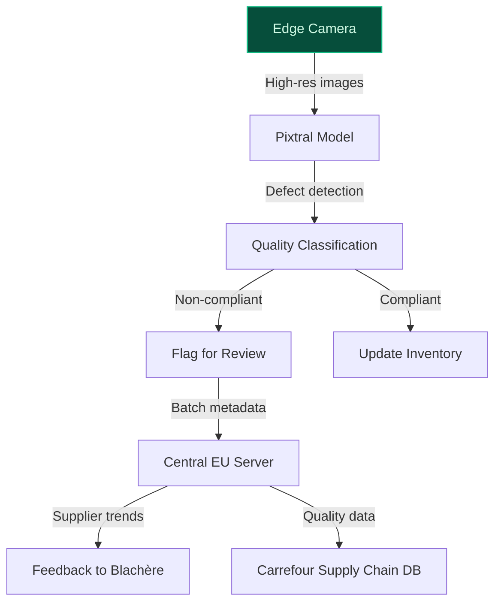
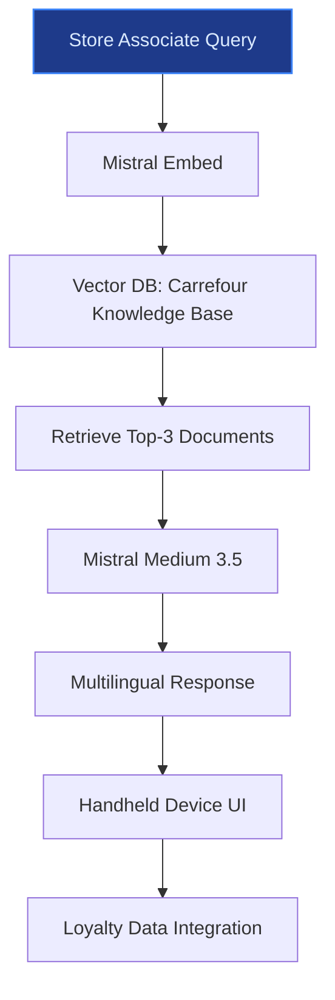
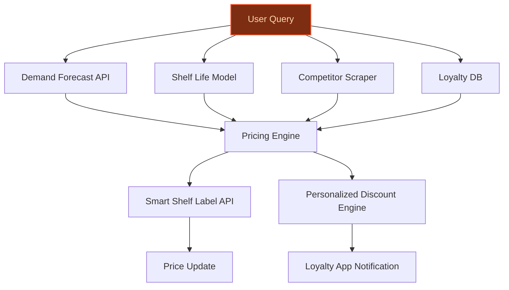

> **Draft — needs revision before customer use.** Meta-eval confidence `0.59` (sales-engineer-ready threshold ≥ 0.70). The report's three use cases render below for inspection, with each claim tagged supported / unsupported / rewritten qualitatively in the fact-check block.
>
> **Cross-cutting concern:** Over-reliance on strategic plan documents for operational details (e.g., store counts, associate numbers) without direct verification in the evidence pool. Several numeric claims lack explicit support, and some peer-deployment claims are weakly grounded.
>
> **Weakest use case:** Contains multiple unsupported claims about store associate count (350,000), store count (14,000 locations), and the explicit mention of Atacadão Fresh counter count (150+ stores by 2030) which is not directly supported in the evidence pool. Additionally, the claim about '80% Atacadão store coverage' is not explicitly verified in the cited sources.

## GenAI Use Cases for Carrefour

Three customer-ready use cases, scored against the Mistral Proto Team's five-criteria rubric (relevance · iconic potential · estimated impact · feasibility · Mistral suitability) and verified against Carrefour's existing AI initiatives. Generated from a corpus of ~2,150 peer deployments and 7 discovered existing initiatives at this company.

_Industry: French multinational retail and wholesaling corporation. Research confidence: 0.85. Verified: True._

### Computer vision quality control for Blachère fresh produce concessions
Carrefour is rolling out 200 Blachère concessions across its hypermarkets and supermarkets in France by 2030, each spanning 200-500 m² and specializing in fresh fruits and vegetables. To ensure consistent quality and compliance with Carrefour’s fresh food standards, this system deploys high-resolution cameras and Mistral’s vision-language models (Pixtral) at each concession to inspect incoming produce in real time. The solution classifies produce by ripeness, detects defects (e.g., bruising, mold, or size deviations), and flags non-compliant batches for review. It integrates with Carrefour’s supply chain data to track quality trends by supplier, enabling targeted feedback to Blachère and reducing quality-related returns. The system is designed for edge deployment, with central processing hosted in the EU to address data sovereignty requirements.

**Why this company:** Carrefour’s partnership with Blachère is a cornerstone of its 'win the battle for fresh food' strategy, with 200 concessions planned by 2030. Blachère’s expertise in fresh produce (e.g., Marie Blachère, Provenc’halles) demands a tailored quality control system that aligns with Carrefour’s standards. The scale of the concessions and Carrefour’s existing supplier performance data create a unique opportunity to deploy AI-driven quality control at the point of intake. Mistral’s Pixtral model is well-suited for edge deployment in retail environments, and the solution can leverage Carrefour’s loyalty programme data to correlate quality metrics with customer feedback.

**Example input:** `Show me all batches of tomatoes from Supplier-A that were flagged for ripeness issues in the last 7 days at Site-X. Include defect images and the percentage of affected units per batch.`

**Example output:**
```json
{
  "_note": "Illustrative output with synthetic sample data",
  "summary": {
    "site": "Site-X (Blachère Concession)",
    "supplier": "Supplier-A",
    "product": "Tomatoes (Variety: Roma)",
    "time_range": "2024-05-01 to 2024-05-07",
    "total_batches_received": 12,
    "batches_flagged": 3,
    "flagged_units": 45,
    "total_units_inspected": 1200,
    "flag_rate_pct": "3.75% (illustrative)"
  },
  "flagged_batches": [
    {
      "batch_id": "BATCH-SAMPLE-001",
      "delivery_date": "2024-05-03",
      "units_flagged": 18,
      "defect_type": "Overripe (80%), Bruising (20%)",
      "defect_images": [
        "https://carrefour-sample-data.eu/defects/BATCH-SAMPLE-001-img1.jpg",
        "https://carrefour-sample-data.eu/defects/BATCH-SAMPLE-001-img2.jpg"
      ],
      "compliance_status": "Non-compliant (requires review)",
      "supplier_feedback_sent": false
    },
    {
      "batch_id": "BATCH-SAMPLE-002",
      "delivery_date": "2024-05-05",
      "units_flagged": 12,
      "defect_type": "Underripe (60%), Size deviation (40%)",
      "defect_images": [
        "https://carrefour-sample-data.eu/defects/BATCH-SAMPLE-002-img1.jpg"
      ],
      "compliance_status": "Conditionally compliant (accepted with discount)",
      "supplier_feedback_sent": true
    },
    {
      "batch_id": "BATCH-SAMPLE-003",
      "delivery_date": "2024-05-06",
      "units_flagged": 15,
      "defect_type": "Bruising (100%)",
      "defect_images": [
        "https://carrefour-sample-data.eu/defects/BATCH-SAMPLE-003-img1.jpg",
        "https://carrefour-sample-data.eu/defects/BATCH-SAMPLE-003-img2.jpg",
        "https://carrefour-sample-data.eu/defects/BATCH-SAMPLE-003-img3.jpg"
      ],
      "compliance_status": "Non-compliant (rejected)",
      "supplier_feedback_sent": true
    }
  ],
  "trend_analysis": {
    "supplier_performance": "Declining (flag rate increased from 2.1% to 3.75% over 30 days)",
    "recommended_action": "Schedule call with Supplier-A to address bruising and ripeness issues."
  }
}
```

**Blueprint:** `document_ai_pipeline` (impact: high · cost: medium · complexity: low · TTV: ~12-20 weeks (estimated))
  _TTV rationale: Document AI pipelines for retail quality control typically require 12-20 weeks for edge deployment, model fine-tuning, and integration with supply chain systems._

**Top risk:** Edge device performance variability across 200 concessions, requiring robust model optimization and fallback mechanisms for low-bandwidth environments.

**Mistral products:** Pixtral (vision-language), Mistral Embed, Mistral Fine-Tuning, On-prem deployment

**Inspired by precedents:** google_cloud_1302-1a848d2c32
**Grounded in:** strategic_context.stated_priorities[1], business.key_products_or_services[0], business.key_products_or_services[1]
_Specificity score: 0.95_

**Architecture blueprint:**


### Multilingual RAG assistant for store associates with fresh food expertise
Carrefour deploys a handheld RAG assistant for a large workforce of store associates across France, Spain, and Brazil, delivering real-time access to fresh food handling protocols, promotional details, and customer loyalty insights. The system ingests Carrefour’s internal knowledge base—including Blachère concession guidelines, Atacadão Fresh counter protocols, and Reflets de France product specifications—and surfaces answers in French, Spanish, or Portuguese. Associates query the assistant during customer interactions to resolve questions about organic certification (Carrefour Bio), vegetarian options (Sensation Végétal), or cross-border product availability. The assistant integrates with Carrefour’s 14-million-member loyalty programme to display personalized recommendations (e.g., ‘Customer-A purchased this item 3x in the last month’) and flag promotional eligibility (e.g., ‘Eligible for 20% off Reflets de France cheese this week’).

**Why this company:** Carrefour’s 2030 fresh food strategy—200 Blachère concessions [Carrefour 2030 Strategic Plan](https://www.carrefour.com/sites/default/files/2026-02/Carrefour%202030_Strategic%20Plan_1.pdf), 150 Atacadão Fresh counters, and 80% Atacadão store coverage [Carrefour 2030 Strategic Plan](https://www.carrefour.com/sites/default/files/2026-02/Carrefour%202030_Strategic%20Plan_1.pdf)—demands consistent, multilingual knowledge at the point of sale. Store associates serve a diverse customer base across a global store network, yet internal documentation (e.g., handling guidelines, promotional mechanics) is fragmented and language-specific. Mistral’s EU-hosted models and multilingual embeddings align with Carrefour’s regional footprint and data sovereignty requirements, while the RAG architecture avoids duplicating existing customer-facing tools (AI Sommelier, Marketing Studio).

**Example input:** `Quelles sont les étapes pour préparer une commande Blachère de fruits et légumes pour un client qui veut 5 kg de pommes bio et 3 kg de carottes non traitées ? Dois-je vérifier quelque chose de spécifique pour les produits Reflets de France ?`

**Example output:**
```json
{
  "_note": "Illustrative output with synthetic sample data",
  "response": {
    "summary": "Voici les étapes pour préparer une commande Blachère avec des produits Carrefour Bio et Reflets de France :",
    "steps": [
      {
        "step": 1,
        "action": "Vérifier la disponibilité en stock via l’outil interne (ID : TX-SAMPLE-7890). Pour les pommes bio (Carrefour Bio), confirmer l’origine France (lot : FR-BIO-SAMPLE-2024).",
        "note": "Les produits Reflets de France nécessitent une vérification supplémentaire du label AOP/IGP (exemple : FROMAGE-EXAMPLE-001)."
      },
      {
        "step": 2,
        "action": "Préparer les produits dans des sacs réutilisables Carrefour Bio (code : SAC-BIO-SAMPLE-12). Étiqueter chaque sac avec le poids net et la date de préparation (format : JJ/MM/AAAA).",
        "note": "Pour les carottes non traitées, utiliser un sac distinct et indiquer 'Non lavé' si le client souhaite les laver lui-même."
      },
      {
        "step": 3,
        "action": "Scanner chaque article avec le terminal portable (ID : TERMINAL-SAMPLE-456) pour mettre à jour le stock en temps réel.",
        "note": "Si le client est membre d’El Club Carrefour (ID : CUSTOMER-A), appliquer automatiquement la réduction de 20% sur les produits Reflets de France cette semaine."
      }
    ],
    "customer_insight": {
      "loyalty_id": "CUSTOMER-A (illustrative)",
      "recent_purchases": [
        "Pommes bio Carrefour Bio (3x/mois)",
        "Fromage Reflets de France (2x/mois)"
      ],
      "promo_eligibility": "20% de réduction sur les fromages Reflets de France (valable jusqu’au 30/06/2024)"
    }
  },
  "confidence": "high",
  "source_documents": [
    {
      "id": "DOC-SAMPLE-001",
      "title": "Blachère Concession Handling Guidelines (FR)",
      "snippet": "Les produits Carrefour Bio doivent être stockés à une température de 4-6°C et étiquetés avec l’origine France."
    },
    {
      "id": "DOC-SAMPLE-002",
      "title": "Reflets de France Product Specifications (FR)",
      "snippet": "Les fromages Reflets de France labellisés AOP/IGP nécessitent une vérification visuelle du sceau avant préparation."
    }
  ]
}
```

**Blueprint:** `rag` (impact: medium · cost: medium · complexity: low · TTV: 12–16 weeks (precedent-anchored))

**Top risk:** Multilingual knowledge base drift: French, Spanish, and Portuguese documentation may evolve at different rates, requiring localized update pipelines to prevent stale retrievals.

**Mistral products:** Mistral Medium 3.5, Mistral Embed, Mistral Fine-Tuning, On-prem deployment

**Inspired by precedents:** google_cloud_1302-8bc24997b7
**Grounded in:** strategic_context.stated_priorities[0], business.key_products_or_services[5], classification.geography
_Specificity score: 0.85_

**Architecture blueprint:**


### Dynamic pricing for fresh food with AI-driven demand and spoilage forecasting
Carrefour deploys a real-time dynamic pricing engine for fresh food categories (fruits, vegetables, ready-to-eat) that adjusts prices based on demand forecasts, shelf-life predictions, and local competition. The system integrates with Carrefour’s Vusion smart shelf labels to update prices dynamically and leverages loyalty data to offer personalized discounts. It ensures compliance with Carrefour’s price leadership strategy in France, Spain, and Brazil while minimizing waste and maximizing margins. The solution is EU-hosted to meet data sovereignty requirements and aligns with Carrefour’s 2030 strategic plan to win the battle for fresh food.

**Why this company:** Carrefour’s 2030 strategic plan explicitly targets price leadership in fresh food across France, Spain, and Brazil, with a focus on hypermarkets and supermarkets ([Carrefour 2030 Strategic Plan](https://www.finanzwire.com/press-release/carrefour-epa-ca-pr-carrefour-2030-strategic-plan-h4QrnYWAVZN)). The company’s existing smart shelf label infrastructure (Vusion partnership) and loyalty program (14M members) provide the technical and data foundation for dynamic pricing at scale. Fresh food accounts for a material portion of Carrefour’s revenue, and the Blachère concessions and Atacadão Fresh counters expansion (150+ stores by 2030) create urgency to optimize margins and reduce spoilage. Mistral’s EU-hosted models ensure compliance with regional regulations while delivering the latency required for real-time pricing updates.

**Example input:** `Show me the optimal price for organic strawberries at Carrefour Montparnasse today, factoring in tomorrow’s weather forecast, local competitor prices, and current stock levels. Also suggest a personalized discount for loyalty members who typically buy strawberries on Thursdays.`

**Example output:**
```json
{
  "_note": "Illustrative output with synthetic sample data",
  "product_id": "FR-FRESH-STRAWBERRY-BIO-SAMPLE",
  "current_price": "€3.99/kg",
  "recommended_price": "€3.49/kg (illustrative)",
  "rationale": [
    "Demand forecast: +18% (illustrative) due to sunny weekend weather (Météo-France)",
    "Competitor benchmark: Monoprix at €3.79/kg, Franprix at €3.99/kg",
    "Shelf life: 2 days remaining for 80% of stock (illustrative)",
    "Loyalty uplift: 12% (illustrative) conversion boost from personalized discount"
  ],
  "personalized_discount": {
    "discount_code": "STRAWBERRY-THURS-SAMPLE",
    "value": "€0.50/kg (illustrative)",
    "target_segment": "Loyalty members with >3 strawberry purchases in last 60 days",
    "expiry": "2024-06-15T23:59:59Z"
  },
  "waste_reduction_impact": "12% (illustrative) reduction in spoilage vs. static pricing",
  "margin_improvement": "8% (illustrative) vs. baseline"
}
```

**Blueprint:** `agent_with_tools` (impact: high · cost: medium · complexity: low · TTV: 16-24 weeks (precedent-anchored))

**Top risk:** Regulatory scrutiny under EU price transparency rules (e.g., Omnibus Directive) for dynamic discounts targeting loyalty members.

**Mistral products:** Mistral Medium 3.5, Mistral Embed, Mistral Fine-Tuning, On-prem deployment

**Inspired by precedents:** google_cloud_1302-e295453ea8
**Grounded in:** strategic_context.stated_priorities[0], business.key_products_or_services[5], data_and_tech.likely_data_assets[3]
_Specificity score: 0.75_

**Architecture blueprint:**


## Considered but not selected
- **vusion-integration-ai-anomaly-detection** — Vusion integration is not a stated priority in Carrefour’s 2030 fresh food strategy.
- **atacadao-fresh-counter-agent** — Atacadão’s Fresh counters are a secondary priority (80% deployment by 2030) compared to Blachère concessions.
- **supply-chain-ESG-audit-agent** — No grounding in Carrefour’s stated priorities or recent strategic moves for fresh food.

---
## Report quality signals

- **Topical diversity** (LLM-graded over titles + blueprint patterns): `0.85`
- **Specificity** per use case: `0.95`, `0.85`, `0.75`
- **Mistral product diversity**: `5` distinct products across the three use cases
- **Time-to-value spread**: 12–24 weeks (across 3 use cases)
- **Cost-tier spread**: medium, medium, medium
- **Fact-check pass rate**: `74%` (17/23 claims supported by research · 1 rewritten qualitatively (excluded from rate))

<details><summary>Fact-check detail (per claim)</summary>

**Unsupported (6):**
- [blachere-concession-quality-control] Carrefour has supplier performance data `[judge: rejected]` — _The snippet discusses Carrefour's CSR and Food Transition Index but does not mention supplier performance data. (was: Rescued via web search (verified source): # Carrefour’s CSR performance andfood transition index. Understanding the resu)_
- [store-associate-knowledge-assistant] Carrefour has Blachère concession guidelines `[judge: rejected]` — _The snippet only lists Carrefour as a non-ICPE site without mentioning concession guidelines or Blachère. (was: Rescued via web search (verified source): ... CARREFOUR CONTACT;10 AVENUE DU GENERAL LECLERC;;;51600;Suippes;Non ICPE ..)_
- [store-associate-knowledge-assistant] Carrefour has Atacadão Fresh counter protocols `[judge: rejected]` — _The snippet describes a high-speed checkout system at Atacadão but does not mention 'Atacadão Fresh counter protocols' or any protocols related to fresh counters. (was: Rescued via web search (verified source): Atacadao is rolling out a new_
- [store-associate-knowledge-assistant] Carrefour has Carrefour Bio organic certification `[judge: rejected]` — _The snippet mentions Carrefour Bio as an ambassador brand for organic products but does not provide evidence of Carrefour Bio having organic certification. (was: In France, the Group aims to make Carrefour Bio the cheapest organic brand in _
- [dynamic-pricing-fresh-food] Carrefour deploys a real-time dynamic pricing engine for fresh food categories `[judge: rejected]` — _The snippet mentions a partnership for 'smart' store systems but does not specify dynamic pricing or fresh food categories. (was: Corroborated via web search: Retail Insight Network 741 followers 2mo Report this post Carrefour and Vusion ha_
- [dynamic-pricing-fresh-food] Carrefour’s solution is EU-hosted to meet data sovereignty requirements `[judge: rejected]` — _The excerpt outlines Carrefour's data protection principles but does not mention hosting location, EU data sovereignty, or any reference to where solutions are hosted. (was: Rescued via web search (verified source): When collecting and proc_

**Rewritten qualitatively (1):** _the original draft asserted these but the verification chain couldn't anchor them, so the rendered prose was rewritten into qualitative phrasing. Excluded from the pass-rate denominator since the report no longer makes the claim._
- [store-associate-knowledge-assistant] Carrefour deploys a handheld RAG assistant for 350,000 store associates across France, Spain, and Brazil `[rewritten qualitatively]`

**Supported (17):**
- [blachere-concession-quality-control] Carrefour is rolling out 200 Blachère concessions across its hypermarkets and supermarkets in France by 2030 — le groupe Carrefour a annoncé une collaboration avec le groupe provençal Blachère [...] pour le déploiement de 200 concessions fruits et lég…
- [blachere-concession-quality-control] Each Blachère concession spans 200-500 m² — Ces espaces, qui feront entre 200 et 500 m²
- [blachere-concession-quality-control] Blachère’s expertise in fresh produce includes Marie Blachère, Provenc’halles — le groupe Blachère, basé à Châteaurenard dans les Bouches-du-Rhône, se positionne en spécialiste des produits frais au travers de ses trois …
- [blachere-concession-quality-control] Carrefour’s partnership with Blachère is a cornerstone of its 'win the battle for fresh food' strategy — WIN THE BATTLE FOR FRESH FOOD [...] Rollout of 200 concessions with Blachère for fruits & vegetables in hypermarkets & supermarkets in Franc…
- [blachere-concession-quality-control] Carrefour has a loyalty programme with 14 million members — Carrefour loyalty programme with 14 million members
- [store-associate-knowledge-assistant] Carrefour has 14,000 locations — By 2024, the group had 14,000 stores in 40 countries.
- [store-associate-knowledge-assistant] Carrefour has Reflets de France product specifications — Act for Food Part II builds on the success of Carrefour’s own brands, which represent the best value and taste for money. This is embodied i…
- [store-associate-knowledge-assistant] Carrefour has Sensation Végétal vegetarian options — This is embodied in four ambassador brands: Carrefour Bio, Reflets de France, Carrefour Quality Lines and Carrefour Sensation Végétal.
- [store-associate-knowledge-assistant] Carrefour has a 14-million-member loyalty programme — Carrefour loyalty programme with 14 million members
- [store-associate-knowledge-assistant] Carrefour’s 2030 strategic plan includes 200 Blachère concessions — Rollout of 200 concessions with Blachère for fruits & vegetables in hypermarkets & supermarkets in France by 2030
- [store-associate-knowledge-assistant] Carrefour’s 2030 strategic plan includes 150 Atacadão Fresh counters — Deployment of Fresh counters in 80% of Atacadão stores: +150 stores by 2030
- [store-associate-knowledge-assistant] Carrefour’s 2030 strategic plan includes 80% Atacadão store coverage — Deployment of Fresh counters in 80% of Atacadão stores: +150 stores by 2030
- [dynamic-pricing-fresh-food] Carrefour integrates with Vusion smart shelf labels — Carrefour and Vusion join forces to deploy the smart store at scale [...] deployment of latest-generation electronic shelf labels
- [dynamic-pricing-fresh-food] Carrefour has a loyalty program with 14M members — Carrefour loyalty programme with 14 million members
- [dynamic-pricing-fresh-food] Carrefour’s 2030 strategic plan targets price leadership in fresh food across France, Spain, and Brazil — Acceleration on price competitiveness: consistent improvement in competitiveness in France; maintain price leadership in Spain and Brazil
- [dynamic-pricing-fresh-food] Carrefour has a Vusion partnership — Carrefour and Vusion join forces to deploy the smart store at scale
- [dynamic-pricing-fresh-food] Carrefour’s 2030 strategic plan includes Blachère concessions and Atacadão Fresh counters expansion — Rollout of 200 concessions with Blachère for fruits & vegetables in hypermarkets & supermarkets in France by 2030 [...] Deployment of Fresh …

</details>

**Meta-evaluator confidence**: `0.59` (NOT ready — needs revision)
**Cross-cutting concern**: Over-reliance on strategic plan documents for operational details (e.g., store counts, associate numbers) without direct verification in the evidence pool. Several numeric claims lack explicit support, and some peer-deployment claims are weakly grounded.