# Pipeline blueprint (architecture)

Static view of the pipeline regardless of run timing — shows agents,
models, and gates. The chronological execution log follows below.

```mermaid
flowchart TD
    Start([User: company name]) --> R
    R["<b>1. Research</b><br/>parallel: Wikipedia · Tavily news ·<br/>existing initiatives · live verification<br/><i>mistral-medium</i> synthesis"]
    R --> G["<b>1b. Gap-fill</b><br/>identify missing fields →<br/><i>mistral-small</i> generates queries →<br/>Tavily search per field →<br/><i>mistral-small</i> per-field extraction"]
    G --> Conf{Confidence ≥ 0.5<br/>OR verified<br/>OR ≥ 1 existing initiative?}
    Conf -->|no| Refuse([Refusal])
    Conf -->|yes| Ret
    Ret["<b>2. Retrieve</b><br/><i>mistral-embed</i> on company query →<br/>cosine top-K + industry/depth filter +<br/>MMR diversification"]
    Ret --> Gen["<b>3. Generate 12 candidates</b><br/><i>mistral-medium</i> with web_search tool<br/>(Tavily + deep-read) — fact citations<br/>flow into the EvidenceLedger"]
    Gen --> Score["<b>4. Score</b><br/>self-consistency: 2 parallel passes<br/><i>mistral-small</i> @ T=0.2 and T=0.4 →<br/>aggregate weighted scores"]
    Score --> Verify["<b>5. Per-candidate verify</b><br/>top-3: Tavily search + deep-read +<br/><i>mistral-small</i> verdict (pass /<br/>partial / confirmed_existing)"]
    Verify --> Enrich["<b>6. Enrich</b><br/><i>mistral-large</i> drafts customer-facing<br/>prose for 3 use cases (or<br/><i>mistral-medium</i> on fast tier)"]
    Enrich --> NumScrub["<b>6a. Numeric scrub</b><br/>flag any number not in cited content"]
    NumScrub --> Polish["<b>6b. Polish</b><br/><i>mistral-small</i> per use case (parallel):<br/>convert markers→qualitative,<br/>(ev-XXX)→[title](url)"]
    Polish --> Attr["<b>6c. Attribution check</b><br/><i>mistral-small</i> per use case (parallel):<br/>fix corpus-ID ↔ company mismatches"]
    Attr --> Meta["<b>7. Meta-evaluation</b><br/><i>mistral-medium</i> reviews report against<br/>cited precedents + ledger entries:<br/>strict claim verification"]
    Meta --> WV["<b>7c. Web-verify rescue</b><br/>2-tier credibility classifier<br/>(verified allowlist · corroborated)"]
    WV --> J["<b>7d. Source judge</b><br/><i>mistral-small</i> adjudicates each<br/>(claim, source) pair · self-correcting"]
    J --> FQ["<b>7e. Final qualify</b><br/><i>mistral-small</i> rewrites unsupported<br/>numerics into qualitative phrasing"]
    FQ --> QS
    QS["<b>Quality signals</b><br/>LLM-graded diversity + specificity,<br/>fact-check pass rate, TTV/cost spread"]
    QS --> Render([Markdown report + trace])

    classDef agent fill:#fef3c7,stroke:#f59e0b
    classDef gate fill:#dbeafe,stroke:#3b82f6
    classDef io fill:#dcfce7,stroke:#16a34a
    class R,G,Ret,Gen,Score,Verify,Enrich,NumScrub,Polish,Attr,Meta,WV,J,FQ,QS agent
    class Conf gate
    class Start,Refuse,Render io
```

## Execution trace — Carrefour

Started: `2026-05-10T14:33:28.562383+00:00`. Total wall time: `162.7s` across `54` recorded actions.

### Per-step time totals

| Step | Calls | Total time | Avg time |
|---|---:|---:|---:|
| `research` | 1 | 9.36s | 9358ms |
| `gap_fill` | 4 | 3.24s | 809ms |
| `retrieve` | 2 | 0.53s | 266ms |
| `generate` | 2 | 43.30s | 21652ms |
| `generate.web_search` | 2 | 5.87s | 2933ms |
| `score` | 2 | 41.49s | 20745ms |
| `verify` | 6 | 20.00s | 3333ms |
| `enrich` | 3 | 86.66s | 28885ms |
| `polish` | 2 | 5.14s | 2571ms |
| `meta_eval` | 1 | 15.49s | 15488ms |
| `web_verify` | 1 | 3.93s | 3934ms |
| `source_judge` | 25 | 19.60s | 784ms |
| `final_qualify` | 1 | 2.47s | 2473ms |
| `quality_signals` | 2 | 3.90s | 1948ms |

### Chronological event log

- `14:33:29.318` **[research]** `mistral-medium-2604.chat.complete` — 9358ms
   - inputs: synthesize CompanyContext for Carrefour | depth=medium
   - outputs: industry='French multinational retail and wholesaling corporation' verified=True conf=0.75
- `14:33:38.677` **[gap_fill]** `mistral-small-2603.chat.complete` — 1009ms
   - inputs: generate gap queries | fields=['business_model', 'products', 'data_assets', 'priorities']
   - outputs: queries=4
- `14:33:42.860` **[gap_fill]** `mistral-small-2603.chat.complete` — 1022ms
   - inputs: layer-2 extract field=priorities
   - outputs: items=6
- `14:33:42.864` **[gap_fill]** `mistral-small-2603.chat.complete` — 632ms
   - inputs: layer-2 extract field=data_assets
   - outputs: items=6
- `14:33:42.867` **[gap_fill]** `mistral-small-2603.chat.complete` — 573ms
   - inputs: layer-2 extract field=products
   - outputs: items=6
- `14:33:43.884` **[retrieve]** `mistral-embed.embeddings.create` — 212ms
   - inputs: company_query | industries='French multinational retail and wholesaling corporation'
   - outputs: embedded 1024-dim query vector
- `14:33:44.096` **[retrieve]** `precedent_corpus.cosine_topk` — 320ms
   - inputs: k=8 min_depth=0.4 target='Carrefour'
   - outputs: retrieved 8 | mmr=True | top_sim=0.797
- `14:33:44.799` **[generate]** `mistral-medium-2604.chat.complete` — 2114ms
   - inputs: iteration=0 tool_calls_used=0/2 tools=on
   - outputs: tool_calls=4 | content_chars=0
- `14:33:46.934` **[generate.web_search]** `tavily.search` — 2477ms
   - inputs: query='Carrefour 2024 fresh food strategy Blachère concessions'
   - outputs: 2 raw results
- `14:33:50.662` **[generate.web_search]** `tavily.search` — 3389ms
   - inputs: query='Carrefour Atacadão Fresh counters 2030 expansion'
   - outputs: 2 raw results
- `14:33:54.071` **[generate]** `mistral-medium-2604.chat.complete` — 41191ms
   - inputs: iteration=1 tool_calls_used=2/2 tools=off
   - outputs: tool_calls=0 | content_chars=25623
- `14:34:35.595` **[score]** `mistral-small-2603.chat.complete` — 17637ms
   - inputs: self-consistency pass T=0.2
   - outputs: scored 12 candidates
- `14:34:35.599` **[score]** `mistral-small-2603.chat.complete` — 23853ms
   - inputs: self-consistency pass T=0.4
   - outputs: scored 12 candidates
- `14:34:59.481` **[verify]** `tavily.search` — 3461ms
   - inputs: candidate=fresh-food-shelf-life-prediction | query='Carrefour AI-powered fresh food shelf-life prediction for pe'
   - outputs: 4 results
- `14:34:59.481` **[verify]** `tavily.search` — 2839ms
   - inputs: candidate=blachere-concession-quality-control | query='Carrefour Computer vision quality control for Blachère fresh'
   - outputs: 4 results
- `14:34:59.481` **[verify]** `tavily.search` — 2541ms
   - inputs: candidate=vusion-integration-ai-anomaly-detection | query='Carrefour AI-driven anomaly detection for Vusion smart shelf'
   - outputs: 4 results
- `14:35:02.574` **[verify]** `mistral-small-2603.chat.complete` — 4776ms
   - inputs: verdict for vusion-integration-ai-anomaly-detection
   - outputs: verdict='confirmed_existing'
- `14:35:03.681` **[verify]** `mistral-small-2603.chat.complete` — 4464ms
   - inputs: verdict for fresh-food-shelf-life-prediction
   - outputs: verdict='confirmed_existing'
- `14:35:03.906` **[verify]** `mistral-small-2603.chat.complete` — 1913ms
   - inputs: verdict for blachere-concession-quality-control
   - outputs: verdict='pass'
- `14:35:08.148` **[enrich]** `mistral-large-2512.chat.complete` — 29177ms
   - inputs: tier=standard parallel=True ids=['blachere-concession-quality-control']
   - outputs: enriched 1 use cases
- `14:35:08.184` **[enrich]** `mistral-large-2512.chat.complete` — 31703ms
   - inputs: tier=standard parallel=True ids=['store-associate-knowledge-assistant']
   - outputs: enriched 1 use cases
- `14:35:08.186` **[enrich]** `mistral-large-2512.chat.complete` — 25777ms
   - inputs: tier=standard parallel=True ids=['dynamic-pricing-fresh-food']
   - outputs: enriched 1 use cases
- `14:35:39.909` **[polish]** `mistral-small-2603.chat.complete` — 2833ms
   - inputs: use_case=store-associate-knowledge-assistant unanchored=True opaque_ev=False
   - outputs: polished 5 fields
- `14:35:39.914` **[polish]** `mistral-small-2603.chat.complete` — 2309ms
   - inputs: use_case=dynamic-pricing-fresh-food unanchored=True opaque_ev=False
   - outputs: polished 5 fields
- `14:35:42.745` **[meta_eval]** `mistral-medium-2604.chat.complete` — 15488ms
   - inputs: reviewing 3 use cases
   - outputs: review + claims
- `14:35:58.252` **[web_verify]** `tavily.search.rescue_unsupported_claims` — 3934ms
   - inputs: company='Carrefour' unsupported=6 budget=12
   - outputs: rescued: verified=5 corroborated=1 of 6 attempted
- `14:36:02.186` **[source_judge]** `mistral-small-2603.judge_claim_sources` — 2479ms
   - inputs: pairs=24
   - outputs: judged 24 pairs
- `14:36:02.187` **[source_judge]** `mistral-small-2603.chat.complete` — 658ms
   - inputs: claim='Carrefour is rolling out 200 Blachère concessions across its'
   - outputs: verdict=supported
- `14:36:02.192` **[source_judge]** `mistral-small-2603.chat.complete` — 708ms
   - inputs: claim='Each Blachère concession spans 200-500 m²'
   - outputs: verdict=supported
- `14:36:02.194` **[source_judge]** `mistral-small-2603.chat.complete` — 967ms
   - inputs: claim='Blachère’s expertise in fresh produce includes Marie Blachèr'
   - outputs: verdict=supported
- `14:36:02.197` **[source_judge]** `mistral-small-2603.chat.complete` — 916ms
   - inputs: claim='Carrefour’s partnership with Blachère is a cornerstone of it'
   - outputs: verdict=supported
- `14:36:02.200` **[source_judge]** `mistral-small-2603.chat.complete` — 707ms
   - inputs: claim='Carrefour has supplier performance data'
   - outputs: verdict=unsupported
- `14:36:02.204` **[source_judge]** `mistral-small-2603.chat.complete` — 680ms
   - inputs: claim='Carrefour has a loyalty programme with 14 million members'
   - outputs: verdict=supported
- `14:36:02.207` **[source_judge]** `mistral-small-2603.chat.complete` — 647ms
   - inputs: claim='Carrefour deploys a handheld RAG assistant for 350,000 store'
   - outputs: verdict=unsupported
- `14:36:02.209` **[source_judge]** `mistral-small-2603.chat.complete` — 850ms
   - inputs: claim='Carrefour has 14,000 locations'
   - outputs: verdict=supported
- `14:36:02.845` **[source_judge]** `mistral-small-2603.chat.complete` — 576ms
   - inputs: claim='Carrefour has Blachère concession guidelines'
   - outputs: verdict=unsupported
- `14:36:02.854` **[source_judge]** `mistral-small-2603.chat.complete` — 661ms
   - inputs: claim='Carrefour has Atacadão Fresh counter protocols'
   - outputs: verdict=unsupported
- `14:36:02.884` **[source_judge]** `mistral-small-2603.chat.complete` — 595ms
   - inputs: claim='Carrefour has Reflets de France product specifications'
   - outputs: verdict=supported
- `14:36:02.900` **[source_judge]** `mistral-small-2603.chat.complete` — 972ms
   - inputs: claim='Carrefour has Carrefour Bio organic certification'
   - outputs: verdict=unsupported
- `14:36:02.907` **[source_judge]** `mistral-small-2603.chat.complete` — 682ms
   - inputs: claim='Carrefour has Sensation Végétal vegetarian options'
   - outputs: verdict=supported
- `14:36:03.059` **[source_judge]** `mistral-small-2603.chat.complete` — 573ms
   - inputs: claim='Carrefour has a 14-million-member loyalty programme'
   - outputs: verdict=supported
- `14:36:03.113` **[source_judge]** `mistral-small-2603.chat.complete` — 599ms
   - inputs: claim='Carrefour’s 2030 strategic plan includes 200 Blachère conces'
   - outputs: verdict=supported
- `14:36:03.162` **[source_judge]** `mistral-small-2603.chat.complete` — 577ms
   - inputs: claim='Carrefour’s 2030 strategic plan includes 150 Atacadão Fresh '
   - outputs: verdict=supported
- `14:36:03.421` **[source_judge]** `mistral-small-2603.chat.complete` — 1245ms
   - inputs: claim='Carrefour’s 2030 strategic plan includes 80% Atacadão store '
   - outputs: verdict=supported
- `14:36:03.479` **[source_judge]** `mistral-small-2603.chat.complete` — 587ms
   - inputs: claim='Carrefour deploys a real-time dynamic pricing engine for fre'
   - outputs: verdict=unsupported
- `14:36:03.515` **[source_judge]** `mistral-small-2603.chat.complete` — 592ms
   - inputs: claim='Carrefour integrates with Vusion smart shelf labels'
   - outputs: verdict=supported
- `14:36:03.589` **[source_judge]** `mistral-small-2603.chat.complete` — 549ms
   - inputs: claim='Carrefour has a loyalty program with 14M members'
   - outputs: verdict=supported
- `14:36:03.632` **[source_judge]** `mistral-small-2603.chat.complete` — 792ms
   - inputs: claim='Carrefour’s 2030 strategic plan targets price leadership in '
   - outputs: verdict=supported
- `14:36:03.713` **[source_judge]** `mistral-small-2603.chat.complete` — 540ms
   - inputs: claim='Carrefour has a Vusion partnership'
   - outputs: verdict=supported
- `14:36:03.738` **[source_judge]** `mistral-small-2603.chat.complete` — 788ms
   - inputs: claim='Carrefour’s 2030 strategic plan includes Blachère concession'
   - outputs: verdict=supported
- `14:36:03.872` **[source_judge]** `mistral-small-2603.chat.complete` — 660ms
   - inputs: claim='Carrefour’s solution is EU-hosted to meet data sovereignty r'
   - outputs: verdict=unsupported
- `14:36:04.666` **[final_qualify]** `mistral-small-2603.chat.complete` — 2473ms
   - inputs: use_case=store-associate-knowledge-assistant unsupported=2
   - outputs: qualified 4 fields
- `14:36:07.354` **[quality_signals]** `mistral-small-2603.chat.complete` — 2596ms
   - inputs: specificity grade (3 use cases)
   - outputs: scored 3 use cases
- `14:36:09.950` **[quality_signals]** `mistral-small-2603.chat.complete` — 1300ms
   - inputs: diversity grade
   - outputs: diversity=0.85

## Mermaid sequence diagram (execution)

```mermaid
sequenceDiagram
    autonumber
    participant pipeline as pipeline
    participant mistral_medium_2604 as mistral-medium-2604
    participant mistral_small_2603 as mistral-small-2603
    participant mistral_embed as mistral-embed
    participant precedent_corpus as precedent_corpus
    participant tavily as tavily
    participant mistral_large_2512 as mistral-large-2512
    participant tavily_search as tavily.search
    pipeline->>mistral_medium_2604: research: chat.complete (9358ms)
    mistral_medium_2604-->>pipeline: industry='French multinational retail and wholesaling corpor
    pipeline->>mistral_small_2603: gap_fill: chat.complete (1009ms)
    mistral_small_2603-->>pipeline: queries=4
    pipeline->>mistral_small_2603: gap_fill: chat.complete (1022ms)
    mistral_small_2603-->>pipeline: items=6
    pipeline->>mistral_small_2603: gap_fill: chat.complete (632ms)
    mistral_small_2603-->>pipeline: items=6
    pipeline->>mistral_small_2603: gap_fill: chat.complete (573ms)
    mistral_small_2603-->>pipeline: items=6
    pipeline->>mistral_embed: retrieve: embeddings.create (212ms)
    mistral_embed-->>pipeline: embedded 1024-dim query vector
    pipeline->>precedent_corpus: retrieve: cosine_topk (320ms)
    precedent_corpus-->>pipeline: retrieved 8 | mmr=True | top_sim=0.797
    pipeline->>mistral_medium_2604: generate: chat.complete (2114ms)
    mistral_medium_2604-->>pipeline: tool_calls=4 | content_chars=0
    pipeline->>tavily: generate.web_search: search (2477ms)
    tavily-->>pipeline: 2 raw results
    pipeline->>tavily: generate.web_search: search (3389ms)
    tavily-->>pipeline: 2 raw results
    pipeline->>mistral_medium_2604: generate: chat.complete (41191ms)
    mistral_medium_2604-->>pipeline: tool_calls=0 | content_chars=25623
    pipeline->>mistral_small_2603: score: chat.complete (17637ms)
    mistral_small_2603-->>pipeline: scored 12 candidates
    pipeline->>mistral_small_2603: score: chat.complete (23853ms)
    mistral_small_2603-->>pipeline: scored 12 candidates
    pipeline->>tavily: verify: search (3461ms)
    tavily-->>pipeline: 4 results
    pipeline->>tavily: verify: search (2839ms)
    tavily-->>pipeline: 4 results
    pipeline->>tavily: verify: search (2541ms)
    tavily-->>pipeline: 4 results
    pipeline->>mistral_small_2603: verify: chat.complete (4776ms)
    mistral_small_2603-->>pipeline: verdict='confirmed_existing'
    pipeline->>mistral_small_2603: verify: chat.complete (4464ms)
    mistral_small_2603-->>pipeline: verdict='confirmed_existing'
    pipeline->>mistral_small_2603: verify: chat.complete (1913ms)
    mistral_small_2603-->>pipeline: verdict='pass'
    pipeline->>mistral_large_2512: enrich: chat.complete (29177ms)
    mistral_large_2512-->>pipeline: enriched 1 use cases
    pipeline->>mistral_large_2512: enrich: chat.complete (31703ms)
    mistral_large_2512-->>pipeline: enriched 1 use cases
    pipeline->>mistral_large_2512: enrich: chat.complete (25777ms)
    mistral_large_2512-->>pipeline: enriched 1 use cases
    pipeline->>mistral_small_2603: polish: chat.complete (2833ms)
    mistral_small_2603-->>pipeline: polished 5 fields
    pipeline->>mistral_small_2603: polish: chat.complete (2309ms)
    mistral_small_2603-->>pipeline: polished 5 fields
    pipeline->>mistral_medium_2604: meta_eval: chat.complete (15488ms)
    mistral_medium_2604-->>pipeline: review + claims
    pipeline->>tavily_search: web_verify: rescue_unsupported_claims (3934ms)
    tavily_search-->>pipeline: rescued: verified=5 corroborated=1 of 6 attempted
    pipeline->>mistral_small_2603: source_judge: judge_claim_sources (2479ms)
    mistral_small_2603-->>pipeline: judged 24 pairs
    pipeline->>mistral_small_2603: source_judge: chat.complete (658ms)
    mistral_small_2603-->>pipeline: verdict=supported
    pipeline->>mistral_small_2603: source_judge: chat.complete (708ms)
    mistral_small_2603-->>pipeline: verdict=supported
    pipeline->>mistral_small_2603: source_judge: chat.complete (967ms)
    mistral_small_2603-->>pipeline: verdict=supported
    pipeline->>mistral_small_2603: source_judge: chat.complete (916ms)
    mistral_small_2603-->>pipeline: verdict=supported
    pipeline->>mistral_small_2603: source_judge: chat.complete (707ms)
    mistral_small_2603-->>pipeline: verdict=unsupported
    pipeline->>mistral_small_2603: source_judge: chat.complete (680ms)
    mistral_small_2603-->>pipeline: verdict=supported
    pipeline->>mistral_small_2603: source_judge: chat.complete (647ms)
    mistral_small_2603-->>pipeline: verdict=unsupported
    pipeline->>mistral_small_2603: source_judge: chat.complete (850ms)
    mistral_small_2603-->>pipeline: verdict=supported
    pipeline->>mistral_small_2603: source_judge: chat.complete (576ms)
    mistral_small_2603-->>pipeline: verdict=unsupported
    pipeline->>mistral_small_2603: source_judge: chat.complete (661ms)
    mistral_small_2603-->>pipeline: verdict=unsupported
    pipeline->>mistral_small_2603: source_judge: chat.complete (595ms)
    mistral_small_2603-->>pipeline: verdict=supported
    pipeline->>mistral_small_2603: source_judge: chat.complete (972ms)
    mistral_small_2603-->>pipeline: verdict=unsupported
    pipeline->>mistral_small_2603: source_judge: chat.complete (682ms)
    mistral_small_2603-->>pipeline: verdict=supported
    pipeline->>mistral_small_2603: source_judge: chat.complete (573ms)
    mistral_small_2603-->>pipeline: verdict=supported
    pipeline->>mistral_small_2603: source_judge: chat.complete (599ms)
    mistral_small_2603-->>pipeline: verdict=supported
    pipeline->>mistral_small_2603: source_judge: chat.complete (577ms)
    mistral_small_2603-->>pipeline: verdict=supported
    pipeline->>mistral_small_2603: source_judge: chat.complete (1245ms)
    mistral_small_2603-->>pipeline: verdict=supported
    pipeline->>mistral_small_2603: source_judge: chat.complete (587ms)
    mistral_small_2603-->>pipeline: verdict=unsupported
    pipeline->>mistral_small_2603: source_judge: chat.complete (592ms)
    mistral_small_2603-->>pipeline: verdict=supported
    pipeline->>mistral_small_2603: source_judge: chat.complete (549ms)
    mistral_small_2603-->>pipeline: verdict=supported
    pipeline->>mistral_small_2603: source_judge: chat.complete (792ms)
    mistral_small_2603-->>pipeline: verdict=supported
    pipeline->>mistral_small_2603: source_judge: chat.complete (540ms)
    mistral_small_2603-->>pipeline: verdict=supported
    pipeline->>mistral_small_2603: source_judge: chat.complete (788ms)
    mistral_small_2603-->>pipeline: verdict=supported
    pipeline->>mistral_small_2603: source_judge: chat.complete (660ms)
    mistral_small_2603-->>pipeline: verdict=unsupported
    pipeline->>mistral_small_2603: final_qualify: chat.complete (2473ms)
    mistral_small_2603-->>pipeline: qualified 4 fields
    pipeline->>mistral_small_2603: quality_signals: chat.complete (2596ms)
    mistral_small_2603-->>pipeline: scored 3 use cases
    pipeline->>mistral_small_2603: quality_signals: chat.complete (1300ms)
    mistral_small_2603-->>pipeline: diversity=0.85
```

