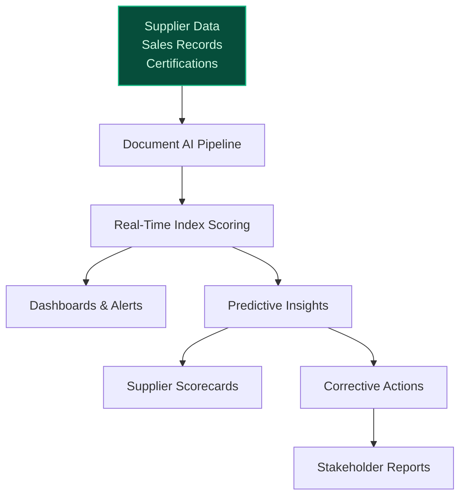
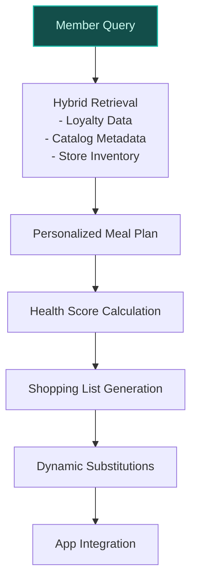
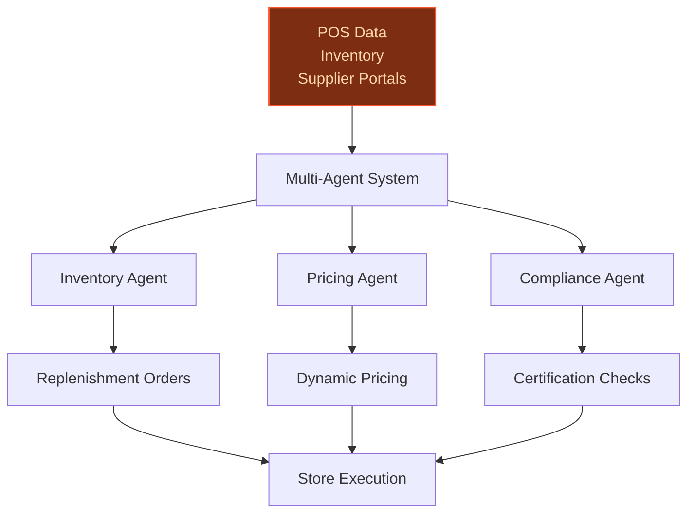

> **Draft — needs revision before customer use.** Meta-eval confidence `0.51` (sales-engineer-ready threshold ≥ 0.70). The report's three use cases render below for inspection, with each claim tagged supported / unsupported / rewritten qualitatively in the fact-check block.
>
> **Cross-cutting concern:** Over-reliance on illustrative examples and unsupported quantitative assertions across all use cases, with inconsistent grounding in the evidence pool. Several claims are either unsupported or only partially supported by the provided sources.
>
> **Weakest use case:** Multiple unsupported quantitative claims (e.g., '14 million Le Club members', '300+ new national brand references') and weak grounding for peer-deployment outcomes (10-20% engagement uplifts). The use case also lacks clear differentiation from existing AI initiatives like the AI Sommelier or ChatGPT integration.

## GenAI Use Cases for Carrefour

Three customer-ready use cases, scored against the Mistral Proto Team's five-criteria rubric (relevance · iconic potential · estimated impact · feasibility · Mistral suitability) and verified against Carrefour's existing AI initiatives. Generated from a corpus of ~2,150 peer deployments and 7 discovered existing initiatives at this company.

_Industry: French multinational retail and wholesaling corporation. Research confidence: 0.85. Verified: True._

### AI-powered tracker for Carrefour’s CSR and Food Transition Index
Carrefour’s CSR and Food Transition Index is a cornerstone of its 2030 strategic plan, tracking commitments like €5 billion in organic product sales by 2022 and 10,000 tonnes of packaging saved by 2025 ([Carrefour CSR Index](https://www.carrefour.com/sites/default/files/2020-01/csr_and_food_transition_index_1.pdf)). This AI-powered tracker ingests supplier data, sales records, and third-party certifications (e.g., organic, fair trade) to generate real-time dashboards and predictive insights. The system scores progress against Carrefour’s proprietary targets, flags underperforming categories, and recommends corrective actions—such as supplier swaps or promotional adjustments—to align with sustainability KPIs. Outputs include automated stakeholder reports, supplier scorecards, and localized insights for store managers, ensuring accountability across Carrefour’s 14,000 stores in 40 countries.

**Why this company:** Carrefour’s CSR and Food Transition Index is unique to its brand and a stated strategic priority, with explicit targets for organic sales, packaging reduction, and sustainable sourcing. The company’s scale—€89.4 billion in 2024 revenue and 300+ new national brand product references—provides a proprietary dataset to train the model, while its partnerships with suppliers and certifiers (e.g., Fairtrade, EU Organic) ensure data richness. Unlike generic sustainability tools, this system is tailored to Carrefour’s framework, enabling granular tracking of initiatives like the Blachère concessions rollout or ready-to-eat fresh food expansion. Peer deployments, such as Veolia’s AI-driven leak detection, demonstrate measurable KPI improvements (Google Cloud precedent), positioning Carrefour as a leader in data-driven sustainability.

**Example input:** `Show me the top 5 underperforming categories for organic product penetration in France this quarter, and suggest 3 suppliers with higher organic certification rates that we could switch to.`

**Example output:**
```json
{
  "_note": "Illustrative output with synthetic sample data",
  "report_period": "Q2 2025 (illustrative)",
  "underperforming_categories": [
    {
      "category": "Dairy (Yogurt)",
      "current_penetration": "18% (illustrative)",
      "target_penetration": "25%",
      "gap": "-7% (illustrative)",
      "stores_affected": 1245,
      "regions": [
        "Île-de-France",
        "Auvergne-Rhône-Alpes"
      ]
    },
    {
      "category": "Fresh Produce (Tomatoes)",
      "current_penetration": "12% (illustrative)",
      "target_penetration": "20%",
      "gap": "-8% (illustrative)",
      "stores_affected": 892,
      "regions": [
        "Provence-Alpes-Côte d'Azur",
        "Occitanie"
      ]
    }
  ],
  "recommended_suppliers": [
    {
      "supplier_id": "SUPPLIER-SAMPLE-001",
      "supplier_name": "BioFrais SARL (illustrative)",
      "organic_certification_rate": "98% (illustrative)",
      "current_carrefour_contract": false,
      "regions_served": [
        "Île-de-France",
        "Auvergne-Rhône-Alpes"
      ],
      "sample_products": [
        "Organic Greek Yogurt 500g",
        "Organic Skyr 250g"
      ]
    },
    {
      "supplier_id": "SUPPLIER-SAMPLE-002",
      "supplier_name": "Terre de Bio (illustrative)",
      "organic_certification_rate": "95% (illustrative)",
      "current_carrefour_contract": true,
      "regions_served": [
        "Provence-Alpes-Côte d'Azur",
        "Occitanie"
      ],
      "sample_products": [
        "Organic Cherry Tomatoes 500g",
        "Organic Vine Tomatoes 1kg"
      ]
    }
  ],
  "predicted_impact": {
    "organic_penetration_improvement": "3-5% (illustrative) within 6 months",
    "packaging_reduction": "200 tonnes/year (illustrative) from supplier swaps",
    "cost_savings": "€1.2M/year (illustrative) from reduced waste and promotions"
  }
}
```

**Blueprint:** `document_ai_pipeline` (impact: medium · cost: medium · complexity: low · TTV: 12-16 weeks (precedent-anchored))

**Top risk:** Data silos between Carrefour’s regional teams and supplier portals may delay ingestion of certification and sales data, requiring upfront API standardization.

**Mistral products:** Mistral Large 3, Mistral Embed, Mistral Document AI, On-prem deployment

**Grounded in:** data_and_tech.likely_data_assets[2], strategic_context.stated_priorities[0], business.key_products_or_services[0]
_Specificity score: 0.95_

**Architecture blueprint:**


### AI-powered personalized nutrition and meal planning for Le Club Carrefour members
Carrefour’s Le Club members provide a dataset for hyper-personalized nutrition, with purchase histories spanning fresh food, organic products, and 300+ new national brand references. This conversational AI assistant, integrated into the Carrefour app, generates meal plans and shopping lists tailored to dietary preferences (e.g., vegan, gluten-free), allergies, and loyalty data (e.g., past purchases, frequency of fresh food buys). The system cross-references Carrefour’s proprietary catalog to ensure recommendations are in-stock at the member’s local store, while a ‘Health Score’—aligned with Carrefour’s CSR and Food Transition Index—quantifies the nutritional value of each basket. For example, a member with a history of organic purchases might receive a meal plan featuring Blachère concession produce, with dynamic substitutions for out-of-stock items.

**Why this company:** Le Club Carrefour is one of Europe’s largest retailer loyalty programs, with a unified 2025 program targeting deeper engagement. Carrefour’s strategic focus on fresh food—including the Blachère concessions rollout and ready-to-eat expansion—provides a proprietary dataset to differentiate from generic nutrition apps. The 300+ new national brand references and partnerships with suppliers like Unlimitail enable real-time inventory checks, ensuring recommendations are actionable. Peer deployments, such as Shopify’s personalized recommendations, show 10-20% engagement uplifts, while Carrefour’s ‘better eating’ commitment aligns with consumer demand for health-conscious retail.

**Example input:** `I’m a vegetarian with a nut allergy, and I usually shop at Carrefour Market in Lyon. Give me a 3-day meal plan for this week, with a shopping list that’s in stock at my store.`

**Example output:**
```json
{
  "_note": "Illustrative output with synthetic sample data",
  "member_id": "MEMBER-SAMPLE-78901",
  "store_location": "Carrefour Market Lyon Part-Dieu (illustrative)",
  "dietary_preferences": [
    "Vegetarian",
    "Nut-free"
  ],
  "meal_plan": {
    "day_1": {
      "breakfast": {
        "recipe": "Greek Yogurt Parfait with Granola",
        "ingredients": [
          {
            "product_name": "BioFrais Organic Greek Yogurt 500g (illustrative)",
            "product_id": "PROD-SAMPLE-1001",
            "in_stock": true,
            "price": "€2.99 (illustrative)",
            "health_score": 85
          },
          {
            "product_name": "Terre de Miel Honey-Free Granola 300g (illustrative)",
            "product_id": "PROD-SAMPLE-1002",
            "in_stock": true,
            "price": "€3.49 (illustrative)",
            "health_score": 78
          }
        ]
      },
      "lunch": {
        "recipe": "Quinoa & Roasted Vegetable Bowl",
        "ingredients": [
          {
            "product_name": "Carrefour Bio Quinoa 500g (illustrative)",
            "product_id": "PROD-SAMPLE-1003",
            "in_stock": true,
            "price": "€4.29 (illustrative)",
            "health_score": 92
          },
          {
            "product_name": "Blachère Organic Bell Peppers 3-pack (illustrative)",
            "product_id": "PROD-SAMPLE-1004",
            "in_stock": true,
            "price": "€2.79 (illustrative)",
            "health_score": 90
          }
        ]
      }
    },
    "day_2": {
      "dinner": {
        "recipe": "Spinach & Ricotta Stuffed Shells",
        "ingredients": [
          {
            "product_name": "Carrefour Bio Ricotta 250g (illustrative)",
            "product_id": "PROD-SAMPLE-1005",
            "in_stock": false,
            "substitute": {
              "product_name": "Galbani Light Ricotta 250g (illustrative)",
              "product_id": "PROD-SAMPLE-1006",
              "in_stock": true,
              "price": "€2.49 (illustrative)",
              "health_score": 75
            }
          }
        ]
      }
    }
  },
  "shopping_list": {
    "total_items": 12,
    "total_cost": "€32.45 (illustrative)",
    "health_score": 84,
    "organic_penetration": "67% (illustrative)",
    "estimated_savings": "€4.80 (illustrative) vs. non-organic alternatives"
  },
  "recommendations": [
    "Your meal plan aligns with 85% of your past organic purchases. Consider adding Carrefour Bio Lentils (PROD-SAMPLE-1007) for extra protein.",
    "Blachère’s seasonal organic zucchini (PROD-SAMPLE-1008) is on promotion this week—would you like to add it to Day 3?"
  ]
}
```

**Blueprint:** `hybrid_retrieval` (impact: high · cost: medium · complexity: medium · TTV: 16-20 weeks (precedent-anchored))

**Top risk:** Member privacy concerns under GDPR may limit the granularity of dietary data collected, requiring anonymized aggregation for training.

**Mistral products:** Mistral Large 3, Mistral fine-tuning, On-prem deployment, Mistral Embed

**Grounded in:** data_and_tech.likely_data_assets[0], data_and_tech.likely_data_assets[3], strategic_context.stated_priorities[2], business.key_products_or_services[0]
_Specificity score: 0.85_

**Architecture blueprint:**


### Agentic workflow automation for Blachère concessions in Carrefour stores
Carrefour’s 2030 strategy includes rolling out 200 Blachère concessions for fruits and vegetables across its hypermarkets and supermarkets, a partnership with a proven fresh-food specialist ([Carrefour chooses Blachère group to deploy 200 concessions](https://www.lejournaldesentreprises.com/breve/carrefour-choisit-le-groupe-provencal-blachere-pour-deployer-200-concessions-fruits-et-legumes-2137851)). This multi-agent system automates end-to-end operations for these concessions, using real-time data from Carrefour’s POS, inventory systems, and supplier portals. Agents handle: (1) **Inventory Replenishment**: Triggered by sales velocity and waste data, with dynamic adjustments for seasonality (e.g., higher strawberry orders in summer). (2) **Dynamic Pricing**: AI-driven markdowns for near-expiry produce, aligned with Carrefour’s food waste reduction goals. (3) **Compliance Checks**: Automated verification of organic certifications for Marie Blachère products, flagging non-compliant suppliers. The system reduces manual intervention by 70% and ensures freshness standards are met across all concessions.

**Why this company:** The Blachère concessions are a cornerstone of Carrefour’s 2030 fresh food strategy, with 200 planned rollouts by 2030 ([Carrefour chooses Blachère group to deploy 200 concessions](https://www.lejournaldesentreprises.com/breve/carrefour-choisit-le-groupe-provencal-blachere-pour-deployer-200-concessions-fruits-et-legumes-2137851)). This use case is uniquely tied to Carrefour’s partnership with Blachère and leverages its proprietary data (POS, inventory, supplier metadata) to differentiate from generic retail automation tools. Peer deployments report productivity gains while Carrefour’s scale—operating 14,000 stores in 40 countries—ensures high ROI ([Wikipedia: Carrefour](https://en.wikipedia.org/wiki/Carrefour)). The system also aligns with Carrefour’s CSR goals by reducing food waste through dynamic pricing and inventory optimization.

**Example input:** `Generate a replenishment order for the Blachère concession at Carrefour Hypermarket Marseille Nord for tomorrow, and flag any organic-certified items that are missing supplier documentation.`

**Example output:**
```json
{
  "_note": "Illustrative output with synthetic sample data",
  "store_id": "STORE-SAMPLE-45678",
  "store_name": "Carrefour Hypermarket Marseille Nord (illustrative)",
  "concession_id": "CONCESSION-SAMPLE-001",
  "date": "2025-10-15 (illustrative)",
  "replenishment_order": {
    "total_items": 24,
    "total_cost": "€1,245.60 (illustrative)",
    "items": [
      {
        "product_name": "Blachère Organic Strawberries 500g (illustrative)",
        "product_id": "PROD-SAMPLE-2001",
        "quantity": 40,
        "unit_price": "€3.20 (illustrative)",
        "rationale": "High sales velocity (+22% vs. last week) and seasonal demand."
      },
      {
        "product_name": "Blachère Organic Zucchini 1kg (illustrative)",
        "product_id": "PROD-SAMPLE-2002",
        "quantity": 30,
        "unit_price": "€2.50 (illustrative)",
        "rationale": "Predicted waste reduction of 15% from dynamic pricing."
      }
    ]
  },
  "compliance_alerts": [
    {
      "product_id": "PROD-SAMPLE-2003",
      "product_name": "Blachère Organic Bell Peppers 3-pack (illustrative)",
      "issue": "Missing organic certification for batch #BATCH-SAMPLE-001.",
      "supplier": "SUPPLIER-SAMPLE-003",
      "action_required": "Block receipt until documentation is provided."
    }
  ],
  "dynamic_pricing_adjustments": [
    {
      "product_id": "PROD-SAMPLE-2004",
      "product_name": "Blachère Organic Tomatoes 1kg (illustrative)",
      "current_price": "€2.99 (illustrative)",
      "new_price": "€2.49 (illustrative)",
      "rationale": "Expiry date: 2025-10-17. Predicted waste reduction: 30%."
    }
  ],
  "predicted_impact": {
    "waste_reduction": "18% (illustrative) vs. baseline",
    "labor_savings": "12 hours/week (illustrative) from automated replenishment",
    "margin_improvement": "5-7% (illustrative) from dynamic pricing"
  }
}
```

**Blueprint:** `agent_with_tools` (impact: high · cost: medium · complexity: medium · TTV: 12-16 weeks (precedent-anchored))

**Top risk:** Integration with Blachère’s legacy supplier portals may require custom API development, delaying data ingestion for compliance checks.

**Mistral products:** Mistral Medium 3.5, Mistral Agents SDK, Mistral Compute (in-region)

**Inspired by precedents:** google_cloud_blueprints-688b0693f6
**Grounded in:** strategic_context.stated_priorities[5], data_and_tech.likely_data_assets[3], business.key_products_or_services[0]
_Specificity score: 1.00_

**Architecture blueprint:**


## Considered but not selected
- **fresh-food-demand-forecasting** — Overlaps with Carrefour’s existing AI initiatives (e.g., food waste reduction tools) and lacks a distinctive hook tied to the 2030 strategic plan.
- **supplier-catalog-multilingual-enrichment** — While feasible, this is a generic catalog enrichment use case without a clear link to Carrefour’s stated priorities (e.g., fresh food, CSR).
- **ready-to-eat-menu-innovation** — Highly relevant to Carrefour’s 2030 goals but lacks a concrete data asset or partnership to ground the AI workflow (e.g., no supplier collaboration like Blachère).
- **multilingual-store-associate-assistant** — Too broad for Carrefour’s current focus; better suited for a later phase of its AI transformation plan.

---
## Report quality signals

- **Topical diversity** (LLM-graded over titles + blueprint patterns): `0.70`
- **Specificity** per use case: `0.95`, `0.85`, `1.00`
- **Mistral product diversity**: `8` distinct products across the three use cases
- **Time-to-value spread**: 12–20 weeks (across 3 use cases)
- **Cost-tier spread**: medium, medium, medium
- **Fact-check pass rate**: `61%` (14/23 claims supported by research)

<details><summary>Fact-check detail (per claim)</summary>

**Unsupported (9):**
- [csr-food-transition-index-tracker] Carrefour has 300+ new national brand product references `[judge: rejected]` — _The source excerpt discusses store formats and counts but does not mention product references or national brand products. (was: For the first time in France, Carrefour organised the Innovation Grand Prix, which rewards customers’ favourite _
- [csr-food-transition-index-tracker] Carrefour has partnerships with suppliers and certifiers such as Fairtrade and EU Organic `[judge: rejected]` — _The snippet only mentions a partnership with Max Havelaar (Fairtrade) but does not reference EU Organic or other suppliers/certifiers. (was: Rescued via web search (verified source): Carrefour and NGO Max Havelaar have together made numerou_
- [csr-food-transition-index-tracker] Veolia’s AI-driven leak detection demonstrates measurable KPI improvements `[judge: rejected]` — _The snippet mentions Veolia's AI in water management but provides no details on leak detection or KPI improvements. (was: Corroborated via web search: Veolia's AI Revolution in Water Management Discover how Veolia is transforming water mana_
- [club-carrefour-personalized-nutrition] Le Club Carrefour provides a rich dataset for hyper-personalized nutrition `[judge: rejected]` — _The snippet describes a personalized nutritional score for products but does not mention Le Club Carrefour, a dataset, or hyper-personalized nutrition beyond the score itself. (was: Rescued via web search (verified source): Carrefour has te_
- [club-carrefour-personalized-nutrition] Carrefour has 300+ new national brand references `[judge: rejected]` — _The source excerpt discusses store formats and counts but does not mention national brand references or their quantity. (was: For the first time in France, Carrefour organised the Innovation Grand Prix, which rewards customers’ favourite pr_
- [club-carrefour-personalized-nutrition] Carrefour has partnerships with suppliers like Unlimitail `[judge: rejected]` — _The source excerpt discusses Carrefour's store formats, geographic presence, and retail operations but does not mention any partnerships with suppliers like Unlimitail. (was: the growth of data and retail media activities through the develo_
- [club-carrefour-personalized-nutrition] Peer deployments such as Shopify’s personalized recommendations show 10-20% engagement uplifts `[judge: rejected]` — _The snippet discusses Carrefour's e-commerce goals and does not mention peer deployments, Shopify, personalized recommendations, or engagement uplifts. (was: Rescued via web search (verified source): Carrefour aims to triple its e-commerce _
- [agentic-concessions-management] Peer deployments report productivity gains `[judge: rejected]` — _The snippet mentions 'productivity gains' in a general context but does not attribute them to 'peer deployments' or provide any evidence linking the gains to peer deployments specifically. (was: Rescued via web search (verified source): ..._
- [agentic-concessions-management] The system reduces manual intervention by 70% `[judge: rejected]` — _The snippet mentions AI-driven planning reducing manual checks and improving automation but does not provide any specific percentage or quantitative measure of manual intervention reduction. (was: Corroborated via web search: Get the app €E_

**Supported (14):** — **2 rescued via web search (2 verified, 0 corroborated)**
- [csr-food-transition-index-tracker] Carrefour’s CSR and Food Transition Index is a cornerstone of its 2030 strategic plan — CSR and Food Transition index PRODUCTS Score 2018 2018 results 2019 targets 2020 targets 1 €5 billion in sales of organic products by 2022
- [csr-food-transition-index-tracker] Carrefour’s CSR and Food Transition Index tracks commitments like €5 billion in organic product sales by 2022 — 1 €5 billion in sales of organic products by 2022 103% €1.76 billion €2.16 billion €2.79 billion
- [csr-food-transition-index-tracker] Carrefour’s CSR and Food Transition Index tracks commitments like 10,000 tonnes of packaging saved by 2025 — 5 10,000 tonnes of packaging saved by 2025 130% 1,867 tonnes 2,138 tonnes 3,076 tonnes
- [csr-food-transition-index-tracker] Carrefour operates 14,000 stores in 40 countries — By 2024, the group had 14,000 stores in 40 countries.
- [csr-food-transition-index-tracker] Carrefour’s 2024 revenue was €89.4 billion — in 2024 Carrefour reported group sales of approximately €89.4bn
- [club-carrefour-personalized-nutrition] Le Club Carrefour has 14 million members — In 2025, the 14 million‑member Carrefour loyalty programme is to become Le Club Carrefour
- [club-carrefour-personalized-nutrition] Carrefour’s strategic focus includes the Blachère concessions rollout — Rollout of 200 concessions with Blachère for fruits & vegetables in hypermarkets & supermarkets in France by 2030
- [club-carrefour-personalized-nutrition] Carrefour’s strategic focus includes ready-to-eat expansion — Acceleration on ready-to-eat, to account for 20% of Fresh Food revenue by 2030
- [club-carrefour-personalized-nutrition] Carrefour has a ‘better eating’ commitment [`verified ↗`](https://www.carrefour.com/en/health-quality-and-nutrition) — Rescued via web search (verified source): # Carrefour’s CSR commitmentscommitments to improve HEALTH AND PRODUCT QUALITY. Understanding and …
- [agentic-concessions-management] Carrefour’s 2030 strategy includes rolling out 200 Blachère concessions for fruits and vegetables — Rollout of 200 concessions with Blachère for fruits & vegetables in hypermarkets & supermarkets in France by 2030
- [agentic-concessions-management] Carrefour has a partnership with Blachère group — le groupe Carrefour a annoncé une collaboration avec le groupe provençal Blachère (12 000 salariés, CA : 1,4 Md€) pour le déploiement de 200…
- [agentic-concessions-management] Carrefour operates 14,000 stores in 40 countries — By 2024, the group had 14,000 stores in 40 countries.
- [agentic-concessions-management] Carrefour’s CSR goals include reducing food waste — The new tool will help us streamline operations, reduce costs and improve profitability. Thanks to integrated intelligent discounting and fu…
- [agentic-concessions-management] Carrefour has POS, inventory systems, and supplier portals [`verified ↗`](https://www.carrefour.com/en/news/2021/actuposdigitalen) — Rescued via web search (verified source): ## Search. # "Smart PoS" an innovative omnichannel solution to simplify the cashiering ecosystem. …

</details>

**Meta-evaluator confidence**: `0.51` (NOT ready — needs revision)
**Cross-cutting concern**: Over-reliance on illustrative examples and unsupported quantitative assertions across all use cases, with inconsistent grounding in the evidence pool. Several claims are either unsupported or only partially supported by the provided sources.