# Pipeline blueprint (architecture)

Static view of the pipeline regardless of run timing — shows agents,
models, and gates. The chronological execution log follows below.

```mermaid
flowchart TD
    Start([User: company name]) --> R
    R["<b>1. Research</b><br/>parallel: Wikipedia · Tavily news ·<br/>existing initiatives · live verification<br/><i>mistral-medium</i> synthesis"]
    R --> G["<b>1b. Gap-fill</b><br/>identify missing fields →<br/><i>mistral-small</i> generates queries →<br/>Tavily search per field →<br/><i>mistral-small</i> per-field extraction"]
    G --> Conf{Confidence ≥ 0.5<br/>OR verified<br/>OR ≥ 1 existing initiative?}
    Conf -->|no| Refuse([Refusal])
    Conf -->|yes| Ret
    Ret["<b>2. Retrieve</b><br/><i>mistral-embed</i> on company query →<br/>cosine top-K + industry/depth filter +<br/>MMR diversification"]
    Ret --> Gen["<b>3. Generate 12 candidates</b><br/><i>mistral-medium</i> with web_search tool<br/>(Tavily + deep-read) — fact citations<br/>flow into the EvidenceLedger"]
    Gen --> Score["<b>4. Score</b><br/>self-consistency: 2 parallel passes<br/><i>mistral-small</i> @ T=0.2 and T=0.4 →<br/>aggregate weighted scores"]
    Score --> Verify["<b>5. Per-candidate verify</b><br/>top-3: Tavily search + deep-read +<br/><i>mistral-small</i> verdict (pass /<br/>partial / confirmed_existing)"]
    Verify --> Enrich["<b>6. Enrich</b><br/><i>mistral-large</i> drafts customer-facing<br/>prose for 3 use cases (or<br/><i>mistral-medium</i> on fast tier)"]
    Enrich --> NumScrub["<b>6a. Numeric scrub</b><br/>flag any number not in cited content"]
    NumScrub --> Polish["<b>6b. Polish</b><br/><i>mistral-small</i> per use case (parallel):<br/>convert markers→qualitative,<br/>(ev-XXX)→[title](url)"]
    Polish --> Attr["<b>6c. Attribution check</b><br/><i>mistral-small</i> per use case (parallel):<br/>fix corpus-ID ↔ company mismatches"]
    Attr --> Meta["<b>7. Meta-evaluation</b><br/><i>mistral-medium</i> reviews report against<br/>cited precedents + ledger entries:<br/>strict claim verification"]
    Meta --> WV["<b>7c. Web-verify rescue</b><br/>2-tier credibility classifier<br/>(verified allowlist · corroborated)"]
    WV --> J["<b>7d. Source judge</b><br/><i>mistral-small</i> adjudicates each<br/>(claim, source) pair · self-correcting"]
    J --> FQ["<b>7e. Final qualify</b><br/><i>mistral-small</i> rewrites unsupported<br/>numerics into qualitative phrasing"]
    FQ --> QS
    QS["<b>Quality signals</b><br/>LLM-graded diversity + specificity,<br/>fact-check pass rate, TTV/cost spread"]
    QS --> Render([Markdown report + trace])

    classDef agent fill:#fef3c7,stroke:#f59e0b
    classDef gate fill:#dbeafe,stroke:#3b82f6
    classDef io fill:#dcfce7,stroke:#16a34a
    class R,G,Ret,Gen,Score,Verify,Enrich,NumScrub,Polish,Attr,Meta,WV,J,FQ,QS agent
    class Conf gate
    class Start,Refuse,Render io
```

## Execution trace — Carrefour

Started: `2026-05-10T14:36:40.120564+00:00`. Total wall time: `197.4s` across `51` recorded actions.

### Per-step time totals

| Step | Calls | Total time | Avg time |
|---|---:|---:|---:|
| `research` | 1 | 11.16s | 11160ms |
| `gap_fill` | 4 | 3.78s | 946ms |
| `retrieve` | 2 | 0.49s | 247ms |
| `generate` | 2 | 43.07s | 21535ms |
| `generate.web_search` | 2 | 3.69s | 1844ms |
| `score` | 1 | 17.59s | 17593ms |
| `verify` | 6 | 18.69s | 3116ms |
| `enrich` | 1 | 66.12s | 66125ms |
| `polish` | 3 | 12.33s | 4111ms |
| `meta_eval` | 1 | 13.21s | 13213ms |
| `web_verify` | 1 | 5.17s | 5169ms |
| `source_judge` | 24 | 21.68s | 903ms |
| `final_qualify` | 1 | 1.94s | 1945ms |
| `quality_signals` | 2 | 8.06s | 4030ms |

### Chronological event log

- `14:36:40.730` **[research]** `mistral-medium-2604.chat.complete` — 11160ms
   - inputs: synthesize CompanyContext for Carrefour | depth=medium
   - outputs: industry='French multinational retail and wholesaling corporation' verified=True conf=0.75
- `14:36:51.892` **[gap_fill]** `mistral-small-2603.chat.complete` — 1246ms
   - inputs: generate gap queries | fields=['business_model', 'products', 'data_assets', 'priorities']
   - outputs: queries=4
- `14:36:56.511` **[gap_fill]** `mistral-small-2603.chat.complete` — 1058ms
   - inputs: layer-2 extract field=priorities
   - outputs: items=8
- `14:36:56.514` **[gap_fill]** `mistral-small-2603.chat.complete` — 767ms
   - inputs: layer-2 extract field=data_assets
   - outputs: items=6
- `14:36:56.516` **[gap_fill]** `mistral-small-2603.chat.complete` — 711ms
   - inputs: layer-2 extract field=products
   - outputs: items=12
- `14:36:57.570` **[retrieve]** `mistral-embed.embeddings.create` — 182ms
   - inputs: company_query | industries='French multinational retail and wholesaling corporation'
   - outputs: embedded 1024-dim query vector
- `14:36:57.751` **[retrieve]** `precedent_corpus.cosine_topk` — 313ms
   - inputs: k=8 min_depth=0.4 target='Carrefour'
   - outputs: retrieved 8 | mmr=True | top_sim=0.793
- `14:36:58.440` **[generate]** `mistral-medium-2604.chat.complete` — 1850ms
   - inputs: iteration=0 tool_calls_used=0/2 tools=on
   - outputs: tool_calls=4 | content_chars=0
- `14:37:00.307` **[generate.web_search]** `tavily.search` — 2962ms
   - inputs: query='Carrefour El Club Carrefour loyalty program data scale 2024'
   - outputs: 2 raw results
- `14:37:03.294` **[generate.web_search]** `tavily.search` — 727ms
   - inputs: query='Carrefour fresh food 2030 strategy Blachère concessions'
   - outputs: 2 raw results
- `14:37:05.362` **[generate]** `mistral-medium-2604.chat.complete` — 41220ms
   - inputs: iteration=1 tool_calls_used=2/2 tools=off
   - outputs: tool_calls=0 | content_chars=25014
- `14:37:46.896` **[score]** `mistral-small-2603.chat.complete` — 17593ms
   - inputs: self-consistency pass T=0.3
   - outputs: scored 12 candidates
- `14:38:04.520` **[verify]** `tavily.search` — 2088ms
   - inputs: candidate=fresh-food-demand-forecasting | query='Carrefour AI-driven demand forecasting for fresh food catego'
   - outputs: 4 results
- `14:38:04.521` **[verify]** `tavily.search` — 2769ms
   - inputs: candidate=supplier-catalog-multilingual-enrichment | query='Carrefour Multilingual catalog enrichment and standardizatio'
   - outputs: 4 results
- `14:38:04.521` **[verify]** `tavily.search` — 2338ms
   - inputs: candidate=csr-food-transition-index-tracker | query='Carrefour AI-powered tracker for Carrefour’s CSR and Food Tr'
   - outputs: 4 results
- `14:38:07.776` **[verify]** `mistral-small-2603.chat.complete` — 4827ms
   - inputs: verdict for fresh-food-demand-forecasting
   - outputs: verdict='confirmed_existing'
- `14:38:07.807` **[verify]** `mistral-small-2603.chat.complete` — 3340ms
   - inputs: verdict for supplier-catalog-multilingual-enrichment
   - outputs: verdict='confirmed_existing'
- `14:38:07.816` **[verify]** `mistral-small-2603.chat.complete` — 3331ms
   - inputs: verdict for csr-food-transition-index-tracker
   - outputs: verdict='pass'
- `14:38:12.606` **[enrich]** `mistral-large-2512.chat.complete` — 66125ms
   - inputs: tier=standard parallel=False ids=['csr-food-transition-index-tracker', 'club-carrefour-personalized-nutrition', 'agentic-concessions-management']
   - outputs: enriched 3 use cases
- `14:39:18.750` **[polish]** `mistral-small-2603.chat.complete` — 2754ms
   - inputs: use_case=csr-food-transition-index-tracker unanchored=True opaque_ev=False
   - outputs: polished 5 fields
- `14:39:18.785` **[polish]** `mistral-small-2603.chat.complete` — 2404ms
   - inputs: use_case=club-carrefour-personalized-nutrition unanchored=True opaque_ev=False
   - outputs: polished 5 fields
- `14:39:18.788` **[polish]** `mistral-small-2603.chat.complete` — 7177ms
   - inputs: use_case=agentic-concessions-management unanchored=True opaque_ev=False
   - outputs: polished 5 fields
- `14:39:25.966` **[meta_eval]** `mistral-medium-2604.chat.complete` — 13213ms
   - inputs: reviewing 3 use cases
   - outputs: review + claims
- `14:39:39.194` **[web_verify]** `tavily.search.rescue_unsupported_claims` — 5169ms
   - inputs: company='Carrefour' unsupported=8 budget=12
   - outputs: rescued: verified=6 corroborated=2 of 8 attempted
- `14:39:44.364` **[source_judge]** `mistral-small-2603.judge_claim_sources` — 2938ms
   - inputs: pairs=23
   - outputs: judged 23 pairs
- `14:39:44.364` **[source_judge]** `mistral-small-2603.chat.complete` — 1720ms
   - inputs: claim='Carrefour’s CSR and Food Transition Index is a cornerstone o'
   - outputs: verdict=supported
- `14:39:44.367` **[source_judge]** `mistral-small-2603.chat.complete` — 829ms
   - inputs: claim='Carrefour’s CSR and Food Transition Index tracks commitments'
   - outputs: verdict=supported
- `14:39:44.369` **[source_judge]** `mistral-small-2603.chat.complete` — 979ms
   - inputs: claim='Carrefour’s CSR and Food Transition Index tracks commitments'
   - outputs: verdict=supported
- `14:39:44.374` **[source_judge]** `mistral-small-2603.chat.complete` — 1103ms
   - inputs: claim='Carrefour operates 14,000 stores in 40 countries'
   - outputs: verdict=supported
- `14:39:44.377` **[source_judge]** `mistral-small-2603.chat.complete` — 852ms
   - inputs: claim='Carrefour’s 2024 revenue was €89.4 billion'
   - outputs: verdict=supported
- `14:39:44.379` **[source_judge]** `mistral-small-2603.chat.complete` — 2044ms
   - inputs: claim='Carrefour has 300+ new national brand product references'
   - outputs: verdict=unsupported
- `14:39:44.382` **[source_judge]** `mistral-small-2603.chat.complete` — 971ms
   - inputs: claim='Carrefour has partnerships with suppliers and certifiers suc'
   - outputs: verdict=unsupported
- `14:39:44.386` **[source_judge]** `mistral-small-2603.chat.complete` — 869ms
   - inputs: claim='Veolia’s AI-driven leak detection demonstrates measurable KP'
   - outputs: verdict=unsupported
- `14:39:45.196` **[source_judge]** `mistral-small-2603.chat.complete` — 723ms
   - inputs: claim='Le Club Carrefour has 14 million members'
   - outputs: verdict=supported
- `14:39:45.229` **[source_judge]** `mistral-small-2603.chat.complete` — 590ms
   - inputs: claim='Le Club Carrefour provides a rich dataset for hyper-personal'
   - outputs: verdict=unsupported
- `14:39:45.255` **[source_judge]** `mistral-small-2603.chat.complete` — 631ms
   - inputs: claim='Carrefour has 300+ new national brand references'
   - outputs: verdict=unsupported
- `14:39:45.347` **[source_judge]** `mistral-small-2603.chat.complete` — 546ms
   - inputs: claim='Carrefour has partnerships with suppliers like Unlimitail'
   - outputs: verdict=unsupported
- `14:39:45.352` **[source_judge]** `mistral-small-2603.chat.complete` — 573ms
   - inputs: claim='Carrefour’s strategic focus includes the Blachère concession'
   - outputs: verdict=supported
- `14:39:45.477` **[source_judge]** `mistral-small-2603.chat.complete` — 613ms
   - inputs: claim='Carrefour’s strategic focus includes ready-to-eat expansion'
   - outputs: verdict=supported
- `14:39:45.819` **[source_judge]** `mistral-small-2603.chat.complete` — 686ms
   - inputs: claim='Peer deployments such as Shopify’s personalized recommendati'
   - outputs: verdict=unsupported
- `14:39:45.886` **[source_judge]** `mistral-small-2603.chat.complete` — 570ms
   - inputs: claim='Carrefour has a ‘better eating’ commitment'
   - outputs: verdict=supported
- `14:39:45.894` **[source_judge]** `mistral-small-2603.chat.complete` — 561ms
   - inputs: claim='Carrefour’s 2030 strategy includes rolling out 200 Blachère '
   - outputs: verdict=supported
- `14:39:45.919` **[source_judge]** `mistral-small-2603.chat.complete` — 536ms
   - inputs: claim='Carrefour has a partnership with Blachère group'
   - outputs: verdict=supported
- `14:39:45.926` **[source_judge]** `mistral-small-2603.chat.complete` — 465ms
   - inputs: claim='Carrefour operates 14,000 stores in 40 countries'
   - outputs: verdict=supported
- `14:39:46.084` **[source_judge]** `mistral-small-2603.chat.complete` — 670ms
   - inputs: claim='Peer deployments report productivity gains'
   - outputs: verdict=unsupported
- `14:39:46.090` **[source_judge]** `mistral-small-2603.chat.complete` — 580ms
   - inputs: claim='Carrefour’s CSR goals include reducing food waste'
   - outputs: verdict=supported
- `14:39:46.391` **[source_judge]** `mistral-small-2603.chat.complete` — 911ms
   - inputs: claim='Carrefour has POS, inventory systems, and supplier portals'
   - outputs: verdict=supported
- `14:39:46.423` **[source_judge]** `mistral-small-2603.chat.complete` — 725ms
   - inputs: claim='The system reduces manual intervention by 70%'
   - outputs: verdict=unsupported
- `14:39:47.303` **[final_qualify]** `mistral-small-2603.chat.complete` — 1945ms
   - inputs: use_case=club-carrefour-personalized-nutrition unsupported=1
   - outputs: qualified 4 fields
- `14:39:49.485` **[quality_signals]** `mistral-small-2603.chat.complete` — 2725ms
   - inputs: specificity grade (3 use cases)
   - outputs: scored 3 use cases
- `14:39:52.210` **[quality_signals]** `mistral-small-2603.chat.complete` — 5334ms
   - inputs: diversity grade
   - outputs: diversity=0.7

## Mermaid sequence diagram (execution)

```mermaid
sequenceDiagram
    autonumber
    participant pipeline as pipeline
    participant mistral_medium_2604 as mistral-medium-2604
    participant mistral_small_2603 as mistral-small-2603
    participant mistral_embed as mistral-embed
    participant precedent_corpus as precedent_corpus
    participant tavily as tavily
    participant mistral_large_2512 as mistral-large-2512
    participant tavily_search as tavily.search
    pipeline->>mistral_medium_2604: research: chat.complete (11160ms)
    mistral_medium_2604-->>pipeline: industry='French multinational retail and wholesaling corpor
    pipeline->>mistral_small_2603: gap_fill: chat.complete (1246ms)
    mistral_small_2603-->>pipeline: queries=4
    pipeline->>mistral_small_2603: gap_fill: chat.complete (1058ms)
    mistral_small_2603-->>pipeline: items=8
    pipeline->>mistral_small_2603: gap_fill: chat.complete (767ms)
    mistral_small_2603-->>pipeline: items=6
    pipeline->>mistral_small_2603: gap_fill: chat.complete (711ms)
    mistral_small_2603-->>pipeline: items=12
    pipeline->>mistral_embed: retrieve: embeddings.create (182ms)
    mistral_embed-->>pipeline: embedded 1024-dim query vector
    pipeline->>precedent_corpus: retrieve: cosine_topk (313ms)
    precedent_corpus-->>pipeline: retrieved 8 | mmr=True | top_sim=0.793
    pipeline->>mistral_medium_2604: generate: chat.complete (1850ms)
    mistral_medium_2604-->>pipeline: tool_calls=4 | content_chars=0
    pipeline->>tavily: generate.web_search: search (2962ms)
    tavily-->>pipeline: 2 raw results
    pipeline->>tavily: generate.web_search: search (727ms)
    tavily-->>pipeline: 2 raw results
    pipeline->>mistral_medium_2604: generate: chat.complete (41220ms)
    mistral_medium_2604-->>pipeline: tool_calls=0 | content_chars=25014
    pipeline->>mistral_small_2603: score: chat.complete (17593ms)
    mistral_small_2603-->>pipeline: scored 12 candidates
    pipeline->>tavily: verify: search (2088ms)
    tavily-->>pipeline: 4 results
    pipeline->>tavily: verify: search (2769ms)
    tavily-->>pipeline: 4 results
    pipeline->>tavily: verify: search (2338ms)
    tavily-->>pipeline: 4 results
    pipeline->>mistral_small_2603: verify: chat.complete (4827ms)
    mistral_small_2603-->>pipeline: verdict='confirmed_existing'
    pipeline->>mistral_small_2603: verify: chat.complete (3340ms)
    mistral_small_2603-->>pipeline: verdict='confirmed_existing'
    pipeline->>mistral_small_2603: verify: chat.complete (3331ms)
    mistral_small_2603-->>pipeline: verdict='pass'
    pipeline->>mistral_large_2512: enrich: chat.complete (66125ms)
    mistral_large_2512-->>pipeline: enriched 3 use cases
    pipeline->>mistral_small_2603: polish: chat.complete (2754ms)
    mistral_small_2603-->>pipeline: polished 5 fields
    pipeline->>mistral_small_2603: polish: chat.complete (2404ms)
    mistral_small_2603-->>pipeline: polished 5 fields
    pipeline->>mistral_small_2603: polish: chat.complete (7177ms)
    mistral_small_2603-->>pipeline: polished 5 fields
    pipeline->>mistral_medium_2604: meta_eval: chat.complete (13213ms)
    mistral_medium_2604-->>pipeline: review + claims
    pipeline->>tavily_search: web_verify: rescue_unsupported_claims (5169ms)
    tavily_search-->>pipeline: rescued: verified=6 corroborated=2 of 8 attempted
    pipeline->>mistral_small_2603: source_judge: judge_claim_sources (2938ms)
    mistral_small_2603-->>pipeline: judged 23 pairs
    pipeline->>mistral_small_2603: source_judge: chat.complete (1720ms)
    mistral_small_2603-->>pipeline: verdict=supported
    pipeline->>mistral_small_2603: source_judge: chat.complete (829ms)
    mistral_small_2603-->>pipeline: verdict=supported
    pipeline->>mistral_small_2603: source_judge: chat.complete (979ms)
    mistral_small_2603-->>pipeline: verdict=supported
    pipeline->>mistral_small_2603: source_judge: chat.complete (1103ms)
    mistral_small_2603-->>pipeline: verdict=supported
    pipeline->>mistral_small_2603: source_judge: chat.complete (852ms)
    mistral_small_2603-->>pipeline: verdict=supported
    pipeline->>mistral_small_2603: source_judge: chat.complete (2044ms)
    mistral_small_2603-->>pipeline: verdict=unsupported
    pipeline->>mistral_small_2603: source_judge: chat.complete (971ms)
    mistral_small_2603-->>pipeline: verdict=unsupported
    pipeline->>mistral_small_2603: source_judge: chat.complete (869ms)
    mistral_small_2603-->>pipeline: verdict=unsupported
    pipeline->>mistral_small_2603: source_judge: chat.complete (723ms)
    mistral_small_2603-->>pipeline: verdict=supported
    pipeline->>mistral_small_2603: source_judge: chat.complete (590ms)
    mistral_small_2603-->>pipeline: verdict=unsupported
    pipeline->>mistral_small_2603: source_judge: chat.complete (631ms)
    mistral_small_2603-->>pipeline: verdict=unsupported
    pipeline->>mistral_small_2603: source_judge: chat.complete (546ms)
    mistral_small_2603-->>pipeline: verdict=unsupported
    pipeline->>mistral_small_2603: source_judge: chat.complete (573ms)
    mistral_small_2603-->>pipeline: verdict=supported
    pipeline->>mistral_small_2603: source_judge: chat.complete (613ms)
    mistral_small_2603-->>pipeline: verdict=supported
    pipeline->>mistral_small_2603: source_judge: chat.complete (686ms)
    mistral_small_2603-->>pipeline: verdict=unsupported
    pipeline->>mistral_small_2603: source_judge: chat.complete (570ms)
    mistral_small_2603-->>pipeline: verdict=supported
    pipeline->>mistral_small_2603: source_judge: chat.complete (561ms)
    mistral_small_2603-->>pipeline: verdict=supported
    pipeline->>mistral_small_2603: source_judge: chat.complete (536ms)
    mistral_small_2603-->>pipeline: verdict=supported
    pipeline->>mistral_small_2603: source_judge: chat.complete (465ms)
    mistral_small_2603-->>pipeline: verdict=supported
    pipeline->>mistral_small_2603: source_judge: chat.complete (670ms)
    mistral_small_2603-->>pipeline: verdict=unsupported
    pipeline->>mistral_small_2603: source_judge: chat.complete (580ms)
    mistral_small_2603-->>pipeline: verdict=supported
    pipeline->>mistral_small_2603: source_judge: chat.complete (911ms)
    mistral_small_2603-->>pipeline: verdict=supported
    pipeline->>mistral_small_2603: source_judge: chat.complete (725ms)
    mistral_small_2603-->>pipeline: verdict=unsupported
    pipeline->>mistral_small_2603: final_qualify: chat.complete (1945ms)
    mistral_small_2603-->>pipeline: qualified 4 fields
    pipeline->>mistral_small_2603: quality_signals: chat.complete (2725ms)
    mistral_small_2603-->>pipeline: scored 3 use cases
    pipeline->>mistral_small_2603: quality_signals: chat.complete (5334ms)
    mistral_small_2603-->>pipeline: diversity=0.7
```

