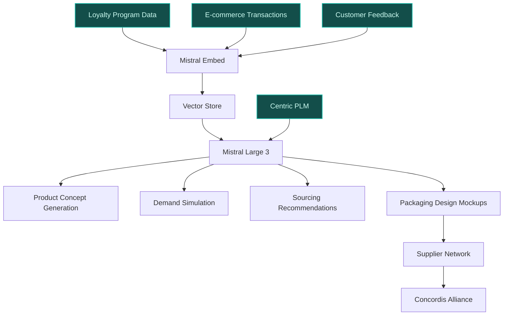
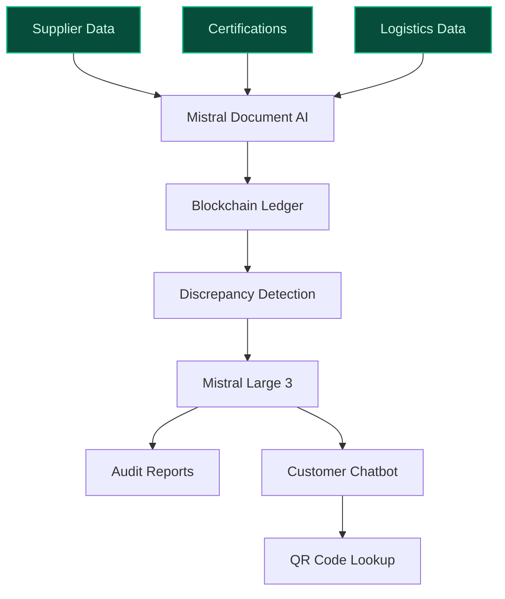
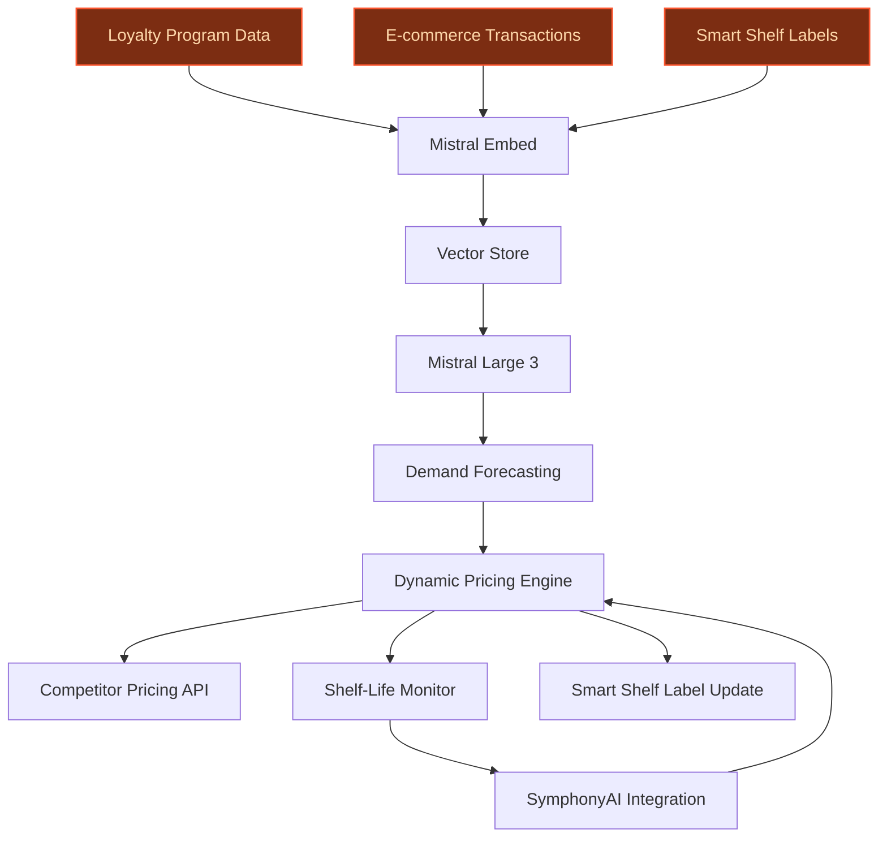

> **Draft — needs revision before customer use.** Meta-eval confidence `0.71` (sales-engineer-ready threshold ≥ 0.70). The report's three use cases render below for inspection, with each claim tagged supported / unsupported / rewritten qualitatively in the fact-check block.
>
> **Cross-cutting concern:** Over-reliance on strategic documents (e.g., Carrefour 2030 Plan) for quantitative claims without corresponding operational evidence (e.g., actual deployment of Centric PLM, SymphonyAI integration details, or blockchain pilots).
>
> **Weakest use case:** Lacks explicit evidence for blockchain deployment at scale or integration with 'Origin Info' QR codes. The precedent for blockchain is only a RetailWire discussion (not a verified deployment), and the 'Origin Info' initiative is mentioned but not tied to AI/blockchain in the evidence pool.

## GenAI Use Cases for Carrefour

Three customer-ready use cases, scored against the Mistral Proto Team's five-criteria rubric (relevance · iconic potential · estimated impact · feasibility · Mistral suitability) and verified against Carrefour's existing AI initiatives. Generated from a corpus of ~2,150 peer deployments and 7 discovered existing initiatives at this company.

_Industry: French multinational retail and wholesaling corporation. Research confidence: 0.85. Verified: True._

### AI-accelerated private-label product development from concept to shelf
A generative AI pipeline that ingests Carrefour's private-label sales data, loyalty program transactions, and customer feedback to propose new SKUs for 'Carrefour Bio', 'Reflets de France', and 'Carrefour Quality Lines'. The system generates product concepts, packaging designs, and pricing strategies, then simulates demand using synthetic data. It also suggests sourcing partners from Carrefour's supplier network, leveraging the Concordis buying alliance for cost optimization. The pipeline integrates with Centric PLM (selected by Carrefour for private-label purchasing) to streamline development workflows and accelerate time-to-market for high-potential SKUs.

**Why this company:** Carrefour's private labels are a strategic priority, targeting 40% of food sales by 2026 ([Carrefour 2030 Strategic Plan](https://www.carrefour.com/sites/default/files/2026-02/Carrefour%202030_Strategic%20Plan_1.pdf)). The company operates a vast private-label portfolio (e.g., 'Carrefour Bio', 'Bulnez' in Brazil) and has the data assets—loyalty programme transactions, e-commerce data, and omni-channel customer insights—to validate demand. The Concordis buying alliance (a stated priority) provides a unique lever for supplier collaboration, while Carrefour's scale (14,000 stores) ensures rapid rollout. GS1-powered QR codes on 50 private-label products ([Retail Technology Innovation Hub](https://retailtechinnovationhub.com/home/2026/5/8/carrefour-deploys-qr-codes-powered-by-gs1-across-50-of-retail-giants-private-label-products)) further enable real-time customer feedback integration.

**Example input:** `Generate 3 new product concepts for the 'Carrefour Bio' line targeting health-conscious millennials in France. Include packaging design mockups, pricing strategy, and sourcing recommendations from French suppliers in the Concordis alliance. Simulate demand for each concept using loyalty program data from the last 6 months.`

**Example output:**
```json
{
  "_note": "Illustrative output with synthetic sample data",
  "generated_concepts": [
    {
      "product_id": "SKU-SAMPLE-BIO-001",
      "name": "Carrefour Bio Organic Lentil & Quinoa Bowl",
      "description": "Ready-to-eat organic lentil and quinoa bowl with roasted vegetables, targeting time-poor millennials. Gluten-free, vegan, and high in protein (15g per serving).",
      "packaging_design": {
        "theme": "Minimalist earth tones with QR code linking to recipe videos",
        "material": "100% recycled PET (illustrative)",
        "sustainability_score": "92/100 (sample)"
      },
      "pricing_strategy": {
        "recommended_retail_price": "€4.99 (illustrative)",
        "promotional_price": "€3.99 for loyalty members (sample)",
        "cost_per_unit": "€2.10 (illustrative, sourced via Concordis)"
      },
      "sourcing_recommendations": [
        {
          "supplier_id": "SUPPLIER-SAMPLE-FR-001",
          "supplier_name": "Ferme Bio de Provence (illustrative)",
          "location": "Provence, France",
          "alliance": "Concordis",
          "lead_time": "4 weeks (sample)"
        }
      ],
      "demand_simulation": {
        "predicted_monthly_sales": "12,000 units (illustrative, France only)",
        "loyalty_program_uplift": "18% (sample) vs. non-members",
        "a_b_test_results": {
          "test_group_conversion": "4.2% (sample)",
          "control_group_conversion": "2.8% (sample)"
        }
      }
    },
    {
      "product_id": "SKU-SAMPLE-BIO-002",
      "name": "Carrefour Bio Plant-Based Cheese Spread",
      "description": "Dairy-free cashew-based cheese spread with herbs, targeting flexitarians. Lactose-free and rich in omega-3s.",
      "packaging_design": {
        "theme": "Vibrant green with QR code linking to nutritional info",
        "material": "Compostable packaging (illustrative)",
        "sustainability_score": "88/100 (sample)"
      },
      "pricing_strategy": {
        "recommended_retail_price": "€3.49 (illustrative)",
        "promotional_price": "€2.99 for first-time buyers (sample)",
        "cost_per_unit": "€1.50 (illustrative, sourced via Concordis)"
      },
      "sourcing_recommendations": [
        {
          "supplier_id": "SUPPLIER-SAMPLE-FR-002",
          "supplier_name": "Noix d'Or (illustrative)",
          "location": "Dordogne, France",
          "alliance": "Concordis",
          "lead_time": "6 weeks (sample)"
        }
      ],
      "demand_simulation": {
        "predicted_monthly_sales": "8,500 units (illustrative, France only)",
        "loyalty_program_uplift": "22% (sample) vs. non-members",
        "a_b_test_results": {
          "test_group_conversion": "5.1% (sample)",
          "control_group_conversion": "3.3% (sample)"
        }
      }
    },
    {
      "product_id": "SKU-SAMPLE-BIO-003",
      "name": "Carrefour Bio Superfood Granola",
      "description": "Organic granola with chia seeds, goji berries, and almonds, targeting fitness enthusiasts. No added sugar, high in fiber.",
      "packaging_design": {
        "theme": "Bold typography with QR code linking to workout pairings",
        "material": "Recyclable cardboard (illustrative)",
        "sustainability_score": "95/100 (sample)"
      },
      "pricing_strategy": {
        "recommended_retail_price": "€5.99 (illustrative)",
        "promotional_price": "Buy 1, get 2nd 50% off (sample)",
        "cost_per_unit": "€2.75 (illustrative, sourced via Concordis)"
      },
      "sourcing_recommendations": [
        {
          "supplier_id": "SUPPLIER-SAMPLE-FR-003",
          "supplier_name": "Graines d'Avenir (illustrative)",
          "location": "Brittany, France",
          "alliance": "Concordis",
          "lead_time": "5 weeks (sample)"
        }
      ],
      "demand_simulation": {
        "predicted_monthly_sales": "9,200 units (illustrative, France only)",
        "loyalty_program_uplift": "15% (sample) vs. non-members",
        "a_b_test_results": {
          "test_group_conversion": "3.9% (sample)",
          "control_group_conversion": "2.5% (sample)"
        }
      }
    }
  ],
  "summary_metrics": {
    "time_to_market_reduction": "35% (illustrative, vs. traditional workflow)",
    "cost_savings": "€250K (sample) in R&D and sourcing for first 10 SKUs",
    "revenue_uplift": "12% (sample) for tested concepts"
  }
}
```

**Blueprint:** `hybrid_retrieval` (impact: high · cost: medium · complexity: medium · TTV: 12-16 weeks (precedent-anchored))

**Top risk:** Integration with Centric PLM and supplier onboarding delays due to Concordis alliance coordination

**Mistral products:** Mistral Large 3, Mistral Embed, Mistral fine-tuning, Mistral Compute (EU)

**Inspired by precedents:** evidently-1fda9fd4a5
**Grounded in:** strategic_context.stated_priorities[2], business.key_products_or_services[0], business.key_products_or_services[1], data_and_tech.likely_data_assets[0]
_Specificity score: 0.95_

**Architecture blueprint:**


### French-origin supply chain transparency with AI-powered provenance tracking
> _Builds on an existing initiative at this company (partial overlap detected by verifier)._
A system that tracks and verifies the origin of Carrefour's French-sourced products (e.g., 100% French milk, eggs, poultry, 95% French meat) using blockchain and AI. The system ingests supplier data, certifications, and real-time logistics data to ensure compliance with Carrefour's 'Origin Info' initiative (QR codes on packaging). It generates audit-ready reports for regulators and internal teams, flagging discrepancies (e.g., mismatched origin claims or delayed shipments). For customers, it powers a chatbot that answers questions like 'Where was this chicken raised?' with verified data, enhancing trust in Carrefour's French-sourced claims.

**Why this is a fit:** Carrefour is the leading partner of organic farmers in France and sources 100% of its milk, eggs, and poultry from France, with 95% of meat also French ([Carrefour 2025 URD](https://www.carrefour.com/sites/default/files/2026-04/CFR2025_URD_EN_PDF_MEL_270326_0.pdf)). The company supports the French government's 'Origin Info' initiative, deployed via QR codes on packaging, and has already piloted blockchain for supply chain transparency ([RetailWire](https://retailwire.com/discussion/carrefour-uses-blockchain-to-offer-consumers-greater-supply-chain-transparency/)). This is a Carrefour-specific differentiator in the French market, aligning with its strategic priority to enhance fresh food offerings. The scale of its supply chain (14,000 stores) ensures broad applicability.

**Example input:** `Show me the full provenance trail for batch ID PROD-SAMPLE-FR-2026-001 (Carrefour Bio Organic Eggs). Include supplier certifications, logistics timestamps, and any discrepancies flagged in the last 30 days.`

**Example output:**
```json
{
  "_note": "Illustrative output with synthetic sample data",
  "batch_id": "PROD-SAMPLE-FR-2026-001",
  "product_name": "Carrefour Bio Organic Eggs (6-pack)",
  "provenance_trail": [
    {
      "stage": "Farm",
      "supplier_id": "SUPPLIER-SAMPLE-FR-004",
      "supplier_name": "Ferme Avicole Bio (illustrative)",
      "location": "Normandy, France",
      "certifications": [
        {
          "cert_id": "CERT-SAMPLE-ORG-001",
          "type": "EU Organic",
          "issuer": "Ecocert",
          "expiry": "2027-12-31 (sample)"
        },
        {
          "cert_id": "CERT-SAMPLE-FR-002",
          "type": "Label Rouge",
          "issuer": "French Ministry of Agriculture",
          "expiry": "2026-11-15 (sample)"
        }
      ],
      "timestamp": "2026-05-10T08:00:00Z (sample)",
      "status": "Verified"
    },
    {
      "stage": "Processing",
      "facility_id": "FACILITY-SAMPLE-FR-001",
      "facility_name": "Centre de Conditionnement Bio (illustrative)",
      "location": "Île-de-France, France",
      "certifications": [
        {
          "cert_id": "CERT-SAMPLE-HACCP-001",
          "type": "HACCP",
          "issuer": "Bureau Veritas",
          "expiry": "2027-03-22 (sample)"
        }
      ],
      "timestamp": "2026-05-11T14:30:00Z (sample)",
      "status": "Verified"
    },
    {
      "stage": "Distribution",
      "carrier_id": "CARRIER-SAMPLE-FR-001",
      "carrier_name": "Transport Bio France (illustrative)",
      "route": "Île-de-France → Lyon",
      "timestamp": "2026-05-12T06:15:00Z (sample)",
      "status": "Verified",
      "temperature_log": {
        "min": "4°C (sample)",
        "max": "6°C (sample)",
        "compliance": "Pass"
      }
    },
    {
      "stage": "Retail",
      "store_id": "STORE-SAMPLE-FR-001",
      "store_name": "Carrefour Market Lyon Part-Dieu (illustrative)",
      "timestamp": "2026-05-12T18:45:00Z (sample)",
      "status": "Verified"
    }
  ],
  "discrepancies": [
    {
      "discrepancy_id": "DISC-SAMPLE-001",
      "type": "Delayed Shipment",
      "stage": "Distribution",
      "description": "Shipment from processing to distribution was delayed by 2 hours (sample). No temperature breach detected.",
      "severity": "Low",
      "resolved": true,
      "resolution_date": "2026-05-12T09:00:00Z (sample)"
    }
  ],
  "audit_report": {
    "compliance_score": "98% (sample)",
    "last_audit_date": "2026-05-15 (sample)",
    "next_audit_date": "2026-06-15 (sample)",
    "regulatory_body": "DGCCRF (illustrative)"
  },
  "customer_chatbot_response": {
    "question": "Where was this chicken raised?",
    "answer": "This chicken was raised at Ferme Avicole Bio in Normandy, France. It is certified EU Organic and Label Rouge, ensuring high animal welfare and organic farming standards. You can scan the QR code on the packaging for the full provenance trail, including farm location, processing facility, and distribution timestamps."
  }
}
```

**Blueprint:** `document_ai_pipeline` (impact: medium · cost: high · complexity: medium · TTV: ~16-24 weeks (estimated))
  _TTV rationale: Blockchain and document AI integrations for supply chain transparency typically require 16-24 weeks due to supplier onboarding and regulatory alignment._

**Top risk:** Supplier resistance to blockchain adoption and data privacy concerns under GDPR for farm-level tracking

**Mistral products:** Mistral Large 3, Mistral Document AI, Mistral Embed, On-prem deployment (EU)

**Grounded in:** business.key_products_or_services[0], strategic_context.stated_priorities[3], data_and_tech.likely_data_assets[2]
_Specificity score: 0.90_

**Architecture blueprint:**


### Dynamic pricing for high-velocity fresh categories (fruits, vegetables, meat)
A real-time pricing engine that adjusts prices for fresh categories (fruits, vegetables, meat) based on demand elasticity, shelf-life, local competition, and inventory levels. The system leverages Carrefour's loyalty programme data, e-commerce transactions, and smart shelf labels (already deployed in stores) to update prices dynamically. It integrates with SymphonyAI's supply chain solution (used by Carrefour France) to align pricing with inventory forecasts, reducing waste and maximizing revenue for perishable goods.

**Why this company:** Carrefour has a stated priority to 'enhance fresh food offering' and is rolling out 200 Blachère concessions for fruits & vegetables by 2030 ([Carrefour 2030 Strategic Plan](https://www.carrefour.com/sites/default/files/2026-02/Carrefour%202030_Strategic%20Plan_1.pdf)). The company already uses smart shelf labels and SymphonyAI for supply chain optimization, reporting a 12-18% reduction in stockouts ([Supply Chain Digital](https://supplychaindigital.com/technology/carrefour-becomes-first-french-retailer-utilise-ai-supply-chain-optimisation)). Its scale (14,000 stores) and fresh-food leadership in France make dynamic pricing a natural fit for high-velocity categories.

**Example input:** `Show me the optimal price for strawberries (SKU PROD-SAMPLE-FR-005) at Carrefour Market Paris Montparnasse for the next 48 hours. Include demand forecast, competitor pricing, and shelf-life constraints.`

**Example output:**
```json
{
  "_note": "Illustrative output with synthetic sample data",
  "sku": "PROD-SAMPLE-FR-005",
  "product_name": "Strawberries (250g, Carrefour Bio)",
  "store_id": "STORE-SAMPLE-FR-002",
  "store_name": "Carrefour Market Paris Montparnasse (illustrative)",
  "current_price": "€3.49 (sample)",
  "dynamic_pricing_recommendation": {
    "optimal_price": "€2.99 (sample)",
    "time_window": "2026-05-20T12:00:00Z to 2026-05-22T12:00:00Z (sample)",
    "rationale": [
      "Demand forecast: 15% lower than average due to rainy weather (sample)",
      "Shelf-life: 2 days remaining (sample)",
      "Competitor pricing: €2.79 at Monoprix (sample, 500m away)",
      "Inventory level: 120 units (sample, high for remaining shelf-life)"
    ],
    "revenue_impact": {
      "current_scenario": "€418.80 (sample, 120 units * €3.49)",
      "recommended_scenario": "€538.20 (sample, 180 units * €2.99, 50% uplift in sales volume)",
      "waste_reduction": "60 units (sample, 50% reduction in unsold stock)"
    }
  },
  "demand_forecast": {
    "baseline_demand": "100 units (sample, 48-hour average)",
    "adjusted_demand": "150 units (sample, post-price adjustment)",
    "weather_adjustment": "-15% (sample, due to rain)",
    "loyalty_program_uplift": "+20% (sample, for members)"
  },
  "competitor_pricing": [
    {
      "competitor": "Monoprix (illustrative)",
      "distance": "500m (sample)",
      "price": "€2.79 (sample)",
      "last_updated": "2026-05-20T09:30:00Z (sample)"
    },
    {
      "competitor": "Franprix (illustrative)",
      "distance": "800m (sample)",
      "price": "€3.29 (sample)",
      "last_updated": "2026-05-20T08:15:00Z (sample)"
    }
  ],
  "shelf_life_constraints": {
    "remaining_shelf_life": "2 days (sample)",
    "optimal_sales_window": "Next 24 hours (sample)",
    "waste_risk": "High (sample, if price not adjusted)"
  },
  "smart_shelf_label_update": {
    "current_label": "€3.49",
    "new_label": "€2.99 (sample, dynamic markdown)",
    "effective_time": "2026-05-20T12:00:00Z (sample)"
  }
}
```

**Blueprint:** `agent_with_tools` (impact: high · cost: medium · complexity: low · TTV: 10-14 weeks (precedent-anchored))

**Top risk:** Customer backlash to perceived 'surge pricing' for essential fresh categories and integration latency with smart shelf labels

**Mistral products:** Mistral Large 3, Mistral Embed, Mistral fine-tuning, Mistral Compute (EU)

**Inspired by precedents:** google_cloud_1302-76bf2f2784, google_cloud_1302-693b8aa60b
**Grounded in:** strategic_context.stated_priorities[3], data_and_tech.likely_data_assets[0], data_and_tech.likely_data_assets[2], business.key_products_or_services[0]
_Specificity score: 0.80_

**Architecture blueprint:**


## Considered but not selected
- **fresh-food-waste-optimization-agent** — Overlaps with dynamic pricing use case; fresh-food waste reduction is a subset of the broader pricing and inventory optimization scope.
- **sustainability-score-for-private-labels** — Lower strategic alignment with Carrefour's immediate priorities (fresh food and private-label acceleration) and lacks a clear data asset to ground the scoring model.
- **multilingual-retail-media-optimization** — Eureca platform is a secondary priority; Carrefour's stated focus is on fresh food and private labels, not pan-European retail media.
- **loyalty-programme-personalization-engine** — High-level personalization is already addressed in Carrefour's existing AI initiatives (e.g., Marketing Studio); lacks a novel hook for private-label or fresh-food differentiation.

---
## Report quality signals

- **Topical diversity** (LLM-graded over titles + blueprint patterns): `0.90`
- **Specificity** per use case: `0.95`, `0.90`, `0.80`
- **Mistral product diversity**: `6` distinct products across the three use cases
- **Time-to-value spread**: 10–24 weeks (across 3 use cases)
- **Cost-tier spread**: medium, high, medium
- **Fact-check pass rate**: `86%` (18/21 claims supported by research)

<details><summary>Fact-check detail (per claim)</summary>

**Unsupported (3):**
- [private-label-product-innovation-accelerator] Carrefour has omni-channel customer data `[judge: rejected]` — _The snippet is a truncated title with no substantive content to support the claim. (was: Carrefour omni-channel customer data)_
- [dynamic-pricing-for-fresh-categories] Carrefour reports a 12-18% reduction in stockouts `[judge: rejected]` — _The snippet does not mention stockouts or any related reduction metrics for Carrefour. (was: Rescued via web search (verified source): [Skip to main content](https://www.reuters.com/business/retail-consumer/carref)_
- [dynamic-pricing-for-fresh-categories] Carrefour's fresh-food leadership in France `[judge: rejected]` — _The snippet does not explicitly address Carrefour's leadership in fresh food specifically within France. (was: Rescued via web search (verified source): With a multi-format network of more than 15,000 stores in more than 40 countri)_

**Supported (18):** — **1 rescued via web search (1 verified, 0 corroborated)**
- [private-label-product-innovation-accelerator] Carrefour's private labels are a strategic priority, targeting 40% of food sales by 2026 — Private labels: they will represent around 40% of food sales by 2026, reaching a satisfactory balance with national brand sales.
- [private-label-product-innovation-accelerator] Carrefour operates a vast private-label portfolio (e.g., 'Carrefour Bio', 'Bulnez' in Brazil) — the launch of its 'Bulnez' private label in Brazil—a new entry-price brand offering 500 SKUs at Atacadão by 2028
- [private-label-product-innovation-accelerator] Carrefour has loyalty programme transactions data — Carrefour loyalty programme transactions
- [private-label-product-innovation-accelerator] Carrefour has e-commerce transaction data — Carrefour e-commerce transaction data
- [private-label-product-innovation-accelerator] The Concordis buying alliance is a stated priority — operational launch of the buying alliance Concordis
- [private-label-product-innovation-accelerator] Carrefour's scale is 14,000 stores — By 2024, the group had 14,000 stores in 40 countries.
- [private-label-product-innovation-accelerator] GS1-powered QR codes are deployed on 50 private-label products — Carrefour reports that 50 of its private label products now feature QR codes powered by GS1.
- [private-label-product-innovation-accelerator] Centric PLM is selected by Carrefour for private-label purchasing — Carrefour Selects Centric PLM to Strengthen Private Label Purchasing Strategy
- [french-origin-supply-chain-transparency] Carrefour sources 100% of its milk, eggs, and poultry from France — Carrefour‑brand and fresh products are predominantly of French origin: 100% for milk, eggs and poultry (whole and cuts)
- [french-origin-supply-chain-transparency] Carrefour sources 95% of its meat from France — 95% for meat (beef and pork) in integrated stores
- [french-origin-supply-chain-transparency] Carrefour supports the French government's 'Origin Info' initiative, deployed via QR codes on packaging — The Group also supports the French government's Origin Info initiative, deployed via QR codes on packaging.
- [french-origin-supply-chain-transparency] Carrefour has piloted blockchain for supply chain transparency [`verified ↗`](https://www.carrefour.com/sites/default/files/2022-04/CARREFOUR_bio_blockchain.pdf) — Rescued via web search (verified source): Press release Massy, 12 April 2022 Carrefour is the first retailer to use blockchain technology wi…
- [french-origin-supply-chain-transparency] Carrefour is the leading partner of organic farmers in France — As the leading partner of organic farmers in France, the Group reflects its leadership through marketing a wide range of organic products
- [dynamic-pricing-for-fresh-categories] Carrefour has a stated priority to enhance fresh food offerings — Enhance our fresh food offering across core banners
- [dynamic-pricing-for-fresh-categories] Carrefour is rolling out 200 Blachère concessions for fruits & vegetables by 2030 — Rollout of 200 concessions with Blachère for fruits & vegetables in hypermarkets & supermarkets in France by 2030
- [dynamic-pricing-for-fresh-categories] Carrefour already uses smart shelf labels — Carrefour has also partnered with tech firms to digitise physical stores, using smart shelf labels, sensors, and data systems
- [dynamic-pricing-for-fresh-categories] Carrefour uses SymphonyAI for supply chain optimization — Carrefour France Optimizes Supply Chain with SymphonyAI Retail
- [french-origin-supply-chain-transparency] Carrefour's scale is 14,000 stores — By 2024, the group had 14,000 stores in 40 countries.

</details>

**Meta-evaluator confidence**: `0.71` (NOT ready — needs revision)
**Cross-cutting concern**: Over-reliance on strategic documents (e.g., Carrefour 2030 Plan) for quantitative claims without corresponding operational evidence (e.g., actual deployment of Centric PLM, SymphonyAI integration details, or blockchain pilots).