# Pipeline blueprint (architecture)

Static view of the pipeline regardless of run timing — shows agents,
models, and gates. The chronological execution log follows below.

```mermaid
flowchart TD
    Start([User: company name]) --> R
    R["<b>1. Research</b><br/>parallel: Wikipedia · Tavily news ·<br/>existing initiatives · live verification<br/><i>mistral-medium</i> synthesis"]
    R --> G["<b>1b. Gap-fill</b><br/>identify missing fields →<br/><i>mistral-small</i> generates queries →<br/>Tavily search per field →<br/><i>mistral-small</i> per-field extraction"]
    G --> Conf{Confidence ≥ 0.5<br/>OR verified<br/>OR ≥ 1 existing initiative?}
    Conf -->|no| Refuse([Refusal])
    Conf -->|yes| Ret
    Ret["<b>2. Retrieve</b><br/><i>mistral-embed</i> on company query →<br/>cosine top-K + industry/depth filter +<br/>MMR diversification"]
    Ret --> Gen["<b>3. Generate 12 candidates</b><br/><i>mistral-medium</i> with web_search tool<br/>(Tavily + deep-read) — fact citations<br/>flow into the EvidenceLedger"]
    Gen --> Score["<b>4. Score</b><br/>self-consistency: 2 parallel passes<br/><i>mistral-small</i> @ T=0.2 and T=0.4 →<br/>aggregate weighted scores"]
    Score --> Verify["<b>5. Per-candidate verify</b><br/>top-3: Tavily search + deep-read +<br/><i>mistral-small</i> verdict (pass /<br/>partial / confirmed_existing)"]
    Verify --> Enrich["<b>6. Enrich</b><br/><i>mistral-large</i> drafts customer-facing<br/>prose for 3 use cases (or<br/><i>mistral-medium</i> on fast tier)"]
    Enrich --> NumScrub["<b>6a. Numeric scrub</b><br/>flag any number not in cited content"]
    NumScrub --> Polish["<b>6b. Polish</b><br/><i>mistral-small</i> per use case (parallel):<br/>convert markers→qualitative,<br/>(ev-XXX)→[title](url)"]
    Polish --> Attr["<b>6c. Attribution check</b><br/><i>mistral-small</i> per use case (parallel):<br/>fix corpus-ID ↔ company mismatches"]
    Attr --> Meta["<b>7. Meta-evaluation</b><br/><i>mistral-medium</i> reviews report against<br/>cited precedents + ledger entries:<br/>strict claim verification"]
    Meta --> WV["<b>7c. Web-verify rescue</b><br/>2-tier credibility classifier<br/>(verified allowlist · corroborated)"]
    WV --> J["<b>7d. Source judge</b><br/><i>mistral-small</i> adjudicates each<br/>(claim, source) pair · self-correcting"]
    J --> FQ["<b>7e. Final qualify</b><br/><i>mistral-small</i> rewrites unsupported<br/>numerics into qualitative phrasing"]
    FQ --> QS
    QS["<b>Quality signals</b><br/>LLM-graded diversity + specificity,<br/>fact-check pass rate, TTV/cost spread"]
    QS --> Render([Markdown report + trace])

    classDef agent fill:#fef3c7,stroke:#f59e0b
    classDef gate fill:#dbeafe,stroke:#3b82f6
    classDef io fill:#dcfce7,stroke:#16a34a
    class R,G,Ret,Gen,Score,Verify,Enrich,NumScrub,Polish,Attr,Meta,WV,J,FQ,QS agent
    class Conf gate
    class Start,Refuse,Render io
```

## Execution trace — Carrefour

Started: `2026-05-10T14:05:58.005422+00:00`. Total wall time: `214.8s` across `46` recorded actions.

### Per-step time totals

| Step | Calls | Total time | Avg time |
|---|---:|---:|---:|
| `research` | 1 | 8.84s | 8836ms |
| `gap_fill` | 4 | 3.28s | 821ms |
| `retrieve` | 2 | 0.77s | 383ms |
| `generate` | 2 | 41.83s | 20916ms |
| `generate.web_search` | 2 | 6.49s | 3245ms |
| `score` | 2 | 36.18s | 18092ms |
| `verify` | 6 | 21.00s | 3500ms |
| `enrich` | 1 | 88.51s | 88515ms |
| `meta_eval` | 1 | 12.12s | 12116ms |
| `web_verify` | 1 | 2.01s | 2006ms |
| `source_judge` | 22 | 18.21s | 828ms |
| `quality_signals` | 2 | 9.50s | 4752ms |

### Chronological event log

- `14:06:01.020` **[research]** `mistral-medium-2604.chat.complete` — 8836ms
   - inputs: synthesize CompanyContext for Carrefour | depth=medium
   - outputs: industry='French multinational retail and wholesaling corporation' verified=True conf=0.75
- `14:06:09.860` **[gap_fill]** `mistral-small-2603.chat.complete` — 1042ms
   - inputs: generate gap queries | fields=['business_model', 'products', 'data_assets', 'priorities']
   - outputs: queries=4
- `14:06:16.639` **[gap_fill]** `mistral-small-2603.chat.complete` — 967ms
   - inputs: layer-2 extract field=priorities
   - outputs: items=6
- `14:06:16.642` **[gap_fill]** `mistral-small-2603.chat.complete` — 698ms
   - inputs: layer-2 extract field=data_assets
   - outputs: items=6
- `14:06:16.645` **[gap_fill]** `mistral-small-2603.chat.complete` — 578ms
   - inputs: layer-2 extract field=products
   - outputs: items=6
- `14:06:17.608` **[retrieve]** `mistral-embed.embeddings.create` — 453ms
   - inputs: company_query | industries='French multinational retail and wholesaling corporation'
   - outputs: embedded 1024-dim query vector
- `14:06:18.061` **[retrieve]** `precedent_corpus.cosine_topk` — 313ms
   - inputs: k=8 min_depth=0.4 target='Carrefour'
   - outputs: retrieved 8 | mmr=True | top_sim=0.798
- `14:06:18.694` **[generate]** `mistral-medium-2604.chat.complete` — 2141ms
   - inputs: iteration=0 tool_calls_used=0/2 tools=on
   - outputs: tool_calls=4 | content_chars=0
- `14:06:20.848` **[generate.web_search]** `tavily.search` — 3289ms
   - inputs: query='Carrefour fresh food offering 2024 2025 partnerships Blachère fruits vegetables'
   - outputs: 2 raw results
- `14:06:24.165` **[generate.web_search]** `tavily.search` — 3201ms
   - inputs: query='Carrefour 2030 AI transformation supply chain dynamic pricing promotions'
   - outputs: 2 raw results
- `14:06:28.641` **[generate]** `mistral-medium-2604.chat.complete` — 39690ms
   - inputs: iteration=1 tool_calls_used=2/2 tools=off
   - outputs: tool_calls=0 | content_chars=23693
- `14:07:08.684` **[score]** `mistral-small-2603.chat.complete` — 19601ms
   - inputs: self-consistency pass T=0.2
   - outputs: scored 12 candidates
- `14:07:08.689` **[score]** `mistral-small-2603.chat.complete` — 16582ms
   - inputs: self-consistency pass T=0.4
   - outputs: scored 12 candidates
- `14:07:28.313` **[verify]** `tavily.search` — 2816ms
   - inputs: candidate=private-label-product-innovation-accelerator | query='Carrefour AI-accelerated private-label product development f'
   - outputs: 4 results
- `14:07:28.314` **[verify]** `tavily.search` — 3011ms
   - inputs: candidate=fresh-food-waste-optimization-agent | query='Carrefour Agentic fresh-food waste reduction with dynamic ma'
   - outputs: 4 results
- `14:07:28.314` **[verify]** `tavily.search` — 2688ms
   - inputs: candidate=french-origin-supply-chain-transparency | query='Carrefour French-origin supply chain transparency with AI-po'
   - outputs: 4 results
- `14:07:31.718` **[verify]** `mistral-small-2603.chat.complete` — 3796ms
   - inputs: verdict for private-label-product-innovation-accelerator
   - outputs: verdict='pass'
- `14:07:32.106` **[verify]** `mistral-small-2603.chat.complete` — 4157ms
   - inputs: verdict for french-origin-supply-chain-transparency
   - outputs: verdict='partial_overlap'
- `14:07:32.143` **[verify]** `mistral-small-2603.chat.complete` — 4530ms
   - inputs: verdict for fresh-food-waste-optimization-agent
   - outputs: verdict='confirmed_existing'
- `14:07:36.675` **[enrich]** `mistral-large-2512.chat.complete` — 88515ms
   - inputs: tier=standard top_3=['private-label-product-innovation-accelerator', 'french-origin-supply-chain-transparency', 'dynamic-pricing-for-fresh-categories']
   - outputs: enriched 3 use cases
- `14:09:05.220` **[meta_eval]** `mistral-medium-2604.chat.complete` — 12116ms
   - inputs: reviewing 3 use cases
   - outputs: review + claims
- `14:09:17.355` **[web_verify]** `tavily.search.rescue_unsupported_claims` — 2006ms
   - inputs: company='Carrefour' unsupported=3 budget=12
   - outputs: rescued: verified=3 corroborated=0 of 3 attempted
- `14:09:19.364` **[source_judge]** `mistral-small-2603.judge_claim_sources` — 3470ms
   - inputs: pairs=21
   - outputs: judged 21 pairs
- `14:09:19.364` **[source_judge]** `mistral-small-2603.chat.complete` — 590ms
   - inputs: claim="Carrefour's private labels are a strategic priority, targeti"
   - outputs: verdict=supported
- `14:09:19.371` **[source_judge]** `mistral-small-2603.chat.complete` — 752ms
   - inputs: claim="Carrefour operates a vast private-label portfolio (e.g., 'Ca"
   - outputs: verdict=supported
- `14:09:19.375` **[source_judge]** `mistral-small-2603.chat.complete` — 585ms
   - inputs: claim='Carrefour has loyalty programme transactions data'
   - outputs: verdict=supported
- `14:09:19.378` **[source_judge]** `mistral-small-2603.chat.complete` — 713ms
   - inputs: claim='Carrefour has e-commerce transaction data'
   - outputs: verdict=supported
- `14:09:19.382` **[source_judge]** `mistral-small-2603.chat.complete` — 577ms
   - inputs: claim='Carrefour has omni-channel customer data'
   - outputs: verdict=unsupported
- `14:09:19.386` **[source_judge]** `mistral-small-2603.chat.complete` — 756ms
   - inputs: claim='The Concordis buying alliance is a stated priority'
   - outputs: verdict=supported
- `14:09:19.389` **[source_judge]** `mistral-small-2603.chat.complete` — 711ms
   - inputs: claim="Carrefour's scale is 14,000 stores"
   - outputs: verdict=supported
- `14:09:19.391` **[source_judge]** `mistral-small-2603.chat.complete` — 708ms
   - inputs: claim='GS1-powered QR codes are deployed on 50 private-label produc'
   - outputs: verdict=supported
- `14:09:19.954` **[source_judge]** `mistral-small-2603.chat.complete` — 678ms
   - inputs: claim='Centric PLM is selected by Carrefour for private-label purch'
   - outputs: verdict=supported
- `14:09:19.960` **[source_judge]** `mistral-small-2603.chat.complete` — 710ms
   - inputs: claim='Carrefour sources 100% of its milk, eggs, and poultry from F'
   - outputs: verdict=supported
- `14:09:19.963` **[source_judge]** `mistral-small-2603.chat.complete` — 674ms
   - inputs: claim='Carrefour sources 95% of its meat from France'
   - outputs: verdict=supported
- `14:09:20.091` **[source_judge]** `mistral-small-2603.chat.complete` — 582ms
   - inputs: claim="Carrefour supports the French government's 'Origin Info' ini"
   - outputs: verdict=supported
- `14:09:20.099` **[source_judge]** `mistral-small-2603.chat.complete` — 580ms
   - inputs: claim='Carrefour has piloted blockchain for supply chain transparen'
   - outputs: verdict=supported
- `14:09:20.103` **[source_judge]** `mistral-small-2603.chat.complete` — 597ms
   - inputs: claim='Carrefour is the leading partner of organic farmers in Franc'
   - outputs: verdict=supported
- `14:09:20.123` **[source_judge]** `mistral-small-2603.chat.complete` — 488ms
   - inputs: claim='Carrefour has a stated priority to enhance fresh food offeri'
   - outputs: verdict=supported
- `14:09:20.142` **[source_judge]** `mistral-small-2603.chat.complete` — 657ms
   - inputs: claim='Carrefour is rolling out 200 Blachère concessions for fruits'
   - outputs: verdict=supported
- `14:09:20.611` **[source_judge]** `mistral-small-2603.chat.complete` — 518ms
   - inputs: claim='Carrefour already uses smart shelf labels'
   - outputs: verdict=supported
- `14:09:20.633` **[source_judge]** `mistral-small-2603.chat.complete` — 2201ms
   - inputs: claim='Carrefour uses SymphonyAI for supply chain optimization'
   - outputs: verdict=supported
- `14:09:20.637` **[source_judge]** `mistral-small-2603.chat.complete` — 500ms
   - inputs: claim='Carrefour reports a 12-18% reduction in stockouts'
   - outputs: verdict=unsupported
- `14:09:20.669` **[source_judge]** `mistral-small-2603.chat.complete` — 542ms
   - inputs: claim="Carrefour's scale is 14,000 stores"
   - outputs: verdict=supported
- `14:09:20.673` **[source_judge]** `mistral-small-2603.chat.complete` — 626ms
   - inputs: claim="Carrefour's fresh-food leadership in France"
   - outputs: verdict=unsupported
- `14:09:23.312` **[quality_signals]** `mistral-small-2603.chat.complete` — 8311ms
   - inputs: specificity grade (3 use cases)
   - outputs: scored 3 use cases
- `14:09:31.622` **[quality_signals]** `mistral-small-2603.chat.complete` — 1193ms
   - inputs: diversity grade
   - outputs: diversity=0.9

## Mermaid sequence diagram (execution)

```mermaid
sequenceDiagram
    autonumber
    participant pipeline as pipeline
    participant mistral_medium_2604 as mistral-medium-2604
    participant mistral_small_2603 as mistral-small-2603
    participant mistral_embed as mistral-embed
    participant precedent_corpus as precedent_corpus
    participant tavily as tavily
    participant mistral_large_2512 as mistral-large-2512
    participant tavily_search as tavily.search
    pipeline->>mistral_medium_2604: research: chat.complete (8836ms)
    mistral_medium_2604-->>pipeline: industry='French multinational retail and wholesaling corpor
    pipeline->>mistral_small_2603: gap_fill: chat.complete (1042ms)
    mistral_small_2603-->>pipeline: queries=4
    pipeline->>mistral_small_2603: gap_fill: chat.complete (967ms)
    mistral_small_2603-->>pipeline: items=6
    pipeline->>mistral_small_2603: gap_fill: chat.complete (698ms)
    mistral_small_2603-->>pipeline: items=6
    pipeline->>mistral_small_2603: gap_fill: chat.complete (578ms)
    mistral_small_2603-->>pipeline: items=6
    pipeline->>mistral_embed: retrieve: embeddings.create (453ms)
    mistral_embed-->>pipeline: embedded 1024-dim query vector
    pipeline->>precedent_corpus: retrieve: cosine_topk (313ms)
    precedent_corpus-->>pipeline: retrieved 8 | mmr=True | top_sim=0.798
    pipeline->>mistral_medium_2604: generate: chat.complete (2141ms)
    mistral_medium_2604-->>pipeline: tool_calls=4 | content_chars=0
    pipeline->>tavily: generate.web_search: search (3289ms)
    tavily-->>pipeline: 2 raw results
    pipeline->>tavily: generate.web_search: search (3201ms)
    tavily-->>pipeline: 2 raw results
    pipeline->>mistral_medium_2604: generate: chat.complete (39690ms)
    mistral_medium_2604-->>pipeline: tool_calls=0 | content_chars=23693
    pipeline->>mistral_small_2603: score: chat.complete (19601ms)
    mistral_small_2603-->>pipeline: scored 12 candidates
    pipeline->>mistral_small_2603: score: chat.complete (16582ms)
    mistral_small_2603-->>pipeline: scored 12 candidates
    pipeline->>tavily: verify: search (2816ms)
    tavily-->>pipeline: 4 results
    pipeline->>tavily: verify: search (3011ms)
    tavily-->>pipeline: 4 results
    pipeline->>tavily: verify: search (2688ms)
    tavily-->>pipeline: 4 results
    pipeline->>mistral_small_2603: verify: chat.complete (3796ms)
    mistral_small_2603-->>pipeline: verdict='pass'
    pipeline->>mistral_small_2603: verify: chat.complete (4157ms)
    mistral_small_2603-->>pipeline: verdict='partial_overlap'
    pipeline->>mistral_small_2603: verify: chat.complete (4530ms)
    mistral_small_2603-->>pipeline: verdict='confirmed_existing'
    pipeline->>mistral_large_2512: enrich: chat.complete (88515ms)
    mistral_large_2512-->>pipeline: enriched 3 use cases
    pipeline->>mistral_medium_2604: meta_eval: chat.complete (12116ms)
    mistral_medium_2604-->>pipeline: review + claims
    pipeline->>tavily_search: web_verify: rescue_unsupported_claims (2006ms)
    tavily_search-->>pipeline: rescued: verified=3 corroborated=0 of 3 attempted
    pipeline->>mistral_small_2603: source_judge: judge_claim_sources (3470ms)
    mistral_small_2603-->>pipeline: judged 21 pairs
    pipeline->>mistral_small_2603: source_judge: chat.complete (590ms)
    mistral_small_2603-->>pipeline: verdict=supported
    pipeline->>mistral_small_2603: source_judge: chat.complete (752ms)
    mistral_small_2603-->>pipeline: verdict=supported
    pipeline->>mistral_small_2603: source_judge: chat.complete (585ms)
    mistral_small_2603-->>pipeline: verdict=supported
    pipeline->>mistral_small_2603: source_judge: chat.complete (713ms)
    mistral_small_2603-->>pipeline: verdict=supported
    pipeline->>mistral_small_2603: source_judge: chat.complete (577ms)
    mistral_small_2603-->>pipeline: verdict=unsupported
    pipeline->>mistral_small_2603: source_judge: chat.complete (756ms)
    mistral_small_2603-->>pipeline: verdict=supported
    pipeline->>mistral_small_2603: source_judge: chat.complete (711ms)
    mistral_small_2603-->>pipeline: verdict=supported
    pipeline->>mistral_small_2603: source_judge: chat.complete (708ms)
    mistral_small_2603-->>pipeline: verdict=supported
    pipeline->>mistral_small_2603: source_judge: chat.complete (678ms)
    mistral_small_2603-->>pipeline: verdict=supported
    pipeline->>mistral_small_2603: source_judge: chat.complete (710ms)
    mistral_small_2603-->>pipeline: verdict=supported
    pipeline->>mistral_small_2603: source_judge: chat.complete (674ms)
    mistral_small_2603-->>pipeline: verdict=supported
    pipeline->>mistral_small_2603: source_judge: chat.complete (582ms)
    mistral_small_2603-->>pipeline: verdict=supported
    pipeline->>mistral_small_2603: source_judge: chat.complete (580ms)
    mistral_small_2603-->>pipeline: verdict=supported
    pipeline->>mistral_small_2603: source_judge: chat.complete (597ms)
    mistral_small_2603-->>pipeline: verdict=supported
    pipeline->>mistral_small_2603: source_judge: chat.complete (488ms)
    mistral_small_2603-->>pipeline: verdict=supported
    pipeline->>mistral_small_2603: source_judge: chat.complete (657ms)
    mistral_small_2603-->>pipeline: verdict=supported
    pipeline->>mistral_small_2603: source_judge: chat.complete (518ms)
    mistral_small_2603-->>pipeline: verdict=supported
    pipeline->>mistral_small_2603: source_judge: chat.complete (2201ms)
    mistral_small_2603-->>pipeline: verdict=supported
    pipeline->>mistral_small_2603: source_judge: chat.complete (500ms)
    mistral_small_2603-->>pipeline: verdict=unsupported
    pipeline->>mistral_small_2603: source_judge: chat.complete (542ms)
    mistral_small_2603-->>pipeline: verdict=supported
    pipeline->>mistral_small_2603: source_judge: chat.complete (626ms)
    mistral_small_2603-->>pipeline: verdict=unsupported
    pipeline->>mistral_small_2603: quality_signals: chat.complete (8311ms)
    mistral_small_2603-->>pipeline: scored 3 use cases
    pipeline->>mistral_small_2603: quality_signals: chat.complete (1193ms)
    mistral_small_2603-->>pipeline: diversity=0.9
```

