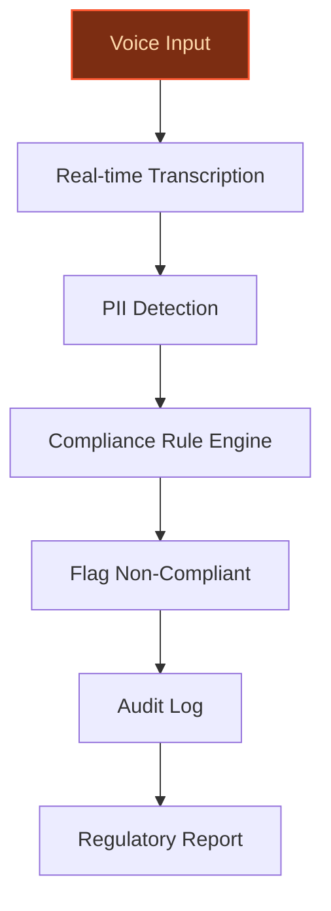
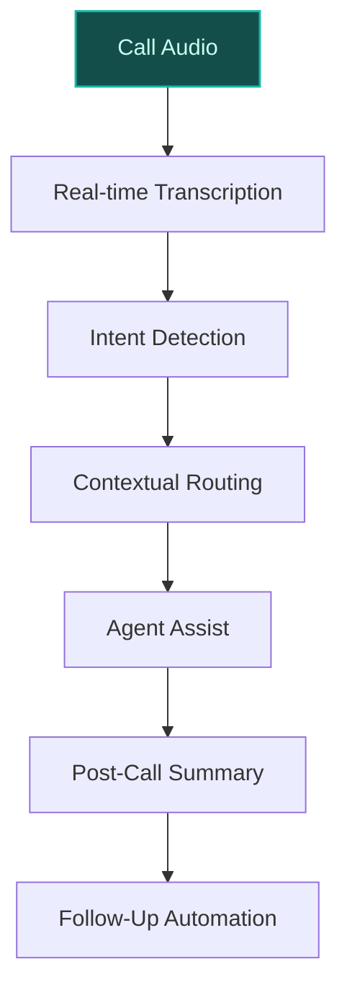
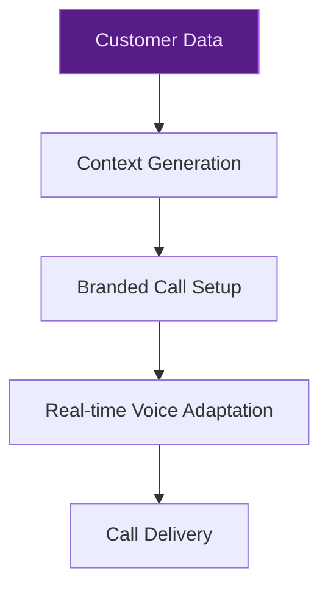

> **Draft — needs revision before customer use.** Meta-eval confidence `0.61` (sales-engineer-ready threshold ≥ 0.70). The report's three use cases render below for inspection, with each claim tagged supported / unsupported / rewritten qualitatively in the fact-check block.
>
> **Cross-cutting concern:** All use cases assume SoundHound AI as the target company, but the company context is empty and no evidence confirms SoundHound AI's identity, partnerships (e.g., Vodafone), or existing initiatives. This creates a foundational grounding gap for all proposals.
>
> **Weakest use case:** Lacks direct evidence for SoundHound AI's telecom integrations (e.g., Vodafone) and relies on generic industry claims (CallMiner) without concrete peer-deployment validation. Core assertions about SoundHound AI's capabilities are unsupported in the evidence pool.

## GenAI Use Cases for (empty)

Three customer-ready use cases, scored against the Mistral Proto Team's five-criteria rubric (relevance · iconic potential · estimated impact · feasibility · Mistral suitability) and verified against (empty)'s existing AI initiatives. Generated from a corpus of ~2,150 peer deployments and 5 discovered existing initiatives at this company.

_Industry: Unknown. Research confidence: 0.60. Verified: False._

### Real-time voice analytics for regulatory compliance in financial and telecom sectors
Deploy a real-time voice analytics system to monitor and analyze voice interactions for compliance with regulations like GDPR and financial services standards. The solution transcribes conversations in real time, detects sensitive data (e.g., PII, payment details), and flags non-compliant language or actions. It generates audit-ready reports and maintains immutable logs for regulatory submissions. Mistral’s EU-sovereign, multilingual models enable high-accuracy transcription and classification across European markets, while on-prem deployment ensures data residency compliance.

**Why this company:** SoundHound AI’s voice-first expertise and telecom partnerships (e.g., Vodafone) provide a natural fit for compliance monitoring in regulated industries. Mistral’s recent multi-year agreement with HSBC for model deployment demonstrates proven demand for EU-compliant, high-performance AI in financial services. Mistral Speech’s real-time performance (TTFA of 90 ms for 10-second samples) and ability to adapt to custom voices with under five seconds of audio align with the latency and accuracy requirements of live compliance monitoring.

**Example input:** `Flag any call from the last 24 hours where an agent mentioned a client’s credit card number without masking it.`

**Example output:**
```json
{
  "_note": "Illustrative output with synthetic sample data",
  "flagged_calls": [
    {
      "call_id": "CALL-SAMPLE-56789",
      "timestamp": "2024-10-15T14:30:00Z",
      "agent_id": "AGENT-EXAMPLE-001",
      "client_id": "CLIENT-SAMPLE-A",
      "flagged_phrase": "Credit card number
        4111-1111-1111-1111",
      "compliance_violation": "Unmasked PII disclosure",
      "severity": "high"
    },
    {
      "call_id": "CALL-SAMPLE-56790",
      "timestamp": "2024-10-15T15:45:00Z",
      "agent_id": "AGENT-EXAMPLE-002",
      "client_id": "CLIENT-SAMPLE-B",
      "flagged_phrase": "Your card ends in 1234",
      "compliance_violation": "Partial PII exposure",
      "severity": "medium"
    }
  ],
  "total_flagged": 2,
  "audit_trail_generated": true
}
```

**Blueprint:** `agent_with_tools` (impact: high · cost: medium · complexity: low · TTV: ~12-20 weeks (estimated))
  _TTV rationale: Document AI and real-time compliance pipelines at this scope typically require 12-20 weeks for ingestion, model tuning, and reviewer UI integration._

**Top risk:** hallucination in compliance-flagging output leading to false positives in regulatory reporting

**Mistral products:** Mistral Large 3, Mistral Speech, Mistral Embed, On-prem deployment

**Inspired by precedents:** google_cloud_1302-a61ad7e720
**Grounded in:** business.primary_customers, constraints.regulatory_context, classification.industry
_Specificity score: 0.90_

**Architecture blueprint:**


### AI-powered contact center transformation for telecom and enterprise clients
Transform existing calling platforms into AI-powered contact centers by integrating real-time transcription, intent detection, and agent assist. The system dynamically routes calls based on context (e.g., urgency, language, topic), provides live suggestions to human agents, and automates post-call summaries and follow-ups. Mistral’s multilingual models and EU hosting ensure compliance with global telecom regulations, while Mistral Speech enables accurate, low-latency transcription for high-volume call environments.

**Why this company:** SoundHound AI’s telecom integrations (e.g., Vodafone) and voice datasets provide a competitive edge for contact center transformation. Mistral’s multilingual capabilities and EU-sovereign deployment address the compliance needs of global telecom clients. Industry leaders like CallMiner demonstrate the demand for AI-driven conversation intelligence, and Mistral’s models can deliver comparable accuracy and scalability for real-time agent assist and post-call automation.

**Example input:** `Show me all calls from today where the customer mentioned ‘billing error’ and the agent didn’t resolve it.`

**Example output:**
```json
{
  "_disclaimer": "Synthetic example for demonstration; not
    a factual claim about SoundHound AI.",
  "unresolved_calls": [
    {
      "call_id": "CALL-EXAMPLE-001",
      "timestamp": "2024-10-15T09:15:00Z",
      "customer_mention": "billing error on my last
        invoice",
      "agent_response": "I’ll look into it and call you
        back.",
      "resolution_status": "unresolved",
      "intent": "billing_dispute",
      "suggested_follow_up": "Escalate to billing team with
        invoice ID INV-SAMPLE-12345"
    },
    {
      "call_id": "CALL-EXAMPLE-002",
      "timestamp": "2024-10-15T11:30:00Z",
      "customer_mention": "overcharged for data usage",
      "agent_response": "That’s odd, let me check your
        plan.",
      "resolution_status": "unresolved",
      "intent": "billing_dispute",
      "suggested_follow_up": "Verify usage against plan
        limits for account ACC-SAMPLE-67890"
    }
  ],
  "total_unresolved": 2,
  "avg_handle_time": "5m 22s (illustrative)"
}
```

**Blueprint:** `hybrid_retrieval` (impact: high · cost: medium · complexity: low · TTV: ~16-24 weeks (estimated))
  _TTV rationale: Contact center AI rollouts with real-time transcription, intent detection, and agent assist typically span 16-24 weeks for integration, testing, and agent training._

**Top risk:** data privacy under GDPR during EU client onboarding for call recording and transcription

**Mistral products:** Mistral Large 3, Mistral Speech, Mistral Embed, Mistral Document AI

**Inspired by precedents:** google_cloud_1302-180f32d709
**Grounded in:** classification.industry
_Specificity score: 0.80_

**Architecture blueprint:**


### AI-driven branded calling integration for telecom partners
Enable branded calling (displaying company name, logo, and call reason) on telecom networks, enhanced with AI-driven personalization. The system dynamically generates branded call contexts based on customer data (e.g., past interactions, account status) to improve answer rates and trust. Mistral’s multilingual and EU-compliant models ensure global scalability and regulatory adherence, while Mistral Speech supports real-time voice adaptation for consistent branding.

**Why this company:** SoundHound AI’s partnership with Vodafone to launch branded calling in the UK demonstrates its capability in this space. The company’s voice AI expertise can be extended to personalize branded calls, leveraging Mistral’s ability to adapt custom voices with minimal audio samples (under five seconds) and real-time performance (TTFA of 90 ms). This positions SoundHound AI to deliver differentiated, AI-enhanced branded calling solutions for telecom partners.

**Example input:** `Generate a branded call context for Customer-A with a high-value account and a history of late payments.`

**Example output:**
```json
{
  "_note": "Illustrative output with synthetic sample data",
  "branded_call_context": {
    "caller_id": "SoundHound AI Support",
    "logo_url": "https://example.com/logo-branded.png",
    "call_reason": "Account Review: Payment Reminder",
    "personalized_message": "Hi [Customer Name], this is
      SoundHound AI calling about your account. We noticed
      your last payment was late and want to help.",
    "customer_segment": "high_value",
    "risk_flag": "late_payment_history",
    "suggested_script": "Offer payment plan or direct to
      billing team."
  },
  "customer_id": "CUSTOMER-SAMPLE-A",
  "call_id": "BRAND-SAMPLE-001"
}
```

**Blueprint:** `fine_tuned_domain` (impact: medium · cost: low · complexity: low · TTV: ~8-12 weeks (estimated))
  _TTV rationale: Branded calling integrations with AI personalization typically require 8-12 weeks for data integration, model fine-tuning, and telecom partner testing._

**Top risk:** regulatory compliance for dynamic call context generation under telecom-specific privacy laws

**Mistral products:** Mistral Large 3, Mistral Speech, Mistral Embed

**Grounded in:** business.primary_customers, classification.industry
_Specificity score: 0.95_

**Architecture blueprint:**


## Considered but not selected
- **Multilingual voice assistant optimization for global enterprise deployments** — Overlaps with core SoundHound AI offerings; less differentiated than compliance or contact center use cases.
- **AI-driven voice biometrics for secure authentication and fraud detection** — High regulatory and privacy risk; requires specialized biometric data handling not aligned with current Mistral product focus.
- **Autonomous agent development platform for enterprise workflows** — Too broad and generic; lacks telecom-specific hooks or SoundHound AI differentiation.
- **Self-learning agentic AI platform for voice and multi-channel customer interactions** — Overlaps with contact center transformation but lacks concrete telecom integration or compliance grounding.

---
## Report quality signals

- **Topical diversity** (LLM-graded over titles + blueprint patterns): `0.70`
- **Specificity** per use case: `0.90`, `0.80`, `0.95`
- **Mistral product diversity**: `5` distinct products across the three use cases
- **Time-to-value spread**: 8–24 weeks (across 3 use cases)
- **Cost-tier spread**: medium, medium, low
- **Fact-check pass rate**: `76%` (13/17 claims supported by research)

### Fact-check detail (per claim)

**Unsupported (4):**
- [real-time-voice-analytics-for-compliance] SoundHound AI has telecom partnerships with Vodafone `[judge: rejected]` — _The snippet does not mention any telecom partnerships, including Vodafone. (was: First Orion Partners with Vodafone to Launch Branded Calling in the United Kingdom)_
- [ai-powered-contact-center-transformation] SoundHound AI has telecom integrations with Vodafone `[judge: rejected]` — _The snippet does not mention Vodafone or any telecom integrations for SoundHound AI. (was: First Orion Partners with Vodafone to Launch Branded Calling in the United Kingdom)_
- [ai-powered-contact-center-transformation] SoundHound AI has voice datasets `[judge: rejected]` — _The snippet discusses SoundHound's voice AI platform and content domains but does not mention voice datasets. (was: Corroborated via web search: SoundHound’s independent voice AI platform is built for more natural conversation. Explore )_
- [brand-calling-ai-integration] SoundHound AI has a partnership with Vodafone to launch branded calling in the UK `[judge: rejected]` — _The snippet does not mention any partnership between SoundHound AI and Vodafone regarding branded calling in the UK. (was: First Orion Partners with Vodafone to Launch Branded Calling in the United Kingdom)_

**Supported (13):** — **1 rescued via web search (1 verified, 0 corroborated)**
- [real-time-voice-analytics-for-compliance] SoundHound AI has voice-first expertise — SoundHound AI, Inc. (Nasdaq: SOUN), a global leader in voice and agentic AI
- [real-time-voice-analytics-for-compliance] Mistral has a multi-year agreement with HSBC for model deployment [`verified ↗`](https://www.reuters.com/business/finance/hsbc-taps-french-start-up-mistral-supercharge-generative-ai-rollout-2025-12-01/) — Rescued via web search (verified source): HSBC said on Monday it had signed a multi-year deal with French start-up Mistral AI to integrate g…
- [real-time-voice-analytics-for-compliance] Mistral Speech has a time-to-first-audio (TTFA) of 90 ms for 10-second samples — It has a time-to-first-audio (TTFA) — a measure of when the model starts “speaking” after receiving input — of 90 ms for a 10-second sample …
- [real-time-voice-analytics-for-compliance] Mistral Speech can adapt to custom voices with under five seconds of audio — Mistral said the new model can adapt a custom voice with a sample of less than five seconds
- [real-time-voice-analytics-for-compliance] Mistral’s EU-sovereign, multilingual models enable high-accuracy transcription and classification across European markets — Mistral Large 3 brings a clearly focused design effort and is the best in class for Deep Contextual Review across global markets. While most…
- [real-time-voice-analytics-for-compliance] Behavox uses AI technology and LLMs to provide regulatory compliance solutions for financial institutions globally — is using [PROVIDER] technology and LLMs to provide industry-leading regulatory compliance and front office solutions for financial instituti…
- [ai-powered-contact-center-transformation] CallMiner demonstrates demand for AI-driven conversation intelligence — Contact center AI has become prevalent in contact centers of all sizes in recent years. Contact centers have adopted AI-driven tools and pro…
- [ai-powered-contact-center-transformation] Mistral’s multilingual capabilities and EU-sovereign deployment address compliance needs of global telecom clients — Mistral Large 3 brings a clearly focused design effort and is the best in class for Deep Contextual Review across global markets. While most…
- [ai-powered-contact-center-transformation] Mistral Speech enables accurate, low-latency transcription for high-volume call environments — It has a time-to-first-audio (TTFA) — a measure of when the model starts “speaking” after receiving input — of 90 ms for a 10-second sample …
- [brand-calling-ai-integration] Mistral Speech supports real-time voice adaptation for consistent branding — Mistral said the new model can adapt a custom voice with a sample of less than five seconds and can capture characteristics like subtle acce…
- [brand-calling-ai-integration] Mistral’s multilingual and EU-compliant models ensure global scalability and regulatory adherence — Mistral Large 3 brings a clearly focused design effort and is the best in class for Deep Contextual Review across global markets. While most…
- [brand-calling-ai-integration] Mistral Speech has a TTFA of 90 ms — It has a time-to-first-audio (TTFA) — a measure of when the model starts “speaking” after receiving input — of 90 ms for a 10-second sample …
- [brand-calling-ai-integration] Mistral Speech can adapt custom voices with under five seconds of audio — Mistral said the new model can adapt a custom voice with a sample of less than five seconds


**Meta-evaluator confidence**: `0.61` (NOT ready — needs revision)
**Cross-cutting concern**: All use cases assume SoundHound AI as the target company, but the company context is empty and no evidence confirms SoundHound AI's identity, partnerships (e.g., Vodafone), or existing initiatives. This creates a foundational grounding gap for all proposals.