# Trace

## Execution trace — (empty)

Started: `2026-05-10T23:01:33.252717+00:00`. Total wall time: `102.5s` across `39` recorded actions.

### Per-step time totals

| Step | Calls | Total time | Avg time |
|---|---:|---:|---:|
| `research` | 1 | 3.93s | 3926ms |
| `gap_fill` | 4 | 2.90s | 725ms |
| `retrieve` | 2 | 0.24s | 120ms |
| `generate` | 1 | 16.91s | 16915ms |
| `score` | 2 | 23.73s | 11863ms |
| `verify` | 6 | 22.15s | 3691ms |
| `enrich` | 1 | 14.13s | 14125ms |
| `meta_eval` | 1 | 10.78s | 10775ms |
| `web_verify` | 1 | 1.26s | 1262ms |
| `source_judge` | 18 | 12.42s | 690ms |
| `quality_signals` | 2 | 4.20s | 2099ms |

### Chronological event log

- `23:01:44.065` **[research]** `mistral-medium-2604.chat.complete` — 3926ms
   - inputs: synthesize CompanyContext for (empty) | depth=medium
   - outputs: industry='Unknown' verified=False conf=0.50
- `23:01:47.994` **[gap_fill]** `mistral-small-2603.chat.complete` — 1058ms
   - inputs: generate gap queries | fields=['industry', 'geography', 'business_model', 'products', 'data_assets', 'priorities']
   - outputs: queries=6
- `23:01:56.740` **[gap_fill]** `mistral-small-2603.chat.complete` — 483ms
   - inputs: layer-2 extract field=priorities
   - outputs: items=0
- `23:01:56.753` **[gap_fill]** `mistral-small-2603.chat.complete` — 890ms
   - inputs: layer-2 extract field=data_assets
   - outputs: items=0
- `23:01:56.756` **[gap_fill]** `mistral-small-2603.chat.complete` — 468ms
   - inputs: layer-2 extract field=products
   - outputs: items=0
- `23:01:57.645` **[retrieve]** `mistral-embed.embeddings.create` — 235ms
   - inputs: company_query | industries='Unknown'
   - outputs: embedded 1024-dim query vector
- `23:01:57.880` **[retrieve]** `precedent_corpus.cosine_topk` — 5ms
   - inputs: k=8 min_depth=0.4 target='(empty)'
   - outputs: retrieved 8 | mmr=True | top_sim=0.731
- `23:01:59.646` **[generate]** `mistral-medium-2604.chat.complete` — 16915ms
   - inputs: iteration=0 tool_calls_used=0/0 tools=off
   - outputs: tool_calls=0 | content_chars=12705
- `23:02:16.886` **[score]** `mistral-small-2603.chat.complete` — 10984ms
   - inputs: self-consistency pass T=0.2
   - outputs: scored 8 candidates
- `23:02:16.891` **[score]** `mistral-small-2603.chat.complete` — 12742ms
   - inputs: self-consistency pass T=0.4
   - outputs: scored 8 candidates
- `23:02:29.669` **[verify]** `tavily.search` — 2260ms
   - inputs: candidate=real-time-voice-analytics-for-compliance | query='(empty) Real-time voice analytics for regulatory compliance '
   - outputs: 4 results
- `23:02:29.669` **[verify]** `tavily.search` — 1983ms
   - inputs: candidate=multilingual-voice-assistant-optimization | query='(empty) Multilingual voice assistant optimization for global'
   - outputs: 4 results
- `23:02:29.669` **[verify]** `tavily.search` — 2100ms
   - inputs: candidate=ai-powered-contact-center-transformation | query='(empty) AI-powered contact center transformation for telecom'
   - outputs: 4 results
- `23:02:31.804` **[verify]** `mistral-small-2603.chat.complete` — 3845ms
   - inputs: verdict for multilingual-voice-assistant-optimization
   - outputs: verdict='confirmed_existing'
- `23:02:32.281` **[verify]** `mistral-small-2603.chat.complete` — 8785ms
   - inputs: verdict for real-time-voice-analytics-for-compliance
   - outputs: verdict='pass'
- `23:02:32.681` **[verify]** `mistral-small-2603.chat.complete` — 3175ms
   - inputs: verdict for ai-powered-contact-center-transformation
   - outputs: verdict='pass'
- `23:02:41.069` **[enrich]** `mistral-medium-2604.chat.complete` — 14125ms
   - inputs: tier=fast parallel=False ids=['real-time-voice-analytics-for-compliance', 'ai-powered-contact-center-transformation', 'brand-calling-ai-integration']
   - outputs: enriched 3 use cases
- `23:02:55.220` **[meta_eval]** `mistral-medium-2604.chat.complete` — 10775ms
   - inputs: reviewing 3 use cases
   - outputs: review + claims
- `23:03:06.018` **[web_verify]** `tavily.search.rescue_unsupported_claims` — 1262ms
   - inputs: company='(empty)' unsupported=2 budget=12
   - outputs: rescued: verified=1 corroborated=1 of 2 attempted
- `23:03:07.285` **[source_judge]** `mistral-small-2603.judge_claim_sources` — 1698ms
   - inputs: pairs=17
   - outputs: judged 17 pairs
- `23:03:07.285` **[source_judge]** `mistral-small-2603.chat.complete` — 703ms
   - inputs: claim='SoundHound AI has voice-first expertise'
   - outputs: verdict=supported
- `23:03:07.291` **[source_judge]** `mistral-small-2603.chat.complete` — 603ms
   - inputs: claim='SoundHound AI has telecom partnerships with Vodafone'
   - outputs: verdict=unsupported
- `23:03:07.295` **[source_judge]** `mistral-small-2603.chat.complete` — 622ms
   - inputs: claim='Mistral has a multi-year agreement with HSBC for model deplo'
   - outputs: verdict=supported
- `23:03:07.299` **[source_judge]** `mistral-small-2603.chat.complete` — 745ms
   - inputs: claim='Mistral Speech has a time-to-first-audio (TTFA) of 90 ms for'
   - outputs: verdict=supported
- `23:03:07.305` **[source_judge]** `mistral-small-2603.chat.complete` — 669ms
   - inputs: claim='Mistral Speech can adapt to custom voices with under five se'
   - outputs: verdict=supported
- `23:03:07.308` **[source_judge]** `mistral-small-2603.chat.complete` — 848ms
   - inputs: claim='Mistral’s EU-sovereign, multilingual models enable high-accu'
   - outputs: verdict=supported
- `23:03:07.312` **[source_judge]** `mistral-small-2603.chat.complete` — 673ms
   - inputs: claim='Behavox uses AI technology and LLMs to provide regulatory co'
   - outputs: verdict=supported
- `23:03:07.314` **[source_judge]** `mistral-small-2603.chat.complete` — 770ms
   - inputs: claim='SoundHound AI has telecom integrations with Vodafone'
   - outputs: verdict=unsupported
- `23:03:07.894` **[source_judge]** `mistral-small-2603.chat.complete` — 544ms
   - inputs: claim='SoundHound AI has voice datasets'
   - outputs: verdict=unsupported
- `23:03:07.917` **[source_judge]** `mistral-small-2603.chat.complete` — 559ms
   - inputs: claim='CallMiner demonstrates demand for AI-driven conversation int'
   - outputs: verdict=supported
- `23:03:07.974` **[source_judge]** `mistral-small-2603.chat.complete` — 551ms
   - inputs: claim='Mistral’s multilingual capabilities and EU-sovereign deploym'
   - outputs: verdict=supported
- `23:03:07.984` **[source_judge]** `mistral-small-2603.chat.complete` — 649ms
   - inputs: claim='Mistral Speech enables accurate, low-latency transcription f'
   - outputs: verdict=supported
- `23:03:07.989` **[source_judge]** `mistral-small-2603.chat.complete` — 538ms
   - inputs: claim='SoundHound AI has a partnership with Vodafone to launch bran'
   - outputs: verdict=unsupported
- `23:03:08.044` **[source_judge]** `mistral-small-2603.chat.complete` — 554ms
   - inputs: claim='Mistral Speech supports real-time voice adaptation for consi'
   - outputs: verdict=supported
- `23:03:08.084` **[source_judge]** `mistral-small-2603.chat.complete` — 623ms
   - inputs: claim='Mistral’s multilingual and EU-compliant models ensure global'
   - outputs: verdict=supported
- `23:03:08.157` **[source_judge]** `mistral-small-2603.chat.complete` — 525ms
   - inputs: claim='Mistral Speech has a TTFA of 90 ms'
   - outputs: verdict=supported
- `23:03:08.438` **[source_judge]** `mistral-small-2603.chat.complete` — 544ms
   - inputs: claim='Mistral Speech can adapt custom voices with under five secon'
   - outputs: verdict=supported
- `23:03:11.533` **[quality_signals]** `mistral-small-2603.chat.complete` — 2770ms
   - inputs: specificity grade (3 use cases)
   - outputs: scored 3 use cases
- `23:03:14.303` **[quality_signals]** `mistral-small-2603.chat.complete` — 1429ms
   - inputs: diversity grade
   - outputs: diversity=0.7

## Mermaid sequence

```mermaid
sequenceDiagram
    autonumber
    participant pipeline as pipeline
    participant mistral_medium_2604 as mistral-medium-2604
    participant mistral_small_2603 as mistral-small-2603
    participant mistral_embed as mistral-embed
    participant precedent_corpus as precedent_corpus
    participant tavily as tavily
    participant tavily_search as tavily.search
    pipeline->>mistral_medium_2604: research: chat.complete (3926ms)
    mistral_medium_2604-->>pipeline: industry='Unknown' verified=False conf=0.50
    pipeline->>mistral_small_2603: gap_fill: chat.complete (1058ms)
    mistral_small_2603-->>pipeline: queries=6
    pipeline->>mistral_small_2603: gap_fill: chat.complete (483ms)
    mistral_small_2603-->>pipeline: items=0
    pipeline->>mistral_small_2603: gap_fill: chat.complete (890ms)
    mistral_small_2603-->>pipeline: items=0
    pipeline->>mistral_small_2603: gap_fill: chat.complete (468ms)
    mistral_small_2603-->>pipeline: items=0
    pipeline->>mistral_embed: retrieve: embeddings.create (235ms)
    mistral_embed-->>pipeline: embedded 1024-dim query vector
    pipeline->>precedent_corpus: retrieve: cosine_topk (5ms)
    precedent_corpus-->>pipeline: retrieved 8 | mmr=True | top_sim=0.731
    pipeline->>mistral_medium_2604: generate: chat.complete (16915ms)
    mistral_medium_2604-->>pipeline: tool_calls=0 | content_chars=12705
    pipeline->>mistral_small_2603: score: chat.complete (10984ms)
    mistral_small_2603-->>pipeline: scored 8 candidates
    pipeline->>mistral_small_2603: score: chat.complete (12742ms)
    mistral_small_2603-->>pipeline: scored 8 candidates
    pipeline->>tavily: verify: search (2260ms)
    tavily-->>pipeline: 4 results
    pipeline->>tavily: verify: search (1983ms)
    tavily-->>pipeline: 4 results
    pipeline->>tavily: verify: search (2100ms)
    tavily-->>pipeline: 4 results
    pipeline->>mistral_small_2603: verify: chat.complete (3845ms)
    mistral_small_2603-->>pipeline: verdict='confirmed_existing'
    pipeline->>mistral_small_2603: verify: chat.complete (8785ms)
    mistral_small_2603-->>pipeline: verdict='pass'
    pipeline->>mistral_small_2603: verify: chat.complete (3175ms)
    mistral_small_2603-->>pipeline: verdict='pass'
    pipeline->>mistral_medium_2604: enrich: chat.complete (14125ms)
    mistral_medium_2604-->>pipeline: enriched 3 use cases
    pipeline->>mistral_medium_2604: meta_eval: chat.complete (10775ms)
    mistral_medium_2604-->>pipeline: review + claims
    pipeline->>tavily_search: web_verify: rescue_unsupported_claims (1262ms)
    tavily_search-->>pipeline: rescued: verified=1 corroborated=1 of 2 attempted
    pipeline->>mistral_small_2603: source_judge: judge_claim_sources (1698ms)
    mistral_small_2603-->>pipeline: judged 17 pairs
    pipeline->>mistral_small_2603: source_judge: chat.complete (703ms)
    mistral_small_2603-->>pipeline: verdict=supported
    pipeline->>mistral_small_2603: source_judge: chat.complete (603ms)
    mistral_small_2603-->>pipeline: verdict=unsupported
    pipeline->>mistral_small_2603: source_judge: chat.complete (622ms)
    mistral_small_2603-->>pipeline: verdict=supported
    pipeline->>mistral_small_2603: source_judge: chat.complete (745ms)
    mistral_small_2603-->>pipeline: verdict=supported
    pipeline->>mistral_small_2603: source_judge: chat.complete (669ms)
    mistral_small_2603-->>pipeline: verdict=supported
    pipeline->>mistral_small_2603: source_judge: chat.complete (848ms)
    mistral_small_2603-->>pipeline: verdict=supported
    pipeline->>mistral_small_2603: source_judge: chat.complete (673ms)
    mistral_small_2603-->>pipeline: verdict=supported
    pipeline->>mistral_small_2603: source_judge: chat.complete (770ms)
    mistral_small_2603-->>pipeline: verdict=unsupported
    pipeline->>mistral_small_2603: source_judge: chat.complete (544ms)
    mistral_small_2603-->>pipeline: verdict=unsupported
    pipeline->>mistral_small_2603: source_judge: chat.complete (559ms)
    mistral_small_2603-->>pipeline: verdict=supported
    pipeline->>mistral_small_2603: source_judge: chat.complete (551ms)
    mistral_small_2603-->>pipeline: verdict=supported
    pipeline->>mistral_small_2603: source_judge: chat.complete (649ms)
    mistral_small_2603-->>pipeline: verdict=supported
    pipeline->>mistral_small_2603: source_judge: chat.complete (538ms)
    mistral_small_2603-->>pipeline: verdict=unsupported
    pipeline->>mistral_small_2603: source_judge: chat.complete (554ms)
    mistral_small_2603-->>pipeline: verdict=supported
    pipeline->>mistral_small_2603: source_judge: chat.complete (623ms)
    mistral_small_2603-->>pipeline: verdict=supported
    pipeline->>mistral_small_2603: source_judge: chat.complete (525ms)
    mistral_small_2603-->>pipeline: verdict=supported
    pipeline->>mistral_small_2603: source_judge: chat.complete (544ms)
    mistral_small_2603-->>pipeline: verdict=supported
    pipeline->>mistral_small_2603: quality_signals: chat.complete (2770ms)
    mistral_small_2603-->>pipeline: scored 3 use cases
    pipeline->>mistral_small_2603: quality_signals: chat.complete (1429ms)
    mistral_small_2603-->>pipeline: diversity=0.7
```

