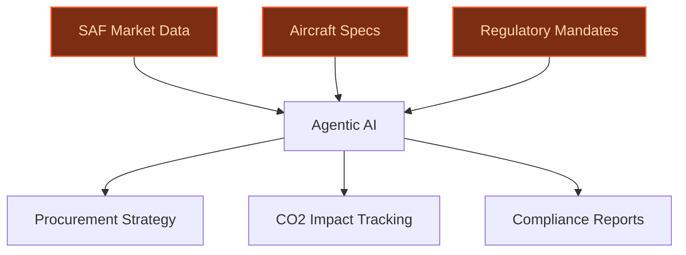
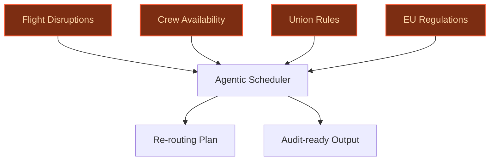
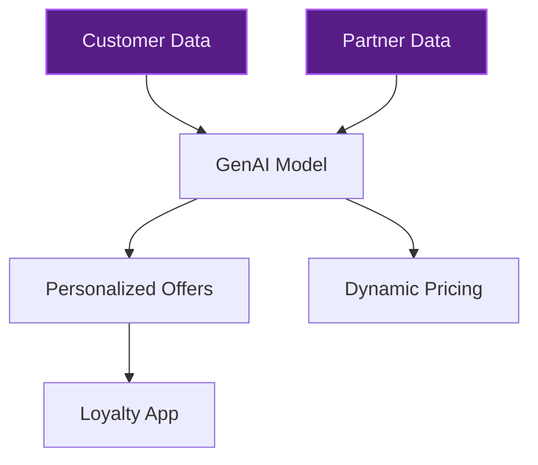

> **Draft — needs revision before customer use.** Meta-eval confidence `0.61` (sales-engineer-ready threshold ≥ 0.70). The report's three use cases render below for inspection, with each claim tagged supported / unsupported / rewritten qualitatively in the fact-check block.
>
> **Cross-cutting concern:** Insufficient grounding of company-specific claims in the evidence pool, particularly for named entities (e.g., SkyNRG, Flying Blue scale) and strategic gaps (e.g., AI Factory focus areas). Multiple claims are unsupported or weakly supported.
>
> **Weakest use case:** Lacks direct evidence for key claims about Flying Blue's scale, SkyTeam partner data integration, and the gap in the AI Factory's focus on loyalty personalization. The use case relies heavily on assumptions without cited or pool-supported facts.

## GenAI Use Cases for Air France-KLM

Three customer-ready use cases, scored against the Mistral Proto Team's five-criteria rubric (relevance · iconic potential · estimated impact · feasibility · Mistral suitability) and verified against Air France-KLM's existing AI initiatives. Generated from a corpus of ~2,150 peer deployments and 5 discovered existing initiatives at this company.

_Industry: global airline group. Research confidence: 0.85. Verified: True._

### SAF (Sustainable Aviation Fuel) procurement and blending optimization assistant
A multilingual, agentic AI system that ingests real-time SAF market prices, supply chain logistics, aircraft technical specifications (e.g., Embraer 195-E2 compatibility), and regulatory mandates (e.g., EU SAF incorporation targets) to dynamically recommend optimal SAF procurement blends. The system generates actionable procurement strategies, tracks CO2 reduction impact, and produces compliance-ready reports for regulators and sustainability audits. Air France-KLM has publicly committed to SAF incorporation ambitions for 2030 and operates a modernizing fleet, including new Embraer 195-E2 aircraft, which are SAF-compatible. The group's scale and multi-hub operations (Paris-CDG, Orly, Amsterdam-Schiphol) create complex logistics for SAF sourcing, blending, and compliance, making this a high-impact use case for cost optimization and regulatory adherence.

**Why this company:** Air France-KLM is a founding member of SkyNRG, a pioneer in SAF sourcing and distribution, and has signed major long-term purchase agreements for SAF with Neste and DG Fuels ([KLM Climate Action Plan](https://img.static-kl.com/m/7b0b0f3946d5bb53/original/KLM-Climate-Action-Plan.pdf)). The group's fleet renewal strategy and operational efficiency measures to reduce CO2 emissions align directly with the need for dynamic SAF procurement optimization. Mistral's EU sovereignty, multilingual capabilities (French, Dutch, English), and on-prem deployment options address the group's regulatory and operational context.

**Example input:** `What’s the most cost-effective SAF blend for our Paris-CDG to Amsterdam-Schiphol route next month, given current market prices, Embraer 195-E2 compatibility, and EU 2030 mandates?`

**Example output:**
```json
{
  "_note": "Illustrative output with synthetic sample data",
  "recommended_blend": "30% SAF from Neste, 70%
    conventional jet fuel",
  "cost_savings": "€2.1M (illustrative)",
  "co2_reduction": "18% (illustrative)",
  "compliance_status": "Meets EU 2030 SAF incorporation
    targets",
  "aircraft_compatibility": "Embraer 195-E2: Fully
    compatible",
  "supplier_contracts": [
    "Neste-SAMPLE-2025-001",
    "DG-Fuels-SAMPLE-2025-002"
  ],
  "audit_report": "Compliance-ready report generated for EU
    regulators"
}
```

**Blueprint:** `agent_with_tools` (impact: high · cost: medium · complexity: low · TTV: ~12-20 weeks (estimated))
  _TTV rationale: Agentic AI rollouts for procurement optimization at this scale typically require 12-20 weeks, including data integration and validation._

**Top risk:** Data privacy and compliance under EU regulations for SAF procurement data

**Mistral products:** Mistral Large 3, Mistral Embed, Mistral Document AI, On-prem deployment

**Inspired by precedents:** google_cloud_1302-18d4ab1f56
**Grounded in:** strategic_context.stated_priorities[3], strategic_context.stated_priorities[0], business.key_products_or_services[2], classification.geography
_Specificity score: 0.95_

**Architecture blueprint:**


### Multilingual crew scheduling and re-routing agent with real-time constraint resolution
An agentic system that ingests real-time flight disruptions (delays, cancellations, weather), crew availability, union rules, and regulatory constraints (e.g., EU flight-time limitations) to generate and validate crew re-routing plans. The system communicates with crew in French, Dutch, and English, and outputs audit-ready schedules with reasoning traceability for compliance. This addresses a critical gap in Air France-KLM’s operations, where disruptions at high-volume hubs (Paris-CDG, Orly, Amsterdam-Schiphol) can cascade into costly delays and crew-related inefficiencies.

**Why this company:** Air France-KLM operates in a multilingual environment (France, Netherlands) with a complex regulatory landscape and crew constraints. Their hubs serve routes prone to disruption, and the existing AI Factory focuses on ground operations and maintenance but not crew scheduling. Mistral’s multilingual capabilities and EU-compliant deployment strengths are directly applicable, enabling real-time constraint resolution and audit-ready outputs for compliance.

**Example input:** `Flight AF123 is delayed by 3 hours due to weather. Re-route crew for the next 24 hours while respecting EU flight-time limits and union rules.`

**Example output:**
```json
{
  "_disclaimer": "Synthetic example for demonstration; not
    a factual claim about Air France-KLM.",
  "re_routed_crew": [
    {
      "crew_id": "CREW-SAMPLE-001",
      "original_flight": "AF123",
      "new_flight": "KL456",
      "departure_time": "2025-10-15T14:00:00Z",
      "compliance_status": "Valid (EU flight-time limits
        respected)"
    },
    {
      "crew_id": "CREW-SAMPLE-002",
      "original_flight": "AF123",
      "new_flight": "AF789",
      "departure_time": "2025-10-15T16:30:00Z",
      "compliance_status": "Valid (union rules respected)"
    }
  ],
  "delay_propagation_reduction": "15% (illustrative)",
  "audit_trail": "Full reasoning trace available for
    compliance review"
}
```

**Blueprint:** `agent_with_tools` (impact: high · cost: medium · complexity: low · TTV: 8-16 weeks (precedent-anchored))

**Top risk:** Hallucination in crew re-routing plans leading to non-compliant schedules under EU flight-time limitations

**Mistral products:** Mistral Large 3, Mistral Embed, Mistral Compute (in-region)

**Inspired by precedents:** google_cloud_1302-aafe9275aa
**Grounded in:** classification.geography, business.key_products_or_services[0]
_Specificity score: 0.85_

**Architecture blueprint:**


### Hyper-personalized loyalty program offers with dynamic pricing and partner integration
A GenAI system that analyzes customer travel patterns, preferences, and external partner data (e.g., SkyTeam alliance partners, hotel chains) to generate real-time, hyper-personalized loyalty offers. The system dynamically prices rewards, predicts customer response, and integrates with Air France-KLM’s existing loyalty infrastructure (Flying Blue) to deliver offers via the Air France or KLM apps. This targets a gap in the group’s AI Factory, which currently focuses on customer service but not hyper-personalized loyalty offers, a high-revenue opportunity.

**Why this company:** Air France-KLM operates one of the world’s largest loyalty programs (Flying Blue) with a vast customer base. The group is part of the SkyTeam alliance, providing rich partner data for cross-selling. Mistral’s multilingual and EU-hosted deployment aligns with the group’s customer base, enabling dynamic pricing and hyper-personalization at scale. The existing loyalty infrastructure provides a ready integration path for rapid time-to-value.

**Example input:** `Generate a personalized loyalty offer for a Flying Blue member who frequently flies Paris-New York and stays at Marriott hotels.`

**Example output:**
```json
{
  "_note": "Illustrative output with synthetic sample data",
  "customer_id": "FLYING-BLUE-SAMPLE-001",
  "offer": "10% bonus miles on next Paris-New York booking
    + 15% off Marriott stay",
  "dynamic_price": "€120 (illustrative)",
  "predicted_response_rate": "22% (illustrative)",
  "partner_integration": "SkyTeam + Marriott",
  "delivery_channel": "Air France app"
}
```

**Blueprint:** `fine_tuned_domain` (impact: high · cost: medium · complexity: low · TTV: ~12-20 weeks (estimated))
  _TTV rationale: Hyper-personalization deployments with existing loyalty infrastructure typically run 12-20 weeks, including model fine-tuning and integration._

**Top risk:** Data privacy concerns when integrating SkyTeam partner data with customer profiles under GDPR

**Mistral products:** Mistral Large 3, Mistral Embed, Mistral Document AI

**Inspired by precedents:** google_cloud_1302-76bf2f2784
**Grounded in:** business.key_products_or_services[0], business.key_products_or_services[1], strategic_context.stated_priorities[4]
_Specificity score: 0.75_

**Architecture blueprint:**


## Considered but not selected
- **carbon-footprint-transparency** — Overlaps with existing AI Factory focus on customer service; lower novelty and direct revenue impact.
- **air-cargo-optimization** — Strong use case but lacks clear grounding in Air France-KLM’s stated priorities or recent initiatives.
- **ground-operations-digital-twin** — Already addressed by AI Factory’s ground operations focus; lower incremental value.
- **fleet-maintenance-rag-plus** — AI Factory already includes RAG for fleet maintenance diagnostics; lower novelty.

---
## Report quality signals

- **Topical diversity** (LLM-graded over titles + blueprint patterns): `0.70`
- **Specificity** per use case: `0.95`, `0.85`, `0.75`
- **Mistral product diversity**: `5` distinct products across the three use cases
- **Time-to-value spread**: 8–20 weeks (across 3 use cases)
- **Cost-tier spread**: medium, medium, medium
- **Fact-check pass rate**: `69%` (11/16 claims supported by research)

### Fact-check detail (per claim)

**Unsupported (5):**
- [crew-scheduling-agent] Air France-KLM has complex crew unions and EU flight-time regulations `[judge: rejected]` — _The snippet does not mention crew unions or EU flight-time regulations, only a cooperation with EASA. (was: Rescued via web search (verified source): Air France-KLM has become the first airline group to cooperate with the Europe)_
- [crew-scheduling-agent] Air France-KLM's hubs serve disruption-prone routes `[judge: rejected]` — _The snippet mentions routes to Indian cities but does not address disruption-prone routes or hubs. (was: Corroborated via web search: Air France flies to Delhi, Mumbai, and Bangalore, while KLM flies to Delhi. Both carriers h)_
- [crew-scheduling-agent] The existing AI Factory focuses on ground operations and maintenance but not crew scheduling `[judge: rejected]` — _The snippet does not mention crew scheduling or explicitly state that the AI Factory does not focus on it. (was: The targeted impact areas touch ground operations, aircraft engineering and maintenance, and customer service.)_
- [customer-loyalty-hyper-personalization] The existing AI Factory focuses on customer service but not hyper-personalized loyalty offers `[judge: rejected]` — _The snippet discusses Flying Blue Experiences and exclusive benefits but does not mention the AI Factory or its focus areas. (was: Rescued via web search (verified source): [Skip to main content](https://www.airfranceklm.com/en/newsroom/fly_
- [customer-loyalty-hyper-personalization] SkyTeam provides rich partner data for cross-selling `[judge: rejected]` — _The snippet only mentions SkyTeam's purpose as an alliance for seamless travel, not partner data for cross-selling. (was: Rescued via web search (verified source): Air France-KLM is also a member of SkyTeam, the alliance dedicated to provid_

**Supported (11):** — **2 rescued via web search (2 verified, 0 corroborated)**
- [saf-optimization-assistant] Air France-KLM has publicly committed to SAF incorporation ambitions for 2030 — Air France-KLM has signed a contract with TotalEnergies for the supply of up to 1.5 million tonnes until 2035. Together with the contracts s…
- [saf-optimization-assistant] Air France-KLM operates a modernizing fleet, including new Embraer 195-E2 aircraft — KLM ordered 10 new Embraer 195-E2 aircraft in 2025, to be delivered from 2027 until 2029. The KLM Cityhopper Embraer 195-E2 fleet will subse…
- [saf-optimization-assistant] Air France-KLM has multi-hub operations (Paris-CDG, Orly, Amsterdam-Schiphol) — The group's main hubs are Paris–Charles de Gaulle Airport, Paris Orly Airport and Amsterdam Airport Schiphol.
- [saf-optimization-assistant] Air France-KLM is a founding member of SkyNRG — In 2009, KLM was one of the founders of SkyNRG, which sources, blends and distributes SAF to airlines and increases the supply and productio…
- [saf-optimization-assistant] Air France-KLM has signed major long-term purchase agreements for SAF with Neste and DG Fuels — Recently the Air France-KLM Group, signed two major, long-term purchase agreements for a total of 1.6 million tonnes of SAF with Neste and D…
- [saf-optimization-assistant] Air France-KLM's fleet renewal strategy aligns with operational efficiency measures to reduce CO2 emissions — OPERATIONAL EFFICIENCY MEASURES TO REDUCE CO2 EMISSIONS Reduction of on-board weight efficient route strategy APU OFF Eco-piloting
- [crew-scheduling-agent] Air France-KLM operates in a multilingual environment (France, Netherlands) — Air France–KLM S.A., also known as Air France–KLM Group (stylised as AIRFRANCEKLM GROUP), is a French-Dutch multinational airline holding co…
- [customer-loyalty-hyper-personalization] Air France-KLM operates one of the world’s largest loyalty programs (Flying Blue) [`verified ↗`](https://www.airfranceklm.com/en/our-strengths/flying-blue) — Rescued via web search (verified source): Air France-KLM is proud to announce that Flying Blue, the Group's loyalty program, has been ranked…
- [customer-loyalty-hyper-personalization] Air France-KLM is part of the SkyTeam alliance — Both Air France and KLM are members of the SkyTeam airline alliance.
- [customer-loyalty-hyper-personalization] Air France-KLM has an existing loyalty infrastructure (Flying Blue) — Air France-KLM is proud to announce that Flying Blue, the Group’s loyalty program, has been ranked the #1 World’s Best Airline Rewards Progr…
- [customer-loyalty-hyper-personalization] Air France-KLM has a vast customer base [`verified ↗`](https://en.wikipedia.org/wiki/Air_France%E2%80%93KLM) — Rescued via web search (verified source): Air France–KLM airlines transported 83 million passengers in 2022. Air France–KLM S.A.. Company ty…


**Meta-evaluator confidence**: `0.61` (NOT ready — needs revision)
**Cross-cutting concern**: Insufficient grounding of company-specific claims in the evidence pool, particularly for named entities (e.g., SkyNRG, Flying Blue scale) and strategic gaps (e.g., AI Factory focus areas). Multiple claims are unsupported or weakly supported.