# Trace

## Execution trace — Air France-KLM

Started: `2026-05-10T22:47:00.810223+00:00`. Total wall time: `101.7s` across `39` recorded actions.

### Per-step time totals

| Step | Calls | Total time | Avg time |
|---|---:|---:|---:|
| `research` | 1 | 8.59s | 8592ms |
| `gap_fill` | 4 | 3.03s | 758ms |
| `retrieve` | 2 | 0.18s | 91ms |
| `generate` | 1 | 21.38s | 21377ms |
| `score` | 2 | 23.81s | 11903ms |
| `verify` | 6 | 17.82s | 2971ms |
| `enrich` | 1 | 12.94s | 12943ms |
| `meta_eval` | 1 | 9.54s | 9543ms |
| `web_verify` | 1 | 3.07s | 3072ms |
| `source_judge` | 17 | 11.75s | 691ms |
| `final_qualify` | 1 | 1.64s | 1637ms |
| `quality_signals` | 2 | 4.67s | 2335ms |

### Chronological event log

- `22:47:09.995` **[research]** `mistral-medium-2604.chat.complete` — 8592ms
   - inputs: synthesize CompanyContext for Air France-KLM | depth=medium
   - outputs: industry='global airline group' verified=True conf=0.75
- `22:47:18.590` **[gap_fill]** `mistral-small-2603.chat.complete` — 990ms
   - inputs: generate gap queries | fields=['business_model', 'products', 'data_assets', 'priorities']
   - outputs: queries=4
- `22:47:24.167` **[gap_fill]** `mistral-small-2603.chat.complete` — 719ms
   - inputs: layer-2 extract field=priorities
   - outputs: items=6
- `22:47:24.174` **[gap_fill]** `mistral-small-2603.chat.complete` — 622ms
   - inputs: layer-2 extract field=data_assets
   - outputs: items=0
- `22:47:24.178` **[gap_fill]** `mistral-small-2603.chat.complete` — 699ms
   - inputs: layer-2 extract field=products
   - outputs: items=10
- `22:47:24.888` **[retrieve]** `mistral-embed.embeddings.create` — 175ms
   - inputs: company_query | industries='global airline group'
   - outputs: embedded 1024-dim query vector
- `22:47:25.062` **[retrieve]** `precedent_corpus.cosine_topk` — 7ms
   - inputs: k=8 min_depth=0.4 target='Air France-KLM'
   - outputs: retrieved 8 | mmr=True | top_sim=0.787
- `22:47:26.890` **[generate]** `mistral-medium-2604.chat.complete` — 21377ms
   - inputs: iteration=0 tool_calls_used=0/0 tools=off
   - outputs: tool_calls=0 | content_chars=15038
- `22:47:48.592` **[score]** `mistral-small-2603.chat.complete` — 11697ms
   - inputs: self-consistency pass T=0.2
   - outputs: scored 8 candidates
- `22:47:48.598` **[score]** `mistral-small-2603.chat.complete` — 12109ms
   - inputs: self-consistency pass T=0.4
   - outputs: scored 8 candidates
- `22:48:00.736` **[verify]** `tavily.search` — 2852ms
   - inputs: candidate=saf-optimization-assistant | query='Air France-KLM SAF (Sustainable Aviation Fuel) procurement a'
   - outputs: 4 results
- `22:48:00.736` **[verify]** `tavily.search` — 2961ms
   - inputs: candidate=carbon-footprint-transparency | query='Air France-KLM Real-time carbon footprint transparency for p'
   - outputs: 4 results
- `22:48:00.737` **[verify]** `tavily.search` — 2278ms
   - inputs: candidate=crew-scheduling-agent | query='Air France-KLM Multilingual crew scheduling and re-routing a'
   - outputs: 4 results
- `22:48:03.581` **[verify]** `mistral-small-2603.chat.complete` — 1709ms
   - inputs: verdict for crew-scheduling-agent
   - outputs: verdict='pass'
- `22:48:03.589` **[verify]** `mistral-small-2603.chat.complete` — 4239ms
   - inputs: verdict for saf-optimization-assistant
   - outputs: verdict='pass'
- `22:48:03.920` **[verify]** `mistral-small-2603.chat.complete` — 3784ms
   - inputs: verdict for carbon-footprint-transparency
   - outputs: verdict='confirmed_existing'
- `22:48:07.830` **[enrich]** `mistral-medium-2604.chat.complete` — 12943ms
   - inputs: tier=fast parallel=False ids=['saf-optimization-assistant', 'crew-scheduling-agent', 'customer-loyalty-hyper-personalization']
   - outputs: enriched 3 use cases
- `22:48:20.795` **[meta_eval]** `mistral-medium-2604.chat.complete` — 9543ms
   - inputs: reviewing 3 use cases
   - outputs: review + claims
- `22:48:30.358` **[web_verify]** `tavily.search.rescue_unsupported_claims` — 3072ms
   - inputs: company='Air France-KLM' unsupported=6 budget=12
   - outputs: rescued: verified=5 corroborated=1 of 6 attempted
- `22:48:33.433` **[source_judge]** `mistral-small-2603.judge_claim_sources` — 1546ms
   - inputs: pairs=16
   - outputs: judged 16 pairs
- `22:48:33.434` **[source_judge]** `mistral-small-2603.chat.complete` — 750ms
   - inputs: claim='Air France-KLM has publicly committed to SAF incorporation a'
   - outputs: verdict=supported
- `22:48:33.438` **[source_judge]** `mistral-small-2603.chat.complete` — 763ms
   - inputs: claim='Air France-KLM operates a modernizing fleet, including new E'
   - outputs: verdict=supported
- `22:48:33.442` **[source_judge]** `mistral-small-2603.chat.complete` — 573ms
   - inputs: claim='Air France-KLM has multi-hub operations (Paris-CDG, Orly, Am'
   - outputs: verdict=supported
- `22:48:33.447` **[source_judge]** `mistral-small-2603.chat.complete` — 661ms
   - inputs: claim='Air France-KLM is a founding member of SkyNRG'
   - outputs: verdict=supported
- `22:48:33.450` **[source_judge]** `mistral-small-2603.chat.complete` — 643ms
   - inputs: claim='Air France-KLM has signed major long-term purchase agreement'
   - outputs: verdict=supported
- `22:48:33.453` **[source_judge]** `mistral-small-2603.chat.complete` — 950ms
   - inputs: claim="Air France-KLM's fleet renewal strategy aligns with operatio"
   - outputs: verdict=supported
- `22:48:33.456` **[source_judge]** `mistral-small-2603.chat.complete` — 670ms
   - inputs: claim='Air France-KLM operates in a multilingual environment (Franc'
   - outputs: verdict=supported
- `22:48:33.460` **[source_judge]** `mistral-small-2603.chat.complete` — 607ms
   - inputs: claim='Air France-KLM has complex crew unions and EU flight-time re'
   - outputs: verdict=unsupported
- `22:48:34.015` **[source_judge]** `mistral-small-2603.chat.complete` — 527ms
   - inputs: claim="Air France-KLM's hubs serve disruption-prone routes"
   - outputs: verdict=unsupported
- `22:48:34.067` **[source_judge]** `mistral-small-2603.chat.complete` — 553ms
   - inputs: claim='The existing AI Factory focuses on ground operations and mai'
   - outputs: verdict=unsupported
- `22:48:34.094` **[source_judge]** `mistral-small-2603.chat.complete` — 649ms
   - inputs: claim='Air France-KLM operates one of the world’s largest loyalty p'
   - outputs: verdict=supported
- `22:48:34.108` **[source_judge]** `mistral-small-2603.chat.complete` — 636ms
   - inputs: claim='Air France-KLM is part of the SkyTeam alliance'
   - outputs: verdict=supported
- `22:48:34.126` **[source_judge]** `mistral-small-2603.chat.complete` — 555ms
   - inputs: claim='Air France-KLM has an existing loyalty infrastructure (Flyin'
   - outputs: verdict=supported
- `22:48:34.184` **[source_judge]** `mistral-small-2603.chat.complete` — 586ms
   - inputs: claim='The existing AI Factory focuses on customer service but not '
   - outputs: verdict=unsupported
- `22:48:34.201` **[source_judge]** `mistral-small-2603.chat.complete` — 501ms
   - inputs: claim='Air France-KLM has a vast customer base'
   - outputs: verdict=supported
- `22:48:34.403` **[source_judge]** `mistral-small-2603.chat.complete` — 576ms
   - inputs: claim='SkyTeam provides rich partner data for cross-selling'
   - outputs: verdict=unsupported
- `22:48:35.435` **[final_qualify]** `mistral-small-2603.chat.complete` — 1637ms
   - inputs: use_case=crew-scheduling-agent unsupported=2
   - outputs: qualified 4 fields
- `22:48:37.803` **[quality_signals]** `mistral-small-2603.chat.complete` — 3113ms
   - inputs: specificity grade (3 use cases)
   - outputs: scored 3 use cases
- `22:48:40.917` **[quality_signals]** `mistral-small-2603.chat.complete` — 1556ms
   - inputs: diversity grade
   - outputs: diversity=0.7

## Mermaid sequence

```mermaid
sequenceDiagram
    autonumber
    participant pipeline as pipeline
    participant mistral_medium_2604 as mistral-medium-2604
    participant mistral_small_2603 as mistral-small-2603
    participant mistral_embed as mistral-embed
    participant precedent_corpus as precedent_corpus
    participant tavily as tavily
    participant tavily_search as tavily.search
    pipeline->>mistral_medium_2604: research: chat.complete (8592ms)
    mistral_medium_2604-->>pipeline: industry='global airline group' verified=True conf=0.75
    pipeline->>mistral_small_2603: gap_fill: chat.complete (990ms)
    mistral_small_2603-->>pipeline: queries=4
    pipeline->>mistral_small_2603: gap_fill: chat.complete (719ms)
    mistral_small_2603-->>pipeline: items=6
    pipeline->>mistral_small_2603: gap_fill: chat.complete (622ms)
    mistral_small_2603-->>pipeline: items=0
    pipeline->>mistral_small_2603: gap_fill: chat.complete (699ms)
    mistral_small_2603-->>pipeline: items=10
    pipeline->>mistral_embed: retrieve: embeddings.create (175ms)
    mistral_embed-->>pipeline: embedded 1024-dim query vector
    pipeline->>precedent_corpus: retrieve: cosine_topk (7ms)
    precedent_corpus-->>pipeline: retrieved 8 | mmr=True | top_sim=0.787
    pipeline->>mistral_medium_2604: generate: chat.complete (21377ms)
    mistral_medium_2604-->>pipeline: tool_calls=0 | content_chars=15038
    pipeline->>mistral_small_2603: score: chat.complete (11697ms)
    mistral_small_2603-->>pipeline: scored 8 candidates
    pipeline->>mistral_small_2603: score: chat.complete (12109ms)
    mistral_small_2603-->>pipeline: scored 8 candidates
    pipeline->>tavily: verify: search (2852ms)
    tavily-->>pipeline: 4 results
    pipeline->>tavily: verify: search (2961ms)
    tavily-->>pipeline: 4 results
    pipeline->>tavily: verify: search (2278ms)
    tavily-->>pipeline: 4 results
    pipeline->>mistral_small_2603: verify: chat.complete (1709ms)
    mistral_small_2603-->>pipeline: verdict='pass'
    pipeline->>mistral_small_2603: verify: chat.complete (4239ms)
    mistral_small_2603-->>pipeline: verdict='pass'
    pipeline->>mistral_small_2603: verify: chat.complete (3784ms)
    mistral_small_2603-->>pipeline: verdict='confirmed_existing'
    pipeline->>mistral_medium_2604: enrich: chat.complete (12943ms)
    mistral_medium_2604-->>pipeline: enriched 3 use cases
    pipeline->>mistral_medium_2604: meta_eval: chat.complete (9543ms)
    mistral_medium_2604-->>pipeline: review + claims
    pipeline->>tavily_search: web_verify: rescue_unsupported_claims (3072ms)
    tavily_search-->>pipeline: rescued: verified=5 corroborated=1 of 6 attempted
    pipeline->>mistral_small_2603: source_judge: judge_claim_sources (1546ms)
    mistral_small_2603-->>pipeline: judged 16 pairs
    pipeline->>mistral_small_2603: source_judge: chat.complete (750ms)
    mistral_small_2603-->>pipeline: verdict=supported
    pipeline->>mistral_small_2603: source_judge: chat.complete (763ms)
    mistral_small_2603-->>pipeline: verdict=supported
    pipeline->>mistral_small_2603: source_judge: chat.complete (573ms)
    mistral_small_2603-->>pipeline: verdict=supported
    pipeline->>mistral_small_2603: source_judge: chat.complete (661ms)
    mistral_small_2603-->>pipeline: verdict=supported
    pipeline->>mistral_small_2603: source_judge: chat.complete (643ms)
    mistral_small_2603-->>pipeline: verdict=supported
    pipeline->>mistral_small_2603: source_judge: chat.complete (950ms)
    mistral_small_2603-->>pipeline: verdict=supported
    pipeline->>mistral_small_2603: source_judge: chat.complete (670ms)
    mistral_small_2603-->>pipeline: verdict=supported
    pipeline->>mistral_small_2603: source_judge: chat.complete (607ms)
    mistral_small_2603-->>pipeline: verdict=unsupported
    pipeline->>mistral_small_2603: source_judge: chat.complete (527ms)
    mistral_small_2603-->>pipeline: verdict=unsupported
    pipeline->>mistral_small_2603: source_judge: chat.complete (553ms)
    mistral_small_2603-->>pipeline: verdict=unsupported
    pipeline->>mistral_small_2603: source_judge: chat.complete (649ms)
    mistral_small_2603-->>pipeline: verdict=supported
    pipeline->>mistral_small_2603: source_judge: chat.complete (636ms)
    mistral_small_2603-->>pipeline: verdict=supported
    pipeline->>mistral_small_2603: source_judge: chat.complete (555ms)
    mistral_small_2603-->>pipeline: verdict=supported
    pipeline->>mistral_small_2603: source_judge: chat.complete (586ms)
    mistral_small_2603-->>pipeline: verdict=unsupported
    pipeline->>mistral_small_2603: source_judge: chat.complete (501ms)
    mistral_small_2603-->>pipeline: verdict=supported
    pipeline->>mistral_small_2603: source_judge: chat.complete (576ms)
    mistral_small_2603-->>pipeline: verdict=unsupported
    pipeline->>mistral_small_2603: final_qualify: chat.complete (1637ms)
    mistral_small_2603-->>pipeline: qualified 4 fields
    pipeline->>mistral_small_2603: quality_signals: chat.complete (3113ms)
    mistral_small_2603-->>pipeline: scored 3 use cases
    pipeline->>mistral_small_2603: quality_signals: chat.complete (1556ms)
    mistral_small_2603-->>pipeline: diversity=0.7
```

