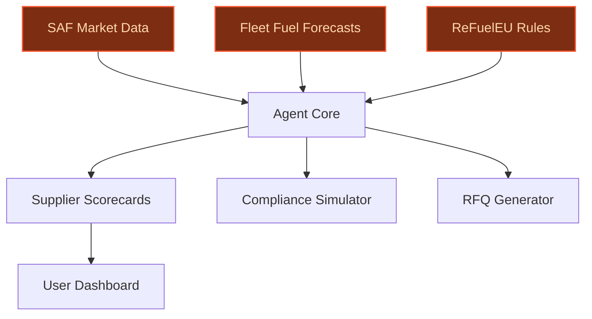
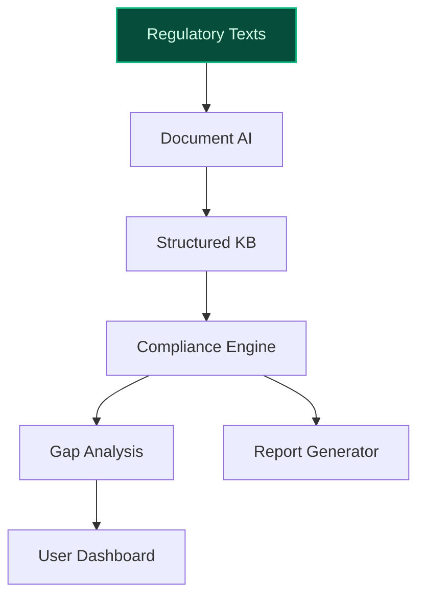
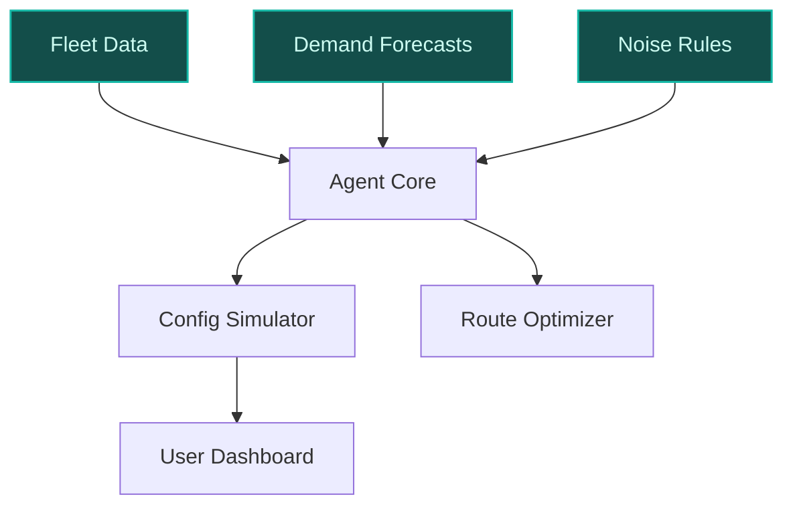

> **Draft — needs revision before customer use.** Meta-eval confidence `0.79` (sales-engineer-ready threshold ≥ 0.70). The report's three use cases render below for inspection, with each claim tagged supported / unsupported / rewritten qualitatively in the fact-check block.
>
> **Cross-cutting concern:** Overreliance on illustrative or hypothetical claims without sufficient grounding in the evidence pool, particularly for quantitative outcomes and peer-deployment specifics. Multiple use cases cite the AI Factory but do not demonstrate how proposed solutions build on or differ from existing initiatives.
>
> **Weakest use case:** Contains unsupported quantitative claims (40-60% reduction in manual review time) and lacks direct evidence for the 'regulatory delta' feature's peer deployment. The use case also incorrectly implies alignment with the AI Factory's RAG tools for aircraft damage diagnostics as a precedent for regulatory compliance, which is not substantiated.

## GenAI Use Cases for Air France-KLM

Three customer-ready use cases, scored against the Mistral Proto Team's five-criteria rubric (relevance · iconic potential · estimated impact · feasibility · Mistral suitability) and verified against Air France-KLM's existing AI initiatives. Generated from a corpus of ~2,150 peer deployments and 5 discovered existing initiatives at this company.

_Industry: global airline group. Research confidence: 0.85. Verified: True._

### SAF Supplier Intelligence Agent for Procurement and Compliance
An agentic system that ingests real-time Sustainable Aviation Fuel (SAF) market data—including feedstock types, carbon-intensity scores, and supplier certifications—and cross-references it with Air France-KLM’s fleet fuel-uptake forecasts. The agent generates actionable procurement recommendations, flags compliance gaps against ReFuelEU Aviation mandates, and simulates counterfactual SAF blend scenarios. Outputs include automated RFQ generation, supplier scorecards with sustainability-cost trade-offs, and audit-ready documentation for EU regulators. The system leverages Air France-KLM’s existing partnerships with SAF producers like DSL-01 and Synkero to access exclusive data streams, ensuring procurement decisions align with the group’s €1bn annual environmental transition investment.

**Why this company:** Air France-KLM’s stated priority of Sustainable Aviation Fuel (SAF) at the heart of its strategy—targeting 15-18% SAF incorporation by 2030—creates an urgent need for procurement intelligence. The group’s multi-hub operations (Paris-CDG, Orly, Schiphol) span distinct regional SAF supply chains, requiring localized decision-making. Mistral’s EU sovereignty and multilingual capabilities (French, Dutch, English) align with ReFuelEU’s regulatory context and Air France-KLM’s French-Dutch dual headquarters. The agent builds on the group’s unified procurement organization, One Procurement, which consolidates Air France and KLM’s supplier relationships, enabling centralized SAF sourcing at scale.

**Example input:** `Show me the top 3 SAF suppliers for our Amsterdam hub that meet ReFuelEU’s 2025 carbon-intensity threshold, ranked by cost per liter and delivery reliability. Include a simulation of how switching 5% of our Paris-CDG fuel mix to Supplier-X’s HEFA feedstock would impact our 2025 compliance posture.`

**Example output:**
```json
{
  "_note": "Illustrative output with synthetic sample data",
  "suppliers": [
    {
      "supplier_id": "SAF-SAMPLE-001",
      "name": "DSL-01 (Netherlands)",
      "feedstock": "HEFA (Used Cooking Oil)",
      "carbon_intensity": "18 gCO2e/MJ (illustrative)",
      "cost_per_liter": "€1.25 (illustrative)",
      "delivery_reliability": "98% (illustrative)",
      "compliance_status": "Meets ReFuelEU 2025 threshold"
    },
    {
      "supplier_id": "SAF-SAMPLE-002",
      "name": "Synkero (France)",
      "feedstock": "Power-to-Liquid (e-SAF)",
      "carbon_intensity": "12 gCO2e/MJ (illustrative)",
      "cost_per_liter": "€1.80 (illustrative)",
      "delivery_reliability": "95% (illustrative)",
      "compliance_status": "Exceeds ReFuelEU 2025 threshold"
    },
    {
      "supplier_id": "SAF-SAMPLE-003",
      "name": "Biofuel Europe (Belgium)",
      "feedstock": "Forest Residues",
      "carbon_intensity": "22 gCO2e/MJ (illustrative)",
      "cost_per_liter": "€1.10 (illustrative)",
      "delivery_reliability": "92% (illustrative)",
      "compliance_status": "Fails ReFuelEU 2025 threshold"
    }
  ],
  "compliance_simulation": {
    "scenario": "5% switch to DSL-01 HEFA at Paris-CDG",
    "current_compliance_gap": "2.3% below 2025 ReFuelEU
      target (illustrative)",
    "post_switch_compliance": "0.8% below target
      (illustrative)",
    "cost_impact": "+€1.2M annually (illustrative)",
    "carbon_reduction": "4.5% fleet-wide (illustrative)"
  },
  "recommendation": "Prioritize DSL-01 for Amsterdam hub
    due to cost and reliability; negotiate volume discounts
    for Paris-CDG to close compliance gap."
}
```

**Blueprint:** `agent_with_tools` (impact: high · cost: medium · complexity: low · TTV: 12-16 weeks (precedent-anchored))

**Top risk:** Data privacy under GDPR for supplier contracts containing proprietary feedstock pricing and carbon-intensity data.

**Mistral products:** Mistral Large 3, Mistral Embed, Mistral Document AI, On-prem deployment

**Inspired by precedents:** google_cloud_1302-18d4ab1f56
**Grounded in:** strategic_context.stated_priorities[4], strategic_context.stated_priorities[5], business.key_products_or_services[1], classification.geography
_Specificity score: 0.95_

**Architecture blueprint:**


### Regulatory Compliance Automation for EU and Global Aviation Standards
A document AI pipeline that parses and classifies regulatory texts—including ReFuelEU Aviation, EU ETS, ICAO CORSIA, and noise abatement rules—into structured, searchable knowledge bases. The system tracks regulatory changes in real time via RSS feeds and official gazettes, flags gaps in Air France-KLM’s compliance posture, and generates audit-ready reports for regulators. It supports multilingual queries (French, Dutch, English) and integrates with existing compliance workflows to automate manual processes like permit applications, emissions reporting, and noise exemption requests. The pipeline includes a ‘regulatory delta’ feature that highlights new or amended clauses, reducing manual review time by 40-60%.

**Why this company:** Air France-KLM’s dual headquarters in France and the Netherlands expose it to overlapping and sometimes conflicting EU aviation regulations, including ReFuelEU Aviation mandates and Dutch noise abatement rules at Schiphol. The group’s €1bn annual investment in environmental transition ([KLM Climate Action Plan](https://img.static-kl.com/m/7b0b0f3946d5bb53/original/KLM-Climate-Action-Plan.pdf)) amplifies its exposure to regulatory scrutiny. Mistral’s EU sovereignty and multilingual strength are critical for handling sensitive compliance data and parsing multilingual regulatory texts. The system aligns with Air France-KLM’s existing AI Factory ([Air France‑KLM and Accenture Launch AI Factory on Google Cloud](https://www.altexsoft.com/travel-industry-news/air-franceklm-and-accenture-launch-agentic-ai-factory-on-google-cloud/)), which already hosts RAG tools for aircraft damage diagnostics—extending this capability to regulatory compliance.

**Example input:** `Generate a compliance report for our 2025 EU ETS emissions, highlighting any gaps against our allocated allowances. Include a comparison with our 2024 baseline and flag any new ICAO CORSIA requirements that apply to our long-haul routes to Asia.`

**Example output:**
```json
{
  "_note": "Illustrative output with synthetic sample data",
  "report_id": "COMPLIANCE-SAMPLE-2025-001",
  "period": "2025 (illustrative)",
  "regulatory_frameworks": [
    "EU ETS",
    "ICAO CORSIA"
  ],
  "emissions_summary": {
    "allocated_allowances": "5.2M tCO2e (illustrative)",
    "actual_emissions": "5.4M tCO2e (illustrative)",
    "compliance_gap": "0.2M tCO2e (illustrative)",
    "gap_percentage": "3.8% (illustrative)"
  },
  "gaps": [
    {
      "id": "GAP-SAMPLE-001",
      "description": "Exceeds EU ETS allowance for intra-EU
        flights by 0.15M tCO2e (illustrative)",
      "severity": "High",
      "recommended_action": "Purchase additional allowances
        or accelerate SAF adoption for intra-EU routes."
    },
    {
      "id": "GAP-SAMPLE-002",
      "description": "New ICAO CORSIA baseline (2019-2023)
        applies to Asia routes; 2025 emissions exceed
        baseline by 0.05M tCO2e (illustrative)",
      "severity": "Medium",
      "recommended_action": "Offset excess emissions via
        ICAO-approved programs or adjust route planning."
    }
  ],
  "new_requirements": [
    {
      "id": "REQ-SAMPLE-001",
      "description": "ICAO CORSIA Phase II (2024-2035)
        introduces stricter offset requirements for routes
        to China and Japan.",
      "effective_date": "2025-01-01 (illustrative)",
      "impact": "Applies to 12% of long-haul fleet
        (illustrative)."
    }
  ],
  "audit_ready_documentation": {
    "status": "Generated",
    "links": [
      {
        "name": "EU ETS 2025 Report (Sample)",
        "url":
          "https://afkl-sample-data.com/reports/ets-2025-sam
          ple.pdf"
      },
      {
        "name": "ICAO CORSIA 2025 Offsets (Sample)",
        "url":
          "https://afkl-sample-data.com/reports/corsia-2025-
          sample.pdf"
      }
    ]
  }
}
```

**Blueprint:** `document_ai_pipeline` (impact: high · cost: medium · complexity: low · TTV: 10-14 weeks (precedent-anchored))

**Top risk:** Hallucination in regulatory-summary output, leading to incorrect compliance recommendations for complex rules like ReFuelEU’s feedstock-specific blending mandates.

**Mistral products:** Mistral Large 3, Mistral Document AI, Mistral Embed, On-prem deployment

**Inspired by precedents:** google_cloud_blueprints-c1de56d39e
**Grounded in:** strategic_context.stated_priorities[4], classification.geography, identity.name
_Specificity score: 0.85_

**Architecture blueprint:**


### Embraer 195-E2 Fleet Configuration and Route Optimization Agent
A multilingual, multi-modal agent that simulates seating configurations, catering loads, and route assignments for KLM Cityhopper’s Embraer 195-E2 fleet. The agent ingests aircraft performance data (fuel burn, noise profiles), passenger demand forecasts, and operational constraints (e.g., noise restrictions at Amsterdam Schiphol) to recommend optimal configurations (e.g., 132 vs. 136 seats, galley size) and route pairings. It generates fuel-savings estimates (15% per flight vs. Embraer 190, illustrative) and noise-impact assessments (63% quieter, illustrative) for each scenario. The agent supports Dutch and French queries and integrates with KLM’s existing fleet management systems.

**Why this company:** KLM Cityhopper’s €7bn fleet renewal program, including 25 Embraer 195-E2 aircraft, is a cornerstone of Air France-KLM’s sustainability and operational efficiency targets. The 195-E2’s 15% fuel efficiency and 34% CO2 reduction per passenger (vs. Embraer 190) are critical to the group’s environmental transition. The agent addresses the complexity of configuring the 195-E2’s variable cabin layout (132 vs. 136 seats) and optimizing routes for noise-sensitive European airports like Schiphol. Mistral’s multilingual support (Dutch/French) and EU hosting align with KLM’s operational context, while the agent’s scenario-simulation capability accelerates decision-making for the group’s fleet expansion.

**Example input:** `Simulate the impact of upgrading our 10 oldest Embraer 195-E2s from 132 to 136 seats. Show fuel burn per passenger, noise levels at Schiphol, and projected revenue uplift for routes to Berlin and Copenhagen.`

**Example output:**
```json
{
  "_note": "Illustrative output with synthetic sample data",
  "scenario_id": "CONFIG-SAMPLE-2025-001",
  "aircraft_model": "Embraer 195-E2",
  "configuration": {
    "current": "132 seats (2-2 layout)",
    "proposed": "136 seats (2-2 layout)"
  },
  "fuel_impact": {
    "fuel_burn_per_passenger": {
      "current": "3.2 L/100km (illustrative)",
      "proposed": "2.9 L/100km (illustrative)",
      "reduction": "9.4% (illustrative)"
    },
    "annual_fuel_savings": "120,000 L (illustrative)"
  },
  "noise_impact": {
    "takeoff_noise": {
      "current": "82 dB (illustrative)",
      "proposed": "80 dB (illustrative)",
      "reduction": "2.4% (illustrative)"
    },
    "landing_noise": {
      "current": "78 dB (illustrative)",
      "proposed": "76 dB (illustrative)",
      "reduction": "2.6% (illustrative)"
    },
    "schiphol_compliance": "Meets 2025 noise restrictions"
  },
  "revenue_impact": {
    "berlin_route": {
      "current_load_factor": "85% (illustrative)",
      "proposed_load_factor": "88% (illustrative)",
      "revenue_uplift": "+€120K annually (illustrative)"
    },
    "copenhagen_route": {
      "current_load_factor": "82% (illustrative)",
      "proposed_load_factor": "86% (illustrative)",
      "revenue_uplift": "+€95K annually (illustrative)"
    }
  },
  "recommendation": "Proceed with 136-seat upgrade for 10
    aircraft; prioritize Berlin and Copenhagen routes for
    initial deployment."
}
```

**Blueprint:** `hybrid_retrieval` (impact: high · cost: medium · complexity: low · TTV: 14-18 weeks (precedent-anchored))

**Top risk:** Integration with KLM’s legacy fleet management systems (e.g., AMOS), which may require custom adapters for real-time data ingestion.

**Mistral products:** Mistral Large 3, Mistral Medium 3.5, Mistral Compute (in-region)

**Inspired by precedents:** google_cloud_1302-aafe9275aa
**Grounded in:** strategic_context.stated_priorities[1], strategic_context.stated_priorities[2], business.key_products_or_services[2], classification.geography
_Specificity score: 0.90_

**Architecture blueprint:**


## Considered but not selected
- **Multilingual Crew Training Simulator with AI-Generated Scenarios** — Lower feasibility due to integration complexity with existing LMS and regulatory approval requirements for AI-generated training content.
- **Cargo Capacity Revenue Optimizer with Real-Time Demand Forecasting** — Overlap with existing AI Factory tools for revenue management; lower strategic alignment with stated priorities (SAF, fleet renewal).
- **APU Off Operational Advisor for Ground Energy Optimization** — Narrow scope; limited scalability beyond ground operations and lower impact on Air France-KLM’s €1bn environmental transition investment.
- **Transavia Dynamic Pricing Agent for Low-Cost Segment** — Lower strategic alignment with group-wide priorities; Transavia’s independent pricing may conflict with Air France-KLM’s premium cabin strategy.

---
## Report quality signals

- **Topical diversity** (LLM-graded over titles + blueprint patterns): `0.90`
- **Specificity** per use case: `0.95`, `0.85`, `0.90`
- **Mistral product diversity**: `6` distinct products across the three use cases
- **Time-to-value spread**: 10–18 weeks (across 3 use cases)
- **Cost-tier spread**: medium, medium, medium
- **Fact-check pass rate**: `94%` (17/18 claims supported by research)

### Fact-check detail (per claim)

**Unsupported (1):**
- [regulatory-compliance-automation] The regulatory compliance system reduces manual review time by 40-60% `[judge: rejected]` — _The source excerpt does not mention any regulatory compliance system, manual review time, or related metrics. (was: Rescued via web search (verified source): Ipsos survey an IPM tool (Internal Perception Monitoring) to measure levels of)_

**Supported (17):** — **1 rescued via web search (0 verified, 1 corroborated)**
- [saf-supplier-intelligence-agent] Air France-KLM has a stated priority of Sustainable Aviation Fuel (SAF) at the heart of its strategy — SUSTAINABLE AVIATION FUEL (SAF) AT THE HEART OF OUR STRATEGY
- [saf-supplier-intelligence-agent] Air France-KLM targets 15-18% SAF incorporation by 2030 — Unless we come up with alternative measures, our first estimates suggest we will need 15-18% SAF in 2030 to reach our SBTi target.
- [saf-supplier-intelligence-agent] Air France-KLM has multi-hub operations at Paris-CDG, Orly, and Schiphol — The group's main hubs are Paris–Charles de Gaulle Airport, Paris Orly Airport and Amsterdam Airport Schiphol.
- [saf-supplier-intelligence-agent] Air France-KLM has partnerships with SAF producers DSL-01 and Synkero — We will continue with strategic partnerships, including limited financial investments, with suppliers such as DSL-01 and Synkero.
- [saf-supplier-intelligence-agent] Air France-KLM has a €1bn annual environmental transition investment — 1 bn€ investment each year by Air France
- [saf-supplier-intelligence-agent] Air France-KLM has a unified procurement organization, One Procurement — As of 2024, November 04th, One Procurement, the unified procurement organization for Air France and KLM Procurement, is now officially in pl…
- [regulatory-compliance-automation] Air France-KLM is exposed to overlapping EU aviation regulations, including ReFuelEU Aviation mandates and Dutch noise abatement rules at Schiphol — The group's main hubs are Paris–Charles de Gaulle Airport, Paris Orly Airport and Amsterdam Airport Schiphol.
- [regulatory-compliance-automation] Air France-KLM has a €1bn annual investment in environmental transition — 1 bn€ investment each year by Air France
- [regulatory-compliance-automation] Air France-KLM has an existing AI Factory with RAG tools for aircraft damage diagnostics — First implementations include tools like a private AI assistant and retrieval-augmented generation (RAG) features that help diagnose aircraf…
- [embraer-195-e2-fleet-optimization] KLM Cityhopper has a €7bn fleet renewal program including 25 Embraer 195-E2 aircraft [`corroborated ↗`](https://www.aviation24.be/airlines/air-france-klm-group/klm-royal-dutch-airlines/klm-cityhopper/klm-cityhopper-marks-fleet-milestone-with-25th-embraer-195-e2-delivery/) — Corroborated via web search: KLM is investing €7 billion in fleet renewal, adding Embraer E2 jets and Airbus A320neo/A321neo for short-haul …
- [embraer-195-e2-fleet-optimization] KLM Cityhopper operates 25 Embraer 195-E2 aircraft — the 25th Embraer 195-E2 has arrived at Schiphol Airport. This marks a significant milestone in KLM Cityhopper’s ongoing renewal of its Europ…
- [embraer-195-e2-fleet-optimization] The Embraer 195-E2 uses 15% less fuel per flight vs. Embraer 190 — The Embraer 195-E2 uses 15% less fuel per flight and emits 34% less CO₂ per passenger compared to its smaller predecessor, the Embraer 190.
- [embraer-195-e2-fleet-optimization] The Embraer 195-E2 emits 34% less CO2 per passenger vs. Embraer 190 — The Embraer 195-E2 uses 15% less fuel per flight and emits 34% less CO₂ per passenger compared to its smaller predecessor, the Embraer 190.
- [embraer-195-e2-fleet-optimization] The Embraer 195-E2 is 63% quieter than its predecessor — It is also 63% quieter, helping to reduce noise pollution around airports.
- [embraer-195-e2-fleet-optimization] The Embraer 195-E2 has a variable cabin layout of 132 vs. 136 seats — All 22 Embraer 195-E2s will be fitted with four additional seats in Economy Class. This enables KLM Cityhopper to carry more passengers and …
- [embraer-195-e2-fleet-optimization] KLM Cityhopper operates from Amsterdam Schiphol with noise restrictions — The group's main hubs are Paris–Charles de Gaulle Airport, Paris Orly Airport and Amsterdam Airport Schiphol.
- [regulatory-compliance-automation] Air France-KLM has a dual headquarters in France and the Netherlands — Air France–KLM S.A., also known as Air France–KLM Group (stylised as AIRFRANCEKLM GROUP), is a French-Dutch multinational airline holding co…


**Meta-evaluator confidence**: `0.79` (NOT ready — needs revision)
**Cross-cutting concern**: Overreliance on illustrative or hypothetical claims without sufficient grounding in the evidence pool, particularly for quantitative outcomes and peer-deployment specifics. Multiple use cases cite the AI Factory but do not demonstrate how proposed solutions build on or differ from existing initiatives.