# Trace

## Execution trace — Air France-KLM

Started: `2026-05-10T22:48:42.478392+00:00`. Total wall time: `183.9s` across `44` recorded actions.

### Per-step time totals

| Step | Calls | Total time | Avg time |
|---|---:|---:|---:|
| `research` | 1 | 7.24s | 7242ms |
| `gap_fill` | 4 | 3.14s | 786ms |
| `retrieve` | 2 | 0.17s | 84ms |
| `generate` | 2 | 26.12s | 13061ms |
| `generate.web_search` | 2 | 4.28s | 2141ms |
| `score` | 2 | 23.34s | 11672ms |
| `verify` | 6 | 18.13s | 3022ms |
| `enrich` | 1 | 75.61s | 75613ms |
| `polish` | 1 | 2.47s | 2470ms |
| `meta_eval` | 1 | 11.50s | 11499ms |
| `web_verify` | 1 | 1.38s | 1377ms |
| `source_judge` | 19 | 13.04s | 686ms |
| `quality_signals` | 2 | 4.55s | 2274ms |

### Chronological event log

- `22:48:43.487` **[research]** `mistral-medium-2604.chat.complete` — 7242ms
   - inputs: synthesize CompanyContext for Air France-KLM | depth=medium
   - outputs: industry='global airline group' verified=True conf=0.75
- `22:48:50.730` **[gap_fill]** `mistral-small-2603.chat.complete` — 1088ms
   - inputs: generate gap queries | fields=['business_model', 'products', 'data_assets', 'priorities']
   - outputs: queries=4
- `22:48:55.848` **[gap_fill]** `mistral-small-2603.chat.complete` — 999ms
   - inputs: layer-2 extract field=priorities
   - outputs: items=10
- `22:48:55.854` **[gap_fill]** `mistral-small-2603.chat.complete` — 469ms
   - inputs: layer-2 extract field=data_assets
   - outputs: items=0
- `22:48:55.858` **[gap_fill]** `mistral-small-2603.chat.complete` — 587ms
   - inputs: layer-2 extract field=products
   - outputs: items=5
- `22:48:56.849` **[retrieve]** `mistral-embed.embeddings.create` — 162ms
   - inputs: company_query | industries='global airline group'
   - outputs: embedded 1024-dim query vector
- `22:48:57.012` **[retrieve]** `precedent_corpus.cosine_topk` — 6ms
   - inputs: k=8 min_depth=0.4 target='Air France-KLM'
   - outputs: retrieved 8 | mmr=True | top_sim=0.770
- `22:48:58.851` **[generate]** `mistral-medium-2604.chat.complete` — 1867ms
   - inputs: iteration=0 tool_calls_used=0/2 tools=on
   - outputs: tool_calls=4 | content_chars=0
- `22:49:00.733` **[generate.web_search]** `tavily.search` — 2218ms
   - inputs: query='Air France-KLM SAF sustainable aviation fuel 2030 targets'
   - outputs: 2 raw results
- `22:49:02.985` **[generate.web_search]** `tavily.search` — 2063ms
   - inputs: query='Air France-KLM fleet renewal Embraer 195-E2 2025 2026'
   - outputs: 2 raw results
- `22:49:05.865` **[generate]** `mistral-medium-2604.chat.complete` — 24256ms
   - inputs: iteration=1 tool_calls_used=2/2 tools=off
   - outputs: tool_calls=0 | content_chars=16046
- `22:49:33.714` **[score]** `mistral-small-2603.chat.complete` — 10664ms
   - inputs: self-consistency pass T=0.2
   - outputs: scored 8 candidates
- `22:49:33.718` **[score]** `mistral-small-2603.chat.complete` — 12680ms
   - inputs: self-consistency pass T=0.4
   - outputs: scored 8 candidates
- `22:49:46.436` **[verify]** `tavily.search` — 3181ms
   - inputs: candidate=saf-supplier-intelligence-agent | query='Air France-KLM SAF Supplier Intelligence Agent for Procureme'
   - outputs: 4 results
- `22:49:46.437` **[verify]** `tavily.search` — 2546ms
   - inputs: candidate=regulatory-compliance-automation | query='Air France-KLM Regulatory Compliance Automation for EU and G'
   - outputs: 4 results
- `22:49:46.437` **[verify]** `tavily.search` — 2868ms
   - inputs: candidate=embraer-195-e2-fleet-optimization | query='Air France-KLM Embraer 195-E2 Fleet Configuration and Route '
   - outputs: 4 results
- `22:49:49.642` **[verify]** `mistral-small-2603.chat.complete` — 1950ms
   - inputs: verdict for regulatory-compliance-automation
   - outputs: verdict='pass'
- `22:49:49.923` **[verify]** `mistral-small-2603.chat.complete` — 2490ms
   - inputs: verdict for saf-supplier-intelligence-agent
   - outputs: verdict='pass'
- `22:50:01.468` **[verify]** `mistral-small-2603.chat.complete` — 5095ms
   - inputs: verdict for embraer-195-e2-fleet-optimization
   - outputs: verdict='pass'
- `22:50:06.566` **[enrich]** `mistral-large-2512.chat.complete` — 75613ms
   - inputs: tier=standard parallel=False ids=['saf-supplier-intelligence-agent', 'regulatory-compliance-automation', 'embraer-195-e2-fleet-optimization']
   - outputs: enriched 3 use cases
- `22:51:22.206` **[polish]** `mistral-small-2603.chat.complete` — 2470ms
   - inputs: use_case=regulatory-compliance-automation unanchored=True opaque_ev=False
   - outputs: polished 5 fields
- `22:51:24.678` **[meta_eval]** `mistral-medium-2604.chat.complete` — 11499ms
   - inputs: reviewing 3 use cases
   - outputs: review + claims
- `22:51:36.200` **[web_verify]** `tavily.search.rescue_unsupported_claims` — 1377ms
   - inputs: company='Air France-KLM' unsupported=2 budget=12
   - outputs: rescued: verified=1 corroborated=1 of 2 attempted
- `22:51:37.581` **[source_judge]** `mistral-small-2603.judge_claim_sources` — 1800ms
   - inputs: pairs=18
   - outputs: judged 18 pairs
- `22:51:37.581` **[source_judge]** `mistral-small-2603.chat.complete` — 556ms
   - inputs: claim='Air France-KLM has a stated priority of Sustainable Aviation'
   - outputs: verdict=supported
- `22:51:37.585` **[source_judge]** `mistral-small-2603.chat.complete` — 691ms
   - inputs: claim='Air France-KLM targets 15-18% SAF incorporation by 2030'
   - outputs: verdict=supported
- `22:51:37.589` **[source_judge]** `mistral-small-2603.chat.complete` — 671ms
   - inputs: claim='Air France-KLM has multi-hub operations at Paris-CDG, Orly, '
   - outputs: verdict=supported
- `22:51:37.593` **[source_judge]** `mistral-small-2603.chat.complete` — 662ms
   - inputs: claim='Air France-KLM has partnerships with SAF producers DSL-01 an'
   - outputs: verdict=supported
- `22:51:37.597` **[source_judge]** `mistral-small-2603.chat.complete` — 713ms
   - inputs: claim='Air France-KLM has a €1bn annual environmental transition in'
   - outputs: verdict=supported
- `22:51:37.602` **[source_judge]** `mistral-small-2603.chat.complete` — 658ms
   - inputs: claim='Air France-KLM has a unified procurement organization, One P'
   - outputs: verdict=supported
- `22:51:37.606` **[source_judge]** `mistral-small-2603.chat.complete` — 677ms
   - inputs: claim='Air France-KLM is exposed to overlapping EU aviation regulat'
   - outputs: verdict=supported
- `22:51:37.609` **[source_judge]** `mistral-small-2603.chat.complete` — 661ms
   - inputs: claim='Air France-KLM has a €1bn annual investment in environmental'
   - outputs: verdict=supported
- `22:51:38.137` **[source_judge]** `mistral-small-2603.chat.complete` — 584ms
   - inputs: claim='Air France-KLM has an existing AI Factory with RAG tools for'
   - outputs: verdict=supported
- `22:51:38.255` **[source_judge]** `mistral-small-2603.chat.complete` — 564ms
   - inputs: claim='The regulatory compliance system reduces manual review time '
   - outputs: verdict=unsupported
- `22:51:38.262` **[source_judge]** `mistral-small-2603.chat.complete` — 567ms
   - inputs: claim='KLM Cityhopper has a €7bn fleet renewal program including 25'
   - outputs: verdict=supported
- `22:51:38.266` **[source_judge]** `mistral-small-2603.chat.complete` — 571ms
   - inputs: claim='KLM Cityhopper operates 25 Embraer 195-E2 aircraft'
   - outputs: verdict=supported
- `22:51:38.270` **[source_judge]** `mistral-small-2603.chat.complete` — 686ms
   - inputs: claim='The Embraer 195-E2 uses 15% less fuel per flight vs. Embraer'
   - outputs: verdict=supported
- `22:51:38.277` **[source_judge]** `mistral-small-2603.chat.complete` — 681ms
   - inputs: claim='The Embraer 195-E2 emits 34% less CO2 per passenger vs. Embr'
   - outputs: verdict=supported
- `22:51:38.284` **[source_judge]** `mistral-small-2603.chat.complete` — 548ms
   - inputs: claim='The Embraer 195-E2 is 63% quieter than its predecessor'
   - outputs: verdict=supported
- `22:51:38.310` **[source_judge]** `mistral-small-2603.chat.complete` — 648ms
   - inputs: claim='The Embraer 195-E2 has a variable cabin layout of 132 vs. 13'
   - outputs: verdict=supported
- `22:51:38.721` **[source_judge]** `mistral-small-2603.chat.complete` — 541ms
   - inputs: claim='KLM Cityhopper operates from Amsterdam Schiphol with noise r'
   - outputs: verdict=supported
- `22:51:38.819` **[source_judge]** `mistral-small-2603.chat.complete` — 561ms
   - inputs: claim='Air France-KLM has a dual headquarters in France and the Net'
   - outputs: verdict=supported
- `22:51:41.805` **[quality_signals]** `mistral-small-2603.chat.complete` — 3018ms
   - inputs: specificity grade (3 use cases)
   - outputs: scored 3 use cases
- `22:51:44.823` **[quality_signals]** `mistral-small-2603.chat.complete` — 1531ms
   - inputs: diversity grade
   - outputs: diversity=0.9

## Mermaid sequence

```mermaid
sequenceDiagram
    autonumber
    participant pipeline as pipeline
    participant mistral_medium_2604 as mistral-medium-2604
    participant mistral_small_2603 as mistral-small-2603
    participant mistral_embed as mistral-embed
    participant precedent_corpus as precedent_corpus
    participant tavily as tavily
    participant mistral_large_2512 as mistral-large-2512
    participant tavily_search as tavily.search
    pipeline->>mistral_medium_2604: research: chat.complete (7242ms)
    mistral_medium_2604-->>pipeline: industry='global airline group' verified=True conf=0.75
    pipeline->>mistral_small_2603: gap_fill: chat.complete (1088ms)
    mistral_small_2603-->>pipeline: queries=4
    pipeline->>mistral_small_2603: gap_fill: chat.complete (999ms)
    mistral_small_2603-->>pipeline: items=10
    pipeline->>mistral_small_2603: gap_fill: chat.complete (469ms)
    mistral_small_2603-->>pipeline: items=0
    pipeline->>mistral_small_2603: gap_fill: chat.complete (587ms)
    mistral_small_2603-->>pipeline: items=5
    pipeline->>mistral_embed: retrieve: embeddings.create (162ms)
    mistral_embed-->>pipeline: embedded 1024-dim query vector
    pipeline->>precedent_corpus: retrieve: cosine_topk (6ms)
    precedent_corpus-->>pipeline: retrieved 8 | mmr=True | top_sim=0.770
    pipeline->>mistral_medium_2604: generate: chat.complete (1867ms)
    mistral_medium_2604-->>pipeline: tool_calls=4 | content_chars=0
    pipeline->>tavily: generate.web_search: search (2218ms)
    tavily-->>pipeline: 2 raw results
    pipeline->>tavily: generate.web_search: search (2063ms)
    tavily-->>pipeline: 2 raw results
    pipeline->>mistral_medium_2604: generate: chat.complete (24256ms)
    mistral_medium_2604-->>pipeline: tool_calls=0 | content_chars=16046
    pipeline->>mistral_small_2603: score: chat.complete (10664ms)
    mistral_small_2603-->>pipeline: scored 8 candidates
    pipeline->>mistral_small_2603: score: chat.complete (12680ms)
    mistral_small_2603-->>pipeline: scored 8 candidates
    pipeline->>tavily: verify: search (3181ms)
    tavily-->>pipeline: 4 results
    pipeline->>tavily: verify: search (2546ms)
    tavily-->>pipeline: 4 results
    pipeline->>tavily: verify: search (2868ms)
    tavily-->>pipeline: 4 results
    pipeline->>mistral_small_2603: verify: chat.complete (1950ms)
    mistral_small_2603-->>pipeline: verdict='pass'
    pipeline->>mistral_small_2603: verify: chat.complete (2490ms)
    mistral_small_2603-->>pipeline: verdict='pass'
    pipeline->>mistral_small_2603: verify: chat.complete (5095ms)
    mistral_small_2603-->>pipeline: verdict='pass'
    pipeline->>mistral_large_2512: enrich: chat.complete (75613ms)
    mistral_large_2512-->>pipeline: enriched 3 use cases
    pipeline->>mistral_small_2603: polish: chat.complete (2470ms)
    mistral_small_2603-->>pipeline: polished 5 fields
    pipeline->>mistral_medium_2604: meta_eval: chat.complete (11499ms)
    mistral_medium_2604-->>pipeline: review + claims
    pipeline->>tavily_search: web_verify: rescue_unsupported_claims (1377ms)
    tavily_search-->>pipeline: rescued: verified=1 corroborated=1 of 2 attempted
    pipeline->>mistral_small_2603: source_judge: judge_claim_sources (1800ms)
    mistral_small_2603-->>pipeline: judged 18 pairs
    pipeline->>mistral_small_2603: source_judge: chat.complete (556ms)
    mistral_small_2603-->>pipeline: verdict=supported
    pipeline->>mistral_small_2603: source_judge: chat.complete (691ms)
    mistral_small_2603-->>pipeline: verdict=supported
    pipeline->>mistral_small_2603: source_judge: chat.complete (671ms)
    mistral_small_2603-->>pipeline: verdict=supported
    pipeline->>mistral_small_2603: source_judge: chat.complete (662ms)
    mistral_small_2603-->>pipeline: verdict=supported
    pipeline->>mistral_small_2603: source_judge: chat.complete (713ms)
    mistral_small_2603-->>pipeline: verdict=supported
    pipeline->>mistral_small_2603: source_judge: chat.complete (658ms)
    mistral_small_2603-->>pipeline: verdict=supported
    pipeline->>mistral_small_2603: source_judge: chat.complete (677ms)
    mistral_small_2603-->>pipeline: verdict=supported
    pipeline->>mistral_small_2603: source_judge: chat.complete (661ms)
    mistral_small_2603-->>pipeline: verdict=supported
    pipeline->>mistral_small_2603: source_judge: chat.complete (584ms)
    mistral_small_2603-->>pipeline: verdict=supported
    pipeline->>mistral_small_2603: source_judge: chat.complete (564ms)
    mistral_small_2603-->>pipeline: verdict=unsupported
    pipeline->>mistral_small_2603: source_judge: chat.complete (567ms)
    mistral_small_2603-->>pipeline: verdict=supported
    pipeline->>mistral_small_2603: source_judge: chat.complete (571ms)
    mistral_small_2603-->>pipeline: verdict=supported
    pipeline->>mistral_small_2603: source_judge: chat.complete (686ms)
    mistral_small_2603-->>pipeline: verdict=supported
    pipeline->>mistral_small_2603: source_judge: chat.complete (681ms)
    mistral_small_2603-->>pipeline: verdict=supported
    pipeline->>mistral_small_2603: source_judge: chat.complete (548ms)
    mistral_small_2603-->>pipeline: verdict=supported
    pipeline->>mistral_small_2603: source_judge: chat.complete (648ms)
    mistral_small_2603-->>pipeline: verdict=supported
    pipeline->>mistral_small_2603: source_judge: chat.complete (541ms)
    mistral_small_2603-->>pipeline: verdict=supported
    pipeline->>mistral_small_2603: source_judge: chat.complete (561ms)
    mistral_small_2603-->>pipeline: verdict=supported
    pipeline->>mistral_small_2603: quality_signals: chat.complete (3018ms)
    mistral_small_2603-->>pipeline: scored 3 use cases
    pipeline->>mistral_small_2603: quality_signals: chat.complete (1531ms)
    mistral_small_2603-->>pipeline: diversity=0.9
```

