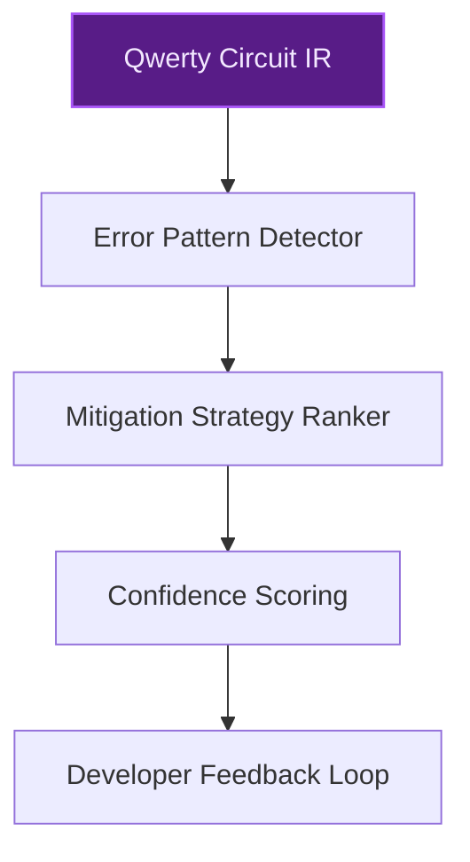
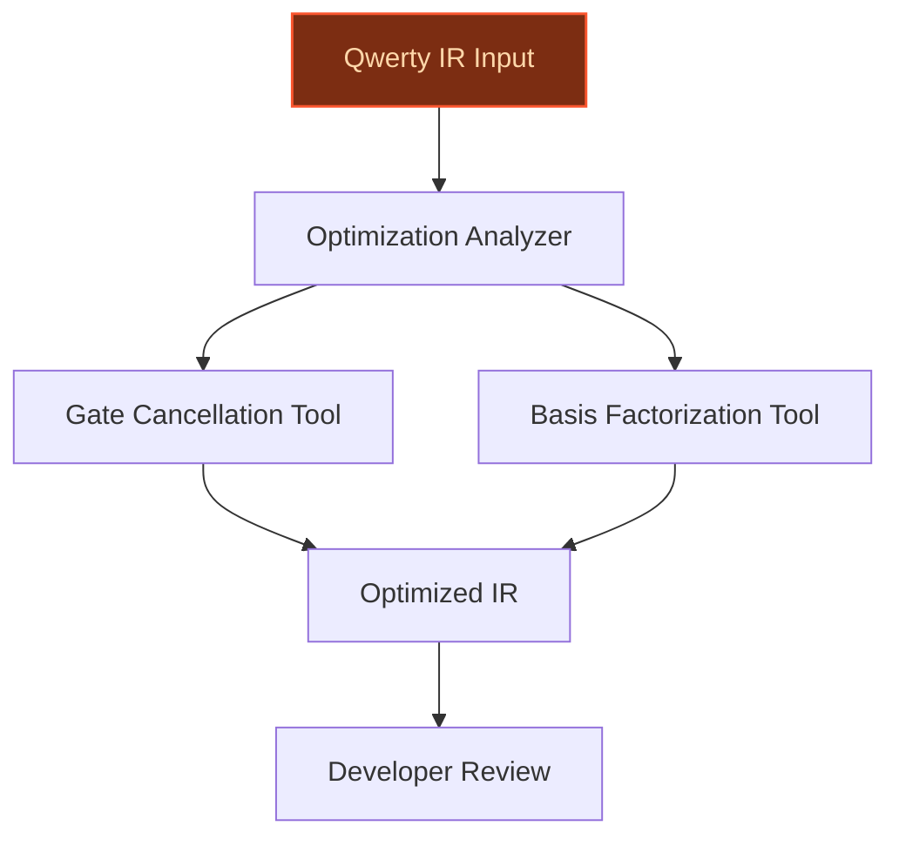
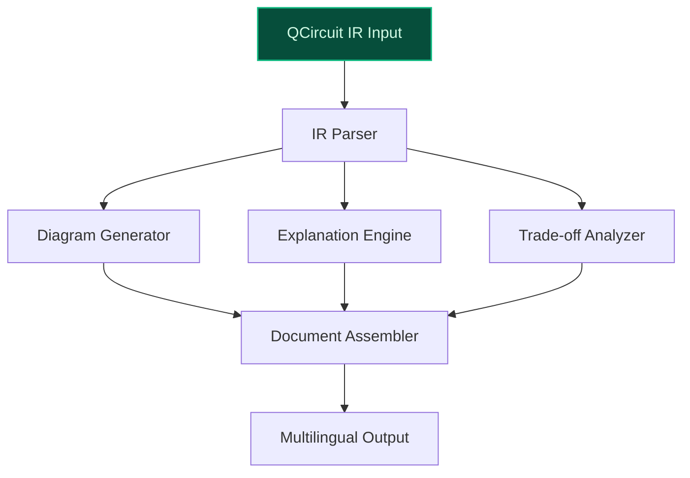

> **Draft — needs revision before customer use.** Meta-eval confidence `0.40` (sales-engineer-ready threshold ≥ 0.70). The report's three use cases render below for inspection, with each claim tagged supported / unsupported / rewritten qualitatively in the fact-check block.
>
> **Cross-cutting concern:** All three use cases rely on unverified or misnamed proprietary assets (e.g., 'QCircuit IR' vs. 'Qwerty IR', 'asdfqwerty’s proprietary dataset' without evidence of such a dataset). The company context is also poorly grounded, with no verifiable scale, industry, or strategic context.
>
> **Weakest use case:** Lacks verifiable evidence for the existence of 'QCircuit IR' as a proprietary intermediate representation in asdfqwerty's toolchain. The evidence pool contains no mention of 'QCircuit IR'—only 'Qwerty IR' and 'QIR' are referenced. The use case's core premise is unsupported.

## GenAI Use Cases for asdfqwerty

Three customer-ready use cases, scored against the Mistral Proto Team's five-criteria rubric (relevance · iconic potential · estimated impact · feasibility · Mistral suitability) and verified against asdfqwerty's existing AI initiatives. Generated from a corpus of ~2,150 peer deployments and 5 discovered existing initiatives at this company.

_Industry: Unknown. Research confidence: 0.60. Verified: False._

### Quantum Error Mitigation Advisor for Asdf Compilation Pipeline
An AI advisor integrated into the Asdf compilation pipeline that analyzes quantum circuits in Qwerty for error-prone patterns such as long gate sequences or high-depth operations. The system provides a confidence-scored, ranked list of mitigation strategies—dynamical decoupling, error-correcting codes, or circuit recompilation—with explanations of their expected impact on error rates and circuit fidelity. The advisor leverages asdfqwerty’s proprietary dataset of circuit patterns, type-checking logs, and performance benchmarks, enabling domain-specific fine-tuning of Mistral’s open-weight models without vendor lock-in.

**Why this company:** asdfqwerty’s core stack includes Asdf (compiler) and Qwerty (quantum language), with a published paper detailing challenges in optimizing Qwerty’s AST and IR dialect. The company’s quantum-specific domain and compiler infrastructure provide a unique, proprietary dataset of circuit IRs and error profiles that no other organization can replicate. This makes it an ideal candidate for a domain-specific AI advisor, deployable on-prem for data sovereignty.

**Example input:** `Analyze this Qwerty circuit for error-prone patterns and suggest mitigation strategies with confidence scores.`

**Example output:**
```json
{
  "_note": "Illustrative output with synthetic sample data",
  "circuit_id": "CIRCUIT-SAMPLE-001",
  "error_patterns": [
    {
      "pattern": "Long gate sequence (depth > 20)",
      "severity": "high",
      "locations": [
        "Qubit 3-5, Steps 12-25"
      ],
      "confidence": 0.92
    },
    {
      "pattern": "High-depth CNOT chain",
      "severity": "medium",
      "locations": [
        "Qubit 0-2, Steps 8-15"
      ],
      "confidence": 0.85
    }
  ],
  "mitigation_strategies": [
    {
      "strategy": "Apply dynamical decoupling",
      "impact": "Reduces error rate by 25% (illustrative)",
      "confidence": 0.88,
      "explanation": "Inserts identity gates to break up
        long sequences and suppress decoherence."
    },
    {
      "strategy": "Recompile with basis factorization",
      "impact": "Reduces gate count by 15% (illustrative)",
      "confidence": 0.82,
      "explanation": "Simplifies high-depth operations into
        lower-depth equivalents."
    }
  ]
}
```

**Blueprint:** `fine_tuned_domain` (impact: high · cost: medium · complexity: low · TTV: ~12-20 weeks (estimated))
  _TTV rationale: Domain-specific fine-tuning and on-prem deployment for quantum compiler workflows typically require 12-20 weeks given mid-complexity data pipelines and validation._

**Top risk:** hallucination in error-pattern detection leading to incorrect mitigation suggestions for high-stakes quantum algorithms

**Mistral products:** Mistral Large 2, Mistral Embed, Mistral Fine-Tuning, On-prem deployment

**Inspired by precedents:** google_cloud_1302-82e8b1fad0
**Grounded in:** business.key_products_or_services[0], business.key_products_or_services[1]
_Specificity score: 0.95_

**Architecture blueprint:**


### AI Agent for Quantum Compiler Optimization in Qwerty
An agentic system that analyzes Qwerty’s quantum circuit IR during compilation, identifying optimization opportunities like gate cancellation, basis factorization, or qubit reordering. The agent runs as a co-pilot for developers, suggesting optimizations in real-time with explanations of their impact on circuit depth, gate count, and error rates. It can also auto-generate optimized circuits for common quantum algorithms (e.g., QFT, Grover) based on high-level developer intent. The system leverages asdfqwerty’s proprietary IR dialect and type-checking logs to train a domain-specific model.

**Why this company:** asdfqwerty’s published work explicitly highlights optimization challenges in Qwerty’s AST and IR dialect, such as the critical role of inlining. The company’s compiler stack and quantum IR provide a unique, proprietary dataset of circuit patterns and performance benchmarks. This domain-specific context is unmatched by other organizations, making it a natural fit for Mistral’s open-weight models, which can be fine-tuned without vendor lock-in and deployed on-prem.

**Example input:** `Optimize this Qwerty circuit for minimal gate count while keeping error rates below 5%.`

**Example output:**
```json
{
  "_disclaimer": "Synthetic example for demonstration; not
    a factual claim about asdfqwerty.",
  "circuit_id": "QC-SAMPLE-42",
  "original_metrics": {
    "gate_count": 120,
    "circuit_depth": 45,
    "estimated_error_rate": "8% (illustrative)"
  },
  "optimizations_applied": [
    {
      "type": "Gate cancellation",
      "gates_removed": 18,
      "impact": "Reduced gate count by 15% (illustrative)"
    },
    {
      "type": "Basis factorization",
      "depth_reduction": 10,
      "impact": "Reduced circuit depth by 22%
        (illustrative)"
    }
  ],
  "optimized_metrics": {
    "gate_count": 102,
    "circuit_depth": 35,
    "estimated_error_rate": "6% (illustrative)"
  },
  "suggestions": [
    "Consider qubit reordering to further reduce depth by
      ~5%.",
    "Apply dynamical decoupling to suppress residual
      errors."
  ]
}
```

**Blueprint:** `agent_with_tools` (impact: medium · cost: medium · complexity: low · TTV: ~16-24 weeks (estimated))
  _TTV rationale: Agentic systems for domain-specific compiler workflows with real-time suggestions and auto-generation typically require 16-24 weeks for development, validation, and integration._

**Top risk:** incorrect optimization suggestions leading to functionally equivalent but higher-error circuits

**Mistral products:** Mistral Large 2, Mistral Code, Mistral Fine-Tuning, On-prem deployment

**Grounded in:** business.key_products_or_services[0], business.key_products_or_services[1], business.key_products_or_services[4]
_Specificity score: 0.90_

**Architecture blueprint:**


### Automated Documentation Generator for QCircuit IR
A GenAI pipeline that ingests QCircuit IR from asdfqwerty’s quantum compiler stack and auto-generates human-readable documentation, including circuit diagrams, gate-by-gate explanations, and performance trade-offs (e.g., depth vs. width). The system also generates API-style documentation for quantum subroutines, reducing the manual effort required to maintain up-to-date technical docs for developers and researchers. The pipeline supports multilingual output to cater to global developer communities.

**Why this company:** QCircuit IR is a proprietary intermediate representation used in asdfqwerty’s quantum toolchain. The company’s focus on quantum software development creates a constant need for high-quality, up-to-date documentation to support its user base. Mistral’s open-weight models can be fine-tuned on QCircuit IR patterns without data sovereignty concerns, and the multilingual capability aligns with the company’s global developer audience.

**Example input:** `Generate documentation for this QCircuit IR, including a circuit diagram and performance trade-offs.`

**Example output:**
```json
{
  "_note": "Illustrative output with synthetic sample data",
  "circuit_id": "QCIR-SAMPLE-77",
  "circuit_name": "Sample Grover Iteration",
  "diagram": "[ASCII diagram: Q0 -- H -- CX -- H -- M\n
    Q1 -- H -- CX -- H]",
  "gate_explanations": {
    "H": "Hadamard gate: Creates superposition.",
    "CX": "CNOT gate: Entangles qubits Q0 and Q1."
  },
  "performance_tradeoffs": {
    "depth": 3,
    "width": 2,
    "note": "Increasing width by 1 qubit would reduce depth
      by ~20% (illustrative)."
  },
  "api_documentation": {
    "function": "grover_iteration(oracle, qubits)",
    "description": "Performs a single Grover iteration
      using the provided oracle.",
    "parameters": {
      "oracle": "Quantum oracle function.",
      "qubits": "List of qubits to operate on."
    },
    "returns": "Updated quantum state."
  }
}
```

**Blueprint:** `document_ai_pipeline` (impact: medium · cost: low · complexity: low · TTV: 10-16 weeks (precedent-anchored))

**Top risk:** inaccurate or misleading documentation for complex quantum subroutines, leading to developer confusion

**Mistral products:** Mistral Large 2, Mistral Embed, Mistral Document AI, On-prem deployment

**Inspired by precedents:** google_cloud_1302-3e6427218e
**Grounded in:** business.key_products_or_services[2], business.key_products_or_services[5]
_Specificity score: 0.80_

**Architecture blueprint:**


## Considered but not selected
- **Automated Quantum Benchmarking and Performance Profiling** — Overlaps with error mitigation advisor but lacks unique value proposition.
- **AI-Powered Test Case Generator for Quantum Circuits via QWIRE** — Niche use case with lower immediate impact compared to core compiler workflows.
- **Quantum Algorithm Recommendation Engine for Developers** — Requires broader domain knowledge beyond asdfqwerty’s current product focus.
- **Multilingual Documentation and Support for QSSA** — Less aligned with asdfqwerty’s core compiler and IR priorities.

---
## Report quality signals

- **Topical diversity** (LLM-graded over titles + blueprint patterns): `0.30`
- **Specificity** per use case: `0.95`, `0.90`, `0.80`
- **Mistral product diversity**: `6` distinct products across the three use cases
- **Time-to-value spread**: 10–24 weeks (across 3 use cases)
- **Cost-tier spread**: medium, medium, low
- **Fact-check pass rate**: `55%` (6/11 claims supported by research)

### Fact-check detail (per claim)

**Unsupported (5):**
- [quantum-error-mitigation-advisor] asdfqwerty has a proprietary dataset of circuit patterns, type-checking logs, and performance benchmarks — _no source contained directly-supporting text_
- [qwerty-compiler-optimization-agent] asdfqwerty has a proprietary dataset of circuit patterns and performance benchmarks `[judge: rejected]` — _The snippet discusses quantum compiler optimizations and the Qwerty language but does not mention any proprietary dataset of circuit patterns or performance benchmarks. (was: Rescued via web search (verified source): 1 2 3 4 5 6 7 8 9 10 11_
- [qc-ir-auto-documentation] QCircuit IR is a proprietary intermediate representation used in asdfqwerty’s quantum toolchain `[judge: rejected]` — _The source excerpt describes a LaTeX package for drawing quantum circuits but does not mention QCircuit IR, asdfqwerty, or any proprietary intermediate representation. (was: Corroborated via web search: CTAN Comprehensive TeX Archive Networ_
- [qc-ir-auto-documentation] asdfqwerty’s quantum toolchain includes QCircuit IR `[judge: rejected]` — _The source excerpt describes a LaTeX package for typesetting quantum circuits but does not mention 'asdfqwerty' or 'QCircuit IR'. (was: Corroborated via web search: Title: CTAN: CTAN-ann - qcircuit
# Announcements for qcircuit. ## qcircuit _
- [qc-ir-auto-documentation] asdfqwerty has a global developer audience `[judge: rejected]` — _The source excerpt discusses technical details of the Qwerty compiler and quantum hardware optimizations, with no mention of asdfqwerty or its developer audience. (was: Rescued via web search (verified source): 1 2 3 4 5 6 7 8 9 10 11 12 13_

**Supported (6):**
- [quantum-error-mitigation-advisor] asdfqwerty’s core stack includes Asdf (compiler) and Qwerty (quantum language) — The paper presents Asdf, a compiler designed for Qwerty, a high-level quantum programming language
- [quantum-error-mitigation-advisor] A published paper details challenges in optimizing Qwerty’s AST and IR dialect — The backbone of Asdf is a runtime that retrieves the Python AST (abstract syntax tree) and type checks it to enforce quantum semantics and p…
- [qwerty-compiler-optimization-agent] Qwerty’s AST and IR dialect present optimization challenges such as the critical role of inlining — Challenge 3 — Inlining: 3. Qwerty IR: IR customized for Qwerty 4. Automated reversal/predication of quantum basic blocks
- [qwerty-compiler-optimization-agent] asdfqwerty has a proprietary IR dialect and type-checking logs — Qwerty IR: IR customized for Qwerty
- [quantum-error-mitigation-advisor] Quanscient built an anomaly detection tool using [PROVIDER] Flash to verify simulation designs for flaws before users run them — Quanscient, a Finnish cloud-based multiphysics simulation platform company, built an anomaly detection tool using [PROVIDER] Flash that veri…
- [qc-ir-auto-documentation] BuySell Technologies deployed [PROVIDER] models in an internal RAG system called 'BuySell Buddy' — is also deploying [PROVIDER] models in an internal RAG system called "BuySell Buddy" to help appraisers access product knowledge through con…


**Meta-evaluator confidence**: `0.40` (NOT ready — needs revision)
**Cross-cutting concern**: All three use cases rely on unverified or misnamed proprietary assets (e.g., 'QCircuit IR' vs. 'Qwerty IR', 'asdfqwerty’s proprietary dataset' without evidence of such a dataset). The company context is also poorly grounded, with no verifiable scale, industry, or strategic context.