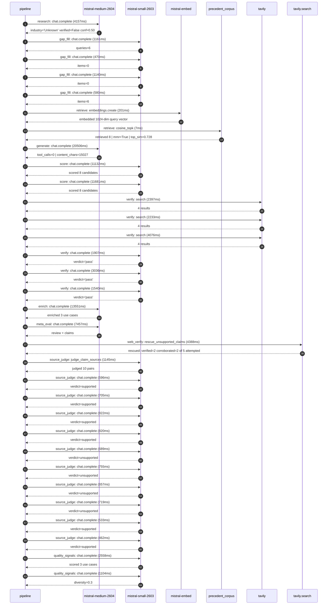

# Trace

## Execution trace — asdfqwerty

Started: `2026-05-10T23:03:15.736375+00:00`. Total wall time: `105.5s` across `32` recorded actions.

### Per-step time totals

| Step | Calls | Total time | Avg time |
|---|---:|---:|---:|
| `research` | 1 | 4.16s | 4157ms |
| `gap_fill` | 4 | 3.35s | 838ms |
| `retrieve` | 2 | 0.21s | 104ms |
| `generate` | 1 | 20.51s | 20506ms |
| `score` | 2 | 22.81s | 11407ms |
| `verify` | 6 | 15.19s | 2531ms |
| `enrich` | 1 | 13.55s | 13551ms |
| `meta_eval` | 1 | 7.46s | 7457ms |
| `web_verify` | 1 | 4.39s | 4388ms |
| `source_judge` | 11 | 7.90s | 718ms |
| `quality_signals` | 2 | 3.66s | 1831ms |

### Chronological event log

- `23:03:28.591` **[research]** `mistral-medium-2604.chat.complete` — 4157ms
   - inputs: synthesize CompanyContext for asdfqwerty | depth=medium
   - outputs: industry='Unknown' verified=False conf=0.50
- `23:03:32.751` **[gap_fill]** `mistral-small-2603.chat.complete` — 1161ms
   - inputs: generate gap queries | fields=['industry', 'geography', 'business_model', 'products', 'data_assets', 'priorities']
   - outputs: queries=6
- `23:03:43.786` **[gap_fill]** `mistral-small-2603.chat.complete` — 470ms
   - inputs: layer-2 extract field=priorities
   - outputs: items=0
- `23:03:43.793` **[gap_fill]** `mistral-small-2603.chat.complete` — 1140ms
   - inputs: layer-2 extract field=data_assets
   - outputs: items=0
- `23:03:43.798` **[gap_fill]** `mistral-small-2603.chat.complete` — 580ms
   - inputs: layer-2 extract field=products
   - outputs: items=6
- `23:03:44.937` **[retrieve]** `mistral-embed.embeddings.create` — 201ms
   - inputs: company_query | industries='Unknown'
   - outputs: embedded 1024-dim query vector
- `23:03:45.138` **[retrieve]** `precedent_corpus.cosine_topk` — 7ms
   - inputs: k=8 min_depth=0.4 target='asdfqwerty'
   - outputs: retrieved 8 | mmr=True | top_sim=0.728
- `23:03:46.940` **[generate]** `mistral-medium-2604.chat.complete` — 20506ms
   - inputs: iteration=0 tool_calls_used=0/0 tools=off
   - outputs: tool_calls=0 | content_chars=15027
- `23:04:07.736` **[score]** `mistral-small-2603.chat.complete` — 11132ms
   - inputs: self-consistency pass T=0.2
   - outputs: scored 8 candidates
- `23:04:07.741` **[score]** `mistral-small-2603.chat.complete` — 11681ms
   - inputs: self-consistency pass T=0.4
   - outputs: scored 8 candidates
- `23:04:19.462` **[verify]** `tavily.search` — 2397ms
   - inputs: candidate=quantum-error-mitigation-advisor | query='asdfqwerty Quantum Error Mitigation Advisor for Asdf Compila'
   - outputs: 4 results
- `23:04:19.462` **[verify]** `tavily.search` — 2233ms
   - inputs: candidate=qwerty-compiler-optimization-agent | query='asdfqwerty AI Agent for Quantum Compiler Optimization in Qwe'
   - outputs: 4 results
- `23:04:19.462` **[verify]** `tavily.search` — 4076ms
   - inputs: candidate=qc-ir-auto-documentation | query='asdfqwerty Automated Documentation Generator for QCircuit IR'
   - outputs: 4 results
- `23:04:22.579` **[verify]** `mistral-small-2603.chat.complete` — 1907ms
   - inputs: verdict for quantum-error-mitigation-advisor
   - outputs: verdict='pass'
- `23:04:24.769` **[verify]** `mistral-small-2603.chat.complete` — 3036ms
   - inputs: verdict for qwerty-compiler-optimization-agent
   - outputs: verdict='pass'
- `23:04:25.813` **[verify]** `mistral-small-2603.chat.complete` — 1540ms
   - inputs: verdict for qc-ir-auto-documentation
   - outputs: verdict='pass'
- `23:04:27.808` **[enrich]** `mistral-medium-2604.chat.complete` — 13551ms
   - inputs: tier=fast parallel=False ids=['quantum-error-mitigation-advisor', 'qwerty-compiler-optimization-agent', 'qc-ir-auto-documentation']
   - outputs: enriched 3 use cases
- `23:04:41.385` **[meta_eval]** `mistral-medium-2604.chat.complete` — 7457ms
   - inputs: reviewing 3 use cases
   - outputs: review + claims
- `23:04:48.863` **[web_verify]** `tavily.search.rescue_unsupported_claims` — 4388ms
   - inputs: company='asdfqwerty' unsupported=5 budget=12
   - outputs: rescued: verified=2 corroborated=2 of 5 attempted
- `23:04:53.253` **[source_judge]** `mistral-small-2603.judge_claim_sources` — 1145ms
   - inputs: pairs=10
   - outputs: judged 10 pairs
- `23:04:53.253` **[source_judge]** `mistral-small-2603.chat.complete` — 596ms
   - inputs: claim='asdfqwerty’s core stack includes Asdf (compiler) and Qwerty '
   - outputs: verdict=supported
- `23:04:53.258` **[source_judge]** `mistral-small-2603.chat.complete` — 705ms
   - inputs: claim='A published paper details challenges in optimizing Qwerty’s '
   - outputs: verdict=supported
- `23:04:53.269` **[source_judge]** `mistral-small-2603.chat.complete` — 822ms
   - inputs: claim='Qwerty’s AST and IR dialect present optimization challenges '
   - outputs: verdict=supported
- `23:04:53.272` **[source_judge]** `mistral-small-2603.chat.complete` — 820ms
   - inputs: claim='asdfqwerty has a proprietary IR dialect and type-checking lo'
   - outputs: verdict=supported
- `23:04:53.275` **[source_judge]** `mistral-small-2603.chat.complete` — 689ms
   - inputs: claim='asdfqwerty has a proprietary dataset of circuit patterns and'
   - outputs: verdict=unsupported
- `23:04:53.277` **[source_judge]** `mistral-small-2603.chat.complete` — 755ms
   - inputs: claim='QCircuit IR is a proprietary intermediate representation use'
   - outputs: verdict=unsupported
- `23:04:53.279` **[source_judge]** `mistral-small-2603.chat.complete` — 657ms
   - inputs: claim='asdfqwerty’s quantum toolchain includes QCircuit IR'
   - outputs: verdict=unsupported
- `23:04:53.283` **[source_judge]** `mistral-small-2603.chat.complete` — 719ms
   - inputs: claim='asdfqwerty has a global developer audience'
   - outputs: verdict=unsupported
- `23:04:53.850` **[source_judge]** `mistral-small-2603.chat.complete` — 533ms
   - inputs: claim='Quanscient built an anomaly detection tool using [PROVIDER] '
   - outputs: verdict=supported
- `23:04:53.936` **[source_judge]** `mistral-small-2603.chat.complete` — 462ms
   - inputs: claim='BuySell Technologies deployed [PROVIDER] models in an intern'
   - outputs: verdict=supported
- `23:04:57.540` **[quality_signals]** `mistral-small-2603.chat.complete` — 2558ms
   - inputs: specificity grade (3 use cases)
   - outputs: scored 3 use cases
- `23:05:00.097` **[quality_signals]** `mistral-small-2603.chat.complete` — 1104ms
   - inputs: diversity grade
   - outputs: diversity=0.3

## Mermaid sequence

