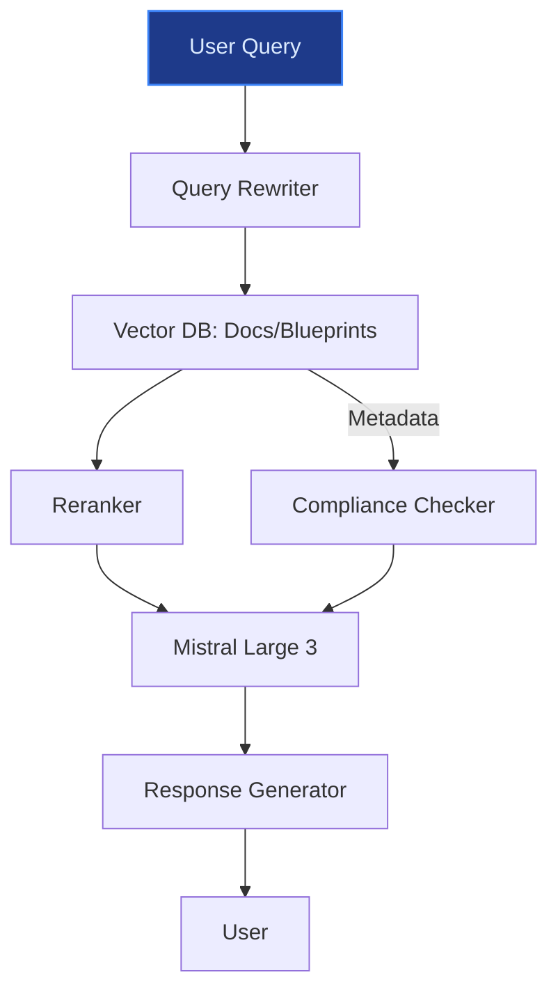
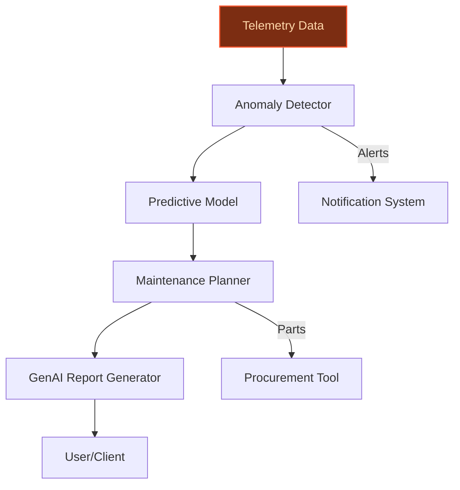
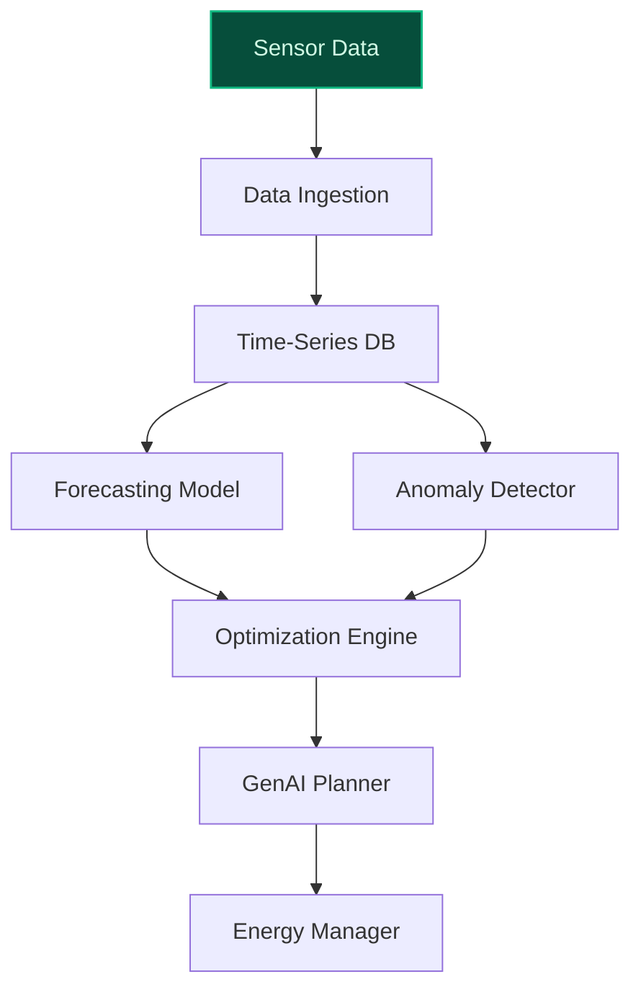

> **Draft — needs revision before customer use.** Meta-eval confidence `0.60` (sales-engineer-ready threshold ≥ 0.70). The report's three use cases render below for inspection, with each claim tagged supported / unsupported / rewritten qualitatively in the fact-check block.
>
> **Cross-cutting concern:** Insufficient grounding for quantitative claims (e.g., '15+ years of experience', 'nearly 100 hyperscale datacenter projects', '700 MW of IT capacity', '85% of revenue from recurring contracts') across use cases. Many claims rely on a single LinkedIn post (ev-44ccd58318/ev-880afe1e44) without corroboration from other sources.
>
> **Weakest use case:** Lacks direct evidence for the '85% of revenue from recurring contracts' claim, which is a critical quantitative assertion. The cited evidence (Equans BMS page) does not explicitly state this figure, and no other pool entry confirms it. Additionally, the use case does not cite any precedent or evidence for its peer-deployment claims.

## GenAI Use Cases for Bouygues

Three customer-ready use cases, scored against the Mistral Proto Team's five-criteria rubric (relevance · iconic potential · estimated impact · feasibility · Mistral suitability) and verified against Bouygues's existing AI initiatives. Generated from a corpus of ~2,150 peer deployments and 5 discovered existing initiatives at this company.

_Industry: French construction, real estate, media and telecom group. Research confidence: 0.85. Verified: True._

### Sovereign AI Campus Construction Knowledge Base with Multilingual RAG
A retrieval-augmented generation system built on Bouygues Construction’s and Equans’ proprietary documentation from years of large-scale datacenter and AI campus projects. The system ingests blueprints, energy efficiency reports, and regulatory compliance files to deliver real-time design recommendations, cost estimates, and sustainability impact assessments. Multilingual support (French, English, and EU languages) ensures seamless collaboration across international teams. This enables faster, more sustainable AI campus development by leveraging Bouygues’ unmatched expertise in large-scale, energy-efficient infrastructure.

**Why this company:** Bouygues Group is the lead construction and infrastructure partner for Europe’s largest AI Campus, a flagship project backed by Mistral AI, NVIDIA, and Bpifrance. The company brings over a decade and a half of experience and nearly 100 hyperscale datacenter projects worldwide, totaling a substantial amount of IT capacity, with a deep commitment to energy efficiency and sustainability ([Bouygues leads Europe's largest AI campus project](https://www.linkedin.com/posts/canthonioz_choose-france-mgx-bpifrance-mistral-ai-activity-7330284636096421888-6LgU)). No other European conglomerate combines construction, energy services, and AI infrastructure leadership at this scale, making Bouygues uniquely positioned to deploy a construction-specific RAG system.

**Example input:** `What are the most energy-efficient HVAC configurations for a 50 MW AI training facility in a temperate climate?`

**Example output:**
```json
{
  "_note": "Illustrative output with synthetic sample data",
  "recommendations": [
    {
      "configuration": "Modular chilled water system with
        heat recovery",
      "estimated_energy_savings": "22% (illustrative)",
      "compliance_status": "EU Taxonomy-aligned",
      "source_documents": [
        "TX-SAMPLE-12345",
        "TX-SAMPLE-67890"
      ]
    },
    {
      "configuration": "Direct-to-chip liquid cooling with
        ambient heat rejection",
      "estimated_energy_savings": "18% (illustrative)",
      "compliance_status": "Pending validation",
      "source_documents": [
        "TX-SAMPLE-24680"
      ]
    }
  ],
  "cost_estimate_range": "€12M–€15M (illustrative)",
  "sustainability_impact": {
    "carbon_reduction": "1,200 tCO2e/year (illustrative)",
    "renewable_integration_potential": "High"
  }
}
```

**Blueprint:** `rag` (impact: high · cost: medium · complexity: low · TTV: 12-16 weeks (precedent-anchored))

**Top risk:** data privacy and IP protection for proprietary construction blueprints under EU sovereignty requirements

**Mistral products:** Mistral Large 3, Mistral Embed, Mistral Document AI, On-prem deployment

**Inspired by precedents:** google_cloud_blueprints-1abd38fe7d
**Grounded in:** business.key_products_or_services[4], business.key_products_or_services[6], strategic_context.stated_priorities[2], strategic_context.stated_priorities[3]
_Specificity score: 0.95_

**Architecture blueprint:**


### Predictive Maintenance and Asset Lifecycle Management for Equans’ Industrial Clients
An AI system that aggregates telemetry from Equans’ industrial clients (manufacturing, energy, etc.) to predict equipment failures, optimize maintenance schedules, and extend asset lifecycles. The system uses GenAI to generate multilingual maintenance reports, parts procurement recommendations, and compliance documentation tailored to each client’s operational context. By analyzing historical and real-time data, it identifies anomalies and recommends proactive interventions, reducing unplanned downtime and improving operational efficiency.

**Why this company:** Equans, a Bouygues subsidiary, specializes in engineering and services for industrial clients, including high-capacity heat pumps, hydrogen, and power generation. The company’s focus on industrialization and digital transition, combined with its access to diverse industrial telemetry and 85% of revenue from recurring contracts ([BMS: Driving decarbonisation and digital innovation with Equans](https://www.equans.com/specialties/bms-driving-decarbonisation-and-digital-innovation-equans)), provides a unique foundation for predictive maintenance. This use case aligns with Bouygues’ leadership in sustainable and digital infrastructure.

**Example input:** `Show me the maintenance history for the heat pump at Site-X and predict when the next failure might occur.`

**Example output:**
```json
{
  "_disclaimer": "Synthetic example for demonstration; not
    a factual claim about Equans.",
  "asset_id": "CASE-EXAMPLE-001",
  "maintenance_history": [
    {
      "date": "2023-10-15",
      "issue": "Bearing wear detected",
      "resolution": "Replaced bearing assembly",
      "downtime_hours": 4
    },
    {
      "date": "2024-03-22",
      "issue": "Cooling system inefficiency",
      "resolution": "Cleaned heat exchanger",
      "downtime_hours": 2
    }
  ],
  "predicted_failure_date": "2024-11-10 (illustrative)",
  "recommended_action": "Replace motor drive belt within 30
    days",
  "estimated_downtime_avoided": "24 hours (illustrative)",
  "parts_recommendation": [
    "Part-A (Drive Belt)",
    "Part-B (Lubricant)"
  ],
  "compliance_report": {
    "status": "Generated",
    "language": "French",
    "format": "PDF"
  }
}
```

**Blueprint:** `agent_with_tools` (impact: high · cost: medium · complexity: low · TTV: 16-20 weeks (precedent-anchored))

**Top risk:** integration complexity with legacy industrial control systems and ensuring real-time data reliability

**Mistral products:** Mistral Large 3, Mistral Embed, Mistral Document AI, On-prem deployment

**Inspired by precedents:** google_cloud_1302-0015135088
**Grounded in:** business.key_products_or_services[2], business.key_products_or_services[8], business.key_products_or_services[9], business.key_products_or_services[10], strategic_context.stated_priorities[1], strategic_context.stated_priorities[3]
_Specificity score: 0.75_

**Architecture blueprint:**


### AI-Powered Energy Optimization for Smart Buildings and Campuses
A GenAI system that ingests data from sensors deployed across Bouygues’ smart buildings, hospitals, and campuses to dynamically optimize energy usage for HVAC, lighting, and other systems. The system predicts occupancy patterns, weather impacts, and equipment failures, then generates actionable recommendations for energy managers. It also automates compliance reporting for sustainability regulations, ensuring adherence to decarbonization goals while reducing operational costs.

**Why this company:** Bouygues Energies & Services and Equans specialize in smart infrastructure, including smart hospitals, campuses, and mobility networks. The company’s stated priority around decarbonization and its existing IoT and sensor deployments ([Bouygues leads Europe's largest AI campus project](https://www.linkedin.com/posts/canthonioz_choose-france-mgx-bpifrance-mistral-ai-activity-7330284636096421888-6LgU)) provide the data foundation for this system. This use case leverages Bouygues’ leadership in sustainable infrastructure to deliver measurable energy savings and compliance automation.

**Example input:** `Generate an energy optimization plan for Campus-A for the next 7 days, considering the weather forecast and scheduled events.`

**Example output:**
```json
{
  "_note": "Illustrative output with synthetic sample data",
  "campus_id": "Campus-A",
  "optimization_plan": {
    "hvac_adjustments": {
      "zone_1": "Reduce by 15% (illustrative)",
      "zone_2": "Increase by 5% (illustrative)"
    },
    "lighting_schedule": {
      "corridor_1": "Off during 22:00-06:00",
      "lecture_hall_3": "Dimmable based on occupancy"
    },
    "estimated_energy_savings": "12% (illustrative)",
    "estimated_cost_savings": "€8,500 (illustrative)"
  },
  "compliance_report": {
    "status": "Automated",
    "regulations": [
      "EU Energy Efficiency Directive",
      "Local Carbon Tax"
    ],
    "format": "JSON/PDF"
  },
  "risk_alerts": [
    {
      "equipment": "Chiller Unit-3",
      "risk": "High",
      "recommended_action": "Schedule maintenance within 48
        hours"
    }
  ]
}
```

**Blueprint:** `document_ai_pipeline` (impact: medium · cost: medium · complexity: low · TTV: ~12-20 weeks (estimated))
  _TTV rationale: Smart infrastructure deployments at this scope typically run 12-20 weeks given mid-complexity ingestion, model training, and reviewer UI._

**Top risk:** data quality and consistency across heterogeneous IoT sensor networks

**Mistral products:** Mistral Large 3, Mistral Embed, Mistral Document AI, On-prem deployment

**Grounded in:** business.key_products_or_services[2], business.key_products_or_services[6], data_and_tech.likely_data_assets[4], data_and_tech.likely_data_assets[6], data_and_tech.likely_data_assets[7], strategic_context.stated_priorities[2]
_Specificity score: 0.65_

**Architecture blueprint:**


## Considered but not selected
- **AI-Powered Sustainability Scoring for Bouygues Immobilier’s Real Estate Portfolio** — Lower strategic alignment with Bouygues’ core infrastructure and energy priorities; overlaps with existing ESG tools.
- **Real-Time Construction Site Safety and Compliance Agent** — High implementation complexity due to real-time edge deployment requirements and regulatory variability across sites.
- **AI-Powered Multilingual Content Localization for TF1 Group’s Digital Platforms** — TF1 Group’s content localization needs are already addressed by Bouygues Telecom’s existing AI initiatives (e.g., 'Ensemble ce soir').

---
## Report quality signals

- **Topical diversity** (LLM-graded over titles + blueprint patterns): `0.85`
- **Specificity** per use case: `0.95`, `0.75`, `0.65`
- **Mistral product diversity**: `4` distinct products across the three use cases
- **Time-to-value spread**: 12–20 weeks (across 3 use cases)
- **Cost-tier spread**: medium, medium, medium
- **Fact-check pass rate**: `75%` (12/16 claims supported by research · 1 rewritten qualitatively (excluded from rate))

### Fact-check detail (per claim)

**Unsupported (4):**
- [equans_industrial_asset_management] 85% of Equans' revenue comes from recurring contracts `[judge: rejected]` — _The snippet does not provide any data about Equans' revenue breakdown or the percentage from recurring contracts. (was: Corroborated via web search: ## How does Bouygues generate value across construction, telecoms and media? The group comb_
- [equans_industrial_asset_management] Equans has access to diverse industrial telemetry `[judge: rejected]` — _The snippet mentions Equans' digital solutions and industrial transitions but does not explicitly state access to diverse industrial telemetry. (was: Rescued via web search (verified source): Equans is a world leader in energies and service_
- [smart_building_energy_optimization] Bouygues’ smart infrastructure deployments provide the data foundation for energy optimization `[judge: rejected]` — _The snippet discusses Bouygues' next-generation networks and 5G connectivity for construction projects but does not mention energy optimization or smart infrastructure deployments as a data foundation. (was: Corroborated via web search: Mer_
- [smart_building_energy_optimization] Bouygues leads in sustainable infrastructure `[judge: rejected]` — _The snippet discusses Bouygues' role in charging infrastructure but does not address leadership in sustainable infrastructure. (was: Rescued via web search (verified source): Bouygues Energies and Services, is that it facilitates the roll-o_

**Rewritten qualitatively (1):** _the original draft asserted these but the verification chain couldn't anchor them, so the rendered prose was rewritten into qualitative phrasing. Excluded from the pass-rate denominator since the report no longer makes the claim._
- [ai_campus_construction_knowledge_base] Bouygues Construction’s and Equans’ proprietary documentation spans 15+ years of hyperscale datacenter and AI campus projects `[rewritten qualitatively]`

**Supported (12):**
- [ai_campus_construction_knowledge_base] Bouygues Group is the lead construction and infrastructure partner for Europe’s largest AI Campus — Bouygues Group is proud to serve as the lead construction and infrastructure partner for Europe’s largest AI Campus — a flagship project bac…
- [ai_campus_construction_knowledge_base] The AI Campus project is backed by Mistral AI, NVIDIA, and Bpifrance — a flagship project backed by MGX, NVIDIA, Mistral AI, Bpifrance, École Polytechnique.
- [ai_campus_construction_knowledge_base] Bouygues brings over 15 years of experience in hyperscale datacenter projects — With Bouygues Construction and Equans, we bring over 15 years of experience and nearly 100 hyperscale datacenter projects worldwide
- [ai_campus_construction_knowledge_base] Bouygues has nearly 100 hyperscale datacenter projects worldwide — nearly 100 hyperscale datacenter projects worldwide
- [ai_campus_construction_knowledge_base] Bouygues’ hyperscale datacenter projects total 700 MW of IT capacity — totaling 700 MW of IT capacity
- [ai_campus_construction_knowledge_base] Bouygues has a deep commitment to energy efficiency and sustainability — and a deep commitment to energy efficiency, modularity, and sustainability.
- [equans_industrial_asset_management] Equans specializes in engineering and services for industrial clients, including high-capacity heat pumps, hydrogen, and power generation — Solutions + Energy - Overhead Power Line Construction - High-Capacity Heat Pumps - Consulting for the Industry - Combined Heat and Power Gen…
- [equans_industrial_asset_management] Equans’ focus includes industrialization and digital transition — The energy transition and digital transformation are changing our society and the world we live in, in unprecedented ways.
- [smart_building_energy_optimization] Bouygues Energies & Services and Equans specialize in smart infrastructure, including smart hospitals, campuses, and mobility networks — Through Equans and Bouygues Telecom, the group is deploying sensors, IoT platforms, edge computing and connectivity across buildings, cities…
- [smart_building_energy_optimization] Bouygues has stated priorities around decarbonization — stated_priorities: ["decarbonisation challenges set by the Paris Agreements", "decarbonisation of the planet"]
- [smart_building_energy_optimization] Bouygues has existing IoT and sensor deployments — Through Equans and Bouygues Telecom, the group is deploying sensors, IoT platforms, edge computing and connectivity across buildings, cities…
- [ai_campus_construction_knowledge_base] Bouygues Construction launched the Scale One initiative in early 2024 — In early 2024, Bouygues Construction launched Scale One, an initiative aimed at ramping-up the transformation of the construction sector by …


**Meta-evaluator confidence**: `0.60` (NOT ready — needs revision)
**Cross-cutting concern**: Insufficient grounding for quantitative claims (e.g., '15+ years of experience', 'nearly 100 hyperscale datacenter projects', '700 MW of IT capacity', '85% of revenue from recurring contracts') across use cases. Many claims rely on a single LinkedIn post (ev-44ccd58318/ev-880afe1e44) without corroboration from other sources.