# Trace

## Execution trace — Bouygues

Started: `2026-05-10T22:51:46.360587+00:00`. Total wall time: `115.9s` across `40` recorded actions.

### Per-step time totals

| Step | Calls | Total time | Avg time |
|---|---:|---:|---:|
| `research` | 1 | 6.59s | 6586ms |
| `gap_fill` | 4 | 3.75s | 937ms |
| `retrieve` | 2 | 0.20s | 98ms |
| `generate` | 1 | 20.78s | 20776ms |
| `score` | 2 | 23.02s | 11512ms |
| `verify` | 6 | 16.25s | 2709ms |
| `enrich` | 1 | 16.49s | 16488ms |
| `meta_eval` | 1 | 10.19s | 10193ms |
| `web_verify` | 1 | 6.31s | 6311ms |
| `source_judge` | 18 | 23.81s | 1323ms |
| `final_qualify` | 1 | 1.87s | 1873ms |
| `quality_signals` | 2 | 4.16s | 2079ms |

### Chronological event log

- `22:51:57.831` **[research]** `mistral-medium-2604.chat.complete` — 6586ms
   - inputs: synthesize CompanyContext for Bouygues | depth=medium
   - outputs: industry='French construction, real estate, media and telecom group' verified=True conf=0.75
- `22:52:04.419` **[gap_fill]** `mistral-small-2603.chat.complete` — 973ms
   - inputs: generate gap queries | fields=['business_model', 'products', 'data_assets', 'priorities']
   - outputs: queries=4
- `22:52:13.709` **[gap_fill]** `mistral-small-2603.chat.complete` — 707ms
   - inputs: layer-2 extract field=priorities
   - outputs: items=6
- `22:52:13.714` **[gap_fill]** `mistral-small-2603.chat.complete` — 888ms
   - inputs: layer-2 extract field=data_assets
   - outputs: items=9
- `22:52:13.717` **[gap_fill]** `mistral-small-2603.chat.complete` — 1178ms
   - inputs: layer-2 extract field=products
   - outputs: items=21
- `22:52:14.897` **[retrieve]** `mistral-embed.embeddings.create` — 194ms
   - inputs: company_query | industries='French construction, real estate, media and telecom group'
   - outputs: embedded 1024-dim query vector
- `22:52:15.091` **[retrieve]** `precedent_corpus.cosine_topk` — 3ms
   - inputs: k=8 min_depth=0.4 target='Bouygues'
   - outputs: retrieved 8 | mmr=True | top_sim=0.784
- `22:52:16.899` **[generate]** `mistral-medium-2604.chat.complete` — 20776ms
   - inputs: iteration=0 tool_calls_used=0/0 tools=off
   - outputs: tool_calls=0 | content_chars=15610
- `22:52:37.916` **[score]** `mistral-small-2603.chat.complete` — 11299ms
   - inputs: self-consistency pass T=0.2
   - outputs: scored 8 candidates
- `22:52:37.920` **[score]** `mistral-small-2603.chat.complete` — 11726ms
   - inputs: self-consistency pass T=0.4
   - outputs: scored 8 candidates
- `22:52:49.684` **[verify]** `tavily.search` — 2234ms
   - inputs: candidate=ai_campus_construction_knowledge_base | query='Bouygues Sovereign AI Campus Construction Knowledge Base wit'
   - outputs: 4 results
- `22:52:49.684` **[verify]** `tavily.search` — 2670ms
   - inputs: candidate=equans_industrial_asset_management | query='Bouygues Predictive Maintenance and Asset Lifecycle Manageme'
   - outputs: 4 results
- `22:52:49.684` **[verify]** `tavily.search` — 2911ms
   - inputs: candidate=smart_building_energy_optimization | query='Bouygues AI-Powered Energy Optimization for Smart Buildings '
   - outputs: 4 results
- `22:52:52.571` **[verify]** `mistral-small-2603.chat.complete` — 2951ms
   - inputs: verdict for equans_industrial_asset_management
   - outputs: verdict='pass'
- `22:52:52.894` **[verify]** `mistral-small-2603.chat.complete` — 1455ms
   - inputs: verdict for smart_building_energy_optimization
   - outputs: verdict='pass'
- `22:52:53.076` **[verify]** `mistral-small-2603.chat.complete` — 4030ms
   - inputs: verdict for ai_campus_construction_knowledge_base
   - outputs: verdict='pass'
- `22:52:57.110` **[enrich]** `mistral-medium-2604.chat.complete` — 16488ms
   - inputs: tier=fast parallel=False ids=['ai_campus_construction_knowledge_base', 'equans_industrial_asset_management', 'smart_building_energy_optimization']
   - outputs: enriched 3 use cases
- `22:53:13.624` **[meta_eval]** `mistral-medium-2604.chat.complete` — 10193ms
   - inputs: reviewing 3 use cases
   - outputs: review + claims
- `22:53:23.840` **[web_verify]** `tavily.search.rescue_unsupported_claims` — 6311ms
   - inputs: company='Bouygues' unsupported=5 budget=12
   - outputs: rescued: verified=3 corroborated=2 of 5 attempted
- `22:53:30.153` **[source_judge]** `mistral-small-2603.judge_claim_sources` — 5780ms
   - inputs: pairs=17
   - outputs: judged 17 pairs
- `22:53:30.153` **[source_judge]** `mistral-small-2603.chat.complete` — 700ms
   - inputs: claim='Bouygues Group is the lead construction and infrastructure p'
   - outputs: verdict=supported
- `22:53:30.158` **[source_judge]** `mistral-small-2603.chat.complete` — 755ms
   - inputs: claim='The AI Campus project is backed by Mistral AI, NVIDIA, and B'
   - outputs: verdict=supported
- `22:53:30.162` **[source_judge]** `mistral-small-2603.chat.complete` — 755ms
   - inputs: claim='Bouygues brings over 15 years of experience in hyperscale da'
   - outputs: verdict=supported
- `22:53:30.169` **[source_judge]** `mistral-small-2603.chat.complete` — 773ms
   - inputs: claim='Bouygues has nearly 100 hyperscale datacenter projects world'
   - outputs: verdict=supported
- `22:53:30.172` **[source_judge]** `mistral-small-2603.chat.complete` — 5761ms
   - inputs: claim='Bouygues’ hyperscale datacenter projects total 700 MW of IT '
   - outputs: verdict=supported
- `22:53:30.175` **[source_judge]** `mistral-small-2603.chat.complete` — 669ms
   - inputs: claim='Bouygues has a deep commitment to energy efficiency and sust'
   - outputs: verdict=supported
- `22:53:30.178` **[source_judge]** `mistral-small-2603.chat.complete` — 567ms
   - inputs: claim='Bouygues Construction’s and Equans’ proprietary documentatio'
   - outputs: verdict=unsupported
- `22:53:30.180` **[source_judge]** `mistral-small-2603.chat.complete` — 977ms
   - inputs: claim='Equans specializes in engineering and services for industria'
   - outputs: verdict=supported
- `22:53:30.745` **[source_judge]** `mistral-small-2603.chat.complete` — 635ms
   - inputs: claim='Equans’ focus includes industrialization and digital transit'
   - outputs: verdict=supported
- `22:53:30.844` **[source_judge]** `mistral-small-2603.chat.complete` — 555ms
   - inputs: claim="85% of Equans' revenue comes from recurring contracts"
   - outputs: verdict=unsupported
- `22:53:30.854` **[source_judge]** `mistral-small-2603.chat.complete` — 550ms
   - inputs: claim='Equans has access to diverse industrial telemetry'
   - outputs: verdict=unsupported
- `22:53:30.913` **[source_judge]** `mistral-small-2603.chat.complete` — 603ms
   - inputs: claim='Bouygues Energies & Services and Equans specialize in smart '
   - outputs: verdict=supported
- `22:53:30.917` **[source_judge]** `mistral-small-2603.chat.complete` — 553ms
   - inputs: claim='Bouygues has stated priorities around decarbonization'
   - outputs: verdict=supported
- `22:53:30.942` **[source_judge]** `mistral-small-2603.chat.complete` — 577ms
   - inputs: claim='Bouygues has existing IoT and sensor deployments'
   - outputs: verdict=supported
- `22:53:31.157` **[source_judge]** `mistral-small-2603.chat.complete` — 613ms
   - inputs: claim='Bouygues’ smart infrastructure deployments provide the data '
   - outputs: verdict=unsupported
- `22:53:31.380` **[source_judge]** `mistral-small-2603.chat.complete` — 2468ms
   - inputs: claim='Bouygues leads in sustainable infrastructure'
   - outputs: verdict=unsupported
- `22:53:31.399` **[source_judge]** `mistral-small-2603.chat.complete` — 526ms
   - inputs: claim='Bouygues Construction launched the Scale One initiative in e'
   - outputs: verdict=supported
- `22:53:35.935` **[final_qualify]** `mistral-small-2603.chat.complete` — 1873ms
   - inputs: use_case=ai_campus_construction_knowledge_base unsupported=1
   - outputs: qualified 4 fields
- `22:53:38.122` **[quality_signals]** `mistral-small-2603.chat.complete` — 2587ms
   - inputs: specificity grade (3 use cases)
   - outputs: scored 3 use cases
- `22:53:40.709` **[quality_signals]** `mistral-small-2603.chat.complete` — 1572ms
   - inputs: diversity grade
   - outputs: diversity=0.85

## Mermaid sequence

```mermaid
sequenceDiagram
    autonumber
    participant pipeline as pipeline
    participant mistral_medium_2604 as mistral-medium-2604
    participant mistral_small_2603 as mistral-small-2603
    participant mistral_embed as mistral-embed
    participant precedent_corpus as precedent_corpus
    participant tavily as tavily
    participant tavily_search as tavily.search
    pipeline->>mistral_medium_2604: research: chat.complete (6586ms)
    mistral_medium_2604-->>pipeline: industry='French construction, real estate, media and teleco
    pipeline->>mistral_small_2603: gap_fill: chat.complete (973ms)
    mistral_small_2603-->>pipeline: queries=4
    pipeline->>mistral_small_2603: gap_fill: chat.complete (707ms)
    mistral_small_2603-->>pipeline: items=6
    pipeline->>mistral_small_2603: gap_fill: chat.complete (888ms)
    mistral_small_2603-->>pipeline: items=9
    pipeline->>mistral_small_2603: gap_fill: chat.complete (1178ms)
    mistral_small_2603-->>pipeline: items=21
    pipeline->>mistral_embed: retrieve: embeddings.create (194ms)
    mistral_embed-->>pipeline: embedded 1024-dim query vector
    pipeline->>precedent_corpus: retrieve: cosine_topk (3ms)
    precedent_corpus-->>pipeline: retrieved 8 | mmr=True | top_sim=0.784
    pipeline->>mistral_medium_2604: generate: chat.complete (20776ms)
    mistral_medium_2604-->>pipeline: tool_calls=0 | content_chars=15610
    pipeline->>mistral_small_2603: score: chat.complete (11299ms)
    mistral_small_2603-->>pipeline: scored 8 candidates
    pipeline->>mistral_small_2603: score: chat.complete (11726ms)
    mistral_small_2603-->>pipeline: scored 8 candidates
    pipeline->>tavily: verify: search (2234ms)
    tavily-->>pipeline: 4 results
    pipeline->>tavily: verify: search (2670ms)
    tavily-->>pipeline: 4 results
    pipeline->>tavily: verify: search (2911ms)
    tavily-->>pipeline: 4 results
    pipeline->>mistral_small_2603: verify: chat.complete (2951ms)
    mistral_small_2603-->>pipeline: verdict='pass'
    pipeline->>mistral_small_2603: verify: chat.complete (1455ms)
    mistral_small_2603-->>pipeline: verdict='pass'
    pipeline->>mistral_small_2603: verify: chat.complete (4030ms)
    mistral_small_2603-->>pipeline: verdict='pass'
    pipeline->>mistral_medium_2604: enrich: chat.complete (16488ms)
    mistral_medium_2604-->>pipeline: enriched 3 use cases
    pipeline->>mistral_medium_2604: meta_eval: chat.complete (10193ms)
    mistral_medium_2604-->>pipeline: review + claims
    pipeline->>tavily_search: web_verify: rescue_unsupported_claims (6311ms)
    tavily_search-->>pipeline: rescued: verified=3 corroborated=2 of 5 attempted
    pipeline->>mistral_small_2603: source_judge: judge_claim_sources (5780ms)
    mistral_small_2603-->>pipeline: judged 17 pairs
    pipeline->>mistral_small_2603: source_judge: chat.complete (700ms)
    mistral_small_2603-->>pipeline: verdict=supported
    pipeline->>mistral_small_2603: source_judge: chat.complete (755ms)
    mistral_small_2603-->>pipeline: verdict=supported
    pipeline->>mistral_small_2603: source_judge: chat.complete (755ms)
    mistral_small_2603-->>pipeline: verdict=supported
    pipeline->>mistral_small_2603: source_judge: chat.complete (773ms)
    mistral_small_2603-->>pipeline: verdict=supported
    pipeline->>mistral_small_2603: source_judge: chat.complete (5761ms)
    mistral_small_2603-->>pipeline: verdict=supported
    pipeline->>mistral_small_2603: source_judge: chat.complete (669ms)
    mistral_small_2603-->>pipeline: verdict=supported
    pipeline->>mistral_small_2603: source_judge: chat.complete (567ms)
    mistral_small_2603-->>pipeline: verdict=unsupported
    pipeline->>mistral_small_2603: source_judge: chat.complete (977ms)
    mistral_small_2603-->>pipeline: verdict=supported
    pipeline->>mistral_small_2603: source_judge: chat.complete (635ms)
    mistral_small_2603-->>pipeline: verdict=supported
    pipeline->>mistral_small_2603: source_judge: chat.complete (555ms)
    mistral_small_2603-->>pipeline: verdict=unsupported
    pipeline->>mistral_small_2603: source_judge: chat.complete (550ms)
    mistral_small_2603-->>pipeline: verdict=unsupported
    pipeline->>mistral_small_2603: source_judge: chat.complete (603ms)
    mistral_small_2603-->>pipeline: verdict=supported
    pipeline->>mistral_small_2603: source_judge: chat.complete (553ms)
    mistral_small_2603-->>pipeline: verdict=supported
    pipeline->>mistral_small_2603: source_judge: chat.complete (577ms)
    mistral_small_2603-->>pipeline: verdict=supported
    pipeline->>mistral_small_2603: source_judge: chat.complete (613ms)
    mistral_small_2603-->>pipeline: verdict=unsupported
    pipeline->>mistral_small_2603: source_judge: chat.complete (2468ms)
    mistral_small_2603-->>pipeline: verdict=unsupported
    pipeline->>mistral_small_2603: source_judge: chat.complete (526ms)
    mistral_small_2603-->>pipeline: verdict=supported
    pipeline->>mistral_small_2603: final_qualify: chat.complete (1873ms)
    mistral_small_2603-->>pipeline: qualified 4 fields
    pipeline->>mistral_small_2603: quality_signals: chat.complete (2587ms)
    mistral_small_2603-->>pipeline: scored 3 use cases
    pipeline->>mistral_small_2603: quality_signals: chat.complete (1572ms)
    mistral_small_2603-->>pipeline: diversity=0.85
```

