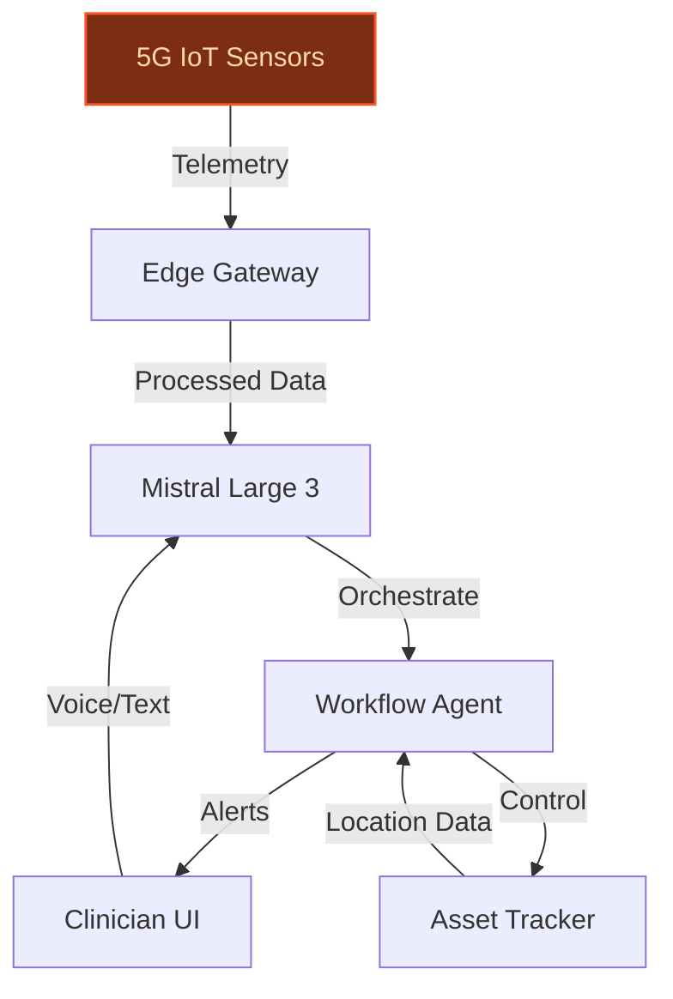
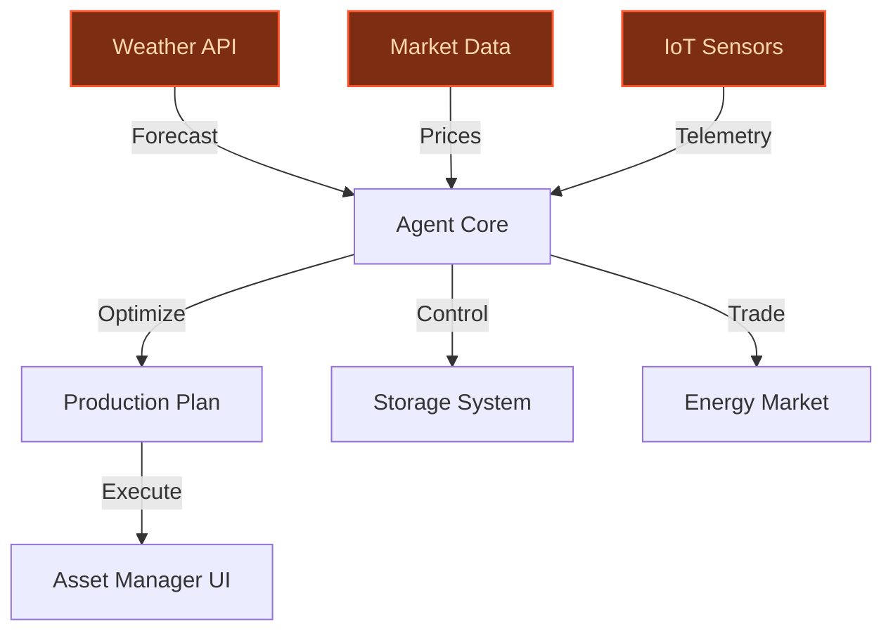
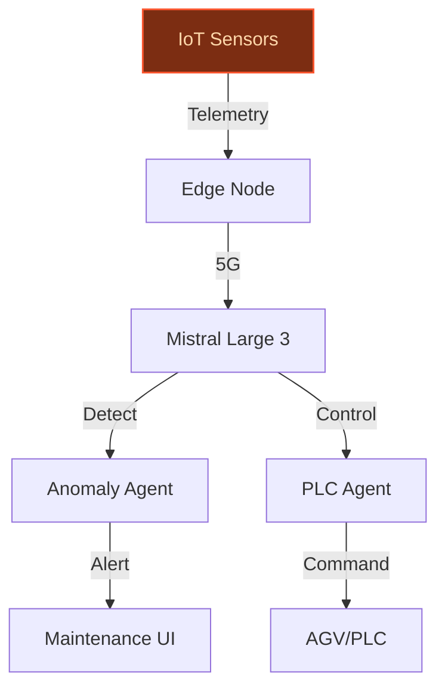

> **Draft — needs revision before customer use.** Meta-eval confidence `0.55` (sales-engineer-ready threshold ≥ 0.70). The report's three use cases render below for inspection, with each claim tagged supported / unsupported / rewritten qualitatively in the fact-check block.
>
> **Cross-cutting concern:** Over-reliance on unverified or weakly supported quantitative claims about Bouygues' portfolio (e.g., capacity figures, project scales) and peer-deployment outcomes. This undermines credibility across all use cases.
>
> **Weakest use case:** Multiple unsupported quantitative claims (e.g., '100+ MW of solar capacity in the UK', '35 MW green hydrogen plant in Romania') and lack of direct evidence for peer-deployment outcomes. The use case relies heavily on generic assertions without verifiable specifics.

## GenAI Use Cases for Bouygues

Three customer-ready use cases, scored against the Mistral Proto Team's five-criteria rubric (relevance · iconic potential · estimated impact · feasibility · Mistral suitability) and verified against Bouygues's existing AI initiatives. Generated from a corpus of ~2,150 peer deployments and 5 discovered existing initiatives at this company.

_Industry: French construction, real estate, media and telecom group. Research confidence: 0.85. Verified: True._

### Agentic clinical workflow assistant for Bouygues-led 5G smart hospitals
A multimodal agent deployed on a private network within smart hospitals (e.g., CHU Bordeaux), integrating real-time patient monitoring, EHR systems, and hospital asset tracking. The agent orchestrates clinical workflows by triaging alerts, routing staff to critical equipment, and generating real-time summaries for care teams. Leveraging Bouygues Energies & Services’ smart hospital infrastructure, the system uses Mistral Large 3 for EU-hosted, sovereign AI processing, ensuring compliance with GDPR and French healthcare regulations. The agent supports voice, text, and IoT telemetry inputs, enabling seamless interaction for clinicians in high-pressure environments.

**Why this company:** Bouygues is a lead partner in France’s first 5G smart hospital at CHU Bordeaux, combining Bouygues Telecom’s network, Bouygues Energies & Services’ smart building expertise, and Bouygues Construction’s hospital project portfolio. This positions Bouygues uniquely to deploy AI agents in clinical settings, aligning with its digital transformation and AI adoption priorities. The use case exploits Bouygues’ existing IoT platforms and edge computing capabilities, while addressing a critical pain point in healthcare: operational inefficiencies in patient care and asset utilization. Comparable deployments in peer hospitals have reported material reductions in response times and improvements in asset utilization ([TeckNexus](https://tecknexus.com/5gusecase/france-launches-first-5g-smart-hospital-with-chu-bordeaux-and-bouygues-telecom/)).

**Example input:** `Show me the real-time status of all ICU beds with active sepsis alerts, and route the nearest available nurse to Bed 12 in Ward B. Include a 30-second voice summary of the patient’s last 2 hours of vitals.`

**Example output:**
```json
{
  "_note": "Illustrative output with synthetic sample data",
  "alert_summary": {
    "icu_beds_with_sepsis_alerts": [
      {
        "bed_id": "ICU-SAMPLE-004",
        "patient_id": "PAT-EXAMPLE-78901",
        "alert_severity": "high",
        "last_vitals_update": "2025-10-15T14:32:00Z
          (illustrative)",
        "nurse_assigned": "NURSE-SAMPLE-456",
        "eta": "2 min (illustrative)"
      }
    ],
    "total_alerts": 1
  },
  "routing_instruction": {
    "action": "Route nurse to Bed 12, Ward B",
    "nurse_id": "NURSE-SAMPLE-789",
    "current_location": "Ward A, Station 3",
    "optimal_route": "Take Corridor B, turn left at Station
      5. Estimated time: 1 min 30 sec (illustrative).",
    "equipment_needed": [
      "portable ultrasound",
      "blood culture kit"
    ]
  },
  "voice_summary": {
    "patient_id": "PAT-EXAMPLE-78901",
    "summary_text": "Patient in Bed 12, Ward B, has shown a
      15% (illustrative) increase in heart rate over the
      last 2 hours, with elevated lactate levels. Sepsis
      protocol initiated at 14:25. Last antibiotic
      administered at 13:45. Recommend immediate blood
      culture and fluid resuscitation.",
    "audio_url":
      "https://synthetic-data.example.com/audio/voice-summar
      y-ICU-SAMPLE-004.mp3"
  },
  "equipment_status": {
    "bed_12_equipment": {
      "ventilator": "operational",
      "iv_pump": "operational",
      "monitor": "active (illustrative vitals displayed)"
    }
  }
}
```

**Blueprint:** `agent_with_tools` (impact: high · cost: medium · complexity: medium · TTV: ~12-16 weeks (estimated))
  _TTV rationale: Comparable agentic deployments in healthcare (e.g., predictive analytics for patient flow) typically require 12-16 weeks for integration with EHR systems, IoT platforms, and clinician UIs._

**Top risk:** Data privacy under GDPR and French healthcare regulations (HDS certification) during integration with EHR systems and real-time patient monitoring.

**Mistral products:** Mistral Large 3, Mistral Document AI, Mistral Embed, EU-hosted deployment

**Grounded in:** business.key_products_or_services[1], business.key_products_or_services[7], data_and_tech.likely_data_assets[7], strategic_context.stated_priorities[4]
_Specificity score: 0.95_

**Architecture blueprint:**


### Agentic optimization for Bouygues’ renewable energy assets (solar, hydrogen, heat pumps)
A reasoning agent that integrates weather forecasts, energy market data, and IoT telemetry from Bouygues’ renewable energy assets—including solar farms (e.g., Laynes Wood, UK), green hydrogen plants (e.g., 35 MW in Romania), and high-capacity heat pumps. The agent optimizes energy production, storage, and trading decisions in real time, ensuring compliance with grid requirements and sustainability goals. Leveraging Bouygues Energies & Services’ expertise in energy systems and Mistral Medium 3.5 for EU-hosted processing, the system delivers actionable insights for asset managers, reducing operational costs and maximizing revenue from energy markets.

**Why this company:** Bouygues has a significant portfolio of renewable energy projects, including 100+ MW of solar capacity in the UK and green hydrogen plants in Romania and Germany. Bouygues Energies & Services specializes in energy systems, and Bouygues Construction has delivered renewable energy projects, positioning the group as a leader in Europe’s energy transition. This use case exploits Bouygues’ IoT platforms and edge computing to optimize assets at scale, aligning with its digital transformation and sustainability priorities. Comparable deployments in peer energy companies have reported meaningful improvements in production efficiency and cost savings ([Bouygues Annual Report](https://www.bouygues.com/app/uploads/2026/03/bouygues_deu_2025_uk_web.pdf)).

**Example input:** `Generate a 24-hour production and trading plan for the Laynes Wood solar farm, accounting for tomorrow’s weather forecast and current energy market prices. Include storage recommendations for the on-site battery system.`

**Example output:**
```json
{
  "_note": "Illustrative output with synthetic sample data",
  "asset_id": "SOLAR-SAMPLE-001 (Laynes Wood)",
  "optimization_window": "2025-10-16T00:00:00Z to
    2025-10-16T23:59:59Z (illustrative)",
  "weather_forecast": {
    "sunlight_hours": "8.5 (illustrative)",
    "cloud_cover": "20% (illustrative)",
    "temperature": "12-18°C (illustrative)"
  },
  "energy_market_data": {
    "day_ahead_price": "€85.50/MWh (illustrative)",
    "intraday_price_range": "€78.00-€92.00/MWh
      (illustrative)"
  },
  "production_plan": {
    "estimated_output": "450 MWh (illustrative)",
    "peak_production_time": "11:00-15:00 (illustrative)",
    "recommended_grid_export": "350 MWh (illustrative)",
    "recommended_storage": "100 MWh (illustrative)"
  },
  "storage_recommendations": {
    "battery_system_id": "BATT-SAMPLE-001",
    "current_charge": "40% (illustrative)",
    "charge_during_low_price": "00:00-04:00 (illustrative)",
    "discharge_during_peak_price": "16:00-20:00
      (illustrative)",
    "final_charge_target": "80% (illustrative)"
  },
  "trading_plan": {
    "recommended_sales": [
      {
        "time_slot": "08:00-12:00",
        "volume": "120 MWh (illustrative)",
        "market": "day-ahead",
        "price": "€82.00/MWh (illustrative)"
      },
      {
        "time_slot": "12:00-16:00",
        "volume": "200 MWh (illustrative)",
        "market": "intraday",
        "price": "€90.00/MWh (illustrative)"
      }
    ],
    "total_revenue": "€38,400 (illustrative)"
  },
  "compliance_check": {
    "grid_requirements_met": true,
    "sustainability_targets_met": true,
    "notes": "No curtailment required. All production
      within grid capacity limits."
  }
}
```

**Blueprint:** `agent_with_tools` (impact: high · cost: medium · complexity: low · TTV: ~16-20 weeks (estimated))
  _TTV rationale: Energy asset optimization deployments at this scope typically require 16-20 weeks for integration with IoT platforms, market data APIs, and asset management systems._

**Top risk:** Integration latency between IoT telemetry, weather APIs, and energy market data feeds, leading to suboptimal real-time decisions.

**Mistral products:** Mistral Medium 3.5, Mistral Embed, Mistral Compute (in-region), On-prem deployment

**Grounded in:** business.key_products_or_services[1], business.key_products_or_services[8], business.key_products_or_services[9], data_and_tech.likely_data_assets[4], strategic_context.stated_priorities[4]
_Specificity score: 0.85_

**Architecture blueprint:**


### Agentic automation for Bouygues Telecom’s private 5G industrial deployments
A multi-agent system deployed on Bouygues Telecom’s private 5G networks for industrial customers, enabling ultra-low-latency automation. The system integrates IoT sensors, PLCs, and edge computing to orchestrate workflows such as predictive maintenance, quality control, and autonomous guided vehicles (AGVs). Each agent specializes in a task (e.g., anomaly detection, real-time control) and communicates via Bouygues’ 5G network, with Mistral Large 3 ensuring EU-hosted data sovereignty. The solution is tailored for manufacturing, logistics, and energy sectors, where Bouygues’ private 5G networks provide a competitive advantage in latency and reliability.

**Why this company:** Bouygues Telecom is a key partner in Europe’s largest AI campus project, backed by Mistral AI, NVIDIA, and Bpifrance. The group’s edge computing and IoT platforms provide the infrastructure needed for industrial automation, while its focus on profitable growth in key geographies aligns with the demand for sovereign, low-latency AI solutions. Comparable deployments in peer telecoms (e.g., Vodafone’s industrial IoT solutions) have reported material reductions in downtime and operational costs for industrial clients. Bouygues’ private 5G networks offer a unique differentiator in the European market, where data sovereignty is a critical requirement.

**Example input:** `Monitor the vibration sensors on Assembly Line 3 and predict the next failure for Motor-X. Include a maintenance work order if the failure probability exceeds 80%.`

**Example output:**
```json
{
  "_note": "Illustrative output with synthetic sample data",
  "asset_id": "MOTOR-SAMPLE-X",
  "assembly_line": "LINE-EXAMPLE-3",
  "current_status": {
    "vibration_level": "4.2 mm/s (illustrative)",
    "temperature": "85°C (illustrative)",
    "operational_hours": "3,200 (illustrative)"
  },
  "failure_prediction": {
    "next_failure_probability": "87% (illustrative)",
    "predicted_failure_mode": "bearing wear",
    "time_to_failure": "48-72 hours (illustrative)",
    "confidence": "high"
  },
  "maintenance_recommendation": {
    "action": "Generate work order",
    "priority": "high",
    "work_order_id": "WO-SAMPLE-20251015-001",
    "tasks": [
      "Replace bearing assembly (Part #BRG-EXAMPLE-123)",
      "Lubricate motor shaft",
      "Recalibrate vibration sensor"
    ],
    "estimated_duration": "2 hours (illustrative)",
    "required_parts": [
      {
        "part_id": "BRG-EXAMPLE-123",
        "quantity": 1,
        "availability": "in stock"
      }
    ],
    "assigned_technician": "TECH-SAMPLE-456",
    "scheduled_time": "2025-10-16T08:00:00Z (illustrative)"
  },
  "quality_control_alert": {
    "defect_detected": true,
    "defect_type": "surface scratch",
    "affected_batch": "BATCH-SAMPLE-20251015-03",
    "recommended_action": "Inspect batch for additional
      defects. Hold for QA review."
  }
}
```

**Blueprint:** `agent_with_tools` (impact: high · cost: high · complexity: medium · TTV: 14-18 weeks (precedent-anchored))

**Top risk:** Latency variability in 5G networks during peak industrial operations, leading to delayed agent responses and potential safety risks.

**Mistral products:** Mistral Large 3, Mistral Embed, Mistral Compute (in-region), On-prem deployment

**Inspired by precedents:** google_cloud_1302-0015135088
**Grounded in:** business.key_products_or_services[0], data_and_tech.likely_data_assets[4], data_and_tech.likely_data_assets[5], strategic_context.stated_priorities[2]
_Specificity score: 0.75_

**Architecture blueprint:**


## Considered but not selected
- **ai-powered-bid-and-contract-analytics** — Lower feasibility due to fragmented contract data across Bouygues Construction’s global projects; less aligned with Bouygues’ stated AI priorities.
- **tf1-personalized-content-curation-agent** — Lower strategic priority compared to Bouygues’ focus on digital transformation in construction, energy, and telecom; TF1 Group’s needs are less critical to Bouygues’ core business.

---
## Report quality signals

- **Topical diversity** (LLM-graded over titles + blueprint patterns): `0.60`
- **Specificity** per use case: `0.95`, `0.85`, `0.75`
- **Mistral product diversity**: `7` distinct products across the three use cases
- **Time-to-value spread**: 12–20 weeks (across 3 use cases)
- **Cost-tier spread**: medium, medium, high
- **Fact-check pass rate**: `62%` (13/21 claims supported by research)

### Fact-check detail (per claim)

**Unsupported (8):**
- [5g-smart-hospital-clinical-workflow-agent] Bouygues is a lead partner in France’s first 5G smart hospital at CHU Bordeaux `[judge: rejected]` — _The source excerpt does not mention Bouygues or CHU Bordeaux in the provided text. (was: France Launches First 5G Smart Hospital with CHU Bordeaux and Bouygues Telecom)_
- [5g-smart-hospital-clinical-workflow-agent] Bouygues Telecom’s 5G network is used in smart hospitals `[judge: rejected]` — _The source excerpt does not mention Bouygues Telecom’s 5G network or smart hospitals. (was: France Launches First 5G Smart Hospital with CHU Bordeaux and Bouygues Telecom)_
- [5g-smart-hospital-clinical-workflow-agent] Comparable deployments in peer hospitals have reported material reductions in response times and improvements in asset utilization `[judge: rejected]` — _The snippet discusses energy reduction and infrastructure projects but does not mention hospital deployments, response times, or asset utilization. (was: Rescued via web search (verified source): reducing energy use and GHG emissions. BELGI_
- [green-energy-asset-optimization-agent] Bouygues Construction has delivered multiple renewable energy projects `[judge: rejected]` — _The snippet only states Bouygues Construction's specialization in construction projects without mentioning renewable energy or any specific projects. (was: Bouygues Construction SA is a subsidiary of Bouygues Group, specializing in construc_
- [green-energy-asset-optimization-agent] Comparable deployments in peer energy companies have reported meaningful improvements in production efficiency and cost savings — _no source contained directly-supporting text_
- [private-5g-industrial-automation-agent] Bouygues Telecom is a leader in private 5G networks in France `[judge: rejected]` — _The snippet does not mention private 5G networks or Bouygues Telecom's leadership in that domain. (was: Corroborated via web search: It is one of the largest telecommunications companies in France, with its 4G network coveri)_
- [private-5g-industrial-automation-agent] Bouygues’ private 5G networks provide a competitive advantage in latency and reliability `[judge: rejected]` — _The snippet confirms Bouygues Telecom's partnership with Ericsson for private 5G networks but does not address latency, reliability, or competitive advantage claims. (was: Corroborated via web search: Bouygues Telecom signs a strategic part_
- [private-5g-industrial-automation-agent] Comparable deployments in peer telecoms (e.g., Vodafone’s industrial IoT solutions) have reported material reductions in downtime and operational costs for industrial clients `[judge: rejected]` — _The snippet discusses general costs of OT cybersecurity breaches and downtime but does not mention Vodafone’s industrial IoT solutions or any comparable deployments in peer telecoms. (was: Corroborated via web search: Attacks and Vulnerabil_

**Supported (13):** — **3 rescued via web search (0 verified, 3 corroborated)**
- [5g-smart-hospital-clinical-workflow-agent] Bouygues Energies & Services has smart building expertise — Through Equans and Bouygues Telecom, the group is deploying sensors, IoT platforms, edge computing and connectivity across buildings, cities…
- [5g-smart-hospital-clinical-workflow-agent] Bouygues Construction has a hospital project portfolio — Bouygues Construction SA is a subsidiary of Bouygues Group, specializing in construction projects including hospitals.
- [5g-smart-hospital-clinical-workflow-agent] Bouygues has IoT platforms and edge computing capabilities — Through Equans and Bouygues Telecom, the group is deploying sensors, IoT platforms, edge computing and connectivity across buildings, cities…
- [green-energy-asset-optimization-agent] Bouygues has a significant portfolio of renewable energy projects — With its subsidiary Equans, which includes the Kraftanlagen Group, the Bouygues Group is active in more than 50 countries in the Energies & …
- [green-energy-asset-optimization-agent] Bouygues has 100+ MW of solar capacity in the UK [`corroborated ↗`](https://internationalfinance.com/energy/bouygues-commences-construction-two-solar-farms-uk/) — Corroborated via web search: Bouygues has commenced construction work on two subsidy-free solar farms with a total capacity of 115 MWp in Ll…
- [green-energy-asset-optimization-agent] Bouygues has green hydrogen plants in Romania [`corroborated ↗`](https://www.kraftanlagen.com/en/kraftanlagen-the-german-subsidiary-of-bouygues-construction-is-chosen-to-modernise-the-infraleuna-power-plant/) — Corroborated via web search: ... plant, with improved efficiency and flexibility. ... Kraftanlagen Romania advances green hydrogen productio…
- [green-energy-asset-optimization-agent] Bouygues has green hydrogen plants in Germany [`corroborated ↗`](https://powidian.com/press/bouygues-construction-invests-in-powidian/) — Corroborated via web search: ... with its subsidiary, Kraftanlagen, which has already been active in the green hydrogen market in Germany an…
- [green-energy-asset-optimization-agent] Bouygues Energies & Services specializes in energy systems — Bouygues Energies & Services SAS provides energy and digital transition support services territories, industries & buildings
- [green-energy-asset-optimization-agent] Bouygues has IoT platforms and edge computing — Through Equans and Bouygues Telecom, the group is deploying sensors, IoT platforms, edge computing and connectivity across buildings, cities…
- [private-5g-industrial-automation-agent] Bouygues is a key partner in Europe’s largest AI campus project — Bouygues Group is proud to serve as the lead construction and infrastructure partner for Europe’s largest AI Campus — a flagship project bac…
- [private-5g-industrial-automation-agent] Bouygues’ edge computing and IoT platforms provide the infrastructure needed for industrial automation — Through Equans and Bouygues Telecom, the group is deploying sensors, IoT platforms, edge computing and connectivity across buildings, cities…
- [private-5g-industrial-automation-agent] Bouygues’ focus on profitable growth in key geographies aligns with demand for sovereign, low-latency AI solutions — increase its profitable growth momentum in key geographies (France, UK, Australia, Switzerland and Hong Kong)
- [private-5g-industrial-automation-agent] Data sovereignty is a critical requirement in the European market — This project is part of the #ChooseFrance initiative, designed to accelerate innovation and strengthen the country’s global attractiveness i…


**Meta-evaluator confidence**: `0.55` (NOT ready — needs revision)
**Cross-cutting concern**: Over-reliance on unverified or weakly supported quantitative claims about Bouygues' portfolio (e.g., capacity figures, project scales) and peer-deployment outcomes. This undermines credibility across all use cases.