# Trace

## Execution trace — Bouygues

Started: `2026-05-10T22:53:42.286362+00:00`. Total wall time: `187.2s` across `48` recorded actions.

### Per-step time totals

| Step | Calls | Total time | Avg time |
|---|---:|---:|---:|
| `research` | 1 | 7.89s | 7888ms |
| `gap_fill` | 4 | 3.93s | 983ms |
| `retrieve` | 2 | 0.20s | 102ms |
| `generate` | 2 | 45.43s | 22715ms |
| `generate.web_search` | 2 | 5.11s | 2557ms |
| `score` | 2 | 23.38s | 11689ms |
| `verify` | 6 | 20.83s | 3471ms |
| `enrich` | 1 | 65.59s | 65594ms |
| `meta_eval` | 1 | 11.47s | 11470ms |
| `web_verify` | 1 | 5.80s | 5802ms |
| `source_judge` | 21 | 14.74s | 702ms |
| `final_qualify` | 3 | 5.52s | 1841ms |
| `quality_signals` | 2 | 4.41s | 2206ms |

### Chronological event log

- `22:53:43.324` **[research]** `mistral-medium-2604.chat.complete` — 7888ms
   - inputs: synthesize CompanyContext for Bouygues | depth=medium
   - outputs: industry='French construction, real estate, media and telecom group' verified=True conf=0.75
- `22:53:51.213` **[gap_fill]** `mistral-small-2603.chat.complete` — 1256ms
   - inputs: generate gap queries | fields=['business_model', 'products', 'data_assets', 'priorities']
   - outputs: queries=4
- `22:53:57.535` **[gap_fill]** `mistral-small-2603.chat.complete` — 883ms
   - inputs: layer-2 extract field=priorities
   - outputs: items=6
- `22:53:57.540` **[gap_fill]** `mistral-small-2603.chat.complete` — 723ms
   - inputs: layer-2 extract field=data_assets
   - outputs: items=10
- `22:53:57.543` **[gap_fill]** `mistral-small-2603.chat.complete` — 1068ms
   - inputs: layer-2 extract field=products
   - outputs: items=16
- `22:53:58.615` **[retrieve]** `mistral-embed.embeddings.create` — 199ms
   - inputs: company_query | industries='French construction, real estate, media and telecom group'
   - outputs: embedded 1024-dim query vector
- `22:53:58.814` **[retrieve]** `precedent_corpus.cosine_topk` — 6ms
   - inputs: k=8 min_depth=0.4 target='Bouygues'
   - outputs: retrieved 8 | mmr=True | top_sim=0.799
- `22:54:00.618` **[generate]** `mistral-medium-2604.chat.complete` — 1995ms
   - inputs: iteration=0 tool_calls_used=0/2 tools=on
   - outputs: tool_calls=4 | content_chars=0
- `22:54:02.631` **[generate.web_search]** `tavily.search` — 2345ms
   - inputs: query='Bouygues Construction smart building IoT sensors projects 2024 2025'
   - outputs: 2 raw results
- `22:54:05.924` **[generate.web_search]** `tavily.search` — 2770ms
   - inputs: query='Bouygues Energies & Services smart campus smart hospital case studies'
   - outputs: 2 raw results
- `22:54:12.668` **[generate]** `mistral-medium-2604.chat.complete` — 43435ms
   - inputs: iteration=1 tool_calls_used=2/2 tools=off
   - outputs: tool_calls=0 | content_chars=17024
- `22:54:56.462` **[score]** `mistral-small-2603.chat.complete` — 12010ms
   - inputs: self-consistency pass T=0.2
   - outputs: scored 8 candidates
- `22:54:56.470` **[score]** `mistral-small-2603.chat.complete` — 11368ms
   - inputs: self-consistency pass T=0.4
   - outputs: scored 8 candidates
- `22:55:08.511` **[verify]** `tavily.search` — 3653ms
   - inputs: candidate=5g-smart-hospital-clinical-workflow-agent | query='Bouygues Agentic clinical workflow assistant for Bouygues-le'
   - outputs: 4 results
- `22:55:08.512` **[verify]** `tavily.search` — 3506ms
   - inputs: candidate=smart-construction-iot-agentic-fleet-optimizer | query='Bouygues Agentic IoT fleet optimizer for Bouygues Constructi'
   - outputs: 4 results
- `22:55:08.512` **[verify]** `tavily.search` — 2475ms
   - inputs: candidate=green-energy-asset-optimization-agent | query='Bouygues Agentic optimization for Bouygues’ renewable energy'
   - outputs: 4 results
- `22:55:11.313` **[verify]** `mistral-small-2603.chat.complete` — 1850ms
   - inputs: verdict for green-energy-asset-optimization-agent
   - outputs: verdict='pass'
- `22:55:12.518` **[verify]** `mistral-small-2603.chat.complete` — 5380ms
   - inputs: verdict for smart-construction-iot-agentic-fleet-optimizer
   - outputs: verdict='confirmed_existing'
- `22:55:12.674` **[verify]** `mistral-small-2603.chat.complete` — 3964ms
   - inputs: verdict for 5g-smart-hospital-clinical-workflow-agent
   - outputs: verdict='pass'
- `22:55:17.902` **[enrich]** `mistral-large-2512.chat.complete` — 65594ms
   - inputs: tier=standard parallel=False ids=['5g-smart-hospital-clinical-workflow-agent', 'green-energy-asset-optimization-agent', 'private-5g-industrial-automation-agent']
   - outputs: enriched 3 use cases
- `22:56:23.526` **[meta_eval]** `mistral-medium-2604.chat.complete` — 11470ms
   - inputs: reviewing 3 use cases
   - outputs: review + claims
- `22:56:35.014` **[web_verify]** `tavily.search.rescue_unsupported_claims` — 5802ms
   - inputs: company='Bouygues' unsupported=8 budget=12
   - outputs: rescued: verified=1 corroborated=6 of 8 attempted
- `22:56:40.818` **[source_judge]** `mistral-small-2603.judge_claim_sources` — 1965ms
   - inputs: pairs=20
   - outputs: judged 20 pairs
- `22:56:40.818` **[source_judge]** `mistral-small-2603.chat.complete` — 706ms
   - inputs: claim='Bouygues is a lead partner in France’s first 5G smart hospit'
   - outputs: verdict=unsupported
- `22:56:40.822` **[source_judge]** `mistral-small-2603.chat.complete` — 695ms
   - inputs: claim='Bouygues Telecom’s 5G network is used in smart hospitals'
   - outputs: verdict=unsupported
- `22:56:40.826` **[source_judge]** `mistral-small-2603.chat.complete` — 857ms
   - inputs: claim='Bouygues Energies & Services has smart building expertise'
   - outputs: verdict=supported
- `22:56:40.833` **[source_judge]** `mistral-small-2603.chat.complete` — 717ms
   - inputs: claim='Bouygues Construction has a hospital project portfolio'
   - outputs: verdict=supported
- `22:56:40.836` **[source_judge]** `mistral-small-2603.chat.complete` — 672ms
   - inputs: claim='Bouygues has IoT platforms and edge computing capabilities'
   - outputs: verdict=supported
- `22:56:40.837` **[source_judge]** `mistral-small-2603.chat.complete` — 802ms
   - inputs: claim='Comparable deployments in peer hospitals have reported mater'
   - outputs: verdict=unsupported
- `22:56:40.839` **[source_judge]** `mistral-small-2603.chat.complete` — 795ms
   - inputs: claim='Bouygues has a significant portfolio of renewable energy pro'
   - outputs: verdict=supported
- `22:56:40.842` **[source_judge]** `mistral-small-2603.chat.complete` — 788ms
   - inputs: claim='Bouygues has 100+ MW of solar capacity in the UK'
   - outputs: verdict=supported
- `22:56:41.508` **[source_judge]** `mistral-small-2603.chat.complete` — 513ms
   - inputs: claim='Bouygues has green hydrogen plants in Romania'
   - outputs: verdict=supported
- `22:56:41.518` **[source_judge]** `mistral-small-2603.chat.complete` — 498ms
   - inputs: claim='Bouygues has green hydrogen plants in Germany'
   - outputs: verdict=supported
- `22:56:41.524` **[source_judge]** `mistral-small-2603.chat.complete` — 527ms
   - inputs: claim='Bouygues Energies & Services specializes in energy systems'
   - outputs: verdict=supported
- `22:56:41.550` **[source_judge]** `mistral-small-2603.chat.complete` — 512ms
   - inputs: claim='Bouygues Construction has delivered multiple renewable energ'
   - outputs: verdict=unsupported
- `22:56:41.630` **[source_judge]** `mistral-small-2603.chat.complete` — 558ms
   - inputs: claim='Bouygues has IoT platforms and edge computing'
   - outputs: verdict=supported
- `22:56:41.635` **[source_judge]** `mistral-small-2603.chat.complete` — 498ms
   - inputs: claim='Bouygues Telecom is a leader in private 5G networks in Franc'
   - outputs: verdict=unsupported
- `22:56:41.640` **[source_judge]** `mistral-small-2603.chat.complete` — 525ms
   - inputs: claim='Bouygues is a key partner in Europe’s largest AI campus proj'
   - outputs: verdict=supported
- `22:56:41.683` **[source_judge]** `mistral-small-2603.chat.complete` — 542ms
   - inputs: claim='Bouygues’ private 5G networks provide a competitive advantag'
   - outputs: verdict=unsupported
- `22:56:42.016` **[source_judge]** `mistral-small-2603.chat.complete` — 588ms
   - inputs: claim='Bouygues’ edge computing and IoT platforms provide the infra'
   - outputs: verdict=supported
- `22:56:42.021` **[source_judge]** `mistral-small-2603.chat.complete` — 683ms
   - inputs: claim='Comparable deployments in peer telecoms (e.g., Vodafone’s in'
   - outputs: verdict=unsupported
- `22:56:42.051` **[source_judge]** `mistral-small-2603.chat.complete` — 732ms
   - inputs: claim='Bouygues’ focus on profitable growth in key geographies alig'
   - outputs: verdict=supported
- `22:56:42.062` **[source_judge]** `mistral-small-2603.chat.complete` — 563ms
   - inputs: claim='Data sovereignty is a critical requirement in the European m'
   - outputs: verdict=supported
- `22:56:42.819` **[final_qualify]** `mistral-small-2603.chat.complete` — 1973ms
   - inputs: use_case=5g-smart-hospital-clinical-workflow-agent unsupported=1
   - outputs: qualified 4 fields
- `22:56:42.826` **[final_qualify]** `mistral-small-2603.chat.complete` — 1849ms
   - inputs: use_case=green-energy-asset-optimization-agent unsupported=1
   - outputs: qualified 4 fields
- `22:56:42.833` **[final_qualify]** `mistral-small-2603.chat.complete` — 1701ms
   - inputs: use_case=private-5g-industrial-automation-agent unsupported=1
   - outputs: qualified 4 fields
- `22:56:45.050` **[quality_signals]** `mistral-small-2603.chat.complete` — 3372ms
   - inputs: specificity grade (3 use cases)
   - outputs: scored 3 use cases
- `22:56:48.422` **[quality_signals]** `mistral-small-2603.chat.complete` — 1040ms
   - inputs: diversity grade
   - outputs: diversity=0.6

## Mermaid sequence

```mermaid
sequenceDiagram
    autonumber
    participant pipeline as pipeline
    participant mistral_medium_2604 as mistral-medium-2604
    participant mistral_small_2603 as mistral-small-2603
    participant mistral_embed as mistral-embed
    participant precedent_corpus as precedent_corpus
    participant tavily as tavily
    participant mistral_large_2512 as mistral-large-2512
    participant tavily_search as tavily.search
    pipeline->>mistral_medium_2604: research: chat.complete (7888ms)
    mistral_medium_2604-->>pipeline: industry='French construction, real estate, media and teleco
    pipeline->>mistral_small_2603: gap_fill: chat.complete (1256ms)
    mistral_small_2603-->>pipeline: queries=4
    pipeline->>mistral_small_2603: gap_fill: chat.complete (883ms)
    mistral_small_2603-->>pipeline: items=6
    pipeline->>mistral_small_2603: gap_fill: chat.complete (723ms)
    mistral_small_2603-->>pipeline: items=10
    pipeline->>mistral_small_2603: gap_fill: chat.complete (1068ms)
    mistral_small_2603-->>pipeline: items=16
    pipeline->>mistral_embed: retrieve: embeddings.create (199ms)
    mistral_embed-->>pipeline: embedded 1024-dim query vector
    pipeline->>precedent_corpus: retrieve: cosine_topk (6ms)
    precedent_corpus-->>pipeline: retrieved 8 | mmr=True | top_sim=0.799
    pipeline->>mistral_medium_2604: generate: chat.complete (1995ms)
    mistral_medium_2604-->>pipeline: tool_calls=4 | content_chars=0
    pipeline->>tavily: generate.web_search: search (2345ms)
    tavily-->>pipeline: 2 raw results
    pipeline->>tavily: generate.web_search: search (2770ms)
    tavily-->>pipeline: 2 raw results
    pipeline->>mistral_medium_2604: generate: chat.complete (43435ms)
    mistral_medium_2604-->>pipeline: tool_calls=0 | content_chars=17024
    pipeline->>mistral_small_2603: score: chat.complete (12010ms)
    mistral_small_2603-->>pipeline: scored 8 candidates
    pipeline->>mistral_small_2603: score: chat.complete (11368ms)
    mistral_small_2603-->>pipeline: scored 8 candidates
    pipeline->>tavily: verify: search (3653ms)
    tavily-->>pipeline: 4 results
    pipeline->>tavily: verify: search (3506ms)
    tavily-->>pipeline: 4 results
    pipeline->>tavily: verify: search (2475ms)
    tavily-->>pipeline: 4 results
    pipeline->>mistral_small_2603: verify: chat.complete (1850ms)
    mistral_small_2603-->>pipeline: verdict='pass'
    pipeline->>mistral_small_2603: verify: chat.complete (5380ms)
    mistral_small_2603-->>pipeline: verdict='confirmed_existing'
    pipeline->>mistral_small_2603: verify: chat.complete (3964ms)
    mistral_small_2603-->>pipeline: verdict='pass'
    pipeline->>mistral_large_2512: enrich: chat.complete (65594ms)
    mistral_large_2512-->>pipeline: enriched 3 use cases
    pipeline->>mistral_medium_2604: meta_eval: chat.complete (11470ms)
    mistral_medium_2604-->>pipeline: review + claims
    pipeline->>tavily_search: web_verify: rescue_unsupported_claims (5802ms)
    tavily_search-->>pipeline: rescued: verified=1 corroborated=6 of 8 attempted
    pipeline->>mistral_small_2603: source_judge: judge_claim_sources (1965ms)
    mistral_small_2603-->>pipeline: judged 20 pairs
    pipeline->>mistral_small_2603: source_judge: chat.complete (706ms)
    mistral_small_2603-->>pipeline: verdict=unsupported
    pipeline->>mistral_small_2603: source_judge: chat.complete (695ms)
    mistral_small_2603-->>pipeline: verdict=unsupported
    pipeline->>mistral_small_2603: source_judge: chat.complete (857ms)
    mistral_small_2603-->>pipeline: verdict=supported
    pipeline->>mistral_small_2603: source_judge: chat.complete (717ms)
    mistral_small_2603-->>pipeline: verdict=supported
    pipeline->>mistral_small_2603: source_judge: chat.complete (672ms)
    mistral_small_2603-->>pipeline: verdict=supported
    pipeline->>mistral_small_2603: source_judge: chat.complete (802ms)
    mistral_small_2603-->>pipeline: verdict=unsupported
    pipeline->>mistral_small_2603: source_judge: chat.complete (795ms)
    mistral_small_2603-->>pipeline: verdict=supported
    pipeline->>mistral_small_2603: source_judge: chat.complete (788ms)
    mistral_small_2603-->>pipeline: verdict=supported
    pipeline->>mistral_small_2603: source_judge: chat.complete (513ms)
    mistral_small_2603-->>pipeline: verdict=supported
    pipeline->>mistral_small_2603: source_judge: chat.complete (498ms)
    mistral_small_2603-->>pipeline: verdict=supported
    pipeline->>mistral_small_2603: source_judge: chat.complete (527ms)
    mistral_small_2603-->>pipeline: verdict=supported
    pipeline->>mistral_small_2603: source_judge: chat.complete (512ms)
    mistral_small_2603-->>pipeline: verdict=unsupported
    pipeline->>mistral_small_2603: source_judge: chat.complete (558ms)
    mistral_small_2603-->>pipeline: verdict=supported
    pipeline->>mistral_small_2603: source_judge: chat.complete (498ms)
    mistral_small_2603-->>pipeline: verdict=unsupported
    pipeline->>mistral_small_2603: source_judge: chat.complete (525ms)
    mistral_small_2603-->>pipeline: verdict=supported
    pipeline->>mistral_small_2603: source_judge: chat.complete (542ms)
    mistral_small_2603-->>pipeline: verdict=unsupported
    pipeline->>mistral_small_2603: source_judge: chat.complete (588ms)
    mistral_small_2603-->>pipeline: verdict=supported
    pipeline->>mistral_small_2603: source_judge: chat.complete (683ms)
    mistral_small_2603-->>pipeline: verdict=unsupported
    pipeline->>mistral_small_2603: source_judge: chat.complete (732ms)
    mistral_small_2603-->>pipeline: verdict=supported
    pipeline->>mistral_small_2603: source_judge: chat.complete (563ms)
    mistral_small_2603-->>pipeline: verdict=supported
    pipeline->>mistral_small_2603: final_qualify: chat.complete (1973ms)
    mistral_small_2603-->>pipeline: qualified 4 fields
    pipeline->>mistral_small_2603: final_qualify: chat.complete (1849ms)
    mistral_small_2603-->>pipeline: qualified 4 fields
    pipeline->>mistral_small_2603: final_qualify: chat.complete (1701ms)
    mistral_small_2603-->>pipeline: qualified 4 fields
    pipeline->>mistral_small_2603: quality_signals: chat.complete (3372ms)
    mistral_small_2603-->>pipeline: scored 3 use cases
    pipeline->>mistral_small_2603: quality_signals: chat.complete (1040ms)
    mistral_small_2603-->>pipeline: diversity=0.6
```

