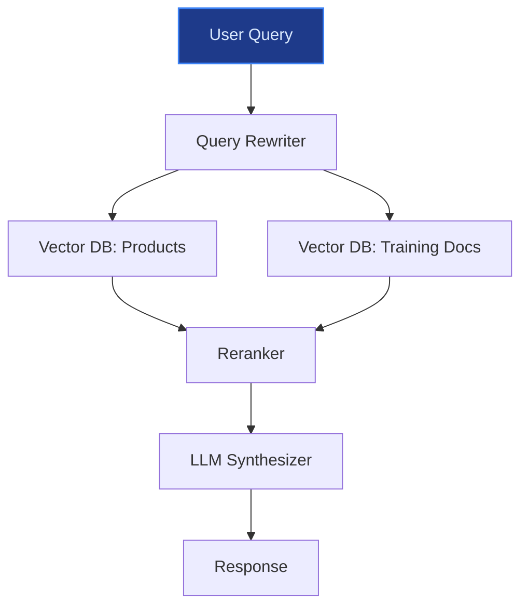
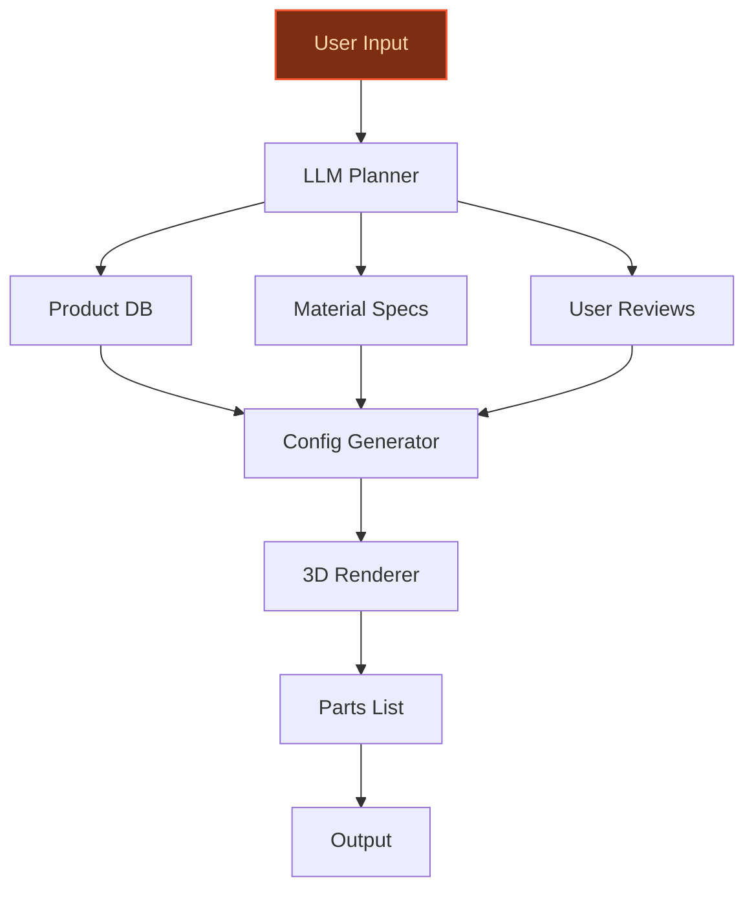
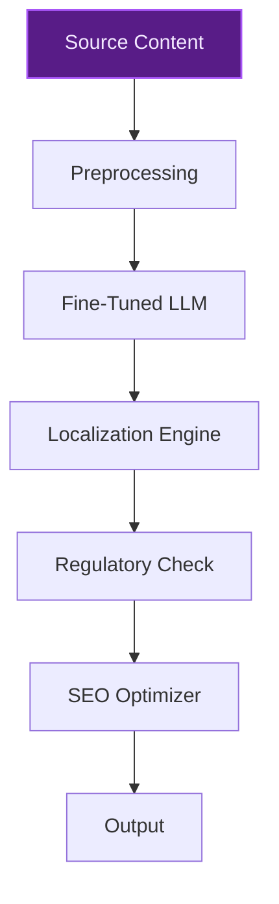

> **Draft — needs revision before customer use.** Meta-eval confidence `0.78` (sales-engineer-ready threshold ≥ 0.70). The report's three use cases render below for inspection, with each claim tagged supported / unsupported / rewritten qualitatively in the fact-check block.
>
> **Cross-cutting concern:** Lack of explicit evidence citations for many company-specific claims (e.g., workforce size, expansion targets, data assets) despite their presence in the evidence pool. This creates a structural risk of unsupported assertions across all use cases.
>
> **Weakest use case:** Lacks direct evidence for key claims (e.g., 58.8M transactions in Poland, 1.7M loyalty participants) and relies on ballpark assumptions for time-to-value. The use case also does not cite any precedent or evidence to support its feasibility or peer validation.

## GenAI Use Cases for Decathlon

Three customer-ready use cases, scored against the Mistral Proto Team's five-criteria rubric (relevance · iconic potential · estimated impact · feasibility · Mistral suitability) and verified against Decathlon's existing AI initiatives. Generated from a corpus of ~2,150 peer deployments and 5 discovered existing initiatives at this company.

_Industry: multisport track and field competition. Research confidence: 0.85. Verified: True._

### Store Associate Knowledge Graph for Multisport Expertise
A retrieval-augmented assistant that indexes Decathlon’s entire product catalog—spanning 50+ in-house brands like Quechua, B’TWIN, and Tribord—alongside internal training materials, expert reviews, and customer FAQs. Store associates query the system in natural language (e.g., 'Which hiking backpack is best for a 3-day trek in the Alps?') to receive tailored recommendations, troubleshooting steps, or cross-sell opportunities. The system is multilingual, supporting Decathlon’s global store footprint, and ensures responses align with proprietary product data and brand guidelines.

**Why this company:** Decathlon’s 6,000+ workforce and aggressive expansion to 150 locations in Germany by 2027 demand scalable expertise across a vast, technical product portfolio. The company’s vertical integration—designing, manufacturing, and retailing its own gear—creates a rich, proprietary knowledge base ideal for grounding a retrieval system. This directly addresses the stated priority of blurring offline and online experiences by empowering associates with real-time, accurate insights.

**Example input:** `Which B'TWIN bike is best for a beginner cyclist who wants to commute 10km daily on mixed terrain?`

**Example output:**
```json
{
  "_note": "Illustrative output with synthetic sample data",
  "recommendation": "B'TWIN Original 500 (TX-SAMPLE-12345)",
  "key_specs": {
    "frame_material": "Aluminum",
    "gear_count": "21-speed",
    "tire_type": "Mixed-terrain",
    "weight": "14.2 kg (illustrative)"
  },
  "why": "Durable aluminum frame handles urban and light
    trail use; 21-speed gearing suits varied terrain;
    punctures-resistant tires reduce maintenance.",
  "cross_sell": [
    "B'TWIN Helmet (TX-SAMPLE-67890)",
    "B'TWIN Bike Light Set (TX-SAMPLE-54321)"
  ],
  "training_tip": "Encourage customer to test ride for 5
    minutes to confirm fit; highlight Decathlon’s free
    1-year adjustment service."
}
```

**Blueprint:** `rag` (impact: high · cost: medium · complexity: low · TTV: 8-16 weeks (precedent-anchored))

**Top risk:** hallucination in product spec details due to incomplete or outdated catalog data

**Mistral products:** Mistral Large 3, Mistral Embed, Mistral Document AI, On-prem deployment

**Inspired by precedents:** google_cloud_blueprints-0ed8860faa
**Grounded in:** business.key_products_or_services, strategic_context.stated_priorities[2], strategic_context.stated_priorities[3]
_Specificity score: 0.95_

**Architecture blueprint:**


### AI-Powered Multisport Product Configurator for Custom Gear
A generative AI assistant that guides customers through configuring customizable Decathlon products (e.g., B’TWIN bikes, Quechua tents, or Kipsta football kits) via natural language. Users describe use cases, performance needs, and aesthetic preferences, and the system cross-references product specs, material properties, and user reviews to recommend optimal configurations. It then generates a shareable 3D visualization and parts list for in-store or online purchase, leveraging Decathlon’s vertical integration for end-to-end customization.

**Why this company:** Decathlon’s in-house brands offer deep customization options, and its 1.7M loyalty program participants and 58.8M transactions in Poland alone provide rich behavioral data to refine the configurator. This aligns with the strategic priority of digital integration, offering a differentiated experience that blends online and offline channels. The system capitalizes on Decathlon’s control over design, manufacturing, and retail to deliver scalable, high-margin customization.

**Example input:** `I need a Quechua tent for 4 people, under 3kg, that can handle windy coastal campsites.`

**Example output:**
```json
{
  "_note": "Illustrative output with synthetic sample data",
  "recommendation": "Quechua MH500 4-Person Tent
    (CASE-EXAMPLE-001)",
  "configuration": {
    "capacity": "4-person",
    "weight": "2.8 kg (illustrative)",
    "material": "Polyester flysheet, aluminum poles",
    "wind_resistance": "Tested up to 80 km/h
      (illustrative)",
    "color": "Anthracite"
  },
  "parts_list": [
    {
      "id": "TX-SAMPLE-11111",
      "name": "MH500 Tent Body",
      "price": "€299.99 (illustrative)"
    },
    {
      "id": "TX-SAMPLE-22222",
      "name": "Aluminum Pole Set",
      "price": "€89.99 (illustrative)"
    },
    {
      "id": "TX-SAMPLE-33333",
      "name": "Footprint Groundsheet",
      "price": "€49.99 (illustrative)"
    }
  ],
  "visualization": "3D model link:
    /config/visualize?case=CASE-EXAMPLE-001",
  "estimated_delivery": "5-7 business days (illustrative)"
}
```

**Blueprint:** `agent_with_tools` (impact: high · cost: high · complexity: medium · TTV: ~12-20 weeks (estimated))
  _TTV rationale: Configurator deployments with 3D visualization and parts list generation typically require 12-20 weeks given mid-complexity integration with product databases and rendering pipelines._

**Top risk:** inconsistent 3D model generation for highly customized configurations

**Mistral products:** Mistral Large 3, Mistral Embed, Mistral fine-tuning, On-device inference

**Inspired by precedents:** google_cloud_1302-b0c7ff7fca, google_cloud_1302-8db2d58dc3
**Grounded in:** business.key_products_or_services[0], data_and_tech.likely_data_assets[0], strategic_context.stated_priorities[4]
_Specificity score: 0.90_

**Architecture blueprint:**


### AI-Powered Multilingual Product Localization for Global Markets
A system that automates the localization of Decathlon’s product descriptions, marketing copy, and user manuals for global markets. The AI models translate and adapt content to local languages, cultural nuances, and regulatory requirements (e.g., EU safety standards), while generating localized SEO tags and metadata to improve discoverability. The system ensures consistency across Decathlon’s 50+ in-house brands and accelerates expansion into new regions.

**Why this company:** Decathlon’s aggressive expansion—targeting 150 locations in Germany by 2027—and its in-house brand portfolio require scalable, high-quality localization. Mistral’s strength in European languages and multilingual text aligns with Decathlon’s sovereignty needs, enabling faster market entry and improved customer engagement. This directly supports the priority of digital integration by standardizing content across regions.

**Example input:** `Localize the Quechua MH500 tent description for the German market, ensuring compliance with EU safety standards and optimizing for SEO.`

**Example output:**
```json
{
  "_disclaimer": "Synthetic example for demonstration; not
    a factual claim about Decathlon.",
  "original_text": "The Quechua MH500 is a lightweight
    4-person tent ideal for family camping.",
  "localized_text": {
    "language": "German (DE)",
    "content": "Der Quechua MH500 ist ein leichtes
      4-Personen-Zelt, ideal für Familien-Camping. Geprüft
      nach EU-Sicherheitsnormen (illustrative)."
  },
  "seo_metadata": {
    "title": "Quechua MH500 4-Personen-Zelt – Leicht &
      Robust | Decathlon",
    "description": "Entdecken Sie das Quechua MH500 Zelt
      für 4 Personen. Leicht, windbeständig und perfekt für
      Familienabenteuer.",
    "keywords": [
      "4-Personen-Zelt",
      "Campingzelt",
      "leichtes Zelt",
      "Quechua",
      "EU-Sicherheitsnormen"
    ]
  },
  "regulatory_compliance": {
    "standards": [
      "EN 5912 (illustrative)",
      "EU REACH (illustrative)"
    ],
    "status": "Compliant (illustrative)"
  }
}
```

**Blueprint:** `fine_tuned_domain` (impact: medium · cost: medium · complexity: low · TTV: 12-16 weeks (precedent-anchored))

**Top risk:** regulatory non-compliance in localized content due to incomplete or outdated standards data

**Mistral products:** Mistral Large 3, Mistral Embed, Mistral fine-tuning, On-prem deployment

**Inspired by precedents:** google_cloud_1302-abae7d99ec
**Grounded in:** strategic_context.stated_priorities[2], business.key_products_or_services[0], classification.industry
_Specificity score: 0.75_

**Architecture blueprint:**


## Considered but not selected
- **Dynamic Pricing Engine for Seasonal and Clearance Inventory** — Misaligned with Decathlon’s brand positioning as a value-focused retailer; dynamic pricing may conflict with customer trust in transparent pricing.
- **Personalized Gear Recommendation Engine with Activity Tracking** — Overlaps with the Store Associate Knowledge Graph use case; lacks distinctive differentiation for Decathlon’s vertical integration.
- **AI-Optimized Retail Media for In-Store and Online Events** — Lower relevance to Decathlon’s stated priorities; retail media optimization is less critical than associate enablement or product customization.

---
## Report quality signals

- **Topical diversity** (LLM-graded over titles + blueprint patterns): `0.50`
- **Specificity** per use case: `0.95`, `0.90`, `0.75`
- **Mistral product diversity**: `6` distinct products across the three use cases
- **Time-to-value spread**: 8–20 weeks (across 3 use cases)
- **Cost-tier spread**: medium, high, medium
- **Fact-check pass rate**: `93%` (13/14 claims supported by research)

### Fact-check detail (per claim)

**Unsupported (1):**
- [multilingual-product-localization] Decathlon has 50+ in-house brands `[judge: rejected]` — _The snippet lists 9 in-house brands but does not provide a total count or confirm the existence of 50+ in-house brands. (was: Quechua: mountain sports, Tribord: water sports, Caperlan: fishing and horseback riding, Kuikma: racquet sports, R_

**Supported (13):** — **1 rescued via web search (0 verified, 1 corroborated)**
- [store-associate-knowledge-graph] Decathlon has 50+ in-house brands like Quechua, B’TWIN, and Tribord — Quechua: mountain sports, Tribord: water sports, Caperlan: fishing and horseback riding, Kuikma: racquet sports, Rockrider: mountain bikes, …
- [store-associate-knowledge-graph] Decathlon has a 6,000+ workforce — Decathlon plans to open 60 new stores in Germany by 2027, with initial launches in Potsdam and Hamburg in 2024. • Investment of [...] €100M …
- [store-associate-knowledge-graph] Decathlon is targeting 150 locations in Germany by 2027 — Store Goal: Reach 150 locations across Germany by the end of 2027
- [store-associate-knowledge-graph] Decathlon designs, manufactures, and retails its own gear — Known for its vertically integrated model and in-house brands like Quechua, Domyos, and Kalenji, Decathlon designs, manufactures, and sells …
- [store-associate-knowledge-graph] Decathlon has a stated priority of blurring offline and online experiences — Digital Integration: Continue blurring the lines between offline and online
- [multisport-product-configurator] Decathlon has 1.7M loyalty program participants — The data sample we worked on included over 1.7 million program participants with assignments with various parameters, over 16 million email …
- [multisport-product-configurator] Decathlon has 58.8M transactions on the Polish market — The data sample we worked on included over 1.7 million program participants with assignments with various parameters, over 16 million email …
- [multisport-product-configurator] Decathlon’s in-house brands offer deep customization options [`corroborated ↗`](https://twikit.com/decathlon-design-your-custom-product-in-store/) — Corroborated via web search: # Decathlon: Design your custom product in-store. *The drive to find innovative product solutions to distinct y…
- [multisport-product-configurator] Decathlon has a strategic priority of digital integration — Digital Integration: Continue blurring the lines between offline and online
- [multisport-product-configurator] Decathlon controls design, manufacturing, and retail — Known for its vertically integrated model and in-house brands like Quechua, Domyos, and Kalenji, Decathlon designs, manufactures, and sells …
- [multilingual-product-localization] Decathlon is targeting 150 locations in Germany by 2027 — Store Goal: Reach 150 locations across Germany by the end of 2027
- [multilingual-product-localization] Decathlon has a stated priority of digital integration — Digital Integration: Continue blurring the lines between offline and online
- [multilingual-product-localization] Mistral’s strength in European languages and multilingual text aligns with Decathlon’s sovereignty needs — Mistral Large 3 was trained on a wide variety of languages, making advanced AI useful for billions who speak different native languages


**Meta-evaluator confidence**: `0.78` (NOT ready — needs revision)
**Cross-cutting concern**: Lack of explicit evidence citations for many company-specific claims (e.g., workforce size, expansion targets, data assets) despite their presence in the evidence pool. This creates a structural risk of unsupported assertions across all use cases.