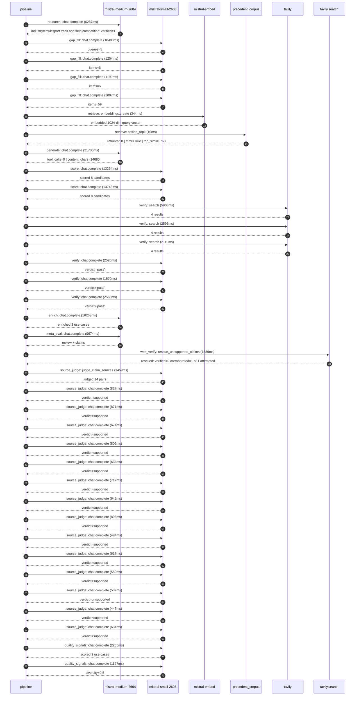

# Trace

## Execution trace — Decathlon

Started: `2026-05-10T22:32:17.734375+00:00`. Total wall time: `117.1s` across `36` recorded actions.

### Per-step time totals

| Step | Calls | Total time | Avg time |
|---|---:|---:|---:|
| `research` | 1 | 6.29s | 6287ms |
| `gap_fill` | 4 | 14.81s | 3703ms |
| `retrieve` | 2 | 0.35s | 177ms |
| `generate` | 1 | 21.70s | 21700ms |
| `score` | 2 | 27.01s | 13506ms |
| `verify` | 6 | 17.28s | 2880ms |
| `enrich` | 1 | 16.26s | 16263ms |
| `meta_eval` | 1 | 9.67s | 9674ms |
| `web_verify` | 1 | 1.59s | 1589ms |
| `source_judge` | 15 | 10.80s | 720ms |
| `quality_signals` | 2 | 3.41s | 1706ms |

### Chronological event log

- `22:32:26.898` **[research]** `mistral-medium-2604.chat.complete` — 6287ms
   - inputs: synthesize CompanyContext for Decathlon | depth=medium
   - outputs: industry='multisport track and field competition' verified=True conf=0.75
- `22:32:33.186` **[gap_fill]** `mistral-small-2603.chat.complete` — 10400ms
   - inputs: generate gap queries | fields=['geography', 'business_model', 'products', 'data_assets', 'priorities']
   - outputs: queries=5
- `22:32:51.190` **[gap_fill]** `mistral-small-2603.chat.complete` — 1204ms
   - inputs: layer-2 extract field=priorities
   - outputs: items=6
- `22:32:51.194` **[gap_fill]** `mistral-small-2603.chat.complete` — 1199ms
   - inputs: layer-2 extract field=data_assets
   - outputs: items=6
- `22:32:51.198` **[gap_fill]** `mistral-small-2603.chat.complete` — 2007ms
   - inputs: layer-2 extract field=products
   - outputs: items=59
- `22:32:53.207` **[retrieve]** `mistral-embed.embeddings.create` — 344ms
   - inputs: company_query | industries='multisport track and field competition'
   - outputs: embedded 1024-dim query vector
- `22:32:53.552` **[retrieve]** `precedent_corpus.cosine_topk` — 10ms
   - inputs: k=8 min_depth=0.4 target='Decathlon'
   - outputs: retrieved 8 | mmr=True | top_sim=0.768
- `22:32:55.210` **[generate]** `mistral-medium-2604.chat.complete` — 21700ms
   - inputs: iteration=0 tool_calls_used=0/0 tools=off
   - outputs: tool_calls=0 | content_chars=14680
- `22:33:17.294` **[score]** `mistral-small-2603.chat.complete` — 13264ms
   - inputs: self-consistency pass T=0.2
   - outputs: scored 8 candidates
- `22:33:17.299` **[score]** `mistral-small-2603.chat.complete` — 13748ms
   - inputs: self-consistency pass T=0.4
   - outputs: scored 8 candidates
- `22:33:31.075` **[verify]** `tavily.search` — 5908ms
   - inputs: candidate=store-associate-knowledge-graph | query='Decathlon Store Associate Knowledge Graph for Multisport Exp'
   - outputs: 4 results
- `22:33:31.076` **[verify]** `tavily.search` — 2595ms
   - inputs: candidate=multisport-product-configurator | query='Decathlon AI-Powered Multisport Product Configurator for Cus'
   - outputs: 4 results
- `22:33:31.076` **[verify]** `tavily.search` — 2119ms
   - inputs: candidate=multilingual-product-localization | query='Decathlon AI-Powered Multilingual Product Localization for G'
   - outputs: 4 results
- `22:33:34.414` **[verify]** `mistral-small-2603.chat.complete` — 2520ms
   - inputs: verdict for multilingual-product-localization
   - outputs: verdict='pass'
- `22:33:34.546` **[verify]** `mistral-small-2603.chat.complete` — 1570ms
   - inputs: verdict for multisport-product-configurator
   - outputs: verdict='pass'
- `22:33:37.103` **[verify]** `mistral-small-2603.chat.complete` — 2568ms
   - inputs: verdict for store-associate-knowledge-graph
   - outputs: verdict='pass'
- `22:33:39.675` **[enrich]** `mistral-medium-2604.chat.complete` — 16263ms
   - inputs: tier=fast parallel=False ids=['store-associate-knowledge-graph', 'multisport-product-configurator', 'multilingual-product-localization']
   - outputs: enriched 3 use cases
- `22:33:55.961` **[meta_eval]** `mistral-medium-2604.chat.complete` — 9674ms
   - inputs: reviewing 3 use cases
   - outputs: review + claims
- `22:34:05.655` **[web_verify]** `tavily.search.rescue_unsupported_claims` — 1589ms
   - inputs: company='Decathlon' unsupported=1 budget=12
   - outputs: rescued: verified=0 corroborated=1 of 1 attempted
- `22:34:07.248` **[source_judge]** `mistral-small-2603.judge_claim_sources` — 1459ms
   - inputs: pairs=14
   - outputs: judged 14 pairs
- `22:34:07.248` **[source_judge]** `mistral-small-2603.chat.complete` — 827ms
   - inputs: claim='Decathlon has 50+ in-house brands like Quechua, B’TWIN, and '
   - outputs: verdict=supported
- `22:34:07.253` **[source_judge]** `mistral-small-2603.chat.complete` — 871ms
   - inputs: claim='Decathlon has a 6,000+ workforce'
   - outputs: verdict=supported
- `22:34:07.264` **[source_judge]** `mistral-small-2603.chat.complete` — 674ms
   - inputs: claim='Decathlon is targeting 150 locations in Germany by 2027'
   - outputs: verdict=supported
- `22:34:07.267` **[source_judge]** `mistral-small-2603.chat.complete` — 802ms
   - inputs: claim='Decathlon designs, manufactures, and retails its own gear'
   - outputs: verdict=supported
- `22:34:07.271` **[source_judge]** `mistral-small-2603.chat.complete` — 633ms
   - inputs: claim='Decathlon has a stated priority of blurring offline and onli'
   - outputs: verdict=supported
- `22:34:07.274` **[source_judge]** `mistral-small-2603.chat.complete` — 717ms
   - inputs: claim='Decathlon has 1.7M loyalty program participants'
   - outputs: verdict=supported
- `22:34:07.277` **[source_judge]** `mistral-small-2603.chat.complete` — 642ms
   - inputs: claim='Decathlon has 58.8M transactions on the Polish market'
   - outputs: verdict=supported
- `22:34:07.282` **[source_judge]** `mistral-small-2603.chat.complete` — 896ms
   - inputs: claim='Decathlon’s in-house brands offer deep customization options'
   - outputs: verdict=supported
- `22:34:07.904` **[source_judge]** `mistral-small-2603.chat.complete` — 494ms
   - inputs: claim='Decathlon has a strategic priority of digital integration'
   - outputs: verdict=supported
- `22:34:07.919` **[source_judge]** `mistral-small-2603.chat.complete` — 617ms
   - inputs: claim='Decathlon controls design, manufacturing, and retail'
   - outputs: verdict=supported
- `22:34:07.938` **[source_judge]** `mistral-small-2603.chat.complete` — 559ms
   - inputs: claim='Decathlon is targeting 150 locations in Germany by 2027'
   - outputs: verdict=supported
- `22:34:07.991` **[source_judge]** `mistral-small-2603.chat.complete` — 532ms
   - inputs: claim='Decathlon has 50+ in-house brands'
   - outputs: verdict=unsupported
- `22:34:08.070` **[source_judge]** `mistral-small-2603.chat.complete` — 447ms
   - inputs: claim='Decathlon has a stated priority of digital integration'
   - outputs: verdict=supported
- `22:34:08.075` **[source_judge]** `mistral-small-2603.chat.complete` — 631ms
   - inputs: claim='Mistral’s strength in European languages and multilingual te'
   - outputs: verdict=supported
- `22:34:11.462` **[quality_signals]** `mistral-small-2603.chat.complete` — 2285ms
   - inputs: specificity grade (3 use cases)
   - outputs: scored 3 use cases
- `22:34:13.747` **[quality_signals]** `mistral-small-2603.chat.complete` — 1127ms
   - inputs: diversity grade
   - outputs: diversity=0.5

## Mermaid sequence

