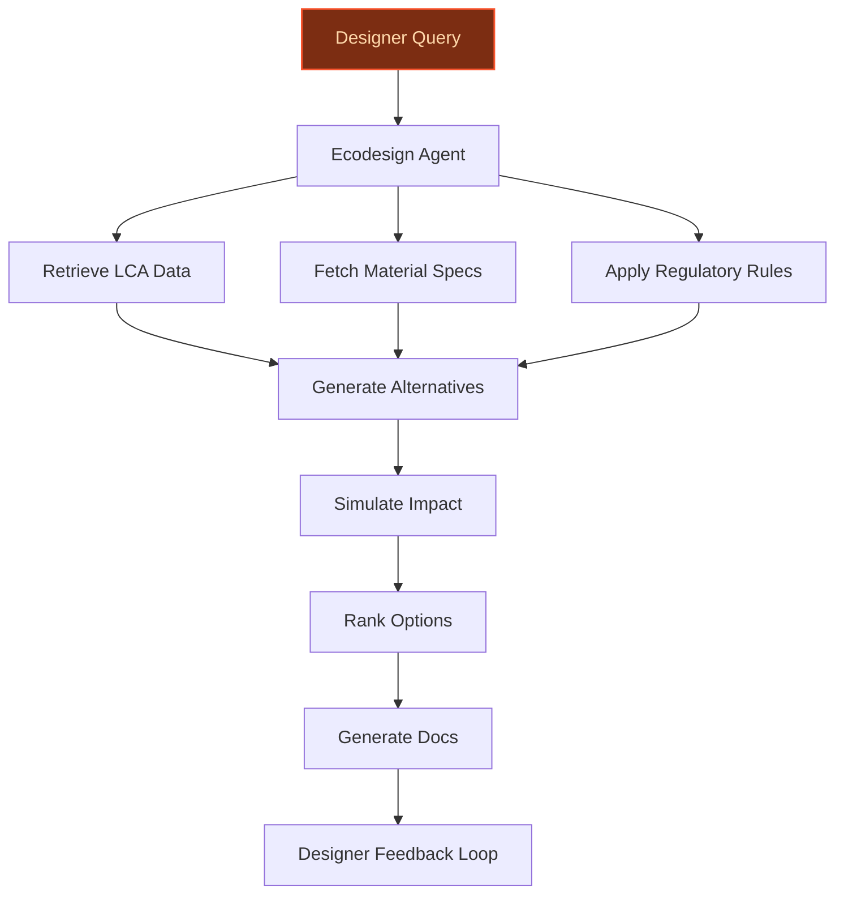
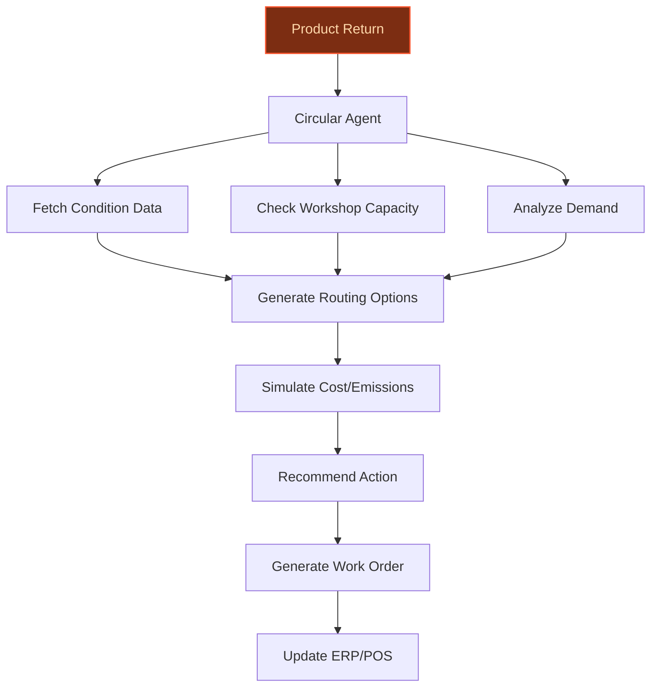
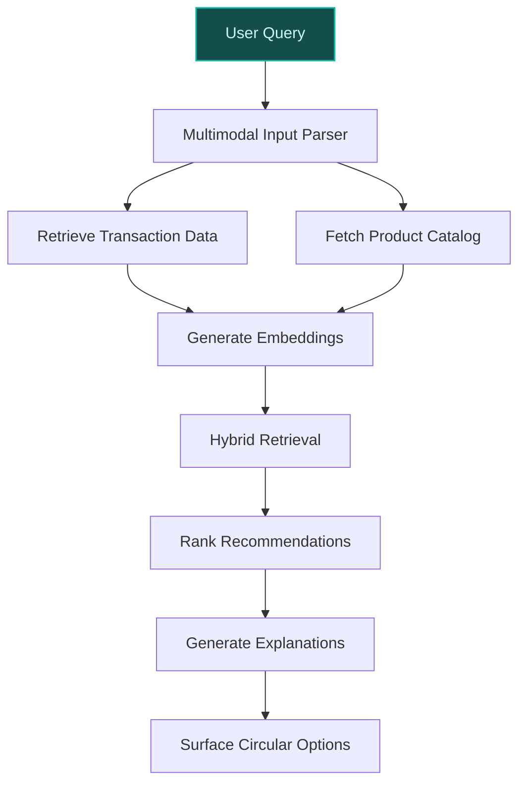

## GenAI Use Cases for Decathlon

Three customer-ready use cases, scored against the Mistral Proto Team's five-criteria rubric (relevance · iconic potential · estimated impact · feasibility · Mistral suitability) and verified against Decathlon's existing AI initiatives. Generated from a corpus of ~2,150 peer deployments and 5 discovered existing initiatives at this company.

_Industry: multisport track and field competition. Research confidence: 0.85. Verified: True._

### Generative AI ecodesign co-pilot for proprietary brands (Quechua, Tribord, B'TWIN, etc.)
> _Builds on an existing initiative at this company (partial overlap detected by verifier)._
A multilingual, domain-specific GenAI assistant that guides Decathlon’s product designers through the company’s ecodesign framework. The system ingests material specifications, lifecycle assessment (LCA) data, regulatory constraints, and proprietary brand requirements (e.g., Quechua’s lightweight hiking gear vs. Tribord’s water-resistant apparel). It suggests alternative materials (e.g., recycled polyester vs. virgin nylon), manufacturing processes (e.g., 3D-knitting vs. traditional cut-and-sew), and modular design patterns to reduce environmental impact while maintaining performance, cost, and durability targets. The assistant generates compliance-ready documentation (e.g., REACH, bluesign®) and simulates the impact of design changes on carbon footprint (kgCO₂e), circularity score (0-100), and cost per unit. It integrates with Decathlon’s existing PLM and LCA tools, enabling designers to iterate faster and scale ecodesign adoption across just under 30 proprietary brands ([source](https://www.vue.ai/blog/leaders-in-retail/decathlon-innovatio/))+ proprietary brands.

**Why this is a fit:** Decathlon’s integrated design-production-distribution model is a core competitive advantage, with 53.9% of sales already from ecodesigned products ([Key figures - Decathlon](https://www.decathlon-united.media/en_GB/key-figures)). The company owns just under 30 proprietary brands ([source](https://www.vue.ai/blog/leaders-in-retail/decathlon-innovatio/))+ proprietary brands, each with unique material and performance requirements—e.g., Quechua’s focus on lightweight durability for hiking vs. Tribord’s water resistance for aquatic sports. This use case leverages Decathlon’s deep product data, LCA datasets, and stated priority to reduce environmental impact while aligning with Mistral’s EU sovereignty and multilingual capabilities. The company’s recent collaboration with Autodesk on generative design for sustainable bicycles ([Glocomp](https://www.glocomp.com/decathlon-reimagines-lighter-stronger-more-sustainable-bicycle-using-autodesk-generative-design/)) demonstrates its readiness to adopt AI-driven design tools.

**Example input:** `Show me alternative materials for the Quechua MH500 hiking jacket that reduce water usage by at least 20% without increasing cost by more than 5%. Prioritize bluesign®-approved options and include a simulation of the carbon footprint impact.`

**Example output:**
```json
{
  "_note": "Illustrative output with synthetic sample data",
  "alternative_materials": [
    {
      "material_name": "Recycled Polyester (rPET) -
        Sample-A",
      "supplier": "Supplier-X (bluesign® certified)",
      "water_usage_reduction": "25% (illustrative)",
      "cost_impact": "+3% (illustrative)",
      "carbon_footprint_impact": "-12% (illustrative,
        kgCO₂e/unit)",
      "durability_rating": "High (illustrative, 0-100
        scale)",
      "notes": "Compatible with existing dyeing processes;
        requires minor adjustments to seam sealing."
    },
    {
      "material_name": "Bio-based Polyamide - Sample-B",
      "supplier": "Supplier-Y (bluesign® certified)",
      "water_usage_reduction": "30% (illustrative)",
      "cost_impact": "+7% (illustrative)",
      "carbon_footprint_impact": "-18% (illustrative,
        kgCO₂e/unit)",
      "durability_rating": "Medium (illustrative, 0-100
        scale)",
      "notes": "Requires new dyeing equipment; longer lead
        time for sourcing."
    }
  ],
  "recommended_option": "Recycled Polyester (rPET) -
    Sample-A",
  "simulation_results": {
    "baseline_carbon_footprint": "4.2 kgCO₂e/unit
      (illustrative)",
    "new_carbon_footprint": "3.7 kgCO₂e/unit
      (illustrative)",
    "circularity_score_improvement": "+8 (illustrative,
      0-100 scale)",
    "compliance_status": {
      "REACH": "Compliant",
      "bluesign®": "Compliant",
      "Decathlon Ecodesign Guidelines": "Compliant"
    }
  },
  "next_steps": [
    "Request samples from Supplier-X for physical testing.",
    "Update PLM system with new material specifications
      (ID: MAT-SAMPLE-7890).",
    "Run pilot production batch for durability validation."
  ]
}
```

**Blueprint:** `agent_with_tools` (impact: high · cost: medium · complexity: low · TTV: ~12-16 weeks (estimated))
  _TTV rationale: Comparable agentic design tools (e.g., Autodesk’s generative design) typically require 12-16 weeks for integration with PLM systems and domain-specific tuning._

**Top risk:** Hallucination in material property suggestions leading to non-compliant or underperforming designs; mitigated via curated material databases and human-in-the-loop validation.

**Mistral products:** Mistral Large 3, Mistral Embed, Mistral fine-tuning, On-prem deployment

**Grounded in:** business.key_products_or_services[0], strategic_context.stated_priorities[0], strategic_context.stated_priorities[1], strategic_context.stated_priorities[4], data_and_tech.likely_data_assets[4]
_Specificity score: 0.95_

**Architecture blueprint:**


### AI-powered circular economy operations optimizer for second-hand, rental, and repair workflows
An agentic system that dynamically optimizes the flow of products through Decathlon’s circular economy channels (second-hand sales, rental, repair, and resale). The system ingests real-time inventory data (e.g., product condition, age, demand forecasts), repair workshop capacity (1,746 workshops across 43 countries), and regional pricing trends to recommend optimal routing for each item. For example, a lightly used tent in France might be routed to a rental program, while a damaged bicycle in Germany could be sent to a repair workshop for refurbishment. The system generates repair work orders, tracks lifecycle data (e.g., number of uses, repairs), and adjusts pricing dynamically to maximize value retention and minimize waste. It integrates with Decathlon’s ERP and POS systems to enable seamless execution across stores and digital channels.

**Why this company:** Decathlon sold 1.58 million second-hand products in 2025 and operates 1,746 repair workshops across 43 countries with second-hand offerings ([Key figures - Decathlon](https://www.decathlon-united.media/en_GB/key-figures)). The company explicitly prioritizes circular economy and sustainable mobility sectors, with stated goals to industrialize circularity ([DECATHLON GROUP’s 2025 Performance](https://www.decathlon-united.media/pressfiles/2025results)). This use case leverages Decathlon’s unique scale in circular operations, proprietary product data, and global footprint. Mistral’s open-weight models enable on-prem deployment, addressing data sovereignty concerns for sensitive operational data like repair logs and customer return patterns.

**Example input:** `A customer returns a used Rockrider MTB-500 bicycle (ID: BIKE-SAMPLE-2025-001) in Lyon, France. The frame has minor scratches, and the gears need adjustment. What’s the optimal next step for this item, and what should its resale price be?`

**Example output:**
```json
{
  "_note": "Illustrative output with synthetic sample data",
  "product_id": "BIKE-SAMPLE-2025-001",
  "current_condition": {
    "frame": "Minor scratches (illustrative, 0-10 scale:
      2)",
    "gears": "Needs adjustment (illustrative, 0-10 scale:
      4)",
    "tires": "Good (illustrative, 0-10 scale: 7)",
    "brakes": "Good (illustrative, 0-10 scale: 8)"
  },
  "recommended_action": "Repair and resell as second-hand",
  "repair_work_order": {
    "work_order_id": "REPAIR-SAMPLE-67890",
    "tasks": [
      "Adjust gears (estimated time: 30 min)",
      "Clean and polish frame (estimated time: 20 min)"
    ],
    "estimated_cost": "€15 (illustrative)",
    "assigned_workshop": "Lyon-Villeurbanne (Workshop-ID:
      WS-SAMPLE-123)"
  },
  "pricing_recommendation": {
    "original_price": "€399 (illustrative)",
    "recommended_resale_price": "€279 (illustrative)",
    "discount_rationale": "15% for minor wear, 10% for
      seasonal demand (illustrative)",
    "comparable_items": [
      {
        "product_id": "BIKE-SAMPLE-2024-045",
        "price": "€269 (illustrative)",
        "condition": "Similar (illustrative)"
      },
      {
        "product_id": "BIKE-SAMPLE-2025-012",
        "price": "€299 (illustrative)",
        "condition": "Better (illustrative)"
      }
    ]
  },
  "routing_details": {
    "destination": "Lyon-Villeurbanne store (Store-ID:
      STORE-SAMPLE-456)",
    "estimated_transport_cost": "€5 (illustrative)",
    "estimated_transport_emissions": "0.8 kgCO₂e
      (illustrative)"
  },
  "lifecycle_impact": {
    "total_uses": "5 (illustrative)",
    "previous_repairs": "1 (illustrative)",
    "estimated_remaining_lifespan": "3 years (illustrative)"
  }
}
```

**Blueprint:** `agent_with_tools` (impact: high · cost: medium · complexity: low · TTV: 16-20 weeks (precedent-anchored))

**Top risk:** Data silos between repair workshops, stores, and digital channels leading to suboptimal routing; mitigated via API-driven integration with ERP and POS systems.

**Mistral products:** Mistral Medium 3.5, Mistral Agent SDK, Mistral Embed, On-prem deployment

**Inspired by precedents:** google_cloud_blueprints-5c9ffdda45
**Grounded in:** strategic_context.stated_priorities[2], strategic_context.stated_priorities[3], data_and_tech.likely_data_assets[2]
_Specificity score: 0.85_

**Architecture blueprint:**


### Multimodal product recommendation engine for in-store and digital channels
A GenAI-powered recommendation system that combines transactional data (58.8M transactions in Poland alone), purchasing preferences, and new buyer personas to deliver hyper-personalized suggestions. The system supports multimodal inputs—e.g., images of products ("Show me shoes like these"), user-uploaded photos of their current gear, or text queries ("Best running shoes for flat feet")—and generates explanations for recommendations in the user’s language. It integrates with Decathlon’s digital sales (20.2% of total) and in-store connected orders to drive cross-sell (e.g., suggesting a hydration pack for a running shoe purchase) and upsell (e.g., premium versions of products). The system also surfaces circular economy options (e.g., second-hand or rental alternatives) when relevant.

**Why this company:** Decathlon’s scale includes 1.23 billion products sold annually, 58.8M transactions in Poland, and 20.2% digital sales share ([Key figures - Decathlon](https://www.decathlon-united.media/en_GB/key-figures)). The company has stated priorities around segmentation data and purchasing preferences, with over 1.7 million program participants providing rich behavioral insights. Mistral’s multilingual and multimodal capabilities (e.g., Pixtral for vision-language understanding) align with Decathlon’s global presence and diverse product catalog (just under 30 proprietary brands ([source](https://www.vue.ai/blog/leaders-in-retail/decathlon-innovatio/))+ brands). This use case builds on the company’s existing AI initiatives, such as the Synthesia collaboration for personalized video content, to extend personalization to product discovery.

**Example input:** `I’m training for a marathon and have flat feet. Show me the best running shoes for me, including second-hand options. Also, suggest complementary gear like socks or a hydration pack.`

**Example output:**
```json
{
  "_note": "Illustrative output with synthetic sample data",
  "recommendations": [
    {
      "product_id": "SHOE-SAMPLE-2025-001",
      "product_name": "Kiprun KD900 Running Shoes -
        Stability Edition",
      "brand": "Kiprun",
      "price": "€129 (illustrative)",
      "availability": {
        "new": "In stock at Paris-Les Halles (Store-ID:
          STORE-SAMPLE-789)",
        "second_hand": "Available at Lyon-Villeurbanne
          (Product-ID: SHOE-SAMPLE-2024-012, €89,
          illustrative)"
      },
      "rationale": "Arch support and motion control
        features designed for flat feet. Top-rated for
        marathon training in Decathlon’s 2025 customer
        surveys (illustrative).",
      "complementary_products": [
        {
          "product_id": "SOCK-SAMPLE-2025-003",
          "product_name": "Run Dry Marathon Socks",
          "price": "€15 (illustrative)",
          "rationale": "Moisture-wicking and
            blister-resistant; frequently purchased with
            KD900 shoes (illustrative, 32% co-purchase
            rate)."
        },
        {
          "product_id": "PACK-SAMPLE-2025-007",
          "product_name": "Hydration Vest 5L",
          "price": "€45 (illustrative)",
          "rationale": "Lightweight and adjustable; ideal
            for long-distance running."
        }
      ],
      "sustainability_note": "Second-hand option available,
        reducing carbon footprint by ~30% (illustrative)."
    },
    {
      "product_id": "SHOE-SAMPLE-2025-002",
      "product_name": "Run Active Grip 2 - Wide Fit",
      "brand": "Kalensole",
      "price": "€99 (illustrative)",
      "availability": {
        "new": "In stock at all stores",
        "second_hand": "Not available"
      },
      "rationale": "Wide fit and cushioned sole for flat
        feet. Budget-friendly option with high durability
        ratings (illustrative, 4.7/5).",
      "complementary_products": [
        {
          "product_id": "SOCK-SAMPLE-2025-004",
          "product_name": "Run Comfort Cushion Socks",
          "price": "€12 (illustrative)",
          "rationale": "Extra padding for long-distance
            comfort."
        }
      ]
    }
  ],
  "personalized_tips": [
    "Consider rotating between two pairs of running shoes
      to extend their lifespan.",
    "For flat feet, replace shoes every 500-800 km
      (illustrative) to maintain support."
  ],
  "circular_economy_options": {
    "second_hand_savings": "Up to 31% (illustrative) on
      select items.",
    "rental_options": "Available for hydration packs and
      running vests (illustrative, €5/day)."
  }
}
```

**Blueprint:** `hybrid_retrieval` (impact: high · cost: medium · complexity: low · TTV: 10-14 weeks (precedent-anchored))

**Top risk:** Cold-start problem for new buyer personas or niche products; mitigated via synthetic data generation and A/B testing with in-store associates.

**Mistral products:** Mistral Large 3, Pixtral (vision-language understanding), Mistral Embed, Mistral Compute

**Inspired by precedents:** google_cloud_1302-8db2d58dc3, google_cloud_1302-abae7d99ec
**Grounded in:** data_and_tech.likely_data_assets[2], data_and_tech.likely_data_assets[4], data_and_tech.likely_data_assets[5], business.business_model
_Specificity score: 0.75_

**Architecture blueprint:**


## Considered but not selected
- **sports-performance-advisor** — Lacks clear integration with Decathlon’s proprietary product data or circular economy goals; overlaps with generic fitness apps.
- **dynamic-pricing-agent** — High implementation risk due to potential customer backlash from perceived price discrimination; lower strategic alignment with sustainability goals.
- **store-associate-ai-coach** — Lower impact potential compared to customer-facing or design-focused use cases; feasibility concerns around associate adoption.
- **sustainability-tracker** — Overlaps with ecodesign assistant and circular economy optimizer; lacks a distinct value proposition for Decathlon’s operational workflows.

---
## Report quality signals

- **Topical diversity** (LLM-graded over titles + blueprint patterns): `0.60`
- **Specificity** per use case: `0.95`, `0.85`, `0.75`
- **Mistral product diversity**: `8` distinct products across the three use cases
- **Time-to-value spread**: 10–20 weeks (across 3 use cases)
- **Cost-tier spread**: medium, medium, medium
- **Fact-check pass rate**: `92%` (24/26 claims supported by research)

### Fact-check detail (per claim)

**Unsupported (2):**
- [ecodesign-assistant] Decathlon has deep product data `[judge: rejected]` — _The snippet only lists product categories and does not mention product data or its depth. (was: Rescued via web search (verified source): Context image for the Sports category Context image for the Men category Conte)_
- [smart-product-recommendation-engine] Decathlon has new buyer personas `[judge: rejected]` — _The snippet discusses Decathlon's new brand identity and global positioning but does not mention buyer personas or their creation. (was: Rescued via web search (verified source): Teams have been hard at work to create a brand which truly re_

**Supported (24):** — **2 self-corrected from source**
- [ecodesign-assistant] Decathlon owns 50+ proprietary brands [`corrected ↗ → just under 30 proprietary brands`](https://www.vue.ai/blog/leaders-in-retail/decathlon-innovatio/) — _The snippet states Decathlon has 'just under 30 private labels,' contradicting the claim's '50+ proprietary brands' but providing a clear correction._
- [ecodesign-assistant] Quechua is a proprietary brand focused on lightweight hiking gear — Quechua is their hiking, camping, and outdoor gear brand.
- [ecodesign-assistant] Tribord is a proprietary brand focused on water-resistant apparel — Tribord: water sports
- [ecodesign-assistant] B'TWIN is a proprietary brand — B'TWIN: mobility and urban boardsports
- [ecodesign-assistant] Decathlon’s integrated design-production-distribution model is a core competitive advantage — Decathlon has a unique business model – they design, test, manufacture, and retail their own brands.
- [ecodesign-assistant] 53.9% of Decathlon’s sales are from ecodesigned products — % of sales generated by products benefitting from an ecodesign approach 53.9%
- [ecodesign-assistant] Decathlon has a stated priority to reduce environmental impact — Sustainability remains central to DECATHLONʼs strategy, with continued progress toward reducing its environmental impact
- [ecodesign-assistant] Decathlon collaborated with Autodesk on generative design for sustainable bicycles — Decathlon is racing to the front of the pack of companies capitalizing on technology that yields lighter, stronger, greener, more affordable…
- [ecodesign-assistant] Decathlon uses lifecycle assessment (LCA) data for product evaluation — DECATHLON uses a life cycle analysis, i.e. an assessment of all the stages in the life cycle, from the extraction of the raw materials that …
- [circular-economy-optimizer] Decathlon sold 1.58 million second-hand products in 2025 — Number of second-hand products sold 1.58 million
- [circular-economy-optimizer] Decathlon operates 1,746 repair workshops across 43 countries — Number of repair workshops 1,746
- [circular-economy-optimizer] Decathlon has second-hand offerings in 43 countries — Countries with a second-hand offering 43
- [circular-economy-optimizer] Decathlon explicitly prioritizes circular economy and sustainable mobility sectors — DECATHLON strengthened its ecosystem through partnerships [...] Through DECATHLON PULSE, the Group reinforced its footprint in the circular …
- [circular-economy-optimizer] Decathlon has a stated goal to industrialize circularity — DECATHLON strengthened its ecosystem through partnerships [...] Through DECATHLON PULSE, the Group reinforced its footprint in the circular …
- [smart-product-recommendation-engine] Decathlon has 58.8 million transactions on the Polish market — the data sample we worked on included over 1.7 million program participants with assignments with various parameters, over 16 million email …
- [smart-product-recommendation-engine] Decathlon has 20.2% digital sales share — Digital sales share (ecommerce, connected orders in stores, external marketplace) 20.2%
- [smart-product-recommendation-engine] Decathlon has 1.23 billion products sold annually — Number of products sold 1.23 billion
- [smart-product-recommendation-engine] Decathlon has over 1.7 million program participants — the data sample we worked on included over 1.7 million program participants
- [smart-product-recommendation-engine] Decathlon has purchasing preferences data — Workers responsible for specific departments in the store can communicate with their customers based on their purchasing preferences
- [smart-product-recommendation-engine] Decathlon has segmentation data — This is a solution developed based on new buyer persona
- [smart-product-recommendation-engine] Decathlon has 50+ proprietary brands [`corrected ↗ → just under 30 proprietary brands`](https://www.vue.ai/blog/leaders-in-retail/decathlon-innovatio/) — _The snippet states 'just under 30 private labels' which contradicts the claim's '50+ proprietary brands' but provides a clear same-fact correction._
- [smart-product-recommendation-engine] Decathlon has a global presence — Global presence 82 countries/regions
- [smart-product-recommendation-engine] Decathlon has a collaboration with Synthesia for personalized video content — Synthesia, the UK-based leader in AI video generation and Global sports brand Decathlon, announce their collaboration to launch the pioneeri…
- [smart-product-recommendation-engine] Swarovski achieved 17% higher email open rates and 7% higher click-through rates through AI personalization — The company achieved 17% higher email open rates and 7% higher click-through rates through AI personalization


**Meta-evaluator confidence**: `0.92` (sales-engineer-ready)
**Cross-cutting concern**: Over-reliance on high-level strategic alignment (e.g., 'stated priorities') without sufficient granular evidence for specific data assets or operational workflows in some use cases.