# Trace

## Execution trace — Decathlon

Started: `2026-05-10T22:34:14.879741+00:00`. Total wall time: `220.9s` across `51` recorded actions.

### Per-step time totals

| Step | Calls | Total time | Avg time |
|---|---:|---:|---:|
| `research` | 1 | 5.20s | 5201ms |
| `gap_fill` | 4 | 5.17s | 1292ms |
| `retrieve` | 2 | 0.18s | 88ms |
| `generate` | 2 | 25.98s | 12991ms |
| `generate.web_search` | 2 | 8.02s | 4011ms |
| `score` | 2 | 25.36s | 12680ms |
| `verify` | 6 | 46.48s | 7747ms |
| `enrich` | 1 | 77.08s | 77078ms |
| `meta_eval` | 1 | 30.64s | 30639ms |
| `web_verify` | 1 | 1.27s | 1268ms |
| `source_judge` | 27 | 18.07s | 669ms |
| `quality_signals` | 2 | 4.41s | 2204ms |

### Chronological event log

- `22:34:16.360` **[research]** `mistral-medium-2604.chat.complete` — 5201ms
   - inputs: synthesize CompanyContext for Decathlon | depth=medium
   - outputs: industry='multisport track and field competition' verified=True conf=0.75
- `22:34:21.563` **[gap_fill]** `mistral-small-2603.chat.complete` — 939ms
   - inputs: generate gap queries | fields=['geography', 'business_model', 'products', 'data_assets', 'priorities']
   - outputs: queries=5
- `22:34:27.485` **[gap_fill]** `mistral-small-2603.chat.complete` — 829ms
   - inputs: layer-2 extract field=priorities
   - outputs: items=6
- `22:34:27.488` **[gap_fill]** `mistral-small-2603.chat.complete` — 707ms
   - inputs: layer-2 extract field=data_assets
   - outputs: items=6
- `22:34:27.491` **[gap_fill]** `mistral-small-2603.chat.complete` — 2693ms
   - inputs: layer-2 extract field=products
   - outputs: items=70
- `22:34:30.185` **[retrieve]** `mistral-embed.embeddings.create` — 168ms
   - inputs: company_query | industries='multisport track and field competition'
   - outputs: embedded 1024-dim query vector
- `22:34:30.353` **[retrieve]** `precedent_corpus.cosine_topk` — 9ms
   - inputs: k=8 min_depth=0.4 target='Decathlon'
   - outputs: retrieved 8 | mmr=True | top_sim=0.779
- `22:34:32.187` **[generate]** `mistral-medium-2604.chat.complete` — 1991ms
   - inputs: iteration=0 tool_calls_used=0/2 tools=on
   - outputs: tool_calls=4 | content_chars=0
- `22:34:34.192` **[generate.web_search]** `tavily.search` — 4162ms
   - inputs: query='Decathlon company overview 2025 official site'
   - outputs: 2 raw results
- `22:34:38.775` **[generate.web_search]** `tavily.search` — 3861ms
   - inputs: query='Decathlon sustainability ecodesign circular economy initiatives 2025'
   - outputs: 2 raw results
- `22:34:43.938` **[generate]** `mistral-medium-2604.chat.complete` — 23991ms
   - inputs: iteration=1 tool_calls_used=2/2 tools=off
   - outputs: tool_calls=0 | content_chars=16658
- `22:35:08.706` **[score]** `mistral-small-2603.chat.complete` — 13260ms
   - inputs: self-consistency pass T=0.2
   - outputs: scored 8 candidates
- `22:35:08.714` **[score]** `mistral-small-2603.chat.complete` — 12100ms
   - inputs: self-consistency pass T=0.4
   - outputs: scored 8 candidates
- `22:35:22.001` **[verify]** `tavily.search` — 1965ms
   - inputs: candidate=ecodesign-assistant | query='Decathlon Generative AI ecodesign co-pilot for proprietary b'
   - outputs: 4 results
- `22:35:22.002` **[verify]** `tavily.search` — 1999ms
   - inputs: candidate=circular-economy-optimizer | query='Decathlon AI-powered circular economy operations optimizer f'
   - outputs: 4 results
- `22:35:22.002` **[verify]** `tavily.search` — 2488ms
   - inputs: candidate=sustainability-tracker | query='Decathlon Real-time sustainability impact tracker for produc'
   - outputs: 4 results
- `22:35:24.211` **[verify]** `mistral-small-2603.chat.complete` — 4033ms
   - inputs: verdict for circular-economy-optimizer
   - outputs: verdict='pass'
- `22:35:24.919` **[verify]** `mistral-small-2603.chat.complete` — 3839ms
   - inputs: verdict for sustainability-tracker
   - outputs: verdict='pass'
- `22:35:25.686` **[verify]** `mistral-small-2603.chat.complete` — 32160ms
   - inputs: verdict for ecodesign-assistant
   - outputs: verdict='partial_overlap'
- `22:35:57.852` **[enrich]** `mistral-large-2512.chat.complete` — 77078ms
   - inputs: tier=standard parallel=False ids=['ecodesign-assistant', 'circular-economy-optimizer', 'smart-product-recommendation-engine']
   - outputs: enriched 3 use cases
- `22:37:14.955` **[meta_eval]** `mistral-medium-2604.chat.complete` — 30639ms
   - inputs: reviewing 3 use cases
   - outputs: review + claims
- `22:37:45.612` **[web_verify]** `tavily.search.rescue_unsupported_claims` — 1268ms
   - inputs: company='Decathlon' unsupported=2 budget=12
   - outputs: rescued: verified=2 corroborated=0 of 2 attempted
- `22:37:46.884` **[source_judge]** `mistral-small-2603.judge_claim_sources` — 2281ms
   - inputs: pairs=26
   - outputs: judged 26 pairs
- `22:37:46.892` **[source_judge]** `mistral-small-2603.chat.complete` — 818ms
   - inputs: claim='Decathlon owns 50+ proprietary brands'
   - outputs: verdict=corrected
- `22:37:46.897` **[source_judge]** `mistral-small-2603.chat.complete` — 717ms
   - inputs: claim='Quechua is a proprietary brand focused on lightweight hiking'
   - outputs: verdict=supported
- `22:37:46.901` **[source_judge]** `mistral-small-2603.chat.complete` — 722ms
   - inputs: claim='Tribord is a proprietary brand focused on water-resistant ap'
   - outputs: verdict=supported
- `22:37:46.905` **[source_judge]** `mistral-small-2603.chat.complete` — 752ms
   - inputs: claim="B'TWIN is a proprietary brand"
   - outputs: verdict=supported
- `22:37:46.908` **[source_judge]** `mistral-small-2603.chat.complete` — 709ms
   - inputs: claim='Decathlon’s integrated design-production-distribution model '
   - outputs: verdict=supported
- `22:37:46.912` **[source_judge]** `mistral-small-2603.chat.complete` — 624ms
   - inputs: claim='53.9% of Decathlon’s sales are from ecodesigned products'
   - outputs: verdict=supported
- `22:37:46.917` **[source_judge]** `mistral-small-2603.chat.complete` — 667ms
   - inputs: claim='Decathlon has a stated priority to reduce environmental impa'
   - outputs: verdict=supported
- `22:37:46.920` **[source_judge]** `mistral-small-2603.chat.complete` — 742ms
   - inputs: claim='Decathlon collaborated with Autodesk on generative design fo'
   - outputs: verdict=supported
- `22:37:47.536` **[source_judge]** `mistral-small-2603.chat.complete` — 576ms
   - inputs: claim='Decathlon uses lifecycle assessment (LCA) data for product e'
   - outputs: verdict=supported
- `22:37:47.584` **[source_judge]** `mistral-small-2603.chat.complete` — 480ms
   - inputs: claim='Decathlon has deep product data'
   - outputs: verdict=unsupported
- `22:37:47.614` **[source_judge]** `mistral-small-2603.chat.complete` — 693ms
   - inputs: claim='Decathlon sold 1.58 million second-hand products in 2025'
   - outputs: verdict=supported
- `22:37:47.618` **[source_judge]** `mistral-small-2603.chat.complete` — 625ms
   - inputs: claim='Decathlon operates 1,746 repair workshops across 43 countrie'
   - outputs: verdict=supported
- `22:37:47.624` **[source_judge]** `mistral-small-2603.chat.complete` — 583ms
   - inputs: claim='Decathlon has second-hand offerings in 43 countries'
   - outputs: verdict=supported
- `22:37:47.657` **[source_judge]** `mistral-small-2603.chat.complete` — 531ms
   - inputs: claim='Decathlon explicitly prioritizes circular economy and sustai'
   - outputs: verdict=supported
- `22:37:47.662` **[source_judge]** `mistral-small-2603.chat.complete` — 638ms
   - inputs: claim='Decathlon has a stated goal to industrialize circularity'
   - outputs: verdict=supported
- `22:37:47.711` **[source_judge]** `mistral-small-2603.chat.complete` — 450ms
   - inputs: claim='Decathlon has 58.8 million transactions on the Polish market'
   - outputs: verdict=supported
- `22:37:48.064` **[source_judge]** `mistral-small-2603.chat.complete` — 520ms
   - inputs: claim='Decathlon has 20.2% digital sales share'
   - outputs: verdict=supported
- `22:37:48.113` **[source_judge]** `mistral-small-2603.chat.complete` — 503ms
   - inputs: claim='Decathlon has 1.23 billion products sold annually'
   - outputs: verdict=supported
- `22:37:48.161` **[source_judge]** `mistral-small-2603.chat.complete` — 503ms
   - inputs: claim='Decathlon has over 1.7 million program participants'
   - outputs: verdict=supported
- `22:37:48.188` **[source_judge]** `mistral-small-2603.chat.complete` — 602ms
   - inputs: claim='Decathlon has purchasing preferences data'
   - outputs: verdict=supported
- `22:37:48.207` **[source_judge]** `mistral-small-2603.chat.complete` — 527ms
   - inputs: claim='Decathlon has segmentation data'
   - outputs: verdict=supported
- `22:37:48.243` **[source_judge]** `mistral-small-2603.chat.complete` — 547ms
   - inputs: claim='Decathlon has new buyer personas'
   - outputs: verdict=unsupported
- `22:37:48.301` **[source_judge]** `mistral-small-2603.chat.complete` — 653ms
   - inputs: claim='Decathlon has 50+ proprietary brands'
   - outputs: verdict=corrected
- `22:37:48.307` **[source_judge]** `mistral-small-2603.chat.complete` — 484ms
   - inputs: claim='Decathlon has a global presence'
   - outputs: verdict=supported
- `22:37:48.583` **[source_judge]** `mistral-small-2603.chat.complete` — 582ms
   - inputs: claim='Decathlon has a collaboration with Synthesia for personalize'
   - outputs: verdict=supported
- `22:37:48.616` **[source_judge]** `mistral-small-2603.chat.complete` — 538ms
   - inputs: claim='Swarovski achieved 17% higher email open rates and 7% higher'
   - outputs: verdict=supported
- `22:37:51.411` **[quality_signals]** `mistral-small-2603.chat.complete` — 3176ms
   - inputs: specificity grade (3 use cases)
   - outputs: scored 3 use cases
- `22:37:54.587` **[quality_signals]** `mistral-small-2603.chat.complete` — 1232ms
   - inputs: diversity grade
   - outputs: diversity=0.6

## Mermaid sequence

```mermaid
sequenceDiagram
    autonumber
    participant pipeline as pipeline
    participant mistral_medium_2604 as mistral-medium-2604
    participant mistral_small_2603 as mistral-small-2603
    participant mistral_embed as mistral-embed
    participant precedent_corpus as precedent_corpus
    participant tavily as tavily
    participant mistral_large_2512 as mistral-large-2512
    participant tavily_search as tavily.search
    pipeline->>mistral_medium_2604: research: chat.complete (5201ms)
    mistral_medium_2604-->>pipeline: industry='multisport track and field competition' verified=T
    pipeline->>mistral_small_2603: gap_fill: chat.complete (939ms)
    mistral_small_2603-->>pipeline: queries=5
    pipeline->>mistral_small_2603: gap_fill: chat.complete (829ms)
    mistral_small_2603-->>pipeline: items=6
    pipeline->>mistral_small_2603: gap_fill: chat.complete (707ms)
    mistral_small_2603-->>pipeline: items=6
    pipeline->>mistral_small_2603: gap_fill: chat.complete (2693ms)
    mistral_small_2603-->>pipeline: items=70
    pipeline->>mistral_embed: retrieve: embeddings.create (168ms)
    mistral_embed-->>pipeline: embedded 1024-dim query vector
    pipeline->>precedent_corpus: retrieve: cosine_topk (9ms)
    precedent_corpus-->>pipeline: retrieved 8 | mmr=True | top_sim=0.779
    pipeline->>mistral_medium_2604: generate: chat.complete (1991ms)
    mistral_medium_2604-->>pipeline: tool_calls=4 | content_chars=0
    pipeline->>tavily: generate.web_search: search (4162ms)
    tavily-->>pipeline: 2 raw results
    pipeline->>tavily: generate.web_search: search (3861ms)
    tavily-->>pipeline: 2 raw results
    pipeline->>mistral_medium_2604: generate: chat.complete (23991ms)
    mistral_medium_2604-->>pipeline: tool_calls=0 | content_chars=16658
    pipeline->>mistral_small_2603: score: chat.complete (13260ms)
    mistral_small_2603-->>pipeline: scored 8 candidates
    pipeline->>mistral_small_2603: score: chat.complete (12100ms)
    mistral_small_2603-->>pipeline: scored 8 candidates
    pipeline->>tavily: verify: search (1965ms)
    tavily-->>pipeline: 4 results
    pipeline->>tavily: verify: search (1999ms)
    tavily-->>pipeline: 4 results
    pipeline->>tavily: verify: search (2488ms)
    tavily-->>pipeline: 4 results
    pipeline->>mistral_small_2603: verify: chat.complete (4033ms)
    mistral_small_2603-->>pipeline: verdict='pass'
    pipeline->>mistral_small_2603: verify: chat.complete (3839ms)
    mistral_small_2603-->>pipeline: verdict='pass'
    pipeline->>mistral_small_2603: verify: chat.complete (32160ms)
    mistral_small_2603-->>pipeline: verdict='partial_overlap'
    pipeline->>mistral_large_2512: enrich: chat.complete (77078ms)
    mistral_large_2512-->>pipeline: enriched 3 use cases
    pipeline->>mistral_medium_2604: meta_eval: chat.complete (30639ms)
    mistral_medium_2604-->>pipeline: review + claims
    pipeline->>tavily_search: web_verify: rescue_unsupported_claims (1268ms)
    tavily_search-->>pipeline: rescued: verified=2 corroborated=0 of 2 attempted
    pipeline->>mistral_small_2603: source_judge: judge_claim_sources (2281ms)
    mistral_small_2603-->>pipeline: judged 26 pairs
    pipeline->>mistral_small_2603: source_judge: chat.complete (818ms)
    mistral_small_2603-->>pipeline: verdict=corrected
    pipeline->>mistral_small_2603: source_judge: chat.complete (717ms)
    mistral_small_2603-->>pipeline: verdict=supported
    pipeline->>mistral_small_2603: source_judge: chat.complete (722ms)
    mistral_small_2603-->>pipeline: verdict=supported
    pipeline->>mistral_small_2603: source_judge: chat.complete (752ms)
    mistral_small_2603-->>pipeline: verdict=supported
    pipeline->>mistral_small_2603: source_judge: chat.complete (709ms)
    mistral_small_2603-->>pipeline: verdict=supported
    pipeline->>mistral_small_2603: source_judge: chat.complete (624ms)
    mistral_small_2603-->>pipeline: verdict=supported
    pipeline->>mistral_small_2603: source_judge: chat.complete (667ms)
    mistral_small_2603-->>pipeline: verdict=supported
    pipeline->>mistral_small_2603: source_judge: chat.complete (742ms)
    mistral_small_2603-->>pipeline: verdict=supported
    pipeline->>mistral_small_2603: source_judge: chat.complete (576ms)
    mistral_small_2603-->>pipeline: verdict=supported
    pipeline->>mistral_small_2603: source_judge: chat.complete (480ms)
    mistral_small_2603-->>pipeline: verdict=unsupported
    pipeline->>mistral_small_2603: source_judge: chat.complete (693ms)
    mistral_small_2603-->>pipeline: verdict=supported
    pipeline->>mistral_small_2603: source_judge: chat.complete (625ms)
    mistral_small_2603-->>pipeline: verdict=supported
    pipeline->>mistral_small_2603: source_judge: chat.complete (583ms)
    mistral_small_2603-->>pipeline: verdict=supported
    pipeline->>mistral_small_2603: source_judge: chat.complete (531ms)
    mistral_small_2603-->>pipeline: verdict=supported
    pipeline->>mistral_small_2603: source_judge: chat.complete (638ms)
    mistral_small_2603-->>pipeline: verdict=supported
    pipeline->>mistral_small_2603: source_judge: chat.complete (450ms)
    mistral_small_2603-->>pipeline: verdict=supported
    pipeline->>mistral_small_2603: source_judge: chat.complete (520ms)
    mistral_small_2603-->>pipeline: verdict=supported
    pipeline->>mistral_small_2603: source_judge: chat.complete (503ms)
    mistral_small_2603-->>pipeline: verdict=supported
    pipeline->>mistral_small_2603: source_judge: chat.complete (503ms)
    mistral_small_2603-->>pipeline: verdict=supported
    pipeline->>mistral_small_2603: source_judge: chat.complete (602ms)
    mistral_small_2603-->>pipeline: verdict=supported
    pipeline->>mistral_small_2603: source_judge: chat.complete (527ms)
    mistral_small_2603-->>pipeline: verdict=supported
    pipeline->>mistral_small_2603: source_judge: chat.complete (547ms)
    mistral_small_2603-->>pipeline: verdict=unsupported
    pipeline->>mistral_small_2603: source_judge: chat.complete (653ms)
    mistral_small_2603-->>pipeline: verdict=corrected
    pipeline->>mistral_small_2603: source_judge: chat.complete (484ms)
    mistral_small_2603-->>pipeline: verdict=supported
    pipeline->>mistral_small_2603: source_judge: chat.complete (582ms)
    mistral_small_2603-->>pipeline: verdict=supported
    pipeline->>mistral_small_2603: source_judge: chat.complete (538ms)
    mistral_small_2603-->>pipeline: verdict=supported
    pipeline->>mistral_small_2603: quality_signals: chat.complete (3176ms)
    mistral_small_2603-->>pipeline: scored 3 use cases
    pipeline->>mistral_small_2603: quality_signals: chat.complete (1232ms)
    mistral_small_2603-->>pipeline: diversity=0.6
```

