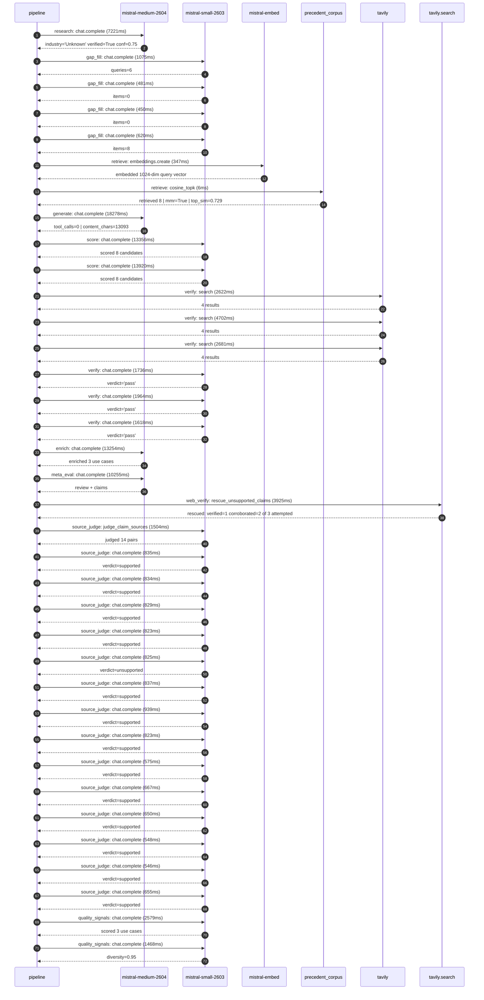

# Trace

## Execution trace — Hermes

Started: `2026-05-10T22:56:49.467118+00:00`. Total wall time: `105.6s` across `36` recorded actions.

### Per-step time totals

| Step | Calls | Total time | Avg time |
|---|---:|---:|---:|
| `research` | 1 | 7.22s | 7221ms |
| `gap_fill` | 4 | 2.63s | 657ms |
| `retrieve` | 2 | 0.35s | 177ms |
| `generate` | 1 | 18.28s | 18278ms |
| `score` | 2 | 27.28s | 13638ms |
| `verify` | 6 | 15.32s | 2554ms |
| `enrich` | 1 | 13.25s | 13254ms |
| `meta_eval` | 1 | 10.25s | 10255ms |
| `web_verify` | 1 | 3.93s | 3925ms |
| `source_judge` | 15 | 11.89s | 793ms |
| `quality_signals` | 2 | 4.05s | 2024ms |

### Chronological event log

- `22:56:59.553` **[research]** `mistral-medium-2604.chat.complete` — 7221ms
   - inputs: synthesize CompanyContext for Hermes | depth=medium
   - outputs: industry='Unknown' verified=True conf=0.75
- `22:57:06.776` **[gap_fill]** `mistral-small-2603.chat.complete` — 1075ms
   - inputs: generate gap queries | fields=['industry', 'geography', 'business_model', 'products', 'data_assets', 'priorities']
   - outputs: queries=6
- `22:57:16.232` **[gap_fill]** `mistral-small-2603.chat.complete` — 481ms
   - inputs: layer-2 extract field=priorities
   - outputs: items=0
- `22:57:16.236` **[gap_fill]** `mistral-small-2603.chat.complete` — 450ms
   - inputs: layer-2 extract field=data_assets
   - outputs: items=0
- `22:57:16.240` **[gap_fill]** `mistral-small-2603.chat.complete` — 620ms
   - inputs: layer-2 extract field=products
   - outputs: items=8
- `22:57:16.862` **[retrieve]** `mistral-embed.embeddings.create` — 347ms
   - inputs: company_query | industries='Unknown'
   - outputs: embedded 1024-dim query vector
- `22:57:17.209` **[retrieve]** `precedent_corpus.cosine_topk` — 6ms
   - inputs: k=8 min_depth=0.4 target='Hermes'
   - outputs: retrieved 8 | mmr=True | top_sim=0.729
- `22:57:18.864` **[generate]** `mistral-medium-2604.chat.complete` — 18278ms
   - inputs: iteration=0 tool_calls_used=0/0 tools=off
   - outputs: tool_calls=0 | content_chars=13093
- `22:57:38.667` **[score]** `mistral-small-2603.chat.complete` — 13356ms
   - inputs: self-consistency pass T=0.2
   - outputs: scored 8 candidates
- `22:57:38.672` **[score]** `mistral-small-2603.chat.complete` — 13920ms
   - inputs: self-consistency pass T=0.4
   - outputs: scored 8 candidates
- `22:57:52.621` **[verify]** `tavily.search` — 2622ms
   - inputs: candidate=hermes-governance-ai-committee-assistant | query='Hermes AI Governance Committee Decision Support System Mistr'
   - outputs: 4 results
- `22:57:52.622` **[verify]** `tavily.search` — 4702ms
   - inputs: candidate=hermes-authenticity-verification | query='Hermes AI-Powered Authenticity Verification for Resale Marke'
   - outputs: 4 results
- `22:57:52.623` **[verify]** `tavily.search` — 2681ms
   - inputs: candidate=hermes-artisan-knowledge-preservation | query='Hermes Artisan Knowledge Capture and Multilingual Training S'
   - outputs: 4 results
- `22:57:55.678` **[verify]** `mistral-small-2603.chat.complete` — 1736ms
   - inputs: verdict for hermes-artisan-knowledge-preservation
   - outputs: verdict='pass'
- `22:57:57.318` **[verify]** `mistral-small-2603.chat.complete` — 1964ms
   - inputs: verdict for hermes-governance-ai-committee-assistant
   - outputs: verdict='pass'
- `22:57:57.644` **[verify]** `mistral-small-2603.chat.complete` — 1618ms
   - inputs: verdict for hermes-authenticity-verification
   - outputs: verdict='pass'
- `22:57:59.284` **[enrich]** `mistral-medium-2604.chat.complete` — 13254ms
   - inputs: tier=fast parallel=False ids=['hermes-governance-ai-committee-assistant', 'hermes-authenticity-verification', 'hermes-artisan-knowledge-preservation']
   - outputs: enriched 3 use cases
- `22:58:12.565` **[meta_eval]** `mistral-medium-2604.chat.complete` — 10255ms
   - inputs: reviewing 3 use cases
   - outputs: review + claims
- `22:58:22.835` **[web_verify]** `tavily.search.rescue_unsupported_claims` — 3925ms
   - inputs: company='Hermes' unsupported=3 budget=12
   - outputs: rescued: verified=1 corroborated=2 of 3 attempted
- `22:58:26.762` **[source_judge]** `mistral-small-2603.judge_claim_sources` — 1504ms
   - inputs: pairs=14
   - outputs: judged 14 pairs
- `22:58:26.762` **[source_judge]** `mistral-small-2603.chat.complete` — 835ms
   - inputs: claim='Hermès has established a dedicated AI Governance Committee i'
   - outputs: verdict=supported
- `22:58:26.764` **[source_judge]** `mistral-small-2603.chat.complete` — 834ms
   - inputs: claim='The AI Governance Committee oversees AI use, intellectual pr'
   - outputs: verdict=supported
- `22:58:26.768` **[source_judge]** `mistral-small-2603.chat.complete` — 829ms
   - inputs: claim="Hermès' current use of AI is limited to IT, supply chain, an"
   - outputs: verdict=supported
- `22:58:26.770` **[source_judge]** `mistral-small-2603.chat.complete` — 823ms
   - inputs: claim='Creative and artisanal processes at Hermès will remain entir'
   - outputs: verdict=supported
- `22:58:26.773` **[source_judge]** `mistral-small-2603.chat.complete` — 825ms
   - inputs: claim="Hermès' luxury products, such as the Birkin and Kelly bags, "
   - outputs: verdict=unsupported
- `22:58:26.776` **[source_judge]** `mistral-small-2603.chat.complete` — 837ms
   - inputs: claim='The resale market for Hermès products is a growing concern'
   - outputs: verdict=supported
- `22:58:26.779` **[source_judge]** `mistral-small-2603.chat.complete` — 939ms
   - inputs: claim="Hermès has deep proprietary knowledge of its products' uniqu"
   - outputs: verdict=supported
- `22:58:26.785` **[source_judge]** `mistral-small-2603.chat.complete` — 823ms
   - inputs: claim='Veau Epsom is a Hermès leather type'
   - outputs: verdict=supported
- `22:58:27.594` **[source_judge]** `mistral-small-2603.chat.complete` — 575ms
   - inputs: claim='Veau Crispé Togo is a Hermès leather type'
   - outputs: verdict=supported
- `22:58:27.598` **[source_judge]** `mistral-small-2603.chat.complete` — 667ms
   - inputs: claim="Hermès' core differentiation lies in its artisanal craftsman"
   - outputs: verdict=supported
- `22:58:27.600` **[source_judge]** `mistral-small-2603.chat.complete` — 650ms
   - inputs: claim='Hermès has sixteen métiers'
   - outputs: verdict=supported
- `22:58:27.604` **[source_judge]** `mistral-small-2603.chat.complete` — 548ms
   - inputs: claim="Hermès' creative processes must remain human-led"
   - outputs: verdict=supported
- `22:58:27.606` **[source_judge]** `mistral-small-2603.chat.complete` — 546ms
   - inputs: claim='Hermès has a need for multilingual support (French/English)'
   - outputs: verdict=supported
- `22:58:27.608` **[source_judge]** `mistral-small-2603.chat.complete` — 655ms
   - inputs: claim='Hermès has a need for strict IP protection'
   - outputs: verdict=supported
- `22:58:31.064` **[quality_signals]** `mistral-small-2603.chat.complete` — 2579ms
   - inputs: specificity grade (3 use cases)
   - outputs: scored 3 use cases
- `22:58:33.643` **[quality_signals]** `mistral-small-2603.chat.complete` — 1468ms
   - inputs: diversity grade
   - outputs: diversity=0.95

## Mermaid sequence

