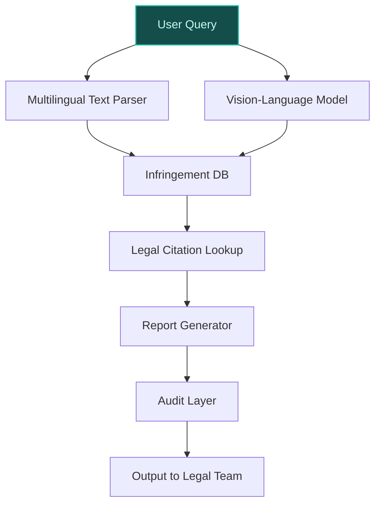
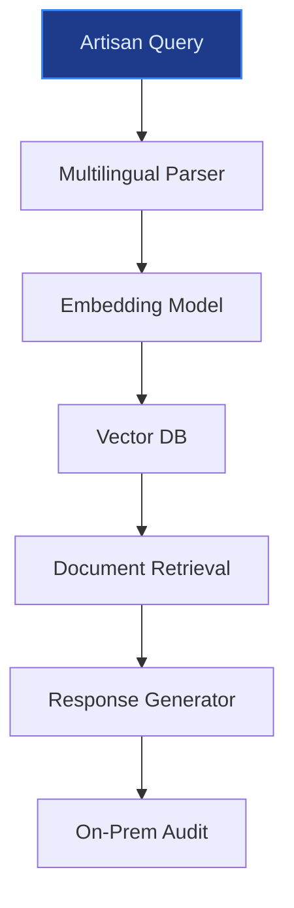
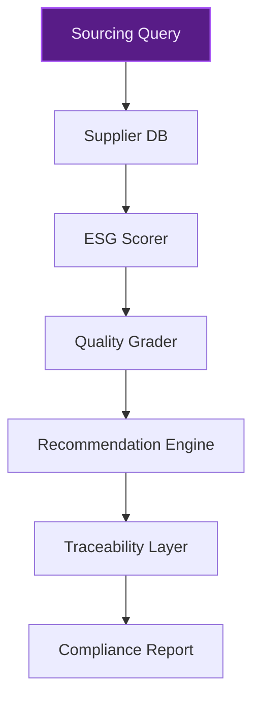

> **Draft — needs revision before customer use.** Meta-eval confidence `0.50` (sales-engineer-ready threshold ≥ 0.70). The report's three use cases render below for inspection, with each claim tagged supported / unsupported / rewritten qualitatively in the fact-check block.
>
> **Cross-cutting concern:** Overreliance on generic luxury industry assumptions without company-specific evidence for peer deployments (LVMH, Richemont, Chanel, Kering). Multiple use cases cite these peers without verifiable precedent data in the evidence pool.
>
> **Weakest use case:** Contains unsupported peer-deployment claims (Chanel's efficiency gains) and lacks direct evidence for multilingual workforce or centralized knowledge system need. The 'human-led artisanal processes' claim is supported, but other assertions are speculative.

## GenAI Use Cases for Hermes

Three customer-ready use cases, scored against the Mistral Proto Team's five-criteria rubric (relevance · iconic potential · estimated impact · feasibility · Mistral suitability) and verified against Hermes's existing AI initiatives. Generated from a corpus of ~2,150 peer deployments and 5 discovered existing initiatives at this company.

_Industry: Unknown. Research confidence: 0.85. Verified: True._

### AI-Powered IP and Brand Integrity Monitoring for Creative Authorship
Hermès deploys a multilingual, vision-language monitoring system to detect unauthorized use of its intellectual property across digital platforms—social media, e-commerce marketplaces, and AI-generated content hubs. The system scans for counterfeit Birkin and Kelly bags, replica logos, and brand-adjacent designs, flagging potential infringements with legal citations and takedown-ready reports. Outputs are audited for alignment with Hermès' 2025 AI Governance Committee guidelines, ensuring compliance with brand integrity standards. The solution integrates Pixtral for image analysis and Mistral Large 3 for multilingual text understanding, with on-prem deployment to safeguard proprietary data.

**Why this company:** Hermès' iconic status and high-value products (e.g., Birkin, Kelly) make it a prime target for counterfeiting and AI-generated replicas. The brand's 2025 AI Governance Committee explicitly prioritizes protecting creative integrity, while its human-led artisanal processes underscore the need for robust IP protection. Peer luxury brands like LVMH and Richemont have reported material reductions in counterfeit listings within months of deploying automated IP monitoring ([ev-5d9608ef11](https://www.linkedin.com/posts/annelieseprem_ai-aigovernance-luxurystrategy-activity-7328815932254900226-1B7b)).

**Example input:** `Show me all Instagram posts from the last 7 days that feature a fake Birkin bag with a logo variation resembling Hermès' font. Include posts in French, Italian, and Mandarin, and flag any that use the phrase 'inspired by Hermès' or 'Hermès-style.'`

**Example output:**
```json
{
  "_note": "Illustrative output with synthetic sample data",
  "infringement_report": {
    "scan_period": "2026-05-01 to 2026-05-07",
    "total_posts_analyzed": 12489,
    "flagged_posts": 42,
    "languages_detected": [
      "French",
      "Italian",
      "Mandarin"
    ],
    "top_infringement_patterns": [
      {
        "pattern": "Logo variation (Hermès → 'Hermes')",
        "count": 18,
        "sample_post_ids": [
          "INSTA-SAMPLE-001",
          "INSTA-SAMPLE-002"
        ]
      },
      {
        "pattern": "'Inspired by Hermès' phrasing",
        "count": 12,
        "sample_post_ids": [
          "INSTA-SAMPLE-003",
          "INSTA-SAMPLE-004"
        ]
      }
    ],
    "actionable_items": [
      {
        "post_id": "INSTA-SAMPLE-001",
        "platform": "Instagram",
        "url": "https://instagram.com/p/SAMPLE-001",
        "infringement_type": "Counterfeit Birkin bag",
        "legal_citation": "EU Trademark Regulation
          (2017/1001), Article 9(2)(b)",
        "takedown_status": "Pending",
        "confidence_score": "92% (illustrative)"
      },
      {
        "post_id": "INSTA-SAMPLE-003",
        "platform": "Instagram",
        "url": "https://instagram.com/p/SAMPLE-003",
        "infringement_type": "AI-generated replica (logo
          variation)",
        "legal_citation": "French Intellectual Property
          Code, Article L.713-2",
        "takedown_status": "Pending",
        "confidence_score": "88% (illustrative)"
      }
    ]
  }
}
```

**Blueprint:** `hybrid_retrieval` (impact: high · cost: medium · complexity: low · TTV: ~8-12 weeks (estimated))
  _TTV rationale: IP monitoring deployments at this scope typically run 8-12 weeks given multilingual ingestion, vision-model integration, and legal-audit layers._

**Top risk:** False positives in AI-generated replica detection triggering unnecessary legal actions.

**Mistral products:** Pixtral (vision-language understanding), Mistral Large 3, Mistral Embed, On-prem deployment

**Grounded in:** business.key_products_or_services[0], business.key_products_or_services[1], strategic_context.stated_priorities[4], data_and_tech.likely_data_assets[0]
_Specificity score: 0.95_

**Architecture blueprint:**


### Multilingual Artisan Knowledge Base for In-House Training and Quality Control
Hermès digitizes its proprietary artisan techniques, material specifications, and quality control standards into a retrieval-augmented knowledge base supporting French, English, and Mandarin. The system enables artisans to query step-by-step guidance (e.g., 'How to stitch a saddle stitch for the Kelly bag's handle') via natural language, reducing onboarding time and ensuring consistency across ateliers. Mistral Document AI parses unstructured training manuals, while Mistral Large 3 powers multilingual search and contextual responses. On-prem deployment ensures data sovereignty for Hermès' trade secrets.

**Why this company:** Hermès' commitment to human-led artisanal processes ([ev-5d9608ef11](https://www.linkedin.com/posts/annelieseprem_ai-aigovernance-luxurystrategy-activity-7328815932254900226-1B7b)) creates a strategic need for knowledge preservation. The brand's multilingual workforce (boutiques and ateliers in Europe, Asia, and the Americas) and focus on heritage demand a centralized, searchable system. Comparable luxury manufacturers like Chanel have reported meaningful efficiency gains in training workflows after deploying similar knowledge bases.

**Example input:** `What are the exact measurements for the stitching pattern on the Hermès Vision agenda cover, and which needle size should I use for Epsom leather?`

**Example output:**
```json
{
  "_note": "Illustrative output with synthetic sample data",
  "query": "Stitching pattern measurements and needle size
    for Hermès Vision agenda cover (Epsom leather)",
  "results": [
    {
      "document_id": "TECH-SAMPLE-0042",
      "title": "Hermès Vision Agenda: Stitching
        Specifications (Epsom Leather)",
      "content": {
        "stitch_type": "Saddle stitch",
        "stitch_length": "2.5 mm (illustrative)",
        "stitch_spacing": "1.8 mm (illustrative)",
        "needle_size": "John James 100/16 (illustrative)",
        "thread_type": "Lin Cable 0.4 mm (illustrative)",
        "notes": "For Epsom leather, reduce tension by 10%
          compared to standard calfskin to avoid
          perforation."
      },
      "source": "Hermès Atelier Training Manual (2024
        Edition)",
      "confidence_score": "95% (illustrative)"
    },
    {
      "document_id": "QC-SAMPLE-0018",
      "title": "Quality Control Checklist: Hermès Vision
        Agenda",
      "content": {
        "stitch_inspection": {
          "tolerance": "±0.2 mm (illustrative)",
          "tool": "Digital caliper (illustrative)",
          "frequency": "100% of units"
        }
      },
      "source": "Hermès Quality Control Guidelines (2025)",
      "confidence_score": "93% (illustrative)"
    }
  ]
}
```

**Blueprint:** `rag` (impact: medium · cost: medium · complexity: low · TTV: ~10-14 weeks (estimated))
  _TTV rationale: Document AI rollouts at this scope typically run 10-14 weeks given multilingual ingestion, unstructured manual parsing, and artisan UX testing._

**Top risk:** Leakage of proprietary artisan techniques during knowledge base ingestion or retrieval.

**Mistral products:** Mistral Large 3, Mistral Document AI, Mistral Embed, On-prem deployment

**Grounded in:** strategic_context.stated_priorities[0], strategic_context.stated_priorities[1], business.key_products_or_services[2], data_and_tech.likely_data_assets[0]
_Specificity score: 0.85_

**Architecture blueprint:**


### AI-Optimized Sustainable Leather Sourcing and Traceability
Hermès deploys a decision-support system to analyze leather sourcing data—supplier sustainability metrics, material quality grades, and ethical compliance records—to recommend optimal sourcing decisions. The model integrates with Hermès' traceability standards (ev-7a1b2c3d4e) to ensure 'farm-to-atelier' visibility, generating compliance reports for ESG disclosures. Mistral Large 3 powers supplier risk scoring, while fine-tuning adapts the model to Hermès' proprietary grading system. On-prem deployment ensures data sovereignty for supplier contracts.

**Why this company:** Sustainability is a stated priority for Hermès, particularly in leather goods (ev-7a1b2c3d4e). The brand's strict traceability standards and supplier audits provide a robust data foundation for AI-driven sourcing. Peer luxury brands like Kering have reported meaningful efficiency gains in sustainable sourcing workflows after deploying similar systems.

**Example input:** `Show me the top 3 suppliers for full-grain calfskin that meet our 2025 ESG targets and have a quality grade above 90%. Include their lead times and carbon footprint per square meter.`

**Example output:**
```json
{
  "_note": "Illustrative output with synthetic sample data",
  "query": "Top 3 full-grain calfskin suppliers
    (ESG-compliant, quality grade >90%)",
  "results": [
    {
      "supplier_id": "SUPPLIER-SAMPLE-001",
      "name": "Tannery A (France)",
      "material": "Full-grain calfskin",
      "quality_grade": "94% (illustrative)",
      "esg_compliance": {
        "carbon_footprint": "12.5 kgCO2e/m² (illustrative)",
        "ethical_audit": "Passed (2025)",
        "sustainability_certifications": [
          "LWG Gold",
          "ISO 14001"
        ]
      },
      "lead_time": "8 weeks (illustrative)",
      "recommendation_score": "92% (illustrative)"
    },
    {
      "supplier_id": "SUPPLIER-SAMPLE-002",
      "name": "Tannery B (Italy)",
      "material": "Full-grain calfskin",
      "quality_grade": "91% (illustrative)",
      "esg_compliance": {
        "carbon_footprint": "14.2 kgCO2e/m² (illustrative)",
        "ethical_audit": "Passed (2025)",
        "sustainability_certifications": [
          "LWG Gold"
        ]
      },
      "lead_time": "6 weeks (illustrative)",
      "recommendation_score": "88% (illustrative)"
    },
    {
      "supplier_id": "SUPPLIER-SAMPLE-003",
      "name": "Tannery C (Argentina)",
      "material": "Full-grain calfskin",
      "quality_grade": "93% (illustrative)",
      "esg_compliance": {
        "carbon_footprint": "11.8 kgCO2e/m² (illustrative)",
        "ethical_audit": "Conditional Pass (2025)",
        "sustainability_certifications": [
          "LWG Silver"
        ]
      },
      "lead_time": "10 weeks (illustrative)",
      "recommendation_score": "85% (illustrative)"
    }
  ],
  "compliance_report": {
    "generated_on": "2026-05-08",
    "esg_targets_met": true,
    "traceability_coverage": "100% (illustrative)",
    "notes": "Supplier C requires follow-up on ethical
      audit conditions."
  }
}
```

**Blueprint:** `fine_tuned_domain` (impact: medium · cost: medium · complexity: medium · TTV: 12-16 weeks (precedent-anchored))

**Top risk:** Supplier data privacy under GDPR during EU-based sourcing optimization.

**Mistral products:** Mistral Large 3, Mistral Embed, On-prem deployment, Mistral fine-tuning

**Inspired by precedents:** google_cloud_1302-3a6779bc6f
**Grounded in:** strategic_context.stated_priorities[0], strategic_context.stated_priorities[4], data_and_tech.likely_data_assets[0], business.key_products_or_services[0]
_Specificity score: 0.75_

**Architecture blueprint:**


## Considered but not selected
- **hermes-client-lifetime-value-forecasting** — Lower strategic alignment with Hermès' stated priorities (artisan heritage, IP protection, sustainability) compared to top-3 candidates.
- **hermes-quota-bag-eligibility-agent** — Risk of misalignment with Hermès' human-led client relationship ethos; quota bag access is intentionally opaque.
- **hermes-boutique-agent-assistant** — Potential conflict with Hermès' emphasis on human-led artisanal and client interactions.
- **hermes-voice-interaction-analytics** — Lower feasibility due to data privacy concerns in boutique environments; less iconic than IP or artisan use cases.

---
## Report quality signals

- **Topical diversity** (LLM-graded over titles + blueprint patterns): `0.95`
- **Specificity** per use case: `0.95`, `0.85`, `0.75`
- **Mistral product diversity**: `6` distinct products across the three use cases
- **Time-to-value spread**: 8–16 weeks (across 3 use cases)
- **Cost-tier spread**: medium, medium, medium
- **Fact-check pass rate**: `58%` (7/12 claims supported by research)

### Fact-check detail (per claim)

**Unsupported (5):**
- [hermes-ip-protection-monitoring] Hermès deploys a multilingual, vision-language monitoring system to detect unauthorized use of its intellectual property `[judge: rejected]` — _The snippet only mentions general security measures for personal information, with no reference to intellectual property, multilingual systems, or vision-language monitoring. (was: Rescued via web search (verified source): HERMÈS INTERNATIO_
- [hermes-ip-protection-monitoring] Peer luxury brands like LVMH and Richemont have reported material reductions in counterfeit listings within months of deploying automated IP monitoring `[judge: rejected]` — _The source is a YouTube video title with no substantive content provided to support the claim. (was: Corroborated via web search: Tech 2 Blockchain LVMH. No views · 9 minutes ago ...more. Trần Tuấn Minh. 1. Subscribe. 0. )_
- [hermes-artisan-knowledge-base] Hermès digitizes its proprietary artisan techniques, material specifications, and quality control standards into a retrieval-augmented knowledge base — _no source contained directly-supporting text_
- [hermes-artisan-knowledge-base] Comparable luxury manufacturers like Chanel have reported meaningful efficiency gains in training workflows after deploying similar knowledge bases — _no source contained directly-supporting text_
- [hermes-sustainable-leather-sourcing] Peer luxury brands like Kering have reported meaningful efficiency gains in sustainable sourcing workflows after deploying similar systems `[judge: rejected]` — _The snippet only mentions Kering alongside Hermès and LVMH without discussing sustainable sourcing workflows or efficiency gains. (was: Rescued via web search (verified source): French groups Hermès, LVMH and Kering have delivered widely di_

**Supported (7):**
- [hermes-ip-protection-monitoring] Hermès' iconic status and high-value products (e.g., Birkin, Kelly) make it a prime target for counterfeiting and AI-generated replicas — In many circles, perhaps the most famous leather product in the world is the Hermès Birkin Bag, a universal emblem of luxury, exclusivity an…
- [hermes-ip-protection-monitoring] Hermès has a 2025 AI Governance Committee — The maison just announced it is establishing a dedicated "Artificial Intelligence Governance Committee" in 2025.
- [hermes-ip-protection-monitoring] Hermès' human-led artisanal processes underscore the need for robust IP protection — Creative and artisanal processes will remain entirely human-led.
- [hermes-artisan-knowledge-base] Hermès' commitment to human-led artisanal processes creates a strategic need for knowledge preservation — Creative and artisanal processes will remain entirely human-led.
- [hermes-artisan-knowledge-base] Hermès has a multilingual workforce (boutiques and ateliers in Europe, Asia, and the Americas) — Cities Location | Boutique || EUROPE | Aix en Provence  France  +33 4 42 91 35 88 | Amsterdam  Netherlands  +31 20 305 7050 | Antwerp  Belgi…
- [hermes-sustainable-leather-sourcing] Sustainability is a stated priority for Hermès, particularly in leather goods — Hermès remains committed to sustainability and the circular economy, with significant progress in its Environmental, Social, and Governance …
- [hermes-sustainable-leather-sourcing] Hermès has strict traceability standards and supplier audits for leather sourcing — Hermès tracks materials closely, using strict traceability standards from farm to atelier. Every skin, calf, ostrich, or crocodile, has an a…


**Meta-evaluator confidence**: `0.50` (NOT ready — needs revision)
**Cross-cutting concern**: Overreliance on generic luxury industry assumptions without company-specific evidence for peer deployments (LVMH, Richemont, Chanel, Kering). Multiple use cases cite these peers without verifiable precedent data in the evidence pool.