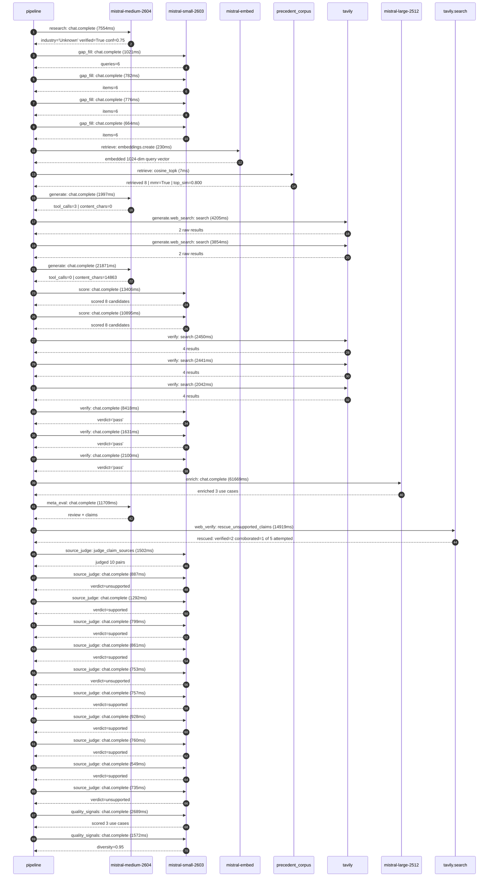

# Trace

## Execution trace — Hermes

Started: `2026-05-10T22:58:35.116306+00:00`. Total wall time: `178.1s` across `35` recorded actions.

### Per-step time totals

| Step | Calls | Total time | Avg time |
|---|---:|---:|---:|
| `research` | 1 | 7.55s | 7554ms |
| `gap_fill` | 4 | 3.24s | 811ms |
| `retrieve` | 2 | 0.24s | 118ms |
| `generate` | 2 | 23.87s | 11934ms |
| `generate.web_search` | 2 | 8.06s | 4029ms |
| `score` | 2 | 24.30s | 12150ms |
| `verify` | 6 | 19.08s | 3180ms |
| `enrich` | 1 | 61.67s | 61669ms |
| `meta_eval` | 1 | 11.71s | 11709ms |
| `web_verify` | 1 | 14.92s | 14919ms |
| `source_judge` | 11 | 9.82s | 893ms |
| `quality_signals` | 2 | 4.26s | 2131ms |

### Chronological event log

- `22:58:36.333` **[research]** `mistral-medium-2604.chat.complete` — 7554ms
   - inputs: synthesize CompanyContext for Hermes | depth=medium
   - outputs: industry='Unknown' verified=True conf=0.75
- `22:58:43.888` **[gap_fill]** `mistral-small-2603.chat.complete` — 1021ms
   - inputs: generate gap queries | fields=['industry', 'geography', 'business_model', 'products', 'data_assets', 'priorities']
   - outputs: queries=6
- `22:58:53.115` **[gap_fill]** `mistral-small-2603.chat.complete` — 782ms
   - inputs: layer-2 extract field=priorities
   - outputs: items=6
- `22:58:53.120` **[gap_fill]** `mistral-small-2603.chat.complete` — 776ms
   - inputs: layer-2 extract field=data_assets
   - outputs: items=6
- `22:58:53.124` **[gap_fill]** `mistral-small-2603.chat.complete` — 664ms
   - inputs: layer-2 extract field=products
   - outputs: items=6
- `22:58:53.899` **[retrieve]** `mistral-embed.embeddings.create` — 230ms
   - inputs: company_query | industries='Unknown'
   - outputs: embedded 1024-dim query vector
- `22:58:54.129` **[retrieve]** `precedent_corpus.cosine_topk` — 7ms
   - inputs: k=8 min_depth=0.4 target='Hermes'
   - outputs: retrieved 8 | mmr=True | top_sim=0.800
- `22:58:55.901` **[generate]** `mistral-medium-2604.chat.complete` — 1997ms
   - inputs: iteration=0 tool_calls_used=0/2 tools=on
   - outputs: tool_calls=3 | content_chars=0
- `22:58:57.918` **[generate.web_search]** `tavily.search` — 4205ms
   - inputs: query='Hermès luxury brand 2025 AI governance committee official announcement'
   - outputs: 2 raw results
- `22:59:04.493` **[generate.web_search]** `tavily.search` — 3854ms
   - inputs: query='Hermès Birkin Kelly bag quota system official policy 2025'
   - outputs: 2 raw results
- `22:59:10.012` **[generate]** `mistral-medium-2604.chat.complete` — 21871ms
   - inputs: iteration=1 tool_calls_used=2/2 tools=off
   - outputs: tool_calls=0 | content_chars=14863
- `22:59:32.127` **[score]** `mistral-small-2603.chat.complete` — 13406ms
   - inputs: self-consistency pass T=0.2
   - outputs: scored 8 candidates
- `22:59:32.132` **[score]** `mistral-small-2603.chat.complete` — 10895ms
   - inputs: self-consistency pass T=0.4
   - outputs: scored 8 candidates
- `22:59:45.565` **[verify]** `tavily.search` — 2450ms
   - inputs: candidate=hermes-ip-protection-monitoring | query='Hermes AI-Powered IP and Brand Integrity Monitoring for Crea'
   - outputs: 4 results
- `22:59:45.565` **[verify]** `tavily.search` — 2441ms
   - inputs: candidate=hermes-artisan-knowledge-base | query='Hermes Multilingual Artisan Knowledge Base for In-House Trai'
   - outputs: 4 results
- `22:59:45.565` **[verify]** `tavily.search` — 2042ms
   - inputs: candidate=hermes-sustainable-leather-sourcing | query='Hermes AI-Optimized Sustainable Leather Sourcing and Traceab'
   - outputs: 4 results
- `22:59:47.900` **[verify]** `mistral-small-2603.chat.complete` — 8418ms
   - inputs: verdict for hermes-sustainable-leather-sourcing
   - outputs: verdict='pass'
- `22:59:48.296` **[verify]** `mistral-small-2603.chat.complete` — 1631ms
   - inputs: verdict for hermes-artisan-knowledge-base
   - outputs: verdict='pass'
- `22:59:48.750` **[verify]** `mistral-small-2603.chat.complete` — 2100ms
   - inputs: verdict for hermes-ip-protection-monitoring
   - outputs: verdict='pass'
- `22:59:56.321` **[enrich]** `mistral-large-2512.chat.complete` — 61669ms
   - inputs: tier=standard parallel=False ids=['hermes-ip-protection-monitoring', 'hermes-artisan-knowledge-base', 'hermes-sustainable-leather-sourcing']
   - outputs: enriched 3 use cases
- `23:00:58.026` **[meta_eval]** `mistral-medium-2604.chat.complete` — 11709ms
   - inputs: reviewing 3 use cases
   - outputs: review + claims
- `23:01:09.757` **[web_verify]** `tavily.search.rescue_unsupported_claims` — 14919ms
   - inputs: company='Hermes' unsupported=5 budget=12
   - outputs: rescued: verified=2 corroborated=1 of 5 attempted
- `23:01:24.678` **[source_judge]** `mistral-small-2603.judge_claim_sources` — 1502ms
   - inputs: pairs=10
   - outputs: judged 10 pairs
- `23:01:24.678` **[source_judge]** `mistral-small-2603.chat.complete` — 887ms
   - inputs: claim='Hermès deploys a multilingual, vision-language monitoring sy'
   - outputs: verdict=unsupported
- `23:01:24.680` **[source_judge]** `mistral-small-2603.chat.complete` — 1292ms
   - inputs: claim="Hermès' iconic status and high-value products (e.g., Birkin,"
   - outputs: verdict=supported
- `23:01:24.682` **[source_judge]** `mistral-small-2603.chat.complete` — 799ms
   - inputs: claim='Hermès has a 2025 AI Governance Committee'
   - outputs: verdict=supported
- `23:01:24.683` **[source_judge]** `mistral-small-2603.chat.complete` — 861ms
   - inputs: claim="Hermès' human-led artisanal processes underscore the need fo"
   - outputs: verdict=supported
- `23:01:24.685` **[source_judge]** `mistral-small-2603.chat.complete` — 753ms
   - inputs: claim='Peer luxury brands like LVMH and Richemont have reported mat'
   - outputs: verdict=unsupported
- `23:01:24.688` **[source_judge]** `mistral-small-2603.chat.complete` — 757ms
   - inputs: claim="Hermès' commitment to human-led artisanal processes creates "
   - outputs: verdict=supported
- `23:01:24.689` **[source_judge]** `mistral-small-2603.chat.complete` — 928ms
   - inputs: claim='Hermès has a multilingual workforce (boutiques and ateliers '
   - outputs: verdict=supported
- `23:01:24.691` **[source_judge]** `mistral-small-2603.chat.complete` — 760ms
   - inputs: claim='Sustainability is a stated priority for Hermès, particularly'
   - outputs: verdict=supported
- `23:01:25.438` **[source_judge]** `mistral-small-2603.chat.complete` — 549ms
   - inputs: claim='Hermès has strict traceability standards and supplier audits'
   - outputs: verdict=supported
- `23:01:25.445` **[source_judge]** `mistral-small-2603.chat.complete` — 735ms
   - inputs: claim='Peer luxury brands like Kering have reported meaningful effi'
   - outputs: verdict=unsupported
- `23:01:28.984` **[quality_signals]** `mistral-small-2603.chat.complete` — 2689ms
   - inputs: specificity grade (3 use cases)
   - outputs: scored 3 use cases
- `23:01:31.673` **[quality_signals]** `mistral-small-2603.chat.complete` — 1572ms
   - inputs: diversity grade
   - outputs: diversity=0.95

## Mermaid sequence

