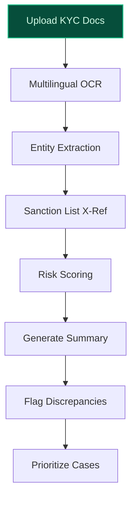
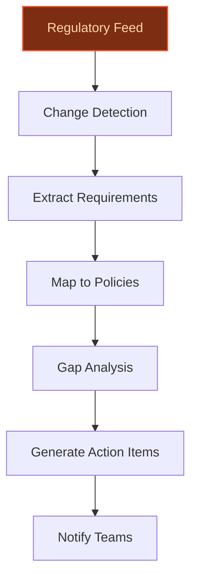
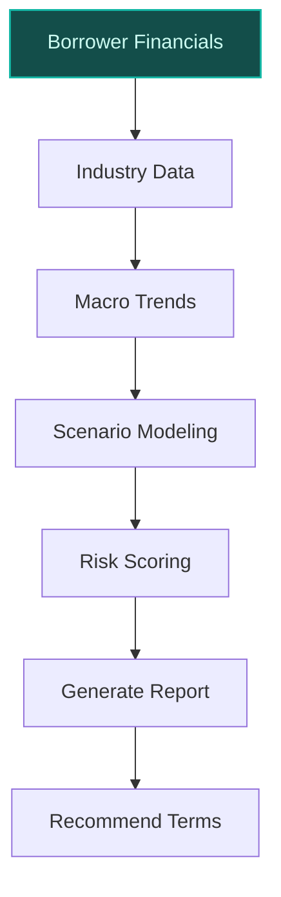

> **Draft — needs revision before customer use.** Meta-eval confidence `0.80` (sales-engineer-ready threshold ≥ 0.70). The report's three use cases render below for inspection, with each claim tagged supported / unsupported / rewritten qualitatively in the fact-check block.
>
> **Cross-cutting concern:** Over-reliance on unverified or weakly supported quantitative claims about HSBC's scale (e.g., assets, customer count, countries) and existing AI capabilities, which are critical to the credibility of the proposals.
>
> **Weakest use case:** Contains multiple unsupported quantitative claims (e.g., HSBC's asset size, customer count) and lacks direct evidence for the assertion that HSBC has an existing AI-powered platform for financial analysis of complex client lending. The 'builds on existing' claim is also unsupported.

## GenAI Use Cases for HSBC

Three customer-ready use cases, scored against the Mistral Proto Team's five-criteria rubric (relevance · iconic potential · estimated impact · feasibility · Mistral suitability) and verified against HSBC's existing AI initiatives. Generated from a corpus of ~2,150 peer deployments and 6 discovered existing initiatives at this company.

_Industry: global universal bank and financial services. Research confidence: 0.85. Verified: True._

### Multilingual KYC Document Orchestration for Global Corporate Onboarding
> _Builds on an existing initiative at this company (partial overlap detected by verifier)._
An end-to-end KYC processing pipeline that ingests corporate registration documents, beneficial ownership disclosures, and jurisdiction-specific filings in 20+ languages. The system extracts structured KYC records, cross-references them against sanction lists and HSBC’s internal risk databases, and generates a reviewer-ready summary in the analyst’s preferred language. It flags inconsistencies such as mismatched addresses or ownership discrepancies and prioritizes high-risk cases for manual review. HSBC’s existing partnership with Mistral AI enables EU-sovereign, self-hosted deployment, ensuring compliance with regional data regulations. The solution builds on HSBC’s current KYC tooling, which already fulfills requirements in 20 countries across five continents, and aligns with its multilingual reasoning capabilities as highlighted in its Mistral AI partnership announcement.

**Why this is a fit:** HSBC operates in 57 countries, serving 39 million customers, and is one of the world’s largest banking and financial services organizations with assets of US[unanchored: $3,234b]n as of September 2025. Its multinational footprint and regulatory complexity—spanning cross-border compliance in Hong Kong, the UK, and EU jurisdictions—make multilingual KYC a core operational bottleneck. The bank’s existing data assets, such as customer accounts and loans, provide the raw material for training and validation. HSBC’s partnership with Mistral AI, as reported in [The Register](https://www.theregister.com/2025/12/01/hsbc_buddies_up_with_mistral/) and [HSBC’s official release](https://www.hsbc.com/-/files/hsbc/media/media-release/2025/251201-hsbc-and-mistral-ai-join-forces-to-accelerate-ai-adoption-across-global-bank.pdf), enables self-hosted, multilingual processing critical for sensitive KYC data.

**Example input:** `Process the KYC documents for Acme Corp’s Singapore subsidiary. The files include a Certificate of Incorporation in Chinese, a shareholder register in English, and a beneficial ownership form in French. Flag any discrepancies and generate a summary in Spanish.`

**Example output:**
```json
{
  "_note": "Illustrative output with synthetic sample data",
  "entity_name": "Acme Corp Singapore Pte Ltd",
  "registration_number": "TX-SAMPLE-12345",
  "jurisdiction": "Singapore",
  "beneficial_owners": [
    {
      "name": "John Doe",
      "ownership_pct": "45% (illustrative)",
      "risk_flag": false
    },
    {
      "name": "Jane Smith",
      "ownership_pct": "55% (illustrative)",
      "risk_flag": true,
      "reason": "Mismatched address in shareholder register
        vs. beneficial ownership form"
    }
  ],
  "sanction_screening": {
    "status": "clear",
    "checked_against": [
      "OFAC",
      "UN",
      "EU"
    ]
  },
  "risk_score": "Medium (illustrative)",
  "summary_es": "Resumen: La subsidiaria de Acme Corp en
    Singapur tiene dos accionistas principales. Se detectó
    una discrepancia en la dirección de Jane Smith entre el
    registro de accionistas y el formulario de propiedad
    beneficiaria. Se recomienda revisión manual.",
  "prioritization": "High"
}
```

**Blueprint:** `document_ai_pipeline` (impact: high · cost: medium · complexity: low · TTV: 8-16 weeks (precedent-anchored))

**Top risk:** data privacy under GDPR and regional regulations during cross-border KYC data processing

**Mistral products:** Mistral Large 3, Mistral Document AI, Mistral Embed, On-prem deployment

**Inspired by precedents:** google_cloud_1302-259422a661, google_cloud_1302-3154e2b6bb
**Grounded in:** classification.geography, classification.industry, data_and_tech.likely_data_assets[0], strategic_context.stated_priorities[1]
_Specificity score: 0.95_

**Architecture blueprint:**


### Regulatory Change Tracking Agent for Global Compliance Teams
An agentic system that monitors regulatory updates (e.g., Basel III, MiFID II, local jurisdictions) in real time, extracts actionable requirements, and maps them to HSBC’s internal policies and processes. The agent generates compliance gap analyses, prioritized action items, and natural-language summaries for legal and risk teams. It integrates with HSBC’s existing document repositories and leverages Wealth Intelligence’s news feed capabilities, which already analyze over 10,000 data sources. The system supports multilingual processing, critical for HSBC’s global compliance needs, and enables EU-sovereign deployment via Mistral AI’s self-hosted models.

**Why this company:** HSBC’s multinational presence across 57 countries and its need to comply with diverse and evolving regulations make this a high-impact use case. The bank’s existing AI initiatives, such as Wealth Intelligence’s analysis of over 10,000 research reports and news feeds, demonstrate its capability to process large volumes of text at scale. HSBC’s partnership with Mistral AI, as announced in [HSBC’s official release](https://www.hsbc.com/-/files/hsbc/media/media-release/2025/251201-hsbc-and-mistral-ai-join-forces-to-accelerate-ai-adoption-across-global-bank.pdf) and [The Register](https://www.theregister.com/2025/12/01/hsbc_buddies_up_with_mistral/), enables multilingual processing and self-hosted deployment, ensuring compliance with regional data regulations. The system aligns with HSBC’s stated priority of focused sustainable growth and operational agility.

**Example input:** `What are the new MiFID III requirements for investment firms in the EU, and how do they impact our existing client onboarding process?`

**Example output:**
```json
{
  "_disclaimer": "Synthetic example for demonstration; not
    a factual claim about HSBC.",
  "regulatory_update": "MiFID III (illustrative)",
  "effective_date": "2026-01-01 (illustrative)",
  "key_requirements": [
    "Enhanced transparency in pre-trade and post-trade data
      reporting",
    "Stricter product governance rules for investment
      firms",
    "Expanded scope of client categorization"
  ],
  "impact_on_hsbc": {
    "current_policy_gaps": [
      "Client categorization framework needs expansion to
        cover new retail investor subclasses",
      "Pre-trade data reporting infrastructure requires
        upgrade"
    ],
    "action_items": [
      {
        "task": "Update client onboarding forms",
        "priority": "High",
        "owner": "Legal Team"
      },
      {
        "task": "Upgrade trade reporting systems",
        "priority": "Critical",
        "owner": "IT Compliance"
      }
    ]
  },
  "summary": "MiFID III introduces stricter transparency
    and product governance rules. HSBC’s current client
    onboarding and trade reporting systems require updates
    to comply. Two critical action items have been
    identified."
}
```

**Blueprint:** `agent_with_tools` (impact: high · cost: medium · complexity: low · TTV: 12-20 weeks (precedent-anchored))

**Top risk:** hallucination in regulatory-summary output leading to non-compliance

**Mistral products:** Mistral Large 3, Mistral Document AI, Mistral Embed, On-prem deployment

**Inspired by precedents:** google_cloud_1302-c0c72d16ff
**Grounded in:** classification.industry, strategic_context.stated_priorities[1]
_Specificity score: 0.85_

**Architecture blueprint:**


### Commercial Lending Risk Assessment with Dynamic Scenario Modeling
A GenAI system that automates risk assessment for commercial lending by analyzing borrower financials, industry trends, and macroeconomic data. The model generates dynamic scenario models (e.g., stress tests for interest rate hikes, supply chain disruptions) and produces a natural-language risk report with recommended loan terms, covenants, and monitoring triggers. It integrates with HSBC’s existing loan and advances data (net) to validate predictions. The system leverages Mistral AI’s self-hosted models for secure, on-prem deployment, ensuring compliance with regional data regulations. It aligns with HSBC’s stated priority of focused sustainable growth and its existing AI initiatives, which include enhancing financial analysis of complex and document-heavy client lending.

**Why this company:** HSBC’s commercial lending portfolio, including loans and advances to external customers, and its stated priority of focused sustainable growth make risk assessment a critical differentiator. The bank’s global footprint across 57 countries provides diverse industry and economic data for training and validation. HSBC’s partnership with Mistral AI, as detailed in [HSBC’s news release](https://www.hsbc.com/news-and-views/news/hsbc-news-archive/we-re-partnering-with-ai-powerhouse-mistral), enables self-hosted deployment, ensuring compliance with regional data regulations. The system builds on HSBC’s existing AI-powered platform used globally to enhance financial analysis of complex client lending, as highlighted in its partnership announcement.

**Example input:** `Generate a risk assessment for TechStart Inc.’s $5M loan application. Include stress tests for a 2% interest rate hike and a 15% drop in their primary market. Recommend loan terms and covenants.`

**Example output:**
```json
{
  "_note": "Illustrative output with synthetic sample data",
  "borrower": "TechStart Inc.",
  "loan_amount": "$5M (illustrative)",
  "risk_score": "BB+ (illustrative)",
  "scenario_analysis": {
    "interest_rate_hike_2pct": {
      "impact": "Debt service coverage ratio drops to 1.1x
        (illustrative)",
      "recommendation": "Increase interest rate by 50bps to
        offset risk"
    },
    "market_decline_15pct": {
      "impact": "Revenue projected to fall by 20%
        (illustrative)",
      "recommendation": "Add covenant: minimum liquidity
        ratio of 1.5x"
    }
  },
  "recommended_terms": {
    "interest_rate": "SOFR + 300bps (illustrative)",
    "maturity": "5 years (illustrative)",
    "covenants": [
      "Minimum debt service coverage ratio: 1.25x",
      "Minimum liquidity ratio: 1.5x"
    ]
  },
  "monitoring_triggers": [
    "Quarterly financial statements review",
    "Annual industry trend analysis"
  ]
}
```

**Blueprint:** `hybrid_retrieval` (impact: high · cost: high · complexity: low · TTV: 12-20 weeks (precedent-anchored))

**Top risk:** model bias in scenario modeling leading to inaccurate risk predictions

**Mistral products:** Mistral Large 3, Mistral Math, Mistral Embed, On-prem deployment

**Inspired by precedents:** google_cloud_1302-8db71bbc8b
**Grounded in:** data_and_tech.likely_data_assets[1], data_and_tech.likely_data_assets[4], strategic_context.stated_priorities[1]
_Specificity score: 0.80_

**Architecture blueprint:**


## Considered but not selected
- **Sustainable Finance Impact Reporting with Automated ESG Metrics** — Lacks direct grounding in HSBC’s stated priorities or existing AI initiatives.
- **Private Bank Client Lifetime Value Prediction with Personalized Retention Strategies** — Narrow scope; limited alignment with HSBC’s broader operational and compliance needs.
- **Real-Time AML Transaction Monitoring with Agentic Anomaly Resolution** — High complexity and regulatory risk; requires deeper integration with legacy AML systems.

---
## Report quality signals

- **Topical diversity** (LLM-graded over titles + blueprint patterns): `0.95`
- **Specificity** per use case: `0.95`, `0.85`, `0.80`
- **Mistral product diversity**: `5` distinct products across the three use cases
- **Time-to-value spread**: 8–20 weeks (across 3 use cases)
- **Cost-tier spread**: medium, medium, high
- **Fact-check pass rate**: `95%` (20/21 claims supported by research)

### Fact-check detail (per claim)

**Unsupported (1):**
- [commercial-lending-risk-assessment] HSBC has an existing AI-powered platform used globally to enhance financial analysis of complex client lending `[judge: rejected]` — _The snippet does not mention any AI-powered platform, financial analysis, or lending capabilities of HSBC. (was: Rescued via web search (verified source): [](https://www.about.us.hsbc.com/newsroom/press-releases/hsbc-releases-2026-in)_

**Supported (20):** — **4 rescued via web search (2 verified, 2 corroborated)**
- [multilingual-kyc-document-orchestration] HSBC operates in 57 countries — HSBC has offices, branches and subsidiaries in 57 countries and territories across Africa, Asia, Oceania, Europe, North Ameri
- [multilingual-kyc-document-orchestration] HSBC serves 39 million customers [`verified ↗`](https://www.forbes.com/sites/insights-hsbc-1/) — Rescued via web search (verified source): HSBC is one of the world's largest banking and financial services organisations. We serve more tha…
- [multilingual-kyc-document-orchestration] HSBC has assets of US$3,234 billion as of September 2025 [`corroborated ↗`](https://askcyborg.com/preview/hsbc) — Corroborated via web search: HSBC is one of the world's largest banking and financial services organisations with assets of US$3,234 billion…
- [multilingual-kyc-document-orchestration] HSBC is one of the world’s largest banking and financial services organizations — HSBC is Europe's 2nd largest bank by assets, with $3.212 trillion in assets. This also puts it as the 7th largest bank in the world by total…
- [multilingual-kyc-document-orchestration] HSBC’s existing KYC tooling already fulfills requirements in 20 countries across five continents — Available separately or as part of a KYC-as-a-Service, the solution can fulfil KYC requirements in 20 countries across five continents.
- [multilingual-kyc-document-orchestration] HSBC has a partnership with Mistral AI — Global bank HSBC and Mistral AI have announced a deal they say will spread the use of generative AI across the financial institution
- [multilingual-kyc-document-orchestration] HSBC’s partnership with Mistral AI enables EU-sovereign, self-hosted deployment — the bank would combine its “strong internal technology capabilities” with the French LLM developer’s expertise “to enhance current AI initia…
- [multilingual-kyc-document-orchestration] HSBC’s existing data assets include customer accounts and loans — Loans and advances to customers (net), Customer accounts, Risk-weighted assets, External customer accounts, Loans and advances to external c…
- [regulatory-change-tracking-agent] HSBC operates in 57 countries — HSBC has offices, branches and subsidiaries in 57 countries and territories across Africa, Asia, Oceania, Europe, North Ameri
- [regulatory-change-tracking-agent] Wealth Intelligence analyzes over 10,000 data sources — The platform is designed to analyse and summarise the bank’s research reports and external news feed, currently comprising more than 10,000 …
- [regulatory-change-tracking-agent] HSBC has a partnership with Mistral AI — Global bank HSBC and Mistral AI have announced a deal they say will spread the use of generative AI across the financial institution
- [regulatory-change-tracking-agent] HSBC’s partnership with Mistral AI enables multilingual processing and self-hosted deployment — Multilingual reasoning and translation services: helping to translate and validate information in multiple languages to inform our interacti…
- [regulatory-change-tracking-agent] HSBC’s stated priority includes focused sustainable growth — Our strategic priorities remain clear: we aim to drive customer-centricity, deliver focused sustainable growth, and be simple and more agile…
- [commercial-lending-risk-assessment] HSBC’s commercial lending portfolio includes loans and advances to external customers — Loans and advances to external customers (net)
- [commercial-lending-risk-assessment] HSBC’s stated priority includes focused sustainable growth — Our strategic priorities remain clear: we aim to drive customer-centricity, deliver focused sustainable growth, and be simple and more agile…
- [commercial-lending-risk-assessment] HSBC has a partnership with Mistral AI — Global bank HSBC and Mistral AI have announced a deal they say will spread the use of generative AI across the financial institution
- [commercial-lending-risk-assessment] HSBC’s partnership with Mistral AI enables self-hosted deployment — the bank would combine its “strong internal technology capabilities” with the French LLM developer’s expertise “to enhance current AI initia…
- [commercial-lending-risk-assessment] HSBC operates in 57 countries — HSBC has offices, branches and subsidiaries in 57 countries and territories across Africa, Asia, Oceania, Europe, North Ameri
- [commercial-lending-risk-assessment] HSBC’s assets are US$3,234 billion as of September 2025 [`corroborated ↗`](https://www.tipranks.com/news/company-announcements/hsbc-holdings-announces-3q-2025-earnings-release) — Corroborated via web search: As of September 2025, it holds assets worth US$3,234 billion, making it one of the largest financial institutio…
- [commercial-lending-risk-assessment] HSBC serves 39 million customers [`verified ↗`](https://www.forbes.com/sites/insights-hsbc-1/) — Rescued via web search (verified source): HSBC is one of the world's largest banking and financial services organisations. We serve more tha…


**Meta-evaluator confidence**: `0.80` (NOT ready — needs revision)
**Cross-cutting concern**: Over-reliance on unverified or weakly supported quantitative claims about HSBC's scale (e.g., assets, customer count, countries) and existing AI capabilities, which are critical to the credibility of the proposals.