# Trace

## Execution trace — HSBC

Started: `2026-05-10T22:06:45.257421+00:00`. Total wall time: `119.4s` across `43` recorded actions.

### Per-step time totals

| Step | Calls | Total time | Avg time |
|---|---:|---:|---:|
| `research` | 1 | 11.14s | 11135ms |
| `gap_fill` | 4 | 2.96s | 740ms |
| `retrieve` | 2 | 0.18s | 92ms |
| `generate` | 1 | 22.74s | 22738ms |
| `score` | 2 | 25.24s | 12622ms |
| `verify` | 6 | 18.27s | 3045ms |
| `enrich` | 1 | 17.34s | 17338ms |
| `meta_eval` | 1 | 16.43s | 16429ms |
| `web_verify` | 1 | 2.34s | 2341ms |
| `source_judge` | 22 | 14.81s | 673ms |
| `quality_signals` | 2 | 4.58s | 2288ms |

### Chronological event log

- `22:06:53.549` **[research]** `mistral-medium-2604.chat.complete` — 11135ms
   - inputs: synthesize CompanyContext for HSBC | depth=medium
   - outputs: industry='global universal bank and financial services' verified=True conf=0.75
- `22:07:04.686` **[gap_fill]** `mistral-small-2603.chat.complete` — 853ms
   - inputs: generate gap queries | fields=['business_model', 'products', 'data_assets', 'priorities']
   - outputs: queries=4
- `22:07:10.752` **[gap_fill]** `mistral-small-2603.chat.complete` — 787ms
   - inputs: layer-2 extract field=priorities
   - outputs: items=6
- `22:07:10.767` **[gap_fill]** `mistral-small-2603.chat.complete` — 648ms
   - inputs: layer-2 extract field=data_assets
   - outputs: items=6
- `22:07:10.770` **[gap_fill]** `mistral-small-2603.chat.complete` — 673ms
   - inputs: layer-2 extract field=products
   - outputs: items=6
- `22:07:11.543` **[retrieve]** `mistral-embed.embeddings.create` — 180ms
   - inputs: company_query | industries='global universal bank and financial services'
   - outputs: embedded 1024-dim query vector
- `22:07:11.723` **[retrieve]** `precedent_corpus.cosine_topk` — 4ms
   - inputs: k=8 min_depth=0.4 target='HSBC'
   - outputs: retrieved 8 | mmr=True | top_sim=0.821
- `22:07:13.545` **[generate]** `mistral-medium-2604.chat.complete` — 22738ms
   - inputs: iteration=0 tool_calls_used=0/0 tools=off
   - outputs: tool_calls=0 | content_chars=15299
- `22:07:36.540` **[score]** `mistral-small-2603.chat.complete` — 13032ms
   - inputs: self-consistency pass T=0.2
   - outputs: scored 8 candidates
- `22:07:36.545` **[score]** `mistral-small-2603.chat.complete` — 12212ms
   - inputs: self-consistency pass T=0.4
   - outputs: scored 8 candidates
- `22:07:49.601` **[verify]** `tavily.search` — 2148ms
   - inputs: candidate=multilingual-kyc-document-orchestration | query='HSBC Multilingual KYC Document Orchestration for Global Corp'
   - outputs: 4 results
- `22:07:49.601` **[verify]** `tavily.search` — 1809ms
   - inputs: candidate=regulatory-change-tracking-agent | query='HSBC Regulatory Change Tracking Agent for Global Compliance '
   - outputs: 4 results
- `22:07:49.602` **[verify]** `tavily.search` — 2110ms
   - inputs: candidate=commercial-lending-risk-assessment | query='HSBC Commercial Lending Risk Assessment with Dynamic Scenari'
   - outputs: 4 results
- `22:07:51.781` **[verify]** `mistral-small-2603.chat.complete` — 4327ms
   - inputs: verdict for regulatory-change-tracking-agent
   - outputs: verdict='pass'
- `22:07:51.889` **[verify]** `mistral-small-2603.chat.complete` — 4099ms
   - inputs: verdict for multilingual-kyc-document-orchestration
   - outputs: verdict='partial_overlap'
- `22:07:52.037` **[verify]** `mistral-small-2603.chat.complete` — 3777ms
   - inputs: verdict for commercial-lending-risk-assessment
   - outputs: verdict='pass'
- `22:07:56.113` **[enrich]** `mistral-medium-2604.chat.complete` — 17338ms
   - inputs: tier=fast parallel=False ids=['multilingual-kyc-document-orchestration', 'regulatory-change-tracking-agent', 'commercial-lending-risk-assessment']
   - outputs: enriched 3 use cases
- `22:08:13.474` **[meta_eval]** `mistral-medium-2604.chat.complete` — 16429ms
   - inputs: reviewing 3 use cases
   - outputs: review + claims
- `22:08:29.919` **[web_verify]** `tavily.search.rescue_unsupported_claims` — 2341ms
   - inputs: company='HSBC' unsupported=5 budget=12
   - outputs: rescued: verified=3 corroborated=2 of 5 attempted
- `22:08:32.264` **[source_judge]** `mistral-small-2603.judge_claim_sources` — 1939ms
   - inputs: pairs=21
   - outputs: judged 21 pairs
- `22:08:32.264` **[source_judge]** `mistral-small-2603.chat.complete` — 619ms
   - inputs: claim='HSBC operates in 57 countries'
   - outputs: verdict=supported
- `22:08:32.269` **[source_judge]** `mistral-small-2603.chat.complete` — 783ms
   - inputs: claim='HSBC serves 39 million customers'
   - outputs: verdict=supported
- `22:08:32.271` **[source_judge]** `mistral-small-2603.chat.complete` — 723ms
   - inputs: claim='HSBC has assets of US$3,234 billion as of September 2025'
   - outputs: verdict=supported
- `22:08:32.273` **[source_judge]** `mistral-small-2603.chat.complete` — 946ms
   - inputs: claim='HSBC is one of the world’s largest banking and financial ser'
   - outputs: verdict=supported
- `22:08:32.277` **[source_judge]** `mistral-small-2603.chat.complete` — 662ms
   - inputs: claim='HSBC’s existing KYC tooling already fulfills requirements in'
   - outputs: verdict=supported
- `22:08:32.283` **[source_judge]** `mistral-small-2603.chat.complete` — 607ms
   - inputs: claim='HSBC has a partnership with Mistral AI'
   - outputs: verdict=supported
- `22:08:32.287` **[source_judge]** `mistral-small-2603.chat.complete` — 726ms
   - inputs: claim='HSBC’s partnership with Mistral AI enables EU-sovereign, sel'
   - outputs: verdict=supported
- `22:08:32.290` **[source_judge]** `mistral-small-2603.chat.complete` — 715ms
   - inputs: claim='HSBC’s existing data assets include customer accounts and lo'
   - outputs: verdict=supported
- `22:08:32.883` **[source_judge]** `mistral-small-2603.chat.complete` — 518ms
   - inputs: claim='HSBC operates in 57 countries'
   - outputs: verdict=supported
- `22:08:32.890` **[source_judge]** `mistral-small-2603.chat.complete` — 533ms
   - inputs: claim='Wealth Intelligence analyzes over 10,000 data sources'
   - outputs: verdict=supported
- `22:08:32.939` **[source_judge]** `mistral-small-2603.chat.complete` — 473ms
   - inputs: claim='HSBC has a partnership with Mistral AI'
   - outputs: verdict=supported
- `22:08:32.995` **[source_judge]** `mistral-small-2603.chat.complete` — 637ms
   - inputs: claim='HSBC’s partnership with Mistral AI enables multilingual proc'
   - outputs: verdict=supported
- `22:08:33.005` **[source_judge]** `mistral-small-2603.chat.complete` — 488ms
   - inputs: claim='HSBC’s stated priority includes focused sustainable growth'
   - outputs: verdict=supported
- `22:08:33.013` **[source_judge]** `mistral-small-2603.chat.complete` — 532ms
   - inputs: claim='HSBC’s commercial lending portfolio includes loans and advan'
   - outputs: verdict=supported
- `22:08:33.052` **[source_judge]** `mistral-small-2603.chat.complete` — 501ms
   - inputs: claim='HSBC’s stated priority includes focused sustainable growth'
   - outputs: verdict=supported
- `22:08:33.220` **[source_judge]** `mistral-small-2603.chat.complete` — 437ms
   - inputs: claim='HSBC has a partnership with Mistral AI'
   - outputs: verdict=supported
- `22:08:33.402` **[source_judge]** `mistral-small-2603.chat.complete` — 620ms
   - inputs: claim='HSBC’s partnership with Mistral AI enables self-hosted deplo'
   - outputs: verdict=supported
- `22:08:33.413` **[source_judge]** `mistral-small-2603.chat.complete` — 665ms
   - inputs: claim='HSBC has an existing AI-powered platform used globally to en'
   - outputs: verdict=unsupported
- `22:08:33.423` **[source_judge]** `mistral-small-2603.chat.complete` — 545ms
   - inputs: claim='HSBC operates in 57 countries'
   - outputs: verdict=supported
- `22:08:33.493` **[source_judge]** `mistral-small-2603.chat.complete` — 486ms
   - inputs: claim='HSBC’s assets are US$3,234 billion as of September 2025'
   - outputs: verdict=supported
- `22:08:33.545` **[source_judge]** `mistral-small-2603.chat.complete` — 657ms
   - inputs: claim='HSBC serves 39 million customers'
   - outputs: verdict=supported
- `22:08:40.118` **[quality_signals]** `mistral-small-2603.chat.complete` — 3283ms
   - inputs: specificity grade (3 use cases)
   - outputs: scored 3 use cases
- `22:08:43.401` **[quality_signals]** `mistral-small-2603.chat.complete` — 1293ms
   - inputs: diversity grade
   - outputs: diversity=0.95

## Mermaid sequence

```mermaid
sequenceDiagram
    autonumber
    participant pipeline as pipeline
    participant mistral_medium_2604 as mistral-medium-2604
    participant mistral_small_2603 as mistral-small-2603
    participant mistral_embed as mistral-embed
    participant precedent_corpus as precedent_corpus
    participant tavily as tavily
    participant tavily_search as tavily.search
    pipeline->>mistral_medium_2604: research: chat.complete (11135ms)
    mistral_medium_2604-->>pipeline: industry='global universal bank and financial services' veri
    pipeline->>mistral_small_2603: gap_fill: chat.complete (853ms)
    mistral_small_2603-->>pipeline: queries=4
    pipeline->>mistral_small_2603: gap_fill: chat.complete (787ms)
    mistral_small_2603-->>pipeline: items=6
    pipeline->>mistral_small_2603: gap_fill: chat.complete (648ms)
    mistral_small_2603-->>pipeline: items=6
    pipeline->>mistral_small_2603: gap_fill: chat.complete (673ms)
    mistral_small_2603-->>pipeline: items=6
    pipeline->>mistral_embed: retrieve: embeddings.create (180ms)
    mistral_embed-->>pipeline: embedded 1024-dim query vector
    pipeline->>precedent_corpus: retrieve: cosine_topk (4ms)
    precedent_corpus-->>pipeline: retrieved 8 | mmr=True | top_sim=0.821
    pipeline->>mistral_medium_2604: generate: chat.complete (22738ms)
    mistral_medium_2604-->>pipeline: tool_calls=0 | content_chars=15299
    pipeline->>mistral_small_2603: score: chat.complete (13032ms)
    mistral_small_2603-->>pipeline: scored 8 candidates
    pipeline->>mistral_small_2603: score: chat.complete (12212ms)
    mistral_small_2603-->>pipeline: scored 8 candidates
    pipeline->>tavily: verify: search (2148ms)
    tavily-->>pipeline: 4 results
    pipeline->>tavily: verify: search (1809ms)
    tavily-->>pipeline: 4 results
    pipeline->>tavily: verify: search (2110ms)
    tavily-->>pipeline: 4 results
    pipeline->>mistral_small_2603: verify: chat.complete (4327ms)
    mistral_small_2603-->>pipeline: verdict='pass'
    pipeline->>mistral_small_2603: verify: chat.complete (4099ms)
    mistral_small_2603-->>pipeline: verdict='partial_overlap'
    pipeline->>mistral_small_2603: verify: chat.complete (3777ms)
    mistral_small_2603-->>pipeline: verdict='pass'
    pipeline->>mistral_medium_2604: enrich: chat.complete (17338ms)
    mistral_medium_2604-->>pipeline: enriched 3 use cases
    pipeline->>mistral_medium_2604: meta_eval: chat.complete (16429ms)
    mistral_medium_2604-->>pipeline: review + claims
    pipeline->>tavily_search: web_verify: rescue_unsupported_claims (2341ms)
    tavily_search-->>pipeline: rescued: verified=3 corroborated=2 of 5 attempted
    pipeline->>mistral_small_2603: source_judge: judge_claim_sources (1939ms)
    mistral_small_2603-->>pipeline: judged 21 pairs
    pipeline->>mistral_small_2603: source_judge: chat.complete (619ms)
    mistral_small_2603-->>pipeline: verdict=supported
    pipeline->>mistral_small_2603: source_judge: chat.complete (783ms)
    mistral_small_2603-->>pipeline: verdict=supported
    pipeline->>mistral_small_2603: source_judge: chat.complete (723ms)
    mistral_small_2603-->>pipeline: verdict=supported
    pipeline->>mistral_small_2603: source_judge: chat.complete (946ms)
    mistral_small_2603-->>pipeline: verdict=supported
    pipeline->>mistral_small_2603: source_judge: chat.complete (662ms)
    mistral_small_2603-->>pipeline: verdict=supported
    pipeline->>mistral_small_2603: source_judge: chat.complete (607ms)
    mistral_small_2603-->>pipeline: verdict=supported
    pipeline->>mistral_small_2603: source_judge: chat.complete (726ms)
    mistral_small_2603-->>pipeline: verdict=supported
    pipeline->>mistral_small_2603: source_judge: chat.complete (715ms)
    mistral_small_2603-->>pipeline: verdict=supported
    pipeline->>mistral_small_2603: source_judge: chat.complete (518ms)
    mistral_small_2603-->>pipeline: verdict=supported
    pipeline->>mistral_small_2603: source_judge: chat.complete (533ms)
    mistral_small_2603-->>pipeline: verdict=supported
    pipeline->>mistral_small_2603: source_judge: chat.complete (473ms)
    mistral_small_2603-->>pipeline: verdict=supported
    pipeline->>mistral_small_2603: source_judge: chat.complete (637ms)
    mistral_small_2603-->>pipeline: verdict=supported
    pipeline->>mistral_small_2603: source_judge: chat.complete (488ms)
    mistral_small_2603-->>pipeline: verdict=supported
    pipeline->>mistral_small_2603: source_judge: chat.complete (532ms)
    mistral_small_2603-->>pipeline: verdict=supported
    pipeline->>mistral_small_2603: source_judge: chat.complete (501ms)
    mistral_small_2603-->>pipeline: verdict=supported
    pipeline->>mistral_small_2603: source_judge: chat.complete (437ms)
    mistral_small_2603-->>pipeline: verdict=supported
    pipeline->>mistral_small_2603: source_judge: chat.complete (620ms)
    mistral_small_2603-->>pipeline: verdict=supported
    pipeline->>mistral_small_2603: source_judge: chat.complete (665ms)
    mistral_small_2603-->>pipeline: verdict=unsupported
    pipeline->>mistral_small_2603: source_judge: chat.complete (545ms)
    mistral_small_2603-->>pipeline: verdict=supported
    pipeline->>mistral_small_2603: source_judge: chat.complete (486ms)
    mistral_small_2603-->>pipeline: verdict=supported
    pipeline->>mistral_small_2603: source_judge: chat.complete (657ms)
    mistral_small_2603-->>pipeline: verdict=supported
    pipeline->>mistral_small_2603: quality_signals: chat.complete (3283ms)
    mistral_small_2603-->>pipeline: scored 3 use cases
    pipeline->>mistral_small_2603: quality_signals: chat.complete (1293ms)
    mistral_small_2603-->>pipeline: diversity=0.95
```

