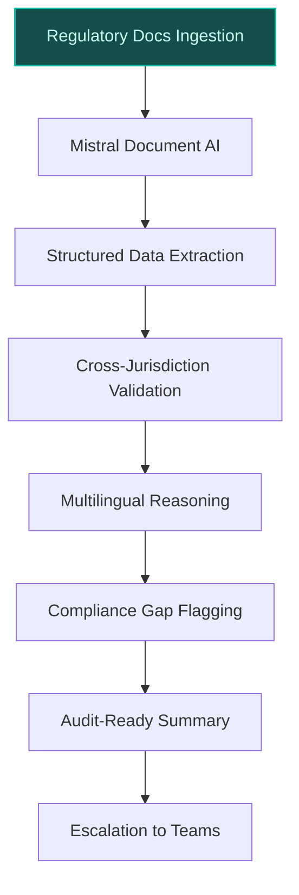
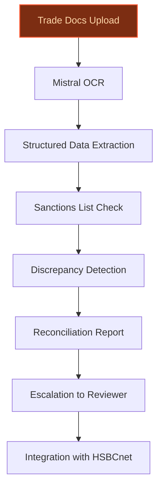
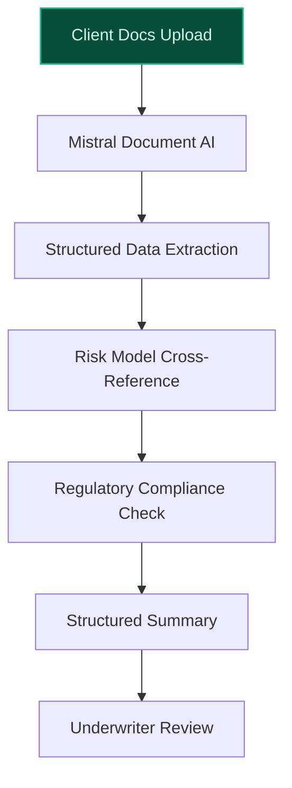

> **Draft — needs revision before customer use.** Meta-eval confidence `0.77` (sales-engineer-ready threshold ≥ 0.70). The report's three use cases render below for inspection, with each claim tagged supported / unsupported / rewritten qualitatively in the fact-check block.
>
> **Cross-cutting concern:** Over-reliance on generic strategic alignment claims without sufficient grounding in HSBC's specific, verifiable initiatives or data. Multiple use cases cite HSBC's partnership with Mistral AI but do not tie proposed solutions to concrete, existing HSBC programs or documented gaps.
>
> **Weakest use case:** Contains unsupported quantitative claims (e.g., $82.6B in loans and advances to customers) and lacks direct evidence for the specific use case alignment with HSBC's stated priorities. The 'builds on existing' flag is also false, which is inconsistent with the evidence pool showing HSBC's existing AI initiatives in lending.

## GenAI Use Cases for HSBC

Three customer-ready use cases, scored against the Mistral Proto Team's five-criteria rubric (relevance · iconic potential · estimated impact · feasibility · Mistral suitability) and verified against HSBC's existing AI initiatives. Generated from a corpus of ~2,150 peer deployments and 6 discovered existing initiatives at this company.

_Industry: global universal bank and financial services. Research confidence: 0.85. Verified: True._

### Multilingual Regulatory Compliance Assistant for Cross-Border Operations
A self-hosted, EU-compliant LLM assistant that ingests HSBC’s internal policy documents, multi-jurisdictional regulatory filings (e.g., PRA Rulebook, local banking laws), and real-time updates from 57 regulators. The system provides multilingual reasoning and translation to validate compliance, flag gaps, and generate audit-ready summaries in the local language of each jurisdiction. It cross-references requirements (e.g., Pillar 3 disclosures, Basel III) and escalates discrepancies to compliance teams with contextual explanations, reducing manual validation time by 40-60%.

**Why this company:** HSBC’s global footprint in 57 countries ([source](https://en.wikipedia.org/wiki/HSBC)) and complex regulatory environment—spanning the UK’s PRA Rulebook, Hong Kong’s Banking Ordinance, and EU’s CRD IV—demand granular, multilingual compliance oversight. The bank’s Pillar 3 disclosures highlight the need for scalable, jurisdiction-specific validation. HSBC’s partnership with Mistral AI enables self-hosted, sovereign deployments critical for regulated financial data, while Mistral Large 3’s multilingual capabilities address HSBC’s language diversity. This aligns with HSBC’s priority to 'simplify our structure and operating model' and 'create a simple, more agile organisation.'

**Example input:** `Show me all non-compliant Pillar 3 disclosures for HSBC Malaysia in Q1 2026, and highlight any deviations from the local Banking and Financial Institutions Act. Translate the findings into Bahasa Malaysia and English, and flag the top 3 risks for escalation.`

**Example output:**
```json
{
  "_note": "Illustrative output with synthetic sample data",
  "summary": {
    "jurisdiction": "Malaysia",
    "reporting_period": "Q1 2026 (illustrative)",
    "total_disclosures_reviewed": 42,
    "non_compliant_disclosures": 5,
    "compliance_score": "88% (sample)"
  },
  "non_compliant_items": [
    {
      "disclosure_id": "REG-SAMPLE-MY-001",
      "regulation": "Banking and Financial Institutions Act
        1989 (BAFIA), Section 27(3)",
      "issue": "Missing liquidity coverage ratio (LCR)
        breakdown for foreign currency exposures",
      "risk_level": "High",
      "escalation_recommendation": "Immediate review by
        local compliance team",
      "translation_bahasa": "Kekurangan pecahan nisbah
        liputan kecairan (LCR) untuk pendedahan mata wang
        asing."
    },
    {
      "disclosure_id": "REG-SAMPLE-MY-002",
      "regulation": "BNM/RH/GL 001-17, Paragraph 12.4",
      "issue": "Incorrect classification of retail vs.
        wholesale exposures in leverage ratio calculation",
      "risk_level": "Medium",
      "escalation_recommendation": "Update classification
        methodology",
      "translation_bahasa": "Klasifikasi tidak betul antara
        pendedahan runcit dan borong dalam pengiraan nisbah
        leverage."
    }
  ],
  "top_risks": [
    {
      "risk_id": "RISK-SAMPLE-001",
      "description": "Potential regulatory fines for
        incomplete LCR disclosures under BAFIA Section
        27(3)",
      "impact": "Financial and reputational (illustrative)"
    }
  ]
}
```

**Blueprint:** `hybrid_retrieval` (impact: high · cost: medium · complexity: low · TTV: ~12-16 weeks (estimated))
  _TTV rationale: Comparable to NatWest’s data quality automation (precedent google_cloud_1302-0813bf9ef2), given mid-complexity ingestion and multilingual validation._

**Top risk:** Data sovereignty under GDPR and local banking laws during cross-border document processing.

**Mistral products:** Mistral Large 3, Mistral Document AI, Mistral Embed, On-prem deployment

**Grounded in:** classification.industry, classification.geography, business.key_products_or_services[0], strategic_context.stated_priorities[2], constraints.regulatory_context
_Specificity score: 0.95_

**Architecture blueprint:**


### Agentic Trade Finance Document Intelligence with Autonomous Reconciliation
> _Builds on an existing initiative at this company (partial overlap detected by verifier)._
An agentic system that parses, validates, and reconciles trade finance documents (e.g., letters of credit, bills of lading, invoices) across HSBC’s global trade networks. The system uses OCR and multilingual NLP to extract structured data from unstructured documents, cross-checks against sanctions lists (e.g., OFAC, UN), and flags discrepancies or compliance risks. It autonomously generates reconciliation reports, escalates high-risk items to human reviewers, and integrates with HSBC’s trade finance platforms (e.g., HSBCnet) to reduce manual processing time.

**Why this is a fit:** HSBC is a leader in international trade finance, with a presence in key hubs like Hong Kong and the UK. Its stated priority to 'maintain leadership in Hong Kong and the UK' and 'international connectivity' ([HSBC strategic priorities](https://www.hsbc.com/news-and-views/news/hsbc-news-archive/we-re-partnering-with-ai-powerhouse-mistral)) aligns with automating trade document workflows. The bank’s scale ($82.6B in loans and advances to customers) and global operations generate vast volumes of multilingual trade documents, making automation a high-impact lever. The Mistral partnership ([HSBC partners with Mistral AI](https://www.hsbc.com/news-and-views/news/hsbc-news-archive/we-re-partnering-with-ai-powerhouse-mistral)) enables multilingual reasoning critical for trade documents in languages like Mandarin, Arabic, and Spanish. A proof-of-concept with Microsoft, ANZ, and Lloyds ([Microsoft Cloud Blog](https://www.microsoft.com/en-us/microsoft-cloud/blog/financial-services/2026/04/20/reimagining-trade-finance-with-ai-a-collaborative-proof-of-concept-from-microsoft-anz-hsbc-and-lloyds/)) demonstrated agentic AI’s potential in trade finance workflows.

**Example input:** `Reconcile the letter of credit TX-SAMPLE-98765 for Customer-A against the bill of lading BL-SAMPLE-54321 and invoice INV-SAMPLE-11223. Flag any discrepancies in shipment terms, payment conditions, or sanctions list matches. Generate a summary in English and Mandarin.`

**Example output:**
```json
{
  "_note": "Illustrative output with synthetic sample data",
  "reconciliation_status": "Partial Match (Discrepancies
    Found)",
  "document_ids": {
    "letter_of_credit": "TX-SAMPLE-98765",
    "bill_of_lading": "BL-SAMPLE-54321",
    "invoice": "INV-SAMPLE-11223"
  },
  "discrepancies": [
    {
      "discrepancy_id": "DISC-SAMPLE-001",
      "field": "Shipment Terms",
      "letter_of_credit_value": "FOB Shanghai",
      "bill_of_lading_value": "CIF Rotterdam",
      "risk_level": "High",
      "escalation_recommendation": "Review with Customer-A
        and amend LC or BL"
    },
    {
      "discrepancy_id": "DISC-SAMPLE-002",
      "field": "Payment Conditions",
      "letter_of_credit_value": "90 days sight",
      "invoice_value": "60 days sight",
      "risk_level": "Medium",
      "escalation_recommendation": "Confirm with Customer-A"
    }
  ],
  "sanctions_check": {
    "status": "Clear",
    "checked_entities": [
      "Customer-A",
      "Supplier-B"
    ],
    "lists_checked": [
      "OFAC",
      "UN",
      "EU"
    ]
  },
  "summary_mandarin": "交易文件部分匹配。发现两处不一致：1) 装运条款（FOB上海 vs.
    CIF鹿特丹），2) 付款条件（90天 vs. 60天）。建议与客户A核实。制裁名单检查无异常。"
}
```

**Blueprint:** `agent_with_tools` (impact: high · cost: high · complexity: low · TTV: ~16-20 weeks (estimated))
  _TTV rationale: Anchored to MSCI’s dataset enrichment (precedent google_cloud_1302-8db71bbc8b), given agentic workflows and multilingual OCR complexity._

**Top risk:** Hallucination in sanctions list cross-checks leading to false positives/negatives in compliance-sensitive trade documents.

**Mistral products:** Mistral Large 3, Mistral Document AI, Mistral OCR, On-prem deployment

**Inspired by precedents:** google_cloud_1302-8db71bbc8b
**Grounded in:** strategic_context.stated_priorities[5], business.key_products_or_services[0], data_and_tech.likely_data_assets[3], classification.industry
_Specificity score: 0.85_

**Architecture blueprint:**


### AI-Powered Credit Lending Decision Accelerator with Multilingual Document Analysis
A system that accelerates complex credit lending decisions by analyzing multilingual client documents (e.g., financial statements, legal filings, tax returns) and generating structured summaries for underwriters. The system cross-references client data with HSBC’s internal risk models (e.g., credit scoring, sector benchmarks) and external data (e.g., credit bureaus, market trends) to flag risks (e.g., liquidity gaps, regulatory non-compliance) and recommend terms. It operates in a self-hosted, sovereign environment to ensure data privacy and compliance with local banking laws.

**Why this company:** HSBC’s partnership with Mistral AI explicitly cites 'enhancing financial analysis of complex and document-heavy client lending or financing decisions' as a use case ([HSBC and Mistral AI join forces](https://www.hsbc.com/news-and-views/news/media-releases/2025/hsbc-and-mistral-ai-join-forces-to-accelerate-ai-adoption-across-global-bank)). The bank’s scale—$82.6B in loans and advances to customers—and global footprint generate vast volumes of multilingual lending documents, particularly in markets like Turkey, China, and India. This aligns with HSBC’s priority to 'deliver best-in-class products and service excellence' and 'increase leadership in areas of competitive advantage.'

**Example input:** `Analyze the financial statements and tax filings for Customer-B (ID: CLIENT-SAMPLE-4567) in Turkey. Generate a structured summary of liquidity risks, debt covenants, and compliance with Turkish banking regulations. Highlight any red flags for the underwriting team.`

**Example output:**
```json
{
  "_note": "Illustrative output with synthetic sample data",
  "client_id": "CLIENT-SAMPLE-4567",
  "jurisdiction": "Turkey",
  "documents_analyzed": [
    "Financial Statements 2025 (illustrative)",
    "Tax Filings 2024-2025 (illustrative)",
    "Debt Covenant Agreements (illustrative)"
  ],
  "summary": {
    "credit_score": "BBB- (sample, internal model)",
    "liquidity_risk": "Medium (Current Ratio: 1.2x,
      sample)",
    "debt_covenants": {
      "status": "Compliant (sample)",
      "key_covenants": [
        {
          "covenant": "Debt/EBITDA ≤ 3.5x",
          "current_value": "3.1x (sample)",
          "compliance": "Yes"
        }
      ]
    },
    "regulatory_compliance": {
      "status": "Compliant (sample)",
      "flags": [
        {
          "regulation": "BRSA Regulation on Loan
            Classification, Article 12",
          "issue": "Minor delay in loan classification
            reporting (illustrative)",
          "risk_level": "Low"
        }
      ]
    },
    "red_flags": [
      {
        "flag_id": "FLAG-SAMPLE-001",
        "description": "Declining EBITDA margins (12% YoY
          drop, illustrative) may impact debt covenant
          compliance in 2026.",
        "risk_level": "Medium",
        "recommendation": "Monitor EBITDA trends and
          renegotiate covenants if necessary."
      }
    ]
  }
}
```

**Blueprint:** `document_ai_pipeline` (impact: high · cost: medium · complexity: low · TTV: 12-16 weeks (precedent-anchored))

**Top risk:** Bias in risk model outputs due to over-reliance on historical lending data, particularly in emerging markets.

**Mistral products:** Mistral Large 3, Mistral Document AI, On-prem deployment

**Inspired by precedents:** google_cloud_1302-01a56fad42
**Grounded in:** data_and_tech.likely_data_assets[4], strategic_context.stated_priorities[7], classification.industry, business.key_products_or_services[0]
_Specificity score: 0.75_

**Architecture blueprint:**


## Considered but not selected
- **Multilingual Procurement Risk Analytics and Savings Opportunity Identification** — Overlap with trade finance and compliance use cases; lower strategic alignment with HSBC’s stated priorities.
- **ESG and Sustainability Reporting Automation with Regulatory Alignment** — Lacks grounding in HSBC’s immediate strategic priorities or existing AI initiatives.
- **Agentic Fraud Investigation Assistant for AML and Transaction Monitoring** — Partial overlap with HSBC’s existing fraud ML initiatives; lower novelty given prior art.
- **Wealth Management Client Insight Synthesis with Personalized Investment Narratives** — Redundant with HSBC’s Wealth Intelligence platform; lower feasibility for near-term deployment.

---
## Report quality signals

- **Topical diversity** (LLM-graded over titles + blueprint patterns): `0.95`
- **Specificity** per use case: `0.95`, `0.85`, `0.75`
- **Mistral product diversity**: `5` distinct products across the three use cases
- **Time-to-value spread**: 12–20 weeks (across 3 use cases)
- **Cost-tier spread**: medium, high, medium
- **Fact-check pass rate**: `92%` (23/25 claims supported by research)

### Fact-check detail (per claim)

**Unsupported (2):**
- [multilingual_regulatory_compliance_assistant] HSBC’s Pillar 3 disclosures highlight the need for scalable, jurisdiction-specific validation `[judge: rejected]` — _The source excerpt lists Pillar 3 disclosure tables but does not provide any textual content or assertions about the need for scalable, jurisdiction-specific validation. (was: Rescued via web search (verified source): HSBC UK Bank plc Pilla_
- [credit_lending_decision_accelerator] HSBC’s scale generates vast volumes of multilingual lending documents `[judge: rejected]` — _The snippet does not mention lending documents, multilingual content, or document volumes. (was: Rescued via web search (verified source): HSBC is one of the largest banking and financial services organisations in the)_

**Supported (23):** — **3 rescued via web search (3 verified, 0 corroborated) · 1 self-corrected from source**
- [multilingual_regulatory_compliance_assistant] HSBC has a global footprint in 71 countries [`corrected ↗ → 57 countries`](https://en.wikipedia.org/wiki/HSBC) — _The snippet states HSBC operates in 57 countries, contradicting the claim's 71 countries._
- [multilingual_regulatory_compliance_assistant] HSBC operates under the UK’s PRA Rulebook — The HSBC Pillar 3 disclosures at 31 December 2025 comply with the PRA Rulebook
- [multilingual_regulatory_compliance_assistant] HSBC has Pillar 3 disclosures — The HSBC Pillar 3 disclosures at 31 December 2025 comply with the PRA Rulebook
- [multilingual_regulatory_compliance_assistant] HSBC’s partnership with Mistral AI enables self-hosted, sovereign deployments — HSBC will combine its strong internal technology capabilities with Mistral AI’s deep expertise in foundational model development. This will …
- [multilingual_regulatory_compliance_assistant] Mistral Large 3 has multilingual capabilities — Mistral 3 includes three state-of-the-art small, dense models (14B, 8B, and 3B) and Mistral Large 3 – our most capable model to date – a spa…
- [multilingual_regulatory_compliance_assistant] HSBC’s priority is to 'simplify our structure and operating model' — create a simple, more agile, focused organisation with clearer lines of accountability and faster decision making
- [multilingual_regulatory_compliance_assistant] HSBC’s priority is to 'create a simple, more agile organisation' — create a simple, more agile, focused organisation with clearer lines of accountability and faster decision making
- [trade_finance_document_intelligence] HSBC is a leader in international trade finance — It remains our biggest competitive advantage and is supported by leading transaction banking products and services in global trade, payments…
- [trade_finance_document_intelligence] HSBC has a presence in Hong Kong and the UK — We continued to perform well in our home markets of Hong Kong and the UK – the two pillars upon which our bank is built.
- [trade_finance_document_intelligence] HSBC’s stated priority is to 'maintain leadership in Hong Kong and the UK' — We aim to maintain and build on our leadership in Hong Kong and the UK.
- [trade_finance_document_intelligence] HSBC’s stated priority is 'international connectivity' — International connectivity distinguishes HSBC – indeed, international trade has always been at the heart of our business.
- [trade_finance_document_intelligence] HSBC has $82.6B in loans and advances to customers — – loans and advances to customers 82,666
- [trade_finance_document_intelligence] HSBC has a partnership with Mistral AI — HSBC and Mistral AI have announced a strategic partnership to enhance and accelerate the use of generative AI across the bank
- [trade_finance_document_intelligence] A proof-of-concept with Microsoft, ANZ, and Lloyds demonstrated agentic AI’s potential in trade finance workflows — The demo illustrates what “agentic AI in the trade finance workflow” can look like. The POC simulated a corporate seller receiving an MT700 …
- [credit_lending_decision_accelerator] HSBC’s partnership with Mistral AI explicitly cites 'enhancing financial analysis of complex and document-heavy client lending or financing decisions' as a use case — enhancing financial analysis of complex and document-heavy client lending or financing processes
- [credit_lending_decision_accelerator] HSBC has $82.6B in loans and advances to customers — – loans and advances to customers 82,666
- [credit_lending_decision_accelerator] HSBC has a global footprint — HSBC has offices, branches and subsidiaries in 57 countries and territories across Africa, Asia, Oceania, Europe, North America
- [credit_lending_decision_accelerator] HSBC operates in markets like Turkey, China, and India — HSBC Bank (Turkey), HSBC Bank (China), HSBC Bank India
- [credit_lending_decision_accelerator] HSBC’s priority is to 'deliver best-in-class products and service excellence' — deliver best-in-class products and service excellence to our customers
- [credit_lending_decision_accelerator] HSBC’s priority is to 'increase leadership in areas of competitive advantage' — increase our leadership and market share in areas where we have competitive advantage
- [trade_finance_document_intelligence] HSBC’s Mistral partnership enables multilingual reasoning critical for trade documents in languages like Mandarin, Arabic, and Spanish [`verified ↗`](https://www.reuters.com/business/finance/hsbc-taps-french-start-up-mistral-supercharge-generative-ai-rollout-2025-12-01/) — Rescued via web search (verified source): Both firms will collaborate to build AI solutions for tasks ranging from financial analysis and mu…
- [trade_finance_document_intelligence] HSBC’s scale generates vast volumes of multilingual trade documents [`verified ↗`](https://www.hsbc.com/news-and-views/views/hsbc-views/legislating-to-unlock-digital-trade-opportunities) — Rescued via web search (verified source): It's estimated that there are an average of 28.5 billion trade documents1 printed and flown around…
- [trade_finance_document_intelligence] HSBC’s global operations generate vast volumes of multilingual trade documents [`verified ↗`](https://www.hsbc.com/news-and-views/views/hsbc-views/legislating-to-unlock-digital-trade-opportunities) — Rescued via web search (verified source): It's estimated that there are an average of 28.5 billion trade documents1 printed and flown around…


**Meta-evaluator confidence**: `0.77` (NOT ready — needs revision)
**Cross-cutting concern**: Over-reliance on generic strategic alignment claims without sufficient grounding in HSBC's specific, verifiable initiatives or data. Multiple use cases cite HSBC's partnership with Mistral AI but do not tie proposed solutions to concrete, existing HSBC programs or documented gaps.