# Trace

## Execution trace — HSBC

Started: `2026-05-10T22:08:44.699623+00:00`. Total wall time: `179.2s` across `53` recorded actions.

### Per-step time totals

| Step | Calls | Total time | Avg time |
|---|---:|---:|---:|
| `research` | 1 | 9.08s | 9076ms |
| `gap_fill` | 4 | 8.87s | 2218ms |
| `retrieve` | 2 | 0.14s | 72ms |
| `generate` | 2 | 26.71s | 13356ms |
| `generate.web_search` | 2 | 6.11s | 3056ms |
| `score` | 2 | 24.45s | 12227ms |
| `verify` | 6 | 25.70s | 4283ms |
| `enrich` | 1 | 64.62s | 64624ms |
| `polish` | 3 | 7.25s | 2417ms |
| `meta_eval` | 1 | 13.52s | 13515ms |
| `web_verify` | 1 | 3.65s | 3652ms |
| `source_judge` | 26 | 22.08s | 849ms |
| `quality_signals` | 2 | 4.59s | 2293ms |

### Chronological event log

- `22:08:45.053` **[research]** `mistral-medium-2604.chat.complete` — 9076ms
   - inputs: synthesize CompanyContext for HSBC | depth=medium
   - outputs: industry='global universal bank and financial services' verified=True conf=0.75
- `22:08:54.137` **[gap_fill]** `mistral-small-2603.chat.complete` — 5708ms
   - inputs: generate gap queries | fields=['business_model', 'products', 'data_assets', 'priorities']
   - outputs: queries=4
- `22:09:08.670` **[gap_fill]** `mistral-small-2603.chat.complete` — 1416ms
   - inputs: layer-2 extract field=priorities
   - outputs: items=12
- `22:09:08.676` **[gap_fill]** `mistral-small-2603.chat.complete` — 982ms
   - inputs: layer-2 extract field=data_assets
   - outputs: items=6
- `22:09:08.680` **[gap_fill]** `mistral-small-2603.chat.complete` — 764ms
   - inputs: layer-2 extract field=products
   - outputs: items=6
- `22:09:10.089` **[retrieve]** `mistral-embed.embeddings.create` — 139ms
   - inputs: company_query | industries='global universal bank and financial services'
   - outputs: embedded 1024-dim query vector
- `22:09:10.228` **[retrieve]** `precedent_corpus.cosine_topk` — 5ms
   - inputs: k=8 min_depth=0.4 target='HSBC'
   - outputs: retrieved 8 | mmr=True | top_sim=0.811
- `22:09:12.092` **[generate]** `mistral-medium-2604.chat.complete` — 2367ms
   - inputs: iteration=0 tool_calls_used=0/2 tools=on
   - outputs: tool_calls=4 | content_chars=0
- `22:09:14.481` **[generate.web_search]** `tavily.search` — 2964ms
   - inputs: query='HSBC recent partnerships 2025 2026 Mistral AI'
   - outputs: 2 raw results
- `22:09:18.028` **[generate.web_search]** `tavily.search` — 3148ms
   - inputs: query='HSBC regulatory compliance priorities 2025 2026'
   - outputs: 2 raw results
- `22:09:21.565` **[generate]** `mistral-medium-2604.chat.complete` — 24345ms
   - inputs: iteration=1 tool_calls_used=2/2 tools=off
   - outputs: tool_calls=0 | content_chars=16027
- `22:09:46.240` **[score]** `mistral-small-2603.chat.complete` — 12544ms
   - inputs: self-consistency pass T=0.2
   - outputs: scored 8 candidates
- `22:09:46.244` **[score]** `mistral-small-2603.chat.complete` — 11909ms
   - inputs: self-consistency pass T=0.4
   - outputs: scored 8 candidates
- `22:09:58.818` **[verify]** `tavily.search` — 2681ms
   - inputs: candidate=multilingual_regulatory_compliance_assistant | query='HSBC Multilingual Regulatory Compliance Assistant for Cross-'
   - outputs: 4 results
- `22:09:58.818` **[verify]** `tavily.search` — 2441ms
   - inputs: candidate=trade_finance_document_intelligence | query='HSBC Agentic Trade Finance Document Intelligence with Autono'
   - outputs: 4 results
- `22:09:58.818` **[verify]** `tavily.search` — 5132ms
   - inputs: candidate=procurement_risk_analytics | query='HSBC Multilingual Procurement Risk Analytics and Savings Opp'
   - outputs: 4 results
- `22:10:01.781` **[verify]** `mistral-small-2603.chat.complete` — 6500ms
   - inputs: verdict for trade_finance_document_intelligence
   - outputs: verdict='partial_overlap'
- `22:10:02.117` **[verify]** `mistral-small-2603.chat.complete` — 4364ms
   - inputs: verdict for multilingual_regulatory_compliance_assistant
   - outputs: verdict='pass'
- `22:10:04.243` **[verify]** `mistral-small-2603.chat.complete` — 4578ms
   - inputs: verdict for procurement_risk_analytics
   - outputs: verdict='confirmed_existing'
- `22:10:08.824` **[enrich]** `mistral-large-2512.chat.complete` — 64624ms
   - inputs: tier=standard parallel=False ids=['multilingual_regulatory_compliance_assistant', 'trade_finance_document_intelligence', 'credit_lending_decision_accelerator']
   - outputs: enriched 3 use cases
- `22:11:13.475` **[polish]** `mistral-small-2603.chat.complete` — 2321ms
   - inputs: use_case=multilingual_regulatory_compliance_assistant unanchored=True opaque_ev=False
   - outputs: polished 5 fields
- `22:11:13.484` **[polish]** `mistral-small-2603.chat.complete` — 2631ms
   - inputs: use_case=trade_finance_document_intelligence unanchored=True opaque_ev=False
   - outputs: polished 5 fields
- `22:11:13.488` **[polish]** `mistral-small-2603.chat.complete` — 2300ms
   - inputs: use_case=credit_lending_decision_accelerator unanchored=True opaque_ev=False
   - outputs: polished 5 fields
- `22:11:16.117` **[meta_eval]** `mistral-medium-2604.chat.complete` — 13515ms
   - inputs: reviewing 3 use cases
   - outputs: review + claims
- `22:11:29.652` **[web_verify]** `tavily.search.rescue_unsupported_claims` — 3652ms
   - inputs: company='HSBC' unsupported=5 budget=12
   - outputs: rescued: verified=5 corroborated=0 of 5 attempted
- `22:11:33.307` **[source_judge]** `mistral-small-2603.judge_claim_sources` — 3744ms
   - inputs: pairs=25
   - outputs: judged 25 pairs
- `22:11:33.307` **[source_judge]** `mistral-small-2603.chat.complete` — 720ms
   - inputs: claim='HSBC has a global footprint in 71 countries'
   - outputs: verdict=corrected
- `22:11:33.316` **[source_judge]** `mistral-small-2603.chat.complete` — 731ms
   - inputs: claim='HSBC operates under the UK’s PRA Rulebook'
   - outputs: verdict=supported
- `22:11:33.319` **[source_judge]** `mistral-small-2603.chat.complete` — 709ms
   - inputs: claim='HSBC has Pillar 3 disclosures'
   - outputs: verdict=supported
- `22:11:33.322` **[source_judge]** `mistral-small-2603.chat.complete` — 808ms
   - inputs: claim='HSBC’s partnership with Mistral AI enables self-hosted, sove'
   - outputs: verdict=supported
- `22:11:33.325` **[source_judge]** `mistral-small-2603.chat.complete` — 703ms
   - inputs: claim='Mistral Large 3 has multilingual capabilities'
   - outputs: verdict=supported
- `22:11:33.328` **[source_judge]** `mistral-small-2603.chat.complete` — 700ms
   - inputs: claim="HSBC’s priority is to 'simplify our structure and operating "
   - outputs: verdict=supported
- `22:11:33.333` **[source_judge]** `mistral-small-2603.chat.complete` — 691ms
   - inputs: claim="HSBC’s priority is to 'create a simple, more agile organisat"
   - outputs: verdict=supported
- `22:11:33.335` **[source_judge]** `mistral-small-2603.chat.complete` — 693ms
   - inputs: claim='HSBC is a leader in international trade finance'
   - outputs: verdict=supported
- `22:11:34.024` **[source_judge]** `mistral-small-2603.chat.complete` — 609ms
   - inputs: claim='HSBC has a presence in Hong Kong and the UK'
   - outputs: verdict=supported
- `22:11:34.029` **[source_judge]** `mistral-small-2603.chat.complete` — 3022ms
   - inputs: claim="HSBC’s stated priority is to 'maintain leadership in Hong Ko"
   - outputs: verdict=supported
- `22:11:34.033` **[source_judge]** `mistral-small-2603.chat.complete` — 601ms
   - inputs: claim="HSBC’s stated priority is 'international connectivity'"
   - outputs: verdict=supported
- `22:11:34.035` **[source_judge]** `mistral-small-2603.chat.complete` — 786ms
   - inputs: claim='HSBC has $82.6B in loans and advances to customers'
   - outputs: verdict=supported
- `22:11:34.037` **[source_judge]** `mistral-small-2603.chat.complete` — 596ms
   - inputs: claim='HSBC has a partnership with Mistral AI'
   - outputs: verdict=supported
- `22:11:34.040` **[source_judge]** `mistral-small-2603.chat.complete` — 728ms
   - inputs: claim='A proof-of-concept with Microsoft, ANZ, and Lloyds demonstra'
   - outputs: verdict=supported
- `22:11:34.048` **[source_judge]** `mistral-small-2603.chat.complete` — 600ms
   - inputs: claim="HSBC’s partnership with Mistral AI explicitly cites 'enhanci"
   - outputs: verdict=supported
- `22:11:34.131` **[source_judge]** `mistral-small-2603.chat.complete` — 620ms
   - inputs: claim='HSBC has $82.6B in loans and advances to customers'
   - outputs: verdict=supported
- `22:11:34.634` **[source_judge]** `mistral-small-2603.chat.complete` — 625ms
   - inputs: claim='HSBC has a global footprint'
   - outputs: verdict=supported
- `22:11:34.640` **[source_judge]** `mistral-small-2603.chat.complete` — 484ms
   - inputs: claim='HSBC operates in markets like Turkey, China, and India'
   - outputs: verdict=supported
- `22:11:34.644` **[source_judge]** `mistral-small-2603.chat.complete` — 475ms
   - inputs: claim="HSBC’s priority is to 'deliver best-in-class products and se"
   - outputs: verdict=supported
- `22:11:34.648` **[source_judge]** `mistral-small-2603.chat.complete` — 531ms
   - inputs: claim="HSBC’s priority is to 'increase leadership in areas of compe"
   - outputs: verdict=supported
- `22:11:34.750` **[source_judge]** `mistral-small-2603.chat.complete` — 635ms
   - inputs: claim='HSBC’s Pillar 3 disclosures highlight the need for scalable,'
   - outputs: verdict=unsupported
- `22:11:34.769` **[source_judge]** `mistral-small-2603.chat.complete` — 598ms
   - inputs: claim='HSBC’s Mistral partnership enables multilingual reasoning cr'
   - outputs: verdict=supported
- `22:11:34.821` **[source_judge]** `mistral-small-2603.chat.complete` — 600ms
   - inputs: claim='HSBC’s scale generates vast volumes of multilingual trade do'
   - outputs: verdict=supported
- `22:11:35.119` **[source_judge]** `mistral-small-2603.chat.complete` — 490ms
   - inputs: claim='HSBC’s scale generates vast volumes of multilingual lending '
   - outputs: verdict=unsupported
- `22:11:35.124` **[source_judge]** `mistral-small-2603.chat.complete` — 585ms
   - inputs: claim='HSBC’s global operations generate vast volumes of multilingu'
   - outputs: verdict=supported
- `22:11:39.290` **[quality_signals]** `mistral-small-2603.chat.complete` — 2737ms
   - inputs: specificity grade (3 use cases)
   - outputs: scored 3 use cases
- `22:11:42.027` **[quality_signals]** `mistral-small-2603.chat.complete` — 1848ms
   - inputs: diversity grade
   - outputs: diversity=0.95

## Mermaid sequence

```mermaid
sequenceDiagram
    autonumber
    participant pipeline as pipeline
    participant mistral_medium_2604 as mistral-medium-2604
    participant mistral_small_2603 as mistral-small-2603
    participant mistral_embed as mistral-embed
    participant precedent_corpus as precedent_corpus
    participant tavily as tavily
    participant mistral_large_2512 as mistral-large-2512
    participant tavily_search as tavily.search
    pipeline->>mistral_medium_2604: research: chat.complete (9076ms)
    mistral_medium_2604-->>pipeline: industry='global universal bank and financial services' veri
    pipeline->>mistral_small_2603: gap_fill: chat.complete (5708ms)
    mistral_small_2603-->>pipeline: queries=4
    pipeline->>mistral_small_2603: gap_fill: chat.complete (1416ms)
    mistral_small_2603-->>pipeline: items=12
    pipeline->>mistral_small_2603: gap_fill: chat.complete (982ms)
    mistral_small_2603-->>pipeline: items=6
    pipeline->>mistral_small_2603: gap_fill: chat.complete (764ms)
    mistral_small_2603-->>pipeline: items=6
    pipeline->>mistral_embed: retrieve: embeddings.create (139ms)
    mistral_embed-->>pipeline: embedded 1024-dim query vector
    pipeline->>precedent_corpus: retrieve: cosine_topk (5ms)
    precedent_corpus-->>pipeline: retrieved 8 | mmr=True | top_sim=0.811
    pipeline->>mistral_medium_2604: generate: chat.complete (2367ms)
    mistral_medium_2604-->>pipeline: tool_calls=4 | content_chars=0
    pipeline->>tavily: generate.web_search: search (2964ms)
    tavily-->>pipeline: 2 raw results
    pipeline->>tavily: generate.web_search: search (3148ms)
    tavily-->>pipeline: 2 raw results
    pipeline->>mistral_medium_2604: generate: chat.complete (24345ms)
    mistral_medium_2604-->>pipeline: tool_calls=0 | content_chars=16027
    pipeline->>mistral_small_2603: score: chat.complete (12544ms)
    mistral_small_2603-->>pipeline: scored 8 candidates
    pipeline->>mistral_small_2603: score: chat.complete (11909ms)
    mistral_small_2603-->>pipeline: scored 8 candidates
    pipeline->>tavily: verify: search (2681ms)
    tavily-->>pipeline: 4 results
    pipeline->>tavily: verify: search (2441ms)
    tavily-->>pipeline: 4 results
    pipeline->>tavily: verify: search (5132ms)
    tavily-->>pipeline: 4 results
    pipeline->>mistral_small_2603: verify: chat.complete (6500ms)
    mistral_small_2603-->>pipeline: verdict='partial_overlap'
    pipeline->>mistral_small_2603: verify: chat.complete (4364ms)
    mistral_small_2603-->>pipeline: verdict='pass'
    pipeline->>mistral_small_2603: verify: chat.complete (4578ms)
    mistral_small_2603-->>pipeline: verdict='confirmed_existing'
    pipeline->>mistral_large_2512: enrich: chat.complete (64624ms)
    mistral_large_2512-->>pipeline: enriched 3 use cases
    pipeline->>mistral_small_2603: polish: chat.complete (2321ms)
    mistral_small_2603-->>pipeline: polished 5 fields
    pipeline->>mistral_small_2603: polish: chat.complete (2631ms)
    mistral_small_2603-->>pipeline: polished 5 fields
    pipeline->>mistral_small_2603: polish: chat.complete (2300ms)
    mistral_small_2603-->>pipeline: polished 5 fields
    pipeline->>mistral_medium_2604: meta_eval: chat.complete (13515ms)
    mistral_medium_2604-->>pipeline: review + claims
    pipeline->>tavily_search: web_verify: rescue_unsupported_claims (3652ms)
    tavily_search-->>pipeline: rescued: verified=5 corroborated=0 of 5 attempted
    pipeline->>mistral_small_2603: source_judge: judge_claim_sources (3744ms)
    mistral_small_2603-->>pipeline: judged 25 pairs
    pipeline->>mistral_small_2603: source_judge: chat.complete (720ms)
    mistral_small_2603-->>pipeline: verdict=corrected
    pipeline->>mistral_small_2603: source_judge: chat.complete (731ms)
    mistral_small_2603-->>pipeline: verdict=supported
    pipeline->>mistral_small_2603: source_judge: chat.complete (709ms)
    mistral_small_2603-->>pipeline: verdict=supported
    pipeline->>mistral_small_2603: source_judge: chat.complete (808ms)
    mistral_small_2603-->>pipeline: verdict=supported
    pipeline->>mistral_small_2603: source_judge: chat.complete (703ms)
    mistral_small_2603-->>pipeline: verdict=supported
    pipeline->>mistral_small_2603: source_judge: chat.complete (700ms)
    mistral_small_2603-->>pipeline: verdict=supported
    pipeline->>mistral_small_2603: source_judge: chat.complete (691ms)
    mistral_small_2603-->>pipeline: verdict=supported
    pipeline->>mistral_small_2603: source_judge: chat.complete (693ms)
    mistral_small_2603-->>pipeline: verdict=supported
    pipeline->>mistral_small_2603: source_judge: chat.complete (609ms)
    mistral_small_2603-->>pipeline: verdict=supported
    pipeline->>mistral_small_2603: source_judge: chat.complete (3022ms)
    mistral_small_2603-->>pipeline: verdict=supported
    pipeline->>mistral_small_2603: source_judge: chat.complete (601ms)
    mistral_small_2603-->>pipeline: verdict=supported
    pipeline->>mistral_small_2603: source_judge: chat.complete (786ms)
    mistral_small_2603-->>pipeline: verdict=supported
    pipeline->>mistral_small_2603: source_judge: chat.complete (596ms)
    mistral_small_2603-->>pipeline: verdict=supported
    pipeline->>mistral_small_2603: source_judge: chat.complete (728ms)
    mistral_small_2603-->>pipeline: verdict=supported
    pipeline->>mistral_small_2603: source_judge: chat.complete (600ms)
    mistral_small_2603-->>pipeline: verdict=supported
    pipeline->>mistral_small_2603: source_judge: chat.complete (620ms)
    mistral_small_2603-->>pipeline: verdict=supported
    pipeline->>mistral_small_2603: source_judge: chat.complete (625ms)
    mistral_small_2603-->>pipeline: verdict=supported
    pipeline->>mistral_small_2603: source_judge: chat.complete (484ms)
    mistral_small_2603-->>pipeline: verdict=supported
    pipeline->>mistral_small_2603: source_judge: chat.complete (475ms)
    mistral_small_2603-->>pipeline: verdict=supported
    pipeline->>mistral_small_2603: source_judge: chat.complete (531ms)
    mistral_small_2603-->>pipeline: verdict=supported
    pipeline->>mistral_small_2603: source_judge: chat.complete (635ms)
    mistral_small_2603-->>pipeline: verdict=unsupported
    pipeline->>mistral_small_2603: source_judge: chat.complete (598ms)
    mistral_small_2603-->>pipeline: verdict=supported
    pipeline->>mistral_small_2603: source_judge: chat.complete (600ms)
    mistral_small_2603-->>pipeline: verdict=supported
    pipeline->>mistral_small_2603: source_judge: chat.complete (490ms)
    mistral_small_2603-->>pipeline: verdict=unsupported
    pipeline->>mistral_small_2603: source_judge: chat.complete (585ms)
    mistral_small_2603-->>pipeline: verdict=supported
    pipeline->>mistral_small_2603: quality_signals: chat.complete (2737ms)
    mistral_small_2603-->>pipeline: scored 3 use cases
    pipeline->>mistral_small_2603: quality_signals: chat.complete (1848ms)
    mistral_small_2603-->>pipeline: diversity=0.95
```

