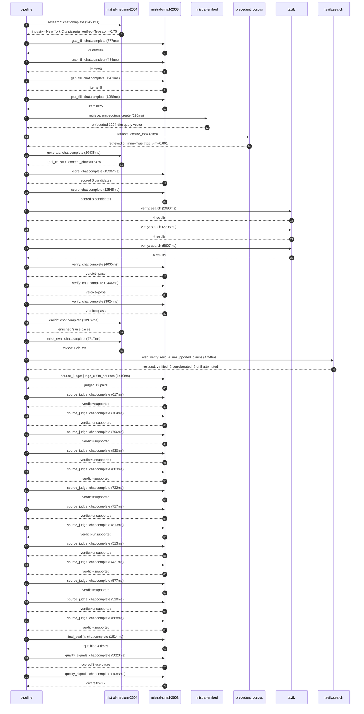

# Trace

## Execution trace — Joe's Pizza Shop

Started: `2026-05-10T23:05:01.208915+00:00`. Total wall time: `113.2s` across `36` recorded actions.

### Per-step time totals

| Step | Calls | Total time | Avg time |
|---|---:|---:|---:|
| `research` | 1 | 3.46s | 3458ms |
| `gap_fill` | 4 | 3.78s | 945ms |
| `retrieve` | 2 | 0.20s | 102ms |
| `generate` | 1 | 20.43s | 20435ms |
| `score` | 2 | 25.93s | 12966ms |
| `verify` | 6 | 20.50s | 3416ms |
| `enrich` | 1 | 13.97s | 13974ms |
| `meta_eval` | 1 | 9.72s | 9717ms |
| `web_verify` | 1 | 4.75s | 4750ms |
| `source_judge` | 14 | 10.02s | 716ms |
| `final_qualify` | 1 | 1.61s | 1614ms |
| `quality_signals` | 2 | 4.10s | 2051ms |

### Chronological event log

- `23:05:15.585` **[research]** `mistral-medium-2604.chat.complete` — 3458ms
   - inputs: synthesize CompanyContext for Joe's Pizza Shop | depth=medium
   - outputs: industry='New York City pizzeria' verified=True conf=0.75
- `23:05:19.043` **[gap_fill]** `mistral-small-2603.chat.complete` — 777ms
   - inputs: generate gap queries | fields=['business_model', 'products', 'data_assets', 'priorities']
   - outputs: queries=4
- `23:05:29.857` **[gap_fill]** `mistral-small-2603.chat.complete` — 484ms
   - inputs: layer-2 extract field=priorities
   - outputs: items=0
- `23:05:29.863` **[gap_fill]** `mistral-small-2603.chat.complete` — 1261ms
   - inputs: layer-2 extract field=data_assets
   - outputs: items=6
- `23:05:29.867` **[gap_fill]** `mistral-small-2603.chat.complete` — 1258ms
   - inputs: layer-2 extract field=products
   - outputs: items=25
- `23:05:31.128` **[retrieve]** `mistral-embed.embeddings.create` — 196ms
   - inputs: company_query | industries='New York City pizzeria'
   - outputs: embedded 1024-dim query vector
- `23:05:31.324` **[retrieve]** `precedent_corpus.cosine_topk` — 8ms
   - inputs: k=8 min_depth=0.4 target="Joe's Pizza Shop"
   - outputs: retrieved 8 | mmr=True | top_sim=0.801
- `23:05:33.132` **[generate]** `mistral-medium-2604.chat.complete` — 20435ms
   - inputs: iteration=0 tool_calls_used=0/0 tools=off
   - outputs: tool_calls=0 | content_chars=13475
- `23:05:53.883` **[score]** `mistral-small-2603.chat.complete` — 13387ms
   - inputs: self-consistency pass T=0.2
   - outputs: scored 8 candidates
- `23:05:53.887` **[score]** `mistral-small-2603.chat.complete` — 12545ms
   - inputs: self-consistency pass T=0.4
   - outputs: scored 8 candidates
- `23:06:07.307` **[verify]** `tavily.search` — 2690ms
   - inputs: candidate=joes-ai-phone-agent | query="Joe's Pizza Shop AI phone agent for Joe's Pizza Shop handlin"
   - outputs: 4 results
- `23:06:07.307` **[verify]** `tavily.search` — 2793ms
   - inputs: candidate=joes-inventory-predictor | query="Joe's Pizza Shop AI-driven inventory and prep optimization f"
   - outputs: 4 results
- `23:06:07.307` **[verify]** `tavily.search` — 5607ms
   - inputs: candidate=joes-nyc-slang-chatbot | query="Joe's Pizza Shop NYC-slang-fluent conversational ordering as"
   - outputs: 4 results
- `23:06:10.356` **[verify]** `mistral-small-2603.chat.complete` — 4035ms
   - inputs: verdict for joes-ai-phone-agent
   - outputs: verdict='pass'
- `23:06:10.845` **[verify]** `mistral-small-2603.chat.complete` — 1446ms
   - inputs: verdict for joes-inventory-predictor
   - outputs: verdict='pass'
- `23:06:13.637` **[verify]** `mistral-small-2603.chat.complete` — 3924ms
   - inputs: verdict for joes-nyc-slang-chatbot
   - outputs: verdict='pass'
- `23:06:17.564` **[enrich]** `mistral-medium-2604.chat.complete` — 13974ms
   - inputs: tier=fast parallel=False ids=['joes-ai-phone-agent', 'joes-inventory-predictor', 'joes-menu-ai-generator']
   - outputs: enriched 3 use cases
- `23:06:31.560` **[meta_eval]** `mistral-medium-2604.chat.complete` — 9717ms
   - inputs: reviewing 3 use cases
   - outputs: review + claims
- `23:06:41.309` **[web_verify]** `tavily.search.rescue_unsupported_claims` — 4750ms
   - inputs: company="Joe's Pizza Shop" unsupported=5 budget=12
   - outputs: rescued: verified=2 corroborated=2 of 5 attempted
- `23:06:46.060` **[source_judge]** `mistral-small-2603.judge_claim_sources` — 1419ms
   - inputs: pairs=13
   - outputs: judged 13 pairs
- `23:06:46.060` **[source_judge]** `mistral-small-2603.chat.complete` — 617ms
   - inputs: claim="Joe's Pizza is a Greenwich Village staple"
   - outputs: verdict=supported
- `23:06:46.063` **[source_judge]** `mistral-small-2603.chat.complete` — 704ms
   - inputs: claim="Joe's Pizza has a loyal local customer base"
   - outputs: verdict=unsupported
- `23:06:46.069` **[source_judge]** `mistral-small-2603.chat.complete` — 796ms
   - inputs: claim="Joe's Pizza has a well-documented high-volume call-in order "
   - outputs: verdict=supported
- `23:06:46.073` **[source_judge]** `mistral-small-2603.chat.complete` — 830ms
   - inputs: claim='Base Camp Pizza Co. experienced a 25-30% increase in call ca'
   - outputs: verdict=unsupported
- `23:06:46.076` **[source_judge]** `mistral-small-2603.chat.complete` — 683ms
   - inputs: claim="Joe's Pizza has a proprietary menu including 'The Ultimate' "
   - outputs: verdict=supported
- `23:06:46.078` **[source_judge]** `mistral-small-2603.chat.complete` — 732ms
   - inputs: claim='Joe’s REWARDS loyalty program exists'
   - outputs: verdict=supported
- `23:06:46.081` **[source_judge]** `mistral-small-2603.chat.complete` — 717ms
   - inputs: claim="Joe's Pizza serves a localized NYC customer base with predic"
   - outputs: verdict=unsupported
- `23:06:46.083` **[source_judge]** `mistral-small-2603.chat.complete` — 813ms
   - inputs: claim="Joe's Pizza menu includes high-margin items like strombolis "
   - outputs: verdict=unsupported
- `23:06:46.677` **[source_judge]** `mistral-small-2603.chat.complete` — 513ms
   - inputs: claim='Joe’s REWARDS transaction data provides granular insights in'
   - outputs: verdict=unsupported
- `23:06:46.758` **[source_judge]** `mistral-small-2603.chat.complete` — 431ms
   - inputs: claim="Joe's Pizza is a Greenwich Village institution"
   - outputs: verdict=supported
- `23:06:46.767` **[source_judge]** `mistral-small-2603.chat.complete` — 577ms
   - inputs: claim="Joe's Pizza menu blends classic NYC pizza with unique offeri"
   - outputs: verdict=supported
- `23:06:46.798` **[source_judge]** `mistral-small-2603.chat.complete` — 518ms
   - inputs: claim="Joe's Pizza has a localized customer base and agile decision"
   - outputs: verdict=unsupported
- `23:06:46.811` **[source_judge]** `mistral-small-2603.chat.complete` — 668ms
   - inputs: claim='Joe’s REWARDS transaction data provides insights into custom'
   - outputs: verdict=supported
- `23:06:48.061` **[final_qualify]** `mistral-small-2603.chat.complete` — 1614ms
   - inputs: use_case=joes-ai-phone-agent unsupported=1
   - outputs: qualified 4 fields
- `23:06:50.312` **[quality_signals]** `mistral-small-2603.chat.complete` — 3020ms
   - inputs: specificity grade (3 use cases)
   - outputs: scored 3 use cases
- `23:06:53.332` **[quality_signals]** `mistral-small-2603.chat.complete` — 1083ms
   - inputs: diversity grade
   - outputs: diversity=0.7

## Mermaid sequence

