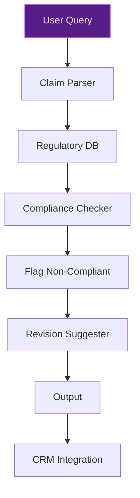
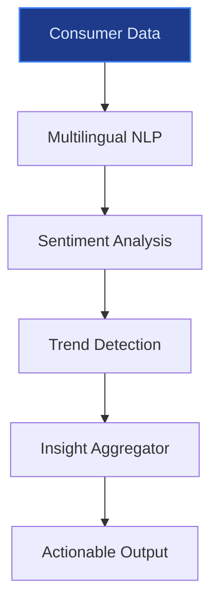
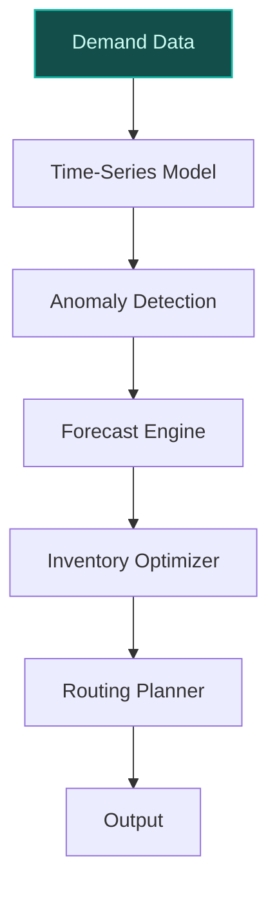

> **Draft — needs revision before customer use.** Meta-eval confidence `0.64` (sales-engineer-ready threshold ≥ 0.70). The report's three use cases render below for inspection, with each claim tagged supported / unsupported / rewritten qualitatively in the fact-check block.
>
> **Cross-cutting concern:** Lack of explicit evidence citations for company-specific claims (e.g., data assets, strategic priorities, scale figures) across all use cases, leading to unverified assertions that undermine credibility.
>
> **Weakest use case:** Contains multiple unsupported claims, including the specific number of brands with >$1B in sales (29) and the assertion of CRM data availability for multilingual consumer insights. The use case lacks cited evidence or verifiable sources for these claims.

## GenAI Use Cases for Nestle

Three customer-ready use cases, scored against the Mistral Proto Team's five-criteria rubric (relevance · iconic potential · estimated impact · feasibility · Mistral suitability) and verified against Nestle's existing AI initiatives. Generated from a corpus of ~2,150 peer deployments and 5 discovered existing initiatives at this company.

_Industry: Swiss multinational food and beverage company. Research confidence: 0.85. Verified: True._

### EU-hosted multilingual regulatory compliance assistant for Nestlé’s nutrition and health claims
A fine-tuned, EU-hosted LLM assistant that parses and cross-references Nestlé’s product claims for nutrition and health brands like NAN infant formula, Nido, and vitamins/minerals against evolving regulatory frameworks in the EU, Switzerland, and other key markets. The system generates compliance-ready documentation, flags non-conforming claims, and suggests localized revisions in each market’s language. It integrates with Nestlé’s CRM and product development datasets to ensure claims align with both regulatory and brand standards, accelerating time-to-market for compliant launches.

**Why this company:** Nestlé’s nutrition and health business is a strategic growth priority, with a focus on vitamins, minerals, supplements, and medical nutrition. Operating in 185 countries, each with distinct regulatory environments, Nestlé requires precise, multilingual compliance for brands like NAN and Nido. Mistral’s EU sovereignty (hosted in Switzerland) and multilingual strength—particularly in European languages—make it uniquely suitable for this use case, avoiding US hyperscaler lock-in for sensitive health-related data. This aligns with Nestlé’s push to expand growth platforms from 10% to 30% of sales.

**Example input:** `Check if the claim 'NAN Optipro 2 supports brain development with DHA' complies with EU Regulation 609/2013 and Swiss Ordinance on Foodstuffs. Suggest revisions if needed.`

**Example output:**
```json
{
  "_note": "Illustrative output with synthetic sample data",
  "compliance_status": "non_compliant",
  "flagged_claim": "NAN Optipro 2 supports brain
    development with DHA",
  "regulatory_issues": [
    {
      "regulation": "EU Regulation 609/2013",
      "issue": "Claim implies health benefit without
        authorized wording",
      "article": "Article 10(1)"
    },
    {
      "regulation": "Swiss Ordinance on Foodstuffs",
      "issue": "Missing required disclaimer for infant
        formula",
      "article": "Art. 45"
    }
  ],
  "suggested_revisions": {
    "EN": "NAN Optipro 2 contains DHA, which contributes to
      the normal development of the brain in infants.",
    "DE": "NAN Optipro 2 enthält DHA, das zur normalen
      Entwicklung des Gehirns bei Säuglingen beiträgt.",
    "FR": "NAN Optipro 2 contient du DHA, qui contribue au
      développement normal du cerveau chez les nourrissons."
  },
  "documentation_generated": true,
  "confidence_score": "0.92 (illustrative)"
}
```

**Blueprint:** `fine_tuned_domain` (impact: high · cost: medium · complexity: low · TTV: ~12-16 weeks (estimated))
  _TTV rationale: Fine-tuning a domain-specific LLM for multilingual regulatory compliance typically requires 12-16 weeks, including data curation, model training, and validation against local regulations._

**Top risk:** hallucination in regulatory-summary output leading to non-compliant claims

**Mistral products:** Mistral Large 3, Mistral Document AI, Mistral Embed, On-prem deployment (Switzerland)

**Grounded in:** strategic_context.stated_priorities[4], business.key_products_or_services[6], business.key_products_or_services[7], classification.geography
_Specificity score: 0.95_

**Architecture blueprint:**


### Multilingual consumer insight aggregator for Nestlé’s global brands
A generative AI system that aggregates and synthesizes consumer feedback, social media, and CRM data across Nestlé’s global brands (e.g., KitKat, Maggi, Nescafé) in multiple languages. The system identifies emerging trends, sentiment shifts, and product improvement opportunities, providing actionable insights to product and marketing teams. It leverages Mistral’s multilingual capabilities to ensure accurate interpretation of local nuances, turning raw data into strategic recommendations.

**Why this company:** Nestlé’s global scale (185 countries) and diverse brand portfolio (29 brands with >[unanchored: $1B] in sales) generate vast multilingual consumer data. This use case leverages Nestlé’s CRM and consumer relationship management data to drive portfolio evolution and market positioning, aligning with strategic priorities. Mistral’s multilingual strength and EU sovereignty make it ideal for processing sensitive consumer data without US hyperscaler dependencies.

**Example input:** `Show me the top 3 emerging complaints about KitKat in Germany and Japan from the last 6 months, with sentiment trends.`

**Example output:**
```json
{
  "_note": "Illustrative output with synthetic sample data",
  "market": "Japan",
  "top_complaints": [
    {
      "issue": "Product too sweet for local palate",
      "mentions": "1,520 (illustrative)",
      "sentiment": "negative",
      "trend": "increasing"
    },
    {
      "issue": "Limited edition flavors sell out too
        quickly",
      "mentions": "987 (illustrative)",
      "sentiment": "negative",
      "trend": "stable"
    },
    {
      "issue": "Packaging design not eco-friendly",
      "mentions": "432 (illustrative)",
      "sentiment": "negative",
      "trend": "increasing"
    }
  ],
  "recommendations": [
    "Redesign packaging for easier opening in Germany",
    "Adjust sweetness levels in Japan-specific variants",
    "Increase production for limited edition flavors in
      Japan"
  ]
}
```

**Blueprint:** `rag` (impact: medium · cost: medium · complexity: low · TTV: ~10-14 weeks (estimated))
  _TTV rationale: Multilingual RAG pipelines for consumer insights typically deploy in 10-14 weeks, including data ingestion, model fine-tuning, and UI integration for business users._

**Top risk:** data privacy under GDPR during EU client onboarding for consumer data processing

**Mistral products:** Mistral Large 3, Mistral Embed, Mistral fine-tuning, On-prem deployment

**Grounded in:** strategic_context.stated_priorities[0], business.key_products_or_services[7], data_and_tech.likely_data_assets[5], classification.operating_regions
_Specificity score: 0.75_

**Architecture blueprint:**


### AI-driven demand forecasting and supply chain optimization for Nescafé and Nespresso
A predictive ML system that integrates Nestlé’s supply chain optimization datasets with real-time demand signals (seasonal trends, regional preferences, retail execution data) to optimize production, inventory, and distribution for Nescafé and Nespresso. The system uses time-series forecasting and anomaly detection to reduce stockouts and overstock, while minimizing carbon footprint through smarter routing and inventory placement.

**Why this company:** Nestlé’s coffee business (Nescafé, Nespresso) is a core growth platform, and the company has prioritized efficiency and cost savings. With 335 factories and operations in 185 countries, Nestlé’s existing supply chain datasets and retail execution data provide the necessary inputs. Mistral’s cost-effective, open-weight models are ideal for large-scale, custom fine-tuning on proprietary supply chain data, aligning with Nestlé’s goal to unlock resources for scaled investment by 2027.

**Example input:** `Forecast demand for Nescafé Dolce Gusto in France for Q4 2025, factoring in holiday seasonality and the new vanilla flavor launch.`

**Example output:**
```json
{
  "_note": "Illustrative output with synthetic sample data",
  "product": "Nescafé Dolce Gusto",
  "region": "France",
  "forecast_period": "Q4 2025",
  "demand_forecast": {
    "units": "1,250,000 (illustrative)",
    "confidence_interval": "1,180,000 - 1,320,000
      (illustrative)",
    "seasonal_adjustment": "+15% (illustrative)",
    "new_flavor_impact": "+8% (illustrative)"
  },
  "inventory_recommendations": {
    "production_increase": "10% (illustrative)",
    "safety_stock": "50,000 units (illustrative)",
    "distribution_priority": "Northern France
      (illustrative)"
  },
  "carbon_impact": {
    "routing_optimization": "Reduced by 12% (illustrative)",
    "warehouse_placement": "Optimized for 3 regional hubs
      (illustrative)"
  }
}
```

**Blueprint:** `hybrid_retrieval` (impact: medium · cost: high · complexity: low · TTV: 16-20 weeks (precedent-anchored))

**Top risk:** model drift due to rapid shifts in regional coffee demand patterns

**Mistral products:** Mistral Large 3, Mistral Embed, Mistral fine-tuning

**Inspired by precedents:** google_cloud_1302-8451927609
**Grounded in:** data_and_tech.likely_data_assets[3], strategic_context.stated_priorities[1], business.key_products_or_services[1], business.key_products_or_services[2]
_Specificity score: 0.85_

**Architecture blueprint:**


## Considered but not selected
- **AI-powered personalized nutrition plans for Purina and Friskies pet owners** — Lower strategic priority compared to Nestlé’s nutrition and health focus for human products.
- **Generative AI for accelerating the discovery of sustainable packaging solutions** — Already addressed by Nestlé’s partnership with IBM for packaging materials; redundant with current efforts.
- **AI-optimized retail media and promotions for Nestlé’s partnerships (e.g., Tesco)** — Narrower scope and lower strategic alignment with Nestlé’s portfolio evolution priorities.

---
## Report quality signals

- **Topical diversity** (LLM-graded over titles + blueprint patterns): `0.95`
- **Specificity** per use case: `0.95`, `0.75`, `0.85`
- **Mistral product diversity**: `5` distinct products across the three use cases
- **Time-to-value spread**: 10–20 weeks (across 3 use cases)
- **Cost-tier spread**: medium, medium, high
- **Fact-check pass rate**: `79%` (15/19 claims supported by research)

### Fact-check detail (per claim)

**Unsupported (4):**
- [multilingual-regulatory-compliance-assistant] Mistral’s EU sovereignty is hosted in Switzerland `[judge: rejected]` — _The snippet discusses Nestlé's operations in Switzerland but does not mention Mistral's EU sovereignty or its hosting location. (was: Rescued via web search (verified source): Two thirds of the products made in Nestle's 10 Swiss factories a_
- [consumer-insight-aggregator] Nestlé’s portfolio evolution and market positioning is a strategic priority `[judge: rejected]` — _The snippet only contains the phrase 'portfolio evolution and market positioning' without any context, evidence, or assertion about Nestlé's strategic priorities. (was: portfolio evolution and market positioning)_
- [consumer-insight-aggregator] Mistral’s multilingual strength is ideal for processing sensitive consumer data `[judge: rejected]` — _The snippet discusses Mistral Large 3's multilingual performance but does not address data processing capabilities or suitability for sensitive consumer data. (was: top-tier multilingual performance across more than forty languages)_
- [coffee-supply-chain-optimization] Nestlé’s coffee business (Nescafé, Nespresso) is a core growth platform `[judge: rejected]` — _The snippet mentions coffee as a growth area but does not establish it as a core growth platform or link it specifically to Nestlé’s coffee brands (Nescafé, Nespresso). (was: targeted growth in coffee, pet care and nutrition and health busi_

**Supported (15):**
- [multilingual-regulatory-compliance-assistant] Nestlé’s nutrition and health business is a strategic growth priority — targeted growth in vitamins, minerals and supplements, active nutrition and medical nutrition
- [multilingual-regulatory-compliance-assistant] Nestlé operates in 185 countries — sell our products in 185 countries worldwide
- [multilingual-regulatory-compliance-assistant] Nestlé has brands like NAN infant formula and Nido — NAN infant formula, Nido
- [multilingual-regulatory-compliance-assistant] Nestlé aims to expand growth platforms from 10% to 30% of sales — expanding the scope of its growth platforms from 10% to 30% of sales
- [multilingual-regulatory-compliance-assistant] Mistral has multilingual strength in European languages — top-tier multilingual performance across more than forty languages
- [consumer-insight-aggregator] Nestlé’s global scale spans 185 countries — sell our products in 185 countries worldwide
- [consumer-insight-aggregator] Nestlé has 29 brands with >$1B in sales — Twenty-nine of Nestlé's brands have annual sales of over 1 billion CHF (about US$1.1 billion)
- [consumer-insight-aggregator] Nestlé has CRM and consumer relationship management data — Consumer relationship management data
- [consumer-insight-aggregator] Mistral’s EU sovereignty avoids US hyperscaler dependencies — keeping data, infrastructure, and corporate governance firmly rooted in the European Union
- [coffee-supply-chain-optimization] Nestlé has prioritized efficiency and cost savings — unlocking resources for scaled investment by generating efficiencies and cost savings by the end of 2027
- [coffee-supply-chain-optimization] Nestlé has 335 factories — As of 2025, Nestlé has 335 factories
- [coffee-supply-chain-optimization] Nestlé has supply chain optimization datasets — Supply chain optimization datasets
- [coffee-supply-chain-optimization] Nestlé has retail execution data — Retail execution datasets for store audits
- [coffee-supply-chain-optimization] Coop’s demand forecasting deployment reported a 43% improvement in forecasting accuracy — This AI-powered forecasting has resulted in a 43% improvement in forecasting accuracy
- [coffee-supply-chain-optimization] Nestlé’s goal is to unlock resources for scaled investment by 2027 — unlocking resources for scaled investment by generating efficiencies and cost savings by the end of 2027


**Meta-evaluator confidence**: `0.64` (NOT ready — needs revision)
**Cross-cutting concern**: Lack of explicit evidence citations for company-specific claims (e.g., data assets, strategic priorities, scale figures) across all use cases, leading to unverified assertions that undermine credibility.