# Trace

## Execution trace — Nestle

Started: `2026-05-10T22:11:43.880848+00:00`. Total wall time: `148.5s` across `41` recorded actions.

### Per-step time totals

| Step | Calls | Total time | Avg time |
|---|---:|---:|---:|
| `research` | 1 | 8.93s | 8931ms |
| `gap_fill` | 4 | 4.24s | 1060ms |
| `retrieve` | 2 | 0.24s | 122ms |
| `generate` | 1 | 20.64s | 20636ms |
| `score` | 2 | 24.99s | 12496ms |
| `verify` | 6 | 18.64s | 3107ms |
| `enrich` | 1 | 32.11s | 32113ms |
| `meta_eval` | 1 | 10.65s | 10646ms |
| `web_verify` | 1 | 1.71s | 1707ms |
| `source_judge` | 20 | 52.01s | 2600ms |
| `quality_signals` | 2 | 4.05s | 2026ms |

### Chronological event log

- `22:11:59.188` **[research]** `mistral-medium-2604.chat.complete` — 8931ms
   - inputs: synthesize CompanyContext for Nestle | depth=medium
   - outputs: industry='Swiss multinational food and beverage company' verified=True conf=0.75
- `22:12:08.121` **[gap_fill]** `mistral-small-2603.chat.complete` — 1258ms
   - inputs: generate gap queries | fields=['business_model', 'products', 'data_assets', 'priorities']
   - outputs: queries=4
- `22:12:15.860` **[gap_fill]** `mistral-small-2603.chat.complete` — 1239ms
   - inputs: layer-2 extract field=priorities
   - outputs: items=7
- `22:12:15.867` **[gap_fill]** `mistral-small-2603.chat.complete` — 852ms
   - inputs: layer-2 extract field=data_assets
   - outputs: items=6
- `22:12:15.872` **[gap_fill]** `mistral-small-2603.chat.complete` — 889ms
   - inputs: layer-2 extract field=products
   - outputs: items=13
- `22:12:17.101` **[retrieve]** `mistral-embed.embeddings.create` — 236ms
   - inputs: company_query | industries='Swiss multinational food and beverage company'
   - outputs: embedded 1024-dim query vector
- `22:12:17.336` **[retrieve]** `precedent_corpus.cosine_topk` — 8ms
   - inputs: k=8 min_depth=0.4 target='Nestle'
   - outputs: retrieved 8 | mmr=True | top_sim=0.810
- `22:12:19.102` **[generate]** `mistral-medium-2604.chat.complete` — 20636ms
   - inputs: iteration=0 tool_calls_used=0/0 tools=off
   - outputs: tool_calls=0 | content_chars=14436
- `22:12:40.071` **[score]** `mistral-small-2603.chat.complete` — 12350ms
   - inputs: self-consistency pass T=0.2
   - outputs: scored 8 candidates
- `22:12:40.076` **[score]** `mistral-small-2603.chat.complete` — 12642ms
   - inputs: self-consistency pass T=0.4
   - outputs: scored 8 candidates
- `22:12:52.754` **[verify]** `tavily.search` — 2958ms
   - inputs: candidate=multilingual-regulatory-compliance-assistant | query='Nestle EU-hosted multilingual regulatory compliance assistan'
   - outputs: 4 results
- `22:12:52.755` **[verify]** `tavily.search` — 2442ms
   - inputs: candidate=consumer-insight-aggregator | query='Nestle Multilingual consumer insight aggregator for Nestlé’s'
   - outputs: 4 results
- `22:12:52.755` **[verify]** `tavily.search` — 2550ms
   - inputs: candidate=pet-care-personalized-nutrition | query='Nestle AI-powered personalized nutrition plans for Purina an'
   - outputs: 4 results
- `22:12:55.547` **[verify]** `mistral-small-2603.chat.complete` — 3951ms
   - inputs: verdict for consumer-insight-aggregator
   - outputs: verdict='pass'
- `22:12:55.829` **[verify]** `mistral-small-2603.chat.complete` — 2684ms
   - inputs: verdict for pet-care-personalized-nutrition
   - outputs: verdict='confirmed_existing'
- `22:12:56.548` **[verify]** `mistral-small-2603.chat.complete` — 4056ms
   - inputs: verdict for multilingual-regulatory-compliance-assistant
   - outputs: verdict='pass'
- `22:13:00.608` **[enrich]** `mistral-medium-2604.chat.complete` — 32113ms
   - inputs: tier=fast parallel=False ids=['multilingual-regulatory-compliance-assistant', 'consumer-insight-aggregator', 'coffee-supply-chain-optimization']
   - outputs: enriched 3 use cases
- `22:13:32.741` **[meta_eval]** `mistral-medium-2604.chat.complete` — 10646ms
   - inputs: reviewing 3 use cases
   - outputs: review + claims
- `22:13:43.411` **[web_verify]** `tavily.search.rescue_unsupported_claims` — 1707ms
   - inputs: company='Nestle' unsupported=1 budget=12
   - outputs: rescued: verified=1 corroborated=0 of 1 attempted
- `22:13:45.121` **[source_judge]** `mistral-small-2603.judge_claim_sources` — 20874ms
   - inputs: pairs=19
   - outputs: judged 19 pairs
- `22:13:45.121` **[source_judge]** `mistral-small-2603.chat.complete` — 663ms
   - inputs: claim='Nestlé’s nutrition and health business is a strategic growth'
   - outputs: verdict=supported
- `22:13:45.128` **[source_judge]** `mistral-small-2603.chat.complete` — 647ms
   - inputs: claim='Nestlé operates in 185 countries'
   - outputs: verdict=supported
- `22:13:45.132` **[source_judge]** `mistral-small-2603.chat.complete` — 662ms
   - inputs: claim='Nestlé has brands like NAN infant formula and Nido'
   - outputs: verdict=supported
- `22:13:45.140` **[source_judge]** `mistral-small-2603.chat.complete` — 574ms
   - inputs: claim='Nestlé aims to expand growth platforms from 10% to 30% of sa'
   - outputs: verdict=supported
- `22:13:45.144` **[source_judge]** `mistral-small-2603.chat.complete` — 693ms
   - inputs: claim='Mistral’s EU sovereignty is hosted in Switzerland'
   - outputs: verdict=unsupported
- `22:13:45.147` **[source_judge]** `mistral-small-2603.chat.complete` — 651ms
   - inputs: claim='Mistral has multilingual strength in European languages'
   - outputs: verdict=supported
- `22:13:45.151` **[source_judge]** `mistral-small-2603.chat.complete` — 531ms
   - inputs: claim='Nestlé’s global scale spans 185 countries'
   - outputs: verdict=supported
- `22:13:45.154` **[source_judge]** `mistral-small-2603.chat.complete` — 827ms
   - inputs: claim='Nestlé has 29 brands with >$1B in sales'
   - outputs: verdict=supported
- `22:13:45.681` **[source_judge]** `mistral-small-2603.chat.complete` — 497ms
   - inputs: claim='Nestlé has CRM and consumer relationship management data'
   - outputs: verdict=supported
- `22:13:45.714` **[source_judge]** `mistral-small-2603.chat.complete` — 595ms
   - inputs: claim='Nestlé’s portfolio evolution and market positioning is a str'
   - outputs: verdict=unsupported
- `22:13:45.776` **[source_judge]** `mistral-small-2603.chat.complete` — 592ms
   - inputs: claim='Mistral’s multilingual strength is ideal for processing sens'
   - outputs: verdict=unsupported
- `22:13:45.784` **[source_judge]** `mistral-small-2603.chat.complete` — 708ms
   - inputs: claim='Mistral’s EU sovereignty avoids US hyperscaler dependencies'
   - outputs: verdict=supported
- `22:13:45.794` **[source_judge]** `mistral-small-2603.chat.complete` — 769ms
   - inputs: claim='Nestlé’s coffee business (Nescafé, Nespresso) is a core grow'
   - outputs: verdict=unsupported
- `22:13:45.799` **[source_judge]** `mistral-small-2603.chat.complete` — 563ms
   - inputs: claim='Nestlé has prioritized efficiency and cost savings'
   - outputs: verdict=supported
- `22:13:45.838` **[source_judge]** `mistral-small-2603.chat.complete` — 687ms
   - inputs: claim='Nestlé has 335 factories'
   - outputs: verdict=supported
- `22:13:45.981` **[source_judge]** `mistral-small-2603.chat.complete` ❌ — 20013ms
   - inputs: claim='Nestlé has supply chain optimization datasets'
   - error: `ReadTimeout`
- `22:13:46.179` **[source_judge]** `mistral-small-2603.chat.complete` — 502ms
   - inputs: claim='Nestlé has retail execution data'
   - outputs: verdict=supported
- `22:13:46.310` **[source_judge]** `mistral-small-2603.chat.complete` — 458ms
   - inputs: claim='Coop’s demand forecasting deployment reported a 43% improvem'
   - outputs: verdict=supported
- `22:13:46.362` **[source_judge]** `mistral-small-2603.chat.complete` — 501ms
   - inputs: claim='Nestlé’s goal is to unlock resources for scaled investment b'
   - outputs: verdict=supported
- `22:14:08.354` **[quality_signals]** `mistral-small-2603.chat.complete` — 2794ms
   - inputs: specificity grade (3 use cases)
   - outputs: scored 3 use cases
- `22:14:11.148` **[quality_signals]** `mistral-small-2603.chat.complete` — 1259ms
   - inputs: diversity grade
   - outputs: diversity=0.95

## Mermaid sequence

```mermaid
sequenceDiagram
    autonumber
    participant pipeline as pipeline
    participant mistral_medium_2604 as mistral-medium-2604
    participant mistral_small_2603 as mistral-small-2603
    participant mistral_embed as mistral-embed
    participant precedent_corpus as precedent_corpus
    participant tavily as tavily
    participant tavily_search as tavily.search
    pipeline->>mistral_medium_2604: research: chat.complete (8931ms)
    mistral_medium_2604-->>pipeline: industry='Swiss multinational food and beverage company' ver
    pipeline->>mistral_small_2603: gap_fill: chat.complete (1258ms)
    mistral_small_2603-->>pipeline: queries=4
    pipeline->>mistral_small_2603: gap_fill: chat.complete (1239ms)
    mistral_small_2603-->>pipeline: items=7
    pipeline->>mistral_small_2603: gap_fill: chat.complete (852ms)
    mistral_small_2603-->>pipeline: items=6
    pipeline->>mistral_small_2603: gap_fill: chat.complete (889ms)
    mistral_small_2603-->>pipeline: items=13
    pipeline->>mistral_embed: retrieve: embeddings.create (236ms)
    mistral_embed-->>pipeline: embedded 1024-dim query vector
    pipeline->>precedent_corpus: retrieve: cosine_topk (8ms)
    precedent_corpus-->>pipeline: retrieved 8 | mmr=True | top_sim=0.810
    pipeline->>mistral_medium_2604: generate: chat.complete (20636ms)
    mistral_medium_2604-->>pipeline: tool_calls=0 | content_chars=14436
    pipeline->>mistral_small_2603: score: chat.complete (12350ms)
    mistral_small_2603-->>pipeline: scored 8 candidates
    pipeline->>mistral_small_2603: score: chat.complete (12642ms)
    mistral_small_2603-->>pipeline: scored 8 candidates
    pipeline->>tavily: verify: search (2958ms)
    tavily-->>pipeline: 4 results
    pipeline->>tavily: verify: search (2442ms)
    tavily-->>pipeline: 4 results
    pipeline->>tavily: verify: search (2550ms)
    tavily-->>pipeline: 4 results
    pipeline->>mistral_small_2603: verify: chat.complete (3951ms)
    mistral_small_2603-->>pipeline: verdict='pass'
    pipeline->>mistral_small_2603: verify: chat.complete (2684ms)
    mistral_small_2603-->>pipeline: verdict='confirmed_existing'
    pipeline->>mistral_small_2603: verify: chat.complete (4056ms)
    mistral_small_2603-->>pipeline: verdict='pass'
    pipeline->>mistral_medium_2604: enrich: chat.complete (32113ms)
    mistral_medium_2604-->>pipeline: enriched 3 use cases
    pipeline->>mistral_medium_2604: meta_eval: chat.complete (10646ms)
    mistral_medium_2604-->>pipeline: review + claims
    pipeline->>tavily_search: web_verify: rescue_unsupported_claims (1707ms)
    tavily_search-->>pipeline: rescued: verified=1 corroborated=0 of 1 attempted
    pipeline->>mistral_small_2603: source_judge: judge_claim_sources (20874ms)
    mistral_small_2603-->>pipeline: judged 19 pairs
    pipeline->>mistral_small_2603: source_judge: chat.complete (663ms)
    mistral_small_2603-->>pipeline: verdict=supported
    pipeline->>mistral_small_2603: source_judge: chat.complete (647ms)
    mistral_small_2603-->>pipeline: verdict=supported
    pipeline->>mistral_small_2603: source_judge: chat.complete (662ms)
    mistral_small_2603-->>pipeline: verdict=supported
    pipeline->>mistral_small_2603: source_judge: chat.complete (574ms)
    mistral_small_2603-->>pipeline: verdict=supported
    pipeline->>mistral_small_2603: source_judge: chat.complete (693ms)
    mistral_small_2603-->>pipeline: verdict=unsupported
    pipeline->>mistral_small_2603: source_judge: chat.complete (651ms)
    mistral_small_2603-->>pipeline: verdict=supported
    pipeline->>mistral_small_2603: source_judge: chat.complete (531ms)
    mistral_small_2603-->>pipeline: verdict=supported
    pipeline->>mistral_small_2603: source_judge: chat.complete (827ms)
    mistral_small_2603-->>pipeline: verdict=supported
    pipeline->>mistral_small_2603: source_judge: chat.complete (497ms)
    mistral_small_2603-->>pipeline: verdict=supported
    pipeline->>mistral_small_2603: source_judge: chat.complete (595ms)
    mistral_small_2603-->>pipeline: verdict=unsupported
    pipeline->>mistral_small_2603: source_judge: chat.complete (592ms)
    mistral_small_2603-->>pipeline: verdict=unsupported
    pipeline->>mistral_small_2603: source_judge: chat.complete (708ms)
    mistral_small_2603-->>pipeline: verdict=supported
    pipeline->>mistral_small_2603: source_judge: chat.complete (769ms)
    mistral_small_2603-->>pipeline: verdict=unsupported
    pipeline->>mistral_small_2603: source_judge: chat.complete (563ms)
    mistral_small_2603-->>pipeline: verdict=supported
    pipeline->>mistral_small_2603: source_judge: chat.complete (687ms)
    mistral_small_2603-->>pipeline: verdict=supported
    pipeline->>mistral_small_2603: source_judge: chat.complete (20013ms) ERR
    pipeline->>mistral_small_2603: source_judge: chat.complete (502ms)
    mistral_small_2603-->>pipeline: verdict=supported
    pipeline->>mistral_small_2603: source_judge: chat.complete (458ms)
    mistral_small_2603-->>pipeline: verdict=supported
    pipeline->>mistral_small_2603: source_judge: chat.complete (501ms)
    mistral_small_2603-->>pipeline: verdict=supported
    pipeline->>mistral_small_2603: quality_signals: chat.complete (2794ms)
    mistral_small_2603-->>pipeline: scored 3 use cases
    pipeline->>mistral_small_2603: quality_signals: chat.complete (1259ms)
    mistral_small_2603-->>pipeline: diversity=0.95
```

