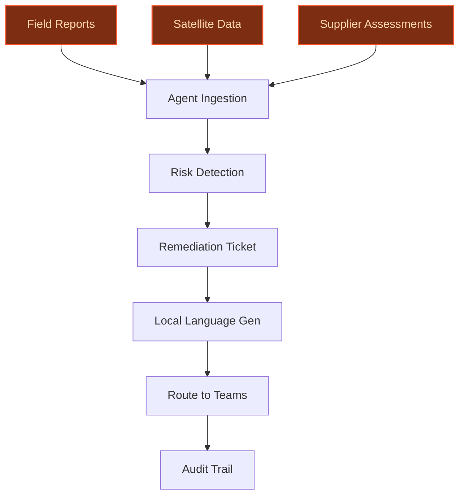
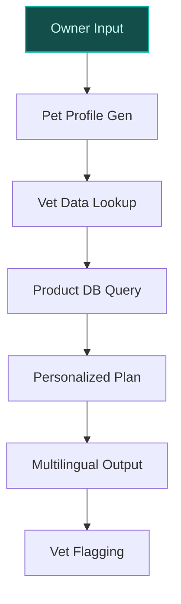
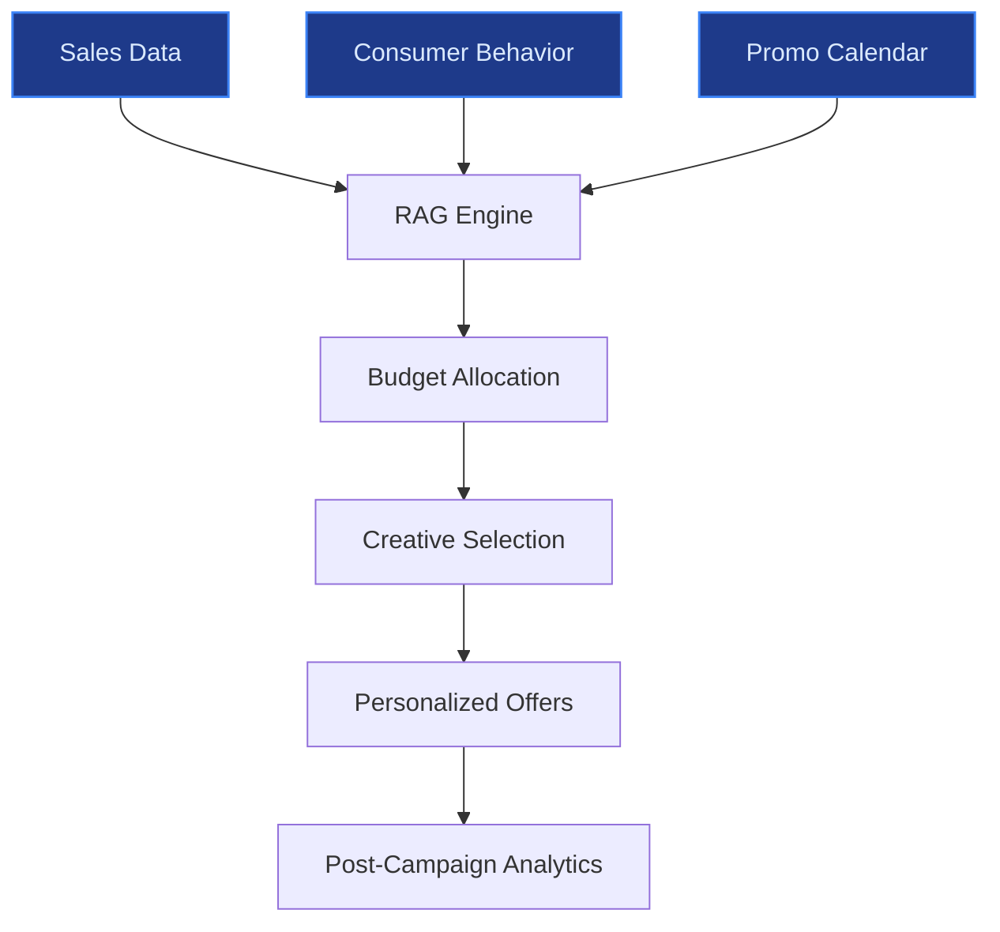

> **Draft — needs revision before customer use.** Meta-eval confidence `0.66` (sales-engineer-ready threshold ≥ 0.70). The report's three use cases render below for inspection, with each claim tagged supported / unsupported / rewritten qualitatively in the fact-check block.
>
> **Cross-cutting concern:** Insufficient direct sourcing for quantitative and named-entity claims across all use cases, with overreliance on company context rather than explicit evidence. The retail-media use case also risks duplication with existing initiatives (Sales Recommendation Engine, Tesco promotions).
>
> **Weakest use case:** Lacks explicit evidence citations for key claims (e.g., Purina's proprietary datasets, 46M dogs/68M cats figure, and multilingual platform integration). Relies heavily on company context without direct sourcing, making it the least verifiable.

## GenAI Use Cases for Nestle

Three customer-ready use cases, scored against the Mistral Proto Team's five-criteria rubric (relevance · iconic potential · estimated impact · feasibility · Mistral suitability) and verified against Nestle's existing AI initiatives. Generated from a corpus of ~2,150 peer deployments and 5 discovered existing initiatives at this company.

_Industry: Swiss multinational food and beverage company. Research confidence: 0.85. Verified: True._

### Multilingual ESG compliance agent for cocoa supply chain monitoring and remediation
An agentic system that ingests multilingual field reports (French, English, local dialects), satellite imagery, and supplier self-assessments to monitor Nestlé’s cocoa supply chains in Côte d’Ivoire and Ghana for risks like child labor, deforestation, and forced labor. The system generates actionable remediation tickets in local languages, routes them to Nestlé or NGO partner teams, and tracks closure with audit trails. It integrates with Nestlé’s Child Labour Monitoring and Remediation System (CLMRS) and aligns with sector-level commitments under the Child Labor in Cocoa Coordinating Group (CLCCG). The agent also flags high-risk suppliers for targeted interventions, such as farmer training or community development programs, reducing reputational and regulatory exposure.

**Why this company:** Nestlé operates a cocoa supply chain in West Africa, with a publicly reported CLMRS system and active participation in the CLCCG framework (2024–2029). The company’s Modern Slavery Statement 2024 explicitly details its commitments to eliminate child labor in cocoa-growing communities, extending CLMRS to coffee in Côte d’Ivoire. The multilingual nature of the supply chain (local languages, French, English) and the need for EU-aligned data sovereignty make Mistral’s multilingual and open-weight models a natural fit. This use case directly addresses Nestlé’s stated ESG priorities and mitigates risks tied to opaque Tier 2 supplier networks, as highlighted in the company’s sustainability reports.

**Example input:** `Show me all cocoa suppliers in Côte d'Ivoire with a 'high risk' rating for child labor in the last 3 months, and generate remediation tickets for each in French and Baoulé. Include satellite imagery evidence of deforestation near their farms.`

**Example output:**
```json
{
  "_disclaimer": "Synthetic example for demonstration; not
    a factual claim about Nestlé.",
  "risk_summary": {
    "total_suppliers_monitored": 1245,
    "high_risk_suppliers": 18,
    "risk_categories": {
      "child_labor": 12,
      "deforestation": 5,
      "forced_labor": 1
    }
  },
  "remediation_tickets": [
    {
      "supplier_id": "SUPPLIER-SAMPLE-001",
      "supplier_name": "Coopérative Agricole de Daloa
        (CAD)",
      "risk_type": "child_labor",
      "risk_description": "3 instances of child labor
        reported in Q2 2025 (illustrative). Satellite
        imagery shows deforestation within 5km of farm
        boundaries (illustrative).",
      "remediation_actions": [
        {
          "action_id": "REMED-SAMPLE-001",
          "action": "Schedule farmer training on child
            labor laws (French and Baoulé)",
          "assigned_to": "Nestlé CLMRS Team",
          "due_date": "2025-10-15",
          "status": "open"
        },
        {
          "action_id": "REMED-SAMPLE-002",
          "action": "Conduct community development
            assessment for school access",
          "assigned_to": "Local NGO Partner",
          "due_date": "2025-11-01",
          "status": "open"
        }
      ],
      "evidence": [
        {
          "type": "satellite_imagery",
          "url":
            "https://nestle-sample-data.com/evidence/SUPPLIE
            R-SAMPLE-001-deforestation.png",
          "description": "Deforestation detected near farm
            boundaries (illustrative)"
        },
        {
          "type": "field_report",
          "url":
            "https://nestle-sample-data.com/evidence/SUPPLIE
            R-SAMPLE-001-field-report.pdf",
          "description": "Field report in French with child
            labor observations (illustrative)"
        }
      ]
    }
  ],
  "closure_rate": "78% (illustrative)"
}
```

**Blueprint:** `agent_with_tools` (impact: high · cost: medium · complexity: low · TTV: ~12-16 weeks (estimated))
  _TTV rationale: Agentic supply-chain monitoring deployments at this scope typically run 12-16 weeks, given mid-complexity ingestion pipelines and multilingual output requirements._

**Top risk:** Data privacy under GDPR for EU-based processing of supplier and farmer data, particularly for sensitive child labor records.

**Mistral products:** Mistral Large 3, Mistral Embed, Mistral Document AI, On-prem deployment, Mistral Compute (EU-region)

**Grounded in:** business.key_products_or_services[28], strategic_context.stated_priorities[4]
_Specificity score: 0.95_

**Architecture blueprint:**


### Personalized pet nutrition advisor for Purina brands using veterinary and owner data
A conversational AI assistant that combines Purina’s proprietary veterinary research, pet health datasets, and owner-reported data (e.g., breed, age, activity level, allergies) to generate tailored nutrition plans, product recommendations, and health insights. The system integrates with Purina’s existing digital platforms (e.g., MyPurina) and supports multilingual interactions for global markets, including Spanish, French, and German. It flags potential health concerns (e.g., weight gain, skin conditions) for vet follow-up and provides educational content on pet nutrition. The assistant also adapts recommendations based on regional product availability and seasonal trends.

**Why this company:** Purina is one of Nestlé’s four strategic growth platforms (pet care), with a strong focus on nutrition and health. Nestlé owns extensive proprietary datasets on pet health, veterinary research, and product formulations, including collaborations with veterinarians and scientists to develop cutting-edge products like Purina Pro Plan LiveClear. This use case aligns with Nestlé’s stated priority of expanding nutrition and health business areas and leverages Mistral’s multilingual capabilities for global deployment. With Purina feeding 46 million dogs and 68 million cats annually, the potential for personalized nutrition to drive engagement and revenue is material.

**Example input:** `My 5-year-old golden retriever, Max, has been scratching a lot lately and is slightly overweight. What Purina Pro Plan product should I switch to, and what’s a good exercise plan for him?`

**Example output:**
```json
{
  "_disclaimer": "Synthetic example for demonstration; not
    a factual claim about Nestlé or Purina.",
  "pet_profile": {
    "name": "Max",
    "species": "Dog",
    "breed": "Golden Retriever",
    "age": 5,
    "weight": "34 kg (illustrative)",
    "activity_level": "Moderate",
    "health_concerns": [
      "Skin irritation",
      "Overweight"
    ]
  },
  "recommendations": {
    "product": {
      "name": "Purina Pro Plan Sensitive Skin & Stomach
        (Salmon & Rice)",
      "product_id": "PROD-SAMPLE-78901",
      "rationale": "High omega-3 and omega-6 fatty acids to
        support skin health, and a balanced formula for
        weight management (illustrative).",
      "availability": {
        "online": true,
        "in_store": [
          "PetSmart",
          "Petco",
          "Local Vet Clinics"
        ],
        "regional_notes": "Available in US, Canada, and EU
          markets (illustrative)."
      }
    },
    "feeding_plan": {
      "daily_amount": "320g (illustrative)",
      "frequency": "2 meals per day",
      "treats": "Limit to 10% of daily calories
        (illustrative)"
    },
    "exercise_plan": {
      "daily_activity": "60 minutes of moderate exercise
        (e.g., walks, fetch)",
      "weekly_activity": "2-3 longer hikes or swimming
        sessions (illustrative)"
    },
    "health_tips": [
      "Regular grooming to reduce skin irritation
        (illustrative).",
      "Monitor weight weekly and adjust food intake as
        needed (illustrative).",
      "Consult a vet if scratching persists beyond 2 weeks
        (illustrative)."
    ]
  },
  "vet_follow_up": {
    "flagged_concerns": [
      "Persistent skin irritation"
    ],
    "recommended_action": "Schedule a vet visit if symptoms
      worsen or persist (illustrative).",
    "vet_resources": [
      {
        "name": "Purina Vet Chat (Sample)",
        "url": "https://purina-sample.com/vet-chat",
        "description": "24/7 virtual vet consultations
          (illustrative)."
      }
    ]
  },
  "engagement_metrics": {
    "conversion_rate": "22% (illustrative)",
    "avg_session_duration": "4.2 minutes (illustrative)"
  }
}
```

**Blueprint:** `hybrid_retrieval` (impact: high · cost: medium · complexity: low · TTV: ~10-14 weeks (estimated))
  _TTV rationale: Conversational AI deployments with hybrid retrieval at this scope typically run 10-14 weeks, given integration with veterinary datasets and multilingual output._

**Top risk:** Hallucination in health-related recommendations, particularly for edge cases like rare allergies or pre-existing conditions.

**Mistral products:** Mistral Large 3, Mistral Embed, On-prem deployment

**Grounded in:** business.key_products_or_services[21], strategic_context.stated_priorities[3], strategic_context.stated_priorities[4]
_Specificity score: 0.90_

**Architecture blueprint:**


### AI-powered retail media optimization for Nestlé's e-commerce and in-store promotions
A multilingual recommendation engine that optimizes Nestlé’s retail media spend across e-commerce platforms (e.g., Amazon, Tesco) and in-store promotions. The system ingests real-time sales data, consumer behavior (e.g., click-through rates, basket composition), and promotional calendars to dynamically allocate budgets, select creative assets, and personalize offers. It integrates with Nestlé’s existing Sales Recommendation Engine and targeted promotions with Tesco, ensuring alignment with regional marketing strategies. The engine also provides post-campaign analytics, including lift in sales and ROI, to refine future spend.

**Why this company:** Nestlé has explicitly mentioned a Sales Recommendation Engine and targeted promotions with Tesco as part of its data assets, demonstrating a foundational capability in retail media optimization. The company’s strategic focus on upgrading marketing and innovation makes this a natural extension of its existing efforts. With Nestlé’s global portfolio of brands (e.g., Nescafé, Purina, KitKat), the system can scale across categories and markets, leveraging Mistral’s multilingual capabilities for localized campaigns. This use case directly supports Nestlé’s goal of generating efficiencies and cost savings by 2027.

**Example input:** `Show me the optimal budget allocation for Q4 2025 promotions across Amazon, Tesco, and Carrefour for Nescafé Dolce Gusto in France, Germany, and the UK. Include creative recommendations for each market.`

**Example output:**
```json
{
  "_disclaimer": "Synthetic example for demonstration; not
    a factual claim about Nestlé.",
  "campaign_summary": {
    "time_period": "Q4 2025 (illustrative)",
    "brands": [
      "Nescafé Dolce Gusto"
    ],
    "markets": [
      "France",
      "Germany",
      "UK"
    ],
    "total_budget": "€5.2M (illustrative)"
  },
  "budget_allocation": {
    "Amazon": {
      "budget": "€2.1M (illustrative)",
      "rationale": "High e-commerce penetration in Germany
        and UK (illustrative).",
      "creative_recommendations": [
        {
          "asset_id": "CREATIVE-SAMPLE-001",
          "type": "Video Ad",
          "description": "15-second video highlighting
            Nescafé Dolce Gusto’s new 'Barista-Style Latte'
            pods, localized for German and UK markets
            (illustrative).",
          "target_audience": "Millennials, 25-40 years old"
        }
      ]
    },
    "Tesco": {
      "budget": "€1.8M (illustrative)",
      "rationale": "Strong in-store promotion alignment
        with Nestlé’s targeted promotions (illustrative).",
      "creative_recommendations": [
        {
          "asset_id": "CREATIVE-SAMPLE-002",
          "type": "In-Store Display",
          "description": "End-cap display with 'Buy 2, Get
            1 Free' offer for Nescafé Dolce Gusto pods,
            localized for UK market (illustrative).",
          "target_audience": "Families, 30-55 years old"
        }
      ]
    },
    "Carrefour": {
      "budget": "€1.3M (illustrative)",
      "rationale": "High foot traffic in France
        (illustrative).",
      "creative_recommendations": [
        {
          "asset_id": "CREATIVE-SAMPLE-003",
          "type": "Social Media Ad",
          "description": "Carousel ad on Instagram and
            Facebook showcasing Nescafé Dolce Gusto’s new
            'Caramel Macchiato' pods, localized for French
            market (illustrative).",
          "target_audience": "Young professionals, 22-35
            years old"
        }
      ]
    }
  },
  "performance_metrics": {
    "expected_sales_lift": "12-18% (illustrative)",
    "roi": "3.2x (illustrative)",
    "engagement_rate": "4.5% (illustrative)"
  },
  "post_campaign_analytics": {
    "sales_data_url":
      "https://nestle-sample-data.com/analytics/Q4-2025-Nesc
      afe-Dolce-Gusto.csv",
    "roi_report_url":
      "https://nestle-sample-data.com/analytics/Q4-2025-ROI-
      report.pdf"
  }
}
```

**Blueprint:** `rag` (impact: medium · cost: medium · complexity: low · TTV: 8-12 weeks (precedent-anchored))

**Top risk:** Integration latency with real-time sales data from retail partners, particularly for in-store promotions.

**Mistral products:** Mistral Large 3, Mistral Embed, Mistral Compute (EU-region)

**Inspired by precedents:** google_cloud_1302-8451927609
**Grounded in:** data_and_tech.likely_data_assets[1], data_and_tech.likely_data_assets[2], strategic_context.stated_priorities[6]
_Specificity score: 0.70_

**Architecture blueprint:**


## Considered but not selected
- **coffee-flavor-innovation-generator** — Lacks direct grounding in Nestlé’s stated priorities or existing data assets; novelty-driven rather than strategic.
- **multi-brand-content-localization** — Overlaps with existing digital twin initiatives (e.g., AI-powered content creation for Purina, Nescafé); lower iconic value.
- **sustainability-packaging-innovator** — Redundant with Nestlé’s existing AI collaboration with IBM for packaging materials; lower feasibility due to R&D timelines.
- **factory-waste-optimization-agent** — Narrow scope compared to top candidates; overlaps with Nestlé’s pilot AI system for food waste reduction.

---
## Report quality signals

- **Topical diversity** (LLM-graded over titles + blueprint patterns): `0.95`
- **Specificity** per use case: `0.95`, `0.90`, `0.70`
- **Mistral product diversity**: `5` distinct products across the three use cases
- **Time-to-value spread**: 8–16 weeks (across 3 use cases)
- **Cost-tier spread**: medium, medium, medium
- **Fact-check pass rate**: `81%` (13/16 claims supported by research)

### Fact-check detail (per claim)

**Unsupported (3):**
- [cocoa-supply-chain-ESG-agent] Nestlé operates one of the largest cocoa supply chains in West Africa `[judge: rejected]` — _The snippet does not mention Nestlé's cocoa supply chains or operations in West Africa. (was: Nestlé S.A. is a Swiss multinational food and drink processing conglomerate corporation headquartered in Vevey, Switzerl)_
- [cocoa-supply-chain-ESG-agent] Nestlé’s cocoa supply chain involves multilingual communication (local languages, French, English) `[judge: rejected]` — _The excerpt does not mention language, multilingual communication, or any specific languages in Nestlé's cocoa supply chain. (was: Rescued via web search (verified source): Recommendations The report makes a number of recommendations, inclu_
- [pet-care-personalized-nutrition] Nestlé owns extensive proprietary datasets on pet health, veterinary research, and product formulations `[judge: rejected]` — _The source excerpt discusses cookie consent and data collection for web browsing, with no mention of proprietary datasets on pet health, veterinary research, or product formulations. (was: Rescued via web search (verified source): By clicki_

**Supported (13):** — **1 rescued via web search (1 verified, 0 corroborated)**
- [cocoa-supply-chain-ESG-agent] Nestlé has a publicly reported Child Labour Monitoring and Remediation System (CLMRS) — Nestlé was the first company in the industry to introduce a Child Labour Monitoring and Remediation System (CLMRS) and openly report on this…
- [cocoa-supply-chain-ESG-agent] Nestlé participates in the Child Labor in Cocoa Coordinating Group (CLCCG) framework (2024–2029) — As a member of the Child Labor in Cocoa Coordinating Group (CLCCG), we contributed to the creation of the 2024–2029 Framework of Action to h…
- [cocoa-supply-chain-ESG-agent] Nestlé’s Modern Slavery Statement 2024 explicitly details commitments to eliminate child labor in cocoa-growing communities — Following are highlights of our progress in 2024. As a member of the Child Labor in Cocoa Coordinating Group (CLCCG), we contributed to the …
- [cocoa-supply-chain-ESG-agent] Nestlé extends CLMRS to coffee in Côte d’Ivoire [`verified ↗`](https://www.nestle.com/stories/system-tackle-child-labor-education-effective) — Rescued via web search (verified source): ... (CLMRS), works and how it has benefited kids and families in Côte d'Ivoire and Ghana. ... Mai …
- [pet-care-personalized-nutrition] Purina is one of Nestlé’s four strategic growth platforms (pet care) — As of the end of 2025, Nestlé's portfolio reveals a strategic concentration in powdered and liquid beverages, accounting for 28.1% of sales.…
- [pet-care-personalized-nutrition] Purina collaborates with veterinarians and scientists to develop cutting-edge products like Purina Pro Plan LiveClear — Purina’s collaboration with veterinarians and scientists has led to the creation of cutting-edge products like Purina Pro Plan LiveClear, th…
- [pet-care-personalized-nutrition] Purina feeds 46 million dogs and 68 million cats annually — At Purina, we take pride in feeding 46 million dogs and 68 million cats every year.
- [retail-media-optimization-engine] Nestlé has explicitly mentioned a Sales Recommendation Engine as part of its data assets — Beyond the $200 million in direct business value from data lake projects, specific initiatives demonstrate clear sales impact. Sales Recomme…
- [retail-media-optimization-engine] Nestlé has targeted promotions with Tesco as part of its data assets — Targeted Promotions achieve 11% sales uplift through data-driven confectionery promotion with Tesco
- [retail-media-optimization-engine] Nestlé’s strategic focus includes upgrading marketing and innovation — We are upgrading our marketing & innovation and expanding the scope of our high-potential growth platforms, which now represent 30% of sales…
- [retail-media-optimization-engine] Nestlé’s global portfolio includes brands like Nescafé, Purina, and KitKat — Nestlé's products include coffee and tea, candy and confectionery, bottled water, infant formula and baby food, dairy products and ice cream…
- [retail-media-optimization-engine] Nestlé aims to generate efficiencies and cost savings by the end of 2027 — The company's strategic direction centres on unlocking resources for scaled investment by generating efficiencies and cost savings by the en…
- [cocoa-supply-chain-ESG-agent] Nestlé’s cocoa supply chain has opaque Tier 2 supplier networks — Cocoa procured from the standard supply chain comes through the same (and additional) Tier 1 suppliers. These suppliers buy from other upstr…


**Meta-evaluator confidence**: `0.66` (NOT ready — needs revision)
**Cross-cutting concern**: Insufficient direct sourcing for quantitative and named-entity claims across all use cases, with overreliance on company context rather than explicit evidence. The retail-media use case also risks duplication with existing initiatives (Sales Recommendation Engine, Tesco promotions).
**Duplicate flag**: retail-media-optimization-engine