# Trace

## Execution trace — Nestle

Started: `2026-05-10T22:14:12.411070+00:00`. Total wall time: `164.7s` across `42` recorded actions.

### Per-step time totals

| Step | Calls | Total time | Avg time |
|---|---:|---:|---:|
| `research` | 1 | 6.86s | 6857ms |
| `gap_fill` | 4 | 9.34s | 2334ms |
| `retrieve` | 2 | 0.31s | 153ms |
| `generate` | 2 | 25.58s | 12789ms |
| `generate.web_search` | 2 | 6.25s | 3123ms |
| `score` | 2 | 24.62s | 12311ms |
| `verify` | 6 | 19.97s | 3329ms |
| `enrich` | 1 | 64.60s | 64598ms |
| `meta_eval` | 1 | 11.83s | 11833ms |
| `web_verify` | 1 | 1.90s | 1899ms |
| `source_judge` | 17 | 13.02s | 766ms |
| `final_qualify` | 1 | 1.94s | 1936ms |
| `quality_signals` | 2 | 3.81s | 1906ms |

### Chronological event log

- `22:14:13.473` **[research]** `mistral-medium-2604.chat.complete` — 6857ms
   - inputs: synthesize CompanyContext for Nestle | depth=medium
   - outputs: industry='Swiss multinational food and beverage company' verified=True conf=0.75
- `22:14:20.333` **[gap_fill]** `mistral-small-2603.chat.complete` — 5832ms
   - inputs: generate gap queries | fields=['business_model', 'products', 'data_assets', 'priorities']
   - outputs: queries=4
- `22:14:30.817` **[gap_fill]** `mistral-small-2603.chat.complete` — 1101ms
   - inputs: layer-2 extract field=priorities
   - outputs: items=8
- `22:14:30.821` **[gap_fill]** `mistral-small-2603.chat.complete` — 706ms
   - inputs: layer-2 extract field=data_assets
   - outputs: items=6
- `22:14:30.825` **[gap_fill]** `mistral-small-2603.chat.complete` — 1698ms
   - inputs: layer-2 extract field=products
   - outputs: items=41
- `22:14:32.525` **[retrieve]** `mistral-embed.embeddings.create` — 300ms
   - inputs: company_query | industries='Swiss multinational food and beverage company'
   - outputs: embedded 1024-dim query vector
- `22:14:32.824` **[retrieve]** `precedent_corpus.cosine_topk` — 6ms
   - inputs: k=8 min_depth=0.4 target='Nestle'
   - outputs: retrieved 8 | mmr=True | top_sim=0.812
- `22:14:34.527` **[generate]** `mistral-medium-2604.chat.complete` — 2083ms
   - inputs: iteration=0 tool_calls_used=0/2 tools=on
   - outputs: tool_calls=4 | content_chars=0
- `22:14:36.630` **[generate.web_search]** `tavily.search` — 3033ms
   - inputs: query='Nestlé 2025 sustainability commitments cocoa deforestation child labor'
   - outputs: 2 raw results
- `22:14:39.701` **[generate.web_search]** `tavily.search` — 3214ms
   - inputs: query='Nestlé 2025 digital twin brands Purina Nescafé Dolce Gusto Nespresso details'
   - outputs: 2 raw results
- `22:14:44.594` **[generate]** `mistral-medium-2604.chat.complete` — 23494ms
   - inputs: iteration=1 tool_calls_used=2/2 tools=off
   - outputs: tool_calls=0 | content_chars=16032
- `22:15:08.338` **[score]** `mistral-small-2603.chat.complete` — 12009ms
   - inputs: self-consistency pass T=0.2
   - outputs: scored 8 candidates
- `22:15:08.344` **[score]** `mistral-small-2603.chat.complete` — 12613ms
   - inputs: self-consistency pass T=0.4
   - outputs: scored 8 candidates
- `22:15:20.992` **[verify]** `tavily.search` — 2226ms
   - inputs: candidate=cocoa-supply-chain-ESG-agent | query='Nestle Multilingual ESG compliance agent for cocoa supply ch'
   - outputs: 4 results
- `22:15:20.992` **[verify]** `tavily.search` — 2068ms
   - inputs: candidate=coffee-flavor-innovation-generator | query='Nestle AI-driven flavor innovation generator for Nespresso a'
   - outputs: 4 results
- `22:15:20.992` **[verify]** `tavily.search` — 5616ms
   - inputs: candidate=pet-care-personalized-nutrition | query='Nestle Personalized pet nutrition advisor for Purina brands '
   - outputs: 4 results
- `22:15:23.995` **[verify]** `mistral-small-2603.chat.complete` — 2812ms
   - inputs: verdict for coffee-flavor-innovation-generator
   - outputs: verdict='confirmed_existing'
- `22:15:24.376` **[verify]** `mistral-small-2603.chat.complete` — 3499ms
   - inputs: verdict for cocoa-supply-chain-ESG-agent
   - outputs: verdict='pass'
- `22:15:26.884` **[verify]** `mistral-small-2603.chat.complete` — 3751ms
   - inputs: verdict for pet-care-personalized-nutrition
   - outputs: verdict='pass'
- `22:15:30.638` **[enrich]** `mistral-large-2512.chat.complete` — 64598ms
   - inputs: tier=standard parallel=False ids=['cocoa-supply-chain-ESG-agent', 'pet-care-personalized-nutrition', 'retail-media-optimization-engine']
   - outputs: enriched 3 use cases
- `22:16:35.258` **[meta_eval]** `mistral-medium-2604.chat.complete` — 11833ms
   - inputs: reviewing 3 use cases
   - outputs: review + claims
- `22:16:47.112` **[web_verify]** `tavily.search.rescue_unsupported_claims` — 1899ms
   - inputs: company='Nestle' unsupported=3 budget=12
   - outputs: rescued: verified=3 corroborated=0 of 3 attempted
- `22:16:49.015` **[source_judge]** `mistral-small-2603.judge_claim_sources` — 1580ms
   - inputs: pairs=16
   - outputs: judged 16 pairs
- `22:16:49.015` **[source_judge]** `mistral-small-2603.chat.complete` — 812ms
   - inputs: claim='Nestlé operates one of the largest cocoa supply chains in We'
   - outputs: verdict=unsupported
- `22:16:49.019` **[source_judge]** `mistral-small-2603.chat.complete` — 782ms
   - inputs: claim='Nestlé has a publicly reported Child Labour Monitoring and R'
   - outputs: verdict=supported
- `22:16:49.022` **[source_judge]** `mistral-small-2603.chat.complete` — 940ms
   - inputs: claim='Nestlé participates in the Child Labor in Cocoa Coordinating'
   - outputs: verdict=supported
- `22:16:49.026` **[source_judge]** `mistral-small-2603.chat.complete` — 1015ms
   - inputs: claim='Nestlé’s Modern Slavery Statement 2024 explicitly details co'
   - outputs: verdict=supported
- `22:16:49.031` **[source_judge]** `mistral-small-2603.chat.complete` — 792ms
   - inputs: claim='Nestlé extends CLMRS to coffee in Côte d’Ivoire'
   - outputs: verdict=supported
- `22:16:49.035` **[source_judge]** `mistral-small-2603.chat.complete` — 759ms
   - inputs: claim='Nestlé’s cocoa supply chain involves multilingual communicat'
   - outputs: verdict=unsupported
- `22:16:49.038` **[source_judge]** `mistral-small-2603.chat.complete` — 917ms
   - inputs: claim='Purina is one of Nestlé’s four strategic growth platforms (p'
   - outputs: verdict=supported
- `22:16:49.041` **[source_judge]** `mistral-small-2603.chat.complete` — 892ms
   - inputs: claim='Nestlé owns extensive proprietary datasets on pet health, ve'
   - outputs: verdict=unsupported
- `22:16:49.793` **[source_judge]** `mistral-small-2603.chat.complete` — 563ms
   - inputs: claim='Purina collaborates with veterinarians and scientists to dev'
   - outputs: verdict=supported
- `22:16:49.801` **[source_judge]** `mistral-small-2603.chat.complete` — 573ms
   - inputs: claim='Purina feeds 46 million dogs and 68 million cats annually'
   - outputs: verdict=supported
- `22:16:49.823` **[source_judge]** `mistral-small-2603.chat.complete` — 553ms
   - inputs: claim='Nestlé has explicitly mentioned a Sales Recommendation Engin'
   - outputs: verdict=supported
- `22:16:49.828` **[source_judge]** `mistral-small-2603.chat.complete` — 569ms
   - inputs: claim='Nestlé has targeted promotions with Tesco as part of its dat'
   - outputs: verdict=supported
- `22:16:49.933` **[source_judge]** `mistral-small-2603.chat.complete` — 594ms
   - inputs: claim='Nestlé’s strategic focus includes upgrading marketing and in'
   - outputs: verdict=supported
- `22:16:49.955` **[source_judge]** `mistral-small-2603.chat.complete` — 616ms
   - inputs: claim='Nestlé’s global portfolio includes brands like Nescafé, Puri'
   - outputs: verdict=supported
- `22:16:49.963` **[source_judge]** `mistral-small-2603.chat.complete` — 506ms
   - inputs: claim='Nestlé aims to generate efficiencies and cost savings by the'
   - outputs: verdict=supported
- `22:16:50.040` **[source_judge]** `mistral-small-2603.chat.complete` — 554ms
   - inputs: claim='Nestlé’s cocoa supply chain has opaque Tier 2 supplier netwo'
   - outputs: verdict=supported
- `22:16:51.016` **[final_qualify]** `mistral-small-2603.chat.complete` — 1936ms
   - inputs: use_case=cocoa-supply-chain-ESG-agent unsupported=1
   - outputs: qualified 4 fields
- `22:16:53.331` **[quality_signals]** `mistral-small-2603.chat.complete` — 2241ms
   - inputs: specificity grade (3 use cases)
   - outputs: scored 3 use cases
- `22:16:55.572` **[quality_signals]** `mistral-small-2603.chat.complete` — 1570ms
   - inputs: diversity grade
   - outputs: diversity=0.95

## Mermaid sequence

```mermaid
sequenceDiagram
    autonumber
    participant pipeline as pipeline
    participant mistral_medium_2604 as mistral-medium-2604
    participant mistral_small_2603 as mistral-small-2603
    participant mistral_embed as mistral-embed
    participant precedent_corpus as precedent_corpus
    participant tavily as tavily
    participant mistral_large_2512 as mistral-large-2512
    participant tavily_search as tavily.search
    pipeline->>mistral_medium_2604: research: chat.complete (6857ms)
    mistral_medium_2604-->>pipeline: industry='Swiss multinational food and beverage company' ver
    pipeline->>mistral_small_2603: gap_fill: chat.complete (5832ms)
    mistral_small_2603-->>pipeline: queries=4
    pipeline->>mistral_small_2603: gap_fill: chat.complete (1101ms)
    mistral_small_2603-->>pipeline: items=8
    pipeline->>mistral_small_2603: gap_fill: chat.complete (706ms)
    mistral_small_2603-->>pipeline: items=6
    pipeline->>mistral_small_2603: gap_fill: chat.complete (1698ms)
    mistral_small_2603-->>pipeline: items=41
    pipeline->>mistral_embed: retrieve: embeddings.create (300ms)
    mistral_embed-->>pipeline: embedded 1024-dim query vector
    pipeline->>precedent_corpus: retrieve: cosine_topk (6ms)
    precedent_corpus-->>pipeline: retrieved 8 | mmr=True | top_sim=0.812
    pipeline->>mistral_medium_2604: generate: chat.complete (2083ms)
    mistral_medium_2604-->>pipeline: tool_calls=4 | content_chars=0
    pipeline->>tavily: generate.web_search: search (3033ms)
    tavily-->>pipeline: 2 raw results
    pipeline->>tavily: generate.web_search: search (3214ms)
    tavily-->>pipeline: 2 raw results
    pipeline->>mistral_medium_2604: generate: chat.complete (23494ms)
    mistral_medium_2604-->>pipeline: tool_calls=0 | content_chars=16032
    pipeline->>mistral_small_2603: score: chat.complete (12009ms)
    mistral_small_2603-->>pipeline: scored 8 candidates
    pipeline->>mistral_small_2603: score: chat.complete (12613ms)
    mistral_small_2603-->>pipeline: scored 8 candidates
    pipeline->>tavily: verify: search (2226ms)
    tavily-->>pipeline: 4 results
    pipeline->>tavily: verify: search (2068ms)
    tavily-->>pipeline: 4 results
    pipeline->>tavily: verify: search (5616ms)
    tavily-->>pipeline: 4 results
    pipeline->>mistral_small_2603: verify: chat.complete (2812ms)
    mistral_small_2603-->>pipeline: verdict='confirmed_existing'
    pipeline->>mistral_small_2603: verify: chat.complete (3499ms)
    mistral_small_2603-->>pipeline: verdict='pass'
    pipeline->>mistral_small_2603: verify: chat.complete (3751ms)
    mistral_small_2603-->>pipeline: verdict='pass'
    pipeline->>mistral_large_2512: enrich: chat.complete (64598ms)
    mistral_large_2512-->>pipeline: enriched 3 use cases
    pipeline->>mistral_medium_2604: meta_eval: chat.complete (11833ms)
    mistral_medium_2604-->>pipeline: review + claims
    pipeline->>tavily_search: web_verify: rescue_unsupported_claims (1899ms)
    tavily_search-->>pipeline: rescued: verified=3 corroborated=0 of 3 attempted
    pipeline->>mistral_small_2603: source_judge: judge_claim_sources (1580ms)
    mistral_small_2603-->>pipeline: judged 16 pairs
    pipeline->>mistral_small_2603: source_judge: chat.complete (812ms)
    mistral_small_2603-->>pipeline: verdict=unsupported
    pipeline->>mistral_small_2603: source_judge: chat.complete (782ms)
    mistral_small_2603-->>pipeline: verdict=supported
    pipeline->>mistral_small_2603: source_judge: chat.complete (940ms)
    mistral_small_2603-->>pipeline: verdict=supported
    pipeline->>mistral_small_2603: source_judge: chat.complete (1015ms)
    mistral_small_2603-->>pipeline: verdict=supported
    pipeline->>mistral_small_2603: source_judge: chat.complete (792ms)
    mistral_small_2603-->>pipeline: verdict=supported
    pipeline->>mistral_small_2603: source_judge: chat.complete (759ms)
    mistral_small_2603-->>pipeline: verdict=unsupported
    pipeline->>mistral_small_2603: source_judge: chat.complete (917ms)
    mistral_small_2603-->>pipeline: verdict=supported
    pipeline->>mistral_small_2603: source_judge: chat.complete (892ms)
    mistral_small_2603-->>pipeline: verdict=unsupported
    pipeline->>mistral_small_2603: source_judge: chat.complete (563ms)
    mistral_small_2603-->>pipeline: verdict=supported
    pipeline->>mistral_small_2603: source_judge: chat.complete (573ms)
    mistral_small_2603-->>pipeline: verdict=supported
    pipeline->>mistral_small_2603: source_judge: chat.complete (553ms)
    mistral_small_2603-->>pipeline: verdict=supported
    pipeline->>mistral_small_2603: source_judge: chat.complete (569ms)
    mistral_small_2603-->>pipeline: verdict=supported
    pipeline->>mistral_small_2603: source_judge: chat.complete (594ms)
    mistral_small_2603-->>pipeline: verdict=supported
    pipeline->>mistral_small_2603: source_judge: chat.complete (616ms)
    mistral_small_2603-->>pipeline: verdict=supported
    pipeline->>mistral_small_2603: source_judge: chat.complete (506ms)
    mistral_small_2603-->>pipeline: verdict=supported
    pipeline->>mistral_small_2603: source_judge: chat.complete (554ms)
    mistral_small_2603-->>pipeline: verdict=supported
    pipeline->>mistral_small_2603: final_qualify: chat.complete (1936ms)
    mistral_small_2603-->>pipeline: qualified 4 fields
    pipeline->>mistral_small_2603: quality_signals: chat.complete (2241ms)
    mistral_small_2603-->>pipeline: scored 3 use cases
    pipeline->>mistral_small_2603: quality_signals: chat.complete (1570ms)
    mistral_small_2603-->>pipeline: diversity=0.95
```

