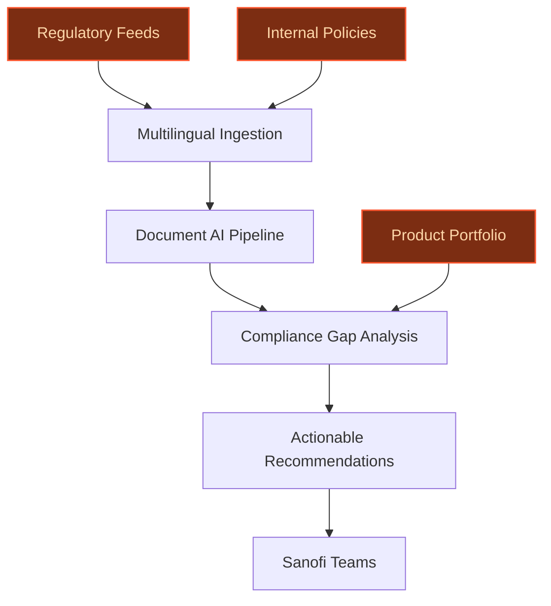
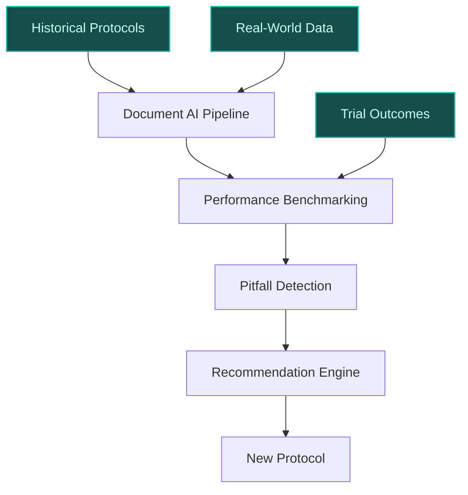
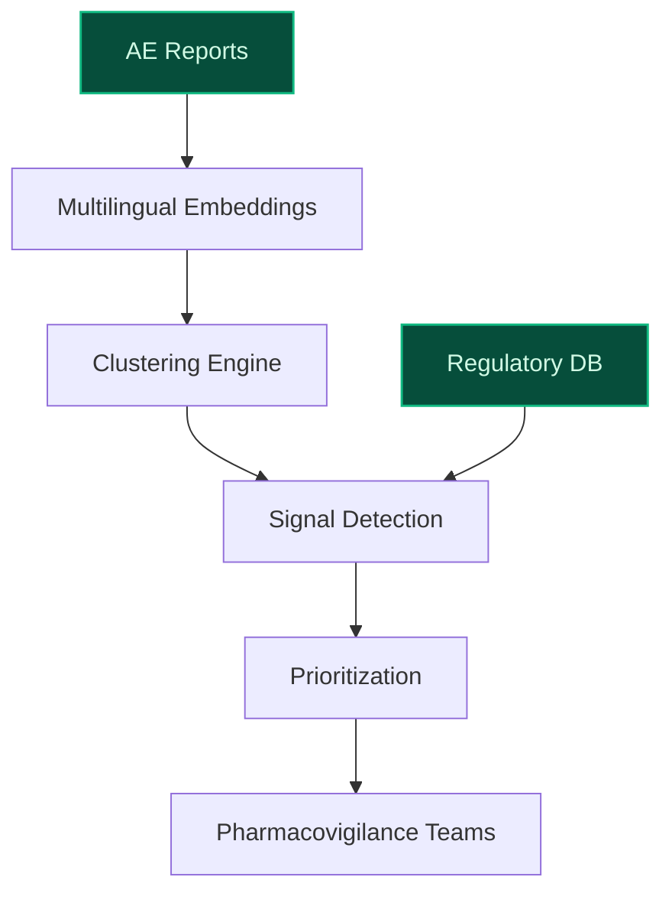

> **Draft — needs revision before customer use.** Meta-eval confidence `0.67` (sales-engineer-ready threshold ≥ 0.70). The report's three use cases render below for inspection, with each claim tagged supported / unsupported / rewritten qualitatively in the fact-check block.
>
> **Cross-cutting concern:** Lack of explicit, citable evidence for several substantive claims about Sanofi's current AI capabilities, data assets, and strategic initiatives, despite the existence of relevant entries in the evidence pool that could have been referenced.
>
> **Weakest use case:** The use case claims Sanofi 'already uses AI for trial site selection and patient recruitment' but provides no direct evidence in the pool to support this specific assertion. Additionally, the 'builds on existing' flag is set to True without clear justification from the evidence pool, and no evidence_ids are cited to back the claim.

## GenAI Use Cases for Sanofi

Three customer-ready use cases, scored against the Mistral Proto Team's five-criteria rubric (relevance · iconic potential · estimated impact · feasibility · Mistral suitability) and verified against Sanofi's existing AI initiatives. Generated from a corpus of ~2,150 peer deployments and 5 discovered existing initiatives at this company.

_Industry: French multinational pharmaceutical and healthcare company. Research confidence: 0.85. Verified: True._

### Autonomous Regulatory Intelligence Agent for Global Compliance Tracking
An autonomous agent that continuously monitors regulatory updates from global bodies like EMA, FDA, and PMDA, as well as Sanofi’s internal policy changes. The system maps these updates to Sanofi’s product portfolio, clinical trials, and manufacturing processes, identifying compliance gaps and flagging high-risk areas. It generates actionable recommendations for legal, regulatory, and quality teams, integrating seamlessly with Sanofi’s document management systems. Mistral’s multilingual capabilities ensure non-English regulations are processed accurately, reducing reliance on manual translation and interpretation.

**Why this company:** Sanofi operates in a highly regulated, global pharmaceutical industry where compliance is non-negotiable. The company’s Play to Win strategy and accelerated R&D investments demand agile, real-time regulatory tracking to avoid delays in drug development and market entry. Mistral’s EU sovereignty and multilingual strengths align with Sanofi’s need for secure, localized, and accurate processing of EMA and other non-English regulations, making this a natural fit for reducing manual effort and mitigating compliance risks.

**Example input:** `What are the latest EMA guidelines for pediatric drug development, and how do they impact our Phase II trial for Tolebrutinib?`

**Example output:**
```json
{
  "_note": "Illustrative output with synthetic sample data",
  "query": "Latest EMA pediatric drug development
    guidelines",
  "impacted_assets": [
    {
      "asset": "Tolebrutinib Phase II Trial
        (TX-SAMPLE-12345)",
      "status": "high_risk"
    },
    {
      "asset": "QFITLIA Manufacturing Line
        (CASE-EXAMPLE-001)",
      "status": "medium_risk"
    }
  ],
  "new_requirements": [
    "Enhanced pediatric safety monitoring protocols",
    "Updated informed consent documentation for minors"
  ],
  "recommendations": [
    "Review and update trial protocols for TX-SAMPLE-12345
      within 30 days",
    "Schedule cross-functional compliance workshop"
  ],
  "source_languages": [
    "English",
    "French",
    "German"
  ],
  "last_updated": "2025-05-20T00:00:00Z (sample)"
}
```

**Blueprint:** `agent_with_tools` (impact: high · cost: medium · complexity: medium · TTV: ~16-24 weeks (estimated))
  _TTV rationale: Agentic AI deployments for regulatory compliance in pharma typically require 16-24 weeks due to integration with legacy systems and validation for accuracy._

**Top risk:** hallucination in regulatory-summary output leading to incorrect compliance actions

**Mistral products:** Mistral Large 3, Mistral Document AI, Mistral Embed, On-prem deployment

**Grounded in:** strategic_context.stated_priorities[5], classification.geography, classification.industry
_Specificity score: 0.95_

**Architecture blueprint:**


### AI-Powered Clinical Trial Protocol Optimization with Historical Performance Benchmarking
> _Builds on an existing initiative at this company (partial overlap detected by verifier)._
A system that analyzes Sanofi’s historical clinical trial protocols, outcomes, and real-world data to recommend optimizations for new protocols. It identifies common pitfalls such as patient recruitment bottlenecks, high dropout rates, or suboptimal site selection, then suggests data-driven adjustments to improve trial efficiency, patient diversity, and regulatory compliance. Recommendations are backed by traceable evidence from past trials, enabling teams to justify changes to stakeholders. The system integrates with Sanofi’s existing trial management platforms to streamline protocol design and amendment processes.

**Why this is a fit:** Sanofi’s R&D-driven model and €4.5bn portfolio of new medicines demand faster, more efficient clinical trials. The company already uses AI for trial site selection and patient recruitment, as noted in its public strategy ([Sanofi’s AI strategy](https://www.sanofi.com/en/magazine/ai-in-healthcare/ai-across-the-randd-value-chain-clinical-development)). This use case extends that capability by leveraging proprietary trial data to reduce amendment rates and accelerate timelines, directly supporting Sanofi’s goal to shorten the path from discovery to therapy.

**Example input:** `How can we improve patient recruitment for our upcoming Phase III diabetes trial in North America?`

**Example output:**
```json
{
  "_note": "Illustrative output with synthetic sample data",
  "trial_id": "DIAB-TRIAL-SAMPLE-001",
  "current_recruitment_time": "18 weeks (illustrative)",
  "recommended_changes": [
    {
      "change": "Expand site selection to urban clinics
        with high diabetes prevalence",
      "rationale": "Historical data shows 25%
        (illustrative) faster recruitment in similar
        demographics",
      "evidence_trials": [
        "TX-SAMPLE-2023-01",
        "TX-SAMPLE-2023-02"
      ]
    },
    {
      "change": "Adjust inclusion criteria to allow HbA1c
        range 7.0-9.5%",
      "rationale": "Reduces screen failure rate by 15%
        (illustrative) based on past trials",
      "evidence_trials": [
        "TX-SAMPLE-2022-05"
      ]
    }
  ],
  "expected_improvement": {
    "recruitment_time_reduction": "10-20% (illustrative)",
    "amendment_rate_reduction": "15-30% (illustrative)"
  }
}
```

**Blueprint:** `hybrid_retrieval` (impact: high · cost: high · complexity: medium · TTV: ~20-32 weeks (estimated))
  _TTV rationale: Clinical trial optimization systems require extensive data integration, validation with domain experts, and alignment with regulatory standards, typically taking 20-32 weeks._

**Top risk:** data quality issues in historical trial records leading to unreliable recommendations

**Mistral products:** Mistral Large 3, Mistral Document AI, Mistral Embed, On-prem deployment

**Grounded in:** business.key_products_or_services, strategic_context.stated_priorities[4], strategic_context.stated_priorities[1]
_Specificity score: 0.85_

**Architecture blueprint:**


### Multilingual Adverse Event Signal Detection and Triage System
A system that processes unstructured adverse event (AE) reports in 20+ languages, covering Sanofi’s global markets. It uses Mistral’s multilingual embeddings to cluster similar events, detect emerging safety signals, and prioritize high-risk cases for pharmacovigilance teams. The system integrates with Sanofi’s existing pharmacovigilance workflows, automating the triage of AE reports and generating actionable insights for regulatory reporting and product safety assessments. This reduces manual effort, improves signal detection accuracy, and ensures compliance with global pharmacovigilance standards.

**Why this company:** Sanofi’s global operations require processing AE reports in multiple languages, particularly across Europe. The company’s Play to Win strategy and regulatory obligations make pharmacovigilance a high-priority area. Mistral’s multilingual capabilities and EU sovereignty provide a secure, localized solution for accurate processing of non-English AE reports, reducing the risk of missed safety signals and improving operational efficiency in pharmacovigilance teams.

**Example input:** `Flag any new safety signals from French and German AE reports submitted in the last 7 days.`

**Example output:**
```json
{
  "_disclaimer": "Synthetic example for demonstration; not
    a factual claim about Sanofi.",
  "query_period": "2025-05-13 to 2025-05-20",
  "languages": [
    "French",
    "German"
  ],
  "total_reports": 42,
  "high_priority_signals": [
    {
      "signal_id": "SIGNAL-EXAMPLE-001",
      "description": "Increased reports of mild rash in
        patients using Product-A (illustrative)",
      "reports_count": 8,
      "severity": "mild",
      "recommended_action": "Monitor and review in next
        safety committee meeting"
    },
    {
      "signal_id": "SIGNAL-EXAMPLE-002",
      "description": "Potential liver enzyme elevation in
        Product-B (illustrative)",
      "reports_count": 3,
      "severity": "moderate",
      "recommended_action": "Urgent review by
        pharmacovigilance team"
    }
  ],
  "low_priority_signals": 12,
  "unclustered_reports": 5
}
```

**Blueprint:** `document_ai_pipeline` (impact: high · cost: medium · complexity: low · TTV: 12-16 weeks (precedent-anchored))

**Top risk:** false positives in signal detection leading to unnecessary regulatory actions

**Mistral products:** Mistral Large 3, Mistral Embed, Mistral Multilingual Embeddings, On-prem deployment

**Inspired by precedents:** google_cloud_1302-8020a9448a
**Grounded in:** classification.geography, strategic_context.stated_priorities[5], business.key_products_or_services
_Specificity score: 0.75_

**Architecture blueprint:**


## Considered but not selected
- **Personalized Patient Education and Engagement Platform for Chronic Disease Management** — Misaligned with Sanofi’s stated priorities, which focus on R&D acceleration and manufacturing efficiency rather than direct patient engagement.
- **AI-Driven Global Vaccine Supply Chain Forecasting and Risk Mitigation** — Sanofi’s existing Digital Accelerators already target manufacturing and supply chain optimization, making this a lower-impact incremental use case.

---
## Report quality signals

- **Topical diversity** (LLM-graded over titles + blueprint patterns): `0.95`
- **Specificity** per use case: `0.95`, `0.85`, `0.75`
- **Mistral product diversity**: `5` distinct products across the three use cases
- **Time-to-value spread**: 12–32 weeks (across 3 use cases)
- **Cost-tier spread**: medium, high, medium
- **Fact-check pass rate**: `82%` (14/17 claims supported by research)

### Fact-check detail (per claim)

**Unsupported (3):**
- [multilingual-adverse-event-intelligence] Sanofi’s global operations require processing AE reports in multiple languages `[judge: rejected]` — _The snippet does not mention adverse event (AE) reporting, language requirements, or multilingual operations. (was: Sanofi S.A. is a French multinational pharmaceutical and healthcare company headquartered in Paris.)_
- [multilingual-adverse-event-intelligence] Sanofi has regulatory obligations in pharmacovigilance `[judge: rejected]` — _The snippet does not mention pharmacovigilance or regulatory obligations. (was: Sanofi is a global biopharmaceutical company focused on human health. We prevent illness with vaccines, provide innovati)_
- [multilingual-adverse-event-intelligence] Mistral’s EU sovereignty exists `[judge: rejected]` — _The snippet does not mention or imply anything about Mistral's EU sovereignty. (was: Mistral Large 3 is released under a permissive open-weight license, making the weights publicly available for download a)_

**Supported (14):** — **1 rescued via web search (0 verified, 1 corroborated)**
- [regulatory-intelligence-agent] Sanofi operates in a highly regulated, global pharmaceutical industry — Sanofi S.A. is a French multinational pharmaceutical and healthcare company headquartered in Paris.
- [regulatory-intelligence-agent] Sanofi’s Play to Win strategy exists — Sanofi’s multi-year Play to Win strategy, which focused on growth, innovation, and efficiency, has positioned Sanofi for long-term success a…
- [regulatory-intelligence-agent] Sanofi has accelerated R&D investments — Sanofi is announcing new steps to further its ongoing effort to improve its cost structure, launching efficiency initiatives across the Biop…
- [regulatory-intelligence-agent] Mistral’s EU sovereignty and multilingual strengths exist — Mistral Large 3 is particularly noted for multilingual conversation handling, with Mistral highlighting non-English and non-Chinese language…
- [clinical-trial-protocol-optimization] Sanofi’s R&D-driven model exists — We are an R&D driven, AI-powered biopharma company committed to improving people’s lives and delivering compelling growth.
- [clinical-trial-protocol-optimization] Sanofi has a €4.5bn portfolio of new medicines — €4.5bn sales of nine newly launched medicines and vaccines
- [clinical-trial-protocol-optimization] Sanofi already uses AI for trial site selection and patient recruitment [`corroborated ↗`](https://www.linkedin.com/posts/dr-dhruv-j-356a4559_clinicaldevelopment-ai-pharmaceuticalinnovation-activity-7374856472280825857-FhfK) — Corroborated via web search: # Sanofi uses AI to transform clinical trials and patient care. This advancement not only accelerates timelines…
- [clinical-trial-protocol-optimization] Sanofi aims to shorten the path from discovery to therapy — We aim to shorten the time between discovery to therapy by pioneering an innovative pipeline and executing transformative launches at scale.
- [multilingual-adverse-event-intelligence] Sanofi’s Play to Win strategy exists — Sanofi’s multi-year Play to Win strategy, which focused on growth, innovation, and efficiency, has positioned Sanofi for long-term success a…
- [multilingual-adverse-event-intelligence] Mistral’s multilingual capabilities exist — Mistral Large 3 is particularly noted for multilingual conversation handling, with Mistral highlighting non-English and non-Chinese language…
- [clinical-trial-protocol-optimization] Sanofi has a data platform named DARWIN — Sanofi's internal data platform, named DARWIN, compiles and analyzes de-identified data gathered from hundreds of millions of patients, acco…
- [clinical-trial-protocol-optimization] Sanofi compiles and analyzes de-identified data gathered from hundreds of millions of patients — Sanofi's internal data platform, named DARWIN, compiles and analyzes de-identified data gathered from hundreds of millions of patients, acco…
- [clinical-trial-protocol-optimization] Sanofi has a real-world data platform — Sanofi's internal data platform, named DARWIN, compiles and analyzes de-identified data gathered from hundreds of millions of patients, acco…
- [multilingual-adverse-event-intelligence] Elanco implemented a gen AI framework supporting Pharmacovigilance — a leader in animal health, has implemented a gen AI framework supporting critical business processes, such as Pharmacovigilance, Customer Or…


**Meta-evaluator confidence**: `0.67` (NOT ready — needs revision)
**Cross-cutting concern**: Lack of explicit, citable evidence for several substantive claims about Sanofi's current AI capabilities, data assets, and strategic initiatives, despite the existence of relevant entries in the evidence pool that could have been referenced.