# Trace

## Execution trace — Sanofi

Started: `2026-05-10T22:21:40.340314+00:00`. Total wall time: `174.5s` across `39` recorded actions.

### Per-step time totals

| Step | Calls | Total time | Avg time |
|---|---:|---:|---:|
| `research` | 1 | 8.19s | 8193ms |
| `gap_fill` | 4 | 3.06s | 765ms |
| `retrieve` | 2 | 0.20s | 98ms |
| `generate` | 1 | 22.74s | 22743ms |
| `score` | 2 | 27.13s | 13565ms |
| `verify` | 6 | 19.08s | 3180ms |
| `enrich` | 1 | 74.81s | 74805ms |
| `meta_eval` | 1 | 11.31s | 11307ms |
| `web_verify` | 1 | 3.94s | 3945ms |
| `source_judge` | 18 | 21.20s | 1178ms |
| `quality_signals` | 2 | 4.34s | 2172ms |

### Chronological event log

- `22:21:50.704` **[research]** `mistral-medium-2604.chat.complete` — 8193ms
   - inputs: synthesize CompanyContext for Sanofi | depth=medium
   - outputs: industry='French multinational pharmaceutical and healthcare company' verified=True conf=0.75
- `22:21:58.900` **[gap_fill]** `mistral-small-2603.chat.complete` — 888ms
   - inputs: generate gap queries | fields=['business_model', 'products', 'data_assets', 'priorities']
   - outputs: queries=4
- `22:22:07.909` **[gap_fill]** `mistral-small-2603.chat.complete` — 706ms
   - inputs: layer-2 extract field=priorities
   - outputs: items=6
- `22:22:07.913` **[gap_fill]** `mistral-small-2603.chat.complete` — 595ms
   - inputs: layer-2 extract field=data_assets
   - outputs: items=5
- `22:22:07.917` **[gap_fill]** `mistral-small-2603.chat.complete` — 870ms
   - inputs: layer-2 extract field=products
   - outputs: items=12
- `22:22:08.788` **[retrieve]** `mistral-embed.embeddings.create` — 192ms
   - inputs: company_query | industries='French multinational pharmaceutical and healthcare company'
   - outputs: embedded 1024-dim query vector
- `22:22:08.981` **[retrieve]** `precedent_corpus.cosine_topk` — 4ms
   - inputs: k=8 min_depth=0.4 target='Sanofi'
   - outputs: retrieved 8 | mmr=True | top_sim=0.818
- `22:22:10.791` **[generate]** `mistral-medium-2604.chat.complete` — 22743ms
   - inputs: iteration=0 tool_calls_used=0/0 tools=off
   - outputs: tool_calls=0 | content_chars=16070
- `22:22:33.893` **[score]** `mistral-small-2603.chat.complete` — 13903ms
   - inputs: self-consistency pass T=0.2
   - outputs: scored 8 candidates
- `22:22:33.896` **[score]** `mistral-small-2603.chat.complete` — 13227ms
   - inputs: self-consistency pass T=0.4
   - outputs: scored 8 candidates
- `22:22:47.830` **[verify]** `tavily.search` — 2257ms
   - inputs: candidate=real-world-evidence-synthesis-agent | query='Sanofi Autonomous Real-World Evidence (RWE) Synthesis Agent '
   - outputs: 4 results
- `22:22:47.831` **[verify]** `tavily.search` — 2104ms
   - inputs: candidate=regulatory-intelligence-agent | query='Sanofi Autonomous Regulatory Intelligence Agent for Global C'
   - outputs: 4 results
- `22:22:47.832` **[verify]** `tavily.search` — 2541ms
   - inputs: candidate=clinical-trial-protocol-optimization | query='Sanofi AI-Powered Clinical Trial Protocol Optimization with '
   - outputs: 4 results
- `22:22:50.392` **[verify]** `mistral-small-2603.chat.complete` — 3224ms
   - inputs: verdict for regulatory-intelligence-agent
   - outputs: verdict='pass'
- `22:22:50.665` **[verify]** `mistral-small-2603.chat.complete` — 4766ms
   - inputs: verdict for real-world-evidence-synthesis-agent
   - outputs: verdict='confirmed_existing'
- `22:22:51.432` **[verify]** `mistral-small-2603.chat.complete` — 4189ms
   - inputs: verdict for clinical-trial-protocol-optimization
   - outputs: verdict='partial_overlap'
- `22:22:55.625` **[enrich]** `mistral-medium-2604.chat.complete` — 74805ms
   - inputs: tier=fast parallel=False ids=['regulatory-intelligence-agent', 'clinical-trial-protocol-optimization', 'multilingual-adverse-event-intelligence']
   - outputs: enriched 3 use cases
- `22:24:10.445` **[meta_eval]** `mistral-medium-2604.chat.complete` — 11307ms
   - inputs: reviewing 3 use cases
   - outputs: review + claims
- `22:24:21.774` **[web_verify]** `tavily.search.rescue_unsupported_claims` — 3945ms
   - inputs: company='Sanofi' unsupported=1 budget=12
   - outputs: rescued: verified=0 corroborated=1 of 1 attempted
- `22:24:25.720` **[source_judge]** `mistral-small-2603.judge_claim_sources` — 2448ms
   - inputs: pairs=17
   - outputs: judged 17 pairs
- `22:24:25.721` **[source_judge]** `mistral-small-2603.chat.complete` — 1639ms
   - inputs: claim='Sanofi operates in a highly regulated, global pharmaceutical'
   - outputs: verdict=supported
- `22:24:25.726` **[source_judge]** `mistral-small-2603.chat.complete` — 874ms
   - inputs: claim='Sanofi’s Play to Win strategy exists'
   - outputs: verdict=supported
- `22:24:25.731` **[source_judge]** `mistral-small-2603.chat.complete` — 1343ms
   - inputs: claim='Sanofi has accelerated R&D investments'
   - outputs: verdict=supported
- `22:24:25.737` **[source_judge]** `mistral-small-2603.chat.complete` — 1628ms
   - inputs: claim='Mistral’s EU sovereignty and multilingual strengths exist'
   - outputs: verdict=supported
- `22:24:25.740` **[source_judge]** `mistral-small-2603.chat.complete` — 1375ms
   - inputs: claim='Sanofi’s R&D-driven model exists'
   - outputs: verdict=supported
- `22:24:25.743` **[source_judge]** `mistral-small-2603.chat.complete` — 1358ms
   - inputs: claim='Sanofi has a €4.5bn portfolio of new medicines'
   - outputs: verdict=supported
- `22:24:25.746` **[source_judge]** `mistral-small-2603.chat.complete` — 1506ms
   - inputs: claim='Sanofi already uses AI for trial site selection and patient '
   - outputs: verdict=supported
- `22:24:25.749` **[source_judge]** `mistral-small-2603.chat.complete` — 1455ms
   - inputs: claim='Sanofi aims to shorten the path from discovery to therapy'
   - outputs: verdict=supported
- `22:24:26.601` **[source_judge]** `mistral-small-2603.chat.complete` — 657ms
   - inputs: claim='Sanofi’s global operations require processing AE reports in '
   - outputs: verdict=unsupported
- `22:24:27.074` **[source_judge]** `mistral-small-2603.chat.complete` — 929ms
   - inputs: claim='Sanofi’s Play to Win strategy exists'
   - outputs: verdict=supported
- `22:24:27.101` **[source_judge]** `mistral-small-2603.chat.complete` — 837ms
   - inputs: claim='Sanofi has regulatory obligations in pharmacovigilance'
   - outputs: verdict=unsupported
- `22:24:27.116` **[source_judge]** `mistral-small-2603.chat.complete` — 1002ms
   - inputs: claim='Mistral’s multilingual capabilities exist'
   - outputs: verdict=supported
- `22:24:27.203` **[source_judge]** `mistral-small-2603.chat.complete` — 810ms
   - inputs: claim='Mistral’s EU sovereignty exists'
   - outputs: verdict=unsupported
- `22:24:27.252` **[source_judge]** `mistral-small-2603.chat.complete` — 886ms
   - inputs: claim='Sanofi has a data platform named DARWIN'
   - outputs: verdict=supported
- `22:24:27.258` **[source_judge]** `mistral-small-2603.chat.complete` — 910ms
   - inputs: claim='Sanofi compiles and analyzes de-identified data gathered fro'
   - outputs: verdict=supported
- `22:24:27.360` **[source_judge]** `mistral-small-2603.chat.complete` — 758ms
   - inputs: claim='Sanofi has a real-world data platform'
   - outputs: verdict=supported
- `22:24:27.366` **[source_judge]** `mistral-small-2603.chat.complete` — 784ms
   - inputs: claim='Elanco implemented a gen AI framework supporting Pharmacovig'
   - outputs: verdict=supported
- `22:24:30.511` **[quality_signals]** `mistral-small-2603.chat.complete` — 2900ms
   - inputs: specificity grade (3 use cases)
   - outputs: scored 3 use cases
- `22:24:33.412` **[quality_signals]** `mistral-small-2603.chat.complete` — 1444ms
   - inputs: diversity grade
   - outputs: diversity=0.95

## Mermaid sequence

```mermaid
sequenceDiagram
    autonumber
    participant pipeline as pipeline
    participant mistral_medium_2604 as mistral-medium-2604
    participant mistral_small_2603 as mistral-small-2603
    participant mistral_embed as mistral-embed
    participant precedent_corpus as precedent_corpus
    participant tavily as tavily
    participant tavily_search as tavily.search
    pipeline->>mistral_medium_2604: research: chat.complete (8193ms)
    mistral_medium_2604-->>pipeline: industry='French multinational pharmaceutical and healthcare
    pipeline->>mistral_small_2603: gap_fill: chat.complete (888ms)
    mistral_small_2603-->>pipeline: queries=4
    pipeline->>mistral_small_2603: gap_fill: chat.complete (706ms)
    mistral_small_2603-->>pipeline: items=6
    pipeline->>mistral_small_2603: gap_fill: chat.complete (595ms)
    mistral_small_2603-->>pipeline: items=5
    pipeline->>mistral_small_2603: gap_fill: chat.complete (870ms)
    mistral_small_2603-->>pipeline: items=12
    pipeline->>mistral_embed: retrieve: embeddings.create (192ms)
    mistral_embed-->>pipeline: embedded 1024-dim query vector
    pipeline->>precedent_corpus: retrieve: cosine_topk (4ms)
    precedent_corpus-->>pipeline: retrieved 8 | mmr=True | top_sim=0.818
    pipeline->>mistral_medium_2604: generate: chat.complete (22743ms)
    mistral_medium_2604-->>pipeline: tool_calls=0 | content_chars=16070
    pipeline->>mistral_small_2603: score: chat.complete (13903ms)
    mistral_small_2603-->>pipeline: scored 8 candidates
    pipeline->>mistral_small_2603: score: chat.complete (13227ms)
    mistral_small_2603-->>pipeline: scored 8 candidates
    pipeline->>tavily: verify: search (2257ms)
    tavily-->>pipeline: 4 results
    pipeline->>tavily: verify: search (2104ms)
    tavily-->>pipeline: 4 results
    pipeline->>tavily: verify: search (2541ms)
    tavily-->>pipeline: 4 results
    pipeline->>mistral_small_2603: verify: chat.complete (3224ms)
    mistral_small_2603-->>pipeline: verdict='pass'
    pipeline->>mistral_small_2603: verify: chat.complete (4766ms)
    mistral_small_2603-->>pipeline: verdict='confirmed_existing'
    pipeline->>mistral_small_2603: verify: chat.complete (4189ms)
    mistral_small_2603-->>pipeline: verdict='partial_overlap'
    pipeline->>mistral_medium_2604: enrich: chat.complete (74805ms)
    mistral_medium_2604-->>pipeline: enriched 3 use cases
    pipeline->>mistral_medium_2604: meta_eval: chat.complete (11307ms)
    mistral_medium_2604-->>pipeline: review + claims
    pipeline->>tavily_search: web_verify: rescue_unsupported_claims (3945ms)
    tavily_search-->>pipeline: rescued: verified=0 corroborated=1 of 1 attempted
    pipeline->>mistral_small_2603: source_judge: judge_claim_sources (2448ms)
    mistral_small_2603-->>pipeline: judged 17 pairs
    pipeline->>mistral_small_2603: source_judge: chat.complete (1639ms)
    mistral_small_2603-->>pipeline: verdict=supported
    pipeline->>mistral_small_2603: source_judge: chat.complete (874ms)
    mistral_small_2603-->>pipeline: verdict=supported
    pipeline->>mistral_small_2603: source_judge: chat.complete (1343ms)
    mistral_small_2603-->>pipeline: verdict=supported
    pipeline->>mistral_small_2603: source_judge: chat.complete (1628ms)
    mistral_small_2603-->>pipeline: verdict=supported
    pipeline->>mistral_small_2603: source_judge: chat.complete (1375ms)
    mistral_small_2603-->>pipeline: verdict=supported
    pipeline->>mistral_small_2603: source_judge: chat.complete (1358ms)
    mistral_small_2603-->>pipeline: verdict=supported
    pipeline->>mistral_small_2603: source_judge: chat.complete (1506ms)
    mistral_small_2603-->>pipeline: verdict=supported
    pipeline->>mistral_small_2603: source_judge: chat.complete (1455ms)
    mistral_small_2603-->>pipeline: verdict=supported
    pipeline->>mistral_small_2603: source_judge: chat.complete (657ms)
    mistral_small_2603-->>pipeline: verdict=unsupported
    pipeline->>mistral_small_2603: source_judge: chat.complete (929ms)
    mistral_small_2603-->>pipeline: verdict=supported
    pipeline->>mistral_small_2603: source_judge: chat.complete (837ms)
    mistral_small_2603-->>pipeline: verdict=unsupported
    pipeline->>mistral_small_2603: source_judge: chat.complete (1002ms)
    mistral_small_2603-->>pipeline: verdict=supported
    pipeline->>mistral_small_2603: source_judge: chat.complete (810ms)
    mistral_small_2603-->>pipeline: verdict=unsupported
    pipeline->>mistral_small_2603: source_judge: chat.complete (886ms)
    mistral_small_2603-->>pipeline: verdict=supported
    pipeline->>mistral_small_2603: source_judge: chat.complete (910ms)
    mistral_small_2603-->>pipeline: verdict=supported
    pipeline->>mistral_small_2603: source_judge: chat.complete (758ms)
    mistral_small_2603-->>pipeline: verdict=supported
    pipeline->>mistral_small_2603: source_judge: chat.complete (784ms)
    mistral_small_2603-->>pipeline: verdict=supported
    pipeline->>mistral_small_2603: quality_signals: chat.complete (2900ms)
    mistral_small_2603-->>pipeline: scored 3 use cases
    pipeline->>mistral_small_2603: quality_signals: chat.complete (1444ms)
    mistral_small_2603-->>pipeline: diversity=0.95
```

