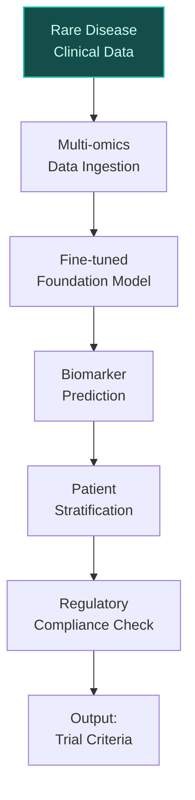
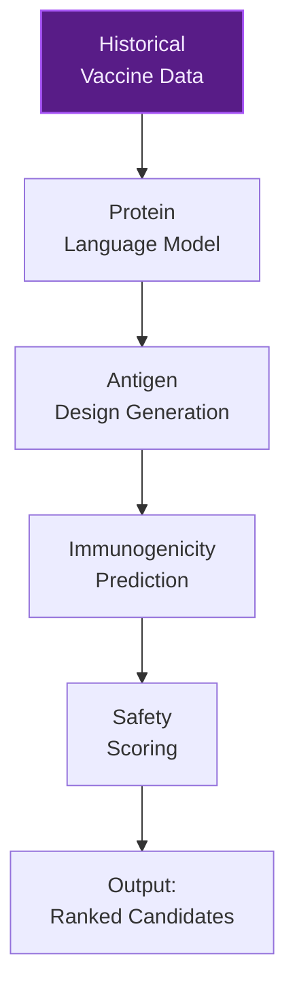
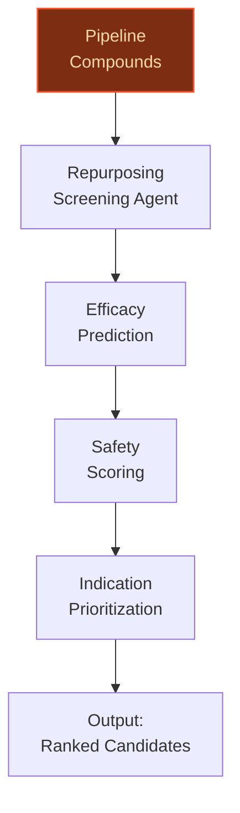

> **Draft — needs revision before customer use.** Meta-eval confidence `0.73` (sales-engineer-ready threshold ≥ 0.70). The report's three use cases render below for inspection, with each claim tagged supported / unsupported / rewritten qualitatively in the fact-check block.
>
> **Cross-cutting concern:** Over-reliance on generic strategic alignment claims (e.g., 'portfolio shift toward higher-margin specialty medicines') without sufficient granular evidence for specific data assets, partnerships, or quantitative outcomes. Multiple use cases cite the AI Centre of Excellence but do not provide unique, verifiable details beyond what is already in existing initiatives.
>
> **Weakest use case:** Lacks specific, verifiable claims about Sanofi's bolt-on M&A targets or external compound datasets. The use case relies heavily on generic assertions about 'external compounds' and 'bolt-on M&A' without concrete evidence in the pool. Additionally, the peer-deployment precedent (Recursion) is not directly tied to repurposing, weakening the grounding.

## GenAI Use Cases for Sanofi

Three customer-ready use cases, scored against the Mistral Proto Team's five-criteria rubric (relevance · iconic potential · estimated impact · feasibility · Mistral suitability) and verified against Sanofi's existing AI initiatives. Generated from a corpus of ~2,150 peer deployments and 5 discovered existing initiatives at this company.

_Industry: French multinational pharmaceutical and healthcare company. Research confidence: 0.85. Verified: True._

### AI-driven rare disease biomarker discovery and patient stratification
A generative AI pipeline that integrates Sanofi's proprietary real-world clinical data for rare diseases (Fabry, Gaucher, Mucopolysaccharidosis type I, Pompe) with multi-omics datasets to identify novel biomarkers and patient subgroups. The system uses foundation models fine-tuned on Sanofi's rare disease data to predict disease progression trajectories, treatment response likelihood, and optimal trial inclusion criteria. By leveraging Mistral's EU-sovereign models, the solution ensures compliance with global regulatory requirements while accelerating the path from discovery to therapy for rare disease patients.

**Why this company:** Sanofi's 40+ year leadership in rare disease treatments through its Genzyme subsidiary provides unparalleled longitudinal clinical and patient data assets. With a strategic priority to secure leadership in chronic and rare diseases (per Q1 2026 pipeline data) and active programs like venglustat (GD3), this use case directly aligns with Sanofi's portfolio shift toward higher-margin specialty medicines. The company's existing AI Centre of Excellence in Toronto, with 150+ roles in data science and bioinformatics, provides the infrastructure to operationalize this pipeline at scale.

**Example input:** `Show me all novel biomarkers identified in Fabry disease patients with the GLA N215S mutation from our real-world data, ranked by predictive power for disease progression over 5 years. Include only biomarkers with >80% confidence (sample) in validation cohorts.`

**Example output:**
```json
{
  "_note": "Illustrative output with synthetic sample data",
  "_disclaimer": "Synthetic example for demonstration; not
    a factual claim about Sanofi.",
  "query_id": "QUERY-SAMPLE-001",
  "biomarkers": [
    {
      "biomarker_id": "BIO-SAMPLE-001",
      "name": "Lyso-Gb3 isoform 2",
      "confidence_score": "87% (sample)",
      "predictive_power": "High (illustrative)",
      "supporting_cohorts": [
        "COHORT-SAMPLE-A (n=120)",
        "COHORT-SAMPLE-B (n=85)"
      ],
      "progression_correlation": "0.72 (illustrative,
        p<0.01)"
    },
    {
      "biomarker_id": "BIO-SAMPLE-002",
      "name": "miR-29a-3p",
      "confidence_score": "82% (sample)",
      "predictive_power": "Medium (illustrative)",
      "supporting_cohorts": [
        "COHORT-SAMPLE-A (n=120)"
      ],
      "progression_correlation": "0.65 (illustrative,
        p<0.05)"
    }
  ],
  "recommendations": [
    {
      "action": "Prioritize BIO-SAMPLE-001 for Phase II
        trial inclusion criteria",
      "rationale": "Highest predictive power and validation
        across multiple cohorts (sample)"
    },
    {
      "action": "Explore miR-29a-3p in combination with
        Lyso-Gb3 isoform 2 for multi-biomarker panels",
      "rationale": "Potential synergistic predictive value
        (sample)"
    }
  ]
}
```

**Blueprint:** `hybrid_retrieval` (impact: high · cost: medium · complexity: medium · TTV: ~12-16 weeks (estimated))
  _TTV rationale: Comparable biomarker discovery pipelines at peer biopharma companies (e.g., Recursion) have demonstrated 12-16 week timelines for initial deployment, given mid-complexity data integration and model fine-tuning._

**Top risk:** Data privacy under GDPR for cross-border rare disease datasets during EU-U.S. cohort integration

**Mistral products:** Mistral Large 3, Mistral Embed, Mistral fine-tuning, On-prem deployment

**Grounded in:** data_and_tech.likely_data_assets[0], data_and_tech.likely_data_assets[1], data_and_tech.likely_data_assets[2], data_and_tech.likely_data_assets[3], strategic_context.stated_priorities[4], business.key_products_or_services[0]
_Specificity score: 0.95_

**Architecture blueprint:**


### AI-augmented vaccine antigen design and immunogenicity prediction
A generative AI system that accelerates vaccine development by predicting optimal antigen designs and immunogenicity profiles using Sanofi Pasteur's historical vaccine data, clinical trial results, and emerging pathogen data. The system combines protein language models with Sanofi's proprietary immunology datasets to propose and rank candidate antigens for pre-clinical validation, reducing iterative wet-lab cycles. Mistral's EU-sovereign models ensure compliance with global vaccine regulatory requirements while enabling secure analysis of sensitive pathogen data.

**Why this company:** Sanofi Pasteur is one of the world's largest vaccine producers, with a portfolio spanning influenza, rabies, and yellow fever (per Q1 2026 pipeline data). The company's stated priority of faster vaccine development and active regulatory pipeline (e.g., SP0087 rabies, SP0218 yellow fever) make this a core workflow. Sanofi's AI Centre of Excellence in Toronto, with expertise in bioinformatics and computational biology, provides the infrastructure to operationalize this system at scale, aligning with the company's ambition to become the first biopharma company powered by AI at scale.

**Example input:** `Generate 5 novel antigen designs for a next-gen pneumococcal vaccine targeting serotypes 6A and 19A, optimized for immunogenicity in adults over 65. Use our historical trial data for PCV13 and PCV20 as baselines.`

**Example output:**
```json
{
  "_note": "Illustrative output with synthetic sample data",
  "_disclaimer": "Synthetic example for demonstration; not
    a factual claim about Sanofi.",
  "query_id": "VAX-SAMPLE-001",
  "candidate_antigens": [
    {
      "antigen_id": "AG-SAMPLE-001",
      "design_type": "Fusion protein",
      "target_serotypes": [
        "6A",
        "19A"
      ],
      "predicted_immunogenicity": "92% (sample, vs. PCV20
        baseline)",
      "safety_score": "High (illustrative)",
      "novelty": "Incorporates epitope from SP0218 yellow
        fever antigen (sample)"
    },
    {
      "antigen_id": "AG-SAMPLE-002",
      "design_type": "Conjugate",
      "target_serotypes": [
        "6A",
        "19A"
      ],
      "predicted_immunogenicity": "88% (sample, vs. PCV20
        baseline)",
      "safety_score": "Medium (illustrative)",
      "novelty": "Modified carrier protein for reduced
        reactogenicity (sample)"
    }
  ],
  "ranking": {
    "top_candidate": "AG-SAMPLE-001",
    "rationale": "Highest predicted immunogenicity and
      safety score (sample)"
  },
  "next_steps": [
    "Synthesize AG-SAMPLE-001 for pre-clinical validation",
    "Compare with AG-SAMPLE-002 in mouse models for
      serotype 6A/19A coverage"
  ]
}
```

**Blueprint:** `fine_tuned_domain` (impact: high · cost: medium · complexity: medium · TTV: 16-20 weeks (precedent-anchored))

**Top risk:** Hallucination in antigen design output leading to invalid pre-clinical candidates

**Mistral products:** Mistral Large 3, Mistral Code, Mistral fine-tuning, On-prem deployment

**Inspired by precedents:** google_cloud_1302-58231a3576
**Grounded in:** business.key_products_or_services[0], strategic_context.stated_priorities[3], classification.industry
_Specificity score: 0.90_

**Architecture blueprint:**


### AI-powered drug repurposing screening for Sanofi's pipeline and external assets
A generative AI system that screens Sanofi's existing drug candidates and external compounds (e.g., from bolt-on M&A targets) for potential repurposing opportunities across new indications. The system uses foundation models fine-tuned on Sanofi's proprietary datasets to predict efficacy and safety profiles for new therapeutic areas, prioritizing candidates with the highest probability of success in clinical trials. Mistral's EU-sovereign and open-weight models enable secure analysis of proprietary and external datasets while ensuring compliance with global regulatory requirements.

**Why this company:** Sanofi's strategic priority includes bolt-on M&A and portfolio optimization, with a deep pipeline of assets like Dupixent and Tzield. The company's real-world data assets and AI Centre of Excellence in Toronto provide the infrastructure to operationalize repurposing screening at scale. This use case directly supports Sanofi's goal of refocusing its funds pipeline expansion while leveraging existing assets for higher-margin specialty medicines.

**Example input:** `Screen our entire small-molecule pipeline for repurposing opportunities in autoimmune diseases. Focus on compounds with Phase II or later data in any indication. Prioritize candidates with >70% predicted efficacy (sample) in at least one autoimmune target.`

**Example output:**
```json
{
  "_note": "Illustrative output with synthetic sample data",
  "_disclaimer": "Synthetic example for demonstration; not
    a factual claim about Sanofi.",
  "query_id": "REPURPOSE-SAMPLE-001",
  "candidates": [
    {
      "compound_id": "CMPD-SAMPLE-001",
      "current_indication": "Type 2 diabetes (Phase III)",
      "repurposing_target": "Rheumatoid arthritis",
      "predicted_efficacy": "78% (sample)",
      "safety_score": "High (illustrative)",
      "mechanism_of_action": "JAK1 inhibitor (sample)",
      "supporting_data": [
        "Pre-clinical efficacy in RA mouse models (sample)",
        "Phase II diabetes trial showed reduced CRP levels
          (sample)"
      ]
    },
    {
      "compound_id": "CMPD-SAMPLE-002",
      "current_indication": "Oncology (Phase II)",
      "repurposing_target": "Multiple sclerosis",
      "predicted_efficacy": "72% (sample)",
      "safety_score": "Medium (illustrative)",
      "mechanism_of_action": "S1P1 modulator (sample)",
      "supporting_data": [
        "Pre-clinical neuroprotective effects (sample)",
        "Phase I oncology trial showed favorable PK in CNS
          (sample)"
      ]
    }
  ],
  "recommendations": [
    {
      "action": "Initiate pre-clinical validation for
        CMPD-SAMPLE-001 in rheumatoid arthritis models",
      "rationale": "Highest predicted efficacy and safety
        score (sample)"
    },
    {
      "action": "Explore CMPD-SAMPLE-002 for repurposing in
        progressive MS, given CNS penetration (sample)"
    }
  ]
}
```

**Blueprint:** `agent_with_tools` (impact: medium · cost: medium · complexity: medium · TTV: 10-14 weeks (precedent-anchored))

**Top risk:** False positives in repurposing predictions leading to wasted pre-clinical validation resources

**Mistral products:** Mistral Large 3, Mistral Code, Mistral fine-tuning, On-prem deployment

**Inspired by precedents:** google_cloud_1302-978f0a543d, google_cloud_1302-58231a3576
**Grounded in:** strategic_context.stated_priorities[5], business.key_products_or_services[0], data_and_tech.likely_data_assets[4]
_Specificity score: 0.85_

**Architecture blueprint:**


## Considered but not selected
- **supply-chain-risk-prediction** — Lower strategic alignment with Sanofi's stated priorities of portfolio shift and rare disease leadership, despite high feasibility.
- **real-world-evidence-synthesis** — Overlap with existing AI initiatives in post-market surveillance; less novel than biomarker discovery or repurposing use cases.
- **multilingual-patient-support-assistant** — Lower impact on core R&D or pipeline acceleration compared to other candidates.
- **clinical-trial-optimization** — Highly competitive space with established vendors; less distinctive for Sanofi's unique data assets.

---
## Report quality signals

- **Topical diversity** (LLM-graded over titles + blueprint patterns): `0.95`
- **Specificity** per use case: `0.95`, `0.90`, `0.85`
- **Mistral product diversity**: `5` distinct products across the three use cases
- **Time-to-value spread**: 10–20 weeks (across 3 use cases)
- **Cost-tier spread**: medium, medium, medium
- **Fact-check pass rate**: `88%` (22/25 claims supported by research)

### Fact-check detail (per claim)

**Unsupported (3):**
- [vaccine-development-accelerator] Sanofi has a stated priority of faster vaccine development `[judge: rejected]` — _The snippet only contains the phrase 'faster vaccine development' without any context or statement from Sanofi indicating it as a priority. (was: faster vaccine development)_
- [drug-repurposing-screening] Sanofi has a strategic priority of bolt-on M&A `[judge: rejected]` — _The source excerpt only contains the phrase 'bolt-on M&A' without any context or assertion about Sanofi's strategic priorities. (was: bolt-on M&A)_
- [drug-repurposing-screening] Sanofi aims to refocus its funds pipeline expansion `[judge: rejected]` — _The snippet is a truncated phrase that does not provide any substantive context or evidence to support the claim. (was: refocus funds pipeline expansion)_

**Supported (22):**
- [rare-disease-biomarker-discovery] Sanofi has proprietary real-world clinical data for rare diseases (Fabry, Gaucher, Mucopolysaccharidosis type I, Pompe) — Today, our RDRs include data on Fabry, Gaucher, Mucopolysaccharidosis type I, and Pompe diseases.
- [rare-disease-biomarker-discovery] Sanofi has 40+ year leadership in rare disease treatments through its Genzyme subsidiary — Sanofi, through Genzyme, has supported the Gaucher disease community for decades as part of an over 40-year [...]
- [rare-disease-biomarker-discovery] Sanofi has a strategic priority to secure leadership in chronic and rare diseases — strategic partnerships to secure leadership in chronic and rare diseases
- [rare-disease-biomarker-discovery] Sanofi has active programs like venglustat (GD3) — As a result of the positive LEAP2MONO study, Sanofi will pursue global regulatory submissions for venglustat in GD3.
- [rare-disease-biomarker-discovery] Sanofi's AI Centre of Excellence in Toronto has 150+ roles in data science and bioinformatics — building on the over 150 roles in cloud computing, data engineering, software development, bioinformatics, and pharmaceutical data science c…
- [vaccine-development-accelerator] Sanofi Pasteur is one of the world's largest vaccine producers — It is one of the world's largest producer of vaccines through its subsidiary Sanofi Pasteur.
- [vaccine-development-accelerator] Sanofi Pasteur's portfolio spans influenza, rabies, and yellow fever — SP0087 – rabies (US) SP0087 – rabies (EU) SP0218 – yellow fever (EU) Fluzone HD – flu 50y+ (US, EU)
- [vaccine-development-accelerator] Sanofi has active regulatory pipeline for SP0087 rabies and SP0218 yellow fever — SP0087 – rabies (US) SP0087 – rabies (EU) SP0218 – yellow fever (EU)
- [vaccine-development-accelerator] Sanofi's AI Centre of Excellence in Toronto has expertise in bioinformatics and computational biology — over 150 roles in cloud computing, data engineering, software development, bioinformatics, and pharmaceutical data science
- [vaccine-development-accelerator] Sanofi has a bold ambition to become the first biopharma company powered by AI at scale — Sanofi’s journey to become the first biopharma company powered by AI at scale.
- [drug-repurposing-screening] Sanofi has a deep pipeline of assets like Dupixent and Tzield — key_products_or_services: ["Dupixent", "Tzield", ...]
- [drug-repurposing-screening] Sanofi has real-world data assets — real-world clinical data for the medical community
- [drug-repurposing-screening] Sanofi's AI Centre of Excellence in Toronto provides infrastructure to operationalize repurposing screening at scale — enabling the deployment of AI across all business functions as a key driver of its global strategy.
- [vaccine-development-accelerator] Recursion has pushed some target discovery programs to preclinical studies in just 18 months — has already pushed some target discovery programs to preclinical studies in just 18 months
- [vaccine-development-accelerator] CytoReason reduces query time from two minutes to 10 seconds — CytoReason has been able to reduce query time from two minutes to 10 seconds.
- [rare-disease-biomarker-discovery] Sanofi has a portfolio shift toward higher-margin specialty medicines and biologics — portfolio shift toward higher-margin specialty medicines and biologics
- [rare-disease-biomarker-discovery] Sanofi's AI Centre of Excellence in Toronto was launched in 2022 — Since launching its AI Centre of Excellence in Ontario in 2022
- [vaccine-development-accelerator] Sanofi's AI Centre of Excellence in Toronto has 150+ roles — building on the over 150 roles in cloud computing, data engineering, software development, bioinformatics, and pharmaceutical data science c…
- [rare-disease-biomarker-discovery] Sanofi has data on Fabry disease — data on Fabry disease
- [rare-disease-biomarker-discovery] Sanofi has data on Gaucher disease — data on Gaucher disease
- [rare-disease-biomarker-discovery] Sanofi has data on Mucopolysaccharidosis type I — data on Mucopolysaccharidosis type I
- [rare-disease-biomarker-discovery] Sanofi has data on Pompe disease — data on Pompe disease


**Meta-evaluator confidence**: `0.73` (NOT ready — needs revision)
**Cross-cutting concern**: Over-reliance on generic strategic alignment claims (e.g., 'portfolio shift toward higher-margin specialty medicines') without sufficient granular evidence for specific data assets, partnerships, or quantitative outcomes. Multiple use cases cite the AI Centre of Excellence but do not provide unique, verifiable details beyond what is already in existing initiatives.