# Trace

## Execution trace — Sanofi

Started: `2026-05-10T22:24:34.859410+00:00`. Total wall time: `157.2s` across `49` recorded actions.

### Per-step time totals

| Step | Calls | Total time | Avg time |
|---|---:|---:|---:|
| `research` | 1 | 8.03s | 8034ms |
| `gap_fill` | 4 | 3.69s | 923ms |
| `retrieve` | 2 | 0.28s | 141ms |
| `generate` | 2 | 26.68s | 13338ms |
| `generate.web_search` | 2 | 3.26s | 1630ms |
| `score` | 2 | 25.30s | 12652ms |
| `verify` | 6 | 33.88s | 5646ms |
| `enrich` | 1 | 50.92s | 50924ms |
| `meta_eval` | 1 | 13.72s | 13723ms |
| `source_judge` | 26 | 28.56s | 1098ms |
| `quality_signals` | 2 | 3.89s | 1943ms |

### Chronological event log

- `22:24:36.108` **[research]** `mistral-medium-2604.chat.complete` — 8034ms
   - inputs: synthesize CompanyContext for Sanofi | depth=medium
   - outputs: industry='French multinational pharmaceutical and healthcare company' verified=True conf=0.75
- `22:24:44.143` **[gap_fill]** `mistral-small-2603.chat.complete` — 919ms
   - inputs: generate gap queries | fields=['business_model', 'products', 'data_assets', 'priorities']
   - outputs: queries=4
- `22:24:53.021` **[gap_fill]** `mistral-small-2603.chat.complete` — 896ms
   - inputs: layer-2 extract field=priorities
   - outputs: items=6
- `22:24:53.025` **[gap_fill]** `mistral-small-2603.chat.complete` — 876ms
   - inputs: layer-2 extract field=data_assets
   - outputs: items=6
- `22:24:53.028` **[gap_fill]** `mistral-small-2603.chat.complete` — 1004ms
   - inputs: layer-2 extract field=products
   - outputs: items=11
- `22:24:54.032` **[retrieve]** `mistral-embed.embeddings.create` — 278ms
   - inputs: company_query | industries='French multinational pharmaceutical and healthcare company'
   - outputs: embedded 1024-dim query vector
- `22:24:54.310` **[retrieve]** `precedent_corpus.cosine_topk` — 5ms
   - inputs: k=8 min_depth=0.4 target='Sanofi'
   - outputs: retrieved 8 | mmr=True | top_sim=0.814
- `22:24:56.035` **[generate]** `mistral-medium-2604.chat.complete` — 2050ms
   - inputs: iteration=0 tool_calls_used=0/2 tools=on
   - outputs: tool_calls=4 | content_chars=0
- `22:24:58.102` **[generate.web_search]** `tavily.search` — 1526ms
   - inputs: query='Sanofi rare disease portfolio and data assets 2026'
   - outputs: 2 raw results
- `22:24:59.663` **[generate.web_search]** `tavily.search` — 1735ms
   - inputs: query='Sanofi Sanofi Pasteur vaccines AI applications 2026'
   - outputs: 2 raw results
- `22:25:04.855` **[generate]** `mistral-medium-2604.chat.complete` — 24627ms
   - inputs: iteration=1 tool_calls_used=2/2 tools=off
   - outputs: tool_calls=0 | content_chars=16801
- `22:25:31.073` **[score]** `mistral-small-2603.chat.complete` — 11653ms
   - inputs: self-consistency pass T=0.2
   - outputs: scored 8 candidates
- `22:25:31.077` **[score]** `mistral-small-2603.chat.complete` — 13651ms
   - inputs: self-consistency pass T=0.4
   - outputs: scored 8 candidates
- `22:25:44.762` **[verify]** `tavily.search` — 6944ms
   - inputs: candidate=rare-disease-biomarker-discovery | query='Sanofi AI-driven rare disease biomarker discovery and patien'
   - outputs: 4 results
- `22:25:44.762` **[verify]** `tavily.search` — 6987ms
   - inputs: candidate=supply-chain-risk-prediction | query='Sanofi AI-driven supply chain risk prediction and mitigation'
   - outputs: 4 results
- `22:25:44.762` **[verify]** `tavily.search` — 7251ms
   - inputs: candidate=vaccine-development-accelerator | query='Sanofi AI-augmented vaccine antigen design and immunogenicit'
   - outputs: 4 results
- `22:25:52.808` **[verify]** `mistral-small-2603.chat.complete` — 4361ms
   - inputs: verdict for rare-disease-biomarker-discovery
   - outputs: verdict='pass'
- `22:25:52.916` **[verify]** `mistral-small-2603.chat.complete` — 4481ms
   - inputs: verdict for supply-chain-risk-prediction
   - outputs: verdict='confirmed_existing'
- `22:25:53.038` **[verify]** `mistral-small-2603.chat.complete` — 3852ms
   - inputs: verdict for vaccine-development-accelerator
   - outputs: verdict='pass'
- `22:25:57.400` **[enrich]** `mistral-large-2512.chat.complete` — 50924ms
   - inputs: tier=standard parallel=False ids=['rare-disease-biomarker-discovery', 'vaccine-development-accelerator', 'drug-repurposing-screening']
   - outputs: enriched 3 use cases
- `22:26:48.355` **[meta_eval]** `mistral-medium-2604.chat.complete` — 13723ms
   - inputs: reviewing 3 use cases
   - outputs: review + claims
- `22:27:02.080` **[source_judge]** `mistral-small-2603.judge_claim_sources` — 3947ms
   - inputs: pairs=25
   - outputs: judged 25 pairs
- `22:27:02.080` **[source_judge]** `mistral-small-2603.chat.complete` — 744ms
   - inputs: claim='Sanofi has proprietary real-world clinical data for rare dis'
   - outputs: verdict=supported
- `22:27:02.083` **[source_judge]** `mistral-small-2603.chat.complete` — 1241ms
   - inputs: claim='Sanofi has 40+ year leadership in rare disease treatments th'
   - outputs: verdict=supported
- `22:27:02.086` **[source_judge]** `mistral-small-2603.chat.complete` — 1118ms
   - inputs: claim='Sanofi has a strategic priority to secure leadership in chro'
   - outputs: verdict=supported
- `22:27:02.088` **[source_judge]** `mistral-small-2603.chat.complete` — 1087ms
   - inputs: claim='Sanofi has active programs like venglustat (GD3)'
   - outputs: verdict=supported
- `22:27:02.093` **[source_judge]** `mistral-small-2603.chat.complete` — 1238ms
   - inputs: claim="Sanofi's AI Centre of Excellence in Toronto has 150+ roles i"
   - outputs: verdict=supported
- `22:27:02.094` **[source_judge]** `mistral-small-2603.chat.complete` — 1185ms
   - inputs: claim="Sanofi Pasteur is one of the world's largest vaccine produce"
   - outputs: verdict=supported
- `22:27:02.097` **[source_judge]** `mistral-small-2603.chat.complete` — 1227ms
   - inputs: claim="Sanofi Pasteur's portfolio spans influenza, rabies, and yell"
   - outputs: verdict=supported
- `22:27:02.099` **[source_judge]** `mistral-small-2603.chat.complete` — 1063ms
   - inputs: claim='Sanofi has a stated priority of faster vaccine development'
   - outputs: verdict=unsupported
- `22:27:02.823` **[source_judge]** `mistral-small-2603.chat.complete` — 793ms
   - inputs: claim='Sanofi has active regulatory pipeline for SP0087 rabies and '
   - outputs: verdict=supported
- `22:27:03.163` **[source_judge]** `mistral-small-2603.chat.complete` — 648ms
   - inputs: claim="Sanofi's AI Centre of Excellence in Toronto has expertise in"
   - outputs: verdict=supported
- `22:27:03.175` **[source_judge]** `mistral-small-2603.chat.complete` — 643ms
   - inputs: claim='Sanofi has a bold ambition to become the first biopharma com'
   - outputs: verdict=supported
- `22:27:03.204` **[source_judge]** `mistral-small-2603.chat.complete` — 741ms
   - inputs: claim='Sanofi has a strategic priority of bolt-on M&A'
   - outputs: verdict=unsupported
- `22:27:03.280` **[source_judge]** `mistral-small-2603.chat.complete` — 643ms
   - inputs: claim='Sanofi has a deep pipeline of assets like Dupixent and Tziel'
   - outputs: verdict=supported
- `22:27:03.324` **[source_judge]** `mistral-small-2603.chat.complete` — 2078ms
   - inputs: claim='Sanofi has real-world data assets'
   - outputs: verdict=supported
- `22:27:03.327` **[source_judge]** `mistral-small-2603.chat.complete` — 2077ms
   - inputs: claim="Sanofi's AI Centre of Excellence in Toronto provides infrast"
   - outputs: verdict=supported
- `22:27:03.331` **[source_judge]** `mistral-small-2603.chat.complete` — 2695ms
   - inputs: claim='Sanofi aims to refocus its funds pipeline expansion'
   - outputs: verdict=unsupported
- `22:27:03.616` **[source_judge]** `mistral-small-2603.chat.complete` — 852ms
   - inputs: claim='Recursion has pushed some target discovery programs to precl'
   - outputs: verdict=supported
- `22:27:03.810` **[source_judge]** `mistral-small-2603.chat.complete` — 650ms
   - inputs: claim='CytoReason reduces query time from two minutes to 10 seconds'
   - outputs: verdict=supported
- `22:27:03.819` **[source_judge]** `mistral-small-2603.chat.complete` — 717ms
   - inputs: claim='Sanofi has a portfolio shift toward higher-margin specialty '
   - outputs: verdict=supported
- `22:27:03.923` **[source_judge]** `mistral-small-2603.chat.complete` — 616ms
   - inputs: claim="Sanofi's AI Centre of Excellence in Toronto was launched in "
   - outputs: verdict=supported
- `22:27:03.945` **[source_judge]** `mistral-small-2603.chat.complete` — 744ms
   - inputs: claim="Sanofi's AI Centre of Excellence in Toronto has 150+ roles"
   - outputs: verdict=supported
- `22:27:04.461` **[source_judge]** `mistral-small-2603.chat.complete` — 445ms
   - inputs: claim='Sanofi has data on Fabry disease'
   - outputs: verdict=supported
- `22:27:04.468` **[source_judge]** `mistral-small-2603.chat.complete` — 473ms
   - inputs: claim='Sanofi has data on Gaucher disease'
   - outputs: verdict=supported
- `22:27:04.535` **[source_judge]** `mistral-small-2603.chat.complete` — 428ms
   - inputs: claim='Sanofi has data on Mucopolysaccharidosis type I'
   - outputs: verdict=supported
- `22:27:04.539` **[source_judge]** `mistral-small-2603.chat.complete` — 469ms
   - inputs: claim='Sanofi has data on Pompe disease'
   - outputs: verdict=supported
- `22:27:08.206` **[quality_signals]** `mistral-small-2603.chat.complete` — 2366ms
   - inputs: specificity grade (3 use cases)
   - outputs: scored 3 use cases
- `22:27:10.573` **[quality_signals]** `mistral-small-2603.chat.complete` — 1519ms
   - inputs: diversity grade
   - outputs: diversity=0.95

## Mermaid sequence

```mermaid
sequenceDiagram
    autonumber
    participant pipeline as pipeline
    participant mistral_medium_2604 as mistral-medium-2604
    participant mistral_small_2603 as mistral-small-2603
    participant mistral_embed as mistral-embed
    participant precedent_corpus as precedent_corpus
    participant tavily as tavily
    participant mistral_large_2512 as mistral-large-2512
    pipeline->>mistral_medium_2604: research: chat.complete (8034ms)
    mistral_medium_2604-->>pipeline: industry='French multinational pharmaceutical and healthcare
    pipeline->>mistral_small_2603: gap_fill: chat.complete (919ms)
    mistral_small_2603-->>pipeline: queries=4
    pipeline->>mistral_small_2603: gap_fill: chat.complete (896ms)
    mistral_small_2603-->>pipeline: items=6
    pipeline->>mistral_small_2603: gap_fill: chat.complete (876ms)
    mistral_small_2603-->>pipeline: items=6
    pipeline->>mistral_small_2603: gap_fill: chat.complete (1004ms)
    mistral_small_2603-->>pipeline: items=11
    pipeline->>mistral_embed: retrieve: embeddings.create (278ms)
    mistral_embed-->>pipeline: embedded 1024-dim query vector
    pipeline->>precedent_corpus: retrieve: cosine_topk (5ms)
    precedent_corpus-->>pipeline: retrieved 8 | mmr=True | top_sim=0.814
    pipeline->>mistral_medium_2604: generate: chat.complete (2050ms)
    mistral_medium_2604-->>pipeline: tool_calls=4 | content_chars=0
    pipeline->>tavily: generate.web_search: search (1526ms)
    tavily-->>pipeline: 2 raw results
    pipeline->>tavily: generate.web_search: search (1735ms)
    tavily-->>pipeline: 2 raw results
    pipeline->>mistral_medium_2604: generate: chat.complete (24627ms)
    mistral_medium_2604-->>pipeline: tool_calls=0 | content_chars=16801
    pipeline->>mistral_small_2603: score: chat.complete (11653ms)
    mistral_small_2603-->>pipeline: scored 8 candidates
    pipeline->>mistral_small_2603: score: chat.complete (13651ms)
    mistral_small_2603-->>pipeline: scored 8 candidates
    pipeline->>tavily: verify: search (6944ms)
    tavily-->>pipeline: 4 results
    pipeline->>tavily: verify: search (6987ms)
    tavily-->>pipeline: 4 results
    pipeline->>tavily: verify: search (7251ms)
    tavily-->>pipeline: 4 results
    pipeline->>mistral_small_2603: verify: chat.complete (4361ms)
    mistral_small_2603-->>pipeline: verdict='pass'
    pipeline->>mistral_small_2603: verify: chat.complete (4481ms)
    mistral_small_2603-->>pipeline: verdict='confirmed_existing'
    pipeline->>mistral_small_2603: verify: chat.complete (3852ms)
    mistral_small_2603-->>pipeline: verdict='pass'
    pipeline->>mistral_large_2512: enrich: chat.complete (50924ms)
    mistral_large_2512-->>pipeline: enriched 3 use cases
    pipeline->>mistral_medium_2604: meta_eval: chat.complete (13723ms)
    mistral_medium_2604-->>pipeline: review + claims
    pipeline->>mistral_small_2603: source_judge: judge_claim_sources (3947ms)
    mistral_small_2603-->>pipeline: judged 25 pairs
    pipeline->>mistral_small_2603: source_judge: chat.complete (744ms)
    mistral_small_2603-->>pipeline: verdict=supported
    pipeline->>mistral_small_2603: source_judge: chat.complete (1241ms)
    mistral_small_2603-->>pipeline: verdict=supported
    pipeline->>mistral_small_2603: source_judge: chat.complete (1118ms)
    mistral_small_2603-->>pipeline: verdict=supported
    pipeline->>mistral_small_2603: source_judge: chat.complete (1087ms)
    mistral_small_2603-->>pipeline: verdict=supported
    pipeline->>mistral_small_2603: source_judge: chat.complete (1238ms)
    mistral_small_2603-->>pipeline: verdict=supported
    pipeline->>mistral_small_2603: source_judge: chat.complete (1185ms)
    mistral_small_2603-->>pipeline: verdict=supported
    pipeline->>mistral_small_2603: source_judge: chat.complete (1227ms)
    mistral_small_2603-->>pipeline: verdict=supported
    pipeline->>mistral_small_2603: source_judge: chat.complete (1063ms)
    mistral_small_2603-->>pipeline: verdict=unsupported
    pipeline->>mistral_small_2603: source_judge: chat.complete (793ms)
    mistral_small_2603-->>pipeline: verdict=supported
    pipeline->>mistral_small_2603: source_judge: chat.complete (648ms)
    mistral_small_2603-->>pipeline: verdict=supported
    pipeline->>mistral_small_2603: source_judge: chat.complete (643ms)
    mistral_small_2603-->>pipeline: verdict=supported
    pipeline->>mistral_small_2603: source_judge: chat.complete (741ms)
    mistral_small_2603-->>pipeline: verdict=unsupported
    pipeline->>mistral_small_2603: source_judge: chat.complete (643ms)
    mistral_small_2603-->>pipeline: verdict=supported
    pipeline->>mistral_small_2603: source_judge: chat.complete (2078ms)
    mistral_small_2603-->>pipeline: verdict=supported
    pipeline->>mistral_small_2603: source_judge: chat.complete (2077ms)
    mistral_small_2603-->>pipeline: verdict=supported
    pipeline->>mistral_small_2603: source_judge: chat.complete (2695ms)
    mistral_small_2603-->>pipeline: verdict=unsupported
    pipeline->>mistral_small_2603: source_judge: chat.complete (852ms)
    mistral_small_2603-->>pipeline: verdict=supported
    pipeline->>mistral_small_2603: source_judge: chat.complete (650ms)
    mistral_small_2603-->>pipeline: verdict=supported
    pipeline->>mistral_small_2603: source_judge: chat.complete (717ms)
    mistral_small_2603-->>pipeline: verdict=supported
    pipeline->>mistral_small_2603: source_judge: chat.complete (616ms)
    mistral_small_2603-->>pipeline: verdict=supported
    pipeline->>mistral_small_2603: source_judge: chat.complete (744ms)
    mistral_small_2603-->>pipeline: verdict=supported
    pipeline->>mistral_small_2603: source_judge: chat.complete (445ms)
    mistral_small_2603-->>pipeline: verdict=supported
    pipeline->>mistral_small_2603: source_judge: chat.complete (473ms)
    mistral_small_2603-->>pipeline: verdict=supported
    pipeline->>mistral_small_2603: source_judge: chat.complete (428ms)
    mistral_small_2603-->>pipeline: verdict=supported
    pipeline->>mistral_small_2603: source_judge: chat.complete (469ms)
    mistral_small_2603-->>pipeline: verdict=supported
    pipeline->>mistral_small_2603: quality_signals: chat.complete (2366ms)
    mistral_small_2603-->>pipeline: scored 3 use cases
    pipeline->>mistral_small_2603: quality_signals: chat.complete (1519ms)
    mistral_small_2603-->>pipeline: diversity=0.95
```

