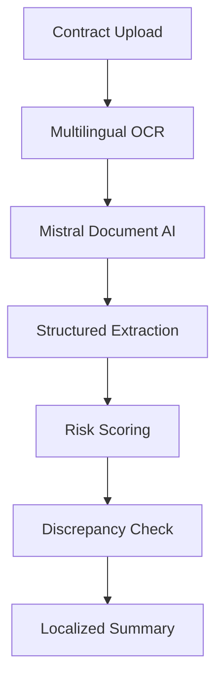
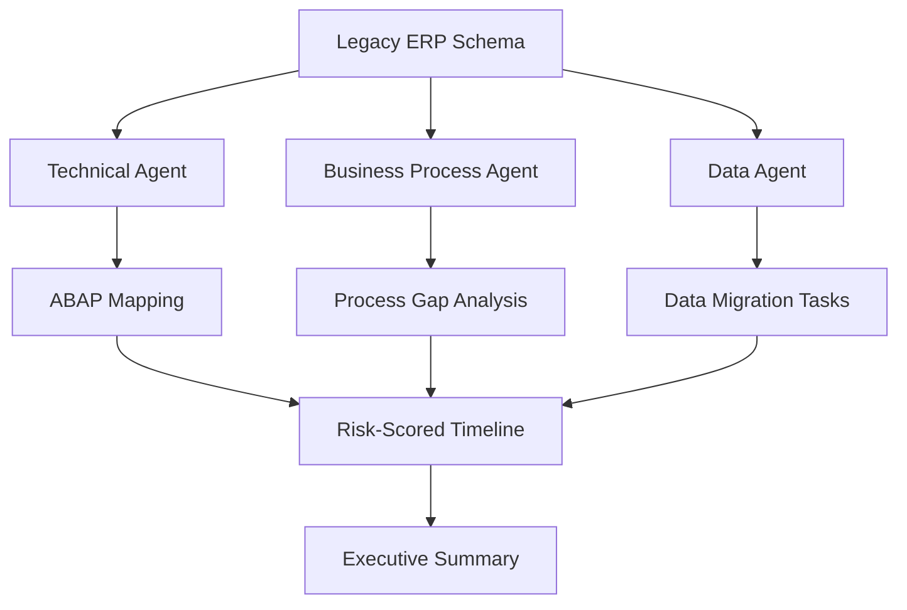
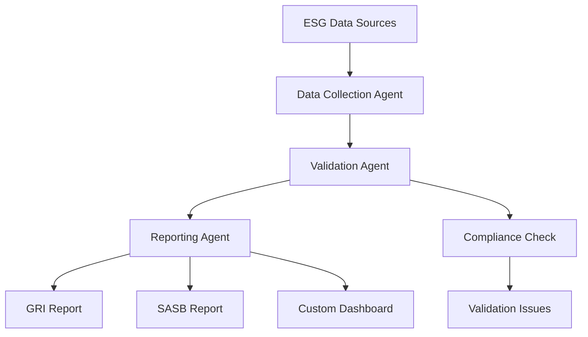

> **Draft — needs revision before customer use.** Meta-eval confidence `0.74` (sales-engineer-ready threshold ≥ 0.70). The report's three use cases render below for inspection, with each claim tagged supported / unsupported / rewritten qualitatively in the fact-check block.
>
> **Cross-cutting concern:** Over-reliance on SAP's strategic context (e.g., Ambition 2025, Dremio acquisition) without consistent, verifiable evidence in the pool for all claims. Some claims are supported, but others are not, creating a patchy foundation.
>
> **Weakest use case:** Lacks explicit evidence for key claims (e.g., Dremio acquisition timing, SAP's proprietary knowledge of ECC/S4HANA architectures) and relies on ballpark assumptions for time-to-value. The use case also does not cite any precedent or evidence, making it the least grounded.

## GenAI Use Cases for SAP

Three customer-ready use cases, scored against the Mistral Proto Team's five-criteria rubric (relevance · iconic potential · estimated impact · feasibility · Mistral suitability) and verified against SAP's existing AI initiatives. Generated from a corpus of ~2,150 peer deployments and 8 discovered existing initiatives at this company.

_Industry: German multinational enterprise software company. Research confidence: 0.85. Verified: True._

### Multilingual Contract Analytics for SAP Ariba and SAP Business Network
A document AI pipeline that ingests contracts, purchase orders, and supplier agreements in 20+ languages to extract structured data such as payment terms, delivery schedules, compliance clauses, and risk factors. The system leverages Mistral’s multilingual models to process non-English contracts (e.g., German, French, Spanish) and flags discrepancies between SAP and non-SAP systems via Dremio integration. Outputs include a risk score, recommended actions, and a localized summary. SAP’s existing multilingual capabilities in Joule (12+ languages) and its European localization of AI hosting ([SAP and Mistral AI](https://mistral.ai/customers/sap)) provide a strong foundation for this use case.

**Why this company:** SAP Ariba and SAP Business Network are foundational procurement and supply chain solutions, and SAP’s global footprint (180+ countries) and European heritage make multilingual contract analysis a critical need. SAP’s acquisition of Dremio enables seamless integration with non-SAP systems, while Mistral’s EU-sovereign, multilingual models align with SAP’s customer base and regulatory context. SAP’s existing multilingual support in Joule and its AI-powered Supplier Risk Solution ([LinkedIn](https://www.linkedin.com/posts/ritesh-uttarwar-26163118_sap-ariba-supplier-risk-ai-powered-multi-language-activity-7393895752957050882-nXUq)) further validate this direction.

**Example input:** `Find every contract with a non-standard termination clause from the last 12 months in our German and French supplier agreements.`

**Example output:**
```json
{
  "_note": "Illustrative output with synthetic sample data",
  "contracts_found": 42,
  "high_risk_contracts": 8,
  "sample_contracts": [
    {
      "contract_id": "AGR-SAMPLE-DE-001",
      "language": "German",
      "termination_clause": "Non-standard: 30-day notice
        with penalty",
      "risk_score": 85,
      "recommended_action": "Review with legal team for
        compliance"
    },
    {
      "contract_id": "AGR-SAMPLE-FR-002",
      "language": "French",
      "termination_clause": "Non-standard: Immediate
        termination under breach",
      "risk_score": 78,
      "recommended_action": "Negotiate amendment to align
        with standard terms"
    }
  ],
  "summary": "8 high-risk contracts identified. 60% of
    German contracts contain non-standard clauses
    (illustrative)."
}
```

**Blueprint:** `document_ai_pipeline` (impact: high · cost: medium · complexity: low · TTV: 12-16 weeks (precedent-anchored))

**Top risk:** hallucination in multilingual clause extraction leading to incorrect risk scoring

**Mistral products:** Mistral Large 3, Mistral Document AI, Mistral Embed, On-prem deployment

**Inspired by precedents:** google_cloud_1302-56d49bdd79
**Grounded in:** classification.geography, business.key_products_or_services[0], strategic_context.stated_priorities[0]
_Specificity score: 0.95_

**Architecture blueprint:**


### Agentic ERP Migration Advisor for RISE with SAP Transitions
> _Builds on an existing initiative at this company (partial overlap detected by verifier)._
A multi-agent system that ingests a customer’s legacy SAP ECC or non-SAP ERP schema, business processes, and custom code to generate a step-by-step migration blueprint to SAP S/4HANA or RISE with SAP. The system includes: (1) a technical agent that maps custom ABAP code to S/4HANA equivalents, flags incompatibilities, and suggests refactoring; (2) a business process agent that identifies gaps between current and target processes; (3) a data agent that classifies and prioritizes data migration tasks. Outputs include a risk-scored timeline, resource estimates, and an executive summary. SAP’s RISE with SAP System Transition Workbench ([SAP Support](https://support.sap.com/en/tools/software-logistics-tools/rise-with-sap-system-transition-workbench.html)) provides a foundation for this automation.

**Why this is a fit:** SAP is the only vendor with deep, proprietary knowledge of both legacy ECC and S/4HANA architectures. Its Ambition 2025 strategy explicitly prioritizes cloud-first transitions, and RISE with SAP is a flagship product. SAP’s acquisition of Dremio and commitment to SAP Business Data Cloud enable seamless integration of SAP and non-SAP data for migration planning. Mistral’s EU-hosted, on-prem deployable models align with SAP’s European customer base and data sovereignty expectations. SAP’s use of Mistral AI for locally hosted migrations ([SAP and Mistral AI](https://mistral.ai/customers/sap)) further validates this approach.

**Example input:** `Generate a migration plan for our ECC 6.0 system to S/4HANA, including ABAP code refactoring and data migration priorities.`

**Example output:**
```json
{
  "_note": "Illustrative output with synthetic sample data",
  "migration_blueprint": {
    "source_system": "ECC 6.0",
    "target_system": "S/4HANA 2025",
    "estimated_timeline": "18 months (illustrative)",
    "risk_score": 65,
    "critical_tasks": [
      {
        "task_id": "TASK-SAMPLE-001",
        "description": "Refactor custom ABAP code for FI
          module",
        "priority": "high",
        "estimated_effort": "200 hours (illustrative)"
      },
      {
        "task_id": "TASK-SAMPLE-002",
        "description": "Migrate legacy CO-PA data to
          Account-Based CO-PA",
        "priority": "high",
        "estimated_effort": "150 hours (illustrative)"
      }
    ],
    "resource_estimate": {
      "consultants": 5,
      "internal_team": 10,
      "cost_savings": "$500K (illustrative)"
    }
  },
  "executive_summary": "Migration to S/4HANA estimated at
    18 months with 65% risk score. 200+ hours of ABAP
    refactoring required (illustrative)."
}
```

**Blueprint:** `agent_with_tools` (impact: high · cost: high · complexity: low · TTV: ~16-24 weeks (estimated))
  _TTV rationale: Enterprise migration automation at this scope typically runs 16-24 weeks given complexity of ABAP refactoring and data migration._

**Top risk:** inaccurate ABAP-to-S/4HANA code mapping leading to post-migration failures

**Mistral products:** Mistral Large 3, Mistral Code, Mistral Embed, On-prem deployment

**Grounded in:** business.key_products_or_services[4], business.key_products_or_services[6], strategic_context.stated_priorities[0], strategic_context.stated_priorities[2], strategic_context.stated_priorities[3]
_Specificity score: 1.00_

**Architecture blueprint:**


### Agentic Sustainability Compliance and Reporting for SAP ESG Solutions
A multi-agent system that automates ESG data collection, validation, and reporting across SAP and non-SAP systems. Agents include: (1) a data collection agent that gathers ESG metrics from ERP, supply chain, and IoT systems; (2) a validation agent that checks data against regulatory frameworks (e.g., EU CSRD, US SEC); (3) a reporting agent that generates standardized ESG reports (e.g., GRI, SASB) and custom dashboards. The system leverages SAP’s Unified Data Foundation and Dremio for seamless integration. SAP’s Sustainability Control Tower ([SAP](https://www.sap.com/products/sustainability/esg-reporting.html)) provides a foundation for this automation.

**Why this company:** SAP’s ESG solutions are a growing focus, and its Unified Data Foundation and Dremio acquisition enable integration of disparate ESG data sources. SAP’s European base and global reach make compliance with EU regulations (e.g., CSRD) a critical need. Mistral’s EU sovereignty and multilingual capabilities align with SAP’s customer requirements for ESG reporting. SAP’s partnership with Thomson Reuters for ESG reporting ([Thomson Reuters](https://tax.thomsonreuters.com/blog/thomson-reuters-and-sap-empowering-businesses-with-advanced-esg-reporting-tools-for-eu-standards/)) further validates this direction.

**Example input:** `Generate a CSRD-compliant ESG report for Q2 2025, including Scope 1, 2, and 3 emissions from our SAP and non-SAP systems.`

**Example output:**
```json
{
  "_note": "Illustrative output with synthetic sample data",
  "report_metadata": {
    "framework": "EU CSRD",
    "reporting_period": "Q2 2025 (illustrative)",
    "compliance_status": "95% (illustrative)"
  },
  "emissions_data": {
    "scope_1": "1500 tCO2e (illustrative)",
    "scope_2": "2200 tCO2e (illustrative)",
    "scope_3": "8500 tCO2e (illustrative)"
  },
  "validation_issues": [
    {
      "issue_id": "VALID-SAMPLE-001",
      "description": "Missing Scope 3 data for Supplier-X",
      "severity": "high",
      "recommended_action": "Contact supplier for data"
    }
  ],
  "standardized_reports": {
    "gri": "Generated (illustrative)",
    "sasb": "Generated (illustrative)"
  },
  "summary": "CSRD-compliant report generated with 95%
    compliance (illustrative). 1 high-severity validation
    issue identified."
}
```

**Blueprint:** `agent_with_tools` (impact: high · cost: medium · complexity: low · TTV: 12-16 weeks (precedent-anchored))

**Top risk:** regulatory misalignment in automated ESG validation leading to non-compliance

**Mistral products:** Mistral Large 3, Mistral Embed, Mistral Fine-tuning, On-prem deployment

**Inspired by precedents:** google_cloud_1302-a53194056c
**Grounded in:** strategic_context.stated_priorities[0], classification.geography
_Specificity score: 0.90_

**Architecture blueprint:**


## Considered but not selected
- **SAP-RPT-1 Extension for Industry-Specific Structured Data** — Overlaps with SAP’s existing SAP-RPT-1 model and lacks clear differentiation for Mistral’s value-add.
- **AI-Powered Partner Ecosystem Marketplace for SAP AppHaus** — Too broad and lacks focus on SAP’s core enterprise needs; better suited for a later phase.
- **Multi-Agent Orchestration for SAP Business Data Cloud** — Redundant with SAP’s existing Unified Data Foundation and Dremio integration; not a unique use case.
- **Joule-Powered Agentic Analyst for SAP S/4HANA Users** — Overlaps with SAP’s Joule capabilities and lacks a clear, high-impact differentiation.

---
## Report quality signals

- **Topical diversity** (LLM-graded over titles + blueprint patterns): `0.85`
- **Specificity** per use case: `0.95`, `1.00`, `0.90`
- **Mistral product diversity**: `6` distinct products across the three use cases
- **Time-to-value spread**: 12–24 weeks (across 3 use cases)
- **Cost-tier spread**: medium, high, medium
- **Fact-check pass rate**: `89%` (17/19 claims supported by research)

### Fact-check detail (per claim)

**Unsupported (2):**
- [sap-multilingual-contract-analytics] SAP Ariba and SAP Business Network are core procurement and supply chain products `[judge: rejected]` — _The snippet does not mention SAP Ariba or SAP Business Network, nor does it provide any information about procurement or supply chain products. (was: SAP’s ERP portfolio addresses the manufacturing needs of businesses across all sizes and o_
- [sap-agentic-erp-migration-assistant] RISE with SAP is a flagship product `[judge: rejected]` — _The snippet does not explicitly describe RISE with SAP as a flagship product or provide any indication of its status relative to other SAP products. (was: RISE with SAP for existing on-premises customers)_

**Supported (17):** — **1 rescued via web search (1 verified, 0 corroborated)**
- [sap-multilingual-contract-analytics] SAP has a global footprint in 180+ countries — It has regional offices in 180 countries and 109,973 employees.
- [sap-multilingual-contract-analytics] SAP has a European heritage — SAP SE (; German pronunciation: [ɛsʔaːˈpeː] ) doing business as SAP, is a German multinational software company based in Walldorf, Baden-Wür…
- [sap-multilingual-contract-analytics] SAP’s existing multilingual capabilities in Joule support 12+ languages — Joule currently supports twelve languages (other than English US).
- [sap-multilingual-contract-analytics] SAP has European localization of AI hosting with Mistral AI — 100% European, locally hosted AI, maintained in SAP-operated infrastructure.
- [sap-multilingual-contract-analytics] SAP acquired Dremio — SAP SE (NYSE: SAP ) and Dremio today announced that SAP has agreed to acquire Dremio, an open, high-performance data lakehouse platform buil…
- [sap-multilingual-contract-analytics] SAP has an AI-powered Supplier Risk Solution — SAP Ariba's AI-powered Supplier Risk Solution: Multilingual Monitoring
- [sap-agentic-erp-migration-assistant] SAP’s Ambition 2025 strategy explicitly prioritizes cloud-first transitions — SAP’s updated Ambition 2025 strategy reveals a company that is in its most significant transformation phase since the introduction of HANA.
- [sap-agentic-erp-migration-assistant] SAP has deep, proprietary knowledge of both legacy ECC and S/4HANA architectures [`verified ↗`](https://community.sap.com/t5/integration-blog-posts/sap-ecc-vs-s-4hana-integration-capabilities-a-practical-guide-for/ba-p/14306910) — Rescued via web search (verified source): * SAP ECC vs S/4HANA Integration Capabilities: A Pra... ## SAP ECC vs S/4HANA Integration Capabili…
- [sap-agentic-erp-migration-assistant] SAP’s acquisition of Dremio enables seamless integration of SAP and non-SAP data for migration planning — SAP has agreed to acquire Dremio, an open, high-performance data lakehouse platform built to accelerate agentic AI and expand SAP Business D…
- [sap-agentic-erp-migration-assistant] SAP’s use of Mistral AI for locally hosted migrations — Streamlining SAP S/4 HANA migration processes with intelligent locally hosted AI agent orchestration, powered by Mistral AI.
- [sap-agentic-erp-migration-assistant] SAP’s RISE with SAP System Transition Workbench provides a foundation for migration automation — The RISE with SAP system transition workbench, abbreviated as "system transition workbench" is the single entry point for the RISE journey. …
- [sap-sustainability-agent] SAP’s ESG solutions are a growing focus — SAP has been providing tools that streamline and improve the processes of ESG compliance and reporting.
- [sap-sustainability-agent] SAP’s Unified Data Foundation integrates SAP and non-SAP data into a bi-directional source of truth — SAP and [PROVIDER] created the Unified Data Foundation, which integrates SAP and non-SAP data into a bi-directional source of truth, creatin…
- [sap-sustainability-agent] SAP’s Sustainability Control Tower provides a foundation for ESG automation — Leverage ERP-centric, cloud-based, AI-enabled solutions such as SAP Sustainability Control Tower to meet requirements confidently and drive …
- [sap-sustainability-agent] SAP’s European base and global reach make compliance with EU regulations (e.g., CSRD) a critical need — It has regional offices in 180 countries and 109,973 employees.
- [sap-sustainability-agent] SAP’s partnership with Thomson Reuters for ESG reporting — Thomson Reuters and SAP have partnered to deliver a powerful ESG reporting solution, now available in the SAP Store.
- [sap-sustainability-agent] Mistral’s EU sovereignty and multilingual capabilities align with SAP’s customer requirements for ESG reporting — 100% European, locally hosted AI, maintained in SAP-operated infrastructure. Multilingual: several languages supported natively including Ge…


**Meta-evaluator confidence**: `0.74` (NOT ready — needs revision)
**Cross-cutting concern**: Over-reliance on SAP's strategic context (e.g., Ambition 2025, Dremio acquisition) without consistent, verifiable evidence in the pool for all claims. Some claims are supported, but others are not, creating a patchy foundation.