# Trace

## Execution trace — SAP

Started: `2026-05-10T22:16:57.147438+00:00`. Total wall time: `123.5s` across `42` recorded actions.

### Per-step time totals

| Step | Calls | Total time | Avg time |
|---|---:|---:|---:|
| `research` | 1 | 10.00s | 9999ms |
| `gap_fill` | 4 | 3.05s | 763ms |
| `retrieve` | 2 | 0.17s | 85ms |
| `generate` | 1 | 29.45s | 29449ms |
| `score` | 2 | 23.94s | 11968ms |
| `verify` | 6 | 18.48s | 3080ms |
| `enrich` | 1 | 15.37s | 15366ms |
| `meta_eval` | 1 | 11.71s | 11712ms |
| `web_verify` | 1 | 2.68s | 2684ms |
| `source_judge` | 20 | 25.51s | 1276ms |
| `final_qualify` | 1 | 2.09s | 2092ms |
| `quality_signals` | 2 | 4.95s | 2473ms |

### Chronological event log

- `22:17:07.332` **[research]** `mistral-medium-2604.chat.complete` — 9999ms
   - inputs: synthesize CompanyContext for SAP | depth=medium
   - outputs: industry='German multinational enterprise software company' verified=True conf=0.75
- `22:17:17.333` **[gap_fill]** `mistral-small-2603.chat.complete` — 868ms
   - inputs: generate gap queries | fields=['business_model', 'products', 'data_assets', 'priorities']
   - outputs: queries=4
- `22:17:24.871` **[gap_fill]** `mistral-small-2603.chat.complete` — 988ms
   - inputs: layer-2 extract field=priorities
   - outputs: items=8
- `22:17:24.875` **[gap_fill]** `mistral-small-2603.chat.complete` — 454ms
   - inputs: layer-2 extract field=data_assets
   - outputs: items=0
- `22:17:24.880` **[gap_fill]** `mistral-small-2603.chat.complete` — 744ms
   - inputs: layer-2 extract field=products
   - outputs: items=8
- `22:17:25.860` **[retrieve]** `mistral-embed.embeddings.create` — 166ms
   - inputs: company_query | industries='German multinational enterprise software company'
   - outputs: embedded 1024-dim query vector
- `22:17:26.025` **[retrieve]** `precedent_corpus.cosine_topk` — 5ms
   - inputs: k=8 min_depth=0.4 target='SAP'
   - outputs: retrieved 8 | mmr=True | top_sim=0.793
- `22:17:27.861` **[generate]** `mistral-medium-2604.chat.complete` — 29449ms
   - inputs: iteration=0 tool_calls_used=0/0 tools=off
   - outputs: tool_calls=0 | content_chars=17483
- `22:17:57.629` **[score]** `mistral-small-2603.chat.complete` — 11608ms
   - inputs: self-consistency pass T=0.2
   - outputs: scored 8 candidates
- `22:17:57.634` **[score]** `mistral-small-2603.chat.complete` — 12328ms
   - inputs: self-consistency pass T=0.4
   - outputs: scored 8 candidates
- `22:18:10.000` **[verify]** `tavily.search` — 2393ms
   - inputs: candidate=sap-multilingual-contract-analytics | query='SAP Multilingual Contract Analytics for SAP Ariba and SAP Bu'
   - outputs: 4 results
- `22:18:10.001` **[verify]** `tavily.search` — 2306ms
   - inputs: candidate=sap-agentic-erp-migration-assistant | query='SAP Agentic ERP Migration Advisor for RISE with SAP Transiti'
   - outputs: 4 results
- `22:18:10.001` **[verify]** `tavily.search` — 1879ms
   - inputs: candidate=sap-sustainability-agent | query='SAP Agentic Sustainability Compliance and Reporting for SAP '
   - outputs: 4 results
- `22:18:12.506` **[verify]** `mistral-small-2603.chat.complete` — 3980ms
   - inputs: verdict for sap-agentic-erp-migration-assistant
   - outputs: verdict='partial_overlap'
- `22:18:13.118` **[verify]** `mistral-small-2603.chat.complete` — 4355ms
   - inputs: verdict for sap-multilingual-contract-analytics
   - outputs: verdict='pass'
- `22:18:13.647` **[verify]** `mistral-small-2603.chat.complete` — 3568ms
   - inputs: verdict for sap-sustainability-agent
   - outputs: verdict='pass'
- `22:18:17.475` **[enrich]** `mistral-medium-2604.chat.complete` — 15366ms
   - inputs: tier=fast parallel=False ids=['sap-multilingual-contract-analytics', 'sap-agentic-erp-migration-assistant', 'sap-sustainability-agent']
   - outputs: enriched 3 use cases
- `22:18:32.867` **[meta_eval]** `mistral-medium-2604.chat.complete` — 11712ms
   - inputs: reviewing 3 use cases
   - outputs: review + claims
- `22:18:44.590` **[web_verify]** `tavily.search.rescue_unsupported_claims` — 2684ms
   - inputs: company='SAP' unsupported=1 budget=12
   - outputs: rescued: verified=1 corroborated=0 of 1 attempted
- `22:18:47.277` **[source_judge]** `mistral-small-2603.judge_claim_sources` — 6039ms
   - inputs: pairs=19
   - outputs: judged 19 pairs
- `22:18:47.277` **[source_judge]** `mistral-small-2603.chat.complete` — 1883ms
   - inputs: claim='SAP Ariba and SAP Business Network are core procurement and '
   - outputs: verdict=unsupported
- `22:18:47.283` **[source_judge]** `mistral-small-2603.chat.complete` — 706ms
   - inputs: claim='SAP has a global footprint in 180+ countries'
   - outputs: verdict=supported
- `22:18:47.288` **[source_judge]** `mistral-small-2603.chat.complete` — 1258ms
   - inputs: claim='SAP has a European heritage'
   - outputs: verdict=supported
- `22:18:47.294` **[source_judge]** `mistral-small-2603.chat.complete` — 716ms
   - inputs: claim='SAP’s existing multilingual capabilities in Joule support 12'
   - outputs: verdict=supported
- `22:18:47.298` **[source_judge]** `mistral-small-2603.chat.complete` — 632ms
   - inputs: claim='SAP has European localization of AI hosting with Mistral AI'
   - outputs: verdict=supported
- `22:18:47.301` **[source_judge]** `mistral-small-2603.chat.complete` — 621ms
   - inputs: claim='SAP acquired Dremio'
   - outputs: verdict=supported
- `22:18:47.304` **[source_judge]** `mistral-small-2603.chat.complete` — 715ms
   - inputs: claim='SAP has an AI-powered Supplier Risk Solution'
   - outputs: verdict=supported
- `22:18:47.307` **[source_judge]** `mistral-small-2603.chat.complete` — 6009ms
   - inputs: claim='SAP’s Ambition 2025 strategy explicitly prioritizes cloud-fi'
   - outputs: verdict=supported
- `22:18:47.922` **[source_judge]** `mistral-small-2603.chat.complete` — 555ms
   - inputs: claim='RISE with SAP is a flagship product'
   - outputs: verdict=unsupported
- `22:18:47.930` **[source_judge]** `mistral-small-2603.chat.complete` — 609ms
   - inputs: claim='SAP has deep, proprietary knowledge of both legacy ECC and S'
   - outputs: verdict=supported
- `22:18:47.989` **[source_judge]** `mistral-small-2603.chat.complete` — 684ms
   - inputs: claim='SAP’s acquisition of Dremio enables seamless integration of '
   - outputs: verdict=supported
- `22:18:48.011` **[source_judge]** `mistral-small-2603.chat.complete` — 669ms
   - inputs: claim='SAP’s use of Mistral AI for locally hosted migrations'
   - outputs: verdict=supported
- `22:18:48.019` **[source_judge]** `mistral-small-2603.chat.complete` — 862ms
   - inputs: claim='SAP’s RISE with SAP System Transition Workbench provides a f'
   - outputs: verdict=supported
- `22:18:48.477` **[source_judge]** `mistral-small-2603.chat.complete` — 570ms
   - inputs: claim='SAP’s ESG solutions are a growing focus'
   - outputs: verdict=supported
- `22:18:48.539` **[source_judge]** `mistral-small-2603.chat.complete` — 509ms
   - inputs: claim='SAP’s Unified Data Foundation integrates SAP and non-SAP dat'
   - outputs: verdict=supported
- `22:18:48.546` **[source_judge]** `mistral-small-2603.chat.complete` — 632ms
   - inputs: claim='SAP’s Sustainability Control Tower provides a foundation for'
   - outputs: verdict=supported
- `22:18:48.673` **[source_judge]** `mistral-small-2603.chat.complete` — 680ms
   - inputs: claim='SAP’s European base and global reach make compliance with EU'
   - outputs: verdict=supported
- `22:18:48.680` **[source_judge]** `mistral-small-2603.chat.complete` — 472ms
   - inputs: claim='SAP’s partnership with Thomson Reuters for ESG reporting'
   - outputs: verdict=supported
- `22:18:48.882` **[source_judge]** `mistral-small-2603.chat.complete` — 690ms
   - inputs: claim='Mistral’s EU sovereignty and multilingual capabilities align'
   - outputs: verdict=supported
- `22:18:53.317` **[final_qualify]** `mistral-small-2603.chat.complete` — 2092ms
   - inputs: use_case=sap-multilingual-contract-analytics unsupported=1
   - outputs: qualified 4 fields
- `22:18:55.673` **[quality_signals]** `mistral-small-2603.chat.complete` — 2888ms
   - inputs: specificity grade (3 use cases)
   - outputs: scored 3 use cases
- `22:18:58.561` **[quality_signals]** `mistral-small-2603.chat.complete` — 2058ms
   - inputs: diversity grade
   - outputs: diversity=0.85

## Mermaid sequence

```mermaid
sequenceDiagram
    autonumber
    participant pipeline as pipeline
    participant mistral_medium_2604 as mistral-medium-2604
    participant mistral_small_2603 as mistral-small-2603
    participant mistral_embed as mistral-embed
    participant precedent_corpus as precedent_corpus
    participant tavily as tavily
    participant tavily_search as tavily.search
    pipeline->>mistral_medium_2604: research: chat.complete (9999ms)
    mistral_medium_2604-->>pipeline: industry='German multinational enterprise software company' 
    pipeline->>mistral_small_2603: gap_fill: chat.complete (868ms)
    mistral_small_2603-->>pipeline: queries=4
    pipeline->>mistral_small_2603: gap_fill: chat.complete (988ms)
    mistral_small_2603-->>pipeline: items=8
    pipeline->>mistral_small_2603: gap_fill: chat.complete (454ms)
    mistral_small_2603-->>pipeline: items=0
    pipeline->>mistral_small_2603: gap_fill: chat.complete (744ms)
    mistral_small_2603-->>pipeline: items=8
    pipeline->>mistral_embed: retrieve: embeddings.create (166ms)
    mistral_embed-->>pipeline: embedded 1024-dim query vector
    pipeline->>precedent_corpus: retrieve: cosine_topk (5ms)
    precedent_corpus-->>pipeline: retrieved 8 | mmr=True | top_sim=0.793
    pipeline->>mistral_medium_2604: generate: chat.complete (29449ms)
    mistral_medium_2604-->>pipeline: tool_calls=0 | content_chars=17483
    pipeline->>mistral_small_2603: score: chat.complete (11608ms)
    mistral_small_2603-->>pipeline: scored 8 candidates
    pipeline->>mistral_small_2603: score: chat.complete (12328ms)
    mistral_small_2603-->>pipeline: scored 8 candidates
    pipeline->>tavily: verify: search (2393ms)
    tavily-->>pipeline: 4 results
    pipeline->>tavily: verify: search (2306ms)
    tavily-->>pipeline: 4 results
    pipeline->>tavily: verify: search (1879ms)
    tavily-->>pipeline: 4 results
    pipeline->>mistral_small_2603: verify: chat.complete (3980ms)
    mistral_small_2603-->>pipeline: verdict='partial_overlap'
    pipeline->>mistral_small_2603: verify: chat.complete (4355ms)
    mistral_small_2603-->>pipeline: verdict='pass'
    pipeline->>mistral_small_2603: verify: chat.complete (3568ms)
    mistral_small_2603-->>pipeline: verdict='pass'
    pipeline->>mistral_medium_2604: enrich: chat.complete (15366ms)
    mistral_medium_2604-->>pipeline: enriched 3 use cases
    pipeline->>mistral_medium_2604: meta_eval: chat.complete (11712ms)
    mistral_medium_2604-->>pipeline: review + claims
    pipeline->>tavily_search: web_verify: rescue_unsupported_claims (2684ms)
    tavily_search-->>pipeline: rescued: verified=1 corroborated=0 of 1 attempted
    pipeline->>mistral_small_2603: source_judge: judge_claim_sources (6039ms)
    mistral_small_2603-->>pipeline: judged 19 pairs
    pipeline->>mistral_small_2603: source_judge: chat.complete (1883ms)
    mistral_small_2603-->>pipeline: verdict=unsupported
    pipeline->>mistral_small_2603: source_judge: chat.complete (706ms)
    mistral_small_2603-->>pipeline: verdict=supported
    pipeline->>mistral_small_2603: source_judge: chat.complete (1258ms)
    mistral_small_2603-->>pipeline: verdict=supported
    pipeline->>mistral_small_2603: source_judge: chat.complete (716ms)
    mistral_small_2603-->>pipeline: verdict=supported
    pipeline->>mistral_small_2603: source_judge: chat.complete (632ms)
    mistral_small_2603-->>pipeline: verdict=supported
    pipeline->>mistral_small_2603: source_judge: chat.complete (621ms)
    mistral_small_2603-->>pipeline: verdict=supported
    pipeline->>mistral_small_2603: source_judge: chat.complete (715ms)
    mistral_small_2603-->>pipeline: verdict=supported
    pipeline->>mistral_small_2603: source_judge: chat.complete (6009ms)
    mistral_small_2603-->>pipeline: verdict=supported
    pipeline->>mistral_small_2603: source_judge: chat.complete (555ms)
    mistral_small_2603-->>pipeline: verdict=unsupported
    pipeline->>mistral_small_2603: source_judge: chat.complete (609ms)
    mistral_small_2603-->>pipeline: verdict=supported
    pipeline->>mistral_small_2603: source_judge: chat.complete (684ms)
    mistral_small_2603-->>pipeline: verdict=supported
    pipeline->>mistral_small_2603: source_judge: chat.complete (669ms)
    mistral_small_2603-->>pipeline: verdict=supported
    pipeline->>mistral_small_2603: source_judge: chat.complete (862ms)
    mistral_small_2603-->>pipeline: verdict=supported
    pipeline->>mistral_small_2603: source_judge: chat.complete (570ms)
    mistral_small_2603-->>pipeline: verdict=supported
    pipeline->>mistral_small_2603: source_judge: chat.complete (509ms)
    mistral_small_2603-->>pipeline: verdict=supported
    pipeline->>mistral_small_2603: source_judge: chat.complete (632ms)
    mistral_small_2603-->>pipeline: verdict=supported
    pipeline->>mistral_small_2603: source_judge: chat.complete (680ms)
    mistral_small_2603-->>pipeline: verdict=supported
    pipeline->>mistral_small_2603: source_judge: chat.complete (472ms)
    mistral_small_2603-->>pipeline: verdict=supported
    pipeline->>mistral_small_2603: source_judge: chat.complete (690ms)
    mistral_small_2603-->>pipeline: verdict=supported
    pipeline->>mistral_small_2603: final_qualify: chat.complete (2092ms)
    mistral_small_2603-->>pipeline: qualified 4 fields
    pipeline->>mistral_small_2603: quality_signals: chat.complete (2888ms)
    mistral_small_2603-->>pipeline: scored 3 use cases
    pipeline->>mistral_small_2603: quality_signals: chat.complete (2058ms)
    mistral_small_2603-->>pipeline: diversity=0.85
```

