# Trace

## Execution trace — SAP

Started: `2026-05-10T22:19:00.622285+00:00`. Total wall time: `159.7s` across `46` recorded actions.

### Per-step time totals

| Step | Calls | Total time | Avg time |
|---|---:|---:|---:|
| `research` | 1 | 10.29s | 10288ms |
| `gap_fill` | 4 | 3.26s | 815ms |
| `retrieve` | 2 | 0.25s | 125ms |
| `generate` | 2 | 27.22s | 13608ms |
| `generate.web_search` | 2 | 7.71s | 3857ms |
| `score` | 2 | 24.18s | 12091ms |
| `verify` | 6 | 21.10s | 3516ms |
| `enrich` | 1 | 51.72s | 51725ms |
| `meta_eval` | 1 | 14.14s | 14140ms |
| `web_verify` | 1 | 2.07s | 2073ms |
| `source_judge` | 21 | 14.07s | 670ms |
| `final_qualify` | 1 | 1.75s | 1750ms |
| `quality_signals` | 2 | 4.40s | 2201ms |

### Chronological event log

- `22:19:01.005` **[research]** `mistral-medium-2604.chat.complete` — 10288ms
   - inputs: synthesize CompanyContext for SAP | depth=medium
   - outputs: industry='German multinational enterprise software vendor' verified=True conf=0.75
- `22:19:11.294` **[gap_fill]** `mistral-small-2603.chat.complete` — 982ms
   - inputs: generate gap queries | fields=['business_model', 'products', 'data_assets', 'priorities']
   - outputs: queries=4
- `22:19:20.378` **[gap_fill]** `mistral-small-2603.chat.complete` — 1009ms
   - inputs: layer-2 extract field=priorities
   - outputs: items=8
- `22:19:20.383` **[gap_fill]** `mistral-small-2603.chat.complete` — 424ms
   - inputs: layer-2 extract field=data_assets
   - outputs: items=0
- `22:19:20.389` **[gap_fill]** `mistral-small-2603.chat.complete` — 843ms
   - inputs: layer-2 extract field=products
   - outputs: items=10
- `22:19:21.389` **[retrieve]** `mistral-embed.embeddings.create` — 244ms
   - inputs: company_query | industries='German multinational enterprise software vendor'
   - outputs: embedded 1024-dim query vector
- `22:19:21.633` **[retrieve]** `precedent_corpus.cosine_topk` — 7ms
   - inputs: k=8 min_depth=0.4 target='SAP'
   - outputs: retrieved 8 | mmr=True | top_sim=0.812
- `22:19:23.390` **[generate]** `mistral-medium-2604.chat.complete` — 2056ms
   - inputs: iteration=0 tool_calls_used=0/2 tools=on
   - outputs: tool_calls=4 | content_chars=0
- `22:19:25.465` **[generate.web_search]** `tavily.search` — 4165ms
   - inputs: query='SAP Dremio acquisition agentic AI use cases 2026'
   - outputs: 2 raw results
- `22:19:30.863` **[generate.web_search]** `tavily.search` — 3550ms
   - inputs: query='SAP Prior Labs Tabular Foundation Models SAP-RPT-1 applications'
   - outputs: 2 raw results
- `22:19:36.764` **[generate]** `mistral-medium-2604.chat.complete` — 25160ms
   - inputs: iteration=1 tool_calls_used=2/2 tools=off
   - outputs: tool_calls=0 | content_chars=16837
- `22:20:02.172` **[score]** `mistral-small-2603.chat.complete` — 12853ms
   - inputs: self-consistency pass T=0.2
   - outputs: scored 8 candidates
- `22:20:02.177` **[score]** `mistral-small-2603.chat.complete` — 11330ms
   - inputs: self-consistency pass T=0.4
   - outputs: scored 8 candidates
- `22:20:15.064` **[verify]** `tavily.search` — 2165ms
   - inputs: candidate=sap-joule-multilingual-enterprise-assistant | query='SAP Joule-Powered Multilingual Enterprise Assistant for SAP '
   - outputs: 4 results
- `22:20:15.064` **[verify]** `tavily.search` — 2775ms
   - inputs: candidate=sap-tabular-foundation-model-copilot | query='SAP SAP-RPT-1-Powered Tabular AI Copilot for S/4HANA Finance'
   - outputs: 4 results
- `22:20:15.064` **[verify]** `tavily.search` — 2735ms
   - inputs: candidate=sap-agentic-compliance-iq | query='SAP Agentic Compliance IQ for SAP GRC and S/4HANA Mistral La'
   - outputs: 4 results
- `22:20:18.361` **[verify]** `mistral-small-2603.chat.complete` — 4193ms
   - inputs: verdict for sap-tabular-foundation-model-copilot
   - outputs: verdict='partial_overlap'
- `22:20:18.677` **[verify]** `mistral-small-2603.chat.complete` — 5073ms
   - inputs: verdict for sap-agentic-compliance-iq
   - outputs: verdict='pass'
- `22:20:18.993` **[verify]** `mistral-small-2603.chat.complete` — 4155ms
   - inputs: verdict for sap-joule-multilingual-enterprise-assistant
   - outputs: verdict='confirmed_existing'
- `22:20:23.752` **[enrich]** `mistral-large-2512.chat.complete` — 51725ms
   - inputs: tier=standard parallel=False ids=['sap-tabular-foundation-model-copilot', 'sap-agentic-compliance-iq', 'sap-dremio-agentic-data-steward']
   - outputs: enriched 3 use cases
- `22:21:15.497` **[meta_eval]** `mistral-medium-2604.chat.complete` — 14140ms
   - inputs: reviewing 3 use cases
   - outputs: review + claims
- `22:21:29.659` **[web_verify]** `tavily.search.rescue_unsupported_claims` — 2073ms
   - inputs: company='SAP' unsupported=2 budget=12
   - outputs: rescued: verified=2 corroborated=0 of 2 attempted
- `22:21:31.735` **[source_judge]** `mistral-small-2603.judge_claim_sources` — 1816ms
   - inputs: pairs=20
   - outputs: judged 20 pairs
- `22:21:31.735` **[source_judge]** `mistral-small-2603.chat.complete` — 767ms
   - inputs: claim='SAP owns the world’s largest repository of enterprise struct'
   - outputs: verdict=unsupported
- `22:21:31.741` **[source_judge]** `mistral-small-2603.chat.complete` — 518ms
   - inputs: claim='SAP has over 400,000 customers'
   - outputs: verdict=unsupported
- `22:21:31.746` **[source_judge]** `mistral-small-2603.chat.complete` — 654ms
   - inputs: claim='SAP has over 400,000 customers generating tabular datasets c'
   - outputs: verdict=unsupported
- `22:21:31.753` **[source_judge]** `mistral-small-2603.chat.complete` — 745ms
   - inputs: claim='SAP acquired Prior Labs for €1B+'
   - outputs: verdict=supported
- `22:21:31.756` **[source_judge]** `mistral-small-2603.chat.complete` — 626ms
   - inputs: claim='SAP-RPT-1 is the first enterprise relational foundation mode'
   - outputs: verdict=supported
- `22:21:31.760` **[source_judge]** `mistral-small-2603.chat.complete` — 666ms
   - inputs: claim='SAP’s cloud-first strategy is a stated priority'
   - outputs: verdict=supported
- `22:21:31.762` **[source_judge]** `mistral-small-2603.chat.complete` — 768ms
   - inputs: claim='SAP has European data sovereignty requirements'
   - outputs: verdict=supported
- `22:21:31.765` **[source_judge]** `mistral-small-2603.chat.complete` — 753ms
   - inputs: claim='SAP AI Launchpad infrastructure exists'
   - outputs: verdict=supported
- `22:21:32.259` **[source_judge]** `mistral-small-2603.chat.complete` — 568ms
   - inputs: claim='SAP GRC and S/4HANA are core platforms for over 400,000 ente'
   - outputs: verdict=unsupported
- `22:21:32.382` **[source_judge]** `mistral-small-2603.chat.complete` — 700ms
   - inputs: claim='SAP GRC and S/4HANA are core platforms for customers in high'
   - outputs: verdict=supported
- `22:21:32.399` **[source_judge]** `mistral-small-2603.chat.complete` — 503ms
   - inputs: claim='SAP has proprietary data on internal controls and regulatory'
   - outputs: verdict=unsupported
- `22:21:32.426` **[source_judge]** `mistral-small-2603.chat.complete` — 483ms
   - inputs: claim='SAP operates in 180 countries'
   - outputs: verdict=supported
- `22:21:32.498` **[source_judge]** `mistral-small-2603.chat.complete` — 624ms
   - inputs: claim='Mistral’s models are EU-sovereign'
   - outputs: verdict=supported
- `22:21:32.503` **[source_judge]** `mistral-small-2603.chat.complete` — 589ms
   - inputs: claim='Mistral’s models are multilingual'
   - outputs: verdict=supported
- `22:21:32.518` **[source_judge]** `mistral-small-2603.chat.complete` — 540ms
   - inputs: claim='SAP acquired Dremio'
   - outputs: verdict=supported
- `22:21:32.531` **[source_judge]** `mistral-small-2603.chat.complete` — 503ms
   - inputs: claim='Dremio is an open lakehouse platform'
   - outputs: verdict=supported
- `22:21:32.827` **[source_judge]** `mistral-small-2603.chat.complete` — 611ms
   - inputs: claim='SAP Business Data Cloud is a strategic engine for AI-powered'
   - outputs: verdict=supported
- `22:21:32.902` **[source_judge]** `mistral-small-2603.chat.complete` — 568ms
   - inputs: claim='SAP Business Data Cloud unifies SAP and non-SAP data'
   - outputs: verdict=supported
- `22:21:32.909` **[source_judge]** `mistral-small-2603.chat.complete` — 548ms
   - inputs: claim='SAP has EU data centers'
   - outputs: verdict=supported
- `22:21:33.034` **[source_judge]** `mistral-small-2603.chat.complete` — 517ms
   - inputs: claim='SAP’s acquisition of Dremio explicitly targets agentic AI us'
   - outputs: verdict=supported
- `22:21:33.736` **[final_qualify]** `mistral-small-2603.chat.complete` — 1750ms
   - inputs: use_case=sap-tabular-foundation-model-copilot unsupported=3
   - outputs: qualified 4 fields
- `22:21:35.934` **[quality_signals]** `mistral-small-2603.chat.complete` — 2822ms
   - inputs: specificity grade (3 use cases)
   - outputs: scored 3 use cases
- `22:21:38.756` **[quality_signals]** `mistral-small-2603.chat.complete` — 1581ms
   - inputs: diversity grade
   - outputs: diversity=0.7

## Mermaid sequence

```mermaid
sequenceDiagram
    autonumber
    participant pipeline as pipeline
    participant mistral_medium_2604 as mistral-medium-2604
    participant mistral_small_2603 as mistral-small-2603
    participant mistral_embed as mistral-embed
    participant precedent_corpus as precedent_corpus
    participant tavily as tavily
    participant mistral_large_2512 as mistral-large-2512
    participant tavily_search as tavily.search
    pipeline->>mistral_medium_2604: research: chat.complete (10288ms)
    mistral_medium_2604-->>pipeline: industry='German multinational enterprise software vendor' v
    pipeline->>mistral_small_2603: gap_fill: chat.complete (982ms)
    mistral_small_2603-->>pipeline: queries=4
    pipeline->>mistral_small_2603: gap_fill: chat.complete (1009ms)
    mistral_small_2603-->>pipeline: items=8
    pipeline->>mistral_small_2603: gap_fill: chat.complete (424ms)
    mistral_small_2603-->>pipeline: items=0
    pipeline->>mistral_small_2603: gap_fill: chat.complete (843ms)
    mistral_small_2603-->>pipeline: items=10
    pipeline->>mistral_embed: retrieve: embeddings.create (244ms)
    mistral_embed-->>pipeline: embedded 1024-dim query vector
    pipeline->>precedent_corpus: retrieve: cosine_topk (7ms)
    precedent_corpus-->>pipeline: retrieved 8 | mmr=True | top_sim=0.812
    pipeline->>mistral_medium_2604: generate: chat.complete (2056ms)
    mistral_medium_2604-->>pipeline: tool_calls=4 | content_chars=0
    pipeline->>tavily: generate.web_search: search (4165ms)
    tavily-->>pipeline: 2 raw results
    pipeline->>tavily: generate.web_search: search (3550ms)
    tavily-->>pipeline: 2 raw results
    pipeline->>mistral_medium_2604: generate: chat.complete (25160ms)
    mistral_medium_2604-->>pipeline: tool_calls=0 | content_chars=16837
    pipeline->>mistral_small_2603: score: chat.complete (12853ms)
    mistral_small_2603-->>pipeline: scored 8 candidates
    pipeline->>mistral_small_2603: score: chat.complete (11330ms)
    mistral_small_2603-->>pipeline: scored 8 candidates
    pipeline->>tavily: verify: search (2165ms)
    tavily-->>pipeline: 4 results
    pipeline->>tavily: verify: search (2775ms)
    tavily-->>pipeline: 4 results
    pipeline->>tavily: verify: search (2735ms)
    tavily-->>pipeline: 4 results
    pipeline->>mistral_small_2603: verify: chat.complete (4193ms)
    mistral_small_2603-->>pipeline: verdict='partial_overlap'
    pipeline->>mistral_small_2603: verify: chat.complete (5073ms)
    mistral_small_2603-->>pipeline: verdict='pass'
    pipeline->>mistral_small_2603: verify: chat.complete (4155ms)
    mistral_small_2603-->>pipeline: verdict='confirmed_existing'
    pipeline->>mistral_large_2512: enrich: chat.complete (51725ms)
    mistral_large_2512-->>pipeline: enriched 3 use cases
    pipeline->>mistral_medium_2604: meta_eval: chat.complete (14140ms)
    mistral_medium_2604-->>pipeline: review + claims
    pipeline->>tavily_search: web_verify: rescue_unsupported_claims (2073ms)
    tavily_search-->>pipeline: rescued: verified=2 corroborated=0 of 2 attempted
    pipeline->>mistral_small_2603: source_judge: judge_claim_sources (1816ms)
    mistral_small_2603-->>pipeline: judged 20 pairs
    pipeline->>mistral_small_2603: source_judge: chat.complete (767ms)
    mistral_small_2603-->>pipeline: verdict=unsupported
    pipeline->>mistral_small_2603: source_judge: chat.complete (518ms)
    mistral_small_2603-->>pipeline: verdict=unsupported
    pipeline->>mistral_small_2603: source_judge: chat.complete (654ms)
    mistral_small_2603-->>pipeline: verdict=unsupported
    pipeline->>mistral_small_2603: source_judge: chat.complete (745ms)
    mistral_small_2603-->>pipeline: verdict=supported
    pipeline->>mistral_small_2603: source_judge: chat.complete (626ms)
    mistral_small_2603-->>pipeline: verdict=supported
    pipeline->>mistral_small_2603: source_judge: chat.complete (666ms)
    mistral_small_2603-->>pipeline: verdict=supported
    pipeline->>mistral_small_2603: source_judge: chat.complete (768ms)
    mistral_small_2603-->>pipeline: verdict=supported
    pipeline->>mistral_small_2603: source_judge: chat.complete (753ms)
    mistral_small_2603-->>pipeline: verdict=supported
    pipeline->>mistral_small_2603: source_judge: chat.complete (568ms)
    mistral_small_2603-->>pipeline: verdict=unsupported
    pipeline->>mistral_small_2603: source_judge: chat.complete (700ms)
    mistral_small_2603-->>pipeline: verdict=supported
    pipeline->>mistral_small_2603: source_judge: chat.complete (503ms)
    mistral_small_2603-->>pipeline: verdict=unsupported
    pipeline->>mistral_small_2603: source_judge: chat.complete (483ms)
    mistral_small_2603-->>pipeline: verdict=supported
    pipeline->>mistral_small_2603: source_judge: chat.complete (624ms)
    mistral_small_2603-->>pipeline: verdict=supported
    pipeline->>mistral_small_2603: source_judge: chat.complete (589ms)
    mistral_small_2603-->>pipeline: verdict=supported
    pipeline->>mistral_small_2603: source_judge: chat.complete (540ms)
    mistral_small_2603-->>pipeline: verdict=supported
    pipeline->>mistral_small_2603: source_judge: chat.complete (503ms)
    mistral_small_2603-->>pipeline: verdict=supported
    pipeline->>mistral_small_2603: source_judge: chat.complete (611ms)
    mistral_small_2603-->>pipeline: verdict=supported
    pipeline->>mistral_small_2603: source_judge: chat.complete (568ms)
    mistral_small_2603-->>pipeline: verdict=supported
    pipeline->>mistral_small_2603: source_judge: chat.complete (548ms)
    mistral_small_2603-->>pipeline: verdict=supported
    pipeline->>mistral_small_2603: source_judge: chat.complete (517ms)
    mistral_small_2603-->>pipeline: verdict=supported
    pipeline->>mistral_small_2603: final_qualify: chat.complete (1750ms)
    mistral_small_2603-->>pipeline: qualified 4 fields
    pipeline->>mistral_small_2603: quality_signals: chat.complete (2822ms)
    mistral_small_2603-->>pipeline: scored 3 use cases
    pipeline->>mistral_small_2603: quality_signals: chat.complete (1581ms)
    mistral_small_2603-->>pipeline: diversity=0.7
```

