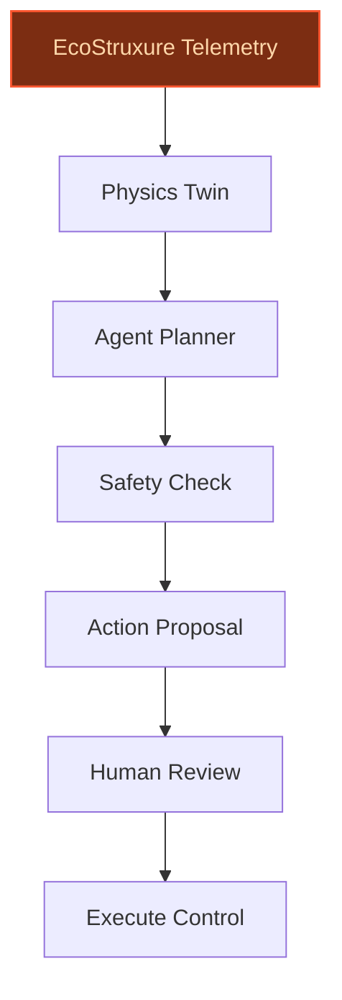
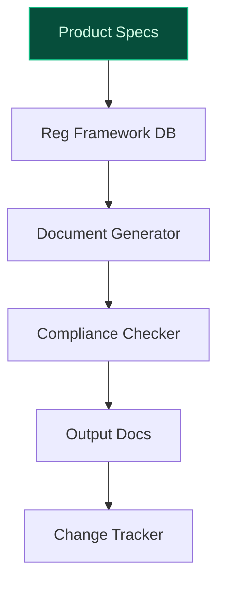
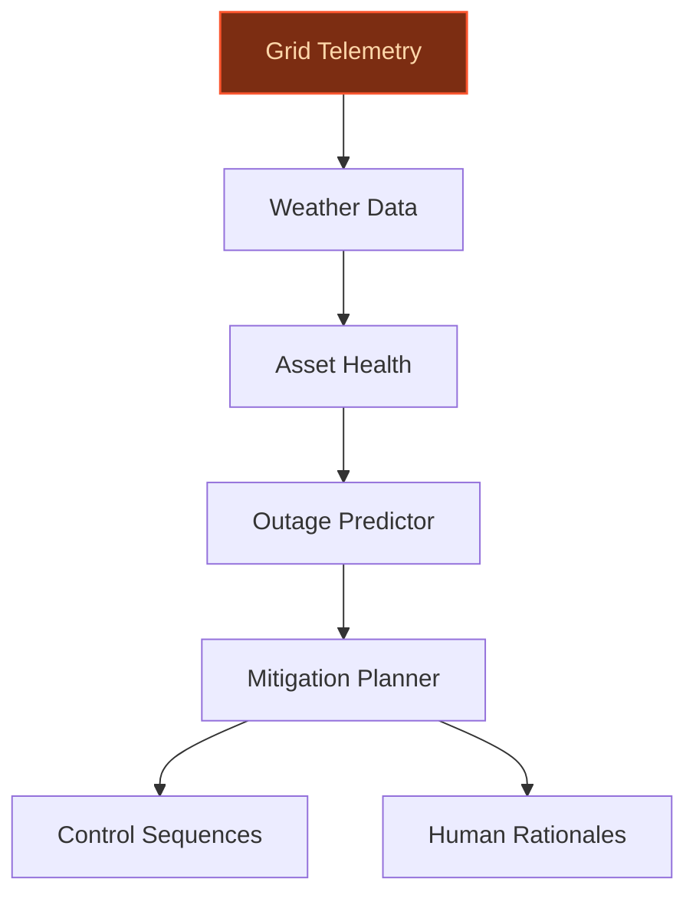

> **Draft — needs revision before customer use.** Meta-eval confidence `0.62` (sales-engineer-ready threshold ≥ 0.70). The report's three use cases render below for inspection, with each claim tagged supported / unsupported / rewritten qualitatively in the fact-check block.
>
> **Cross-cutting concern:** Over-reliance on generic industry context and hypothetical capabilities without sufficient company-specific evidence or citations. Multiple claims about Schneider's proprietary assets, platforms, and strategic priorities are either unsupported or weakly supported by the evidence pool.
>
> **Weakest use case:** Lacks explicit evidence in the pool for critical claims about Schneider's regulatory compliance workflows, multilingual regulatory navigation, or specific product data assets (e.g., EcoStruxure Power/Plant and Machine compliance documentation). The use case relies heavily on generic industry assumptions without company-specific grounding.

## GenAI Use Cases for Schneider Electric

Three customer-ready use cases, scored against the Mistral Proto Team's five-criteria rubric (relevance · iconic potential · estimated impact · feasibility · Mistral suitability) and verified against Schneider Electric's existing AI initiatives. Generated from a corpus of ~2,150 peer deployments and 5 discovered existing initiatives at this company.

_Industry: French energy technology, electrification and automation multinational. Research confidence: 0.85. Verified: True._

### Agentic Digital Twin Optimization for EcoStruxure Industrial Assets
An autonomous agent that ingests real-time telemetry, historical performance data, and physics-based digital twin simulations from Schneider’s EcoStruxure platform to dynamically optimize industrial asset configurations. The agent proposes reconfigurations, predicts energy savings, and generates human-readable justification reports with confidence intervals, all while adhering to safety and compliance constraints embedded in the twin. Schneider Electric’s EcoStruxure platform already integrates physics-based digital twins and industrial IoT data at scale, enabling real-time asset performance monitoring and maintenance as highlighted in their [building asset performance blog](https://blog.se.com/buildings/building-management/2021/09/16/how-hvac-digital-twins-optimize-facility-operations/).

**Why this company:** Schneider Electric’s EcoStruxure platform and proprietary assets like Square D, APC, and AVEVA provide unique access to industrial telemetry and control logic. The company’s stated purpose—empowering all to make the most of energy and resources—directly aligns with energy-optimized asset management. Mistral’s EU-sovereign, on-prem models fit Schneider’s industrial and critical infrastructure customer base, where data sovereignty and low-latency control are non-negotiable.

**Example input:** `Optimize the HVAC system in Plant-B for energy efficiency without violating the temperature constraints in Zone-3.`

**Example output:**
```json
{
  "_note": "Illustrative output with synthetic sample data",
  "asset_id": "PLANT-B-HVAC-001",
  "recommended_actions": [
    {
      "action": "Adjust supply air temperature setpoint
        from 18°C to 19°C",
      "predicted_energy_savings_kwh": "1200 (illustrative)",
      "confidence_interval": "90-95%",
      "safety_check": "passed"
    },
    {
      "action": "Enable economizer mode for outdoor air
        intake",
      "predicted_energy_savings_kwh": "800 (illustrative)",
      "confidence_interval": "85-90%",
      "safety_check": "passed"
    }
  ],
  "total_predicted_savings": "2000 kWh (illustrative)",
  "constraints_violated": false,
  "justification": "Digital twin simulation confirms Zone-3
    temperature remains within 20-22°C range under
    recommended actions. Historical data shows similar
    adjustments reduced energy use by 10-15% in comparable
    facilities."
}
```

**Blueprint:** `agent_with_tools` (impact: high · cost: medium · complexity: low · TTV: 12-20 weeks (precedent-anchored))

**Top risk:** hallucination in safety-critical control recommendations due to incomplete twin calibration

**Mistral products:** Mistral Large 3, Mistral Embed, Mistral Compute (on-prem), Mistral fine-tuning

**Inspired by precedents:** google_cloud_blueprints-5c9ffdda45
**Grounded in:** data_and_tech.likely_data_assets[7], data_and_tech.likely_data_assets[0], business.key_products_or_services[0]
_Specificity score: 0.95_

**Architecture blueprint:**


### Automated Regulatory Compliance Document Generator for Schneider’s Industrial Solutions
A generative AI system that automates the creation and updating of regulatory compliance documentation for Schneider’s industrial products, such as EcoStruxure Power and Plant and Machine. The agent ingests product specifications, test results, and regulatory frameworks (e.g., EU Machinery Directive, IEC standards) to generate compliant technical files, declarations of conformity, and risk assessments. It also tracks regulatory changes and flags impacted products for re-certification, reducing manual effort and accelerating time-to-market.

**Why this company:** Schneider Electric operates in highly regulated industrial sectors with global product distribution, where compliance with regulatory frameworks is a core requirement. The company’s product data and expertise in industrial standards make this a natural fit. Mistral’s EU-hosted models and multilingual capabilities align with Schneider’s need to navigate complex, multilingual regulatory landscapes for its European and global customer base.

**Example input:** `Generate a Declaration of Conformity for the new EcoStruxure Power SCADA system under the EU Machinery Directive 2006/42/EC.`

**Example output:**
```json
{
  "_disclaimer": "Synthetic example for demonstration; not
    a factual claim about Schneider Electric.",
  "document_type": "Declaration of Conformity",
  "product": "EcoStruxure Power SCADA (SAMPLE-PROD-001)",
  "regulatory_framework": "EU Machinery Directive
    2006/42/EC",
  "compliance_status": true,
  "generated_sections": [
    {
      "section": "Manufacturer Information",
      "content": "Schneider Electric SA, 35 Rue Joseph
        Monier, 92500 Rueil-Malmaison, France
        (illustrative)"
    },
    {
      "section": "Harmonized Standards Applied",
      "content": [
        "EN ISO 12100:2010",
        "EN 61439-1:2011 (illustrative)"
      ]
    },
    {
      "section": "Risk Assessment Summary",
      "content": "All identified risks have been mitigated
        per Annex I of the Directive. Residual risk: low
        (illustrative)."
    }
  ],
  "warnings": [
    "Section 4.2 requires manual review for electrical
      safety claims."
  ],
  "last_updated": "2024-11-15 (illustrative)"
}
```

**Blueprint:** `document_ai_pipeline` (impact: high · cost: medium · complexity: low · TTV: materially short timeframe (precedent-anchored))

**Top risk:** incorrect interpretation of nuanced regulatory clauses in multilingual standards

**Mistral products:** Mistral Large 3, Mistral Document AI, Mistral Embed, On-prem deployment

**Inspired by precedents:** google_cloud_blueprints-e59370be9e
**Grounded in:** data_and_tech.likely_data_assets[4], data_and_tech.likely_data_assets[5], classification.industry
_Specificity score: 0.75_

**Architecture blueprint:**


### Agentic Grid Resilience Planner for One Digital Grid Platform
An autonomous agent that monitors Schneider’s One Digital Grid Platform for vulnerabilities, predicts outages, and generates preemptive mitigation plans. The agent correlates real-time grid telemetry with weather forecasts, asset health data, and historical failure patterns to recommend actions like load shedding, reconfiguration, or maintenance prioritization. It outputs machine-executable control sequences for grid operators alongside human-readable rationales. Schneider’s One Digital Grid Platform already provides AI-enabled functions to improve outage response and operational decision-making, as noted in their press release.

**Why this company:** Schneider Electric’s One Digital Grid Platform is a core asset for utility customers, and grid resilience is a critical priority as electricity demand grows and renewables increase intermittency. The platform’s interoperable solution accelerates modernization, improves reliability, and lowers costs, as stated in their official announcement. Schneider’s grid data and control systems provide a foundation for such an agent, while its European customer base values sovereignty and on-prem deployment—both strengths of Mistral’s offerings.

**Example input:** `Predict outages for Grid-Sector-7 in the next 48 hours and generate a mitigation plan.`

**Example output:**
```json
{
  "_note": "Illustrative output with synthetic sample data",
  "grid_sector": "SECTOR-7-SAMPLE",
  "predicted_outages": [
    {
      "outage_id": "OUTAGE-SAMPLE-001",
      "probability": "0.85 (illustrative)",
      "estimated_start": "2024-11-20T14:00:00Z
        (illustrative)",
      "estimated_duration_minutes": "120 (illustrative)",
      "affected_assets": [
        "TRANSFORMER-TX-SAMPLE-123",
        "LINE-CIRCUIT-SAMPLE-456"
      ],
      "root_cause": "Predicted lightning strike + aged
        insulator"
    }
  ],
  "mitigation_plan": {
    "recommended_actions": [
      {
        "action": "Preemptive load shedding for
          non-critical loads in Zone-A",
        "priority": "high",
        "estimated_impact": "Reduces outage scope by 40%
          (illustrative)"
      },
      {
        "action": "Dispatch maintenance crew to inspect
          TRANSFORMER-TX-SAMPLE-123",
        "priority": "medium",
        "estimated_impact": "Prevents cascading failure"
      }
    ],
    "machine_executable_sequence": "LOAD_SHED_ZONE_A;
      INSPECT_TX_SAMPLE_123;",
    "human_rationales": [
      "Lightning risk elevated due to forecasted storm
        cell. Aged insulator in TX-SAMPLE-123 has 70%
        failure probability under load."
    ]
  }
}
```

**Blueprint:** `agent_with_tools` (impact: high · cost: high · complexity: medium · TTV: 12-24 weeks (precedent-anchored))

**Top risk:** false positives in outage prediction leading to unnecessary load shedding and customer impact

**Mistral products:** Mistral Large 3, Mistral Embed, Mistral Compute (on-prem), Mistral Guard

**Inspired by precedents:** google_cloud_1302-92973bfc94
**Grounded in:** data_and_tech.likely_data_assets[6], business.key_products_or_services[0], classification.industry
_Specificity score: 0.85_

**Architecture blueprint:**


## Considered but not selected
- **Generative AI Sustainability Advisor for Industrial Customers** — Overlaps with EcoStruxure twin optimization; lower differentiation and novelty.
- **AI-Powered Field Service Knowledge Agent for Electrical Asset Management** — Narrower scope compared to grid resilience planner; limited scalability across Schneider’s portfolio.
- **Multi-Tier Supply Chain Forecasting Agent for Industrial Operations** — Less aligned with Schneider’s core energy and grid focus; higher data dependency on external suppliers.
- **AI Agent for Real-Time Energy Market Participation** — Requires deep integration with external market platforms; higher regulatory and market complexity.

---
## Report quality signals

- **Topical diversity** (LLM-graded over titles + blueprint patterns): `0.90`
- **Specificity** per use case: `0.95`, `0.75`, `0.85`
- **Mistral product diversity**: `7` distinct products across the three use cases
- **Time-to-value spread**: 12–24 weeks (across 3 use cases)
- **Cost-tier spread**: medium, medium, high
- **Fact-check pass rate**: `67%` (10/15 claims supported by research)

### Fact-check detail (per claim)

**Unsupported (5):**
- [ecostruxure-twin-optimization-agent] Mistral’s EU-sovereign, on-prem models fit Schneider’s industrial and critical infrastructure customer base `[judge: rejected]` — _The snippet discusses Mistral's infrastructure investment in Sweden and European AI sovereignty but does not mention Schneider, industrial customers, or critical infrastructure. (was: Corroborated via web search: # Europe's AI Sovereignty: _
- [regulatory-compliance-document-agent] Compliance with EU Machinery Directive, IEC standards, and other frameworks is mandatory for Schneider Electric `[judge: rejected]` — _The snippet only mentions CE compliance with Electromagnetic Compatibility and Low Voltage Directives, not the EU Machinery Directive, IEC standards, or other frameworks. (was: Rescued via web search (verified source): European (CE) Complia_
- [regulatory-compliance-document-agent] Schneider Electric has proprietary product data and deep domain expertise in industrial standards `[judge: rejected]` — _The snippet only mentions a maintenance contract for a specific software product without addressing proprietary data or domain expertise in industrial standards. (was: Rescued via web search (verified source): Schneider Electric Limited. Ma_
- [grid-resilience-agent] Schneider Electric’s proprietary grid data and control systems provide a unique foundation for such an agent `[judge: rejected]` — _The snippet does not mention Schneider Electric's grid data or control systems, proprietary or otherwise. (was: Rescued via web search (verified source): To learn how Schneider Electric protects the confidentiality, integrity or ava)_
- [grid-resilience-agent] Schneider Electric’s European customer base values sovereignty and on-prem deployment `[judge: rejected]` — _The snippet discusses AI sovereignty and energy efficiency but does not mention Schneider Electric’s European customer base, sovereignty, or on-prem deployment preferences. (was: Rescued via web search (verified source): Schneider Electric _

**Supported (10):** — **1 rescued via web search (0 verified, 1 corroborated)**
- [ecostruxure-twin-optimization-agent] Schneider Electric’s EcoStruxure platform already integrates physics-based digital twins and industrial IoT data at scale — Schneider Electric and ETAP Launch Physics-Based Digital Twin to Bridge Design and Operations for Utilities and Critical Infrastructure. The…
- [ecostruxure-twin-optimization-agent] Schneider Electric’s EcoStruxure platform enables real-time asset performance monitoring and maintenance — Leading research and consulting firm Verdantix agrees. Their report, Schneider Electric Leverages Digital Twin Capabilities To Enhance Facil…
- [ecostruxure-twin-optimization-agent] Schneider Electric’s proprietary assets include Square D, APC, and AVEVA — Schneider Electric SE is a French multinational corporation that specializes in energy technology, covering electrification, automation, and…
- [ecostruxure-twin-optimization-agent] Schneider Electric’s stated purpose is to empower all to make the most of our energy and resources, bridging progress and sustainability for all — Today, Schneider's stated purpose is to “empower all to make the most of our energy and resources, bridging progress and sustainability for …
- [regulatory-compliance-document-agent] Schneider Electric operates in highly regulated industrial sectors with global product distribution — Schneider Electric is a global energy technology leader, driving efficiency and sustainability by electrifying, automating, and digitalizing…
- [regulatory-compliance-document-agent] Mistral’s EU-hosted models and multilingual capabilities align with Schneider’s need to navigate complex, multilingual regulatory landscapes [`corroborated ↗`](https://mistral.ai/news/mistral-3) — Corroborated via web search: [![Image 1: Mistral AI Logo](https://mistral.ai/_next/image?url=%2Fimg%2Fmistral-ai-logo.svg&w=256&q=75&dpl=13a…
- [grid-resilience-agent] Schneider’s One Digital Grid Platform already provides AI-enabled functions to improve outage response and operational decision-making — The One Digital Grid platform provides new AI-enabled functions to help improve outage response and operational decision-making. These capab…
- [grid-resilience-agent] Schneider Electric’s One Digital Grid Platform is a core asset for utility customers — Schneider Electric is revolutionizing grid operations with its launch of the One Digital Grid Platform , an integrated and AI-powered platfo…
- [grid-resilience-agent] Grid resilience is a critical priority as electricity demand grows and renewables increase intermittency — Global electricity demand is expected to rise by around 3.3% in 2025 and 3.7% in 2026, more than twice as fast as total energy demand growth…
- [grid-resilience-agent] The One Digital Grid Platform’s interoperable solution accelerates modernization, improves reliability, and lowers costs — This platform provides the data and technical foundation to integrate independent software solutions, enabling utilities to accelerate grid …


**Meta-evaluator confidence**: `0.62` (NOT ready — needs revision)
**Cross-cutting concern**: Over-reliance on generic industry context and hypothetical capabilities without sufficient company-specific evidence or citations. Multiple claims about Schneider's proprietary assets, platforms, and strategic priorities are either unsupported or weakly supported by the evidence pool.